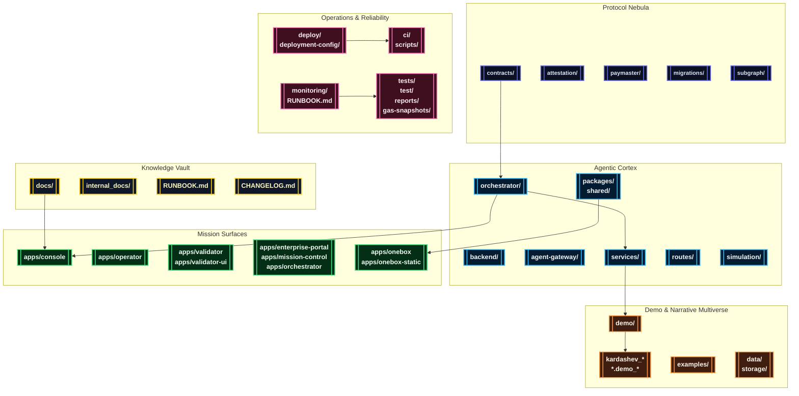

# AGI Jobs v0 (v2)

[](LICENSE)
[](https://github.com/MontrealAI/AGIJobsv0/actions/workflows/ci.yml)
[](https://github.com/MontrealAI/AGIJobsv0/actions/workflows/ci.yml?query=branch%3Amain+workflow%3A%22ci+%28v2%29%22)
[](SECURITY.md)

> AGI Jobs v0 (v2) is the production-grade superintelligent machine for sovereign AGI labour markets: an orchestrator that compounds intelligence, economics, governance, and cinematic storytelling into a single deployable system.

## 🧭 Stellar Navigation
- [🌌 Mission Declaration](#-mission-declaration)
- [🛰️ System Nebula](#-system-nebula)
- [🗂️ Repository Atlas](#-repository-atlas)
- [🚀 Launch Protocols](#-launch-protocols)
  - [Requirements](#requirements)
  - [Bootstrap the Monorepo](#bootstrap-the-monorepo)
  - [Manual Bring-Up](#manual-bring-up)
  - [Mission Control via Docker Compose](#mission-control-via-docker-compose)
  - [Key Service Endpoints](#key-service-endpoints)
  - [Automation Playbooks](#automation-playbooks)
- [🎞️ Demo Constellation](#-demo-constellation)
  - [Meridian Launches](#meridian-launches)
  - [Economics & Governance](#economics--governance)
  - [Culture, Experience & Media](#culture-experience--media)
  - [Sovereign & Kardashev Expeditions](#sovereign--kardashev-expeditions)
  - [Omega & Supra-Sovereign Ascension](#omega--supra-sovereign-ascension)
  - [Research & Simulation Labs](#research--simulation-labs)
- [🧬 Python Bridge Packages](#-python-bridge-packages)
- [🧪 Continuous Assurance & CI](#-continuous-assurance--ci)
- [📡 Operations & Observability](#-operations--observability)
- [📚 Documentation Signals](#-documentation-signals)

## 🌌 Mission Declaration
AGI Jobs v0 (v2) is designed for non-technical launch crews who must operate a world-shaping intelligence platform without compromising on safety or velocity. Every directory in this monorepo participates in the same production narrative:

- **Upgradeable protocol nebula** of Solidity, Hardhat, Foundry, EAS attestations, paymaster relays, and a subgraph indexer ready for chain migrations.
- **Agentic intelligence fabric** that binds orchestrators, validator swarms, guardrails, analytics, and shared SDKs into a single programmable cortex.
- **Mission surfaces** (Next.js HUDs, cinematic operator decks, OneBox runners) that render governance, validator operations, and stakeholder experiences.
- **Demo multiverse** that demonstrates each civilization step—from day-one onboarding to Kardashev II ascension—through reproducible scripts, CLI walkthroughs, and filmic exports.
- **Observability and assurance** instrumentation that keeps every release verifiable, with green CI gates enforced across pull requests and the `main` branch.

## 🛰️ System Nebula


## 🗂️ Repository Atlas
| Domain | Primary Paths | Highlights |
| --- | --- | --- |
| Protocol & Chain Control | [`contracts/`](contracts/), [`attestation/`](attestation/), [`paymaster/`](paymaster/), [`migrations/`](migrations/), [`subgraph/`](subgraph/) | Upgradeable Solidity core, Foundry and Hardhat pipelines, attestations, relayers, subgraph indexers, gas analyses. |
| Agent Intelligence Fabric | [`orchestrator/`](orchestrator/), [`backend/`](backend/), [`agent-gateway/`](agent-gateway/), [`services/`](services/), [`routes/`](routes/), [`packages/`](packages/), [`shared/`](shared/) | Meta-agent frameworks, validator swarms, FastAPI & Node microservices, event processors, reusable SDKs. |
| Mission Consoles & Portals | [`apps/console`](apps/console), [`apps/operator`](apps/operator), [`apps/validator`](apps/validator), [`apps/validator-ui`](apps/validator-ui), [`apps/enterprise-portal`](apps/enterprise-portal), [`apps/mission-control`](apps/mission-control), [`apps/orchestrator`](apps/orchestrator) | Next.js, Chakra, and cinematic HUDs for operators, validators, enterprise partners, and orchestration crews. |
| OneBox & Agent Runner Kits | [`apps/onebox`](apps/onebox), [`apps/onebox-static`](apps/onebox-static), [`demo/One-Box`](demo/One-Box), [`examples/agentic`](examples/agentic) | Self-contained mission runner with CLI diagnostics, orchestrator harness, WebSocket bridges, and validator readiness flows. |
| Demo Multiverse | [`demo/`](demo/), [`kardashev_*`](./), [`*.demo_*`](./), [`simulation/`](simulation/), [`data/`](data/), [`storage/`](storage/) | Cinematic expeditions, national roll-outs, Kardashev upgrades, Monte Carlo simulators, narrative datasets. |
| Operations & Assurance | [`ci/`](ci/), [`deploy/`](deploy/), [`deployment-config/`](deployment-config/), [`monitoring/`](monitoring/), [`scripts/`](scripts/), [`tests/`](tests/), [`test/`](test/), [`reports/`](reports/) | GitHub Actions, branch protection checks, one-click infrastructure, telemetry stacks, integration suites, SBOM automation. |
| Knowledge Base | [`docs/`](docs/), [`internal_docs/`](internal_docs/), [`RUNBOOK.md`](RUNBOOK.md), [`SECURITY.md`](SECURITY.md), [`MIGRATION.md`](MIGRATION.md), [`CHANGELOG.md`](CHANGELOG.md) | Architecture briefings, production playbooks, compliance dossiers, migration histories, cinematic treatments. |

## 🚀 Launch Protocols

### Requirements
- **Node.js 20.18.1** + npm 10.x (`nvm install` and `nvm use` respect the repository `.nvmrc`).
- **Python 3.12+** with `pip` for agentic services and Python-first demos.
- **Foundry** (`forge`, `anvil`) for contract compilation, fuzzing, and gas profiling.
- **Docker & Docker Compose** for mission control clusters and demo orchestration.
- **Git LFS** (optional) for large cinematic payloads in [`data/`](data/) and [`storage/`](storage/).

### Bootstrap the Monorepo
```bash
nvm install && nvm use
npm ci
python -m pip install --upgrade pip
python -m pip install -r requirements-python.txt
python -m pip install -r requirements-agent.txt
```
Many demos ship additional `requirements.txt` or environment scripts inside their directories (see [`demo/**/README.md`](demo)).

### Manual Bring-Up
```bash
# Terminal 1 — build core artefacts
npm run build

# Terminal 2 — launch a local development chain
anvil --chain-id 31337 --block-time 2

# Terminal 3 — deploy protocol v2 and bootstrap modules
npx hardhat run --network localhost scripts/v2/deploy.ts

# Terminal 4 — start mission-critical services
uvicorn services.meta_api.app.main:app --reload --port 8000
npm run agent:gateway
npm run agent:validator
npm --prefix apps/console run dev
```
Consult [`docs/quick-start.md`](docs/quick-start.md), [`docs/AGENTIC_QUICKSTART.md`](docs/AGENTIC_QUICKSTART.md), and [`docs/onebox/`](docs/onebox/) for orchestrator credentials, validator keys, and wallet hygiene.

### Mission Control via Docker Compose
```bash
cp deployment-config/oneclick.env.example deployment-config/oneclick.env
# Populate RPC URLs, private keys, relayer secrets, and telemetry tokens

docker compose up --build
```
Use `docker compose down -v` to reset the cluster. Compose wiring honours defaults from [`deployment-config/oneclick.env`](deployment-config/oneclick.env).

### Key Service Endpoints
| Service | Default URL | Notes |
| --- | --- | --- |
| Local Anvil Testnet | `http://localhost:8545` | Hardhat/Foundry-compatible development chain. |
| Meta API (FastAPI) | `http://localhost:8000` | Mission telemetry, orchestrator analytics, OneBox health. |
| Orchestrator / OneBox APIs | `http://localhost:8080` | Unified orchestration ingress and OneBox runner services. |
| Agent Gateway | `http://localhost:8090` | REST + WebSocket bridge for agent swarms (`npm run agent:gateway`). |
| Mission Console UI | `http://localhost:3000` | Operator HUD (`apps/console`). |
| Enterprise Portal | `http://localhost:3001` | Partner & enterprise oversight (`apps/enterprise-portal`). |

### Automation Playbooks
- [`Makefile`](Makefile) targets cover Culture deployments (`make culture-bootstrap`), Huxley-Gödel machine drills (`make demo-hgm`), and Absolute Zero simulations (`make absolute-zero-demo`).
- [`scripts/`](scripts/) contains deployment aides, CI verifiers, sovereign readiness checks, cinematic export tooling, and branch-protection probes.
- [`examples/`](examples/) provides agentic starter kits (validator swarms, orchestration loops) runnable via `npm run agent:*` scripts.

## 🎞️ Demo Constellation
```mermaid
%% Celestial demo atlas
mindmap
  classDef launch fill:#0f172a,stroke:#38bdf8,color:#e0f2fe,font-weight:bold,stroke-width:2px;
  classDef economics fill:#1f2937,stroke:#f97316,color:#fff7ed,font-weight:bold,stroke-width:2px;
  classDef culture fill:#22092c,stroke:#f472b6,color:#fff0f6,font-weight:bold,stroke-width:2px;
  classDef sovereign fill:#1c1917,stroke:#facc15,color:#fef9c3,font-weight:bold,stroke-width:2px;
  classDef omega fill:#111827,stroke:#a855f7,color:#ede9fe,font-weight:bold,stroke-width:2px;
  classDef research fill:#052e16,stroke:#4ade80,color:#f0fdf4,font-weight:bold,stroke-width:2px;
  classDef galaxy fill:#020617,stroke:#38bdf8,color:#e2e8f0,font-size:22px,font-weight:bold,stroke-width:3px;
  classDef link fill:#0f172a,stroke:#38bdf8,color:#e0f2fe,font-weight:bold;

  root((🌌 Demo Constellation)):::galaxy
    "Meridian Launches 🚀":::launch
      "AGI-Alpha-Node-v0"
      "Validator-Constellation-v0"
      "AGIJobs-Day-One-Utility-Benchmark"
      "Meta-Agentic-ALPHA-AGI-Jobs-v0"
      "agi-governance multiverse"
      "asi-global"
      "asi-takeoff"
      "One-Box"
    "Economics & Governance 💱":::economics
      "Economic-Power-v0"
      "Trustless-Economic-Core-v0"
      "AGI-Jobs-Platform-at-Kardashev-II-Scale"
      "REDENOMINATION"
      "Phase-6 Multi-Domain Expansion"
      "Phase-8 Universal Value Dominance"
      "National-Supply-Chain-v0"
      "agi-labor-market-grand-demo"
    "Culture & Experience ✨":::culture
      "Era-Of-Experience-v0"
      "CULTURE-v0"
      "AlphaEvolve-v0"
      "AlphaEvolve_v0"
      "aurora"
      "ICONIC-OPERATING-SYSTEM-DEMO"
      "Huxley-Godel-Machine-v0"
    "Sovereign & Kardashev 👑":::sovereign
      "Planetary-Orchestrator-Fabric-v0"
      "sovereign-constellation"
      "sovereign-mesh"
      "zenith-sapience-initiative-*"
      "TRIDENT-SOVEREIGN-AGI-ORCHESTRATOR"
      "validator_constellation_v0"
    "Omega & Ascension 🜂":::omega
      "Kardashev-II Omega-Grade-α-AGI Business-3"
      "Meta-Agentic-Program-Synthesis-v0"
      "CELESTIAL-SOVEREIGN-ORBITAL-AGI-OS-GRAND-DEMONSTRATION"
      "OMNIPHOENIX-ASCENDANT-HYPERSTRUCTURE"
      "OMNIGENESIS-GLOBAL-SOVEREIGN-SYMPHONY"
      "astral-omnidominion-operating-system"
      "imperatrix-celestia-operating-system"
      "cosmic-omni-sovereign-symphony"
      "omni-orchestrator-singularity"
    "Research & Simulation 🔬":::research
      "Absolute-Zero-Reasoner-v0"
      "MuZero-style-v0"
      "Open-Endedness-v0"
      "Tiny-Recursive-Model-v0"
      "Simulation Toolkit"
      "huxley_godel_machine_v0"
```

Every constellation lives under [`demo/`](demo/). Launchers expose npm scripts, Python entry points, shell orchestrations, or Make targets so crews can replay the experience without bespoke setup.

### Meridian Launches
| Demo | Location | Command |
| --- | --- | --- |
| AGI Alpha Node | [`demo/AGI-Alpha-Node-v0`](demo/AGI-Alpha-Node-v0) | `npm run demo:agi-alpha-node` (CLI) or `npm run demo:agi-alpha-node:prod` (bundled). |
| Validator Constellation | [`demo/Validator-Constellation-v0`](demo/Validator-Constellation-v0) | `npm run demo:validator-constellation` or `npm run demo:validator-constellation:scenario`. |
| AGIJobs Day-One Utility Benchmark | [`demo/AGIJobs-Day-One-Utility-Benchmark`](demo/AGIJobs-Day-One-Utility-Benchmark) | `python demo/AGIJobs-Day-One-Utility-Benchmark/run_demo.py --scenario cinematic`. |
| Meta-Agentic Alpha AGI | [`demo/Meta-Agentic-ALPHA-AGI-Jobs-v0`](demo/Meta-Agentic-ALPHA-AGI-Jobs-v0) | `npm run demo:meta-agentic-alpha`. |
| AGI Governance Multiverse | [`demo/agi-governance`](demo/agi-governance) | `npm run demo:agi-governance:full` or `npm run demo:agi-governance:ci`. |
| ASI Programs | [`demo/asi-global`](demo/asi-global), [`demo/asi-takeoff`](demo/asi-takeoff) | `npm run demo:asi-global` / `npm run demo:asi-takeoff` (kits: `:kit`, local shells: `:local`). |
| OneBox Mission Runner | [`demo/One-Box`](demo/One-Box) | `npm run demo:onebox:doctor` then `npm run demo:onebox:launch`; Docker: `docker compose -f demo/One-Box/docker-compose.yaml up`. |

### Economics & Governance
| Demo | Location | Command |
| --- | --- | --- |
| Economic Power | [`demo/Economic-Power-v0`](demo/Economic-Power-v0) | `npm run demo:economic-power` (CI variant: `npm run demo:economic-power:ci`). |
| Trustless Economic Core | [`demo/Trustless-Economic-Core-v0`](demo/Trustless-Economic-Core-v0) | `npm run run:trustless-core`. |
| AGI Jobs Platform (Kardashev II) | [`demo/AGI-Jobs-Platform-at-Kardashev-II-Scale`](demo/AGI-Jobs-Platform-at-Kardashev-II-Scale) | `npm run demo:kardashev` or lattice orchestrations via `npm run demo:kardashev-ii-lattice:orchestrate`. |
| REDENOMINATION | [`demo/REDENOMINATION`](demo/REDENOMINATION) | `npm run demo:redenomination` plus `:guardian-drill`, `:mission-control`, and `:owner-console`. |
| Phase 6 / Phase 8 Scaling | [`demo/Phase-6-Scaling-Multi-Domain-Expansion`](demo/Phase-6-Scaling-Multi-Domain-Expansion), [`demo/Phase-8-Universal-Value-Dominance`](demo/Phase-8-Universal-Value-Dominance) | `npm run demo:phase6:orchestrate`, `npm run demo:phase8:orchestrate`. |
| National Supply Chain | [`demo/National-Supply-Chain-v0`](demo/National-Supply-Chain-v0) | `npm run demo:national-supply-chain` with specialist variants (`:control-room`, `:validate`). |
| AGI Labor Market Grand Demo | [`demo/agi-labor-market-grand-demo`](demo/agi-labor-market-grand-demo) | `npm run demo:agi-labor-market` and export/mission control variants. |

### Culture, Experience & Media
| Demo | Location | Command |
| --- | --- | --- |
| Era of Experience | [`demo/Era-Of-Experience-v0`](demo/Era-Of-Experience-v0) | `npm run demo:era-of-experience`, with `:audit` and `:verify` extensions. |
| CULTURE v0 | [`demo/CULTURE-v0`](demo/CULTURE-v0) | Explore scripts and design atlases in `scripts/` and `artifacts/`. |
| AlphaEvolve Suites | [`demo/AlphaEvolve-v0`](demo/AlphaEvolve-v0), [`demo/AlphaEvolve_v0`](demo/AlphaEvolve_v0) | Evolutionary manifests and cinematic exports (see `README.md` inside each demo). |
| Aurora Media System | [`demo/aurora`](demo/aurora) | `npm run demo:aurora:local`, `npm run demo:aurora:report`, or Sepolia showcase via `npm run demo:aurora:sepolia`. |
| Iconic Operating System | [`demo/ICONIC-OPERATING-SYSTEM-DEMO`](demo/ICONIC-OPERATING-SYSTEM-DEMO) | Operator decks, mission storyboards, and CLI tours. |
| Huxley-Gödel Machine | [`demo/Huxley-Godel-Machine-v0`](demo/Huxley-Godel-Machine-v0) | `make demo-hgm`, `make hgm-owner-console`, or `make demo-agialpha`. |

### Sovereign & Kardashev Expeditions
| Demo | Location | Command |
| --- | --- | --- |
| Planetary Orchestrator Fabric | [`demo/Planetary-Orchestrator-Fabric-v0`](demo/Planetary-Orchestrator-Fabric-v0) | `npm run demo:planetary-orchestrator-fabric` (CI: `:ci`, restart drill: `:restart`). |
| Sovereign Constellation | [`demo/sovereign-constellation`](demo/sovereign-constellation) | `npm run demo:sovereign-constellation:local`, `:atlas`, `:superintelligence`, `:deploy`. |
| Sovereign Mesh | [`demo/sovereign-mesh`](demo/sovereign-mesh) | Sovereign mesh CLI & governance boards (see local scripts). |
| Zenith Sapience Initiatives | [`demo/zenith-sapience-*`](demo) | Launchers under `bin/` (`zenith-hypernova.sh`, `zenith-planetary-os.sh`, etc.). |
| TRIDENT Sovereign Orchestrator | [`demo/TRIDENT-SOVEREIGN-AGI-ORCHESTRATOR`](demo/TRIDENT-SOVEREIGN-AGI-ORCHESTRATOR) | `npm run demo:trident-sovereign`, UI & mainnet modes via `:ui`, `:mainnet`. |
| Validator Constellation Atlas | [`demo/validator_constellation_v0`](demo/validator_constellation_v0) | Supplemental validator strategies and notebooks. |

### Omega & Supra-Sovereign Ascension
| Demo | Location | Command |
| --- | --- | --- |
| Omega Grade Business 3 | [`demo/Kardashev-II Omega-Grade-α-AGI Business-3`](demo/Kardashev-II%20Omega-Grade-%CE%B1-AGI%20Business-3), [`kardashev_ii_omega_grade_alpha_agi_business_3_demo*`](./) | `npm run demo:kardashev-ii-omega-upgrade` and `python -m kardashev_ii_omega_grade_alpha_agi_business_3_demo.cli launch --config ...` across v2–v5, ultra, k2, omega variants. |
| Meta-Agentic Program Synthesis | [`demo/Meta-Agentic-Program-Synthesis-v0`](demo/Meta-Agentic-Program-Synthesis-v0) | `npm run demo:meta-agentic-program-synthesis` (see `scripts/`). |
| Celestial Sovereign Orbital OS | [`demo/CELESTIAL-SOVEREIGN-ORBITAL-AGI-OS-GRAND-DEMONSTRATION`](demo/CELESTIAL-SOVEREIGN-ORBITAL-AGI-OS-GRAND-DEMONSTRATION) | Orbital sovereignty OS showcase with cinematic exports. |
| Omni Ascension Hyperstructures | [`demo/OMNIPHOENIX-ASCENDANT-HYPERSTRUCTURE`](demo/OMNIPHOENIX-ASCENDANT-HYPERSTRUCTURE), [`demo/OMNIGENESIS-GLOBAL-SOVEREIGN-SYMPHONY`](demo/OMNIGENESIS-GLOBAL-SOVEREIGN-SYMPHONY), [`demo/omni-sovereign-ascension-operating-system`](demo/omni-sovereign-ascension-operating-system) | Bash launchers inside `bin/` orchestrate supra-sovereign ascension. |
| Astral & Imperatrix Systems | [`demo/astral-omnidominion-operating-system`](demo/astral-omnidominion-operating-system), [`demo/astral-omnidominion-operating-system-command-theatre`](demo/astral-omnidominion-operating-system-command-theatre), [`demo/imperatrix-celestia-operating-system`](demo/imperatrix-celestia-operating-system), [`demo/omni-orchestrator-singularity`](demo/omni-orchestrator-singularity) | Command theatres and sovereign OS suites ready for immediate playback. |
| Cosmic Symphonies | [`demo/cosmic-omni-sovereign-symphony`](demo/cosmic-omni-sovereign-symphony), [`demo/cosmic-omniversal-grand-symphony`](demo/cosmic-omniversal-grand-symphony), [`demo/infinity-symphony`](demo/infinity-symphony), [`demo/omnisovereign`](demo/omnisovereign) | Flagship scripts (`demo/cosmic-omni-sovereign-symphony/bin/flagship-demo.sh`) and narrative atlases. |

### Research & Simulation Labs
| Demo | Location | Command |
| --- | --- | --- |
| Absolute Zero Reasoner | [`demo/Absolute-Zero-Reasoner-v0`](demo/Absolute-Zero-Reasoner-v0) | `make absolute-zero-demo`. |
| MuZero-style Mission | [`demo/MuZero-style-v0`](demo/MuZero-style-v0) | `python demo/MuZero-style-v0/scripts/run_demo.py` with config profiles in `config/`. |
| Open-Endedness | [`demo/Open-Endedness-v0`](demo/Open-Endedness-v0) | `python demo/Open-Endedness-v0/run_demo.py` for meta-learning sandboxes. |
| Tiny Recursive Model | [`demo/Tiny-Recursive-Model-v0`](demo/Tiny-Recursive-Model-v0) | Minimal recursion demos and policy sketches. |
| Simulation Toolkit | [`simulation/`](simulation/) | `python simulation/run_sharded_simulation.py` for Monte Carlo harnesses. |
| Huxley-Gödel Machine Toolkit | [`demo/huxley_godel_machine_v0`](demo/huxley_godel_machine_v0) | `python -m demo.huxley_godel_machine_v0.simulator`. |

## 🧬 Python Bridge Packages
Installable top-level packages (for example [`kardashev_ii_omega_grade_alpha_agi_business_3_demo`](kardashev_ii_omega_grade_alpha_agi_business_3_demo)) re-export their sibling `demo/**` modules. After `pip install -e .`, you can execute the experiences via `python -m <package>.cli` while keeping cinematic assets under [`demo/`](demo/).

## 🧪 Continuous Assurance & CI
- **Green CI Gates** – [`ci/workflows/ci.yml`](ci/workflows/ci.yml) enforces linting, testing, type-checking, SBOM generation, and demo smoke suites on every PR and on `main`.
- **JavaScript / TypeScript** – `npm run lint`, `npm run webapp:typecheck`, `npm run webapp:e2e`, and `npm run pretest` harden console surfaces, OneBox diagnostics, and demo verifiers.
- **Contracts & Chain Logic** – `npm run test`, `forge test`, and targeted Hardhat suites (`npm run test:fork`, `npm run test:alpha-agi-mark`) validate protocol upgrades and sovereign controls.
- **Python & Agent Services** – `PYTEST_DISABLE_PLUGIN_AUTOLOAD=1 pytest` spans `tests/`, `test/`, and demo-specific suites; additional CLI verifiers live under `scripts/v2/`.
- **Security & Supply Chain** – `npm run security:audit`, `npm run sbom:generate`, `npm run release:manifest:validate`, and license verifiers within [`ci/`](ci/) sustain production trust.
- **Branch Protection Checks** – `npm run ci:verify-branch-protection` (in [`scripts/ci`](scripts/ci)) ensures all CI (v2) workflows remain mandatory before merges.

## 📡 Operations & Observability
- One-click deployments and infra recipes live in [`deploy/`](deploy/) and [`deployment-config/`](deployment-config/).
- Alerting, notification, sentinel, and thermostat services operate under [`services/alerting`](services/alerting), [`services/notifications`](services/notifications), [`services/sentinel`](services/sentinel), and [`services/thermostat`](services/thermostat).
- Runtime telemetry, Prometheus metrics, and Grafana dashboards are curated in [`monitoring/`](monitoring/).
- [`RUNBOOK.md`](RUNBOOK.md) orchestrates incident drills; [`docs/AGIJobs-v2-Mainnet-Guide.md`](docs/AGIJobs-v2-Mainnet-Guide.md) captures production launch procedures.

## 📚 Documentation Signals
Dive deeper through the knowledge base:
- [`docs/AGI_Jobs_v0_Whitepaper_v2.md`](docs/AGI_Jobs_v0_Whitepaper_v2.md) – protocol thesis, macroeconomics, and sovereign operating doctrine.
- [`docs/AGIJobsAlphav3.md`](docs/AGIJobsAlphav3.md) – historical release dossiers and architectural evolution.
- [`docs/owner-control-quick-reference.md`](docs/owner-control-quick-reference.md) & [`docs/owner-control-quick-reference-cli.md`](docs/owner-control-quick-reference-cli.md) – owner command centre checklists.
- [`MIGRATION.md`](MIGRATION.md), [`CHANGELOG.md`](CHANGELOG.md), and [`SECURITY.md`](SECURITY.md) – upgrade trails, release rituals, and security posture.
- [`internal_docs/`](internal_docs/) – sovereign readiness dossiers, cinematic treatments, and design reviews.

This README maps every galaxy in AGI Jobs v0 (v2) so that any mission crew—technical or otherwise—can deploy, operate, and narrate the most powerful intelligence machine on Earth.
