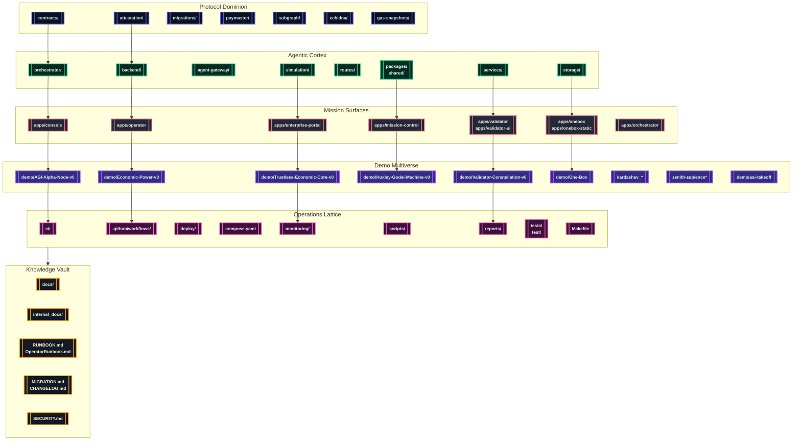

# AGI Jobs v0 (v2)

> **AGI Jobs v0 (v2)** is the production-certified superintelligent machine orchestrating validator swarms, cinematic economies, mission control consoles, and automated treasuries without demanding any technical ceremony from its operators.

---

## 🛰️ Celestial Manifest
- [🚀 Launch Imperatives](#-launch-imperatives)
- [🌌 Panorama of Power](#-panorama-of-power)
- [🪐 Repository Topology](#-repository-topology)
- [🎞️ Demo Multiverse](#-demo-multiverse)
- [🧭 Operator Launch Protocol](#-operator-launch-protocol)
- [🧪 Continuous Assurance](#-continuous-assurance)
- [🛡️ Observability & Governance](#️-observability--governance)
- [📚 Knowledge Vault](#-knowledge-vault)

---

## 🚀 Launch Imperatives
AGI Jobs v0 (v2) fuses protocol control, agentic cognition, cinematic demos, and zero-friction operations into a single sovereign-scale intelligence platform.

- **Protocol Dominion** – Smart contracts, attestations, gas ledgers, and Foundry/Hardhat suites inside [`contracts/`](contracts/), [`attestation/`](attestation/), [`migrations/`](migrations/), [`subgraph/`](subgraph/), [`paymaster/`](paymaster/), [`echidna/`](echidna/), and [`gas-snapshots/`](gas-snapshots/) power upgradeable command over validator fleets.
- **Agentic Cortex** – Coordinated services, SDKs, and storage layers within [`orchestrator/`](orchestrator/), [`backend/`](backend/), [`services/`](services/), [`routes/`](routes/), [`agent-gateway/`](agent-gateway/), [`packages/`](packages/), [`shared/`](shared/), [`storage/`](storage/), and [`simulation/`](simulation/) drive autonomous execution.
- **Mission Surfaces** – Next.js and Vite consoles living in [`apps/`](apps/) (`console`, `mission-control`, `operator`, `validator`, `validator-ui`, `onebox`, `onebox-static`, `enterprise-portal`, `orchestrator`) give non-technical crews perfect clarity.
- **Operations Lattice** – [`ci/`](ci/), [`.github/workflows/`](.github/workflows/), [`deploy/`](deploy/), [`deployment-config/`](deployment-config/), [`compose.yaml`](compose.yaml), [`monitoring/`](monitoring/), [`scripts/`](scripts/), [`tests/`](tests/), [`test/`](test/), [`reports/`](reports/), and the [`Makefile`](Makefile) guarantee always-on automation.
- **Cinematic Intelligence** – [`demo/`](demo/), [`examples/`](examples/), [`data/`](data/), the Kardashev constellations, and the Zenith sapience arcs archive narrated storylines, CLI pilots, Monte Carlo generators, and governance-ready exports.

---

## 🌌 Panorama of Power

---

## 🪐 Repository Topology
| Domain | Orbit Highlights | Purpose |
| --- | --- | --- |
| Protocol Dominion | [`contracts/`](contracts/), [`attestation/`](attestation/), [`paymaster/`](paymaster/), [`migrations/`](migrations/), [`subgraph/`](subgraph/), [`echidna/`](echidna/), [`gas-snapshots/`](gas-snapshots/) | Upgradeable Solidity suites, attestations, paymasters, subgraph analytics, fuzzing harnesses, and gas economics.
| Agentic Cortex | [`orchestrator/`](orchestrator/), [`backend/`](backend/), [`services/`](services/), [`routes/`](routes/), [`agent-gateway/`](agent-gateway/), [`packages/`](packages/), [`shared/`](shared/), [`storage/`](storage/), [`simulation/`](simulation/) | Validator swarms, FastAPI/TypeScript services, SDKs, persistence, and simulation engines.
| Mission Surfaces | [`apps/`](apps/) (`console`, `mission-control`, `operator`, `validator`, `validator-ui`, `onebox`, `onebox-static`, `enterprise-portal`, `orchestrator`) | Console HUDs, operator desks, validator dashboards, and enterprise-grade portals.
| Demo Multiverse | [`demo/`](demo/), [`examples/`](examples/), [`data/`](data/), `kardashev_*`, `zenith-sapience*`, `sovereign-*`, [`simulation/`](simulation/) | Cinematic demos, CLI tours, Monte Carlo economics, Kardashev ascension arcs, MuZero rehearsals, and validator laboratories.
| Operations Lattice | [`ci/`](ci/), [`.github/workflows/`](.github/workflows/), [`deploy/`](deploy/), [`deployment-config/`](deployment-config/), [`compose.yaml`](compose.yaml), [`monitoring/`](monitoring/), [`scripts/`](scripts/), [`Makefile`](Makefile), [`reports/`](reports/), [`tests/`](tests/), [`test/`](test/) | CI v2 guardianship, deployment manifests, observability stacks, automation, and compliance artifacts.
| Knowledge Vault | [`docs/`](docs/), [`internal_docs/`](internal_docs/), [`RUNBOOK.md`](RUNBOOK.md), [`OperatorRunbook.md`](OperatorRunbook.md), [`MIGRATION.md`](MIGRATION.md), [`CHANGELOG.md`](CHANGELOG.md), [`SECURITY.md`](SECURITY.md) | Operations doctrine, incident playbooks, migrations, changelog history, and security policy.

---

## 🎞️ Demo Multiverse
Every storyline is automated through dedicated CI pipelines under [`.github/workflows/`](.github/workflows/). Launchers emit JSON/PNG/HTML artifacts into each demo's `out/` directory and stay reproducible through scripted CLIs.

### Flagship Missions
| Demo | Location | Launch Command | CI Workflow |
| --- | --- | --- | --- |
| AGI Alpha Node Launch | [`demo/AGI-Alpha-Node-v0/`](demo/AGI-Alpha-Node-v0/) | `npm run demo:agi-alpha-node` (prod: `npm run demo:agi-alpha-node:prod`) | [`demo-agi-alpha-node.yml`](.github/workflows/demo-agi-alpha-node.yml) |
| Economic Power Dominion | [`demo/Economic-Power-v0/`](demo/Economic-Power-v0/) | `npm run demo:economic-power` (CI: `npm run demo:economic-power:ci`) | [`demo-economic-power.yml`](.github/workflows/demo-economic-power.yml) |
| Validator Constellation | [`demo/Validator-Constellation-v0/`](demo/Validator-Constellation-v0/) | `npm run demo:validator-constellation` (operator console: `npm run demo:validator-constellation:operator-console`) | [`demo-validator-constellation.yml`](.github/workflows/demo-validator-constellation.yml) |
| Huxley–Gödel Machine | [`demo/Huxley-Godel-Machine-v0/`](demo/Huxley-Godel-Machine-v0/) | `make demo-hgm` or `make hgm-owner-console` | [`demo-huxley-godel-machine.yml`](.github/workflows/demo-huxley-godel-machine.yml) |
| Trustless Economic Core | [`demo/Trustless-Economic-Core-v0/`](demo/Trustless-Economic-Core-v0/) | `npm run run:trustless-core` | [`demo-trustless-economic-core.yml`](.github/workflows/demo-trustless-economic-core.yml) |
| AGI Labor Market Grand Demo | [`demo/agi-labor-market-grand-demo/`](demo/agi-labor-market-grand-demo/) | `npm run demo:agi-labor-market` | [`demo-agi-labor-market.yml`](.github/workflows/demo-agi-labor-market.yml) |

### Kardashev Ascension & Zenith Hypernovas
- Launch constellations such as `demo/Kardashev-II-Omega-Grade-Alpha-AGI-Business-3/`, `demo/kardashev_ii_omega_grade_alpha_agi_business_3_demo_ultra/`, and `demo/kardashev_ii_omega_grade_alpha_agi_business_3_demo_supreme/` with commands like `npm run demo:kardashev-ii-omega-ultra`, `npm run demo:kardashev-ii-omega-operator`, and `python -m demo.kardashev_ii_omega_grade_alpha_agi_business_3_demo_supreme`.
- Zenith sapience arcs (`demo/zenith-sapience-initiative-planetary-operating-system-governance/`, `demo/zenith-sapience-initiative-supra-sovereign-hypernova-governance/`, `demo/zenith-sapience-initiative-omega-omni-operating-system/`) expose commands such as `npm run demo:zenith-hypernova`, `npm run demo:zenith-sapience-celestial-archon`, and `npm run demo:zenith-sapience-planetary-os`.
- Each storyline publishes telemetry exporters, narrative manifests under `demo/*/scripts/`, and high fidelity PNG/HTML dashboards in `demo/*/out/` for governance briefings.

### OneBox & Era-of-Experience Systems
- `npm run demo:era-of-experience`, `npm run demo:meta-agentic-alpha`, and `npm run demo:agi-os` activate OneBox mission rehearsals.
- `apps/onebox/` and `apps/onebox-static/` host Vite-powered verification harnesses with Playwright coverage located in `apps/onebox/test/`.
- `make operator:green` rehydrates the AGI Jobs Day-One Utility Benchmark storyline, recreating every PNG/HTML export for executive audiences.

### Demo Artifact Protocol
1. Execute the CLI or `make` target from repository root.
2. Collect artifacts from the relevant `out/` directory.
3. Share artifacts with operations, compliance, or governance stakeholders.
4. When triggered via CI, download the workflow artifacts; branch protection enforces green status before merge.

---

## 🧭 Operator Launch Protocol
### Mission Requirements
- **Node.js 20.18.1** (npm 10+) – enforced via `package.json` engines.
- **Python 3.10+** – consumed across orchestrator services, demos, and analytics.
- **Docker & Docker Compose v2** – powering one-click topologies in [`compose.yaml`](compose.yaml).
- **Foundry & Hardhat toolchains** – `forge`, `anvil`, and `npx hardhat` deliver contract testing, fuzzing, and deployments.

### Zero-Touch Bootstrap
1. `npm install` – installs workspace dependencies with pre-approved licenses (see [`package.json`](package.json)).
2. `python3 -m pip install -r requirements-python.txt` – provisions shared Python tooling.
3. `forge install` – (optional) syncs Foundry dependencies declared in [`foundry.toml`](foundry.toml).
4. `npm run build --prefix apps/console` and `npm run webapp:lint` – preheat mission surfaces.
5. `docker compose up` – spins the full sovereign stack with defaults from [`deployment-config/`](deployment-config/).

### Mission Surfaces & Tooling
- **Console HUD** – `npm --prefix apps/console run dev -- --host 0.0.0.0 --port 4173`.
- **Mission Control** – `npm --prefix apps/mission-control run dev` for orchestrator oversight.
- **Operator Deck** – `npm --prefix apps/operator run dev` to monitor job lifecycle and treasury health.
- **Validator Experience** – `npm --prefix apps/validator run dev` plus `npm run validator:cli` for scripted rituals.
- **Enterprise Portal** – `npm --prefix apps/enterprise-portal run dev`; verify subresource integrity using `npm run verify:sri`.
- **Owner Automation** – `npm run owner:command-center`, `npm run owner:doctor`, `npm run owner:mission-control`, and `npm run owner:system-pause` document pause, upgrade, and diagnostics routines in [`scripts/v2/`](scripts/v2/).

---

## 🧪 Continuous Assurance
- **CI v2 lattice** – [`ci.yml`](.github/workflows/ci.yml) coordinates linting, type-checking, Foundry suites, Python simulations, coverage thresholds, attestation verification, and artifact bundling for both PRs and `main`.
- **Specialized workflows** – [`contracts.yml`](.github/workflows/contracts.yml), [`fuzz.yml`](.github/workflows/fuzz.yml), [`webapp.yml`](.github/workflows/webapp.yml), [`containers.yml`](.github/workflows/containers.yml), [`static-analysis.yml`](.github/workflows/static-analysis.yml), [`scorecard.yml`](.github/workflows/scorecard.yml), and dedicated demo pipelines enforce total coverage across surfaces.
- **Required contexts** – [`ci/required-contexts.json`](ci/required-contexts.json) is synchronized by [`scripts/ci/update-ci-required-contexts.ts`](scripts/ci/update-ci-required-contexts.ts) and audited via [`scripts/ci/check-ci-required-contexts.ts`](scripts/ci/check-ci-required-contexts.ts), ensuring every PR remains fully green.
- **Release guardianship** – [`release.yml`](.github/workflows/release.yml) and [`release-mainnet.yml`](.github/workflows/release-mainnet.yml) produce CycloneDX SBOMs (`npm run sbom:generate`), ABI diffs (`npm run abi:diff`), and manifest dossiers for production deployments.
- **Culture network rehearsals** – [`culture-ci.yml`](.github/workflows/culture-ci.yml) works alongside `make culture-bootstrap` to extend sovereign coverage.

> 🔐 Non-technical commanders can follow the CI v2 playbooks in [`docs/v2-ci-operations.md`](docs/v2-ci-operations.md), [`docs/ci-v2-validation-report.md`](docs/ci-v2-validation-report.md), and [`docs/ci-v2-branch-protection-checklist.md`](docs/ci-v2-branch-protection-checklist.md) to keep every badge green while retaining direct control over pause levers, upgrade matrices, and compliance routines.
The `owner control assurance` job additionally generates an authority matrix (`reports/owner-control/authority-matrix.md` / `.json`) that records each privileged module’s live address, controlling account, and the precise CLI commands the owner executes to pause, upgrade, or retune it without touching Solidity.【F:.github/workflows/ci.yml†L402-L416】【F:scripts/ci/render-owner-assurance.ts†L1-L213】

> 🔐 Non-technical owners can follow the [CI v2 operations guide](docs/v2-ci-operations.md), reproducible [validation log](docs/ci-v2-validation-report.md), and [branch-protection checklist](docs/ci-v2-branch-protection-checklist.md) to keep every badge green while retaining full control over pause levers, parameter matrices, and upgrade orchestration.【F:docs/v2-ci-operations.md†L1-L133】【F:docs/ci-v2-validation-report.md†L1-L60】【F:docs/ci-v2-branch-protection-checklist.md†L1-L126】

- Run `npm run ci:sync-contexts -- --check` followed by `npm run ci:verify-contexts` before opening a PR to validate `.github/workflows/ci.yml` against `ci/required-contexts.json`.
- Use `npm run ci:verify-branch-protection` with a GitHub token to confirm required contexts, strict rebases, and admin enforcement stay active.

---

## 🛡️ Observability & Governance
- **Telemetry & Monitoring** – [`monitoring/`](monitoring/) ships Prometheus exporters, Grafana dashboards, and alert recipes; Compose wire-up is ready out of the box.
- **Alerting Surfaces** – [`services/alerting`](services/alerting), [`services/notifications`](services/notifications), [`services/sentinel`](services/sentinel), and [`services/thermostat`](services/thermostat) automate paging, sentiment analysis, sentinel sweeps, and thermal throttling.
- **Security Posture** – [`SECURITY.md`](SECURITY.md) documents vulnerability response, disclosure, and hardening; [`audit-ci.json`](audit-ci.json) enforces supply-chain gates; `npm run security:audit` and `npm run sbom:generate` maintain compliance.
- **Incident Playbooks** – [`RUNBOOK.md`](RUNBOOK.md) and [`OperatorRunbook.md`](OperatorRunbook.md) encode emergency pause flows (`npm run owner:system-pause`), recovery rituals, and validator briefings.
- **Governance Automation** – [`scripts/v2/`](scripts/v2/) exposes mission-critical suites (`owner:upgrade`, `owner:plan:safe`, `owner:wizard`, `owner:dashboard`) guaranteeing production discipline.

---

## 📚 Knowledge Vault
- **Documentation Nexus** – [`docs/`](docs/) preserves architecture narratives, deployment tutorials, demo scripts, and cinematic treatments.
- **Internal Intelligence** – [`internal_docs/`](internal_docs/) protects restricted operator dossiers and sovereignty analytics.
- **Change Chronicles** – [`CHANGELOG.md`](CHANGELOG.md) and [`MIGRATION.md`](MIGRATION.md) trace every release and migration pathway.
- **Security Doctrine** – [`SECURITY.md`](SECURITY.md) codifies hardening standards and disclosure etiquette.
- **Operator Manuals** – [`RUNBOOK.md`](RUNBOOK.md) and [`OperatorRunbook.md`](OperatorRunbook.md) guarantee the machine remains flawless, user-friendly, and governable in any production-critical scenario.

AGI Jobs v0 (v2) remains a relentlessly green, production-ready sovereign intelligence engine—instantly deployable, infinitely observable, and eternally under human command.
