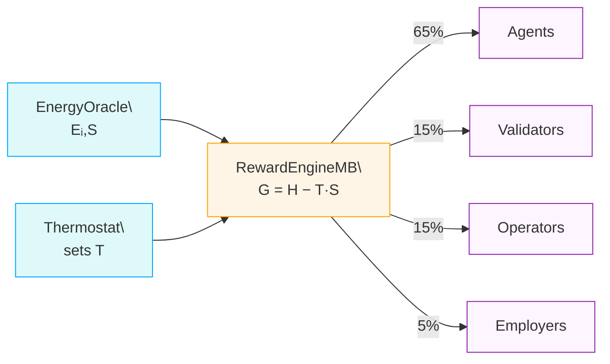

# AGIJob Manager

[](LICENSE) [](https://github.com/MontrealAI/AGIJobsv0/actions/workflows/ci.yml)

AGIJob Manager is an experimental suite of Ethereum smart contracts and tooling for coordinating trustless labour markets among autonomous agents. The **v2** release under `contracts/v2` is the only supported version. Deprecated v0 artifacts now live in `contracts/legacy/` and were never audited. For help migrating older deployments, see [docs/migration-guide.md](docs/migration-guide.md).

> **ENS identity required:** Before participating, each agent or validator must control an ENS subdomain. Agents use `<name>.agent.agi.eth` and validators use `<name>.club.agi.eth`. Follow the [ENS identity setup guide](docs/ens-identity-setup.md) to register and configure your name.

All modules now assume the 18‑decimal `$AGIALPHA` token for payments, stakes and dispute deposits with the token address fixed at deployment. The canonical token is deployed externally; this repository ships [`contracts/test/AGIALPHAToken.sol`](contracts/test/AGIALPHAToken.sol) for local testing only. Token address and decimal configuration live in [`config/agialpha.json`](config/agialpha.json) and feed both Solidity and TypeScript consumers.

## Prerequisites

- Node.js 20.x LTS and npm 10+
- Run `nvm use` to select the version from `.nvmrc`.

## Table of Contents

- [Identity policy](#identity-policy)
- [AGIALPHA configuration](#agialpha-configuration)
- [Fee handling and treasury](#fee-handling-and-treasury)
- [Thermodynamic Incentives](#thermodynamic-incentives)
- [Deploy defaults](#deploy-defaults)
- [Mainnet Deployment](#mainnet-deployment)
- [Migrating from legacy](#migrating-from-legacy)
- [Quick Start](#quick-start)
- [Deployed Addresses](#deployed-addresses)
- [Step‑by‑Step Deployment with $AGIALPHA](#step-by-step-deployment-with-agialpha)
- [Agent/Validator Identity – ENS subdomain registration](#agentvalidator-identity--ens-subdomain-registration)
- [Documentation](#documentation)
- [One-Box UX](#one-box-ux)

### Identity policy

Agents and validators must own ENS subdomains under `agent.agi.eth` and `club.agi.eth`. Owners of `*.alpha.agent.agi.eth` and `*.alpha.club.agi.eth` subdomains enjoy identical permissions—the `IdentityRegistry` treats those aliases as equivalent roots. All workflows perform on-chain verification and bypass mechanisms are reserved for emergency governance only. See [docs/ens-identity-policy.md](docs/ens-identity-policy.md) for details.

> **Sync configuration fast:** Use `npm run identity:update -- --network <network>` to compare the on-chain `IdentityRegistry` state against `config/identity-registry.<network>.json`. The helper adds the `alpha.agent.agi.eth` and `alpha.club.agi.eth` aliases automatically and prints any required updates before executing changes.

> **Emergency allowlists:** The `IdentityRegistry` owner can directly whitelist addresses using `addAdditionalAgent` or `addAdditionalValidator`. These overrides bypass ENS proofs and should only be used to recover from deployment errors or other emergencies.

### AGIALPHA configuration

Token parameters are defined once in [`config/agialpha.json`](config/agialpha.json). Run `npm run compile` after editing this file to regenerate `contracts/v2/Constants.sol` with the canonical token address, symbol, name, decimals, scaling factor and burn address. Any change to `config/agialpha.json` must be followed by `npm run compile` or the constants check in CI will fail.

`npm run compile` validates the configured addresses, ERC‑20 metadata and decimals before writing the Solidity constants. The command halts if the token or burn addresses are malformed, zero (where disallowed), the symbol/name fields are empty or the decimals fall outside the supported `0-255` range, preventing a bad configuration from reaching production contracts.

Run `npm run verify:agialpha -- --rpc <https-url-or-ws-url>` after deployments to cross-check `config/agialpha.json` and `contracts/v2/Constants.sol` against the live `$AGIALPHA` token metadata. The script aborts if the on-chain decimals, symbol or name differ from the committed configuration. Set `VERIFY_RPC_URL` (or `RPC_URL`) to avoid passing `--rpc` on every invocation; use `--timeout <ms>` to override the default 15 s RPC timeout.

### Fee handling and treasury

`JobRegistry` routes protocol fees to `FeePool`, which burns a configurable percentage (`burnPct`) when an employer finalizes a job and escrows the remainder for platform stakers. By default the `treasury` is unset (`address(0)`), so any rounding dust is burned. Governance may later call `StakeManager.setTreasury`, `JobRegistry.setTreasury`, or `FeePool.setTreasury` to direct funds to a community-controlled treasury. These setters reject the owner address and, for `FeePool`, require the target to be pre-approved via `setTreasuryAllowlist`. The platform only routes funds and never initiates or profits from burns.

### Thermodynamic Incentives

`RewardEngineMB` meters task energy against a global free‑energy budget. The `EnergyOracle` reports per‑task energy `Eᵢ` and entropy `S`, while the `Thermostat` sets the system temperature `T` that scales reward spread. Using the Gibbs relation `G = H − T·S`, the engine increases rewards for low‑energy work and adjusts role‑level chemical potentials (μᵣ) to maintain balance.

Higher `T` amplifies the entropy term, spreading rewards across more participants; lower `T` concentrates payouts on the most energy‑efficient contributors. Each epoch the free‑energy budget divides **65 %** to agents, **15 %** to validators, **15 %** to operators and **5 %** to employers. See [docs/reward-settlement-process.md](docs/reward-settlement-process.md) for a full walkthrough and [docs/thermodynamic-incentives.md](docs/thermodynamic-incentives.md) for derivations.

Governance can rebalance these weights or retune the PID controller by editing [`config/thermodynamics.json`](config/thermodynamics.json) (or per-network overrides) and running [`scripts/v2/updateThermodynamics.ts`](scripts/v2/updateThermodynamics.ts). The full workflow is described in [docs/thermodynamics-operations.md](docs/thermodynamics-operations.md).

**Role shares per epoch**

- Agents – 65 %
- Validators – 15 %
- Operators – 15 %
- Employers – 5 %



#### Best Practices

- **Agents** – Optimise code and workflows to minimise measured energy per task; consistent low energy boosts rewards and reputation.
- **Validators** – Use efficient validation routines and cache common checks to lower entropy in votes, increasing payout weight.
- **Employers** – Design jobs with clear requirements so agents expend minimal energy on speculation or rework, improving overall budget share.
- **Operators** – Maintain energy‑efficient, highly available infrastructure and publish transparent metrics so the oracle can measure consumption accurately.

### Deploy defaults

Spin up the full stack with a single helper script:

```bash
npx hardhat run scripts/v2/deployDefaults.ts --network <network> --governance <address>
```

Provide `--governance` to assign a multisig or timelock owner. Include `--no-tax` to skip deploying `TaxPolicy`.

### System pause maintenance

`SystemPause.setModules` now validates that every module has already transferred ownership or governance to the pause contract before it rewires addresses. This prevents accidentally wiring in contracts that cannot be paused during an emergency. When swapping modules, transfer ownership to the deployed `SystemPause` address first, then run the helper script:

```bash
npx hardhat run scripts/v2/updateSystemPause.ts --network <network>
```

The script performs a dry run by default, reporting any address, ownership or pauser mismatches. Re-run with `--execute` once all modules report `owner == SystemPause` to apply the wiring transaction safely.

### Mainnet Deployment

For a step-by-step mainnet deployment using Truffle, see the [Deploying AGIJobs v2 to Ethereum Mainnet (CLI Guide)](docs/deploying-agijobs-v2-truffle-cli.md). Operators who prefer an automated checklist can launch the guided wizard:

```bash
npm run migrate:wizard -- --network mainnet        # dry-run preview
npm run migrate:wizard -- --network mainnet --execute
```

The wizard validates `.env` secrets, highlights ENS configuration drift, prints a Mermaid deployment pipeline, then executes `compile → migrate → wire-verify → truffle verify` with governance and owner-control safety rails when run with `--execute`.

- **Non-technical operators:** follow the [Non-Technical Mainnet Deployment Runbook (Truffle)](docs/production/nontechnical-mainnet-deployment.md) for an operations-friendly checklist powered by `npm run deploy:checklist`.
- **Institutional change-control teams:** use the [Institutional Truffle Mainnet Playbook](docs/production/institutional-truffle-mainnet-playbook.md) for staged approvals, migration summaries, and sign-off artefact tracking.
- **Blueprint view:** hand non-technical coordinators the [Truffle Mainnet Blueprint](docs/production/truffle-mainnet-blueprint.md) for a storyboarded deployment plus the enhanced owner-control matrix introduced in this release.
- **Visual learners:** review the updated [Mermaid-driven workflow and owner control maps](docs/production/institutional-truffle-mainnet-playbook.md#10-owner-control-matrix-visual) to preview the entire migration pipeline and governance levers at a glance.
- **Command-line launch coordinators:** the [AGIJobs v0 Institutional Truffle Mainnet Playbook](docs/truffle-mainnet-playbook.md) packages the full CLI workflow with diagrams, rehearsals and owner-control checkpoints suitable for non-technical operators.

- [docs/deployment-production-guide.md](docs/deployment-production-guide.md) – step-by-step walkthrough for deploying AGI Jobs v2 using only a web browser and Etherscan.
- [docs/deployment-guide-production.md](docs/deployment-guide-production.md) – production deployment checklist.
- [docs/agi-jobs-v2-production-deployment-guide.md](docs/agi-jobs-v2-production-deployment-guide.md) – non‑technical guide highlighting best practices such as true token burning and owner updatability.
- [docs/burn-receipts.md](docs/burn-receipts.md) – employer-side token burn process and validator verification.
- [docs/expired-unclaimed-handling.md](docs/expired-unclaimed-handling.md) – guidance for expired stakes and unclaimed fees.
- [docs/release-checklist.md](docs/release-checklist.md) – steps to compile, test and prepare an Etherscan call plan.

## Migrating from legacy

The original v0 and v1 contracts are preserved under the `legacy` git tag for reference only and receive no support. New development should target the v2 modules in `contracts/v2`. See [docs/migration-guide.md](docs/migration-guide.md) for help mapping legacy entry points to their v2 equivalents.

## CI / security quickcheck

Run a smoke pass locally before pushing to surface lint, tests and wiring issues:

```bash
npm ci
npm run compile
npm test
npm run owner:health
npm run verify:agialpha -- --skip-onchain
npm run owner:plan
# Run the wiring verifier against a live RPC endpoint when available.
# Example (Hardhat node running on localhost):
#   WIRE_VERIFY_RPC_URL=http://127.0.0.1:8545 npm run wire:verify
```

Docker-based analyzers (Slither/Echidna) run automatically on GitHub-hosted runners. When Docker is unavailable—common in lightweight local containers—the workflows skip these stages without failing the build while the nightly job continues to execute full fuzzing runs.

> **Heads up:** the Echidna images are hosted on GitHub Container Registry. Run `echo "$GITHUB_TOKEN" | docker login ghcr.io -u <github-username> --password-stdin` (or supply a PAT with the `read:packages` scope) before pulling `ghcr.io/crytic/echidna:*` locally; the CI workflows authenticate automatically using the ephemeral `GITHUB_TOKEN`.

### CI/Security expectations

- **Compile, lint and unit tests** – Hardhat compilation and the full Mocha suite must succeed on every push/PR.
- **Coverage** – `npm run coverage:full` produces `coverage/coverage-summary.json`; the CI gate enforces ≥90 % line coverage once reports exist. Until coverage output is generated the threshold check logs a warning and exits cleanly.
- **Wiring and owner control** – `npm run verify:agialpha -- --skip-onchain` validates the `$AGIALPHA` constants, while `npm run owner:health` deploys the protocol on an ephemeral Hardhat network to prove privileged setters remain operable by governance.
- **Static analysis (Slither)** – Runs from the pinned `trailofbits/eth-security-toolbox:nightly-20240902` Docker image when Docker is present. Self-hosted runners without Docker emit an informational skip message; GitHub-hosted runners always execute the analyzer.
- **Property-based testing (Echidna)** – PRs run the smoke harness in assertion mode from `ghcr.io/crytic/echidna/echidna:v2.2.7`. A nightly workflow extends coverage with a long fuzzing session so deeper bugs surface without slowing the main CI pipeline.
- **Security artifacts** – Coverage reports, gas snapshots and ABIs are uploaded automatically to aid review and downstream tooling.

The wiring verifier doubles as a continuous identity/wiring guardrail for the α‑AGI integration workstream. As you expose new module getters or identity requirements, extend `scripts/verify-wiring.js` so CI enforces those invariants on every build.

### Governance change sets

`npm run owner:dashboard` surfaces a live snapshot of governance ownership,
treasury destinations and module wiring in both human-readable and JSON
formats. Combine it with `npm run owner:plan` (optionally with
`OWNER_PLAN_JSON=1` or `OWNER_PLAN_EXECUTE=1`) to generate a consolidated
governance plan for `JobRegistry`, `StakeManager`, and `FeePool`, comparing the
live parameters against the committed config JSON files. The helper prints
human-readable diffs, exposes the raw calldata for multisig execution,
optionally writes a machine-readable JSON artifact and, when
`OWNER_PLAN_EXECUTE=1` is provided, submits the transactions using the
connected signer. See [docs/owner-control-playbook.md](docs/owner-control-playbook.md)
for step-by-step usage guidance.

## Quick Start

Use the `examples/ethers-quickstart.js` script to interact with the deployed contracts. Export `RPC_URL`, `PRIVATE_KEY`, `JOB_REGISTRY`, `STAKE_MANAGER`, `VALIDATION_MODULE` and `ATTESTATION_REGISTRY`.

The [API reference](docs/api-reference.md) describes every public contract function and includes TypeScript and Python snippets. For an event‑driven workflow check the minimal [agent gateway](examples/agent-gateway.js) that listens for `JobCreated` events and applies automatically.

### Network timeouts

Outbound HTTP requests from the gateway, example agents and validator UI respect the `FETCH_TIMEOUT_MS` environment variable (default `5000` milliseconds). Browser clients read the value from `NEXT_PUBLIC_FETCH_TIMEOUT_MS`.

### Post a job

```bash
node -e "require('./examples/ethers-quickstart').postJob()"
```

### Stake tokens

```bash
node -e "require('./examples/ethers-quickstart').stake('1')"
```

### Validate a submission

```bash
node -e "require('./examples/ethers-quickstart').validate(1, '0xhash', '0xlabel', [], true, '0xsalt')"
```

### Raise a dispute

```bash
node -e "require('./examples/ethers-quickstart').dispute(1, 'ipfs://evidence')"
```

## Deployed Addresses

| Module            | Address                                      |
| ----------------- | -------------------------------------------- |
| `$AGIALPHA` Token | `0xA61a3B3a130a9c20768EEBF97E21515A6046a1fA` |
| StakeManager      | `0x0000000000000000000000000000000000000000` |
| ReputationEngine  | `0x0000000000000000000000000000000000000000` |
| IdentityRegistry  | `0x0000000000000000000000000000000000000000` |
| ValidationModule  | `0x0000000000000000000000000000000000000000` |
| DisputeModule     | `0x0000000000000000000000000000000000000000` |
| CertificateNFT    | `0x0000000000000000000000000000000000000000` |
| JobRegistry       | `0x0000000000000000000000000000000000000000` |

## Step‑by‑Step Deployment with $AGIALPHA

Prefer scripted deployments when possible. The Hardhat helper at
[`scripts/deploy/providerAgnosticDeploy.ts`](scripts/deploy/providerAgnosticDeploy.ts)
automates contract deployment, wiring, token metadata verification and a
post-deploy integration test. See
[docs/deployment/provider-agnostic-deploy.md](docs/deployment/provider-agnostic-deploy.md)
for detailed instructions.

Record each address during deployment. The defaults below assume the 18‑decimal `$AGIALPHA` token; token rotation is considered legacy and is not supported in new deployments.

| Module                                                                     | Owner‑only setters                                                                                                                                             |
| -------------------------------------------------------------------------- | -------------------------------------------------------------------------------------------------------------------------------------------------------------- |
| [`AGIALPHAToken`](contracts/test/AGIALPHAToken.sol) _(local testing only)_ | `mint`, `burn`                                                                                                                                                 |
| [`StakeManager`](contracts/v2/StakeManager.sol)                            | `setMinStake`, `setSlashingPercentages`, `setTreasury`, `setMaxStakePerAddress`                                                                                |
| [`JobRegistry`](contracts/v2/JobRegistry.sol)                              | `setModules`, `setFeePool`, `setTaxPolicy`, `setAgentRootNode`, `setAgentMerkleRoot`,<br>`setTreasury`, `setIdentityRegistry`                                  |
| [`ValidationModule`](contracts/v2/ValidationModule.sol)                    | `setJobRegistry`, `setCommitWindow`, `setRevealWindow`, `setValidatorBounds`, `setApprovalThreshold`, `setIdentityRegistry`                                    |
| [`IdentityRegistry`](contracts/v2/IdentityRegistry.sol)                    | `setENS`, `setNameWrapper`, `setReputationEngine`, `setAgentRootNode`, `setClubRootNode`, `setAgentMerkleRoot`, `setValidatorMerkleRoot`, `setAgentProfileURI` |
| [`DisputeModule`](contracts/v2/modules/DisputeModule.sol)                  | `setDisputeFee`, `setTaxPolicy`, `setFeePool`                                                                                                                  |
| [`ReputationEngine`](contracts/v2/ReputationEngine.sol)                    | `setCaller`, `setWeights`, `blacklist`, `unblacklist`                                                                                                          |
| [`CertificateNFT`](contracts/v2/CertificateNFT.sol)                        | `setJobRegistry`, `setStakeManager`, `setBaseURI` _(one-time IPFS prefix)_                                                                                     |
| [`FeePool`](contracts/v2/FeePool.sol)                                      | `setStakeManager`, `setRewardRole`, `setBurnPct`, `setTreasury`                                                                                                |

### Etherscan steps

1. **Deploy contracts** – open each verified contract → **Contract → Deploy** and provide the constructor parameters listed above.
2. **Wire modules** – from each contract’s **Write** tab call:
   - `JobRegistry.setModules(validationModule, stakeManager, reputationEngine, disputeModule, certificateNFT, feePool, new address[](0))`
     - any `_ackModules` passed to this call must implement `IJobRegistryAck` and successfully respond to `acknowledgeFor(address(0))`
   - Point modules back to the registry with `StakeManager.setJobRegistry(jobRegistry)`, `ValidationModule.setJobRegistry(jobRegistry)`, `DisputeModule.setJobRegistry(jobRegistry)` and `CertificateNFT.setJobRegistry(jobRegistry)`
   - Authorise cross‑module calls using `StakeManager.setDisputeModule(disputeModule)` and `CertificateNFT.setStakeManager(stakeManager)`
   - After wiring, call `CertificateNFT.setBaseURI('ipfs://<CID>/')` once to lock the metadata prefix so `tokenURI(tokenId)` resolves deterministically
   - `JobRegistry.setTaxPolicy(taxPolicy)` then `DisputeModule.setTaxPolicy(taxPolicy)`
   - `JobRegistry.setIdentityRegistry(identityRegistry)` and `ValidationModule.setIdentityRegistry(identityRegistry)`
   - Load ENS settings with `IdentityRegistry.setAgentRootNode`, `setClubRootNode`, `setAgentMerkleRoot` and `setValidatorMerkleRoot`
3. **Verify wiring** – run `npm run wire:verify -- --network <network>` to confirm
   on-chain module references, ENS settings and root hashes match
   `config/agialpha.<network>.json` and `config/ens.<network>.json`.
4. **Example transactions** – after wiring you can:
   - Approve and stake: `$AGIALPHA.approve(StakeManager, 1_000000000000000000)` then `StakeManager.depositStake(role, 1_000000000000000000)`
   - Post a job: `JobRegistry.createJob(1_000000000000000000, "ipfs://QmHash")`

### Transfer ownership to a multisig or timelock

After deployment hand control of each module to a governance contract so no
single key can change parameters:

1. Deploy a multisig wallet or an OpenZeppelin
   `TimelockController`.
2. From the deployer account hand over control of each module:

   - `StakeManager.setGovernance(multisig)`
   - `JobRegistry.setGovernance(multisig)`
   - `transferOwnership(multisig)` on all other modules such as
     `ValidationModule`, `ReputationEngine`, `IdentityRegistry`,
     `CertificateNFT`, `DisputeModule`, `FeePool`, `PlatformRegistry`,
     `JobRouter`, `PlatformIncentives`, `TaxPolicy` and `SystemPause`.
     To automate this step run:

   ```bash
   npx ts-node --compiler-options '{"module":"commonjs"}' scripts/transfer-ownership.ts --new-owner <address>
   ```

   The script reads `docs/deployment-addresses.json` and issues the
   appropriate `setGovernance` or `transferOwnership` calls for each
   deployed module.

3. To rotate governance later, the current multisig executes
   `setGovernance(newOwner)` or `transferOwnership(newOwner)` as
   appropriate and the new address assumes control after the relevant
   event. Timelock contracts must schedule and execute the call; direct EOA
   transactions will revert once ownership has moved.

For a day-2 operations checklist covering pauser rotation, emergency
halt procedures, and monitoring, consult
[`docs/security-deployment-guide.md`](docs/security-deployment-guide.md).

### Agent/Validator Identity – ENS subdomain registration

All participants must prove ownership of a subdomain in the AGI ENS
namespace before interacting with the system:

- **Agents** use `<name>.agent.agi.eth`.
- **Validators** use `<name>.club.agi.eth`.

To register:

1. Request a subdomain from the AGI operators or the registration dApp.
2. Set the resolver so the name points to your wallet address (or wrap the
   name with the ENS NameWrapper).
3. Confirm the transaction and keep the name assigned to the same address.

Transactions will revert if the address does not own the supplied
subdomain. Owner‑controlled allowlists
(`JobRegistry.setAgentMerkleRoot` and `ValidationModule.setValidatorMerkleRoot`)
exist only for emergencies and should not be relied on by normal users.
For a detailed walkthrough see
[docs/ens-identity-setup.md](docs/ens-identity-setup.md), including operator
steps for issuing subdomains.

### Delegate addresses with AttestationRegistry

`AttestationRegistry` lets ENS name owners pre-authorize other addresses for
agent or validator roles. Authorized addresses skip expensive on-chain ENS lookups
and can use the platform without holding the ENS name directly. Owners call
`attest(node, role, address)` to grant access and `revoke(node, role, address)` to
remove it. See [docs/attestation.md](docs/attestation.md) for a walkthrough and
CLI examples.

### Quickstart flow

1. **Obtain Merkle proof** – request your address proof from AGI operators or generate it from the published allowlist.
2. **Stake** – approve `$AGIALPHA` for the `StakeManager` and call `depositStake(role, amount)` (`role` 0 = agent, 1 = validator`).
3. **Apply** – submit `applyForJob(jobId, subdomain, proof)` on `JobRegistry` or use `stakeAndApply` to combine staking and applying.
4. **Commit & reveal** – validators call `commitValidation(jobId, hash, subdomain, proof)` then `revealValidation(jobId, approve, salt)`.
5. **Resolve disputes** – anyone can raise a dispute via `acknowledgeAndDispute(jobId, evidence)`; the owner settles it on `DisputeModule.resolve`.

### Etherscan job lifecycle

1. **Create** – on `JobRegistry` **Write Contract**, call `createJob(reward, uri)` with amounts in 18‑decimal base units.
2. **Apply** – agents stake through `StakeManager.depositStake(0, amount)` then call `applyForJob(jobId, label, proof)`.
3. **Validate** – selected validators execute `commitValidation(jobId, hash, label, proof)` followed by `revealValidation(jobId, approve, salt)`.
4. **Finalize** – once the reveal window closes anyone may call `ValidationModule.finalize(jobId)` to release rewards.
5. **Dispute** – challenges go through `JobRegistry.raiseDispute(jobId, evidence)` which forwards to `DisputeModule` for resolution.

### Updating parameters without redeployment

The contract owner can retune live systems from block‑explorer **Write** tabs:

- **ENS roots** – `IdentityRegistry.setAgentRootNode` / `setClubRootNode`.
- **Merkle roots** – `IdentityRegistry.setAgentMerkleRoot` / `setValidatorMerkleRoot`.
- **Timing & fees** – `ValidationModule.setCommitWindow`, `setRevealWindow`, `setValidatorBounds`, and `DisputeModule.setDisputeFee`.
- **Routing & policies** – `JobRegistry.setModules`, `setFeePool`, `setTaxPolicy`, then `DisputeModule.setTaxPolicy`.
- **Aggregated updates** – `StakeManager.applyConfiguration(ConfigUpdate, TreasuryAllowlistUpdate[])` and `JobRegistry.applyConfiguration(ConfigUpdate, AcknowledgerUpdate[], address[])` bundle multi-parameter governance changes with the same guards as the individual setters. Review the [institutional playbook](docs/production/institutional-truffle-mainnet-playbook.md#7a-one-transaction-owner-bundles) for step-by-step Safe instructions.

Use `npm run owner:wizard` for an interactive, non-destructive configuration walkthrough. The wizard:

- Prompts for updated stakes, fees, treasuries and reward splits using human-friendly token units.
- Validates input on the fly (addresses, percentages, integer ranges, token precision) before applying changes.
- Writes safe JSON updates to `config/job-registry.json`, `config/stake-manager.json`, and `config/fee-pool.json` only after you confirm a full change summary.
- Automatically creates `.bak` backups of each file before saving and then reminds you to run `npm run owner:plan` to generate the transaction bundle.

## Overview of v2 Modular Architecture

The v2 release decomposes the monolithic manager into single‑purpose modules. Each contract owns its state and can be replaced without touching the rest of the system. Deploy modules in the following order:

1. `$AGIALPHA` token – external mainnet contract (use [`contracts/test/AGIALPHAToken.sol`](contracts/test/AGIALPHAToken.sol) on local networks)
2. [`StakeManager`](contracts/v2/StakeManager.sol)
3. [`ReputationEngine`](contracts/v2/ReputationEngine.sol)
4. [`IdentityRegistry`](contracts/v2/IdentityRegistry.sol)
5. [`ValidationModule`](contracts/v2/ValidationModule.sol)
6. [`DisputeModule`](contracts/v2/modules/DisputeModule.sol)
7. [`CertificateNFT`](contracts/v2/CertificateNFT.sol)
8. [`JobRegistry`](contracts/v2/JobRegistry.sol)

Each subsequent constructor accepts addresses from earlier steps, so deploying in this order avoids placeholder values.

For detailed behaviour and additional modules such as `FeePool`, `TaxPolicy` and `PlatformIncentives`, consult the docs under `docs/`.

## Documentation

- [Master guide](docs/master-guide.md)
- [Codebase assessment & production sprint plan](docs/AGIJobsv0-production-sprint-plan.md)
- [Architecture overview](docs/architecture-v2.md)
- [Module and interface reference](docs/v2-module-interface-reference.md)
- [Etherscan interaction guide](docs/etherscan-guide.md)
- [Deployment walkthrough with $AGIALPHA](docs/deployment-v2-agialpha.md)
- [Production deployment guide](docs/deployment-guide-production.md)
- [AGIJobs v2 sprint plan and deployment guide](docs/agi-jobs-v2-production-deployment-guide.md)
- [API reference and SDK snippets](docs/api-reference.md)
- [Job registry configuration guide](docs/job-registry-configuration.md)
- [FeePool configuration guide](docs/fee-pool-configuration.md)
- [StakeManager configuration guide](docs/stake-manager-configuration.md)
- [PlatformRegistry operations guide](docs/platform-registry-operations.md)
- [One-Box UX overview](docs/onebox-ux.md)
- [Agent gateway example](examples/agent-gateway.js)

## One-Box UX

- **Static front-end**: [`apps/onebox/`](apps/onebox/) provides an IPFS-ready, single-input UI that talks to the AGI-Alpha orchestrator (`/onebox/*`).
- **Shared data contracts**: [`packages/onebox-sdk/`](packages/onebox-sdk/) exports TypeScript interfaces for `JobIntent`, `PlanResponse`, and `ExecuteResponse`.
- **Integration guide**: see [`docs/onebox-ux.md`](docs/onebox-ux.md) for FastAPI stubs and deployment notes.
