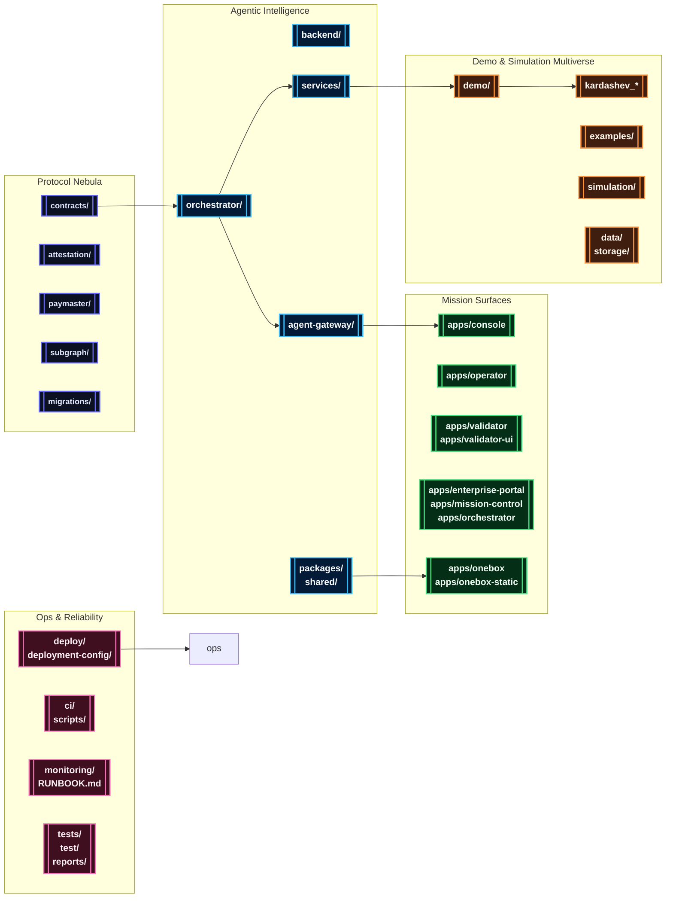
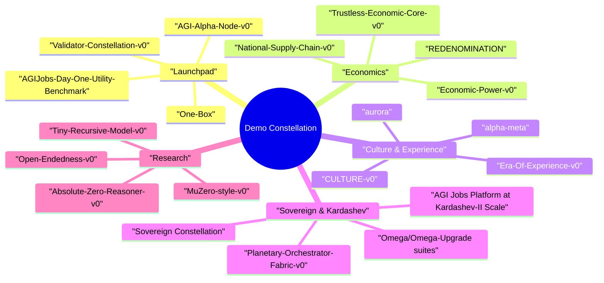

# AGIJobsv0

[](LICENSE)
[](https://github.com/MontrealAI/AGIJobsv0/actions/workflows/ci.yml)
[](https://github.com/MontrealAI/AGIJobsv0/actions/workflows/ci.yml?query=branch%3Amain+workflow%3A%22ci+%28v2%29%22)

> The canonical production stack for the AGI Jobs protocol: upgradeable Ethereum contracts, agent swarms, mission consoles, orchestrator intelligence, and a legendary universe of cinematic demos.

## Table of Contents
- [🌠 Mission Brief](#-mission-brief)
- [🛰️ System Nebula](#-system-nebula)
- [🗂️ Repository Cartography](#-repository-cartography)
- [⚙️ Getting Started](#-getting-started)
  - [Requirements](#requirements)
  - [Install & Bootstrap](#install--bootstrap)
  - [Manual Bring-Up](#manual-bring-up)
  - [Mission Control via Docker Compose](#mission-control-via-docker-compose)
  - [Core Endpoints](#core-endpoints)
- [🧪 Quality & Verification](#-quality--verification)
- [🎞️ Demo Constellation](#-demo-constellation)
  - [Launch & Operations](#launch--operations)
  - [Economics & Governance](#economics--governance)
  - [Culture, Experience & Media](#culture-experience--media)
  - [Sovereign & Kardashev Expeditions](#sovereign--kardashev-expeditions)
  - [Research & Simulation Labs](#research--simulation-labs)
  - [Python Bridge Packages](#python-bridge-packages)
- [📡 Operations & Observability](#-operations--observability)
- [📚 Documentation Signals](#-documentation-signals)

## 🌠 Mission Brief
AGIJobsv0 fuses every layer required to launch, operate, and evolve the AGI Jobs protocol.

- **Upgradeable protocol foundation** spanning Solidity contracts, Foundry/Hardhat tooling, EAS attestations, subgraphs, relayers, and migration recipes.
- **Agentic intelligence fabric** with orchestrator workflows, scoring engines, analytics, validators, and shared SDKs across TypeScript and Python.
- **Mission surfaces** including Next.js consoles, OneBox deployments, validator dashboards, and enterprise portals.
- **Expeditions & simulations** featuring a vast catalogue of demos that stretch from human-scale labour markets to Kardashev-class civilisations.

## 🛰️ System Nebula


## 🗂️ Repository Cartography
| Domain | Primary Paths | Highlights |
| --- | --- | --- |
| Protocol & Chain Control | [`contracts/`](contracts/), [`attestation/`](attestation/), [`paymaster/`](paymaster/), [`subgraph/`](subgraph/), [`migrations/`](migrations/) | Upgradeable Solidity modules, Foundry/Hardhat dual toolchain, EAS attestation flows, subgraph indexers, deployment scripts. |
| Agent Intelligence Fabric | [`orchestrator/`](orchestrator/), [`backend/`](backend/), [`agent-gateway/`](agent-gateway/), [`services/`](services/), [`packages/`](packages/), [`shared/`](shared/) | Mission planners, analytics, FastAPI/Node services, gRPC/WebSocket relays, reusable SDKs and shared state machines. |
| Mission Consoles & Portals | [`apps/console`](apps/console), [`apps/operator`](apps/operator), [`apps/validator`](apps/validator), [`apps/validator-ui`](apps/validator-ui), [`apps/enterprise-portal`](apps/enterprise-portal), [`apps/mission-control`](apps/mission-control), [`apps/orchestrator`](apps/orchestrator) | Next.js HUDs for operators, owners, validators, and orchestrator oversight. |
| OneBox Surfaces | [`apps/onebox`](apps/onebox), [`apps/onebox-static`](apps/onebox-static), [`packages/onebox-sdk`](packages/onebox-sdk), [`packages/onebox-orchestrator`](packages/onebox-orchestrator), [`demo/One-Box`](demo/One-Box) | Self-contained runner, SDKs, diagnostics, Docker templates, and CI checks. |
| Demo Atlas | [`demo/`](demo/), root [`kardashev_*`](./), [`examples/`](examples/), [`simulation/`](simulation/), [`data/`](data/), [`storage/`](storage/) | Vast cinematic demos, Kardashev-grade expeditions, scenario data, Monte Carlo simulations, analytics samples. |
| Operations & Assurance | [`deploy/`](deploy/), [`deployment-config/`](deployment-config/), [`ci/`](ci/), [`monitoring/`](monitoring/), [`scripts/`](scripts/), [`tests/`](tests/), [`test/`](test/) | One-click deployments, CI guardrails, telemetry wiring, integration/pytest harnesses, SBOM and release tooling. |
| Knowledge Base | [`docs/`](docs/), [`internal_docs/`](internal_docs/), [`RUNBOOK.md`](RUNBOOK.md), [`SECURITY.md`](SECURITY.md), [`MIGRATION.md`](MIGRATION.md), [`CHANGELOG.md`](CHANGELOG.md) | Architecture notes, operations manuals, compliance dossiers, release chronicles. |

## ⚙️ Getting Started
### Requirements
- **Node.js 20.18.1** (`nvm use` reads [`.nvmrc`](.nvmrc)) with npm 10.x.
- **Python 3.12+** with `pip` (use virtual environments for services and demos).
- **Foundry** (`forge`, `anvil`) for contract compilation, fuzzing, and gas analysis.
- **Docker & Docker Compose** for mission-control orchestration.
- **Git LFS** if syncing large payloads from [`data/`](data/) or [`storage/`](storage/) (optional).

### Install & Bootstrap
```bash
nvm install && nvm use
npm ci
python -m pip install --upgrade pip
python -m pip install -r requirements-python.txt
python -m pip install -r requirements-agent.txt
```
Optional demos expose additional `requirements.txt` under their respective directories (for example `demo/AGIJobs-Day-One-Utility-Benchmark/requirements.txt`).

### Manual Bring-Up
```bash
# Build contracts, shared packages, and generated artifacts
npm run build

# Terminal 2 – launch a local chain
anvil --chain-id 31337 --block-time 2

# Terminal 3 – deploy protocol v2 and bootstrap modules
npx hardhat run --network localhost scripts/v2/deploy.ts

# Terminal 4 – start the Meta API surface
uvicorn services.meta_api.app.main:app --reload --port 8000

# Optional: launch additional services & consoles
npm run agent:gateway                 # Agent gateway REST/WebSocket bridge
npm run agent:validator               # Validator simulator
npm --prefix apps/console run dev     # Mission console (Next.js)
npm --prefix apps/operator run dev    # Operator dashboard
npm --prefix apps/validator-ui run dev
```
Consult [`docs/quick-start.md`](docs/quick-start.md), [`docs/AGENTIC_QUICKSTART.md`](docs/AGENTIC_QUICKSTART.md), and the `docs/onebox/` guides for wallet setup, validator key rotation, and orchestrator configuration.

### Mission Control via Docker Compose
```bash
cp deployment-config/oneclick.env.example deployment-config/oneclick.env
# Fill RPC URLs, private keys, relayer secrets, telemetry tokens

docker compose up --build
```
`docker compose down -v` resets the cluster. Compose wiring sources defaults from [`deployment-config/oneclick.env`](deployment-config/oneclick.env).

### Core Endpoints
| Service | Default URL | Notes |
| --- | --- | --- |
| Local Anvil testnet | `http://localhost:8545` | Hardhat/Foundry-compatible development chain. |
| Meta API (FastAPI) | `http://localhost:8000` | Mission telemetry, orchestrator analytics, OneBox health. |
| Orchestrator/OneBox APIs | `http://localhost:8080` | Unified orchestration ingress and OneBox runner services. |
| Agent Gateway | `http://localhost:8090` | REST + WebSocket bridge for agent swarms. |
| Mission Console UI | `http://localhost:3000` | Primary operator HUD (`apps/console`). |
| Enterprise Portal | `http://localhost:3001` | Partner & enterprise oversight (`apps/enterprise-portal`). |

## 🧪 Quality & Verification
- `npm run lint`, `npm run webapp:typecheck`, and `npm run webapp:e2e` guard the Next.js surfaces.
- `npm run test` executes Hardhat unit tests; `forge test` uses Foundry profiles from [`foundry.toml`](foundry.toml).
- `PYTEST_DISABLE_PLUGIN_AUTOLOAD=1 pytest` covers Python demos (`tests/`, `demo/*/test/`).
- `npm run sbom:generate`, `npm run security:audit`, and `npm run release:manifest:validate` provide supply-chain checks.
- `npm run ci:verify-branch-protection` interrogates GitHub's branch rules to ensure every `ci (v2)` gate (linting, tests, HGM guardrails, Foundry, coverage, Phase 6/8 readiness, the branch guard, and the CI summary) is enforced on pull requests and `main` before merges land.【F:.github/workflows/ci.yml†L872-L1044】【F:scripts/ci/verify-branch-protection.ts†L1-L164】
- Coverage, gas, and scenario reports land in [`reports/`](reports/) and [`gas-snapshots/`](gas-snapshots/).

## 🎞️ Demo Constellation


The `demo/` directory hosts cinematic launches, CLI simulations, dashboards, and scripted walkthroughs. Many scenarios surface npm scripts, Makefile targets, or Python entrypoints for fast reproduction.

### Launch & Operations
| Demo | Location | Quick Launch |
| --- | --- | --- |
| AGI Alpha Node | [`demo/AGI-Alpha-Node-v0`](demo/AGI-Alpha-Node-v0) | `npm run demo:agi-alpha-node` (TypeScript CLI) or `npm run demo:agi-alpha-node:prod` for built output. |
| Validator Constellation | [`demo/Validator-Constellation-v0`](demo/Validator-Constellation-v0) | `npm run demo:validator-constellation` for live simulation; `npm run demo:validator-constellation:scenario` for scripted runs. |
| AGIJobs Day One Utility Benchmark | [`demo/AGIJobs-Day-One-Utility-Benchmark`](demo/AGIJobs-Day-One-Utility-Benchmark) | `make -C demo/AGIJobs-Day-One-Utility-Benchmark e2e` or `python demo/AGIJobs-Day-One-Utility-Benchmark/run_demo.py e2e`. |
| OneBox Mission Runner | [`demo/One-Box`](demo/One-Box) | `npm run demo:onebox:doctor` then `npm run demo:onebox:launch`; Docker users can run `docker compose -f demo/One-Box/docker-compose.yaml up`. |

### Economics & Governance
| Demo | Location | Quick Launch |
| --- | --- | --- |
| Economic Power | [`demo/Economic-Power-v0`](demo/Economic-Power-v0) | `npm run demo:economic-power` (supports `--ci` and scenario flags). |
| Trustless Economic Core | [`demo/Trustless-Economic-Core-v0`](demo/Trustless-Economic-Core-v0) | `npm run run:trustless-core` to execute the Hardhat-driven mission. |
| National Supply Chain | [`demo/National-Supply-Chain-v0`](demo/National-Supply-Chain-v0) | Static mission brief + UI prototypes under `ui/`. |
| REDENOMINATION & economic expansions | [`demo/REDENOMINATION`](demo/REDENOMINATION) and peers | Narrative playbooks and assets for macro-governance transitions. |

### Culture, Experience & Media
| Demo | Location | Quick Launch |
| --- | --- | --- |
| Era of Experience | [`demo/Era-Of-Experience-v0`](demo/Era-Of-Experience-v0) | `npm run demo:era-of-experience` for the orchestrated storyline; audit & verification helpers via `npm run demo:era-of-experience:audit`. |
| CULTURE v0 | [`demo/CULTURE-v0`](demo/CULTURE-v0) | Narrative assets, generative culture loops, and CLI utilities. |
| Alpha Meta | [`demo/alpha-meta`](demo/alpha-meta) | Meta-governance journeys and content pipelines. |
| Aurora Media Suite | [`demo/aurora`](demo/aurora) | Immersive media orchestration with storyboards and prompts. |

### Sovereign & Kardashev Expeditions
| Demo | Location | Quick Launch |
| --- | --- | --- |
| AGI Jobs Platform at Kardashev-II Scale | [`demo/AGI-Jobs-Platform-at-Kardashev-II-Scale`](demo/AGI-Jobs-Platform-at-Kardashev-II-Scale) | Multiphase mission plans, governance cadences, and operator scripts. |
| Planetary Orchestrator Fabric | [`demo/Planetary-Orchestrator-Fabric-v0`](demo/Planetary-Orchestrator-Fabric-v0) | `npm run test:planetary-orchestrator-fabric` for scenario verification. |
| Omega Upgrade Suites | [`demo/Kardashev-II Omega-Grade-α-AGI Business-3`](demo/Kardashev-II%20Omega-Grade-%CE%B1-AGI%20Business-3) and `kardashev_*` roots | Layered business-3 expeditions, Omega upgrades, and bridging packages. |
| Sovereign Constellation & Supra-Sovereign Atlases | [`demo/sovereign-constellation`](demo/sovereign-constellation), [`demo/sovereign-mesh`](demo/sovereign-mesh), `demo/zenith-sapience-initiative-*` | Governance rituals, sovereign meshes, and supra-sovereign ascension guides. |

### Research & Simulation Labs
| Demo | Location | Quick Launch |
| --- | --- | --- |
| Absolute Zero Reasoner | [`demo/Absolute-Zero-Reasoner-v0`](demo/Absolute-Zero-Reasoner-v0) | `make absolute-zero-demo` provisions a virtualenv and runs the simulation. |
| MuZero-style Mission | [`demo/MuZero-style-v0`](demo/MuZero-style-v0) | Reinforcement-learning inspired orchestrations and evaluation notebooks. |
| Open Endedness | [`demo/Open-Endedness-v0`](demo/Open-Endedness-v0) | Evolutionary sandboxes and meta-learning scripts. |
| Tiny Recursive Model | [`demo/Tiny-Recursive-Model-v0`](demo/Tiny-Recursive-Model-v0) | Minimal recursion demos, Python notebooks, and policy sketches. |
| Simulation Toolkit | [`simulation/`](simulation/) | Sharded Monte Carlo simulation harnesses, reports, and aggregator CLI (`python simulation/run_sharded_simulation.py`). |

### Python Bridge Packages
Root-level packages such as [`kardashev_ii_omega_grade_alpha_agi_business_3_demo`](kardashev_ii_omega_grade_alpha_agi_business_3_demo) expose namespace packages that forward-import their corresponding `demo/…` modules. They allow Python tooling to `import kardashev_ii_omega_grade_alpha_agi_business_3_demo` while keeping assets inside [`demo/`](demo/).

## 📡 Operations & Observability
- One-click deployments and infrastructure recipes live under [`deploy/`](deploy/) and [`deployment-config/`](deployment-config/).
- Alerting, notifications, sentinel monitors, and thermostats inhabit [`services/alerting`](services/alerting), [`services/notifications`](services/notifications), [`services/sentinel`](services/sentinel), and [`services/thermostat`](services/thermostat).
- Runtime telemetry, Prometheus metrics, and Grafana dashboards are curated in [`monitoring/`](monitoring/).
- [`RUNBOOK.md`](RUNBOOK.md) and [`docs/AGIJobs-v2-Mainnet-Guide.md`](docs/AGIJobs-v2-Mainnet-Guide.md) provide production playbooks and on-call drills.

## 📚 Documentation Signals
Explore the knowledge base for deeper dives:

- [`docs/AGI_Jobs_v0_Whitepaper_v2.md`](docs/AGI_Jobs_v0_Whitepaper_v2.md) – protocol thesis and economic primitives.
- [`docs/AGIJobsAlphav3.md`](docs/AGIJobsAlphav3.md) – historical release dossiers and architecture notes.
- [`docs/owner-control-quick-reference.md`](docs/owner-control-quick-reference.md) and [`docs/owner-control-quick-reference-cli.md`](docs/owner-control-quick-reference-cli.md) – owner command checklists.
- [`MIGRATION.md`](MIGRATION.md), [`CHANGELOG.md`](CHANGELOG.md), and [`SECURITY.md`](SECURITY.md) – governance over upgrades, releases, and security posture.
- [`internal_docs/`](internal_docs/) – detailed briefs, design reviews, and mission scripts for internal operators.

---

Licensed under the [MIT License](LICENSE).
