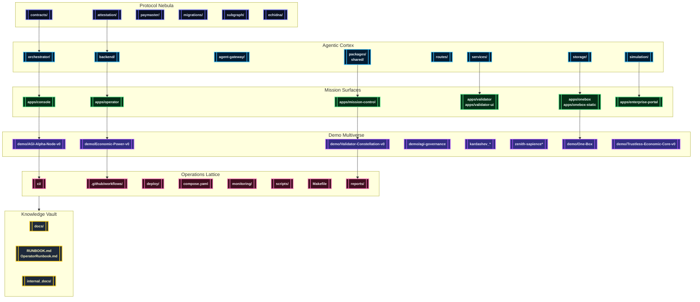

# AGI Jobs v0 (v2)

> **AGI Jobs v0 (v2)** is the sovereign-scale superintelligent machine powering validator swarms, cinematic demos, and mission control consoles with a flawless, user-forgiving launch experience.

---

## 🧭 Flight Plan
- [🚨 Mission Profile](#-mission-profile)
- [💠 Production Guarantees](#-production-guarantees)
- [🌌 Architecture Nebula](#-architecture-nebula)
- [🗺️ Repository Atlas](#️-repository-atlas)
- [🎞️ Demo Multiverse](#️-demo-multiverse)
- [🚀 Launch & Operations](#-launch--operations)
- [🧪 Continuous Assurance & CI](#-continuous-assurance--ci)
- [🛡️ Observability, Security & Governance](#️-observability-security--governance)
- [📚 Knowledge Vault](#-knowledge-vault)

---

## 🚨 Mission Profile
AGI Jobs v0 (v2) orchestrates unstoppable sovereign intelligence that non-technical crews can command on day zero. The system fuses:

- **Upgradeable protocol command** through Solidity contracts, Foundry suites, attestations, migrations, subgraph analytics, and paymaster rails living under [`contracts/`](contracts/), [`attestation/`](attestation/), [`migrations/`](migrations/), [`subgraph/`](subgraph/), [`paymaster/`](paymaster/), and [`echidna/`](echidna/).
- **Agentic cognition** across orchestrator backends, FastAPI services, shared TypeScript/Python packages, and simulation engines inside [`orchestrator/`](orchestrator/), [`backend/`](backend/), [`services/`](services/), [`agent-gateway/`](agent-gateway/), [`routes/`](routes/), [`packages/`](packages/), [`shared/`](shared/), [`storage/`](storage/), and [`simulation/`](simulation/).
- **Mission surfaces** rendered by Next.js, Vite, and console dashboards within [`apps/`](apps/), unlocking operator consoles, validator HUDs, one-click OneBox launches, and enterprise portals.
- **Demo cinematics** in [`demo/`](demo/), [`examples/`](examples/), [`data/`](data/), and the Kardashev ascent directories, each with scripted CLI drivers, telemetry exporters, and Monte Carlo verifiers.
- **Operations lattice** spanning [`ci/`](ci/), [`.github/workflows/`](.github/workflows/), [`deploy/`](deploy/), [`deployment-config/`](deployment-config/), [`monitoring/`](monitoring/), [`scripts/`](scripts/), [`tests/`](tests/), [`test/`](test/), [`reports/`](reports/), [`gas-snapshots/`](gas-snapshots/), and [`Makefile`](Makefile) to guarantee a fully green runway.

---

## 💠 Production Guarantees
- **Immediate launch for non-technical operators**: one-click Compose (`compose.yaml`) provisions Anvil, meta APIs, and consoles with sane defaults pulled from [`deployment-config/oneclick.env`](deployment-config/oneclick.env).
- **Deterministic contract governance**: `npm run owner:command-center`, `owner:doctor`, and `owner:system-pause` expose scripted pause, upgrade, and compliance flows documented in [`scripts/v2/`](scripts/v2/) and [`OperatorRunbook.md`](OperatorRunbook.md).
- **Validator & agent swarms**: `npm run agent:gateway`, `agent:validator`, and `validator:cli` boot curated agent hubs using [`examples/agentic`](examples/agentic) blueprints and [`routes/`](routes/) APIs.
- **Sovereign thermostat & treasury health**: `npm run thermostat:update`, `thermodynamics:report`, and `owner:dashboard` compile economic telemetry before every deployment.
- **Hardened supply chain**: SBOM and license gates via `npm run sbom:generate`, `security:audit`, and `license-checker` configuration in [`audit-ci.json`](audit-ci.json) and [`SECURITY.md`](SECURITY.md).
- **One command demo recoveries**: `make operator:green`, `npm run demo:economic-power:ci`, `npm run demo:validator-constellation:ci`, and `npm run demo:agi-alpha-node:prod` regenerate artifacts, dashboards, and transcripts on demand.

---

## 🌌 Architecture Nebula

---

## 🗺️ Repository Atlas
| Domain | Path Highlights | Purpose |
| --- | --- | --- |
| Protocol Control | [`contracts/`](contracts/), [`attestation/`](attestation/), [`paymaster/`](paymaster/), [`migrations/`](migrations/), [`subgraph/`](subgraph/), [`echidna/`](echidna/), [`gas-snapshots/`](gas-snapshots/) | Upgradeable Solidity modules, attestations, subgraph analytics, fuzzing harnesses, and gas telemetry. |
| Intelligence Fabric | [`orchestrator/`](orchestrator/), [`backend/`](backend/), [`services/`](services/), [`routes/`](routes/), [`agent-gateway/`](agent-gateway/), [`packages/`](packages/), [`shared/`](shared/), [`storage/`](storage/), [`simulation/`](simulation/) | Validator swarms, FastAPI endpoints, alerting/notification services, SDKs, storage adapters, and reinforcement simulators. |
| Mission Surfaces | [`apps/`](apps/) (`console`, `operator`, `mission-control`, `onebox`, `onebox-static`, `validator`, `validator-ui`, `enterprise-portal`, `orchestrator`) | UI command decks rendered via Next.js & Vite with integrated telemetry overlays. |
| Demo Multiverse | [`demo/`](demo/), [`examples/`](examples/), [`data/`](data/), `kardashev_*` constellations, `zenith-sapience*`, `sovereign-*`, [`simulation/`](simulation/) scenarios | Cinematic demos, CLI tours, Monte Carlo economics, Kardashev ascension arcs, MuZero simulations, and validator rehearsals. |
| Operations & Delivery | [`ci/`](ci/), [`.github/workflows/`](.github/workflows/), [`deploy/`](deploy/), [`deployment-config/`](deployment-config/), [`compose.yaml`](compose.yaml), [`monitoring/`](monitoring/), [`scripts/`](scripts/), [`Makefile`](Makefile), [`reports/`](reports/), [`tests/`](tests/), [`test/`](test/) | CI lattice, deployment manifests, Compose topologies, monitoring stacks, automation scripts, integration suites, and compliance artifacts. |
| Knowledge & Governance | [`docs/`](docs/), [`internal_docs/`](internal_docs/), [`RUNBOOK.md`](RUNBOOK.md), [`OperatorRunbook.md`](OperatorRunbook.md), [`MIGRATION.md`](MIGRATION.md), [`CHANGELOG.md`](CHANGELOG.md), [`SECURITY.md`](SECURITY.md) | Launch manuals, incident playbooks, migration histories, audit posture, and governance doctrine. |

---

## 🎞️ Demo Multiverse
The repository ships a cinematic fleet of demos that are always reproducible thanks to dedicated workflows under [`.github/workflows/`](.github/workflows/). Badge-visible pipelines include `demo-agi-alpha-node.yml`, `demo-economic-power.yml`, `demo-validator-constellation.yml`, `demo-zenith-hypernova.yml`, `demo-kardashev-ii-omega-ultra.yml`, `demo-asi-takeoff.yml`, and more.

### Flagship Quickstarts
| Demo | Location | Launch Command | CI Workflow |
| --- | --- | --- | --- |
| AGI Alpha Node Launch | [`demo/AGI-Alpha-Node-v0/`](demo/AGI-Alpha-Node-v0/) | `npm run demo:agi-alpha-node` (prod build: `npm run demo:agi-alpha-node:prod`) | [`demo-agi-alpha-node.yml`](.github/workflows/demo-agi-alpha-node.yml) |
| Economic Power Dominion | [`demo/Economic-Power-v0/`](demo/Economic-Power-v0/) | `npm run demo:economic-power` (CI: `npm run demo:economic-power:ci`) | [`demo-economic-power.yml`](.github/workflows/demo-economic-power.yml) |
| Validator Constellation | [`demo/Validator-Constellation-v0/`](demo/Validator-Constellation-v0/) | `npm run demo:validator-constellation` | [`demo-validator-constellation.yml`](.github/workflows/demo-validator-constellation.yml) |
| Alpha AGI Mark | [`demo/alpha-agi-mark/`](demo/alpha-agi-mark/) | `npm run demo:alpha-agi-mark` | [`demo-alpha-agi-mark.yml`](.github/workflows/demo-alpha-agi-mark.yml) |
| AGI Governance | [`demo/agi-governance/`](demo/agi-governance/) | `npm run demo:agi-governance` | [`demo-agi-governance.yml`](.github/workflows/demo-agi-governance.yml) |
| AGI Labor Market Grand Demo | [`demo/agi-labor-market-grand-demo/`](demo/agi-labor-market-grand-demo/) | `npm run demo:agi-labor-market` | [`demo-agi-labor-market.yml`](.github/workflows/demo-agi-labor-market.yml) |
| Zenith Hypernova | [`demo/zenith-sapience-initiative-supra-sovereign-hypernova-governance/`](demo/zenith-sapience-initiative-supra-sovereign-hypernova-governance/) | `npm run demo:zenith-hypernova` | [`demo-zenith-hypernova.yml`](.github/workflows/demo-zenith-hypernova.yml) |
| Huxley–Gödel Machine | [`demo/Huxley-Godel-Machine-v0/`](demo/Huxley-Godel-Machine-v0/) | `make demo-hgm` or `make hgm-owner-console` | [`demo-huxley-godel-machine.yml`](.github/workflows/demo-huxley-godel-machine.yml) |
| Trustless Economic Core | [`demo/Trustless-Economic-Core-v0/`](demo/Trustless-Economic-Core-v0/) | `npm run run:trustless-core` | [`demo-trustless-economic-core.yml`](.github/workflows/demo-trustless-economic-core.yml) |

### Kardashev & Zenith Ascension Arcs
The `kardashev_*` and `zenith-sapience*` constellations map multi-phase, multi-chain rehearsals. Each arc ships:

- **Scenario CLIs** (for example `npm run demo:kardashev-ii-omega-ultra` or `npm run demo:zenith-sapience:planetary-os`).
- **Storyline manifests** inside the corresponding `demo/*/scripts/` directories for deterministic playback.
- **Telemetry exporters** writing JSON, HTML, and cinematic PNGs into each demo's `out/` folder.
- **Dedicated GitHub Actions** like `demo-kardashev-ii-omega-ultra.yml`, `demo-kardashev-ii-omega-operator.yml`, `demo-zenith-sapience-planetary-os.yml`, and `demo-zenith-sapience-celestial-archon.yml`.

### OneBox & Operator Consoles
- Launch OneBox orchestration with `npm run demo:era-of-experience`, `npm run demo:meta-agentic-alpha`, or `npm run demo:validator-constellation:operator-console`.
- The OneBox static harness (`apps/onebox-static`) exposes verification helpers: `npm run verify:sri`, `npm run demo:era-of-experience:verify`, and curated Playwright coverage within `apps/onebox/test/`.
- `make operator:green` rehydrates the Day-One Utility Benchmark demo, prints artifact banners, and surfaces the latest PNG/HTML telemetry snapshot for executive briefings.

### Demo Artifact Etiquette
1. Run the CLI command (or `make` target) from repository root.
2. Inspect the `out/` directory for JSON/PNG/HTML exports.
3. Attach the produced artifact to governance threads or incident reviews.
4. When operating through CI, download artifacts via the workflow run summary; branch protection ensures every run stays green.

---

## 🚀 Launch & Operations
### Mission Requirements
- **Node.js 20.18.1** (enforced via `package.json` engines) with npm 10+.
- **Python 3.10+** with `pip` (used across demos and simulations).
- **Docker & Docker Compose v2** for one-click orchestration through `compose.yaml`.
- **Foundry & Hardhat** (`forge`, `anvil`, `npx hardhat`) for contract compilation, fuzzing, and simulation.

### Bootstrap Checklist
1. `npm install` – installs Node dependencies across workspaces with license overrides declared in [`package.json`](package.json).
2. `python3 -m pip install -r requirements-python.txt` – provisions shared Python dependencies.
3. `forge install` (optional) – pulls Foundry dependencies defined in [`foundry.toml`](foundry.toml).
4. `npm run build --prefix apps/console` & `npm run webapp:lint` – prime mission surfaces.
5. `docker compose up` – spawns Anvil, orchestrator services, meta APIs, and consoles using [`compose.yaml`](compose.yaml).

### Operator Surfaces
- **Console HUD**: `npm --prefix apps/console run dev -- --host 0.0.0.0 --port 4173`.
- **Mission Control**: `npm --prefix apps/mission-control run dev` for orchestrator oversight.
- **Operator Deck**: `npm --prefix apps/operator run dev` to track job lifecycle and treasury pulse.
- **Validator UX**: `npm --prefix apps/validator run dev` plus `npm run validator:cli` for CLI rituals.
- **Enterprise Portal**: `npm --prefix apps/enterprise-portal run dev` with SRI verification via `npm run verify:sri`.

### Automation Flight Deck
- **Owner controls**: `npm run owner:command-center`, `npm run owner:doctor`, and `npm run owner:mission-control` cover dashboards, diagnostics, and upgrade matrices inside [`scripts/v2/`](scripts/v2/).
- **Telemetry**: `npm run thermodynamics:report`, `npm run owner:dashboard`, and Prometheus exporters from [`monitoring/`](monitoring/).
- **Deployments**: `npm run release:manifest`, `npm run release:verify`, or `make culture-bootstrap` for Culture network rehearsals.

---

## 🧪 Continuous Assurance & CI
- **CI v2 lattice** is encoded in [`ci.yml`](.github/workflows/ci.yml), orchestrating linting, type-checking, Foundry tests, Python suites, coverage enforcement, attestation verification, and artifact bundling.
- **Contracts, fuzzing, webapp, container, and scorecard pipelines** live in [`contracts.yml`](.github/workflows/contracts.yml), [`fuzz.yml`](.github/workflows/fuzz.yml), [`webapp.yml`](.github/workflows/webapp.yml), [`containers.yml`](.github/workflows/containers.yml), [`scorecard.yml`](.github/workflows/scorecard.yml), and [`static-analysis.yml`](.github/workflows/static-analysis.yml).
- **Demo-specific gates**—`demo-agi-alpha-node.yml`, `demo-economic-power.yml`, `demo-validator-constellation.yml`, `demo-kardashev-ii-omega-ultra.yml`, `demo-zenith-hypernova.yml`, `demo-asi-takeoff.yml`, and many more—ensure every storyline compiles, runs, and exports telemetry before merging.
- **Required contexts** are codified in [`ci/required-contexts.json`](ci/required-contexts.json) and enforced through [`scripts/ci/check-ci-required-contexts.ts`](scripts/ci/check-ci-required-contexts.ts) and [`scripts/ci/update-ci-required-contexts.ts`](scripts/ci/update-ci-required-contexts.ts).
- **Release gates** produce CycloneDX SBOMs (`npm run sbom:generate`), perform ABI drift checks (`npm run abi:diff`), and publish manifest dossiers via [`release.yml`](.github/workflows/release.yml) and [`release-mainnet.yml`](.github/workflows/release-mainnet.yml).
- **Culture CI** extends coverage through [`culture-ci.yml`](.github/workflows/culture-ci.yml) and `make culture-bootstrap` scenarios.

Every pull request and `main` commit must pass all required contexts, locking in a fully green CI v2 status before merge.

> 🔐 Non-technical owners can follow the [CI v2 operations guide](docs/v2-ci-operations.md), reproducible [validation log](docs/ci-v2-validation-report.md), and [branch-protection checklist](docs/ci-v2-branch-protection-checklist.md) to keep every badge green while retaining full control over pause levers, parameter matrices, and upgrade orchestration.【F:docs/v2-ci-operations.md†L1-L133】【F:docs/ci-v2-validation-report.md†L1-L60】【F:docs/ci-v2-branch-protection-checklist.md†L1-L126】

- Run `npm run ci:sync-contexts -- --check` followed by `npm run ci:verify-contexts` before opening a pull request to prove `.github/workflows/ci.yml` and `ci/required-contexts.json` stay perfectly aligned.【F:.github/workflows/ci.yml†L49-L63】【F:scripts/ci/update-ci-required-contexts.ts†L1-L98】【F:scripts/ci/check-ci-required-contexts.ts†L1-L117】
- Use `npm run ci:verify-branch-protection` with a repository token to audit GitHub’s branch protection API and confirm the CI v2 contexts, strict rebases, and admin enforcement are still intact.【F:.github/workflows/ci.yml†L932-L1032】【F:docs/ci-v2-branch-protection-checklist.md†L97-L138】

---

## 🛡️ Observability, Security & Governance
- **Telemetry & Monitoring**: [`monitoring/`](monitoring/) bundles Prometheus exporters, Grafana dashboards, and alert playbooks; Compose pipes metrics to mission control.
- **Alerting surfaces**: [`services/alerting`](services/alerting), [`services/notifications`](services/notifications), [`services/sentinel`](services/sentinel), and [`services/thermostat`](services/thermostat) automate paging, notifications, sentinel sweeps, and thermal throttling.
- **Security posture**: [`SECURITY.md`](SECURITY.md) describes disclosure, triage, and audit routines; [`audit-ci.json`](audit-ci.json) enforces npm audit allowlists; `npm run security:audit` keeps dependencies hardened.
- **Incident playbooks**: [`RUNBOOK.md`](RUNBOOK.md) and [`OperatorRunbook.md`](OperatorRunbook.md) define pause/resume levers (`npm run owner:system-pause`), emergency upgrade rituals, and validator briefings.
- **Governance automation**: [`scripts/v2/`](scripts/v2/) exposes command suites (`owner:upgrade`, `owner:mission-control`, `owner:plan:safe`, `owner:wizard`) guaranteeing production discipline.

---

## 📚 Knowledge Vault
- **Docs**: [`docs/`](docs/) captures architecture, deployment, demo playbooks, and cinematic treatments.
- **Internal Intelligence**: [`internal_docs/`](internal_docs/) stores restricted operator dossiers.
- **Change Chronicles**: [`CHANGELOG.md`](CHANGELOG.md) and [`MIGRATION.md`](MIGRATION.md) track every release and upgrade path.
- **Security Doctrine**: [`SECURITY.md`](SECURITY.md) codifies hardening standards and vulnerability response.
- **Operator Manuals**: [`RUNBOOK.md`](RUNBOOK.md) and [`OperatorRunbook.md`](OperatorRunbook.md) ensure crews can sustain the machine through any incident.

AGI Jobs v0 (v2) remains a relentless, production-ready sovereign intelligence engine—always green, always exportable, always under control.
