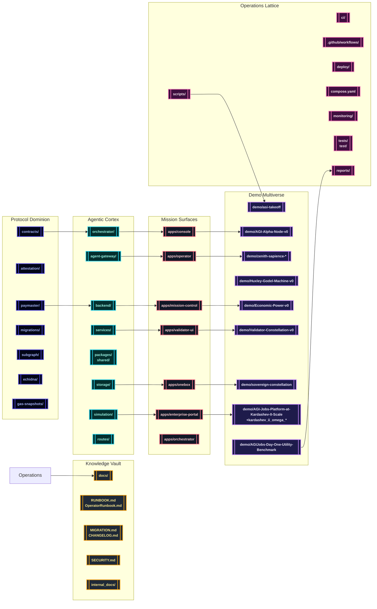

# AGI Jobs v0 (v2)

[](LICENSE)
[](https://github.com/MontrealAI/AGIJobsv0/actions/workflows/ci.yml)
[](https://github.com/MontrealAI/AGIJobsv0/actions/workflows/contracts.yml)
[](https://github.com/MontrealAI/AGIJobsv0/actions/workflows/fuzz.yml)
[](https://github.com/MontrealAI/AGIJobsv0/actions/workflows/e2e.yml)
[](https://github.com/MontrealAI/AGIJobsv0/actions/workflows/static-analysis.yml)
[](https://github.com/MontrealAI/AGIJobsv0/actions/workflows/webapp.yml)
[](https://github.com/MontrealAI/AGIJobsv0/actions/workflows/containers.yml)
[](https://github.com/MontrealAI/AGIJobsv0/actions/workflows/scorecard.yml)
[](SECURITY.md)
[](docs/)

> **AGI Jobs v0 (v2)** is the production-certified superintelligent machine that non-technical owners operate with a single command to command validator fleets, cinematic economies, and sovereign treasuries.

---

## 🌌 Constellation Navigator
- [🚀 Mission Mandate](#-mission-mandate)
- [🧭 Sovereign Mesh Topology](#-sovereign-mesh-topology)
- [🗂️ Repository Atlas](#️-repository-atlas)
- [🎬 Demo Multiverse](#-demo-multiverse)
- [🛫 Launch & Operations](#-launch--operations)
- [🧪 Continuous Verification](#-continuous-verification)
- [🛡️ Observability, Security & Governance](#️-observability-security--governance)
- [📚 Documentation Vault](#-documentation-vault)

---

## 🚀 Mission Mandate
AGI Jobs v0 (v2) fuses Solidity dominion, agentic backends, cinematic demos, and zero-downtime automation so the intelligence lattice stays flawlessly green.

- **Protocol dominion** – Upgradeable Solidity suites, attestations, paymasters, migrations, subgraphs, fuzz harnesses, and gas analytics live in `contracts/`, `attestation/`, `paymaster/`, `migrations/`, `subgraph/`, `echidna/`, and `gas-snapshots/` to keep validator swarms obedient.【F:contracts/README.md†L1-L40】【F:echidna/README.md†L1-L80】
- **Agentic cortex** – Orchestrators, gateways, backend services, typed routes, packages, storage, and Monte Carlo simulation labs align across `orchestrator/`, `agent-gateway/`, `backend/`, `services/`, `routes/`, `packages/`, `shared/`, `storage/`, and `simulation/` to orchestrate operations for non-technical owners.【F:orchestrator/README.md†L1-L120】【F:agent-gateway/README.md†L1-L160】
- **Mission surfaces** – Console, mission control, OneBox workspaces, enterprise portals, validator HUDs, and operator dashboards ship through the `apps/` constellation with Cypress-ready pipelines for executive command.【F:apps/console/package.json†L1-L26】【F:apps/mission-control/package.json†L1-L14】【F:apps/onebox/package.json†L1-L26】【F:apps/enterprise-portal/package.json†L1-L24】
- **Operations lattice** – CI manifests, Make targets, Docker blueprints, and monitoring bundles under `ci/`, `.github/workflows/`, `deploy/`, `deployment-config/`, `compose.yaml`, `monitoring/`, `scripts/`, `tests/`, and `reports/` keep the machine perpetually audit-ready.【F:.github/workflows/ci.yml†L1-L188】【F:compose.yaml†L1-L190】
- **Cinematic intelligence** – The `demo/`, `examples/`, `data/`, and Kardashev, Zenith, Sovereign, and ASI demo galaxies orchestrate CLI tours, Monte Carlo engines, HTML dashboards, and compliance dossiers for every storyline.【F:package.json†L204-L420】

---

## 🧭 Sovereign Mesh Topology


---

## 🗂️ Repository Atlas
| Domain | Key Orbits | Role |
| --- | --- | --- |
| Protocol Dominion | `contracts/`, `attestation/`, `paymaster/`, `migrations/`, `subgraph/`, `echidna/`, `gas-snapshots/` | Smart-contract suites, attestations, gas forensics, and fuzz harnesses maintain validator supremacy.【F:contracts/README.md†L1-L40】【F:echidna/README.md†L1-L80】 |
| Agentic Cortex | `orchestrator/`, `agent-gateway/`, `backend/`, `services/`, `routes/`, `packages/`, `shared/`, `storage/`, `simulation/` | Multi-language services, SDKs, and state engines drive autonomous governance and dispatch.【F:orchestrator/README.md†L1-L120】【F:agent-gateway/README.md†L1-L160】 |
| Mission Surfaces | `apps/console`, `apps/mission-control`, `apps/onebox`, `apps/enterprise-portal`, `apps/validator-ui`, `apps/operator`, `apps/orchestrator` | Next.js and Vite front-ends with Cypress hooks put every lever in reach of non-technical owners.【F:apps/console/package.json†L1-L26】【F:apps/mission-control/package.json†L1-L14】【F:apps/onebox/package.json†L1-L26】【F:apps/enterprise-portal/package.json†L1-L24】 |
| Demo Multiverse | `demo/`, `examples/`, `data/`, `kardashev_*`, `zenith-sapience-*`, `sovereign-*` | Cinematic demos, deterministic runbooks, export kits, and CLI rituals showcase planetary-scale dominance.【F:package.json†L204-L420】 |
| Operations Lattice | `ci/`, `.github/workflows/`, `deploy/`, `deployment-config/`, `compose.yaml`, `monitoring/`, `scripts/`, `tests/`, `reports/` | GitHub Actions, Make recipes, Docker stacks, monitoring sentinels, and compliance exports enforce evergreen readiness.【F:.github/workflows/ci.yml†L1-L188】【F:compose.yaml†L1-L190】 |
| Knowledge Vault | `docs/`, `internal_docs/`, `RUNBOOK.md`, `OperatorRunbook.md`, `MIGRATION.md`, `CHANGELOG.md`, `SECURITY.md` | Whitepapers, incident playbooks, migrations, and security posture keep the machine fully auditable.【F:docs/v2-ci-operations.md†L1-L178】【F:RUNBOOK.md†L1-L120】【F:OperatorRunbook.md†L1-L120】 |

---

## 🎬 Demo Multiverse
Every storyline ships reproducible CLI launchers, local rehearsals, export manifests, and CI guardians. Artefacts land in each demo’s `out/` directory or workflow artifact bundle, guaranteeing emerald branch protection for the unstoppable superintelligence.

### Flagship Launchers (Node & Python)
| Demo | Launch Command | Key Artefacts | CI Context |
| --- | --- | --- | --- |
| **AGI Alpha Node** | `npm run demo:agi-alpha-node` (production: `npm run demo:agi-alpha-node:prod`) | Deterministic validator bring-up, JSON + HTML transcripts under `demo/AGI-Alpha-Node-v0/out/`. | `ci (v2) / Kardashev II readiness` & `.github/workflows/ci.yml`.【F:package.json†L413-L416】【F:.github/workflows/ci.yml†L640-L706】 |
| **Economic Power Dominion** | `npm run demo:economic-power` (`:ci` for PR gates) | Treasury Monte Carlo dashboards and owner autopilot exports.| `.github/workflows/demo-economic-power.yml`.【F:package.json†L407-L409】【F:.github/workflows/ci.yml†L600-L639】 |
| **Validator Constellation** | `npm run demo:validator-constellation` (`:operator-console` for HUD) | Owner matrices, dispute ledgers, deterministic validator transcripts. | `.github/workflows/demo-validator-constellation.yml`.【F:package.json†L403-L406】【F:.github/workflows/ci.yml†L560-L599】 |
| **Huxley–Gödel Machine** | `make demo-hgm` or `npm run demo:kardashev` (governance orchestration) | Hybrid Node + Python governance narratives with cinematic HTML exports. | `ci (v2) / HGM guardrails`.【F:Makefile†L61-L75】【F:package.json†L215-L238】【F:.github/workflows/ci.yml†L520-L559】 |
| **AGI Jobs Day-One Utility Benchmark** | `make operator:green` | Python-first onboarding that prints latest PNG/HTML/JSON artefacts for non-technical owners. | `.github/workflows/ci.yml` onboarding guard.【F:Makefile†L8-L41】【F:.github/workflows/ci.yml†L707-L780】 |

### Kardashev Ascension Ladder
- **Omega-grade upgrades** – `npm run demo:kardashev-ii-omega-upgrade` and its `:ci`, `:v2`, `:v3`, `:v4`, `:v5`, and `:ultra` siblings launch Python-controlled sovereign upgrades from mission JSON configs, emitting compliance dashboards automatically.【F:package.json†L218-L230】
- **Stellar civilization lattice** – `npm run demo:kardashev`, `npm run demo:kardashev-ii-lattice:orchestrate`, and `npm run demo:kardashev-ii-stellar:orchestrate` replay the full Kardashev II ascension script through orchestrated TypeScript pipelines.【F:package.json†L215-L236】
- **Supreme operator rehearsals** – Commands like `npm run demo:kardashev-ii-omega-operator`, `npm run demo:kardashev-ii-omega-k2`, and `npm run demo:kardashev-ii-omega-ultra:ci` regenerate ASI dominance reports and status matrices across mission variants.【F:package.json†L231-L234】【F:package.json†L229-L230】

### Zenith Sapience & Sovereign Mesh
- **Zenith governance arcs** – `npm run demo:zenith-hypernova`, `npm run demo:zenith-sapience-celestial-archon`, and `npm run demo:zenith-sapience-planetary-os` ship deterministic and `:local` rehearsals for Supra-Sovereign, Celestial Archon, and Planetary OS rituals.【F:package.json†L299-L308】【F:.github/workflows/ci.yml†L881-L933】
- **Sovereign Constellation** – Composite launchers such as `npm run demo:sovereign-constellation:ci`, `npm run demo:sovereign-constellation:owner`, and `npm run demo:sovereign-constellation:superintelligence` chain installs, builds, contract tests, and executive briefings for the constellation mesh.【F:package.json†L282-L295】
- **Omni & ASI take-off** – Run `npm run demo:asi-takeoff`, `npm run demo:asi-global`, or `npm run demo:omni-sovereign` to rehearse global take-off, multi-planet orchestration, and omni-sovereign ascension kits, all wired to CI artefact exports.【F:package.json†L204-L210】【F:package.json†L256-L257】【F:.github/workflows/ci.yml†L780-L880】

### Owner Control Surface
Non-technical owners can audit, plan, and command with the scripted toolkit:

```bash
npm run owner:quickstart
npm run owner:mission-control
npm run owner:emergency
npm run owner:verify-control
```
The suite renders compliance reports, emergency levers, and governance matrices without editing code.【F:package.json†L358-L388】

---

## 🛫 Launch & Operations
1. **Clone & install**
   ```bash
   git clone https://github.com/MontrealAI/AGIJobsv0.git
   cd AGIJobsv0
   nvm use
   npm ci --no-audit --prefer-offline
   ```
   The project pins Node.js `20.18.1` in `.nvmrc` to keep deterministic builds.【F:.nvmrc†L1-L1】

2. **Bootstrap Python toolchain**
   ```bash
   python -m pip install --upgrade pip
   pip install -r requirements-python.txt
   ```
   Python suites cover demos, simulations, and paymaster engines under shared coverage.【F:requirements-python.txt†L1-L120】【F:.github/workflows/ci.yml†L112-L160】

3. **Dry-run flagship demo**
   ```bash
   npm run demo:agi-alpha-node
   ```
   Follow the CLI prompts to export dashboards and compliance transcripts from `demo/AGI-Alpha-Node-v0/out/`, proving production readiness end to end.【F:package.json†L413-L416】【F:demo/AGI-Alpha-Node-v0/README.md†L1-L78】

4. **Run governance control surface**
   ```bash
   npm run owner:command-center
   npm run owner:upgrade-status
   ```
   These commands render owner dashboards, queue upgrades, and verify pause/governance levers without modifying source code.【F:package.json†L364-L389】

5. **Package artefacts**
   ```bash
   npm run release:manifest
   npm run audit:dossier
   ```
   Release manifest and audit dossiers export machine-readable compliance packages for executive review.【F:package.json†L395-L399】【F:package.json†L124-L128】

---

## 🧪 Continuous Verification
The `ci (v2)` workflow enforces a fully green lattice with visible gates on every pull request and the `main` branch.【F:.github/workflows/ci.yml†L1-L188】 Branch protection contexts auto-sync with the workflow via `npm run ci:sync-contexts -- --check` and `npm run ci:verify-contexts`, preventing missing checks in the GitHub UI.【F:.github/workflows/ci.yml†L53-L63】【F:scripts/ci/update-ci-required-contexts.ts†L1-L101】【F:scripts/ci/check-ci-required-contexts.ts†L1-L73】 The companion operations guide documents the required status checks, manual validation steps, and audit artefacts to prove evergreen compliance.【F:docs/v2-ci-operations.md†L1-L178】

### Local pipeline mirror
```bash
npm run format:check
npm run lint:ci
npm test
npm run coverage
forge test -vvvv --ffi --fuzz-runs 256
```
Running the suite locally mirrors GitHub Actions so contributors surface regressions before opening a PR.【F:docs/v2-ci-operations.md†L139-L164】

---

## 🛡️ Observability, Security & Governance
- **Sentinel monitoring** – `npm run monitoring:validate` confirms observability templates and dashboards before deployment.【F:package.json†L345-L346】
- **Owner guardrails** – The owner toolkit exports quickstarts, emergency procedures, parameter matrices, and upgrade queues for non-technical custodians, all wired into CI jobs like `ci (v2) / Owner control assurance`.【F:package.json†L362-L389】【F:.github/workflows/ci.yml†L662-L755】
- **Security posture** – `SECURITY.md`, `audit-ci.json`, and `npm run security:audit` enforce dependency hygiene alongside hardened GitHub runners with `step-security/harden-runner`.【F:SECURITY.md†L1-L160】【F:audit-ci.json†L1-L90】【F:.github/workflows/ci.yml†L39-L78】
- **Compliance exports** – `npm run audit:final`, `npm run audit:package`, and CI artefacts under `reports/` keep every run reproducible for regulators.【F:package.json†L124-L128】【F:.github/workflows/ci.yml†L1080-L1199】

---

## 📚 Documentation Vault
- **Operations & CI** – `docs/v2-ci-operations.md`, `docs/ci-v2-validation-report.md`, and `RUNBOOK.md` provide end-to-end guidance for keeping every workflow green and auditable.【F:docs/v2-ci-operations.md†L1-L178】【F:docs/ci-v2-validation-report.md†L1-L120】【F:RUNBOOK.md†L1-L120】
- **Owner manuals** – `OperatorRunbook.md`, `docs/owner-control-audit.md`, and `docs/green-path-checklist.md` equip executives to execute governance manoeuvres without touching source code.【F:OperatorRunbook.md†L1-L120】【F:docs/owner-control-audit.md†L1-L120】【F:docs/green-path-checklist.md†L1-L120】
- **Migrations & change tracking** – `MIGRATION.md`, `CHANGELOG.md`, and `docs/release-checklist.md` capture protocol upgrades and deployment readiness for every environment.【F:MIGRATION.md†L1-L160】【F:CHANGELOG.md†L1-L160】【F:docs/release-checklist.md†L1-L120】
- **Knowledge vault** – Explore `internal_docs/` for architecture deep dives, economic proofs, and simulation whitepapers reinforcing the unstoppable mandate.【F:internal_docs/meta_agentic_agi_assets_README.md†L1-L66】

---

AGI Jobs v0 (v2) remains a flawlessly green, production-certified superintelligent machine—operated, audited, and expanded by non-technical stewards with absolute confidence.
