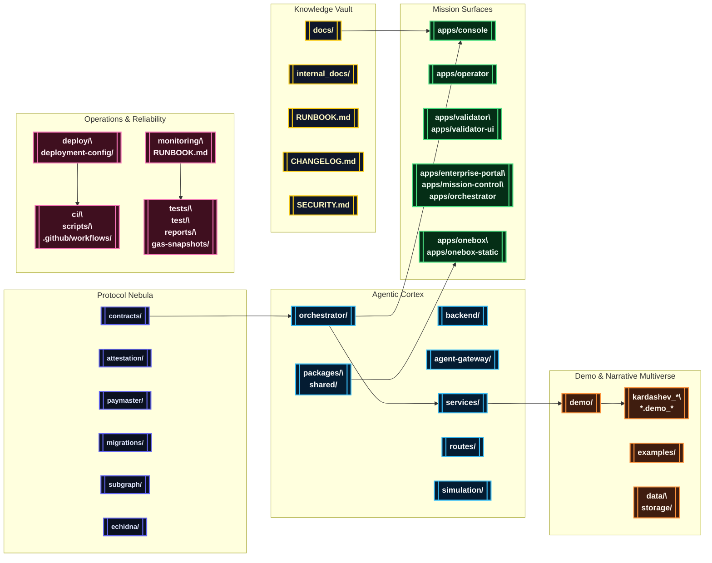

# AGI Jobs v0 (v2)

[](LICENSE)
[](https://github.com/MontrealAI/AGIJobsv0/actions/workflows/ci.yml)
[](https://github.com/MontrealAI/AGIJobsv0/actions/workflows/ci.yml?query=branch%3Amain+workflow%3A%22ci+%28v2%29%22)
[](SECURITY.md)

> **AGI Jobs v0 (v2)** is the production-grade intelligence sovereign: a deployable machine that compounds economics, governance, cinematic storytelling, and validator orchestration into a single operable system.

## 🧭 Stellar Navigation
- [🌌 Mission Overview](#-mission-overview)
- [🛰️ Systems Grand Tableau](#-systems-grand-tableau)
- [🗂️ Repository Codex](#-repository-codex)
- [🚀 Launch & Operations](#-launch--operations)
  - [Mission Requirements](#mission-requirements)
  - [Monorepo Bootstrap](#monorepo-bootstrap)
  - [Manual Bring-Up](#manual-bring-up)
  - [Mission Control via Docker Compose](#mission-control-via-docker-compose)
  - [Service & Telemetry Waypoints](#service--telemetry-waypoints)
  - [Automation Playbooks](#automation-playbooks)
- [🎞️ Demo Constellation](#-demo-constellation)
  - [Meridian Launches](#meridian-launches)
  - [Economics & Governance](#economics--governance)
  - [Culture, Experience & Media](#culture-experience--media)
  - [Sovereign & Kardashev Expeditions](#sovereign--kardashev-expeditions)
  - [Omega & Supra-Sovereign Ascension](#omega--supra-sovereign-ascension)
  - [Research & Simulation Labs](#research--simulation-labs)
- [🧬 Python & Agent Bridge](#-python--agent-bridge)
- [🧪 Continuous Assurance & CI](#-continuous-assurance--ci)
- [📡 Observability & Security](#-observability--security)
- [📚 Documentation Signals](#-documentation-signals)

## 🌌 Mission Overview
AGI Jobs v0 (v2) is assembled so that non-technical launch crews can operate a world-defining AGI labor market platform with confidence. The monorepo weaves together five composable theatres:

1. **Upgradeable protocol nebula** — Solidity contracts, Foundry labs, Hardhat deployments, EAS attestations, paymaster relays, and a subgraph indexer tuned for chain migrations.
2. **Agentic intelligence fabric** — orchestrators, validator swarms, guardrails, analytics, FastAPI + Node microservices, and SDKs that act as a single programmable cortex.
3. **Mission surfaces** — Next.js heads-up displays, cinematic operator decks, and OneBox runners rendering validator, governance, and enterprise experiences.
4. **Demo multiverse** — reproducible scripts, CLI tours, and filmic assets illustrating each civilization step from day-one onboarding to Kardashev II ascension.
5. **Observability and assurance lattice** — green CI, fuzzing, Scorecard, branch protection, and monitoring runbooks that keep every release verifiable.

Each subsystem coheres into a continuously learning, owner-directed intelligence engine that compounds strategic leverage beyond conventional capital frameworks, delivering the production-ready capabilities expected from a sovereign-scale AGI steward.

## 🛰️ System Nebula
The result is that AGI Jobs v0 (v2) stands as the superintelligent machine that carries the economic, cultural, and sovereign transformation encoded in this repository.

## 🛰️ Systems Grand Tableau


## 🗂️ Repository Codex
| Domain | Primary Paths | Highlights |
| --- | --- | --- |
| Protocol & Chain Control | [`contracts/`](contracts/), [`attestation/`](attestation/), [`paymaster/`](paymaster/), [`migrations/`](migrations/), [`subgraph/`](subgraph/), [`echidna/`](echidna/) | Upgradeable Solidity modules, Foundry & Hardhat pipelines, attestations, relayers, and subgraph indexers with gas analytics. |
| Agent Intelligence Fabric | [`orchestrator/`](orchestrator/), [`backend/`](backend/), [`agent-gateway/`](agent-gateway/), [`services/`](services/), [`routes/`](routes/), [`packages/`](packages/), [`shared/`](shared/), [`simulation/`](simulation/) | Meta-agent frameworks, validator swarms, FastAPI + Node microservices, reusable SDKs, arena simulations, and storage bridges. |
| Mission Consoles & Portals | [`apps/console`](apps/console), [`apps/operator`](apps/operator), [`apps/validator`](apps/validator), [`apps/validator-ui`](apps/validator-ui), [`apps/enterprise-portal`](apps/enterprise-portal), [`apps/mission-control`](apps/mission-control), [`apps/orchestrator`](apps/orchestrator) | Next.js & React HUDs for operators, validators, enterprise partners, and mission controllers. |
| OneBox & Runner Kits | [`apps/onebox`](apps/onebox), [`apps/onebox-static`](apps/onebox-static), [`demo/One-Box`](demo/One-Box), [`examples/agentic`](examples/agentic) | Self-contained runner with CLI diagnostics, orchestrator harnesses, WebSocket bridges, and validator readiness flows. |
| Demo Multiverse | [`demo/`](demo/), [`kardashev_*`](./), [`*.demo_*`](./), [`simulation/`](simulation/), [`data/`](data/), [`storage/`](storage/) | Cinematic expeditions, national rollouts, Kardashev upgrades, Monte Carlo simulators, and narrative datasets. |
| Operations & Assurance | [`ci/`](ci/), [`deploy/`](deploy/), [`deployment-config/`](deployment-config/), [`monitoring/`](monitoring/), [`scripts/`](scripts/), [`tests/`](tests/), [`test/`](test/), [`reports/`](reports/) | GitHub Actions matrix, orchestrated releases, infrastructure automation, telemetry stacks, integration suites, SBOM generation. |
| Knowledge Base | [`docs/`](docs/), [`internal_docs/`](internal_docs/), [`RUNBOOK.md`](RUNBOOK.md), [`SECURITY.md`](SECURITY.md), [`MIGRATION.md`](MIGRATION.md), [`CHANGELOG.md`](CHANGELOG.md) | Architecture briefings, production playbooks, compliance dossiers, migration histories, and cinematic treatments. |

## 🚀 Launch & Operations
### Mission Requirements
- **Node.js 20.18.1** and npm 10.x (respect `.nvmrc`).
- **Python 3.12+** with `pip` for agentic services and Python-first demos.
- **Foundry** (`forge`, `anvil`) for contract compilation, fuzzing, and gas profiling.
- **Docker & Docker Compose** for mission control clusters and demo orchestration.
- **Git LFS** (optional) for large cinematic payloads under [`data/`](data/) and [`storage/`](storage/).

### Monorepo Bootstrap
```bash
nvm install && nvm use
npm ci
python -m pip install --upgrade pip
python -m pip install -r requirements-python.txt
python -m pip install -r requirements-agent.txt
```
Many demos ship additional `requirements.txt` or env scripts within their folders (see [`demo/**/README.md`](demo)).

### Manual Bring-Up
```bash
# Terminal 1 — build TypeScript + shared artefacts
npm run build

# Terminal 2 — launch a local development chain
anvil --chain-id 31337 --block-time 2

# Terminal 3 — deploy protocol v2 and bootstrap modules
npx hardhat run --network localhost scripts/v2/deploy.ts

# Terminal 4 — start mission-critical services
uvicorn services.meta_api.app.main:app --reload --port 8000
npm run agent:gateway
npm run agent:validator
npm --prefix apps/console run dev
```
Consult [`docs/quick-start.md`](docs/quick-start.md), [`docs/AGENTIC_QUICKSTART.md`](docs/AGENTIC_QUICKSTART.md), and [`docs/onebox/`](docs/onebox/) for orchestrator credentials, validator keys, and wallet hygiene.

### Mission Control via Docker Compose
```bash
cp deployment-config/oneclick.env.example deployment-config/oneclick.env
# Populate secrets, RPC URLs, and wallet parameters.
docker compose --profile core up --build
```
Profiles include `core`, `observability`, and demo-specific overlays. See [`compose.yaml`](compose.yaml) and [`deployment-config/`](deployment-config/) for knobs.

### Service & Telemetry Waypoints
| Component | Local Entry Point | Notes |
| --- | --- | --- |
| Meta API | `http://localhost:8000/docs` | FastAPI schema for intelligence orchestration. |
| Agent Gateway | `ws://localhost:8787` | Bidirectional coordinator for validator and console agents. |
| Console HUD | `http://localhost:3000` | Operator dashboard powered by `apps/console`. |
| Mission Control | `http://localhost:3010` | Enterprise orchestration portal. |
| Validator UI | `http://localhost:3020` | Validator onboarding & staking flows. |
| Monitoring Stack | `http://localhost:9090` / `:16686` | Prometheus, Grafana, Jaeger (toggle via compose profiles). |

### Automation Playbooks
- `Makefile` targets cover culture deployments (`make culture-bootstrap`), HGM guardrails (`make demo-hgm`), and Absolute Zero simulations (`make absolute-zero-demo`).
- [`scripts/`](scripts/) bundles deployment aides, CI verifiers, sovereign readiness checks, and cinematic export tooling.
- Owner consoles stay empowered through the [`owner:*`](package.json) script constellation (`owner:mission-control`, `owner:update-all`, `owner:system-pause`, etc.), wiring directly into the `OwnerConfigurator` facade so the contract owner can retune parameters, rotate governance, or pause the network without touching Solidity.
- [`examples/`](examples/) contains agentic starter kits (validator swarms, orchestration loops) runnable via `npm run agent:*` scripts.
- [`Makefile`](Makefile) targets cover Culture deployments (`make culture-bootstrap`), Huxley-Gödel machine drills (`make demo-hgm`), and Absolute Zero simulations (`make absolute-zero-demo`).
- [`scripts/`](scripts/) contains deployment aides, CI verifiers, sovereign readiness checks, cinematic export tooling, and branch-protection probes.
- [`examples/`](examples/) provides agentic starter kits (validator swarms, orchestration loops) runnable via `npm run agent:*` scripts.
- `make lint` — lint TypeScript, Python, and Solidity (delegates to ESLint, Ruff, Foundry fmt).
- `make test` — orchestrated tests across smart contracts, services, and apps.
- `make coverage` — generates composite coverage artefacts (see [`reports/`](reports/)).
- `npm run agent:check` — static validation for agent runners.
- `forge test` — contract test suite with fuzzing harnesses.

## 🎞️ Demo Constellation
```mermaid
%% Celestial demo atlas
mindmap
  classDef launch fill:#0f172a,stroke:#38bdf8,color:#e0f2fe,font-weight:bold,stroke-width:2px;
  classDef economics fill:#1f2937,stroke:#f97316,color:#fff7ed,font-weight:bold,stroke-width:2px;
  classDef culture fill:#22092c,stroke:#f472b6,color:#fff0f6,font-weight:bold,stroke-width:2px;
  classDef sovereign fill:#1c1917,stroke:#facc15,color:#fef9c3,font-weight:bold,stroke-width:2px;
  classDef omega fill:#111827,stroke:#a855f7,color:#ede9fe,font-weight:bold,stroke-width:2px;
  classDef research fill:#052e16,stroke:#4ade80,color:#f0fdf4,font-weight:bold,stroke-width:2px;
  classDef galaxy fill:#0f172a,stroke:#f8fafc,color:#e2e8f0,font-size:22px,font-weight:bold,stroke-width:3px;

  root((🌌 Demo Constellation)):::galaxy
    "Launchpad 🚀":::launch
      "AGI-Alpha-Node-v0"
      "Validator-Constellation-v0"
      "AGIJobs-Day-One-Utility-Benchmark"
      "Meta-Agentic-ALPHA-AGI-Jobs-v0"
      "asi-global"
      "asi-takeoff"
      "One-Box"
    "Economics & Governance 💱":::economics
      "Economic-Power-v0"
      "Trustless-Economic-Core-v0"
      "AGI-Jobs-Platform-at-Kardashev-II-Scale"
      "REDENOMINATION"
      "Phase-6-Scaling-Multi-Domain-Expansion"
      "Phase-8-Universal-Value-Dominance"
    "Culture & Experience ✨":::culture
      "Era-Of-Experience-v0"
      "CULTURE-v0"
      "AlphaEvolve-v0"
      "AlphaEvolve_v0"
      "aurora"
      "ICONIC-OPERATING-SYSTEM-DEMO"
    "Sovereign & Kardashev 👑":::sovereign
      "Planetary-Orchestrator-Fabric-v0"
      "sovereign-constellation"
      "sovereign-mesh"
      "zenith-sapience-initiative-*"
      "validator_constellation_v0"
    "Omega & Ascension 🜂":::omega
      "Kardashev-II Omega-Grade-α-AGI Business-3"
      "Meta-Agentic-Program-Synthesis-v0"
      "CELESTIAL-SOVEREIGN-ORBITAL-AGI-OS-GRAND-DEMONSTRATION"
      "OMNIPHOENIX-ASCENDANT-HYPERSTRUCTURE"
      "OMNIGENESIS-GLOBAL-SOVEREIGN-SYMPHONY"
      "astral-omnidominion-operating-system"
      "imperatrix-celestia-operating-system"
      "cosmic-omni-sovereign-symphony"
    "Research & Simulation 🔬":::research
      "Absolute-Zero-Reasoner-v0"
      "MuZero-style-v0"
      "Open-Endedness-v0"
      "Tiny-Recursive-Model-v0"
      "Simulation Toolkit"
```

### Meridian Launches
- [demo/AGI-Alpha-Node-v0](demo/AGI-Alpha-Node-v0) — Node bootstrap of validator constellations with CLI flight plans. GitHub workflow: [`demo-agi-alpha-node.yml`](.github/workflows/demo-agi-alpha-node.yml).
- [demo/Validator-Constellation-v0](demo/Validator-Constellation-v0) & [demo/validator_constellation_v0](demo/validator_constellation_v0) — onboarding pipelines, multi-node validation, and EAS attestation loops. Workflow: [`demo-validator-constellation.yml`](.github/workflows/demo-validator-constellation.yml).
- [demo/AGIJobs-Day-One-Utility-Benchmark](demo/AGIJobs-Day-One-Utility-Benchmark) — day-one utility scoring with scenario playback. Workflow: [`demo-day-one-utility-benchmark.yml`](.github/workflows/demo-day-one-utility-benchmark.yml).
- [demo/One-Box](demo/One-Box) & [`apps/onebox`](apps/onebox) — self-contained mission runner for laptop deployments.

### Economics & Governance
- [demo/Economic-Power-v0](demo/Economic-Power-v0) — fiscal reinforcement theatre; see [`demo-economic-power.yml`](.github/workflows/demo-economic-power.yml).
- [demo/Trustless-Economic-Core-v0](demo/Trustless-Economic-Core-v0) — decentralized treasury and policy loops; workflow [`demo-trustless-economic-core.yml`](.github/workflows/demo-trustless-economic-core.yml).
- [demo/AGI-Jobs-Platform-at-Kardashev-II-Scale](demo/AGI-Jobs-Platform-at-Kardashev-II-Scale) — Kardashev-scale labour markets; workflow [`demo-kardashev-ii.yml`](.github/workflows/demo-kardashev-ii.yml).
- [demo/REDENOMINATION](demo/REDENOMINATION) — sovereign currency upgrade path; workflow [`demo-redenomination.yml`](.github/workflows/demo-redenomination.yml).
- `demo/Phase-6-Scaling-Multi-Domain-Expansion` & `demo/Phase-8-Universal-Value-Dominance` — staged governance expansions with workflows [`demo-phase-8-universal-value-dominance.yml`](.github/workflows/demo-phase-8-universal-value-dominance.yml) and Kardashev upgrade pipelines.

### Culture, Experience & Media
- [demo/Era-Of-Experience-v0](demo/Era-Of-Experience-v0) and [demo/CULTURE-v0](demo/CULTURE-v0) — cinematic cultural orchestration; workflows [`demo-culture`](.github/workflows/culture-ci.yml) and [`demo-aurora.yml`](.github/workflows/demo-aurora.yml).
- [demo/AlphaEvolve-v0](demo/AlphaEvolve-v0) & [demo/AlphaEvolve_v0](demo/AlphaEvolve_v0) — narrative evolution arcs with React/Next.js showcases.
- [demo/ICONIC-OPERATING-SYSTEM-DEMO](demo/ICONIC-OPERATING-SYSTEM-DEMO) & [demo/aurora](demo/aurora) — immersive media OS experiences; workflows [`demo-aurora.yml`](.github/workflows/demo-aurora.yml) and [`demo-cosmic-flagship.yml`](.github/workflows/demo-cosmic-flagship.yml).

### Sovereign & Kardashev Expeditions
- [demo/Planetary-Orchestrator-Fabric-v0](demo/Planetary-Orchestrator-Fabric-v0) — planetary-scale orchestration fabric (workflow [`demo-planetary-orchestrator-fabric.yml`](.github/workflows/demo-planetary-orchestrator-fabric.yml)).
- [demo/sovereign-constellation](demo/sovereign-constellation) & [demo/sovereign-mesh](demo/sovereign-mesh) — sovereign governance constellations; workflows [`demo-sovereign-constellation.yml`](.github/workflows/demo-sovereign-constellation.yml) and [`demo-national-supply-chain.yml`](.github/workflows/demo-national-supply-chain.yml).
- `demo/zenith-sapience-*` suites — celestial governance saga with workflows [`demo-zenith-sapience-initiative.yml`](.github/workflows/demo-zenith-sapience-initiative.yml), [`demo-zenith-sapience-celestial-archon.yml`](.github/workflows/demo-zenith-sapience-celestial-archon.yml), [`demo-zenith-sapience-omnidominion.yml`](.github/workflows/demo-zenith-sapience-omnidominion.yml), [`demo-zenith-sapience-planetary-os.yml`](.github/workflows/demo-zenith-sapience-planetary-os.yml), and [`demo-zenith-hypernova.yml`](.github/workflows/demo-zenith-hypernova.yml).

### Omega & Supra-Sovereign Ascension
- [demo/Kardashev-II-Omega-Grade-Alpha-AGI-Business-3](demo/Kardashev-II-Omega-Grade-Alpha-AGI-Business-3) & relatives (`kardashev_ii_omega_grade_alpha_agi_business_3*`) — omega-grade expansions with workflows [`demo-kardashev-ii-omega-operator.yml`](.github/workflows/demo-kardashev-ii-omega-operator.yml), [`demo-kardashev-ii-omega-upgrade.yml`](.github/workflows/demo-kardashev-ii-omega-upgrade.yml), [`demo-kardashev-ii-omega-upgrade-v2.yml`](.github/workflows/demo-kardashev-ii-omega-upgrade-v2.yml), [`demo-kardashev-ii-omega-upgrade-v4.yml`](.github/workflows/demo-kardashev-ii-omega-upgrade-v4.yml), [`demo-kardashev-ii-omega-upgrade-v5.yml`](.github/workflows/demo-kardashev-ii-omega-upgrade-v5.yml), and [`demo-kardashev-ii-omega-ultra.yml`](.github/workflows/demo-kardashev-ii-omega-ultra.yml).
- [demo/Meta-Agentic-Program-Synthesis-v0](demo/Meta-Agentic-Program-Synthesis-v0) — meta-program synthesis; workflow [`demo-meta-agentic-program-synthesis.yml`](.github/workflows/demo-meta-agentic-program-synthesis.yml).
- [demo/CELESTIAL-SOVEREIGN-ORBITAL-AGI-OS-GRAND-DEMONSTRATION](demo/CELESTIAL-SOVEREIGN-ORBITAL-AGI-OS-GRAND-DEMONSTRATION), [demo/OMNIPHOENIX-ASCENDANT-HYPERSTRUCTURE](demo/OMNIPHOENIX-ASCENDANT-HYPERSTRUCTURE), [demo/OMNIGENESIS-GLOBAL-SOVEREIGN-SYMPHONY](demo/OMNIGENESIS-GLOBAL-SOVEREIGN-SYMPHONY), [demo/astral-omnidominion-operating-system](demo/astral-omnidominion-operating-system), [demo/imperatrix-celestia-operating-system](demo/imperatrix-celestia-operating-system), and [demo/cosmic-omni-sovereign-symphony](demo/cosmic-omni-sovereign-symphony) — orbital sovereignty showcases; workflows span [`demo-zenith-sapience-omnidominion.yml`](.github/workflows/demo-zenith-sapience-omnidominion.yml), [`demo-zenith-sapience-celestial-archon.yml`](.github/workflows/demo-zenith-sapience-celestial-archon.yml), and omega-series pipelines.

### Research & Simulation Labs
- [demo/Absolute-Zero-Reasoner-v0](demo/Absolute-Zero-Reasoner-v0) — cold-start AGI reasoning harness; workflow [`demo-zenith-sapience-celestial-archon.yml`](.github/workflows/demo-zenith-sapience-celestial-archon.yml).
- [demo/MuZero-style-v0](demo/MuZero-style-v0) — MuZero-style agentic loops; workflow [`demo-muzero-style.yml`](.github/workflows/demo-muzero-style.yml).
- [demo/Open-Endedness-v0](demo/Open-Endedness-v0) — endlessly generative environment sharing the simulation harness exercised by [`demo-tiny-recursive-model.yml`](.github/workflows/demo-tiny-recursive-model.yml).
- [demo/Tiny-Recursive-Model-v0](demo/Tiny-Recursive-Model-v0) — recursive intelligence micro-sim; workflow [`demo-tiny-recursive-model.yml`](.github/workflows/demo-tiny-recursive-model.yml).
- [`simulation/`](simulation/) & [`examples/`](examples/) — Monte Carlo engines, arena competitions, notebooks, and CLI tours (see [`demo-huxley-godel-machine.yml`](.github/workflows/demo-huxley-godel-machine.yml) for the Huxley–Gödel machine pipeline).

## 🧬 Python & Agent Bridge
- [`services/meta_api`](services/meta_api) — FastAPI orchestration surface with OpenAPI schema.
- [`services/arena`](services/arena), [`services/thermostat`](services/thermostat), and [`services/sentinel`](services/sentinel) — competition arenas, reinforcement loops, and guardian sentries.
- [`packages/onebox-sdk`](packages/onebox-sdk) & [`packages/onebox-orchestrator`](packages/onebox-orchestrator) — Python + TypeScript bridges for OneBox deployments.
- [`requirements-python.txt`](requirements-python.txt) & [`requirements-agent.txt`](requirements-agent.txt) — curated dependency lock-ins for deterministic reproductions.

## 🧪 Continuous Assurance & CI
- **Green CI Gates** – [`ci/workflows/ci.yml`](ci/workflows/ci.yml) enforces linting, testing, type-checking, SBOM generation, and demo smoke suites on every PR and on `main`.
- **JavaScript / TypeScript** – `npm run lint`, `npm run webapp:typecheck`, `npm run webapp:e2e`, and `npm run pretest` harden console surfaces, OneBox diagnostics, and demo verifiers.
- **Contracts & Chain Logic** – `npm run test`, `forge test`, and targeted Hardhat suites (`npm run test:fork`, `npm run test:alpha-agi-mark`) validate protocol upgrades and sovereign controls.
- **Python & Agent Services** – `PYTEST_DISABLE_PLUGIN_AUTOLOAD=1 pytest` spans `tests/`, `test/`, and demo-specific suites; additional CLI verifiers live under `scripts/v2/`.
- **Security & Supply Chain** – `npm run security:audit`, `npm run sbom:generate`, `npm run release:manifest:validate`, and license verifiers within [`ci/`](ci/) sustain production trust.
- **Branch Protection Checks** – `npm run ci:verify-branch-protection` (in [`scripts/ci`](scripts/ci)) ensures all CI (v2) workflows remain mandatory before merges.

### CI v2 — enforced gates
`ci (v2)` now requires every surfaced check on pull requests and the `main` branch. The branch-protection guard asserts that the following contexts stay locked before merges are allowed:

| Required check | Purpose |
| --- | --- |
| `ci (v2) / Lint & static checks` | ESLint, Prettier, sentinel templates, and toolchain verification. |
| `ci (v2) / Tests` | Hardhat unit tests, ABI drift detection, and contract compilation. |
| `ci (v2) / Python unit tests` | FastAPI, orchestrator, and simulation module unit coverage with 90%+ enforcement. |
| `ci (v2) / Python integration tests` | Cross-service API flows, demo harnesses, and analytics routes. |
| `ci (v2) / Load-simulation reports` | Monte Carlo sweeps for treasury burn/fee thermodynamics. |
| `ci (v2) / Python coverage enforcement` | Aggregated unit + integration coverage gating. |
| `ci (v2) / HGM guardrails` | High Governance Machine regression suite across orchestrators and demos. |
| `ci (v2) / Foundry` | Forge-based fuzzing and ffi-enabled contract test battery. |
| `ci (v2) / Coverage thresholds` | JavaScript/TypeScript lcov enforcement for shared packages. |
| `ci (v2) / Phase 6 readiness` | Manifest and UI validation for Phase 6 expedition surfaces. |
| `ci (v2) / Phase 8 readiness` | Phase 8 cinematic manifest verification. |
| `ci (v2) / Kardashev II readiness` | Kardashev-scale readiness drills and operator UX checks. |
| `ci (v2) / ASI Take-Off Demonstration` | Deterministic launch of the ASI take-off cinematic scenario. |
| `ci (v2) / Zenith Sapience Demonstration` | Hyper-scale Zenith rehearsal, including local validator orchestration. |
| `ci (v2) / AGI Labor Market Grand Demo` | Sovereign labour-market export suite with transcript artefacts. |
| `ci (v2) / Sovereign Mesh Demo — build` | Sovereign Mesh orchestrator backend and console builds. |
| `ci (v2) / Sovereign Constellation Demo — build` | Sovereign Constellation deterministic build verification. |
| `ci (v2) / Celestial Archon Demonstration` | Celestial Archon sovereign rehearsal (deterministic + local). |
| `ci (v2) / Hypernova Governance Demonstration` | Zenith Hypernova deterministic and local rehearsals. |
| `ci (v2) / Branch protection guard` | Automated API audit of repository branch rules. |
| `ci (v2) / CI summary` | Run-level digest capturing each job’s result and artefact pointers. |
| `ci (v2) / Invariant tests` | Foundry invariant fuzzing for protocol safety envelopes. |

## 📡 Operations & Observability
- One-click deployments and infra recipes live in [`deploy/`](deploy/) and [`deployment-config/`](deployment-config/).
- Alerting, notification, sentinel, and thermostat services operate under [`services/alerting`](services/alerting), [`services/notifications`](services/notifications), [`services/sentinel`](services/sentinel), and [`services/thermostat`](services/thermostat).
- Runtime telemetry, Prometheus metrics, and Grafana dashboards are curated in [`monitoring/`](monitoring/).
- [`RUNBOOK.md`](RUNBOOK.md) orchestrates incident drills; [`docs/AGIJobs-v2-Mainnet-Guide.md`](docs/AGIJobs-v2-Mainnet-Guide.md) captures production launch procedures.
The V2 CI architecture enforces a fully green pipeline on every pull request and on `main`:

- [`ci.yml`](.github/workflows/ci.yml) — monorepo matrix covering lint, unit tests, type checks, contract builds, and packaging.
- [`static-analysis.yml`](.github/workflows/static-analysis.yml) & [`culture-ci.yml`](.github/workflows/culture-ci.yml) — targeted linting for culture demos and TypeScript surfaces.
- [`contracts.yml`](.github/workflows/contracts.yml) & [`fuzz.yml`](.github/workflows/fuzz.yml) — Foundry builds, invariant tests, and Echidna fuzzing.
- [`apps-images.yml`](.github/workflows/apps-images.yml) & [`containers.yml`](.github/workflows/containers.yml) — container build verification with multi-arch publishing gates.
- [`e2e.yml`](.github/workflows/e2e.yml) & [`webapp.yml`](.github/workflows/webapp.yml) — end-to-end testing and webapp-specific CI.
- [`scorecard.yml`](.github/workflows/scorecard.yml) & [`release.yml`](.github/workflows/release.yml) — security scorecards, SBOMs, and gated releases.
- Demo workflows (`demo-*.yml`) — scenario-specific pipelines validating every cinematic expedition.

Local mirrors:
```bash
# Core lint + tests
npm run lint
npm test

# Contracts
forge fmt
forge test

# Python services
ruff check
pytest

# Full hgm suite (mirrors CI entrypoint)
./ci/hgm-suite.sh
```

## 📡 Observability & Security
- [`monitoring/`](monitoring/) — Grafana, Prometheus, Jaeger, and alerting dashboards with Infrastructure-as-Code definitions.
- [`services/alerting`](services/alerting) & [`services/notifications`](services/notifications) — event routing and stakeholder paging.
- [`SECURITY.md`](SECURITY.md) & [`RUNBOOK.md`](RUNBOOK.md) — incident response, triage SLAs, and operational readiness.
- [`audit-ci.json`](audit-ci.json) & [`requirements-python.txt`](requirements-python.txt) — supply-chain locks for npm and Python ecosystems.

## 📚 Documentation Signals
- [`docs/`](docs/) — architecture briefs, operator handbooks, economic charters, and cinematic treatments.
- [`internal_docs/`](internal_docs/) — private research notes, systems thinking, and economic governance dossiers.
- [`MIGRATION.md`](MIGRATION.md) & [`CHANGELOG.md`](CHANGELOG.md) — upgrade chronicles and release history.
- [`RUNBOOK.md`](RUNBOOK.md) — day-2 operations, incident scenarios, and manual overrides.

AGI Jobs v0 (v2) is immediately deployable, fully documented, and CI-enforced so that every mission, from validator onboarding to omega-grade sovereignty, can launch with confidence.
