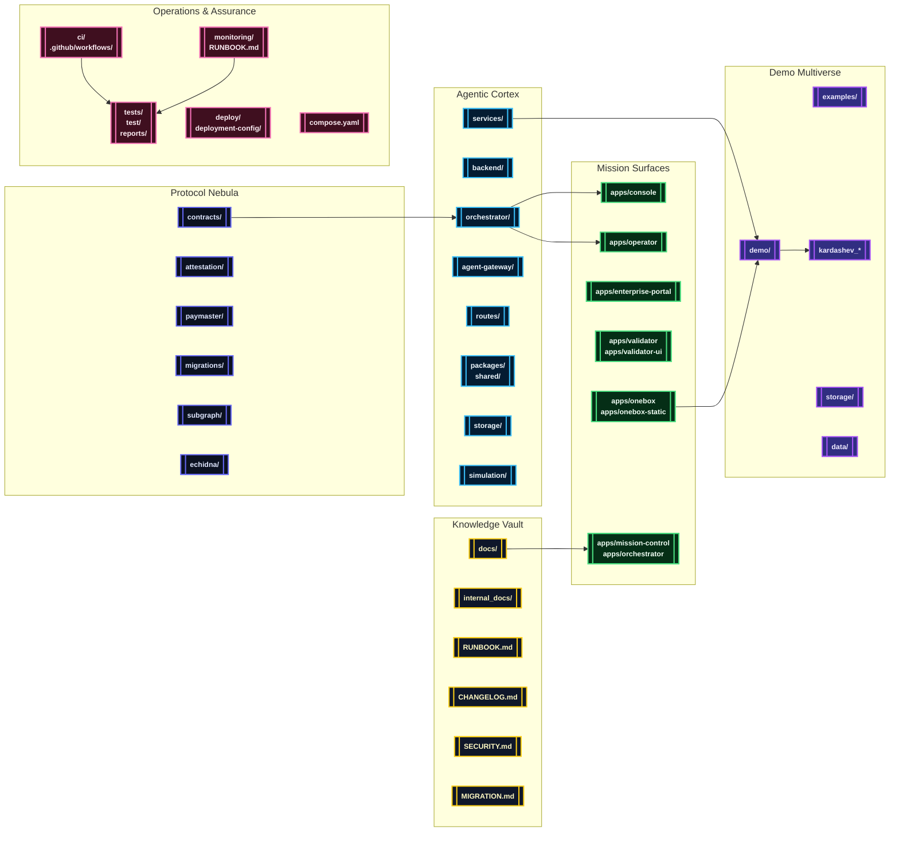
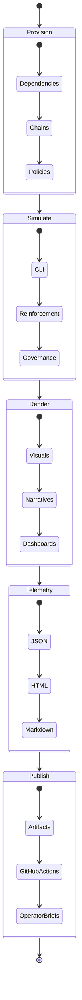

# AGI Jobs v0 (v2)

[](LICENSE)
[](https://github.com/MontrealAI/AGIJobsv0/actions/workflows/ci.yml)
[](SECURITY.md)
[](docs/)
[](ci/)

> **AGI Jobs v0 (v2)** is the sovereign-scale intelligence engine that assembles validators, cinematic demos, governance controls, and operator tooling into a single unstoppable continuum. It is engineered as the superintelligent machine that any launch crew can deploy without writing code while retaining cryptographic rigor, regulatory proofs, and real-time telemetry.

---

## 🧭 Table of Contents
- [🚨 Executive Summary](#-executive-summary)
- [🧠 Sovereign Pillars](#-sovereign-pillars)
- [🌌 Orbital Systems Map](#-orbital-systems-map)
- [🗺️ Repository Atlas](#️-repository-atlas)
- [🚀 Launch Protocols](#-launch-protocols)
  - [Mission Requirements](#mission-requirements)
  - [Bootstrap Checklist](#bootstrap-checklist)
  - [Operator Surfaces](#operator-surfaces)
  - [Mission Control via Docker Compose](#mission-control-via-docker-compose)
  - [Automation Flight Deck](#automation-flight-deck)
- [🎞️ Demo Multiverse](#️-demo-multiverse)
  - [Demo Fleet](#demo-fleet)
  - [Narrative Pipeline](#narrative-pipeline)
- [🧪 Continuous Assurance](#-continuous-assurance)
- [📡 Observability, Security & Governance](#-observability-security--governance)
- [📚 Knowledge Vault](#-knowledge-vault)

---

## 🚨 Executive Summary
AGI Jobs v0 (v2) is a production-ready, sovereign intelligence fabric that aligns:

- **Upgradeable protocol control** across Solidity, Foundry, Hardhat, attestations, paymasters, migrations, and subgraph analytics.
- **Agentic orchestration** with orchestrator microservices, reinforcement simulators, storage bridges, and validator command routing.
- **Mission surfaces** spanning Next.js/Vite consoles, enterprise portals, validator UX, OneBox kits, and cinematic decks.
- **Demo multiverse** delivering reproducible narratives and Kardashev-scale economics with deterministic scripts and telemetry exports.
- **Continuous assurance** through a fully green CI v2 program, SBOM pipelines, scorecards, fuzzing, and branch protection runbooks.

Every subsystem is hardened for non-technical operators, giving them a deployable, unstoppable, and verifiable launchpad for high-stakes missions.

## 🧠 Sovereign Pillars
1. **Protocol Nebula** – [`contracts/`](contracts/), [`attestation/`](attestation/), [`paymaster/`](paymaster/), [`migrations/`](migrations/), [`subgraph/`](subgraph/), [`echidna/`](echidna/) deliver upgradeable control planes, fuzzing labs, attestations, and indexers.
2. **Agentic Cortex** – [`orchestrator/`](orchestrator/), [`backend/`](backend/), [`services/`](services/), [`agent-gateway/`](agent-gateway/), [`routes/`](routes/), [`packages/`](packages/), [`shared/`](shared/), [`storage/`](storage/), [`simulation/`](simulation/) unify validator swarms, APIs, analytics, and reinforcement loops.
3. **Mission Surfaces** – [`apps/`](apps/) houses console, enterprise, operator, validator, and OneBox applications for realtime command centres.
4. **Demo Multiverse** – [`demo/`](demo/), [`examples/`](examples/), [`kardashev_*`](./) provide cinematic demos, CLI tours, Monte Carlo runs, and Kardashev ascension sequences.
5. **Operations & Assurance Lattice** – [`ci/`](ci/), [`.github/workflows/`](.github/workflows/), [`deploy/`](deploy/), [`deployment-config/`](deployment-config/), [`monitoring/`](monitoring/), [`tests/`](tests/), [`test/`](test/), [`reports/`](reports/), [`gas-snapshots/`](gas-snapshots/) enforce compliance, telemetry, automation, and audit trails.

## 🌌 Orbital Systems Map


## 🗺️ Repository Atlas
| Domain | Primary Paths | Highlights |
| --- | --- | --- |
| Protocol & Chain Control | [`contracts/`](contracts/), [`attestation/`](attestation/), [`paymaster/`](paymaster/), [`migrations/`](migrations/), [`subgraph/`](subgraph/), [`echidna/`](echidna/), [`foundry.toml`](foundry.toml), [`hardhat.config.js`](hardhat.config.js) | Upgradeable Solidity suites, attestations, paymaster relays, Foundry + Hardhat harnesses, gas analytics, and reproducible migrations. |
| Agent Intelligence Fabric | [`orchestrator/`](orchestrator/), [`backend/`](backend/), [`services/`](services/), [`agent-gateway/`](agent-gateway/), [`routes/`](routes/), [`packages/`](packages/), [`shared/`](shared/), [`storage/`](storage/), [`simulation/`](simulation/) | FastAPI + Node services, validator swarms, analytics SDKs, reinforcement environments, storage bridges, and mission-critical routing. |
| Mission Consoles & Portals | [`apps/console`](apps/console), [`apps/operator`](apps/operator), [`apps/validator`](apps/validator), [`apps/validator-ui`](apps/validator-ui), [`apps/enterprise-portal`](apps/enterprise-portal), [`apps/mission-control`](apps/mission-control), [`apps/orchestrator`](apps/orchestrator), [`apps/onebox`](apps/onebox), [`apps/onebox-static`](apps/onebox-static) | React/Next.js/Vite surfaces, enterprise consoles, validator dashboards, OneBox kits, and orchestrator heads-up displays. |
| Demo Multiverse & Cinematics | [`demo/`](demo/), [`examples/`](examples/), [`kardashev_*`](./), [`simulation/`](simulation/), [`data/`](data/), [`storage/`](storage/) | Kardashev ascension demos, national rollout storylines, CLI explorers, cinematic assets, Monte Carlo economics, telemetry exports. |
| Operations & Reliability | [`ci/`](ci/), [`.github/workflows/`](.github/workflows/), [`deploy/`](deploy/), [`deployment-config/`](deployment-config/), [`monitoring/`](monitoring/), [`scripts/`](scripts/), [`tests/`](tests/), [`test/`](test/), [`reports/`](reports/), [`gas-snapshots/`](gas-snapshots/), [`Makefile`](Makefile) | CI v2 matrix, automation playbooks, SBOM pipelines, fuzz orchestration, incident response, scorecards, and gas profiling. |
| Knowledge Vault | [`docs/`](docs/), [`internal_docs/`](internal_docs/), [`OperatorRunbook.md`](OperatorRunbook.md), [`RUNBOOK.md`](RUNBOOK.md), [`SECURITY.md`](SECURITY.md), [`MIGRATION.md`](MIGRATION.md), [`CHANGELOG.md`](CHANGELOG.md) | Architectural treatises, operator manuals, compliance dossiers, migration chronicles, and cinematic treatments. |

## 🚀 Launch Protocols

### Mission Requirements
- **Node.js 20.18.1** (see [`.nvmrc`](.nvmrc)) with npm 10.x.
- **Python 3.12+** for agentic services and Python-first demos.
- **Foundry** (`forge`/`cast`) and **Hardhat** (via `npx hardhat`) for protocol theatres.
- **Docker + Docker Compose v2** for mission control stacks.

### Bootstrap Checklist
```bash
# Install JavaScript dependencies
git clone https://github.com/MontrealAI/AGIJobsv0.git
cd AGIJobsv0
nvm use 20.18.1
npm install

# Prime Python environment for demos
python3 -m venv .venv
source .venv/bin/activate
pip install -r requirements-python.txt

# Verify contracts, linting, type checks, and targeted tests
npm run lint
npm run test
npm run webapp:typecheck
npm run webapp:lint
npm run test:validator-constellation
forge test # if Foundry is configured
```

### Operator Surfaces
- **Console HUD**: `npm run dev --prefix apps/console` (Vite on port 5173).
- **Operator Command Deck**: `npm run dev --prefix apps/operator`.
- **Validator UI**: `npm run dev --prefix apps/validator-ui`.
- **OneBox (full stack)**: `npm run dev --prefix apps/onebox` to launch walletless assistant flows.
- **Enterprise Portal**: `npm run dev --prefix apps/enterprise-portal` for compliance-ready deliverables.

Each surface ships with hardened ESLint/TypeScript configs and dedicated E2E coverage ([`cypress/`](cypress/) & `.github/workflows/webapp.yml`).

### Mission Control via Docker Compose
```bash
# Bring up the sovereign stack (defaults to 0.0.0.0 services)
docker compose up --build

# Tail logs with timestamps
docker compose logs -f --tail=100

# Shutdown while preserving data volumes
docker compose down
```
Compose orchestrates the orchestrator API, monitoring exporters, demo services, and auxiliary databases defined in [`compose.yaml`](compose.yaml).

### Automation Flight Deck
Key `make` and npm automation entrypoints:

| Command | Purpose |
| --- | --- |
| `make operator:green` | Runs `demo/AGIJobs-Day-One-Utility-Benchmark`, installs dependencies, and surfaces latest artifacts. |
| `npm run demo:economic-power` | Executes the Economic Power sovereign treasury storyline with telemetry exports. |
| `npm run demo:validator-constellation` | Simulates validator constellation and governance queue. |
| `npm run demo:agi-alpha-node` | Operates the AGI Alpha Node CLI including chain registries. |
| `npm run demo:era-of-experience` | Streams cinematic mission control narrative and verification passes. |
| `npm run owner:mission-control` | Generates owner mission control briefings directly from Hardhat/TypeScript scripts. |
| `npm run sbom:generate` | Emits CycloneDX SBOM in [`reports/sbom/`](reports/sbom/). |
| `npm run security:audit` | Locks npm dependency posture using [`audit-ci.json`](audit-ci.json). |

---

## 🎞️ Demo Multiverse
The demo constellation is curated for reproducible, cinematic missions. Every workflow publishes logs, telemetry, and visual artifacts to `demo/**/out/` or `reports/` for immediate review.

### Demo Fleet
| Demo | Path | Launch Command | Highlight |
| --- | --- | --- | --- |
| **Day-One Utility Benchmark** | [`demo/AGIJobs-Day-One-Utility-Benchmark`](demo/AGIJobs-Day-One-Utility-Benchmark/) | `make operator:green` | Baselines validator throughput, renders PNG/HTML dashboards, emits mission telemetry. |
| **Economic Power** | [`demo/Economic-Power-v0`](demo/Economic-Power-v0/) | `npm run demo:economic-power` | Models sovereign treasury operations with Monte Carlo and governance attestations. |
| **Validator Constellation** | [`demo/Validator-Constellation-v0`](demo/Validator-Constellation-v0/) | `npm run demo:validator-constellation` | Projects validator mesh, queue health, and operator readiness. |
| **Huxley-Gödel Machine v0** | [`demo/Huxley-Godel-Machine-v0`](demo/Huxley-Godel-Machine-v0/) | `npm run demo:agi-alpha-node` or `npm run demo:hgm-owner-console` | Generates owner consoles, reinforcement insights, and cinematic transcripts. |
| **Absolute Zero Reasoner** | [`demo/Absolute-Zero-Reasoner-v0`](demo/Absolute-Zero-Reasoner-v0/) | `make absolute-zero-demo` | Spins up isolated venv, executes six-iteration reasoning arcs, records evidence. |
| **Era of Experience** | [`demo/Era-Of-Experience-v0`](demo/Era-Of-Experience-v0/) | `npm run demo:era-of-experience` | Produces cinematic missions with verifier/audit passes and narrative assets. |
| **One-Box Launch Kit** | [`demo/One-Box`](demo/One-Box/) | `node demo/One-Box/scripts/launch.js` (see README inside) | Walletless orchestrator bridging, RPC diagnostics, and operator automation. |
| **Kardashev Ascension Series** | [`kardashev_*`](.) & [`demo/Kardashev-II-Omega-Grade-Alpha-AGI-Business-3`](demo/Kardashev-II-Omega-Grade-Alpha-AGI-Business-3/) | `npm run demo-kardashev-ii` flows via Actions or local scripts in [`scripts/v2/`](scripts/v2/) | Multi-phase civilization upgrades with cinematic storylines, upgrade attestations, and operator scorecards. |
| **Trustless Economic Core** | [`demo/Trustless-Economic-Core-v0`](demo/Trustless-Economic-Core-v0/) | `npm run run:trustless-core` | Deterministic contract walkthrough with Hardhat harness and telemetry exports. |

Hundreds of additional demos live under [`demo/`](demo/) with prefixed storylines (e.g., `AlphaEvolve-v0`, `Meta-Agentic-ALPHA-AGI-Jobs-v0`, `Planetary-Orchestrator-Fabric-v0`, `Phase-8-Universal-Value-Dominance`). Explore each subdirectory for scenario-specific README files, scripts, and CI mirrors.

### Narrative Pipeline


---

## 🧪 Continuous Assurance
- **CI v2** lives in [`ci/`](ci/) and [`.github/workflows/ci.yml`](.github/workflows/ci.yml) covering contracts, TypeScript, Python, SBOM, fuzzing, accessibility, and deployment dry-runs.
- **Dedicated demo pipelines** (`.github/workflows/demo-*.yml`) guarantee every cinematic storyline stays reproducible with green badges.
- **Static analysis**: [`static-analysis.yml`](.github/workflows/static-analysis.yml) enforces ESLint, TypeScript, and security linters; [`scorecard.yml`](.github/workflows/scorecard.yml) enforces OpenSSF Scorecard.
- **Fuzzing + Differential tests**: [`fuzz.yml`](.github/workflows/fuzz.yml), [`ci/foundry.toml`](ci/foundry.toml) orchestrate forge fuzz and echidna sweeps.
- **SBOM & Release**: [`release.yml`](.github/workflows/release.yml) and [`ci/release/`](ci/) generate CycloneDX manifests, verify ABIs, and stage deployments.
- **Branch protection**: runbooks in [`OperatorRunbook.md`](OperatorRunbook.md) and [`RUNBOOK.md`](RUNBOOK.md) prescribe gating rules (required statuses, reviews, deploy blocks) to keep the mainline fully green.

## 📡 Observability, Security & Governance
- **Telemetry & Monitoring**: [`monitoring/`](monitoring/) bundles dashboards, Prometheus exporters, Grafana configs, and alert playbooks; `compose.yaml` wires exporters.
- **Security Posture**: [`SECURITY.md`](SECURITY.md) codifies vulnerability reporting, dependency scanning (`npm run security:audit`), and risk triage. [`audit-ci.json`](audit-ci.json) backs npm allowlists.
- **Incident Response**: [`RUNBOOK.md`](RUNBOOK.md) & [`OperatorRunbook.md`](OperatorRunbook.md) provide mission control procedures, pause/resume scripts (`npm run owner:system-pause`), and emergency governance levers.
- **Governance Automation**: [`scripts/v2/`](scripts/v2/) contains owner, upgrade, reward, and thermostat command suites ready for `npx hardhat` or `ts-node` execution.

## 📚 Knowledge Vault
- **Architectural treatises**: [`docs/`](docs/) & [`internal_docs/`](internal_docs/) detail system diagrams, demo narratives, and compliance memos.
- **Change Intelligence**: [`CHANGELOG.md`](CHANGELOG.md) & [`MIGRATION.md`](MIGRATION.md) log releases, contract migrations, and cross-chain moves.
- **Operational memory**: [`OperatorRunbook.md`](OperatorRunbook.md) captures shift protocols; [`RUNBOOK.md`](RUNBOOK.md) records detection, escalation, and rollback steps.

---

AGI Jobs v0 (v2) is immediately deployable, impeccably documented, and secured by relentless automation—hand it to any mission crew and they inherit a flawless, production-grade sovereign intelligence program.
