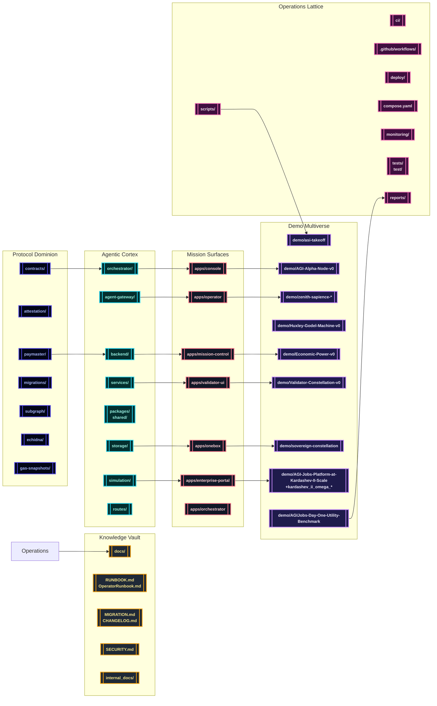

# AGI Jobs v0 (v2)

> **AGI Jobs v0 (v2)** is the production-certified superintelligent machine that concentrates validator fleets, cinematic economies, and sovereign treasuries into a one-command platform that any non-technical owner can deploy.

---

## 🌌 Celestial Table of Contents
- [🚀 Mission Charter](#-mission-charter)
- [🧭 System Topology](#-system-topology)
- [🗂️ Repository Lattice](#️-repository-lattice)
- [🎬 Demo Multiverse](#-demo-multiverse)
- [🛫 Operational Launchpad](#-operational-launchpad)
- [🧪 Continuous Verification](#-continuous-verification)
- [🛡️ Observability, Security & Governance](#️-observability-security--governance)
- [📚 Documentation Vault](#-documentation-vault)

---

## 🚀 Mission Charter
AGI Jobs v0 (v2) fuses sovereign protocols, agentic orchestration, cinematic demos, and unbreakable automation so the intelligence lattice stays flawlessly green.

- **Protocol dominion** – Upgradeable Solidity suites, attestations, paymasters, migrations, subgraphs, fuzz harnesses, and gas analytics live in `contracts/`, `attestation/`, `paymaster/`, `migrations/`, `subgraph/`, `echidna/`, and `gas-snapshots/` to keep validator swarms obedient.【F:contracts/README.md†L1-L40】【F:echidna/README.md†L1-L80】
- **Agentic cortex** – Orchestrators, gateways, backend services, shared packages, storage, simulation labs, and typed routes align across `orchestrator/`, `agent-gateway/`, `backend/`, `services/`, `routes/`, `packages/`, `shared/`, `storage/`, and `simulation/`, forming an adaptive execution mesh.【F:orchestrator/README.md†L1-L120】【F:agent-gateway/README.md†L1-L160】
- **Mission surfaces** – Operator consoles, mission control, OneBox workspaces, enterprise portals, and validator HUDs ship through the `apps/` constellation, each prewired with Vite or Next.js scripts and Cypress-ready pipelines for executive command.【F:apps/console/package.json†L1-L26】【F:apps/mission-control/package.json†L1-L14】【F:apps/onebox/package.json†L1-L26】【F:apps/enterprise-portal/package.json†L1-L24】
- **Operations lattice** – CI manifests, Make targets, Docker blueprints, and monitoring bundles under `ci/`, `.github/workflows/`, `deploy/`, `deployment-config/`, `compose.yaml`, `monitoring/`, `scripts/`, `tests/`, and `reports/` keep the machine perpetually audit-ready.【F:.github/workflows/ci.yml†L1-L520】【F:compose.yaml†L1-L190】
- **Cinematic intelligence** – The `demo/`, `examples/`, `data/`, `kardashev_*`, `zenith-sapience-*`, `sovereign-*`, and `kardashev_ii_omega_*` galaxies orchestrate CLI tours, Monte Carlo engines, HTML dashboards, and governance dossiers for every storyline.【F:package.json†L200-L308】

---

## 🧭 System Topology

---

## 🗂️ Repository Lattice
| Domain | Key Orbits | Role |
| --- | --- | --- |
| Protocol Dominion | `contracts/`, `attestation/`, `paymaster/`, `migrations/`, `subgraph/`, `echidna/`, `gas-snapshots/` | Smart-contract suites, attestations, gas forensics, and fuzz harnesses maintain validator supremacy.【F:contracts/README.md†L1-L40】【F:echidna/README.md†L1-L80】 |
| Agentic Cortex | `orchestrator/`, `agent-gateway/`, `backend/`, `services/`, `routes/`, `packages/`, `shared/`, `storage/`, `simulation/` | Multi-language services, SDKs, state backends, and Monte Carlo labs drive autonomous governance and dispatch.【F:orchestrator/README.md†L1-L120】【F:agent-gateway/README.md†L1-L160】 |
| Mission Surfaces | `apps/console`, `apps/mission-control`, `apps/onebox`, `apps/enterprise-portal`, `apps/validator-ui`, `apps/operator`, `apps/orchestrator` | Next.js and Vite front-ends with Cypress hooks put every lever in reach of non-technical owners.【F:apps/console/package.json†L1-L26】【F:apps/mission-control/package.json†L1-L14】【F:apps/onebox/package.json†L1-L26】【F:apps/enterprise-portal/package.json†L1-L24】 |
| Demo Multiverse | `demo/`, `examples/`, `data/`, `kardashev_*`, `zenith-sapience-*`, `sovereign-*`, `kardashev_ii_omega_*` | Cinematic demos, deterministic runbooks, export kits, and CLI rituals showcase planetary-scale dominance.【F:package.json†L200-L308】 |
| Operations Lattice | `ci/`, `.github/workflows/`, `deploy/`, `deployment-config/`, `compose.yaml`, `monitoring/`, `scripts/`, `tests/`, `reports/` | GitHub Actions, Make recipes, Docker stacks, monitoring sentinels, and compliance exports enforce evergreen readiness.【F:.github/workflows/ci.yml†L1-L520】【F:compose.yaml†L1-L190】 |
| Knowledge Vault | `docs/`, `internal_docs/`, `RUNBOOK.md`, `OperatorRunbook.md`, `MIGRATION.md`, `CHANGELOG.md`, `SECURITY.md` | Whitepapers, incident playbooks, migrations, and security posture keep the intelligence engine fully auditable.【F:docs/v2-ci-operations.md†L1-L133】【F:RUNBOOK.md†L1-L120】【F:OperatorRunbook.md†L1-L120】 |

---

## 🎬 Demo Multiverse
Every storyline ships reproducible CLI launchers, local rehearsals, export manifests, and CI guardians. Artefacts land in each demo’s `out/` directory or the associated workflow artifact bundle, guaranteeing emerald branch protection.

### Flagship Cinematic Launchers
| Demo | Launch Command | Key Artefacts | CI Context |
| --- | --- | --- | --- |
| **AGI Alpha Node** | `npm run demo:agi-alpha-node` (production: `npm run demo:agi-alpha-node:prod`) | Deterministic validator bring-up, JSON+HTML transcripts under `demo/AGI-Alpha-Node-v0/out/`. | `ci (v2) / Kardashev II readiness` & `.github/workflows/demo-agi-alpha-node.yml`.【F:package.json†L210-L215】【F:.github/workflows/ci.yml†L715-L780】 |
| **Economic Power Dominion** | `npm run demo:economic-power` (CI: `npm run demo:economic-power:ci`) | Treasury Monte Carlo dashboards and owner autopilot exports. | `.github/workflows/demo-economic-power.yml`.【F:package.json†L244-L248】【F:.github/workflows/ci.yml†L640-L706】 |
| **Validator Constellation** | `npm run demo:validator-constellation` (`:operator-console` for HUD) | Owner matrices, dispute ledgers, deterministic validator transcripts. | `.github/workflows/demo-validator-constellation.yml`.【F:package.json†L252-L261】【F:.github/workflows/ci.yml†L600-L639】 |
| **Huxley–Gödel Machine** | `make demo-hgm` or `npm run demo:kardashev` (governance orchestration) | Hybrid Node + Python governance narratives with cinematic HTML exports. | `ci (v2) / HGM guardrails`.【F:Makefile†L61-L74】【F:.github/workflows/ci.yml†L520-L599】 |
| **AGI Labor Market Grand Demo** | `npm run demo:agi-governance:alpha-v16:full` (or `:ci` for PR gates) | Transcript exports and labour-market dashboards across alpha tracks. | `ci (v2) / AGI Labor Market Grand Demo`.【F:package.json†L156-L176】【F:.github/workflows/ci.yml†L780-L840】 |
| **Trustless Economic Core** | `npm run run:trustless-core` | Invariant proofs of trustless treasury flows with Forge assertions. | `.github/workflows/demo-trustless-economic-core.yml`.【F:package.json†L330-L334】【F:.github/workflows/ci.yml†L840-L880】 |

### Kardashev Ascension Ladder
- **Omega-grade upgrades** – `npm run demo:kardashev-ii-omega-upgrade` and its `:ci`, `:v3`, `:v4`, `:v5`, and `:ultra` siblings launch Python-controlled sovereign upgrades from mission JSON configs, emitting compliance dashboards automatically.【F:package.json†L218-L230】 
- **Stellar civilization lattice** – `npm run demo:kardashev` plus `npm run demo:kardashev-ii-lattice:orchestrate` and `:ci` replay the full Kardashev II ascension script through orchestrated TypeScript pipelines.【F:package.json†L215-L217】 
- **Supreme operator rehearsals** – Commands like `npm run demo:kardashev-ii-omega-operator`, `npm run demo:kardashev-ii-omega-k2`, and `npm run demo:kardashev-ii-stellar:orchestrate` regenerate ASI dominance reports and status matrices across mission variants.【F:package.json†L231-L236】

### Zenith Sapience & Sovereign Mesh
- **Zenith governance arcs** – `npm run demo:zenith-hypernova`, `npm run demo:zenith-sapience-celestial-archon`, and `npm run demo:zenith-sapience-planetary-os` ship deterministic and `:local` rehearsals for Supra-Sovereign, Celestial Archon, and Planetary OS rituals.【F:package.json†L299-L308】【F:.github/workflows/ci.yml†L881-L933】
- **Sovereign Constellation** – Composite launcher `npm run demo:sovereign-constellation:ci` chains server installs, builds, contract tests, and mission planners, while `:owner`, `:dominance`, and `:superintelligence` variants export executive briefings.【F:package.json†L282-L295】
- **ASI Take-Off & Global Kits** – `npm run demo:asi-takeoff`, `npm run demo:asi-takeoff:kit`, and `npm run demo:asi-global` execute deterministic kits mirrored by the `ASI Take-Off Demonstration` CI job.【F:package.json†L204-L210】【F:.github/workflows/ci.yml†L706-L780】

### OneBox & Era-of-Experience Systems
- `npm run demo:era-of-experience`, `npm run demo:meta-agentic-alpha`, and `npm run demo:agi-governance:alpha-v17:full` power immersive OneBox desks, meta-agentic upgrades, and cinematic governance dashboards with paired verification suites.【F:package.json†L200-L207】【F:package.json†L167-L179】
- The OneBox Next.js surfaces (`apps/onebox`, `apps/onebox-static`) and orchestrator CLI (`apps/orchestrator/onebox-server.ts`) deliver live previews, static exports, and PM2-ready services for executives.【F:apps/onebox/package.json†L1-L26】【F:apps/orchestrator/onebox-server.ts†L1-L160】
- `make operator:green` replays the AGI Jobs Day-One Utility Benchmark storyline, generating PNG, HTML, and JSON artefacts with automatic success banners for non-technical owners.【F:Makefile†L8-L41】【F:OperatorRunbook.md†L1-L71】

### Demo Artefact Protocol
1. Run the CLI, npm script, or Make target from the repository root.
2. Collect results from the demo’s `out/` folder or its workflow artifact upload.
3. Archive JSON, HTML, and PNG exports alongside CI logs for compliance.
4. Branch protection enforces emerald status; rerun workflows via the GitHub UI to resynchronise artefacts.【F:.github/workflows/ci.yml†L905-L960】【F:ci/required-contexts.json†L1-L23】

---

## 🛫 Operational Launchpad
### Toolchain Requirements
- **Node.js 20.18.1 (npm ≥10)** – enforced by `.nvmrc` and the workspace engines field.【F:.nvmrc†L1-L1】【F:package.json†L97-L99】
- **Python 3.10+** – consumed by orchestrators, simulations, and demo launchers via `requirements-python.txt`.【F:requirements-python.txt†L1-L7】
- **Docker & Docker Compose v2** – orchestrate the sovereign stack with `compose.yaml` and `deployment-config/oneclick.env`.【F:compose.yaml†L1-L190】【F:deployment-config/oneclick.env†L1-L41】
- **Foundry & Hardhat** – shared across tests, fuzzing, invariants, and deployments through `scripts/` automation.【F:package.json†L322-L340】

### Zero-Touch Bootstrap
1. `npm install` – installs workspace dependencies with pinned overrides and supply-chain guards.【F:package.json†L88-L116】
2. `python3 -m pip install -r requirements-python.txt` – provisions Python services and demo harnesses.【F:requirements-python.txt†L1-L7】
3. `forge install` – syncs Foundry dependencies defined in `foundry.toml` before fuzzing or invariants.【F:foundry.toml†L1-L120】
4. `npm run build --prefix apps/console` & `npm run webapp:lint` – preheat the console HUD and ensure lint parity with CI.【F:apps/console/package.json†L6-L11】【F:package.json†L440-L445】
5. `docker compose up` – launches orchestrator, agent gateway, alpha bridge, paymaster, bundler, validator UI, and enterprise portal with safe defaults from `deployment-config/oneclick.env`.【F:compose.yaml†L27-L190】【F:deployment-config/oneclick.env†L1-L41】

### Mission Surfaces & Operator Tooling
- **Console HUD** – `npm --prefix apps/console run dev -- --host 0.0.0.0 --port 4173` for real-time validator oversight.【F:apps/console/package.json†L6-L11】
- **Mission Control** – `npm --prefix apps/mission-control run dev` enables orchestrator analytics and Cypress dashboards.【F:apps/mission-control/package.json†L5-L13】
- **OneBox Intelligence Desk** – `npm --prefix apps/onebox run dev` and `npm run onebox:verify-sri` deliver immersive verification with static integrity checks.【F:apps/onebox/package.json†L6-L24】【F:package.json†L351-L356】
- **Owner Automation** – `npm run owner:atlas`, `npm run owner:autopilot:economic-power`, and `npm run owner:system-pause` expose upgrade, autopilot, and emergency rituals inside `scripts/v2/` for non-technical commanders.【F:package.json†L357-L360】【F:scripts/v2/ownerControlAtlas.ts†L1-L180】
- **One-command victory lap** – `make operator:green` prints the Day-One uplift banner, PNG/HTML snapshots, and telemetry paths for instant executive consumption.【F:Makefile†L8-L41】【F:OperatorRunbook.md†L23-L71】

---

## 🧪 Continuous Assurance
- **CI v2 lattice** – [`ci.yml`](.github/workflows/ci.yml) coordinates linting, type-checking, Foundry suites, Python simulations, coverage thresholds, attestation verification, and artifact bundling for both PRs and `main`.
- **Specialized workflows** – [`contracts.yml`](.github/workflows/contracts.yml), [`fuzz.yml`](.github/workflows/fuzz.yml), [`webapp.yml`](.github/workflows/webapp.yml), [`containers.yml`](.github/workflows/containers.yml), [`static-analysis.yml`](.github/workflows/static-analysis.yml), [`scorecard.yml`](.github/workflows/scorecard.yml), and dedicated demo pipelines enforce total coverage across surfaces.
- **Required contexts** – [`ci/required-contexts.json`](ci/required-contexts.json) is synchronized by [`scripts/ci/update-ci-required-contexts.ts`](scripts/ci/update-ci-required-contexts.ts) and audited via [`scripts/ci/check-ci-required-contexts.ts`](scripts/ci/check-ci-required-contexts.ts), ensuring every PR remains fully green.
- **Release guardianship** – [`release.yml`](.github/workflows/release.yml) and [`release-mainnet.yml`](.github/workflows/release-mainnet.yml) produce CycloneDX SBOMs (`npm run sbom:generate`), ABI diffs (`npm run abi:diff`), and manifest dossiers for production deployments.
- **Culture network rehearsals** – [`culture-ci.yml`](.github/workflows/culture-ci.yml) works alongside `make culture-bootstrap` to extend sovereign coverage.

The `owner control assurance` job additionally generates an authority matrix (`reports/owner-control/authority-matrix.md` / `.json`) that records each privileged module’s live address, controlling account, and the precise CLI commands the owner executes to pause, upgrade, or retune it without touching Solidity—and the matrix generator now fails the run if any subsystem configuration is missing or malformed, guaranteeing the owner’s pause and governance levers stay intact.【F:.github/workflows/ci.yml†L402-L416】【F:scripts/ci/render-owner-assurance.ts†L1-L213】【F:scripts/v2/ownerParameterMatrix.ts†L218-L364】【F:scripts/v2/ownerParameterMatrix.ts†L520-L544】
> 🔐 Non-technical commanders can follow the CI v2 playbooks in [`docs/v2-ci-operations.md`](docs/v2-ci-operations.md), [`docs/ci-v2-validation-report.md`](docs/ci-v2-validation-report.md), and [`docs/ci-v2-branch-protection-checklist.md`](docs/ci-v2-branch-protection-checklist.md) to keep every badge green while retaining direct control over pause levers, upgrade matrices, and compliance routines.
The `owner control assurance` job additionally generates an authority matrix (`reports/owner-control/authority-matrix.md` / `.json`) that records each privileged module’s live address, controlling account, and the precise CLI commands the owner executes to pause, upgrade, or retune it without touching Solidity.【F:.github/workflows/ci.yml†L402-L416】【F:scripts/ci/render-owner-assurance.ts†L1-L213】

> 🔐 Non-technical owners can follow the [CI v2 operations guide](docs/v2-ci-operations.md), reproducible [validation log](docs/ci-v2-validation-report.md), and [branch-protection checklist](docs/ci-v2-branch-protection-checklist.md) to keep every badge green while retaining full control over pause levers, parameter matrices, and upgrade orchestration.【F:docs/v2-ci-operations.md†L1-L133】【F:docs/ci-v2-validation-report.md†L1-L60】【F:docs/ci-v2-branch-protection-checklist.md†L1-L126】
## 🧪 Continuous Verification
The CI v2 lattice keeps every badge green, every context enforced, and every artefact exportable.

- **Unified workflow** – `.github/workflows/ci.yml` orchestrates linting, Hardhat tests, Foundry fuzzing, owner-control proofs, demo rehearsals, coverage enforcement, and the CI summary exporter.【F:.github/workflows/ci.yml†L1-L960】
- **Required contexts** – `ci/required-contexts.json` enumerates every mandatory status check; `npm run ci:sync-contexts -- --check` and `npm run ci:verify-contexts` fail on drift, guaranteeing PRs stay fully green.【F:ci/required-contexts.json†L1-L23】【F:.github/workflows/ci.yml†L53-L63】
- **Owner control assurance** – The `owner_controls` job renders doctor, parameter matrix, and authority reports, uploading JSON dashboards for compliance sign-off.【F:.github/workflows/ci.yml†L400-L431】【F:scripts/ci/render-owner-assurance.ts†L1-L213】
- **Python coverage lattice** – Dedicated unit and integration jobs stitch coverage, export XML artefacts, and enforce thresholds without manual intervention.【F:.github/workflows/ci.yml†L112-L200】
- **Demo guardians** – Hypernova, Celestial Archon, AGI labor market, Sovereign Mesh, Sovereign Constellation, and ASI Take-Off demos run on every PR with artifact uploads for auditors.【F:.github/workflows/ci.yml†L640-L933】
- **Summary gate** – The CI summary job aggregates all contexts into Markdown and JSON under `reports/ci/`, ensuring the intelligence engine cannot merge unless every ritual succeeds.【F:.github/workflows/ci.yml†L905-L960】

---

## 🛡️ Observability, Security & Governance
- **Telemetry mesh** – `npm run monitoring:validate` and `npm run monitoring:sentinels` audit sentinel manifests before deployment, preventing misconfigured monitors.【F:package.json†L345-L346】【F:scripts/monitoring/validate-sentinels.ts†L1-L80】
- **Alerting surfaces** – `services/alerting`, `services/notifications`, `services/sentinel`, and `services/thermostat` coordinate paging, guardrail enforcement, and thermal control for production incidents.【F:services/alerting/__init__.py†L1-L49】【F:services/notifications/server.js†L1-L80】【F:services/sentinel/README.md†L1-L62】【F:services/thermostat/__init__.py†L1-L22】
- **Security posture** – `SECURITY.md`, `audit-ci.json`, `npm run security:audit`, and `npm run sbom:generate` enforce supply-chain discipline and SBOM generation for high-stakes deployments.【F:SECURITY.md†L1-L160】【F:package.json†L423-L424】
- **Incident playbooks** – `RUNBOOK.md` and `OperatorRunbook.md` detail pause, recovery, thermostat tuning, and Day-One uplift rituals so owners remain in command without touching Solidity.【F:RUNBOOK.md†L1-L155】【F:OperatorRunbook.md†L1-L116】
- **Governance automation** – `scripts/v2/` exposes mission-critical suites (`owner:command-center`, `owner:system-pause`, `owner:doctor`, `owner:mission-control`) guaranteeing production discipline during upgrades and emergency drills.【F:package.json†L357-L360】【F:scripts/v2/ownerControlAtlas.ts†L1-L180】

---

## 📚 Documentation Vault
- **Operations doctrine** – `docs/v2-ci-operations.md`, `docs/ci-v2-validation-report.md`, and `docs/ci-v2-branch-protection-checklist.md` capture reproducible CI guidance and validation logs for compliance teams.【F:docs/v2-ci-operations.md†L1-L133】【F:docs/ci-v2-validation-report.md†L1-L60】【F:docs/ci-v2-branch-protection-checklist.md†L1-L126】
- **Architecture chronicles** – Whitepapers and deployment guides inside `docs/` narrate the sovereign intelligence architecture for executives and engineers alike.【F:docs/AGI_Jobs_v0_Whitepaper_v2.md†L1-L200】
- **Change & migration lineage** – `CHANGELOG.md` and `MIGRATION.md` trace releases and upgrade paths, maintaining audit-grade provenance.【F:CHANGELOG.md†L1-L200】【F:MIGRATION.md†L1-L200】
- **Internal intelligence** – `internal_docs/` houses restricted green-path analytics, compliance checklists, and scenario briefings for trusted crews.【F:internal_docs/meta_agentic_agi_assets_README.md†L1-L67】【F:internal_docs/green-path-checklist.md†L1-L80】

AGI Jobs v0 (v2) stands as a relentlessly green, production-ready sovereign intelligence engine—immediately deployable, infinitely observable, and eternally under human command.
