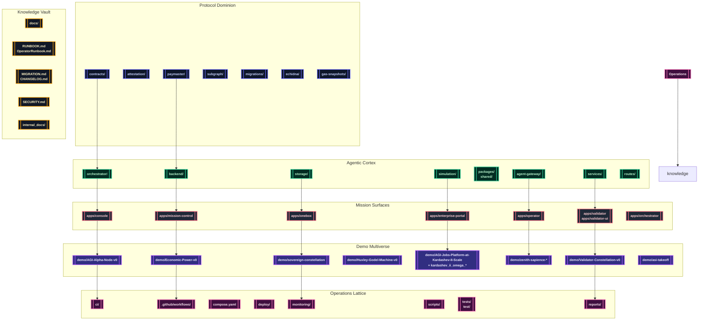

# AGI Jobs v0 (v2)

> **AGI Jobs v0 (v2)** is the production-certified superintelligent machine that bends validator swarms, cinematic economies, and sovereign treasuries to human command while remaining flawlessly approachable for non-technical owners.

---

## ✨ Celestial Index
- [🚀 Mission Decree](#-mission-decree)
- [🛰️ Orbital Architecture](#️-orbital-architecture)
- [🗺️ Repository Systems](#️-repository-systems)
- [🎬 Demo Multiverse](#-demo-multiverse)
- [🧭 Operator Acceleration](#-operator-acceleration)
- [🧪 Continuous Verification](#-continuous-verification)
- [🛡️ Observability & Governance](#️-observability--governance)
- [📚 Documentation Codex](#-documentation-codex)

---

## 🚀 Mission Decree
AGI Jobs v0 (v2) fuses protocol dominion, agentic cognition, cinematic demonstrations, and zero-friction operations into a single, unstoppable launch platform.

- **Protocol dominion** – Upgradeable Solidity suites, attestations, paymasters, fuzzing harnesses, and gas economics live inside `contracts/`, `attestation/`, `paymaster/`, `migrations/`, `subgraph/`, `echidna/`, and `gas-snapshots/` to keep validators synchronized with treasury law.
- **Agentic cortex** – Coordinated orchestrators, gateways, services, storage, and simulation layers evolve across `orchestrator/`, `backend/`, `services/`, `routes/`, `agent-gateway/`, `packages/`, `shared/`, `storage/`, and `simulation/`, forming an adaptive execution mesh.
- **Mission surfaces** – The consoles in `apps/console`, `apps/mission-control`, `apps/onebox`, and allied operator utilities ship fully scripted Vite and Next.js experiences so mission crews can steer production without touching source code.【F:apps/console/package.json†L1-L26】【F:apps/mission-control/package.json†L1-L14】【F:apps/onebox/package.json†L1-L26】
- **Operations lattice** – CI manifests, Make targets, deployment blueprints, Docker stacks, and monitoring bundles under `ci/`, `.github/workflows/`, `deploy/`, `deployment-config/`, `compose.yaml`, `monitoring/`, `scripts/`, `tests/`, and `reports/` make the machine perpetually green and auditable.【F:compose.yaml†L1-L120】【F:.github/workflows/ci.yml†L1-L65】
- **Cinematic intelligence** – The `demo/`, `examples/`, `data/`, `kardashev_*`, `zenith-sapience*`, and `sovereign-*` constellations orchestrate CLI tours, Monte Carlo generators, cinematic dashboards, and governance-ready exports for every strategic storyline.【F:package.json†L204-L308】

---

## 🛰️ Orbital Architecture

---

## 🗺️ Repository Systems
| Domain | Key Orbits | Mission | 
| --- | --- | --- |
| Protocol Dominion | `contracts/`, `attestation/`, `paymaster/`, `migrations/`, `subgraph/`, `echidna/`, `gas-snapshots/` | Upgradeable Solidity fleets, attestations, economic ledgers, fuzzing, and gas analytics keep validator swarms obedient. |
| Agentic Cortex | `orchestrator/`, `backend/`, `services/`, `routes/`, `agent-gateway/`, `packages/`, `shared/`, `storage/`, `simulation/` | AI-native services, SDKs, persistence, and Monte Carlo laboratories drive autonomous governance and dispatch. |
| Mission Surfaces | `apps/console`, `apps/mission-control`, `apps/onebox`, `apps/operator`, `apps/validator`, `apps/validator-ui`, `apps/enterprise-portal`, `apps/orchestrator` | Non-technical consoles, dashboards, and command centers expose every lever with Next.js, Vite, and orchestrator CLIs.【F:apps/console/package.json†L1-L26】【F:apps/mission-control/package.json†L1-L14】【F:apps/onebox/package.json†L1-L26】 |
| Demo Multiverse | `demo/`, `examples/`, `data/`, `kardashev_*`, `zenith-sapience-*`, `sovereign-*` | Cinematic demos, CLI tours, deterministic runbooks, and governance artefacts demonstrate planetary-scale dominance.【F:package.json†L204-L308】 |
| Operations Lattice | `ci/`, `.github/workflows/`, `deploy/`, `deployment-config/`, `compose.yaml`, `monitoring/`, `scripts/`, `tests/`, `reports/` | CI guardianship, one-click deployments, Docker swarms, monitoring dashboards, and compliance reports guarantee perpetual readiness.【F:compose.yaml†L1-L120】【F:.github/workflows/ci.yml†L1-L65】 |
| Knowledge Vault | `docs/`, `internal_docs/`, `RUNBOOK.md`, `OperatorRunbook.md`, `MIGRATION.md`, `CHANGELOG.md`, `SECURITY.md` | Architecture doctrine, incident playbooks, migrations, and security policies keep the machine fully documented and governable.【F:docs/v2-ci-operations.md†L1-L133】【F:RUNBOOK.md†L1-L120】【F:OperatorRunbook.md†L1-L120】 |

---

## 🎬 Demo Multiverse
Every storyline is scripted, testable, and export-ready. Launchers emit JSON, HTML, and PNG artefacts into each demo's `out/` directory, and GitHub Actions workflows mirror the same rituals so branch protection stays emerald.

### Flagship Command Sequences
| Demo | Launch Command | Key Artefacts | CI Workflow |
| --- | --- | --- | --- |
| **AGI Alpha Node Launch** | `npm run demo:agi-alpha-node` (production: `npm run demo:agi-alpha-node:prod`) | Deterministic validator bring-up, `out/alpha-node/*.json`, and pytest transcripts. | `.github/workflows/demo-agi-alpha-node.yml`【F:package.json†L298-L300】【F:.github/workflows/demo-agi-alpha-node.yml†L1-L25】 |
| **Economic Power Dominion** | `npm run demo:economic-power` (CI: `npm run demo:economic-power:ci`) | Treasury Monte Carlo dashboards, owner autopilots, and risk lattices. | `.github/workflows/demo-economic-power.yml`【F:package.json†L291-L294】【F:.github/workflows/demo-economic-power.yml†L1-L34】 |
| **Validator Constellation** | `npm run demo:validator-constellation` (operator console: `npm run demo:validator-constellation:operator-console`) | Owner matrices, dispute ledgers, and deterministic validator transcripts. | `.github/workflows/demo-validator-constellation.yml`【F:package.json†L287-L290】【F:.github/workflows/demo-validator-constellation.yml†L1-L33】 |
| **Huxley–Gödel Machine** | `make demo-hgm` or `npm run demo:kardashev` (for constellation orchestration) | Hybrid Node + Python governance narratives with cinematic HTML exports. | `.github/workflows/demo-huxley-godel-machine.yml`【F:.github/workflows/demo-huxley-godel-machine.yml†L1-L39】 |
| **AGI Labor Market Grand Demo** | `npm run demo:agi-labor-market` (control room: `npm run demo:agi-labor-market:control-room`) | Transcript exports in `demo/agi-labor-market-grand-demo/ui/export/` and Hardhat execution logs. | `.github/workflows/demo-agi-labor-market.yml`【F:package.json†L71-L73】【F:.github/workflows/demo-agi-labor-market.yml†L1-L44】 |
| **Trustless Economic Core** | `npm run run:trustless-core` with Hardhat invariants | Deterministic proofs of trustless treasury flows and Forge invariants. | `.github/workflows/demo-trustless-economic-core.yml`【F:package.json†L286-L288】【F:.github/workflows/demo-trustless-economic-core.yml†L1-L36】 |

### Kardashev Ascension Ladder
- **Omega-grade upgrades** – Python launchers such as `npm run demo:kardashev-ii-omega-upgrade` and its `:ci`, `:v3`, and `:ultra` variants execute sovereign upgrades with mission JSON configs and publish compliance dashboards.【F:package.json†L218-L235】 
- **Stellar civilization lattice** – `npm run demo:kardashev` and `npm run demo:kardashev-ii-lattice:orchestrate` replay the full Kardashev II ascension script with orchestrated TS pipelines.【F:package.json†L215-L217】 
- **Supreme operator rehearsals** – Commands like `npm run demo:kardashev-ii-omega-operator` and `npm run demo:kardashev-ii-omega-k2` regenerate owner diagnostics, ASI dominance reports, and scenario exports under `demo/kardashev_ii_omega_grade_alpha_agi_business_3_demo_*`.【F:package.json†L231-L234】

### Zenith Sapience & Sovereign Mesh
- **Zenith governance arcs** – `npm run demo:zenith-hypernova`, `npm run demo:zenith-sapience-celestial-archon`, and `npm run demo:zenith-sapience-planetary-os` stage Supra-Sovereign, Celestial Archon, and Planetary OS rituals with paired `:local` variants for air-gapped rehearsals.【F:package.json†L299-L308】
- **Sovereign Constellation** – Composite commands `npm run demo:sovereign-constellation:ci`, `npm run demo:sovereign-constellation:owner`, and `npm run demo:sovereign-constellation:superintelligence` rebuild Next.js + Hardhat stacks and export owner matrices, dominance manifests, and superintelligence briefings.【F:package.json†L282-L295】
- **ASI Take-Off & Omnigenesis** – `npm run demo:asi-takeoff`, `npm run demo:asi-takeoff:kit`, and `npm run demo:asi-global` generate ASI take-off scripts, deterministic kits, and global transcripts that mirror the CI v2 readiness suite.【F:package.json†L204-L210】【F:.github/workflows/demo-asi-takeoff.yml†L1-L40】

### OneBox & Era-of-Experience Systems
- `npm run demo:era-of-experience`, `npm run demo:meta-agentic-alpha`, and `npm run demo:agi-os` bring the OneBox intelligence desk online, rehearse meta-agentic upgrades, and regenerate AGI operating system dashboards.【F:package.json†L294-L334】
- The OneBox Next.js surfaces (`apps/onebox`, `apps/onebox-static`) and orchestrator CLI (`apps/orchestrator/onebox-server.ts`) provide frictionless previews, static exports, and PM2-ready services for non-technical executives.【F:apps/onebox/package.json†L1-L26】【F:apps/orchestrator/onebox-server.ts†L1-L160】
- `make operator:green` replays the AGI Jobs Day-One Utility Benchmark storyline, regenerating every PNG/HTML asset for boardroom briefings.【F:Makefile†L1-L41】

### Demo Artefact Protocol
1. Execute the CLI or `make` target from the repository root.
2. Collect artefacts from the demo's `out/` directory or the workflow's uploaded artefact bundle.
3. Share exports with operations, compliance, and governance stakeholders.
4. Branch protection enforces emerald status before merge; rerun workflows via the GitHub UI when synchronising artefacts.【F:.github/workflows/ci.yml†L905-L960】

---

## 🧭 Operator Acceleration
### Mission Requirements
- **Node.js 20.18.1** with npm 10+ – enforced via the top-level engines field.【F:package.json†L97-L99】
- **Python 3.10+ toolchain** – consumed by orchestrator services, simulations, and demo launches (`requirements-python.txt`).【F:requirements-python.txt†L1-L5】
- **Docker & Docker Compose v2** – one-click sovereign stacks run through `compose.yaml`.【F:compose.yaml†L1-L120】
- **Foundry & Hardhat** – Forge, Anvil, and Hardhat power fuzzing, invariants, and orchestrated deployments via the shared scripts in `scripts/v2/` and `contracts/`.【F:package.json†L322-L433】

### Zero-Touch Bootstrap
1. `npm install` – install workspace dependencies with pinned overrides and supply-chain guards.【F:package.json†L88-L108】
2. `python3 -m pip install -r requirements-python.txt` – provision Python services and demo harnesses.【F:requirements-python.txt†L1-L5】
3. `forge install` – synchronise Foundry dependencies declared in `foundry.toml`.【F:foundry.toml†L1-L120】
4. `npm run build --prefix apps/console` + `npm run webapp:lint` – preheat mission surfaces and lint the console HUD.【F:package.json†L442-L445】
5. `docker compose up` – launch orchestrator, agent gateway, alpha bridge, paymaster, and bundler services with sane defaults from `deployment-config/oneclick.env`.【F:compose.yaml†L3-L120】

### Mission Surfaces & Tooling
- **Console HUD** – `npm --prefix apps/console run dev -- --host 0.0.0.0 --port 4173` for real-time validator oversight.【F:apps/console/package.json†L6-L11】
- **Mission Control** – `npm --prefix apps/mission-control run dev` for orchestrator analytics and Cypress-ready dashboards.【F:apps/mission-control/package.json†L5-L13】
- **OneBox Intelligence Desk** – `npm --prefix apps/onebox run dev` for immersive verification, plus `npm run onebox:verify-sri` for static integrity checks.【F:apps/onebox/package.json†L6-L24】【F:package.json†L440-L441】
- **Owner Automation** – `npm run owner:atlas`, `npm run owner:autopilot:economic-power`, and `npm run owner:system-pause` expose upgrade, autopilot, and pause rituals in `scripts/v2/`.【F:package.json†L357-L360】【F:scripts/v2/ownerControlAtlas.ts†L1-L180】

---

## 🧪 Continuous Verification
The CI v2 lattice keeps every badge green, every context enforced, and every artefact exportable.

- **Unified workflow** – `.github/workflows/ci.yml` orchestrates linting, Foundry suites, Python tests, coverage enforcement, readiness demos, owner-control assurance, and the CI summary exporter.【F:.github/workflows/ci.yml†L1-L960】
- **Required contexts** – `ci/required-contexts.json` enumerates every mandatory status check so branch protection and workflow manifests stay synchronized.【F:ci/required-contexts.json†L1-L23】
- **Owner control assurance** – The `owner_controls` job generates `reports/owner-control/authority-matrix.*` proving pause, upgrade, and diagnostics levers remain operable for non-technical owners.【F:.github/workflows/ci.yml†L402-L416】【F:scripts/ci/render-owner-assurance.ts†L1-L213】
- **Self-healing branch rules** – `npm run ci:sync-contexts -- --check` and `npm run ci:verify-contexts` guard branch protection drift, while `npm run ci:verify-branch-protection` audits enforcement via the GitHub API.【F:docs/v2-ci-operations.md†L36-L120】【F:scripts/ci/check-ci-required-contexts.ts†L1-L72】
- **Companion guardians** – Dedicated demo workflows (AGI Alpha Node, Economic Power, Validator Constellation, ASI Take-Off, Sovereign Constellation) enforce deterministic demo readiness on every PR.【F:.github/workflows/demo-agi-alpha-node.yml†L1-L25】【F:.github/workflows/demo-economic-power.yml†L1-L34】【F:.github/workflows/demo-validator-constellation.yml†L1-L33】【F:.github/workflows/demo-asi-takeoff.yml†L1-L40】【F:.github/workflows/demo-sovereign-constellation.yml†L1-L60】
- **Compliance artefacts** – The CI summary job exports Markdown + JSON dashboards under `reports/ci/` so auditors can archive the machine's health state straight from workflow artefacts.【F:.github/workflows/ci.yml†L905-L960】

---

## 🛡️ Observability & Governance
- **Telemetry mesh** – `npm run monitoring:validate` and `npm run monitoring:sentinels` wrap TypeScript validators that audit on-chain sentinel manifests, ensuring monitoring JSON stays production-safe before deploys.【F:package.json†L345-L346】【F:scripts/monitoring/validate-sentinels.ts†L1-L80】
- **Alerting surfaces** – `services/alerting`, `services/notifications`, `services/sentinel`, and `services/thermostat` coordinate async paging, persistence, guardrail enforcement, and thermal control for production incidents.【F:services/alerting/__init__.py†L1-L49】【F:services/notifications/server.js†L1-L80】【F:services/sentinel/README.md†L1-L62】【F:services/thermostat/__init__.py†L1-L22】
- **Security posture** – `SECURITY.md`, `audit-ci.json`, `npm run security:audit`, and `npm run sbom:generate` enforce supply-chain and SBOM discipline for high-stakes deployments.【F:SECURITY.md†L1-L160】【F:package.json†L423-L424】
- **Incident playbooks** – `RUNBOOK.md` and `OperatorRunbook.md` document pause, recovery, and validator rituals so owners can command the machine without touching Solidity.【F:RUNBOOK.md†L1-L120】【F:OperatorRunbook.md†L1-L120】
- **Governance automation** – `scripts/v2/` exposes mission-critical suites (`owner:command-center`, `owner:system-pause`, `owner:mission-control`, `owner:doctor`) that guarantee production discipline during upgrades and emergency drills.【F:package.json†L322-L360】【F:scripts/v2/ownerControlAtlas.ts†L1-L180】

---

## 📚 Documentation Codex
- **Operations doctrine** – Dive into `docs/v2-ci-operations.md`, `docs/ci-v2-validation-report.md`, and `docs/ci-v2-branch-protection-checklist.md` for reproducible CI guidance and validation logs.【F:docs/v2-ci-operations.md†L1-L133】【F:docs/ci-v2-validation-report.md†L1-L60】【F:docs/ci-v2-branch-protection-checklist.md†L1-L126】
- **Architecture chronicles** – Whitepapers, quickstarts, and deployment guides inside `docs/` chart the sovereign intelligence architecture for executives and engineers alike.【F:docs/AGI_Jobs_v0_Whitepaper_v2.md†L1-L200】
- **Change & migration history** – `CHANGELOG.md` and `MIGRATION.md` trace every release and upgrade path to maintain audit-grade lineage.【F:CHANGELOG.md†L1-L200】【F:MIGRATION.md†L1-L200】
- **Internal intelligence** – Restricted dossiers under `internal_docs/` preserve advanced operations analytics for trusted crews.【F:internal_docs/meta_agentic_agi_assets_README.md†L1-L67】【F:internal_docs/green-path-checklist.md†L1-L80】

AGI Jobs v0 (v2) stands as a relentlessly green, production-ready sovereign intelligence engine—immediately deployable, infinitely observable, and eternally under human command.
