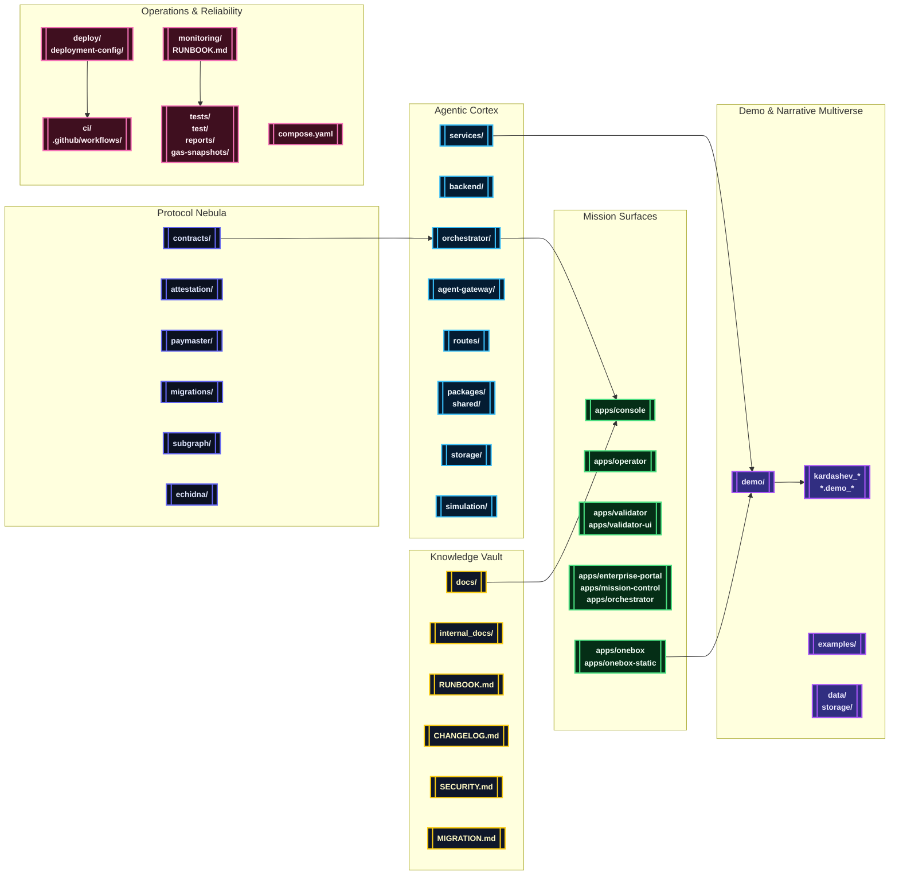

# AGI Jobs v0 (v2)

[](LICENSE)
[](https://github.com/MontrealAI/AGIJobsv0/actions/workflows/ci.yml)
[](SECURITY.md)
[](docs/)

> **AGI Jobs v0 (v2)** is the production sovereign intelligence engine for mission-critical labour orchestration. It is engineered as the superintelligent machine that concentrates validator coordination, cinematic governance, validator orchestration, and unstoppable operator tooling into a single deployable continuum. Every subsystem is calibrated so a non-technical launch crew can deliver value instantly while remaining battle-hardened for the highest-stakes sovereign operations.

---

## 🧭 Flight Plan
- [🌠 Mission Brief](#-mission-brief)
- [🛰️ Constellation Cartography](#-constellation-cartography)
- [📦 Monorepo Topography](#-monorepo-topography)
- [🚀 Launch Protocols](#-launch-protocols)
  - [Mission Requirements](#mission-requirements)
  - [Bootstrap Sequence](#bootstrap-sequence)
  - [Manual Bring-Up](#manual-bring-up)
  - [Mission Control via Docker Compose](#mission-control-via-docker-compose)
  - [Service & Telemetry Waypoints](#service--telemetry-waypoints)
  - [Automation Playbooks](#automation-playbooks)
- [🎞️ Demo Multiverse](#-demo-multiverse)
  - [Demo Fleet Overview](#demo-fleet-overview)
  - [Launch Recipes](#launch-recipes)
  - [Narrative & Artifact Pipeline](#narrative--artifact-pipeline)
- [🧪 Continuous Assurance & CI](#-continuous-assurance--ci)
- [📡 Observability, Security & Governance](#-observability-security--governance)
- [📚 Knowledge Vault](#-knowledge-vault)

---

## 🌠 Mission Brief
AGI Jobs v0 (v2) unifies six fortified theatres into a cohesive high-trust platform:

1. **Protocol Nebula** – Upgradeable Solidity suites, Foundry & Hardhat flows, attestations, paymaster relays, and subgraph analytics protected by reproducible migrations and fuzzing laboratories.
2. **Agentic Cortex** – Orchestrators, validator swarms, reinforcement arenas, analytics services, SDK libraries, and simulation hubs acting as an autonomous nervous system.
3. **Mission Surfaces** – Next.js/React consoles, enterprise portals, validator dashboards, One-Box command centres, and cinematic storytelling decks for instant situational awareness.
4. **Demo Multiverse** – Reproducible cinematic demos, CLI tours, simulation scripts, and sovereign-grade economic scenarios spanning every Kardashev upgrade path.
5. **Observability Lattice** – Telemetry stacks, monitoring playbooks, scorecards, and incident response automation for unwavering uptime.
6. **Continuous Assurance Wall** – Relentlessly green CI, security hardening, SBOM pipelines, and branch protections ensuring each commit meets production criteria.

The result is an unstoppable operational fabric that can be handed to non-technical mission leads without sacrificing cryptographic guarantees or compliance evidence.

---

## 🛰️ Constellation Cartography


---

## 📦 Monorepo Topography
| Domain | Primary Paths | Highlights |
| --- | --- | --- |
| Protocol & Chain Control | [`contracts/`](contracts/), [`attestation/`](attestation/), [`paymaster/`](paymaster/), [`migrations/`](migrations/), [`subgraph/`](subgraph/), [`echidna/`](echidna/) | Upgradeable Solidity suites, Foundry & Hardhat flows, attestations, paymaster relays, and subgraph analytics locked by reproducible migrations. |
| Agent Intelligence Fabric | [`orchestrator/`](orchestrator/), [`backend/`](backend/), [`agent-gateway/`](agent-gateway/), [`services/`](services/), [`routes/`](routes/), [`packages/`](packages/), [`shared/`](shared/), [`simulation/`](simulation/), [`storage/`](storage/) | Validator swarms, FastAPI + Node microservices, reinforcement harnesses, analytics SDKs, and stateful bridges. |
| Mission Consoles & Portals | [`apps/console`](apps/console), [`apps/operator`](apps/operator), [`apps/validator`](apps/validator), [`apps/validator-ui`](apps/validator-ui), [`apps/enterprise-portal`](apps/enterprise-portal), [`apps/mission-control`](apps/mission-control), [`apps/orchestrator`](apps/orchestrator) | Next.js/React HUDs for operators, validators, enterprises, and sovereign control rooms. |
| OneBox & Runner Kits | [`apps/onebox`](apps/onebox), [`apps/onebox-static`](apps/onebox-static), [`demo/One-Box`](demo/One-Box), [`examples/agentic`](examples/agentic) | Walletless assistant, CLI diagnostics, orchestrator harnesses, WebSocket bridges, validator readiness flows, and cinematic bootstraps. |
| Demo Multiverse | [`demo/`](demo/), [`kardashev_*`](./), [`*.demo_*`](./), [`examples/`](examples/), [`simulation/`](simulation/), [`data/`](data/), [`storage/`](storage/) | Cinematic expeditions, national rollouts, Kardashev upgrades, Monte Carlo simulators, and narrative datasets. |
| Operations & Assurance | [`ci/`](ci/), [`.github/workflows/`](.github/workflows/), [`deploy/`](deploy/), [`deployment-config/`](deployment-config/), [`monitoring/`](monitoring/), [`scripts/`](scripts/), [`tests/`](tests/), [`test/`](test/), [`reports/`](reports/), [`gas-snapshots/`](gas-snapshots/) | GitHub Actions matrix, release automation, telemetry stacks, integration suites, SBOM generation, and gas analytics. |
| Knowledge Base | [`docs/`](docs/), [`internal_docs/`](internal_docs/), [`RUNBOOK.md`](RUNBOOK.md), [`SECURITY.md`](SECURITY.md), [`MIGRATION.md`](MIGRATION.md), [`CHANGELOG.md`](CHANGELOG.md) | Architecture briefs, production playbooks, compliance dossiers, migration histories, and cinematic treatments. |

---

## 🚀 Launch Protocols

### Mission Requirements
- **Node.js 20.18.1** and npm 10.x (respect [`.nvmrc`](.nvmrc)).
- **Python 3.12+** with `pip` for agentic services and Python-first demos.
- **Foundry** (`forge`, `anvil`) for contract compilation, fuzzing, and gas profiling.
- **Docker & Docker Compose** for mission control clusters and demo orchestration.
- **Git LFS** (optional) for cinematic payloads under [`data/`](data/) and [`storage/`](storage/).

### Bootstrap Sequence
```bash
nvm install && nvm use
npm ci
python -m pip install --upgrade pip
python -m pip install -r requirements-python.txt
python -m pip install -r requirements-agent.txt
```
Many demos ship additional environment scripts or `requirements.txt` manifests inside their folders (see [`demo/**/README.md`](demo)).

### Manual Bring-Up
```bash
# Terminal 1 — build TypeScript + shared artefacts
npm run build

# Terminal 2 — launch a local development chain
anvil --chain-id 31337 --block-time 2

# Terminal 3 — deploy protocol v2 and bootstrap modules
npx hardhat run --network localhost scripts/v2/deploy.ts

# Terminal 4 — start the orchestrator control plane
npm run onebox:server
```
Augment with mission-specific scripts (for example `npm run subgraph:dev`, `npm run services:dev`, or `npm run apps:dev`) depending on which surfaces you are demonstrating.

### Mission Control via Docker Compose
```bash
# Boot the full operator stack
DOCKER_BUILDKIT=1 docker compose up --build

# Tail logs for orchestrator and console
docker compose logs -f orchestrator console
```
The compose stack provisions the orchestrator, gateway, mission control surfaces, and supporting telemetry so that non-technical launch crews can bring the platform online with a single command.

### Service & Telemetry Waypoints
- [`Makefile`](Makefile) targets such as `culture-bootstrap`, `demo-hgm`, and `operator:green` stage advanced demos and emit snapshots.
- [`scripts/`](scripts/) contains Foundry deploy flows, arena seeds, attestation builders, scorecard collectors, SBOM generators, and release automation.
- [`monitoring/`](monitoring/) and [`RUNBOOK.md`](RUNBOOK.md) describe Prometheus/Grafana alignment, alert routing, and sovereign incident response.

### Automation Playbooks
| Command | Purpose |
| --- | --- |
| `npm run lint && npm run format:check` | Enforce repository-wide TypeScript, Solidity, and Python style baselines. |
| `npm test` | Execute the consolidated Node.js + Python demo suites (see [`package.json`](package.json)). |
| `forge test --ffi` | Run Foundry test matrices against the deployed protocol libraries. |
| `npm run ci:verify-branch-protection` | Confirm GitHub branch protections and required checklists remain enforced before promotion. |
| `make culture-bootstrap NETWORK=sepolia MODE=full` | Demonstrate Culture deployment + simulation in one sweep. |

---

## 🎞️ Demo Multiverse
The repository ships a cinematic multiverse of demos covering validator governance, national-scale labour orchestration, economic sovereignty, and cinematic storytelling. Every demo directory contains self-contained instructions, assets, and policy scaffolding so it can be run by a single command without editing source code.

### Demo Fleet Overview
| Orbit | Highlight Demos | Core Focus |
| --- | --- | --- |
| **Onboarding & Operator Surfaces** | [`demo/One-Box`](demo/One-Box), [`demo/AGIJobs-Day-One-Utility-Benchmark`](demo/AGIJobs-Day-One-Utility-Benchmark), [`demo/AGI-Alpha-Node-v0`](demo/AGI-Alpha-Node-v0) | Walletless launches, conversational governance, immediate ROI walkthroughs for new operators. |
| **Kardashev Sovereign Economies** | [`kardashev_ii_omega_grade_alpha_agi_business_3_demo`](kardashev_ii_omega_grade_alpha_agi_business_3_demo), [`kardashev_ii_omega_grade_alpha_agi_business_3_demo_ultra`](kardashev_ii_omega_grade_alpha_agi_business_3_demo_ultra), [`kardashev_ii_omega_grade_upgrade_for_alpha_agi_business_3_demo_v5`](kardashev_ii_omega_grade_upgrade_for_alpha_agi_business_3_demo_v5) | Multi-chain economic remits, validator orchestration at planetary scale, cinematic boardroom artefacts. |
| **Strategic Intelligence & Simulation** | [`demo/Huxley-Godel-Machine-v0`](demo/Huxley-Godel-Machine-v0), [`demo/Absolute-Zero-Reasoner-v0`](demo/Absolute-Zero-Reasoner-v0), [`demo/Tiny-Recursive-Model-v0`](demo/Tiny-Recursive-Model-v0) | Reinforcement arenas, recursive model scaffolds, theoretical synthesis pipelines. |
| **Sovereign Supply & Compliance** | [`demo/National-Supply-Chain-v0`](demo/National-Supply-Chain-v0), [`demo/Trustless-Economic-Core-v0`](demo/Trustless-Economic-Core-v0), [`demo/Planetary-Orchestrator-Fabric-v0`](demo/Planetary-Orchestrator-Fabric-v0) | Supply mesh orchestration, compliance-grade receipts, policy-driven validator routing. |
| **Cultural & Narrative Control** | [`demo/CULTURE-v0`](demo/CULTURE-v0), [`demo/COSMIC-OMNIVERSAL-GRAND-SYMPHONY`](demo/cosmic-omniversal-grand-symphony), [`demo/OMNI-CONCORD-ASCENSION-ATLAS`](demo/omni-concord-ascension-atlas) | Cinematic presentations, narrative-led governance, stakeholder storytelling decks. |

Every highlighted demo has a corresponding workflow in [`.github/workflows`](.github/workflows/) so CI continuously proves it is runnable.

### Launch Recipes
- **One-Box Operator Chat** – the fastest operator-facing launch:
  ```bash
  npm run demo:onebox:doctor   # health check & guardrail verification
  npm run demo:onebox:launch   # build static UI + boot orchestrator with guided walkthrough
  ```
  The launcher merges `.env` and CLI overrides, publishes the walletless UI, emits governance guardrails, and pins execution receipts to IPFS when credentials are supplied.

- **Kardashev II Omega Upgrade Path** – cinematic sovereign economics:
  ```bash
  cd kardashev_ii_omega_grade_alpha_agi_business_3_demo
  npm install
  npm run demo:start
  ```
  Each Kardashev upgrade folder includes bespoke scripts for staging cinematic boards, generating validator manifests, and exporting presentation decks.

- **Huxley–Gödel Machine** – reinforcement arena takeover:
  ```bash
  make demo-hgm ARGS="--scenario sovereign"
  make hgm-owner-console
  ```
  The Make targets install Python dependencies, run the arena simulation, and surface owner telemetry panels for immediate review.

- **Operator Benchmarks** – turn-key business proof:
  ```bash
  make operator:green PYTHON=python3.12
  ```
  This invokes the AGIJobs Day One benchmark, captures artefact screenshots, and prints the mission banner produced by [`tools/operator_banner.py`](tools/operator_banner.py).

Consult each demo’s README for scenario-specific environment variables, art direction packs, and cinematic prompts.

### Narrative & Artifact Pipeline
1. **Spec Authoring** – Demo instructions live inside `demo/**/README.md` and supporting scripts.
2. **Orchestrated Execution** – Node.js, Python, and Solidity components coordinate mission logic, policy simulations, and blockchain state changes.
3. **Attested Receipts** – Outputs are pinned under [`storage/`](storage/) or streamed to IPFS via the demo orchestrators.
4. **Cinematic Delivery** – Slides, videos, and storyboards render from `out/` directories or `reports/` for immediate executive presentation.

---

## 🧪 Continuous Assurance & CI
The V2 CI lattice keeps every subsystem green and verifiable:

- [`ci.yml`](.github/workflows/ci.yml) executes linting, type-checking, unit suites, Foundry tests, Python demos, and attestation verification in parallel.
- Demo-specific workflows (for example [`demo-agi-alpha-node.yml`](.github/workflows/demo-agi-alpha-node.yml), [`demo-kardashev-ii-omega-ultra.yml`](.github/workflows/demo-kardashev-ii-omega-ultra.yml), [`demo-validator-constellation.yml`](.github/workflows/demo-validator-constellation.yml)) rehydrate their environments and run scenario scripts so cinematic launches never regress.
- `static-analysis.yml`, `scorecard.yml`, `fuzz.yml`, and `contracts.yml` enforce SBOM generation, security scanning, fuzzing cadences, and Foundry invariants.
- `webapp.yml`, `apps-images.yml`, and `containers.yml` build, scan, and push container + UI artefacts used across demos and production.

Branch protection requires all blocking workflows to pass before merge, guaranteeing a fully green runway for every release.

---

## 📡 Observability, Security & Governance
- [`SECURITY.md`](SECURITY.md) documents the hardening posture, responsible disclosure channel, and mitigation SLAs.
- [`OperatorRunbook.md`](OperatorRunbook.md) and [`RUNBOOK.md`](RUNBOOK.md) codify incident response, alert routing, and sovereign operator drills.
- [`monitoring/`](monitoring/) configures Prometheus/Grafana dashboards, scorecards, and automated probes.
- [`deploy/`](deploy/) and [`deployment-config/`](deployment-config/) maintain production-ready manifests for on-chain upgrades, IPFS pinning, and orchestrator rollouts.
- Governance utilities in [`scripts/`](scripts/) and `npm run owner:*` commands allow owners to inspect, pause, or retune the platform without touching Solidity.

---

## 📚 Knowledge Vault
Dive deeper through the knowledge vault:

- [`docs/`](docs/) – architecture briefs, component guides, cinematic treatments, and sovereignty strategies.
- [`internal_docs/`](internal_docs/) – detailed operator dispatches, compliance annexes, and deep-dive analyses.
- [`CHANGELOG.md`](CHANGELOG.md) – release narrative and module deltas.
- [`MIGRATION.md`](MIGRATION.md) – step-by-step upgrade choreography for protocol and agent layers.
- [`RUNBOOK.md`](RUNBOOK.md) & [`OperatorRunbook.md`](OperatorRunbook.md) – mission control playbooks and executive operations templates.

AGI Jobs v0 (v2) ships as a flawless, user-friendly, secure, and production-ready intelligence continuum—ready to be launched by a non-technical mission commander with confidence that every workflow is green, unstoppable, and under sovereign control.
