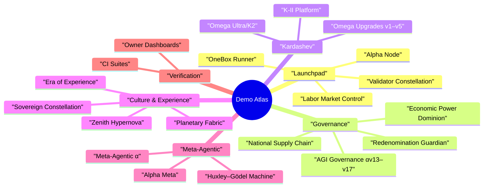

# AGIJobsv0

[](LICENSE)
[](https://github.com/MontrealAI/AGIJobsv0/actions/workflows/ci.yml)
[](https://github.com/MontrealAI/AGIJobsv0/actions/workflows/ci.yml?query=branch%3Amain+workflow%3A%22ci+%28v2%29%22)

AGIJobsv0 is the canonical production stack for the AGI Jobs protocol. The monorepo fuses upgradeable Ethereum contracts,
agent swarms, validator and owner consoles, orchestrator intelligence, mission-control services, and a legendary catalogue of
demos that span human-scale labour markets to Kardashev-class civilizations.

## Table of Contents

- [Mission Overview](#mission-overview)
- [Celestial Systems Map](#celestial-systems-map)
- [Repository Atlas](#repository-atlas)
- [Getting Started](#getting-started)
  - [Prerequisites](#prerequisites)
  - [Install Dependencies](#install-dependencies)
  - [Manual Bring-Up](#manual-bring-up)
  - [Mission Control via Docker Compose](#mission-control-via-docker-compose)
  - [Core Endpoints](#core-endpoints)
- [Demo Atlas](#demo-atlas)
  - [Launch & Operations](#launch--operations)
  - [Governance & Economics](#governance--economics)
  - [Kardashev & Omega Expeditions](#kardashev--omega-expeditions)
  - [Sovereign Culture & Experience Labs](#sovereign-culture--experience-labs)
  - [Meta-Agentic & Research Programs](#meta-agentic--research-programs)
  - [Validation Flight Deck](#validation-flight-deck)
- [Validation & Quality Gates](#validation--quality-gates)
- [Documentation & Signals](#documentation--signals)

## Mission Overview

The repository packages every layer required to deploy and operate AGI Jobs:

- **Upgradeable protocol foundation** — Solidity contracts, Foundry tooling, subgraph indexers, attestations, paymaster relays,
and migrations located under [`contracts/`](contracts/), [`attestation/`](attestation/), [`subgraph/`](subgraph/), [`paymaster/`](paymaster/),
and [`migrations/`](migrations/).
- **Agentic intelligence fabric** — mission planners, scoring engines, relays, and shared SDKs inside [`orchestrator/`](orchestrator/),
[`backend/`](backend/), [`agent-gateway/`](agent-gateway/), [`services/`](services/) (alerting, arena, culture graph, meta API,
sentinel, thermostat), [`packages/`](packages/), and [`shared/`](shared/).
- **Mission surfaces** — operator, validator, owner, enterprise, and orchestrator consoles in [`apps/`](apps/), including the
Next.js HUDs (`apps/console`, `apps/operator`, `apps/validator-ui`) and OneBox surfaces (`apps/onebox`, `apps/onebox-static`).
- **Expeditions & simulations** — cinematic launchers inside [`demo/`](demo/), Python packages in the root `kardashev_*`
constellation, analytics and automation under [`examples/`](examples/), [`simulation/`](simulation/), and [`data/`](data/).
- **Operations & assurance** — deployment recipes in [`deploy/`](deploy/) and [`deployment-config/`](deployment-config/), CI
guardrails in [`ci/`](ci/), monitoring in [`monitoring/`](monitoring/), playbooks in [`docs/`](docs/) and [`internal_docs/`](internal_docs/),
and coverage/test harnesses in [`tests/`](tests/) and [`test/`](test/).

## Celestial Systems Map

```mermaid
%% AGIJobsv0 constellation
flowchart TB
    classDef protocol fill:#0b1120,stroke:#6366f1,color:#e0e7ff,font-size:15px,font-weight:bold,stroke-width:2px;
    classDef agentic fill:#031b4e,stroke:#38bdf8,color:#f8fafc,font-weight:bold;
    classDef surfaces fill:#052e16,stroke:#4ade80,color:#f0fdf4,font-weight:bold;
    classDef ops fill:#3f0f1f,stroke:#f472b6,color:#fff0f6;font-weight:bold;
    classDef demos fill:#3f1d0f,stroke:#fb923c,color:#fff7ed,font-weight:bold;

    subgraph Protocol[Protocol Nebula]
        contracts[[contracts/]]:::protocol
        attestation[[attestation/]]:::protocol
        paymaster[[paymaster/]]:::protocol
        subgraphSvc[[subgraph/]]:::protocol
        migrations[[migrations/]]:::protocol
    end

    subgraph Intelligence[Agentic Intelligence]
        orchestrator[[orchestrator/]]:::agentic
        backendSvc[[backend/]]:::agentic
        agentGateway[[agent-gateway/]]:::agentic
        servicesArena[[services/arena\nservices/meta_api\nservices/thermostat\nservices/culture-graph-indexer\nservices/sentinel]]:::agentic
        packagesHub[[packages/\nshared/]]:::agentic
    end

    subgraph Surfaces[Mission Surfaces]
        appsConsole[[apps/console]]:::surfaces
        appsOperator[[apps/operator]]:::surfaces
        appsValidator[[apps/validator\napps/validator-ui]]:::surfaces
        appsOnebox[[apps/onebox\napps/onebox-static]]:::surfaces
        appsEnterprise[[apps/enterprise-portal\napps/orchestrator]]:::surfaces
    end

    subgraph Ops[Operations & Assurance]
        deploy[[deploy/\ndeployment-config/]]:::ops
        ci[[ci/\nmonitoring/]]:::ops
        tests[[tests/\ntest/]]:::ops
        docs[[docs/\ninternal_docs/\nRUNBOOK.md]]:::ops
    end

    subgraph Demos[Expeditions & Simulations]
        demoHub[[demo/]]:::demos
        kardashev[[kardashev_* packages]]:::demos
        examples[[examples/\nsimulation/]]:::demos
        dataVault[[data/\nstorage/]]:::demos
    end

    contracts --> orchestrator --> agentGateway --> appsConsole
    backendSvc --> servicesArena --> demoHub
    packagesHub --> appsOnebox
    deploy --> ops
    demoHub --> kardashev
```

## Repository Atlas

| Domain | Key Paths | Highlights |
| --- | --- | --- |
| Protocol & Chain Control | [`contracts/`](contracts/), [`attestation/`](attestation/), [`paymaster/`](paymaster/), [`subgraph/`](subgraph/), [`migrations/`](migrations/) | Upgradeable Solidity system, Foundry/Hardhat dual toolchain, EAS attestation flows, subgraph mappings. |
| Agent Intelligence | [`orchestrator/`](orchestrator/), [`backend/`](backend/), [`agent-gateway/`](agent-gateway/), [`services/`](services/), [`packages/`](packages/), [`shared/`](shared/) | Mission planning, FastAPI/Node services, gRPC/WebSocket relays, reusable TypeScript/Python SDKs. |
| Mission Applications | [`apps/console`](apps/console), [`apps/operator`](apps/operator), [`apps/validator`](apps/validator), [`apps/validator-ui`](apps/validator-ui), [`apps/enterprise-portal`](apps/enterprise-portal), [`apps/mission-control`](apps/mission-control), [`apps/orchestrator`](apps/orchestrator) | Operator, owner, validator, and enterprise HUDs plus orchestrator UX. |
| OneBox Surfaces | [`apps/onebox`](apps/onebox), [`apps/onebox-static`](apps/onebox-static), [`packages/onebox-sdk`](packages/onebox-sdk), [`packages/onebox-orchestrator`](packages/onebox-orchestrator) | Self-contained mission runner, SDKs, diagnostics, and health checks. |
| Demos & Expeditions | [`demo/`](demo/), root [`kardashev_*`](./), [`examples/`](examples/), [`simulation/`](simulation/), [`data/`](data/), [`storage/`](storage/) | Extensive cinematic demos, Kardashev-scale mission suites, analytics, scenario data. |
| Operations & Assurance | [`deploy/`](deploy/), [`deployment-config/`](deployment-config/), [`ci/`](ci/), [`monitoring/`](monitoring/), [`scripts/`](scripts/), [`tests/`](tests/), [`test/`](test/) | Deployment orchestration, CI guardrails, observability, integration & fuzz harnesses. |
| Knowledge Base | [`docs/`](docs/), [`internal_docs/`](internal_docs/), [`RUNBOOK.md`](RUNBOOK.md), [`SECURITY.md`](SECURITY.md), [`MIGRATION.md`](MIGRATION.md), [`CHANGELOG.md`](CHANGELOG.md) | Architecture notes, operations manuals, compliance history, release chronicles. |

## Getting Started

### Prerequisites

- **Node.js 20.18.1** (`nvm use` respects [`.nvmrc`](.nvmrc)) and npm 10.x.
- **Python 3.12+** with `pip` (virtual environments recommended).
- **Foundry** (`forge`, `anvil`) for contract compilation and fuzzing.
- **Docker** (and Docker Compose) for one-click orchestration.
- **Git LFS** if syncing large datasets from `data/` or `storage/` (optional).

### Install Dependencies

```bash
nvm install && nvm use
npm ci
python -m pip install --upgrade pip
python -m pip install -r requirements-python.txt
python -m pip install -r requirements-agent.txt
```

Optional demo environments expose additional `requirements.txt` files inside individual directories (for example
`demo/AGIJobs-Day-One-Utility-Benchmark/requirements.txt`).

### Manual Bring-Up

```bash
# Compile contracts, generate ABIs, and build shared TypeScript artifacts
npm run build

# Terminal 2 — launch a local chain
anvil --chain-id 31337 --block-time 2

# Terminal 3 — deploy the v2 protocol and mission scaffolding
npx hardhat run --network localhost scripts/v2/deploy.ts

# Terminal 4 — start the FastAPI meta API surface
uvicorn services.meta_api.app.main:create_app --reload --port 8000

# Optional relays & consoles
npm run agent:gateway                # Agent gateway REST/WebSocket bridge
npm run agent:validator              # Validator simulator
npm --prefix apps/console run dev    # Mission console UI (Next.js)
npm --prefix apps/operator run dev   # Operator dashboard
npm --prefix apps/validator-ui run dev
```

Consult [`docs/quick-start.md`](docs/quick-start.md), [`docs/AGENTIC_QUICKSTART.md`](docs/AGENTIC_QUICKSTART.md), and the
`docs/onebox/` guides for wallet provisioning, validator key rotation, and orchestrator configuration drills.

### Mission Control via Docker Compose

```bash
cp deployment-config/oneclick.env.example deployment-config/oneclick.env
# Populate RPC URLs, private keys, relayer secrets, telemetry tokens

docker compose up --build
```

The compose stack wires contracts, APIs, and dashboards with defaults sourced from
[`deployment-config/oneclick.env`](deployment-config/oneclick.env). Use `docker compose down -v` to reset the cluster.

### Core Endpoints

| Service | Default URL | Notes |
| --- | --- | --- |
| Anvil testnet | `http://localhost:8545` | Local Ethereum chain for development scripts. |
| Meta API (FastAPI) | `http://localhost:8000` | Mission telemetry, agent orchestration, owner reports. |
| Orchestrator/OneBox APIs | `http://localhost:8080` | Unified orchestration ingress and OneBox runner. |
| Agent Gateway | `http://localhost:8090` | REST and WebSocket router for agent swarms. |
| Mission Console UI | `http://localhost:3000` | Primary operator dashboard (`apps/console`). |
| Enterprise Portal | `http://localhost:3001` | Enterprise/partner console (`apps/enterprise-portal`). |

## Demo Atlas



All demos assume the dependencies above are installed. Many launchers require the protocol to be deployed locally or via the
compose stack. Search for `"demo:"` inside [`package.json`](package.json) for the complete manifest; highlights are grouped below.

### Launch & Operations

| Demo | Directory | Command |
| --- | --- | --- |
| AGI Alpha Node v0 | [`demo/AGI-Alpha-Node-v0/`](demo/AGI-Alpha-Node-v0/) | `npm run demo:agi-alpha-node` |
| Validator Constellation v0 | [`demo/Validator-Constellation-v0/`](demo/Validator-Constellation-v0/) | `npm run demo:validator-constellation` |
| AGI Labor Market Grand Demo | [`demo/agi-labor-market-grand-demo/`](demo/agi-labor-market-grand-demo/) | `npm run demo:agi-labor-market` |
| Labor Market Control Room | [`scripts/v2/launchAgiLaborMarketControlRoom.ts`](scripts/v2/launchAgiLaborMarketControlRoom.ts) | `npm run demo:agi-labor-market:control-room` |
| OneBox Mission Runner | [`demo/One-Box/`](demo/One-Box/) | `npm run demo:onebox:launch` |
| Day-One Utility Benchmark | [`demo/AGIJobs-Day-One-Utility-Benchmark/`](demo/AGIJobs-Day-One-Utility-Benchmark/) | `make -C demo/AGIJobs-Day-One-Utility-Benchmark e2e` |

### Governance & Economics

| Demo | Directory | Command |
| --- | --- | --- |
| AGI Governance (α v13–v17) | [`demo/agi-governance/`](demo/agi-governance/) | `npm run demo:agi-governance:alpha-v17` (latest mission) |
| Economic Power Dominion | [`demo/Economic-Power-v0/`](demo/Economic-Power-v0/) | `npm run demo:economic-power:dominion` |
| National Supply Chain | [`demo/National-Supply-Chain-v0/`](demo/National-Supply-Chain-v0/) | `npm run demo:national-supply-chain:control-room` |
| Redenomination Guardian Drill | [`demo/REDENOMINATION/`](demo/REDENOMINATION/) | `npm run demo:redenomination:guardian-drill` |
| Trustless Economic Core | [`demo/Trustless-Economic-Core-v0/`](demo/Trustless-Economic-Core-v0/) | `npm run run:trustless-core` |

### Kardashev & Omega Expeditions

| Expedition | Package/Directory | Command |
| --- | --- | --- |
| Kardashev II Platform | [`demo/AGI-Jobs-Platform-at-Kardashev-II-Scale/`](demo/AGI-Jobs-Platform-at-Kardashev-II-Scale/) | `npm run demo:kardashev` |
| Stellar Civilization Lattice | [`demo/AGI-Jobs-Platform-at-Kardashev-II-Scale/stellar-civilization-lattice/`](demo/AGI-Jobs-Platform-at-Kardashev-II-Scale/stellar-civilization-lattice/) | `npm run demo:kardashev-ii-lattice:orchestrate` |
| Omega Upgrade (TypeScript) | [`demo/'Kardashev-II Omega-Grade-α-AGI Business-3'/`](demo/Kardashev-II%20Omega-Grade-%CE%B1-AGI%20Business-3/) | `npm run demo:kardashev-ii-omega-upgrade` |
| Omega Upgrade (Python v5) | [`kardashev_ii_omega_grade_upgrade_for_alpha_agi_business_3_demo_v5/`](kardashev_ii_omega_grade_upgrade_for_alpha_agi_business_3_demo_v5/) | `npm run demo:kardashev-ii-omega-upgrade-v5` |
| Omega Ultra Campaign | [`demo/kardashev_ii_omega_grade_alpha_agi_business_3_demo_ultra/`](demo/kardashev_ii_omega_grade_alpha_agi_business_3_demo_ultra/) | `npm run demo:kardashev-ii-omega-ultra` |
| Omega K2 Operator | [`kardashev_ii_omega_grade_alpha_agi_business_3_demo_k2/`](kardashev_ii_omega_grade_alpha_agi_business_3_demo_k2/) | `npm run demo:kardashev-ii-omega-k2` |
| Omega Operator Suite | [`kardashev_ii_omega_grade_alpha_agi_business_3_demo_omega/`](kardashev_ii_omega_grade_alpha_agi_business_3_demo_omega/) | `npm run demo:kardashev-ii-omega-operator` |

### Sovereign Culture & Experience Labs

| Demo | Directory | Command |
| --- | --- | --- |
| Era of Experience | [`demo/Era-Of-Experience-v0/`](demo/Era-Of-Experience-v0/) | `npm run demo:era-of-experience` |
| Planetary Orchestrator Fabric | [`demo/Planetary-Orchestrator-Fabric-v0/`](demo/Planetary-Orchestrator-Fabric-v0/) | `npm run demo:planetary-orchestrator-fabric` |
| Sovereign Constellation Atlas | [`demo/sovereign-constellation/`](demo/sovereign-constellation/) | `npm run demo:sovereign-constellation:atlas` |
| Omni Sovereign Ascension OS | [`demo/omni-sovereign-ascension-operating-system/`](demo/omni-sovereign-ascension-operating-system/) | `npm run demo:omni-sovereign` |
| Zenith Sapience Hypernova | [`demo/zenith-sapience-initiative-supra-sovereign-hypernova-governance/`](demo/zenith-sapience-initiative-supra-sovereign-hypernova-governance/) | `npm run demo:zenith-hypernova:local` |
| ASI Global Mission | [`demo/asi-global/`](demo/asi-global/) | `npm run demo:asi-global:local` |
| ASI Take-Off Mission | [`demo/asi-takeoff/`](demo/asi-takeoff/) | `npm run demo:asi-takeoff:local` |

### Meta-Agentic & Research Programs

| Demo | Directory | Command |
| --- | --- | --- |
| Meta-Agentic Alpha AGI Jobs | [`demo/Meta-Agentic-ALPHA-AGI-Jobs-v0/`](demo/Meta-Agentic-ALPHA-AGI-Jobs-v0/) | `npm run demo:meta-agentic-alpha` |
| Alpha Meta Sovereign Mission | [`demo/alpha-meta/`](demo/alpha-meta/) | `npm run demo:alpha-meta:full` |
| Alpha AGI Mark | [`demo/alpha-agi-mark/`](demo/alpha-agi-mark/) | `npm run demo:alpha-agi-mark:full` |
| Alpha AGI Insight Mark | [`demo/alpha-agi-insight-mark/`](demo/alpha-agi-insight-mark/) | `npm run demo:alpha-agi-insight-mark` |
| Huxley–Gödel Machine | [`demo/Huxley-Godel-Machine-v0/`](demo/Huxley-Godel-Machine-v0/) | `make demo-hgm` / `make hgm-owner-console` |
| Absolute Zero Reasoner | [`demo/Absolute-Zero-Reasoner-v0/`](demo/Absolute-Zero-Reasoner-v0/) | `make absolute-zero-demo` |

### Validation Flight Deck

| Suite | Command |
| --- | --- |
| TypeScript demo tests | `npm run test:agi-alpha-node`, `npm run test:validator-constellation`, `npm run test:economic-power`, `npm run test:era-of-experience` |
| Python/Kardashev CI | `python -m kardashev_ii_omega_grade_alpha_agi_business_3_demo_ultra ci --config demo/'Kardashev-II Omega-Grade-α-AGI Business-3'/kardashev_ii_omega_grade_alpha_agi_business_3_demo_ultra/config/mission.json`, `python -m kardashev_ii_omega_grade_upgrade_for_alpha_agi_business_3_demo_v5.cli ci` |
| Sovereign Constellation validation | `npm run demo:sovereign-constellation:ci` |
| Owner control surfaces | `npm run owner:dashboard`, `npm run owner:mission-control`, `npm run owner:guide`, `npm run owner:verify-control` |

Additional mission dashboards, exporters, and telemetry sinks are exposed through the `owner:*`, `verify:*`, `demo:*`, and
`*:ci` scripts inside [`package.json`](package.json).

## Validation & Quality Gates

Before opening a pull request, mirror the CI guardrails:

```bash
# Contracts & generated bindings
npm run compile

# TypeScript linting, tests, and accessibility smoke
npm run lint
npm run test
npm run pretest

# Python unit & integration coverage
COVERAGE_FILE=.coverage.unit coverage run --rcfile=.coveragerc -m pytest \
  test/paymaster \
  test/tools \
  test/orchestrator \
  test/simulation
COVERAGE_FILE=.coverage.unit coverage run --rcfile=.coveragerc --append -m pytest tests
COVERAGE_FILE=.coverage.integration coverage run --rcfile=.coveragerc -m pytest \
  test/routes/test_agents.py \
  test/routes/test_analytics.py \
  test/routes/test_onebox_health.py \
  test/demo \
  demo/Meta-Agentic-Program-Synthesis-v0/meta_agentic_demo/tests
coverage combine .coverage.unit .coverage.integration
coverage report --rcfile=.coveragerc

# Web end-to-end coverage
npm run webapp:e2e

# Foundry fuzzing
(cd contracts && forge test)

# Supply-chain & SBOM
npm run security:audit
npm run sbom:generate
```

## Documentation & Signals

- **Architecture & systems:** [`docs/overview.md`](docs/overview.md), [`docs/architecture-v2.md`](docs/architecture-v2.md).
- **Deployment operations:** [`docs/v2-deployment-and-operations.md`](docs/v2-deployment-and-operations.md), [`docs/deployment-production-guide.md`](docs/deployment-production-guide.md), [`docs/DEPLOYED_ADDRESSES.md`](docs/DEPLOYED_ADDRESSES.md).
- **Owner & validator playbooks:** [`docs/owner-control-handbook.md`](docs/owner-control-handbook.md), `docs/owner-control-*.md`, [`docs/validator/`](docs/validator/).
- **OneBox & mission UX:** [`docs/onebox/`](docs/onebox/), [`docs/onebox-ux.md`](docs/onebox-ux.md).
- **Agent gateway & examples:** [`docs/agent-gateway.md`](docs/agent-gateway.md), [`examples/agentic/`](examples/agentic/).
- **Security, runbooks & change history:** [`SECURITY.md`](SECURITY.md), [`RUNBOOK.md`](RUNBOOK.md), [`MIGRATION.md`](MIGRATION.md), [`CHANGELOG.md`](CHANGELOG.md).

For responsible disclosure, follow [`SECURITY.md`](SECURITY.md). Incident response and escalation paths are catalogued in
[`RUNBOOK.md`](RUNBOOK.md). The project is distributed under the [MIT License](LICENSE).
