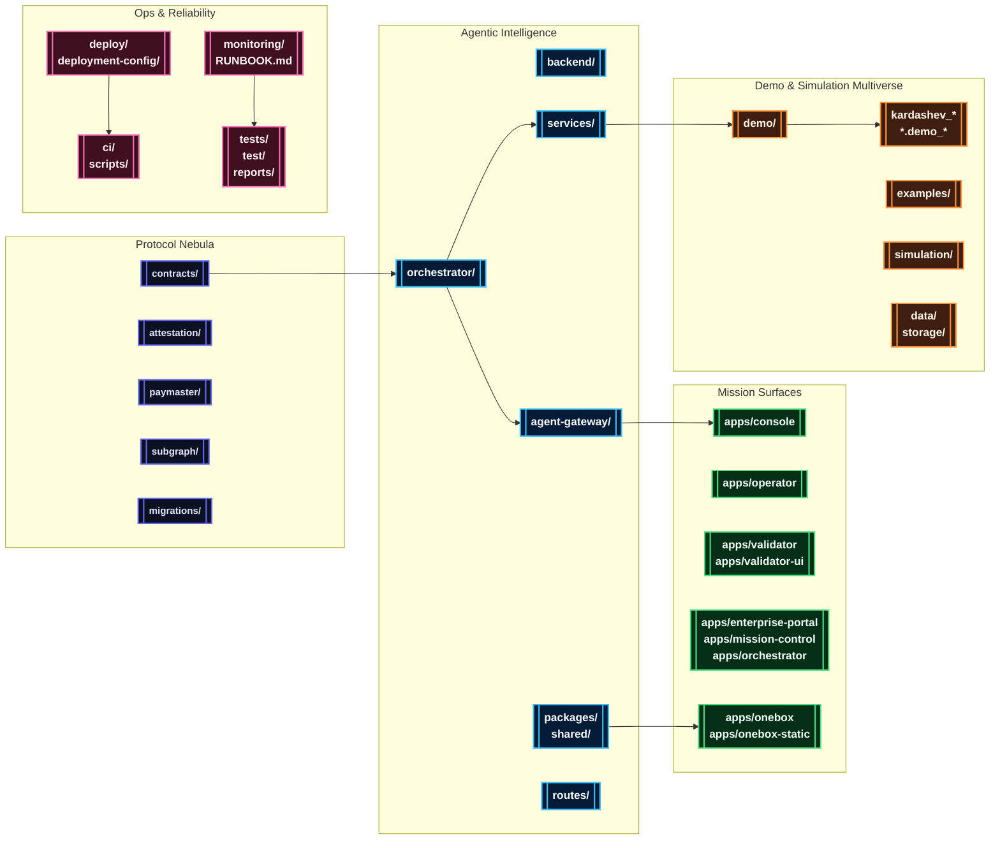

# AGIJobsv0

[](LICENSE)
[](https://github.com/MontrealAI/AGIJobsv0/actions/workflows/ci.yml)
[](https://github.com/MontrealAI/AGIJobsv0/actions/workflows/ci.yml?query=branch%3Amain+workflow%3A%22ci+%28v2%29%22)

> The canonical production stack for the AGI Jobs protocol: upgradeable Ethereum contracts, agentic intelligence swarms, cinematic demos, and sovereign-scale orchestration.

## Table of Contents
- [🌠 Mission Brief](#-mission-brief)
- [🛰️ System Nebula](#-system-nebula)
- [🗂️ Repository Cartography](#-repository-cartography)
- [⚙️ Getting Started](#-getting-started)
  - [Requirements](#requirements)
  - [Install & Bootstrap](#install--bootstrap)
  - [Manual Bring-Up](#manual-bring-up)
  - [Mission Control via Docker Compose](#mission-control-via-docker-compose)
  - [Core Endpoints](#core-endpoints)
- [🧪 Quality & Verification](#-quality--verification)
- [🎞️ Demo Constellation](#-demo-constellation)
  - [Launch & Operations](#launch--operations)
  - [Economics & Governance](#economics--governance)
  - [Culture, Experience & Media](#culture-experience--media)
  - [Sovereign & Kardashev Expeditions](#sovereign--kardashev-expeditions)
  - [Omega & Supra-Sovereign Ascension](#omega--supra-sovereign-ascension)
  - [Research & Simulation Labs](#research--simulation-labs)
  - [Python Bridge Packages](#python-bridge-packages)
- [📡 Operations & Observability](#-operations--observability)
- [📚 Documentation Signals](#-documentation-signals)

## 🌠 Mission Brief
AGIJobsv0 fuses every layer required to launch, operate, and evolve the AGI Jobs protocol in production environments.

- **Upgradeable protocol foundation** across Solidity contracts, Foundry/Hardhat workflows, EAS attestations, paymasters, relayers, and subgraphs.
- **Agentic intelligence fabric** covering orchestrators, FastAPI/Node services, analytics pipelines, validators, scoring engines, and reusable SDKs in both TypeScript and Python.
- **Mission surfaces & consoles** spanning Next.js applications, operator HUDs, OneBox deployments, validator dashboards, and enterprise portals.
- **Demonstration multiverse** with launch-ready demos, omega-scale expeditions, cinematic walkthroughs, governance rituals, and research simulations.

## 🛰️ System Nebula


## 🗂️ Repository Cartography
| Domain | Primary Paths | Highlights |
| --- | --- | --- |
| Protocol & Chain Control | [`contracts/`](contracts/), [`attestation/`](attestation/), [`paymaster/`](paymaster/), [`subgraph/`](subgraph/), [`migrations/`](migrations/) | Upgradeable Solidity modules, Foundry & Hardhat dual toolchain, EAS attestations, subgraph indexers, deployment recipes. |
| Agent Intelligence Fabric | [`orchestrator/`](orchestrator/), [`backend/`](backend/), [`agent-gateway/`](agent-gateway/), [`services/`](services/), [`routes/`](routes/), [`packages/`](packages/), [`shared/`](shared/) | Mission planners, analytics, gRPC/WebSocket relays, FastAPI+Node microservices, reusable SDKs, shared state machines. |
| Mission Consoles & Portals | [`apps/console`](apps/console), [`apps/operator`](apps/operator), [`apps/validator`](apps/validator), [`apps/validator-ui`](apps/validator-ui), [`apps/enterprise-portal`](apps/enterprise-portal), [`apps/mission-control`](apps/mission-control), [`apps/orchestrator`](apps/orchestrator) | Next.js HUDs for operators, owners, validators, mission controllers, and cinematic demo playback. |
| OneBox Surfaces & Tooling | [`apps/onebox`](apps/onebox), [`apps/onebox-static`](apps/onebox-static), [`packages/onebox-*`](packages/), [`demo/One-Box`](demo/One-Box) | Self-contained runner, CLI doctor, orchestrator harness, Docker templates, and CI validation. |
| Demo Atlas | [`demo/`](demo/), [`kardashev_*`](./), [`*.demo_*`](./), [`examples/`](examples/), [`simulation/`](simulation/), [`data/`](data/), [`storage/`](storage/) | Cinematic expeditions, Kardashev-grade upgrades, Monte Carlo simulations, mission data vaults. |
| Operations & Assurance | [`deploy/`](deploy/), [`deployment-config/`](deployment-config/), [`ci/`](ci/), [`monitoring/`](monitoring/), [`scripts/`](scripts/), [`tests/`](tests/), [`test/`](test/) | One-click infrastructure, CI guardrails, observability, integration/pytest harnesses, SBOM & release tooling. |
| Knowledge Base | [`docs/`](docs/), [`internal_docs/`](internal_docs/), [`RUNBOOK.md`](RUNBOOK.md), [`SECURITY.md`](SECURITY.md), [`MIGRATION.md`](MIGRATION.md), [`CHANGELOG.md`](CHANGELOG.md) | Architecture notes, operations manuals, compliance dossiers, release chronicles. |

## ⚙️ Getting Started
### Requirements
- **Node.js 20.18.1** (via `nvm use` from [`.nvmrc`](.nvmrc)) with npm 10.x.
- **Python 3.12+** and `pip` for agent services and Python-first demos.
- **Foundry** (`forge`, `anvil`) for contract compilation, fuzzing, and gas analysis.
- **Docker & Docker Compose** for one-click mission control.
- **Git LFS** when syncing large payloads from [`data/`](data/) or [`storage/`](storage/) (optional).

### Install & Bootstrap
```bash
nvm install && nvm use
npm ci
python -m pip install --upgrade pip
python -m pip install -r requirements-python.txt
python -m pip install -r requirements-agent.txt
```
Optional demos expose additional `requirements.txt` within their directories (for example `demo/AGIJobs-Day-One-Utility-Benchmark/requirements.txt`).

### Manual Bring-Up
```bash
# Build contracts, shared packages, and generated artifacts
npm run build

# Terminal 2 – launch a local chain
anvil --chain-id 31337 --block-time 2

# Terminal 3 – deploy protocol v2 and bootstrap modules
npx hardhat run --network localhost scripts/v2/deploy.ts

# Terminal 4 – start the Meta API surface
uvicorn services.meta_api.app.main:app --reload --port 8000

# Optional: launch additional services & consoles
npm run agent:gateway                 # Agent gateway REST/WebSocket bridge
npm run agent:validator               # Validator simulator
npm --prefix apps/console run dev     # Mission console (Next.js)
npm --prefix apps/operator run dev    # Operator dashboard
npm --prefix apps/validator-ui run dev
```
Consult [`docs/quick-start.md`](docs/quick-start.md), [`docs/AGENTIC_QUICKSTART.md`](docs/AGENTIC_QUICKSTART.md), and the `docs/onebox/` guides for wallet setup, validator key rotation, and orchestrator configuration.

### Mission Control via Docker Compose
```bash
cp deployment-config/oneclick.env.example deployment-config/oneclick.env
# Fill RPC URLs, private keys, relayer secrets, telemetry tokens

docker compose up --build
```
Use `docker compose down -v` to reset the cluster. Compose wiring sources defaults from [`deployment-config/oneclick.env`](deployment-config/oneclick.env).

### Core Endpoints
| Service | Default URL | Notes |
| --- | --- | --- |
| Local Anvil testnet | `http://localhost:8545` | Hardhat/Foundry-compatible development chain. |
| Meta API (FastAPI) | `http://localhost:8000` | Mission telemetry, orchestrator analytics, OneBox health. |
| Orchestrator/OneBox APIs | `http://localhost:8080` | Unified orchestration ingress and OneBox runner services. |
| Agent Gateway | `http://localhost:8090` | REST + WebSocket bridge for agent swarms. |
| Mission Console UI | `http://localhost:3000` | Primary operator HUD (`apps/console`). |
| Enterprise Portal | `http://localhost:3001` | Partner & enterprise oversight (`apps/enterprise-portal`). |

## 🧪 Quality & Verification
- `npm run lint`, `npm run webapp:typecheck`, and `npm run webapp:e2e` guard the Next.js surfaces.
- `npm run test` executes Hardhat unit tests; `forge test` runs Foundry profiles defined in [`foundry.toml`](foundry.toml).
- `PYTEST_DISABLE_PLUGIN_AUTOLOAD=1 pytest` covers Python demos (`tests/`, `demo/*/test/`).
- `npm run pretest` orchestrates the cross-surface smoke suite, including OneBox diagnostics and demo verifiers.
- `npm run sbom:generate`, `npm run security:audit`, and `npm run release:manifest:validate` provide supply-chain checks.
- Coverage, gas, and scenario reports land in [`reports/`](reports/) and [`gas-snapshots/`](gas-snapshots/).

## 🎞️ Demo Constellation
```mermaid
%% Celestial demo atlas
mindmap
  classDef launch fill:#0f172a,stroke:#38bdf8,color:#e0f2fe,font-weight:bold,stroke-width:2px;
  classDef economics fill:#1f2937,stroke:#f97316,color:#fff7ed,font-weight:bold,stroke-width:2px;
  classDef culture fill:#22092C,stroke:#f472b6,color:#fff0f6,font-weight:bold,stroke-width:2px;
  classDef sovereign fill:#1c1917,stroke:#facc15,color:#fef9c3,font-weight:bold,stroke-width:2px;
  classDef omega fill:#111827,stroke:#a855f7,color:#ede9fe,font-weight:bold,stroke-width:2px;
  classDef research fill:#052e16,stroke:#4ade80,color:#f0fdf4,font-weight:bold,stroke-width:2px;

  root(("🌌 Demo Constellation"))
    Launchpad:::launch
      "AGI-Alpha-Node-v0"
      "Validator-Constellation-v0"
      "AGIJobs-Day-One-Utility-Benchmark"
      "Meta-Agentic-ALPHA-AGI-Jobs-v0"
      "asi-global"
      "asi-takeoff"
      "One-Box"
    "Economics & Governance":::economics
      "Economic-Power-v0"
      "Trustless-Economic-Core-v0"
      "AGI-Jobs-Platform-at-Kardashev-II-Scale"
      "REDENOMINATION"
      "Phase-6-Scaling-Multi-Domain-Expansion"
    "Culture & Experience":::culture
      "Era-Of-Experience-v0"
      "CULTURE-v0"
      "AlphaEvolve-v0"
      "aurora"
      "AlphaEvolve_v0"
    "Sovereign & Kardashev":::sovereign
      "Planetary-Orchestrator-Fabric-v0"
      "sovereign-constellation"
      "sovereign-mesh"
      "zenith-sapience-initiative-*"
      "validator_constellation_v0"
    "Omega & Ascension Suites":::omega
      "Kardashev-II Omega-Grade-α-AGI Business-3"
      "Meta-Agentic-Program-Synthesis-v0"
      "CELESTIAL-SOVEREIGN-ORBITAL-AGI-OS-GRAND-DEMONSTRATION"
      "OMNIPHOENIX-ASCENDANT-HYPERSTRUCTURE"
      "OMNIGENESIS-GLOBAL-SOVEREIGN-SYMPHONY"
      "cosmic-omni-sovereign-symphony"
      "astral-omnidominion-operating-system"
      "imperatrix-celestia-operating-system"
    "Research & Simulation":::research
      "Absolute-Zero-Reasoner-v0"
      "MuZero-style-v0"
      "Open-Endedness-v0"
      "Tiny-Recursive-Model-v0"
      "Simulation Toolkit"
```

The `demo/` directory hosts cinematic launches, CLI simulations, dashboards, and scripted walkthroughs. Many scenarios expose npm scripts, Makefile targets, or Python entrypoints for fast reproduction.

### Launch & Operations
| Demo | Location | Quick Launch |
| --- | --- | --- |
| AGI Alpha Node | [`demo/AGI-Alpha-Node-v0`](demo/AGI-Alpha-Node-v0) | `npm run demo:agi-alpha-node` (TypeScript CLI) or `npm run demo:agi-alpha-node:prod`. |
| Validator Constellation | [`demo/Validator-Constellation-v0`](demo/Validator-Constellation-v0) | `npm run demo:validator-constellation` for live simulation; `npm run demo:validator-constellation:scenario` for scripted runs. |
| AGIJobs Day One Utility Benchmark | [`demo/AGIJobs-Day-One-Utility-Benchmark`](demo/AGIJobs-Day-One-Utility-Benchmark) | `make -C demo/AGIJobs-Day-One-Utility-Benchmark e2e` or `python demo/AGIJobs-Day-One-Utility-Benchmark/run_demo.py e2e`. |
| Meta-Agentic Alpha AGI | [`demo/Meta-Agentic-ALPHA-AGI-Jobs-v0`](demo/Meta-Agentic-ALPHA-AGI-Jobs-v0) | `npm run demo:meta-agentic-alpha` for the scenario CLI. |
| ASI Launch Programs | [`demo/asi-global`](demo/asi-global), [`demo/asi-takeoff`](demo/asi-takeoff), [`demo/agi-governance`](demo/agi-governance) | Strategic briefs and launch playbooks for AGI-scale missions. |
| OneBox Mission Runner | [`demo/One-Box`](demo/One-Box) | `npm run demo:onebox:doctor` then `npm run demo:onebox:launch`; Docker users can run `docker compose -f demo/One-Box/docker-compose.yaml up`. |

### Economics & Governance
| Demo | Location | Quick Launch |
| --- | --- | --- |
| Economic Power | [`demo/Economic-Power-v0`](demo/Economic-Power-v0) | `npm run demo:economic-power` (supports `--ci` and scenario flags). |
| Trustless Economic Core | [`demo/Trustless-Economic-Core-v0`](demo/Trustless-Economic-Core-v0) | `npm run run:trustless-core` to execute the Hardhat-driven mission. |
| AGI Jobs Platform at Kardashev-II Scale | [`demo/AGI-Jobs-Platform-at-Kardashev-II-Scale`](demo/AGI-Jobs-Platform-at-Kardashev-II-Scale) | Mission plans, governance cadences, and operator scripts. |
| REDENOMINATION & macro transitions | [`demo/REDENOMINATION`](demo/REDENOMINATION) | Narrative playbooks and assets for macro-governance transitions. |
| Scaling Program Phases | [`demo/Phase-6-Scaling-Multi-Domain-Expansion`](demo/Phase-6-Scaling-Multi-Domain-Expansion), [`demo/Phase-8-Universal-Value-Dominance`](demo/Phase-8-Universal-Value-Dominance) | Strategic dossiers, playbooks, and scenario briefs. |

### Culture, Experience & Media
| Demo | Location | Quick Launch |
| --- | --- | --- |
| Era of Experience | [`demo/Era-Of-Experience-v0`](demo/Era-Of-Experience-v0) | `npm run demo:era-of-experience` for the orchestrated storyline; `npm run demo:era-of-experience:audit` for verification. |
| CULTURE v0 | [`demo/CULTURE-v0`](demo/CULTURE-v0) | Narrative assets, generative culture loops, CLI utilities. |
| AlphaEvolve Suite | [`demo/AlphaEvolve-v0`](demo/AlphaEvolve-v0), [`demo/AlphaEvolve_v0`](demo/AlphaEvolve_v0) | Evolutionary scripts, governance notes, and multimedia staging. |
| Aurora Media Suite | [`demo/aurora`](demo/aurora) | Immersive media orchestration with storyboards and prompt pipelines. |
| Iconic & Cinematic Atlases | [`demo/ICONIC-OPERATING-SYSTEM-DEMO`](demo/ICONIC-OPERATING-SYSTEM-DEMO), [`demo/astral-citadel`](demo/astral-citadel) | Visual design boards, cinematic treatments, and mission scripts. |

### Sovereign & Kardashev Expeditions
| Demo | Location | Quick Launch |
| --- | --- | --- |
| Planetary Orchestrator Fabric | [`demo/Planetary-Orchestrator-Fabric-v0`](demo/Planetary-Orchestrator-Fabric-v0) | `npm run test:planetary-orchestrator-fabric` for scenario verification. |
| Sovereign Constellation Atlases | [`demo/sovereign-constellation`](demo/sovereign-constellation), [`demo/sovereign-mesh`](demo/sovereign-mesh) | Governance rituals, sovereign meshes, supra-sovereign ascension guides. |
| Zenith Sapience Initiatives | `demo/zenith-sapience-*` | Planetary and supra-sovereign governance frameworks with cinematic briefs. |
| Validator Constellation Atlas | [`demo/validator_constellation_v0`](demo/validator_constellation_v0) | Supplemental validator strategy assets and notebooks. |

### Omega & Supra-Sovereign Ascension
| Demo | Location | Quick Launch |
| --- | --- | --- |
| Omega Grade Business 3 | [`demo/Kardashev-II Omega-Grade-α-AGI Business-3`](demo/Kardashev-II%20Omega-Grade-%CE%B1-AGI%20Business-3), [`demo/Kardashev-II-Omega-Grade-Alpha-AGI-Business-3`](demo/Kardashev-II-Omega-Grade-Alpha-AGI-Business-3), [`kardashev_ii_omega_grade_alpha_agi_business_3_demo*`](./) | Layered expeditions, upgrade scripts, and Python namespace packages. |
| Meta Agentic Program Synthesis | [`demo/Meta-Agentic-Program-Synthesis-v0`](demo/Meta-Agentic-Program-Synthesis-v0) | Multi-agent synthesis narratives and orchestration plans. |
| Celestial Sovereign Grand Demonstration | [`demo/CELESTIAL-SOVEREIGN-ORBITAL-AGI-OS-GRAND-DEMONSTRATION`](demo/CELESTIAL-SOVEREIGN-ORBITAL-AGI-OS-GRAND-DEMONSTRATION) | Showcase assets for orbital sovereign operating systems. |
| Omni Ascension Suite | [`demo/OMNIPHOENIX-ASCENDANT-HYPERSTRUCTURE`](demo/OMNIPHOENIX-ASCENDANT-HYPERSTRUCTURE), [`demo/OMNIGENESIS-GLOBAL-SOVEREIGN-SYMPHONY`](demo/OMNIGENESIS-GLOBAL-SOVEREIGN-SYMPHONY), [`demo/omni-sovereign-ascension-operating-system`](demo/omni-sovereign-ascension-operating-system) | Hyperstructure playbooks, operator matrices, cinematic scripts. |
| Cosmic & Infinity Symphonies | [`demo/cosmic-omni-sovereign-symphony`](demo/cosmic-omni-sovereign-symphony), [`demo/cosmic-omniversal-grand-symphony`](demo/cosmic-omniversal-grand-symphony), [`demo/infinity-symphony`](demo/infinity-symphony), [`demo/omnisovereign`](demo/omnisovereign) | Multi-phase scorecards, orchestration artbooks, and cinematic narratives. |
| Astral Omnidominion & Imperatrix | [`demo/astral-omnidominion-operating-system`](demo/astral-omnidominion-operating-system), [`demo/astral-omnidominion-operating-system-command-theatre`](demo/astral-omnidominion-operating-system-command-theatre), [`demo/imperatrix-celestia-operating-system`](demo/imperatrix-celestia-operating-system), [`demo/omni-orchestrator-singularity`](demo/omni-orchestrator-singularity) | Command theatres, sovereignty operating systems, and orchestration matrices. |

### Research & Simulation Labs
| Demo | Location | Quick Launch |
| --- | --- | --- |
| Absolute Zero Reasoner | [`demo/Absolute-Zero-Reasoner-v0`](demo/Absolute-Zero-Reasoner-v0) | `make absolute-zero-demo` provisions a virtualenv and runs the simulation. |
| MuZero-style Mission | [`demo/MuZero-style-v0`](demo/MuZero-style-v0) | Reinforcement-learning inspired orchestrations and evaluation notebooks. |
| Open Endedness | [`demo/Open-Endedness-v0`](demo/Open-Endedness-v0) | Evolutionary sandboxes and meta-learning scripts. |
| Tiny Recursive Model | [`demo/Tiny-Recursive-Model-v0`](demo/Tiny-Recursive-Model-v0) | Minimal recursion demos, Python notebooks, policy sketches. |
| Simulation Toolkit | [`simulation/`](simulation/) | Sharded Monte Carlo simulation harnesses, reports, and aggregator CLI (`python simulation/run_sharded_simulation.py`). |

### Python Bridge Packages
Root-level packages such as [`kardashev_ii_omega_grade_alpha_agi_business_3_demo`](kardashev_ii_omega_grade_alpha_agi_business_3_demo) expose namespace packages that re-export their corresponding `demo/…` modules. They allow Python tooling to `import kardashev_ii_omega_grade_alpha_agi_business_3_demo` while keeping assets inside [`demo/`](demo/).

## 📡 Operations & Observability
- One-click deployments and infrastructure recipes live under [`deploy/`](deploy/) and [`deployment-config/`](deployment-config/).
- Alerting, notification, sentinel, and thermostat services operate within [`services/alerting`](services/alerting), [`services/notifications`](services/notifications), [`services/sentinel`](services/sentinel), and [`services/thermostat`](services/thermostat).
- Runtime telemetry, Prometheus metrics, and Grafana dashboards are curated in [`monitoring/`](monitoring/).
- [`RUNBOOK.md`](RUNBOOK.md) and [`docs/AGIJobs-v2-Mainnet-Guide.md`](docs/AGIJobs-v2-Mainnet-Guide.md) provide production playbooks and on-call drills.

## 📚 Documentation Signals
Explore the knowledge base for deeper dives:

- [`docs/AGI_Jobs_v0_Whitepaper_v2.md`](docs/AGI_Jobs_v0_Whitepaper_v2.md) – protocol thesis and economic primitives.
- [`docs/AGIJobsAlphav3.md`](docs/AGIJobsAlphav3.md) – historical release dossiers and architecture notes.
- [`docs/owner-control-quick-reference.md`](docs/owner-control-quick-reference.md) and [`docs/owner-control-quick-reference-cli.md`](docs/owner-control-quick-reference-cli.md) – owner command checklists.
- [`MIGRATION.md`](MIGRATION.md), [`CHANGELOG.md`](CHANGELOG.md), and [`SECURITY.md`](SECURITY.md) – governance over upgrades, releases, and security posture.
- [`internal_docs/`](internal_docs/) – detailed briefs, design reviews, and mission scripts for internal operators.

---

Licensed under the [MIT License](LICENSE).
