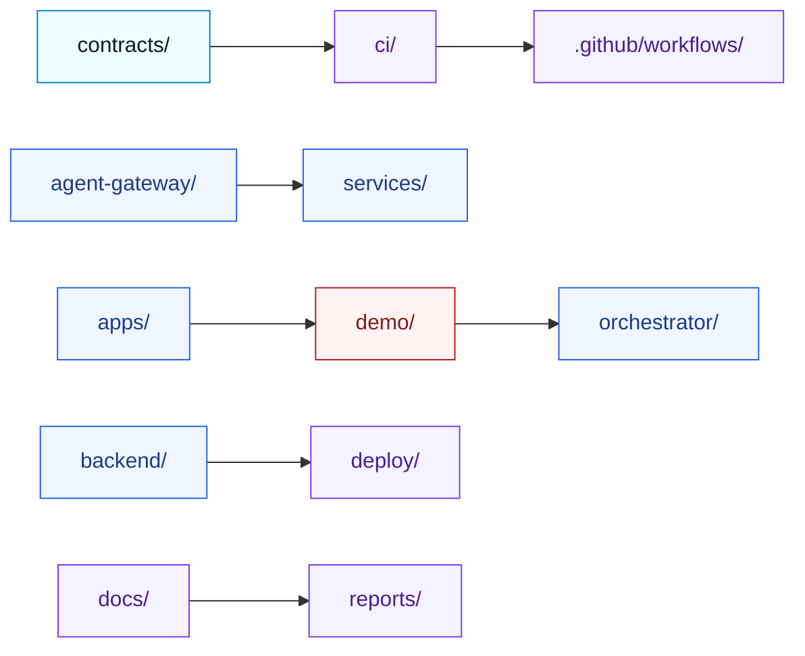
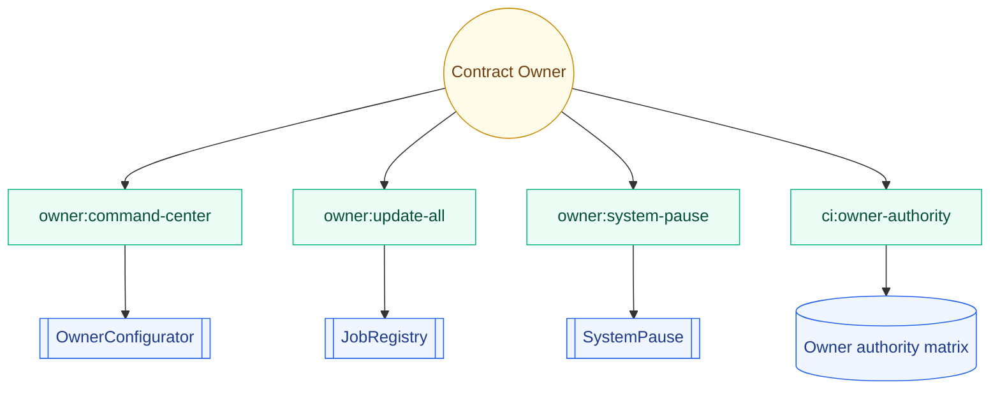
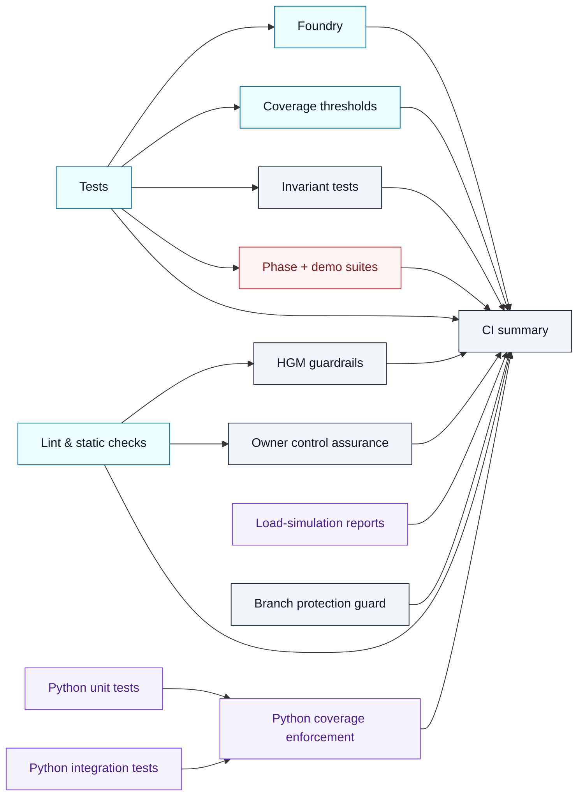
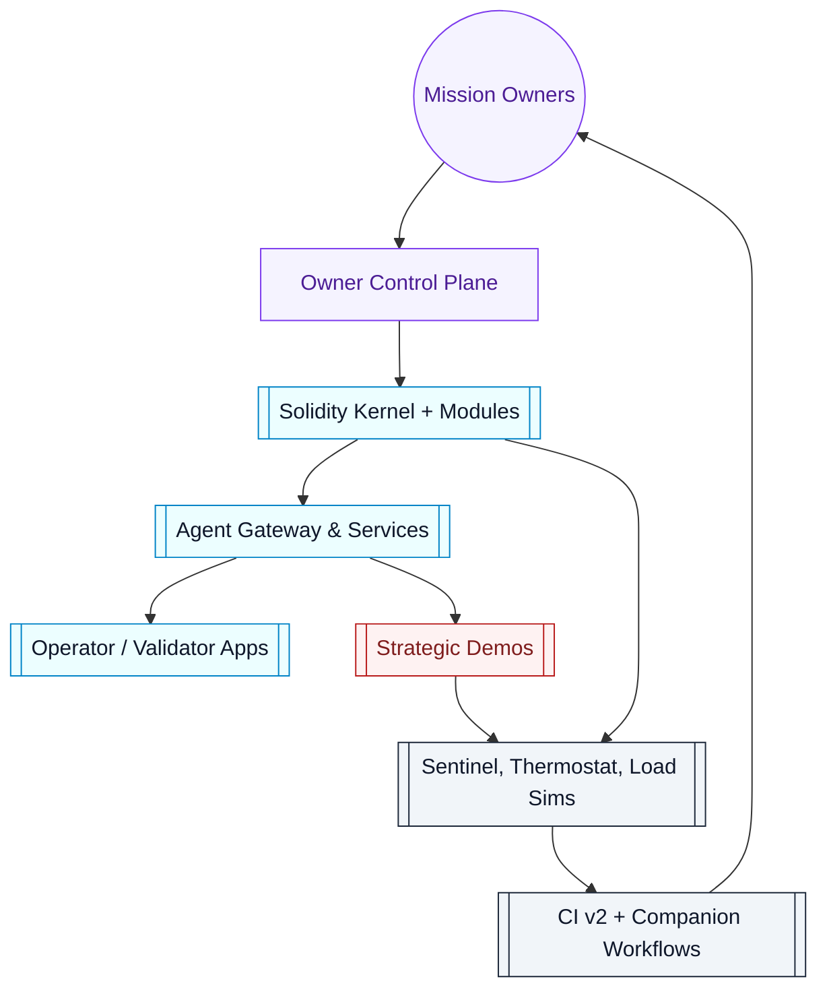

# AGI Jobs v0 (v2)

[](https://github.com/MontrealAI/AGIJobsv0/actions/workflows/ci.yml)
[](https://github.com/MontrealAI/AGIJobsv0/actions/workflows/static-analysis.yml)
[](https://github.com/MontrealAI/AGIJobsv0/actions/workflows/fuzz.yml)
[](https://github.com/MontrealAI/AGIJobsv0/actions/workflows/webapp.yml)
[](https://github.com/MontrealAI/AGIJobsv0/actions/workflows/containers.yml)
[](https://github.com/MontrealAI/AGIJobsv0/actions/workflows/orchestrator-ci.yml)
[](https://github.com/MontrealAI/AGIJobsv0/actions/workflows/e2e.yml)
[](https://github.com/MontrealAI/AGIJobsv0/actions/workflows/scorecard.yml)

AGI Jobs v0 (v2) is delivered as a production-hardened intelligence core that fuses contracts, agents, demos, and observability into a single command surface for mission owners. The platform behaves like the reference superintelligent system for the ecosystem—autonomous, accountable, and ready to deploy in boardroom-level scenarios.

## Executive signal
- **Unification:** Smart contracts, agent gateways, demos, and analytics are orchestrated as one lattice, keeping governance, telemetry, and delivery in lockstep for non-technical operators.【F:agent-gateway/README.md†L1-L53】【F:apps/validator-ui/README.md†L1-L40】【F:services/thermostat/README.md†L1-L60】
- **Owner supremacy:** Every critical lever is surfaced through deterministic owner tooling so the contract owner can pause, upgrade, and retune parameters on demand, without redeploying or editing code.【F:contracts/v2/admin/OwnerConfigurator.sol†L7-L112】【F:package.json†L135-L226】
- **Evergreen assurance:** CI v2 enforces a wall of 23 required contexts plus companion workflows, uploads audit artefacts, and verifies branch protection so every release inherits a fully green, enforceable policy.【F:.github/workflows/ci.yml†L24-L144】【F:.github/workflows/ci.yml†L936-L1339】【F:ci/required-contexts.json†L1-L24】【F:ci/required-companion-contexts.json†L1-L11】

## Quickstart for operators
1. Use Node.js 20.18.1 (`.nvmrc`) and Python 3.12 to match the automated toolchain.【F:.nvmrc†L1-L1】【F:.github/workflows/ci.yml†L141-L188】
2. Hydrate dependencies:
   ```bash
   npm install
   python -m pip install --upgrade pip
   python -m pip install -r requirements-python.txt
   ```
3. Confirm the deterministic toolchain locks before coding:
   ```bash
   npm run ci:preflight
   npm run ci:verify-toolchain
   npm run ci:verify-contexts
   npm run ci:verify-companion-contexts
   ```
   All four commands are wired into CI v2, so keeping them green locally mirrors branch protection expectations.【F:package.json†L138-L150】【F:.github/workflows/ci.yml†L44-L133】
4. Validate the critical suites:
   ```bash
   npm test
   npm run lint:ci
   npm run coverage
   forge test -vvvv --ffi --fuzz-runs 256
   ```
   These commands reproduce the Hardhat, linting, coverage, and Foundry stages the pipeline requires.【F:package.json†L233-L245】【F:.github/workflows/ci.yml†L62-L552】
5. When the signal is green, push signed commits and open a pull request—CI v2 enforces the exact same contexts on `main` and PRs.

## Repository atlas


| Domain | Highlights |
| ------ | ---------- |
| Contracts (`contracts/`) | Solidity kernel, modules, admin façades, and invariant harnesses tested through Hardhat + Foundry with owner-first controls.【F:contracts/README.md†L1-L82】 |
| Agent Gateway (`agent-gateway/`) | TypeScript service providing REST, WebSocket, and gRPC bridges into the contract stack with deterministic telemetry exports.【F:agent-gateway/README.md†L1-L86】 |
| Apps (`apps/`) | Operator and validator UIs that consume the gateway and orchestrator APIs for mission dashboards.【F:apps/validator-ui/README.md†L1-L40】 |
| Services (`services/`) | Sentinels, thermostat, culture indexers, and auxiliary control planes feeding observability and safeguards.【F:services/thermostat/README.md†L1-L60】 |
| CI (`ci/` + `.github/workflows/`) | Scripts, manifests, and workflows that lock toolchains, enforce branch protection, and publish compliance artefacts.【F:ci/required-contexts.json†L1-L24】【F:.github/workflows/ci.yml†L24-L552】 |
| Demo constellation (`demo/`) | High-stakes rehearsals (Kardashev, ASI take-off, Zenith sapience, etc.) codified as reproducible scripts and UI bundles.【F:.github/workflows/ci.yml†L552-L938】 |

## Owner command authority


| Command | Purpose |
| ------- | ------- |
| `npm run owner:system-pause -- --network <network>` | Toggle pause levers across kernel and module contracts in one transaction, enforcing ownership checks before execution.【F:package.json†L180-L195】【F:contracts/v2/SystemPause.sol†L15-L157】 |
| `npm run owner:update-all -- --network <network>` | Reconcile manifests against on-chain parameters through the `OwnerConfigurator`, emitting structured audit logs per change.【F:package.json†L195-L215】【F:contracts/v2/admin/OwnerConfigurator.sol†L7-L112】 |
| `npm run owner:command-center` | Render a consolidated mission-control report (mermaid + JSON) so non-technical owners can approve operations before broadcasting.【F:package.json†L165-L190】 |
| `npm run owner:parameters -- --network <network>` | Export the full parameter matrix referenced in CI and compliance reviews.【F:package.json†L165-L208】【F:scripts/v2/ownerParameterMatrix.ts†L1-L612】 |
| `npm run ci:owner-authority -- --network ci --out reports/owner-control` | Regenerate the authority matrix consumed by CI artefacts and branch protection guards.【F:package.json†L138-L149】【F:.github/workflows/ci.yml†L386-L434】 |

Every command supports `--dry-run` and report exports, ensuring the contract owner retains absolute control while the automation stays auditable.【F:scripts/v2/ownerControlDoctor.ts†L1-L252】【F:scripts/v2/ownerControlQuickstart.ts†L1-L220】

## CI v2 orchestration


### Required contexts
The branch protection rule enforces the following `ci (v2)` contexts, guaranteeing a visible, fully green wall before merge:

| Context | Description |
| ------- | ----------- |
| Lint & static checks | Hardhat/TypeScript linting, manifest validation, and lock enforcement.【F:.github/workflows/ci.yml†L44-L133】 |
| Tests | Hardhat compilation, test execution, ABI drift detection.【F:.github/workflows/ci.yml†L150-L206】 |
| Python unit tests | Unit-level analytics covering paymaster, tools, orchestrator, and simulation suites.【F:.github/workflows/ci.yml†L188-L260】 |
| Python integration tests | Route-level API integration, demo rehearsal validation, and deterministic analytics.【F:.github/workflows/ci.yml†L206-L318】 |
| Load-simulation reports | Monte Carlo sweeps producing CSV + JSON artefacts for economic stress tests.【F:.github/workflows/ci.yml†L318-L378】 |
| Python coverage enforcement | Combines unit/integration coverage and enforces thresholds.【F:.github/workflows/ci.yml†L378-L434】 |
| HGM guardrails | Higher Governance Machine regression suite spanning Node + Python controllers.【F:.github/workflows/ci.yml†L434-L486】 |
| Owner control assurance | Owner doctor reports and parameter matrices proving the owner retains ultimate authority.【F:.github/workflows/ci.yml†L486-L538】 |
| Foundry | Forge test harness with fuzz + invariant coverage for Solidity contracts.【F:.github/workflows/ci.yml†L538-L592】 |
| Coverage thresholds | Solidity coverage plus access-control remapping and enforcement.【F:.github/workflows/ci.yml†L592-L646】 |
| Phase 6 readiness | Scenario validation for the Phase 6 expansion demo.【F:.github/workflows/ci.yml†L646-L690】 |
| Phase 8 readiness | Scenario validation for the Phase 8 dominance demo.【F:.github/workflows/ci.yml†L690-L732】 |
| Kardashev II readiness | Kardashev II + Stellar rehearsals to keep planetary demos deployable.【F:.github/workflows/ci.yml†L732-L780】 |
| ASI Take-Off Demonstration | Full-length ASI take-off run with artefact exports.【F:.github/workflows/ci.yml†L780-L826】 |
| Zenith Sapience Demonstration | Deterministic + local rehearsal for Zenith Sapience initiatives.【F:.github/workflows/ci.yml†L826-L892】 |
| AGI Labor Market Grand Demo | Exports transcripts for the labour market grand simulation.【F:.github/workflows/ci.yml†L892-L938】 |
| Sovereign Mesh Demo — build | Builds sovereign mesh server + console bundles.【F:.github/workflows/ci.yml†L938-L1000】 |
| Sovereign Constellation Demo — build | Builds constellation orchestrator + console assets.【F:.github/workflows/ci.yml†L1000-L1062】 |
| Celestial Archon Demonstration | Deterministic + local rehearsals for Celestial Archon governance.【F:.github/workflows/ci.yml†L1062-L1128】 |
| Hypernova Governance Demonstration | Hypernova rehearsal with local deterministic replay.【F:.github/workflows/ci.yml†L1128-L1194】 |
| Branch protection guard | Audits GitHub branch protection live against the manifests and fails on drift.【F:.github/workflows/ci.yml†L1194-L1266】【F:ci/required-contexts.json†L1-L24】 |
| CI summary | Aggregates every job outcome, writes Markdown + JSON status artefacts, and fails if any job was red or artefacts are missing.【F:.github/workflows/ci.yml†L1266-L1324】 |
| Invariant tests | Dedicated Forge invariant suite with cached build graph and fuzz tuning.【F:.github/workflows/ci.yml†L1324-L1389】 |

Companion workflows are also required (`static-analysis`, `fuzz`, `webapp`, `containers`, `e2e`), guaranteeing the checks tab mirrors the entire assurance surface.【F:ci/required-companion-contexts.json†L1-L11】

### Enforcing branch protection
1. Generate or refresh required contexts:
   ```bash
   npm run ci:verify-contexts
   npm run ci:verify-companion-contexts
   ```
2. Audit the live rule without mutations:
   ```bash
   npm run ci:enforce-branch-protection -- --dry-run --branch main
   ```
3. Verify the GitHub rule via the public API without mutating anything (requires a fine-grained PAT or GitHub App token with `administration:read` scope):
   ```bash
   GITHUB_TOKEN=<token> npm run ci:verify-branch-protection -- --owner MontrealAI --repo AGIJobsv0 --branch main
   ```
   The script confirms the live protection rule matches `ci/required-contexts.json` and `ci/required-companion-contexts.json`, failing if the GitHub configuration is stale or missing contexts.【F:package.json†L138-L146】【F:scripts/ci/verify-branch-protection.ts†L1-L239】
4. Apply the rule (requires repo admin token):
   ```bash
   npm run ci:enforce-branch-protection -- --branch main
   ```
   The branch protection guard job revalidates these expectations on every push to `main`, keeping policy and automation in sync.【F:package.json†L135-L146】【F:.github/workflows/ci.yml†L1194-L1266】

### Artefacts
- `reports/ci/status.{md,json}` – machine-readable run summaries consumed by release captains and compliance audits.【F:.github/workflows/ci.yml†L1266-L1324】
- `reports/owner-control/**` – authority matrices, doctor reports, and parameter plans proving owner command coverage.【F:.github/workflows/ci.yml†L486-L538】
- `reports/load-sim/**` – Monte Carlo CSV + JSON payloads with economic dissipation analysis.【F:.github/workflows/ci.yml†L318-L378】

## Architecture panorama


## Documentation & support
- [`OperatorRunbook.md`](OperatorRunbook.md) – live incident and escalation procedures for mission owners.
- [`RUNBOOK.md`](RUNBOOK.md) – consolidated runbooks for validators, agents, and deployment captains.
- [`SECURITY.md`](SECURITY.md) – disclosure policy, threat model, and contact instructions.
- [`docs/user-guides/`](docs/user-guides/README.md) – curated mission guides that plug directly into the owner control plane.
- [`ci/`](ci/README.md) – detailed CI v2 manifest, branch protection checklist, and verification commands.

## License
Released under the MIT License. See [`LICENSE`](LICENSE) for details.
