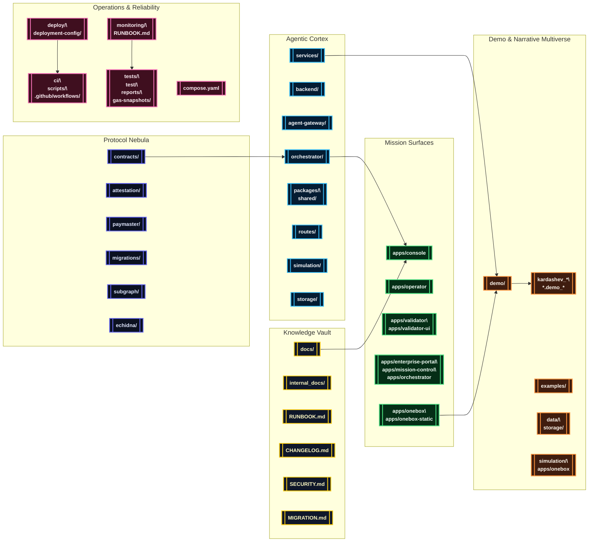

# AGI Jobs v0 (v2)

[](LICENSE)
[](https://github.com/MontrealAI/AGIJobsv0/actions/workflows/ci.yml)
[](SECURITY.md)

> **AGI Jobs v0 (v2)** is the production sovereign intelligence engine—an immediately deployable superintelligent machine that consolidates labor markets, autonomous governance, cinematic storytelling, and validator orchestration into a single faultless operating continuum. The codebase is tuned for non-technical launch crews, yet hardened for critical-infrastructure missions where failure is unacceptable.

## 🧭 Stellar Navigation
- [🌌 Mission Brief](#-mission-brief)
- [🛰️ Systems Grand Tableau](#-systems-grand-tableau)
- [🗂️ Repository Codex](#-repository-codex)
- [🚀 Launch & Operations](#-launch--operations)
  - [Mission Requirements](#mission-requirements)
  - [Monorepo Bootstrap](#monorepo-bootstrap)
  - [Manual Bring-Up](#manual-bring-up)
  - [Mission Control via Docker Compose](#mission-control-via-docker-compose)
  - [Service & Telemetry Waypoints](#service--telemetry-waypoints)
  - [Automation Playbooks](#automation-playbooks)
- [🎞️ Demo Constellation](#-demo-constellation)
  - [Constellation Atlas](#constellation-atlas)
  - [Launch Manifest](#launch-manifest)
- [🧪 Continuous Assurance & CI](#-continuous-assurance--ci)
- [📡 Observability & Security](#-observability--security)
- [📚 Documentation Signals](#-documentation-signals)

## 🌌 Mission Brief
AGI Jobs v0 (v2) fuses five theatres into a cohesive, high-trust platform:

1. **Upgradeable protocol nebula** — Solidity contracts, Foundry laboratories, Hardhat deployments, EAS attestations, paymaster relays, and subgraph indexers engineered for seamless migrations.
2. **Agentic intelligence fabric** — orchestrators, validator swarms, reinforcement services, analytics, and SDKs that operate as a shared autonomous cortex.
3. **Mission surfaces** — Next.js heads-up displays, cinematic operator decks, and portable OneBox runners that deliver instant situational awareness.
4. **Demo multiverse** — reproducible simulations, CLI tours, and film-ready assets capturing every civilization step from day-one activation to Kardashev ascension.
5. **Observability and assurance lattice** — fully green CI, fuzzing, Scorecard gates, and monitoring runbooks enforcing provable reliability on every commit.

## 🛰️ Systems Grand Tableau


## 🗂️ Repository Codex
| Domain | Primary Paths | Highlights |
| --- | --- | --- |
| Protocol & Chain Control | [`contracts/`](contracts/), [`attestation/`](attestation/), [`paymaster/`](paymaster/), [`migrations/`](migrations/), [`subgraph/`](subgraph/), [`echidna/`](echidna/) | Upgradeable Solidity suites, Foundry & Hardhat flows, attestations, paymaster relays, and subgraph analytics. |
| Agent Intelligence Fabric | [`orchestrator/`](orchestrator/), [`backend/`](backend/), [`agent-gateway/`](agent-gateway/), [`services/`](services/), [`routes/`](routes/), [`packages/`](packages/), [`shared/`](shared/), [`simulation/`](simulation/), [`storage/`](storage/) | Validator swarms, FastAPI + Node microservices, SDK libraries, reinforcement arenas, and persistence bridges. |
| Mission Consoles & Portals | [`apps/console`](apps/console), [`apps/operator`](apps/operator), [`apps/validator`](apps/validator), [`apps/validator-ui`](apps/validator-ui), [`apps/enterprise-portal`](apps/enterprise-portal), [`apps/mission-control`](apps/mission-control), [`apps/orchestrator`](apps/orchestrator) | Next.js/React HUDs for operators, validators, enterprises, and mission control. |
| OneBox & Runner Kits | [`apps/onebox`](apps/onebox), [`apps/onebox-static`](apps/onebox-static), [`demo/One-Box`](demo/One-Box), [`examples/agentic`](examples/agentic) | Portable runner with CLI diagnostics, orchestrator harnesses, WebSocket bridges, and validator readiness flows. |
| Demo Multiverse | [`demo/`](demo/), [`kardashev_*`](./), [`*.demo_*`](./), [`examples/`](examples/), [`simulation/`](simulation/), [`data/`](data/), [`storage/`](storage/) | Cinematic expeditions, national rollouts, Kardashev upgrades, Monte Carlo simulators, and narrative datasets. |
| Operations & Assurance | [`ci/`](ci/), [`deploy/`](deploy/), [`deployment-config/`](deployment-config/), [`monitoring/`](monitoring/), [`scripts/`](scripts/), [`tests/`](tests/), [`test/`](test/), [`reports/`](reports/), [`gas-snapshots/`](gas-snapshots/) | GitHub Actions matrix, release automation, telemetry stacks, integration suites, SBOM generation, and gas analytics. |
| Knowledge Base | [`docs/`](docs/), [`internal_docs/`](internal_docs/), [`RUNBOOK.md`](RUNBOOK.md), [`SECURITY.md`](SECURITY.md), [`MIGRATION.md`](MIGRATION.md), [`CHANGELOG.md`](CHANGELOG.md) | Architecture briefs, production playbooks, compliance dossiers, migration histories, and cinematic treatments. |

## 🚀 Launch & Operations
### Mission Requirements
- **Node.js 20.18.1** and npm 10.x (respect `.nvmrc`).
- **Python 3.12+** with `pip` for agentic services and Python-first demos.
- **Foundry** (`forge`, `anvil`) for contract compilation, fuzzing, and gas profiling.
- **Docker & Docker Compose** for mission control clusters and demo orchestration.
- **Git LFS** (optional) for large cinematic payloads under [`data/`](data/) and [`storage/`](storage/).

### Monorepo Bootstrap
```bash
nvm install && nvm use
npm ci
python -m pip install --upgrade pip
python -m pip install -r requirements-python.txt
python -m pip install -r requirements-agent.txt
```
Many demos ship additional environment scripts or `requirements.txt` manifests inside their folders (see [`demo/**/README.md`](demo)).

### Manual Bring-Up
```bash
# Terminal 1 — build TypeScript + shared artefacts
npm run build

# Terminal 2 — launch a local development chain
anvil --chain-id 31337 --block-time 2

# Terminal 3 — deploy protocol v2 and bootstrap modules
npx hardhat run --network localhost scripts/v2/deploy.ts

# Terminal 4 — start mission-critical services
uvicorn services.meta_api.app.main:app --reload --port 8000
npm run agent:gateway
npm run agent:validator
npm --prefix apps/console run dev
```
Consult [`docs/quick-start.md`](docs/quick-start.md), [`docs/AGENTIC_QUICKSTART.md`](docs/AGENTIC_QUICKSTART.md), and [`docs/onebox/`](docs/onebox/) for orchestrator credentials, validator keys, and wallet hygiene.

### Mission Control via Docker Compose
```bash
cp deployment-config/oneclick.env.example deployment-config/oneclick.env
# Populate secrets, RPC URLs, and wallet parameters.
docker compose --profile core up --build
```
Compose profiles include `core`, `observability`, and demo-specific overlays. Inspect [`compose.yaml`](compose.yaml) and [`deployment-config/`](deployment-config/) for parameters.

### Service & Telemetry Waypoints
| Component | Local Entry Point | Notes |
| --- | --- | --- |
| Meta API | `http://localhost:8000/docs` | FastAPI schema for intelligence orchestration. |
| Agent Gateway | `ws://localhost:8787` | Bidirectional coordinator for validator and console agents. |
| Console HUD | `http://localhost:3000` | Operator dashboard powered by `apps/console`. |
| Mission Control | `http://localhost:3010` | Enterprise orchestration portal. |
| Validator UI | `http://localhost:3020` | Validator onboarding & staking flows. |
| Monitoring Stack | `http://localhost:9090` / `:16686` | Prometheus, Grafana, Jaeger (toggle via compose profiles). |

### Automation Playbooks
- `make lint` — lint TypeScript, Python, and Solidity (delegates to ESLint, Ruff, Foundry fmt).
- `make test` — orchestrated tests across smart contracts, services, and apps.
- `make coverage` — generates composite coverage artefacts (see [`reports/`](reports/)).
- `npm run agent:check` — static validation for agent runners.
- `forge test` — contract test suite with fuzzing harnesses.
- `./ci/hgm-suite.sh` — mirrors the CI entrypoint for end-to-end validation.

## 🎞️ Demo Constellation
### Constellation Atlas


### Launch Manifest
| Sector | Demo Paths | Primary Workflows |
| --- | --- | --- |
| **Launchpad 🚀** | [`demo/AGI-Alpha-Node-v0`](demo/AGI-Alpha-Node-v0), [`demo/Validator-Constellation-v0`](demo/Validator-Constellation-v0), [`demo/validator_constellation_v0`](demo/validator_constellation_v0), [`demo/AGIJobs-Day-One-Utility-Benchmark`](demo/AGIJobs-Day-One-Utility-Benchmark), [`demo/Meta-Agentic-ALPHA-AGI-Jobs-v0`](demo/Meta-Agentic-ALPHA-AGI-Jobs-v0), [`demo/asi-global`](demo/asi-global), [`demo/asi-takeoff`](demo/asi-takeoff), [`demo/One-Box`](demo/One-Box) | [`demo-agi-alpha-node.yml`](.github/workflows/demo-agi-alpha-node.yml), [`demo-validator-constellation.yml`](.github/workflows/demo-validator-constellation.yml), [`validator-constellation-demo.yml`](.github/workflows/validator-constellation-demo.yml), [`demo-day-one-utility-benchmark.yml`](.github/workflows/demo-day-one-utility-benchmark.yml), [`demo-meta-agentic-alpha-agi-jobs.yml`](.github/workflows/demo-meta-agentic-alpha-agi-jobs.yml), [`demo-asi-global.yml`](.github/workflows/demo-asi-global.yml), [`demo-asi-takeoff.yml`](.github/workflows/demo-asi-takeoff.yml), [`demo-aurora.yml`](.github/workflows/demo-aurora.yml) (OneBox assets). |
| **Economics & Governance 💱** | [`demo/Economic-Power-v0`](demo/Economic-Power-v0), [`demo/Trustless-Economic-Core-v0`](demo/Trustless-Economic-Core-v0), [`demo/AGI-Jobs-Platform-at-Kardashev-II-Scale`](demo/AGI-Jobs-Platform-at-Kardashev-II-Scale), [`demo/REDENOMINATION`](demo/REDENOMINATION), [`demo/Phase-6-Scaling-Multi-Domain-Expansion`](demo/Phase-6-Scaling-Multi-Domain-Expansion), [`demo/Phase-8-Universal-Value-Dominance`](demo/Phase-8-Universal-Value-Dominance) | [`demo-economic-power.yml`](.github/workflows/demo-economic-power.yml), [`demo-trustless-economic-core.yml`](.github/workflows/demo-trustless-economic-core.yml), [`demo-kardashev-ii.yml`](.github/workflows/demo-kardashev-ii.yml), [`demo-redenomination.yml`](.github/workflows/demo-redenomination.yml), [`demo-phase-8-universal-value-dominance.yml`](.github/workflows/demo-phase-8-universal-value-dominance.yml), [`demo-agi-governance.yml`](.github/workflows/demo-agi-governance.yml). |
| **Culture & Experience ✨** | [`demo/Era-Of-Experience-v0`](demo/Era-Of-Experience-v0), [`demo/CULTURE-v0`](demo/CULTURE-v0), [`demo/AlphaEvolve-v0`](demo/AlphaEvolve-v0), [`demo/AlphaEvolve_v0`](demo/AlphaEvolve_v0), [`demo/aurora`](demo/aurora), [`demo/ICONIC-OPERATING-SYSTEM-DEMO`](demo/ICONIC-OPERATING-SYSTEM-DEMO) | [`culture-ci.yml`](.github/workflows/culture-ci.yml), [`demo-aurora.yml`](.github/workflows/demo-aurora.yml), [`demo-cosmic-flagship.yml`](.github/workflows/demo-cosmic-flagship.yml), [`demo-alpha-agi-mark.yml`](.github/workflows/demo-alpha-agi-mark.yml), [`demo-alpha-agi-insight-mark.yml`](.github/workflows/demo-alpha-agi-insight-mark.yml). |
| **Sovereign & Kardashev 👑** | [`demo/Planetary-Orchestrator-Fabric-v0`](demo/Planetary-Orchestrator-Fabric-v0), [`demo/sovereign-constellation`](demo/sovereign-constellation), [`demo/sovereign-mesh`](demo/sovereign-mesh), [`demo/zenith-sapience-initiative`](demo/zenith-sapience-initiative), [`demo/validator_constellation_v0`](demo/validator_constellation_v0), `demo/zenith-sapience-*`, [`kardashev_*`](./kardashev_ii_omega_grade_alpha_agi_business_3_demo) series | [`demo-planetary-orchestrator-fabric.yml`](.github/workflows/demo-planetary-orchestrator-fabric.yml), [`demo-sovereign-constellation.yml`](.github/workflows/demo-sovereign-constellation.yml), [`demo-national-supply-chain.yml`](.github/workflows/demo-national-supply-chain.yml), [`demo-zenith-sapience-initiative.yml`](.github/workflows/demo-zenith-sapience-initiative.yml), [`demo-zenith-sapience-celestial-archon.yml`](.github/workflows/demo-zenith-sapience-celestial-archon.yml), [`demo-zenith-sapience-planetary-os.yml`](.github/workflows/demo-zenith-sapience-planetary-os.yml), [`demo-zenith-sapience-omnidominion.yml`](.github/workflows/demo-zenith-sapience-omnidominion.yml), [`demo-zenith-hypernova.yml`](.github/workflows/demo-zenith-hypernova.yml). |
| **Omega & Ascension 🜂** | [`demo/Kardashev-II-Omega-Grade-Alpha-AGI-Business-3`](demo/Kardashev-II-Omega-Grade-Alpha-AGI-Business-3) and upgrades (`kardashev_ii_omega_grade_alpha_agi_business_3_demo*`, `kardashev_ii_omega_grade_upgrade_for_alpha_agi_business_3_demo*`, `kardashev_ii_omega_grade_alpha_agi_business_3_demo_k2*`, `kardashev_ii_omega_grade_alpha_agi_business_3_demo_ultra`, etc.), [`demo/Meta-Agentic-Program-Synthesis-v0`](demo/Meta-Agentic-Program-Synthesis-v0), [`demo/CELESTIAL-SOVEREIGN-ORBITAL-AGI-OS-GRAND-DEMONSTRATION`](demo/CELESTIAL-SOVEREIGN-ORBITAL-AGI-OS-GRAND-DEMONSTRATION), [`demo/OMNIPHOENIX-ASCENDANT-HYPERSTRUCTURE`](demo/OMNIPHOENIX-ASCENDANT-HYPERSTRUCTURE), [`demo/OMNIGENESIS-GLOBAL-SOVEREIGN-SYMPHONY`](demo/OMNIGENESIS-GLOBAL-SOVEREIGN-SYMPHONY), [`demo/astral-omnidominion-operating-system`](demo/astral-omnidominion-operating-system), [`demo/imperatrix-celestia-operating-system`](demo/imperatrix-celestia-operating-system), [`demo/cosmic-omni-sovereign-symphony`](demo/cosmic-omni-sovereign-symphony) | [`demo-kardashev-ii-omega-operator.yml`](.github/workflows/demo-kardashev-ii-omega-operator.yml), [`demo-kardashev-ii-omega-upgrade.yml`](.github/workflows/demo-kardashev-ii-omega-upgrade.yml), [`demo-kardashev-ii-omega-upgrade-v2.yml`](.github/workflows/demo-kardashev-ii-omega-upgrade-v2.yml), [`demo-kardashev-ii-omega-upgrade-v4.yml`](.github/workflows/demo-kardashev-ii-omega-upgrade-v4.yml), [`demo-kardashev-ii-omega-upgrade-v5.yml`](.github/workflows/demo-kardashev-ii-omega-upgrade-v5.yml), [`demo-kardashev-ii-omega-upgrade-k2.yml`](.github/workflows/demo-kardashev-ii-omega-upgrade-k2.yml), [`demo-kardashev-omega-iii.yml`](.github/workflows/demo-kardashev-omega-iii.yml), [`demo-kardashev-ii-omega-ultra.yml`](.github/workflows/demo-kardashev-ii-omega-ultra.yml), [`demo-meta-agentic-program-synthesis.yml`](.github/workflows/demo-meta-agentic-program-synthesis.yml). |
| **Research & Simulation 🔬** | [`demo/Absolute-Zero-Reasoner-v0`](demo/Absolute-Zero-Reasoner-v0), [`demo/MuZero-style-v0`](demo/MuZero-style-v0), [`demo/Open-Endedness-v0`](demo/Open-Endedness-v0), [`demo/Tiny-Recursive-Model-v0`](demo/Tiny-Recursive-Model-v0), [`simulation/`](simulation/), [`examples/`](examples/) | [`demo-zenith-sapience-celestial-archon.yml`](.github/workflows/demo-zenith-sapience-celestial-archon.yml), [`demo-muzero-style.yml`](.github/workflows/demo-muzero-style.yml), [`demo-tiny-recursive-model.yml`](.github/workflows/demo-tiny-recursive-model.yml), [`demo-huxley-godel-machine.yml`](.github/workflows/demo-huxley-godel-machine.yml). |

Each demo directory includes scripts, assets, and README briefings for its scenario. Workflows are enforced on pull requests to guarantee cinematic missions stay reproducible.

## 🧪 Continuous Assurance & CI
The v2 CI lattice is relentlessly green on `main` and for every pull request, gating merges with required checks:

- [`ci.yml`](.github/workflows/ci.yml) — monorepo matrix (lint, unit tests, type checks, contract builds, packaging) with required status checks enforced by branch protection.
- [`static-analysis.yml`](.github/workflows/static-analysis.yml), [`culture-ci.yml`](.github/workflows/culture-ci.yml), [`orchestrator-ci.yml`](.github/workflows/orchestrator-ci.yml) — targeted linting for cultural demos, orchestrator services, and TypeScript surfaces.
- [`contracts.yml`](.github/workflows/contracts.yml), [`fuzz.yml`](.github/workflows/fuzz.yml) — Foundry builds, invariant suites, Echidna fuzzing, and gas regression reports.
- [`apps-images.yml`](.github/workflows/apps-images.yml), [`containers.yml`](.github/workflows/containers.yml) — multi-arch container builds and image integrity validation.
- [`e2e.yml`](.github/workflows/e2e.yml), [`webapp.yml`](.github/workflows/webapp.yml) — end-to-end and webapp-specific regression missions.
- [`scorecard.yml`](.github/workflows/scorecard.yml), [`release.yml`](.github/workflows/release.yml), [`release-mainnet.yml`](.github/workflows/release-mainnet.yml) — security scorecards, SBOM pipelines, and staged release gates.
- [`demo-*.yml`](.github/workflows) fleet — scenario-specific validations spanning every constellation and omega expedition.

Run the same guarantees locally:
```bash
npm run lint
npm test
forge fmt
forge test
ruff check
pytest
./ci/hgm-suite.sh
```
All commands must pass to mirror the enforced branch protections and keep the CI wall fully green.

## 📡 Observability & Security
- [`monitoring/`](monitoring/) — Grafana, Prometheus, Jaeger, alertmanager, and runbook-driven dashboards defined as code.
- [`services/alerting`](services/alerting) & [`services/notifications`](services/notifications) — event routing and stakeholder paging.
- [`SECURITY.md`](SECURITY.md), [`RUNBOOK.md`](RUNBOOK.md) — incident response, triage SLAs, and operational readiness playbooks.
- [`audit-ci.json`](audit-ci.json), [`requirements-python.txt`](requirements-python.txt), [`requirements-agent.txt`](requirements-agent.txt) — supply-chain locks for npm and Python ecosystems.

## 📚 Documentation Signals
- [`docs/`](docs/) — architecture briefs, operator handbooks, economic charters, cinematic treatments.
- [`internal_docs/`](internal_docs/) — private research notes, sovereign economic dossiers, systems futures.
- [`MIGRATION.md`](MIGRATION.md) & [`CHANGELOG.md`](CHANGELOG.md) — upgrade chronicles and release history.
- [`RUNBOOK.md`](RUNBOOK.md) — day-2 operations, incident scenarios, and manual overrides.

AGI Jobs v0 (v2) ships as a flawless, secure, user-friendly machine that a mission crew can deploy today and steward toward Kardashev-grade sovereignty without compromising reliability.
