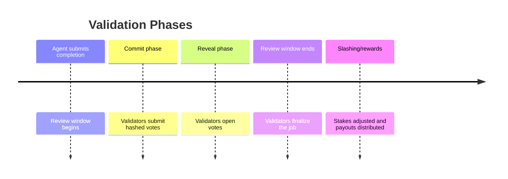

# AGIJob Manager
[](LICENSE) [](https://github.com/MontrealAI/AGIJobsv0/actions/workflows/ci.yml)

AGIJob Manager is an experimental suite of Ethereum smart contracts and tooling for coordinating trustless labor markets among autonomous agents using the $AGI token. This repository hosts the immutable mainnet deployment (v0) and an unaudited v1 prototype under active development. Treat every address as unverified until you confirm it on-chain and through official AGI.eth channels.

> **Critical Security Notice:** `AGIJobManagerv0.sol` in `legacy/` is the exact source for the mainnet contract at [`0x0178…ba477`](https://etherscan.io/address/0x0178b6bad606aaf908f72135b8ec32fc1d5ba477). It is immutable and must never be altered. Any future releases will appear as new files (for example, `contracts/AGIJobManagerv1.sol`) and will be announced only through official AGI.eth channels. Always cross‑check contract addresses and bytecode on multiple explorers before sending funds or interacting with a deployment.

## Quick Links

- [AGIJobManager v0 on Etherscan](https://etherscan.io/address/0x0178b6bad606aaf908f72135b8ec32fc1d5ba477#code) – verify the 0x0178… address independently before interacting.
- [AGIJobManager v0 on Blockscout](https://blockscout.com/eth/mainnet/address/0x0178b6bad606aaf908f72135b8ec32fc1d5ba477/contracts)
- [AGIJobs NFT Collection on OpenSea](https://opensea.io/collection/agijobs) – confirm the collection contract on a block explorer before trading.
- [AGIJobs NFT contract on Etherscan](https://etherscan.io/address/0x0178b6bad606aaf908f72135b8ec32fc1d5ba477#code) / [Blockscout](https://blockscout.com/eth/mainnet/address/0x0178b6bad606aaf908f72135b8ec32fc1d5ba477/contracts) – cross-check the address on multiple explorers before trading.
- [$AGI token contract on Etherscan](https://etherscan.io/address/0xf0780F43b86c13B3d0681B1Cf6DaeB1499e7f14D#code) / [Blockscout](https://eth.blockscout.com/address/0xf0780F43b86c13B3d0681B1Cf6DaeB1499e7f14D?tab=contract) – cross-verify the token address before transacting.
- [AGIJobManager v0 Source](legacy/AGIJobManagerv0.sol)
- [AGIJobManager v1 Source](contracts/AGIJobManagerv1.sol) – experimental upgrade using Solidity 0.8.21; includes an automatic token burn on final validation via the `JobFinalizedAndBurned` event and configurable burn parameters. Not deployed; treat any address claiming to be v1 as unverified until announced through official channels.

> **Warning**: Links above are provided for reference only. Always validate contract addresses and metadata on multiple block explorers before interacting.

## Getting Started for Non‑Technical Users

Use a block explorer like Etherscan to interact with the contract—no coding required. Confirm the [AGIJobManager address](https://etherscan.io/address/0x0178b6bad606aaf908f72135b8ec32fc1d5ba477#writeContract) on multiple explorers before sending transactions.

### Employers

1. Open the **Write Contract** tab and expand `createJob` to post a task with escrowed payout.
2. Monitor the job; if the agent misses the deadline, anyone can call `cancelExpiredJob` to refund the employer (minus a small reward to the caller), so keep an eye on the timer.

### Agents

1. Connect your wallet on the same page.
2. Ensure your reputation meets `minAgentReputation`, then use `applyForJob` with the job ID.
3. After finishing work, call `requestJobCompletion` with an IPFS hash or URL.

### Validators

1. Deposit stake through `stake` to join the pool.
2. View the current validator roster via `getValidatorPool` in the **Read Contract** tab.
3. During the commit phase call `commitValidation`, then `revealValidation` in the reveal phase.
4. Finalize with `validateJob` or `disapproveJob`.

#### Example Write Functions

- [createJob](https://etherscan.io/address/0x0178b6bad606aaf908f72135b8ec32fc1d5ba477#writeContract)
- [stake](https://etherscan.io/address/0x0178b6bad606aaf908f72135b8ec32fc1d5ba477#writeContract)
- [commitValidation](https://etherscan.io/address/0x0178b6bad606aaf908f72135b8ec32fc1d5ba477#writeContract)
- [revealValidation](https://etherscan.io/address/0x0178b6bad606aaf908f72135b8ec32fc1d5ba477#writeContract)

For detailed examples and code snippets, see the [Quick Start](#quick-start).

## Disclaimer

- Verify every address independently before sending transactions. Cross-check on multiple block explorers (e.g., Etherscan, Blockscout) and official channels.
- **Audit Status:** Unaudited – use at your own risk.
- **Security Notice:** This repository is research code. Confirm contract addresses, compiled bytecode, and deployment parameters yourself and experiment on public testnets before interacting with real assets.
- **Validator Risk:** Validators must lock stake before voting. Incorrect votes are slashed and stakes remain locked until all of the validator's jobs finalize; review the slashing and withdrawal rules before committing funds.

## Safety Checklist

Follow these steps before trusting any address or artifact:

- Verify contract and token addresses on at least two explorers (e.g., Etherscan and Blockscout).
- Ensure the verified source code matches the compiled bytecode.
- Exercise new code on public testnets prior to mainnet usage.
- Reproduce builds locally with pinned compiler and dependency versions to confirm bytecode.
- Avoid links or addresses from untrusted third parties.
- Marketplace functions prevent duplicate listings and block sellers from purchasing their own NFTs, reducing accidental misuse.
- Verify repository integrity (`git tag --verify` / `git log --show-signature`) before relying on published code.
- Understand that tokens are burned instantly upon the final validator approval, irreversibly sending `burnPercentage` of escrow to `burnAddress`. The burn occurs only after all internal state updates are complete to follow the checks‑effects‑interactions pattern. Both parameters remain `onlyOwner` configurable.
- All percentage parameters use basis points (1 bp = 0.01%); double‑check values before submitting transactions.
- Jobs finalize only after the agent calls `requestJobCompletion`; even moderator resolutions in favor of the agent revert otherwise.
- Once both commit and reveal windows pass, a `resolveGracePeriod` begins. If validators fail to finalize within this window, anyone may call `resolveStalledJob(jobId)` to pay the agent when approvals outnumber disapprovals or refund the employer otherwise. The call only proceeds when total validator participation meets `validatorsPerJob`; otherwise `JobQuorumNotMet` fires and the job moves to `Disputed`. When participation meets quorum but approvals and disapprovals tie, the job also moves to `Disputed` and emits `JobTie`. Monitor open jobs so funds aren't locked indefinitely.
- Escrowed payouts and validator stakes are tracked separately; `withdrawAGI` only permits withdrawing surplus funds not locked for jobs or staking.
- Confirm the current `stakeRequirement`, `agentStakeRequirement`, and `minAgentReputation` with the contract's **Read** tab before staking or applying; `withdrawStake` only succeeds once all of your jobs are finalized without disputes. Agents can check their own stake via `agentStake(address)`.
- Monitor `*Updated` events for changes to burn rates, slashing percentages, reward splits, minimum reputation, the slashed‑stake recipient, or validator pool resets via `ValidatorPoolSet`.
- Validators that fall below `minValidatorReputation` are automatically blacklisted; the restriction lifts once their reputation rises back above the threshold.
- If no validator votes correctly, only slashed stake goes to `slashedStakeRecipient` while the reserved validator reward portion returns to the job's agent or employer; verify this recipient and watch for updates before staking.

## Default Parameters

These values reflect the contract's initial configuration. Confirm current settings with the on-chain getters before interacting.

### Timing Defaults

| Parameter | Default | Purpose | Getter |
| --- | --- | --- | --- |
| `commitDuration` | `3600 s` (1 h) | Length of commit phase for hashed votes | `commitDuration()` |
| `revealDuration` | `3600 s` (1 h) | Time validators have to reveal votes | `revealDuration()` |
| `reviewWindow` | `7200 s` (2 h) | Delay after completion request before finalization | `reviewWindow()` |
| `resolveGracePeriod` | `3600 s` (1 h) | Additional time before anyone can resolve stalled jobs | `resolveGracePeriod()` |

### Stake & Slashing Defaults

| Parameter | Default | Notes |
| --- | --- | --- |
| `stakeRequirement` | `0 AGI` | Minimum validator bond before voting |
| `agentStakeRequirement` | `0 AGI` | Minimum agent bond before applying |
| `validationRewardPercentage` | `8%` | Portion of payout shared among correct validators |
| `validatorSlashingPercentage` | `0%` | Stake burned when a validator votes incorrectly |
| `agentSlashingPercentage` | `0%` | Stake burned if an agent misses a deadline or loses a dispute |

## Simple Workflow

Interact with the contracts using a wallet or block explorer. Always verify contract addresses on multiple explorers before sending transactions. For method-level details and code samples, see the [Quick Start](#quick-start). See the [Glossary](docs/glossary.md) for definitions of the commit phase, review window, and other terms.

**Employers**
- Confirm the AGIJobManager contract address on Etherscan, Blockscout, or official channels.
- From the explorer's **Write** tab or your wallet's contract interface, call `createJob` to post the task and escrow funds (≈1 transaction).
- Wait for an agent to apply and for validators to finalize; the NFT and remaining payout arrive automatically.
- Track the job's deadline; if the agent misses it, anyone can call `cancelExpiredJob(jobId)` from the contract's Write tab to return your escrow **and earn a small reward**, so monitor deadlines so funds aren't locked longer than necessary.
- Validators reviewing the job are selected pseudo-randomly using recent block data mixed with an owner-provided seed. This provides reasonable variability but is not tamper-proof; high-value deployments should integrate a verifiable randomness source such as a VRF oracle, which the project may adopt in a future upgrade.

**Agents**
- Double-check the contract address before interacting.
- Stake at least `agentStakeRequirement` via `stakeAgent` and maintain `minAgentReputation` before applying. Check the thresholds with `agentStakeRequirement()` and `minAgentReputation()` and verify your balance with `agentStake(address)` in the contract's **Read** tab.
- Use `applyForJob` to claim the task (≈1 transaction).
- After completing the work, call `requestJobCompletion` with a non-empty result reference such as an IPFS hash (≈1 transaction).
- Monitor the job status until validators approve and funds release.
- Request completion before the deadline or anyone can cancel via `cancelExpiredJob` to refund the employer's escrow and claim the caller reward, so keep a close eye on the timer.
- Losing a dispute reduces your reputation and can slash any staked AGI. The `AgentPenalized` event records the penalty.
- Accumulating three penalties (missed deadlines or employer wins) automatically blacklists your address until the owner calls `clearAgentBlacklist`.
- Disputes still resolve even if your stake drops below `agentStakeRequirement`; jobs finalize but no additional slashing occurs when funds are insufficient.

**Penalties**
- Missing a deadline or having a moderator side with the employer via `resolveDispute` can lower your reputation and slash staked AGI if the job is cancelled with `cancelExpiredJob`.
- After three such penalties, `blacklistedAgents[agent]` becomes `true` and you must appeal to the owner to run `clearAgentBlacklist` before applying again.

**Validators**
- Verify the contract address and ensure you meet the current stake requirement.
- Stake AGI with `stake` to join the validator pool (≈1 transaction).
- Validators are chosen via on-chain pseudo-randomness mixed with an owner-provided seed. This makes reviews hard to predict but is not fully tamper-proof; later versions may integrate a verifiable randomness function (VRF).
- When selected, submit `commitValidation` during the commit phase (≈1 transaction) and later `revealValidation` in the reveal phase (≈1 transaction).
- Finalize the job with `validateJob` or `disapproveJob` once the review window ends (≈1 transaction).
- Expect roughly 4–5 transactions per job, not counting the initial stake.

### Validation Timeline



### Stake Locking, Slashing, and Rewards

- **Locking:** Validator `stake()` and agent `stakeAgent()` deposits remain locked while they have unresolved jobs. Withdrawals succeed only after all associated jobs finalize without disputes.
- **Slashing:** Incorrect validator reveals forfeit `validatorSlashingPercentage` of their bonded stake. Agents lose `agentSlashingPercentage` of stake when a deadline is missed or a dispute favors the employer.
- **Rewards:** Correct validators split `validationRewardPercentage` of the job's remaining payout plus any slashed validator stake. Agents receive the remaining escrow minus burn and validator rewards when validators approve their work.

## Quick Start

### Plain-Language Quick Start
See the [Glossary](docs/glossary.md) for key terminology.

**Employers**
- Post a job and deposit the payout.
- Wait for an agent to finish and validators to approve.
- If no completion request arrives before the deadline, anyone may call `cancelExpiredJob(jobId)` to refund the employer and pay a small reward to the caller, so monitor the deadline.
- Validators are selected pseudo-randomly using blockhash, `block.prevrandao`, and an owner-supplied seed, reducing predictability though not eliminating collusion risk.
 - Validators are selected pseudo-randomly using blockhash, `block.prevrandao`, and an owner-supplied seed. This reduces predictability though not eliminating collusion risk; a future upgrade may replace this with a verifiable randomness function (VRF) for stronger guarantees.
- Receive the NFT and any remaining funds.
- Example: [createJob transaction](https://etherscan.io/tx/0xccd6d21a8148a06e233063f57b286832f3c2ca015ab4d8387a529e3508e8f32e).

**Agents**
- Stake the required AGI with `stakeAgent` and ensure your reputation meets `minAgentReputation` before claiming an open job. Verify your balance with `agentStake(address)` and check the thresholds via `agentStakeRequirement()` and `minAgentReputation()`.
- Submit your work with a link or hash.
- Be sure to request completion before the job duration expires; otherwise anyone can call `cancelExpiredJob` to refund the employer and claim the caller reward, so track your deadline closely.
- Missing the deadline or losing a dispute can reduce your reputation and staked AGI.
- Get paid after validators sign off.
- Examples: [applyForJob](https://etherscan.io/tx/0x55f8ee0370c9c08a6e871a4184650419b520d4e9666536cbdcf47f4f03917ce2) · [requestJobCompletion](https://etherscan.io/tx/0xd4f85a33a73319c04df3497ebe8f43095bfae6ed8e5acdd6a80d295869e6f809).

**Validators**
- Stake AGI to join the pool.
- Validator selection uses on-chain pseudo-randomness with owner-provided entropy, so miners and participants cannot easily predict who will review a job. This mechanism may be upgraded to a verifiable randomness function (VRF) for tamper-resistant selection.
- Submit a hashed vote during the commit phase and reveal it later.
- Finalize the job after the review window.
- Example: [validateJob transaction](https://etherscan.io/tx/0x90d59c0d47ae3e36b7dc6b26ad06fe2ce64955c6d049e675a42bbd5a24647832).

### Contract Quick Start

**Employers**
- Call [`createJob`](contracts/AGIJobManagerv1.sol#L643) to post a task and escrow the payout.
- Confirm the contract address and wait for the `JobCreated` event to learn the job ID.
- If the agent misses the deadline without requesting completion, anyone may call [`cancelExpiredJob`](contracts/AGIJobManagerv1.sol#L1709) with the job ID to refund the employer's escrow (minus a small reward to the caller), so monitor job deadlines.
- Validators are drawn pseudo-randomly using blockhash and `block.prevrandao` mixed with an owner seed; the [`ValidatorsSelected`](contracts/AGIJobManagerv1.sol#L308) event shows who was chosen for each job. This approach may later be replaced with a verifiable randomness function (VRF) for stronger unpredictability.
- After commit and reveal phases conclude, a `resolveGracePeriod` starts. If no validator finalizes the job within this period, anyone can call [`resolveStalledJob`](contracts/AGIJobManagerv1.sol#L989) to settle based on majority votes. The function requires a quorum of `validatorsPerJob`; lacking that, it emits `JobQuorumNotMet` and marks the job disputed. When quorum is met but votes tie, it emits `JobTie` and also moves the job to `Disputed`; monitor jobs for this timeout.

**Agents**
- Stake AGI with [`stakeAgent`](contracts/AGIJobManagerv1.sol#L2088) to meet `agentStakeRequirement` and ensure your reputation meets `minAgentReputation`, then use [`applyForJob`](contracts/AGIJobManagerv1.sol#L665) to claim an open job. Use the contract's **Read** tab to check `agentStakeRequirement()`, `minAgentReputation()`, and your current stake with `agentStake(address)`.
- After finishing work, [`requestJobCompletion`](contracts/AGIJobManagerv1.sol#L694) with a non-empty IPFS hash.
- Submit before the deadline to avoid cancellation via [`cancelExpiredJob`](contracts/AGIJobManagerv1.sol#L1709); deadlines are enforced and anyone can cancel once they pass, earning a small reward.
- An employer win via [`resolveDispute`](contracts/AGIJobManagerv1.sol#L953) or a missed deadline can cut your reputation and staked AGI.
- Verify addresses and watch for `JobApplied` and `JobCompletionRequested` events.

- **Validators**
- Deposit stake with [`stake`](contracts/AGIJobManagerv1.sol#L2061); confirm via the `StakeDeposited` event.
- Validator selection uses on-chain pseudo-randomness, skipping blacklisted or underqualified addresses and reverting if fewer than `validatorsPerJob` meet `stakeRequirement` and `minValidatorReputation`. Future releases may swap this for a verifiable randomness function (VRF) to harden selection against manipulation.
- During the commit window, [`commitValidation`](contracts/AGIJobManagerv1.sol#L775) with your vote commitment.
- Reveal it through [`revealValidation`](contracts/AGIJobManagerv1.sol#L812) once the reveal window opens.
 - Finalize by calling [`validateJob`](contracts/AGIJobManagerv1.sol#L847) or [`disapproveJob`](contracts/AGIJobManagerv1.sol#L891).
- Always verify contract addresses and monitor `ValidationCommitted`, `ValidationRevealed`, and `JobFinalizedAndBurned` events.

### Resolving Ties and Validator No-Shows

An upcoming update to `resolveStalledJob` clarifies what happens when validators fail to deliver a clear verdict.

- **Tie votes:** Example: two validators approve Alice's work and two disapprove. After the grace period, anyone calls `resolveStalledJob`, moving the job to `Disputed`. If a moderator later sides with Alice, the payout releases and dissenting validators lose a slice of stake and reputation. If the employer prevails, the escrow returns and Alice's reputation and staked AGI drop.
- **Zero participation:** Example: Bob submits his work but none of the selected validators reveal a vote. The updated `resolveStalledJob` refunds the employer while Bob's reputation decreases and part of his stake is slashed. Validators who skipped earn nothing.

These rules keep funds from being locked when validators tie or fail to participate.

### Lifecycle Examples

- **Pseudo-random validator selection**: Alice posts a job and Bob completes it. When Bob calls `requestJobCompletion`, the contract mixes recent block data with an owner-provided seed to select validators, making predictions difficult though not impossible.
- **Expiry caller reward**: If an agent fails to request completion before the deadline, anyone—such as Carol—can invoke `cancelExpiredJob` to refund the employer and immediately receive the caller reward.
- **Agent reputation requirement**: Dana has a reputation of 2 but `minAgentReputation` is 5. Her attempt to `applyForJob` reverts until she finishes smaller tasks to raise her score, after which she can claim higher-value jobs.
## Owner Configuration

Only the contract owner can adjust global settings. The following `onlyOwner`
functions control validation incentives, burn behavior, and system limits.

| Function | Purpose | Safe Default Range |
| --- | --- | --- |
| `setBurnPercentage(uint256 bps)` | Portion of job payout burned on finalization (basis points). | `0`–`1000` (0–10%) |
| `setBurnAddress(address addr)` | Destination for burned tokens (non-zero). | Use a known burn or treasury address. |
| `setCancelRewardPercentage(uint256 bps)` | Share of escrow awarded to the caller when cancelling an expired job. | `0`–`1000` (0–10%) |
| `setValidationRewardPercentage(uint256 bps)` | Share of payout granted to correct validators. | `0`–`2000` (0–20%) |
| `setValidatorReputationPercentage(uint256 bps)` | Share of agent reputation awarded to correct validators. | `0`–`1000` (0–10%) |
| `setStakeRequirement(uint256 amount)` | Minimum AGI stake required to validate. | `10`–`1000` AGI |
| `setValidatorSlashingPercentage(uint256 bps)` | Validator stake forfeited for incorrect votes. | `0`–`1000` (0–10%) |
| `setAgentSlashingPercentage(uint256 bps)` | Agent stake forfeited on failures or disputes. | `0`–`1000` (0–10%) |
| `setMinValidatorReputation(uint256 value)` | Reputation threshold validators must meet. | `0`–`100` |
| `setMinAgentReputation(uint256 value)` | Reputation threshold agents must meet. | `0`–`100` |
| `setValidatorsPerJob(uint256 count)` | Number of validators selected per job (pseudo-randomly). | `1`–`10` (default `3`) |
| `setValidatorSelectionSeed(bytes32 seed)` | Extra entropy mixed into validator selection. | any `bytes32` |
| `setCommitRevealWindows(uint256 commit, uint256 reveal)` | Length of commit/reveal phases in seconds. | `300`–`3600` seconds each |
| `setCommitDuration(uint256 secs)` | Adjust commit phase length without changing reveal. | `300`–`3600` seconds |
| `setRevealDuration(uint256 secs)` | Adjust reveal phase length without changing commit. | `300`–`3600` seconds |
| `setReviewWindow(uint256 secs)` | Waiting period before validators vote. | ≥ commit + reveal, typically `3600`–`86400` |
| `setResolveGracePeriod(uint256 secs)` | Time after reveal before anyone may resolve a stalled job. | `300`–`3600` seconds |
| `setTimingConfig(uint256 commit, uint256 reveal, uint256 review, uint256 grace)` | Update all timing parameters atomically. | see above |
| `addAdditionalValidator(address validator)` | Manually whitelist a validator outside the Merkle allowlist; emits `AdditionalValidatorAdded`. | non-zero address |
| `removeAdditionalValidator(address validator)` | Remove a validator from the manual allowlist; emits `ValidatorRemoved`. | previously added address |
| `addAdditionalAgent(address agent)` | Manually whitelist an agent; emits `AdditionalAgentAdded`. | non-zero address |
| `removeAdditionalAgent(address agent)` | Remove an agent from the manual allowlist; emits `AdditionalAgentRemoved`. | previously added address |
| `updateAGITokenAddress(address addr)` | Switch to a new $AGI token contract if ever required. | non-zero address |

The current implementation relies on on-chain entropy for validator selection. For stronger guarantees against manipulation, integrate a verifiable randomness oracle such as Chainlink VRF in a future deployment.

Convenience functions:

- `setBurnConfig(address addr, uint256 bps)` atomically updates burn address and percentage and reverts if burn plus validator reward exceed 100%.
- `setValidatorConfig(...)` adjusts reward, reputation, staking, slashing, and timing in one call.
- `getTimingConfig()` and `getValidatorConfig()` let anyone inspect current timing and incentive parameters in a single read call.
- `getPayoutConfig()` reports burn, validator reward, and expiration caller reward settings along with the burn address.
- `getAGITypes()` lists all NFT collections currently eligible for payout bonuses.

### Example: Updating Burn and Validator Settings with a Block Explorer

1. Verify the AGIJobManager contract address on at least two explorers.
2. In a block explorer's **Write** tab, connect your owner wallet.
3. Call **setBurnConfig** with the burn address and percentage (basis points) and submit the transaction.
4. Confirm `BurnAddressUpdated` and `BurnPercentageUpdated` events appear in the receipt.
5. Call **setValidatorConfig** with desired reward, reputation, staking, slashing, and timing parameters.
6. Verify the transaction emitted `ValidatorConfigUpdated` with the expected values.
7. Cross-check both transactions on another explorer to ensure changes were applied.

> **Warning:** Always double-check contract addresses before sending transactions. After any update, confirm parameter changes via the emitted events and monitor them on-chain.

## Overview

AGIJob Manager orchestrates trustless labor markets for autonomous agents. When a job is validated and its NFT is minted, a configurable portion of the escrowed payout is burned. The project
contains two smart‑contract generations:

- **v0** – the immutable mainnet release, permanently deployed at
  [0x0178b6bad606aaf908f72135b8ec32fc1d5ba477](https://etherscan.io/address/0x0178b6bad606aaf908f72135b8ec32fc1d5ba477).
- **v1** – an in‑development upgrade tracking best practices and modern tooling.

All addresses should be independently verified before use.

## Versions

- **v0 – Legacy:** Immutable code deployed at [0x0178b6bad606aaf908f72135b8ec32fc1d5ba477](https://etherscan.io/address/0x0178b6bad606aaf908f72135b8ec32fc1d5ba477).
- **v1 – Development:** Uses Solidity 0.8.21 (pinned) with custom errors and gas‑optimized loops; deployment address: _TBA_. Any contract advertised as v1 prior to an official release should be regarded as untrusted.

> **Caution:** v0 is frozen and must not be modified. All new work should target v1.

For version details, see the [changelog](CHANGELOG.md).

## Repository Structure

- **legacy/AGIJobManagerv0.sol** – immutable contract deployed on Ethereum mainnet.
- **contracts/AGIJobManagerv1.sol** – forward-looking upgrade under active development.
- **scripts/** – helper utilities like [deploy.ts](scripts/deploy.ts) for network deployment.
- Project metadata: configuration, changelog, and documentation.

## Project Purpose
Aims to coordinate trustless labor markets for autonomous agents using the $AGI token. See the full narrative and diagram in [docs/project-purpose.md](docs/project-purpose.md).

## Features

- **On-chain job board** – employers escrow $AGI and assign tasks to approved agents.
- **Reputation system** – agents and validators earn points that unlock premium capabilities.
- **NFT marketplace** – completed jobs mint NFTs that can be listed, purchased, or delisted; marketplace calls are pausable and guarded by `ReentrancyGuard`, with checks preventing duplicate listings and self-purchases.
- **Base URI metadata** – completion NFTs derive metadata from a contract-level base URI set via `setBaseURI`; token URIs follow the `<baseURI><tokenId>` pattern, so deployments migrating from older versions should configure the base URI to preserve existing links.
- **ENS & Merkle verification** – subdomain ownership and allowlists guard access to jobs and validation.
- **Pausable and owner‑controlled** – emergency stop, moderator management, and tunable parameters.
- **Transparent moderation** – emits `AgentBlacklisted`, `ValidatorBlacklisted`, `ModeratorAdded`, and `ModeratorRemoved` events for on-chain auditability.
- **Indexed events** – key identifiers like `jobId` and participant addresses are indexed in events (`JobCreated`, `JobCompleted`, `JobValidated`, etc.) for easier off-chain filtering and monitoring.
- **Escrow accounting** – tracks total job escrow and validator stakes so owner withdrawals never touch locked funds.
- **Custom-error reverts** – v1 eliminates string `require` messages in favor of named custom errors across admin and validation paths, reducing gas and giving clearer failures.
- **Checks–effects–interactions discipline** – `createJob` now transfers escrow before recording job details, and dispute-resolution loops cache lengths with unchecked increments, reducing reentrancy surface and gas usage.
- **Reentrancy safeguards** – `validateJob` and `resolveDispute` are marked `nonReentrant`, blocking malicious re-entry during finalization and dispute resolution.
- **Enhanced state enforcement** – agents can only apply to jobs in the `Open` state, and validator actions revert with dedicated
  custom errors (e.g., `InsufficientStake`, `ReviewWindowActive`) for clearer failure modes and lower gas use.
- **Explicit completion checks** – `requestJobCompletion` now reverts with dedicated errors (`JobExpired`, `JobNotOpen`) and validator selection fails fast with `NotEnoughValidators` when the pool lacks participants.
- **Enum-based dispute resolution** – moderators settle conflicts with a typed `DisputeOutcome` enum instead of fragile string comparisons.
- **Unified job status** – a `JobStatus` enum (`Open`, `CompletionRequested`, `Disputed`, `Completed`) replaces multiple booleans and is emitted with state-change events like `JobCreated`, `JobCompletionRequested`, `JobDisputed`, and `JobCompleted`.
- **Stake-based validator incentives**
  - Validators must stake $AGI and maintain a minimum reputation.
  - Rewards accrue only to validators whose votes match the final outcome; others are excluded.
  - Misaligned votes are slashed and lose reputation; correct validators share the slashed stake.
  - `validatorsPerJob` defaults to three and can never fall below the approval or disapproval thresholds, preventing owner misconfiguration.
  - If no validator votes correctly, slashed stakes go to `slashedStakeRecipient` and the reserved reward portion refunds to the agent or employer.
  - Default timing uses a one-hour commit phase and one-hour reveal phase with a two-hour review window, all adjustable by the owner. Attempts to set either window to zero revert with the `InvalidDuration` custom error.
  - Validator reputation gains use a separate `validatorReputationPercentage` so reputation rewards can differ from token rewards.
  - All validator parameters (reward %, reputation %, slashing %, stake requirement,
    approval thresholds, commit/reveal/review windows, validator count, slashed-stake recipient, etc.) are owner-configurable via `onlyOwner` functions.
  - The contract owner may add or remove validators from the selection pool with `addAdditionalValidator` and `removeAdditionalValidator`; removed validators emit `ValidatorRemoved` and become ineligible for future jobs.
  - The validator pool is limited by `maxValidatorPoolSize` (default 100). Exceeding the cap in `addAdditionalValidator` or `setValidatorPool` reverts. Owners can adjust the limit via `setMaxValidatorPoolSize`, which emits `MaxValidatorPoolSizeUpdated`.
  - Setting the stake requirement or slashing percentage to `0` disables those mechanisms.
- **Basis-point standardization** – percentage parameters like burns, slashing, and rewards are expressed in basis points for deterministic math.
- **Configurable slashed stake recipient** – if no validator votes correctly, all slashed stake is sent to `slashedStakeRecipient` (initially the owner but adjustable, e.g. to the burn address) while the validator reward portion reverts to the agent or employer.
- **Automatic finalization & configurable token burn** – the last validator approval triggers `_finalizeJobAndBurn`, minting the completion NFT, releasing the payout, and burning the configured portion of escrow. The `JobFinalizedAndBurned` event records agent payouts and burn amounts.

### NFT Bonus

Agents holding qualifying AGI NFTs receive a payout boost derived from the agent's base payout after subtracting validator rewards and burns. The highest applicable bonus (specified in basis points when calling `addAGIType`) is applied. If the bonus would push total distributions over the job's escrow, validator rewards are reduced first and then the burn portion so the sum of payouts never exceeds escrow.

### Burn Mechanism

The v1 prototype destroys a slice of each finalized job's escrow, permanently reducing total supply. Burning occurs automatically when the last validator approval triggers `_finalizeJobAndBurn` to mint the NFT, release payment and burn tokens—no separate call is required.

- **BURN_ADDRESS / burnAddress** – `BURN_ADDRESS` is the canonical dead wallet (`0x000000000000000000000000000000000000dEaD`). The mutable `burnAddress` variable starts at this value but the owner may redirect burns via `setBurnAddress(newAddress)`, emitting `BurnAddressUpdated(newAddress)`.
- **BURN_PERCENTAGE / burnPercentage** – `BURN_PERCENTAGE` (500 basis points) seeds the mutable `burnPercentage` variable. The owner may change or disable burning with `setBurnPercentage(newBps)`; setting `0` halts burning. Each update emits `BurnPercentageUpdated(newBps)`.
- **setBurnConfig(newAddress, newBps)** – convenience method for owners to update both settings atomically. Emits `BurnAddressUpdated(newAddress)` and `BurnPercentageUpdated(newBps)` in a single transaction.
- **Automatic finalization** – the final validator approval executes `_finalizeJobAndBurn`, minting the completion NFT, releasing payment and burning `burnPercentage` of the escrow to `burnAddress`. `JobFinalizedAndBurned(jobId, agent, employer, payoutToAgent, tokensBurned)` records the transfer.
- **Caution:** Tokens sent to the burn address are irrecoverable; monitor `BurnPercentageUpdated` and `BurnAddressUpdated` events when changing parameters.

**Execution flow**

1. The employer escrows `$AGI` when posting the job.
2. When completion is requested, validators enter the commit phase and submit hashed votes via `commitValidation`.
3. After the commit phase, validators reveal their votes with `revealValidation`.
4. After the commit and reveal windows **and** the review window have all closed, validators call `validateJob` or `disapproveJob`; the final approval triggers `_finalizeJobAndBurn`.
5. The contract computes `burnAmount = payout * burnPercentage / 10_000` and sends it to `burnAddress`.
6. Validator rewards and the remaining payout are transferred. If the agent qualifies for an NFT bonus, it is funded from validator rewards and then the burn portion while ensuring the total of agent, validator, and burn amounts never exceeds the original escrow.
7. The completion NFT is minted and sent to the employer.

### Security & Marketplace Updates

- **`jobExists` requirement** – The new [`jobExists`](contracts/AGIJobManagerv1.sol#L624-L628) modifier guards functions and reverts when an unknown job ID is supplied.
- **Checks–effects–interactions** – job cancellation and marketplace functions such as [`cancelJob`](contracts/AGIJobManagerv1.sol#L1690-L1706), [`delistJob`](contracts/AGIJobManagerv1.sol#L1155-L1171), [`listNFT`](contracts/AGIJobManagerv1.sol#L1887-L1897), [`purchaseNFT`](contracts/AGIJobManagerv1.sol#L1899-L1913), and [`delistNFT`](contracts/AGIJobManagerv1.sol#L1915-L1924) update internal state before token transfers to prevent reentrancy and ensure escrow accounting is accurate.
- **Storage cleanup** – marketplace listings are deleted on purchase or delist to reclaim gas and prevent stale entries.
- **Safe minting and transfers** – Completion NFTs are minted with [`_safeMint`](contracts/AGIJobManagerv1.sol#L1794) and traded with [`_safeTransfer`](contracts/AGIJobManagerv1.sol#L1909), ensuring recipients implement ERC-721.
- **Custom error finalization** – [`_finalizeJobAndBurn`](contracts/AGIJobManagerv1.sol#L1734-L1880) reverts with dedicated custom errors, lowering gas costs versus string-based `require`s.
- **Pseudo-random validator selection** – Validators are chosen using blockhash, `block.prevrandao`, and an owner-provided seed so no participant can easily predict who reviews a job.
- **Owner-controlled parameters** – Only the contract owner may tune validator counts, reward and slashing percentages, burn settings, timing windows, and recipient addresses via `onlyOwner` functions such as [`setValidatorConfig`](contracts/AGIJobManagerv1.sol#L1515-L1574) and [`setBurnConfig`](contracts/AGIJobManagerv1.sol#L1394-L1404); each change emits a corresponding `*Updated` event.
- **User-friendly getters** – [`getJobInfo`](contracts/AGIJobManagerv1.sol#L1338-L1372), [`getSelectedValidators`](contracts/AGIJobManagerv1.sol#L1388-L1394), and [`getValidatorPool`](contracts/AGIJobManagerv1.sol#L1398-L1402) expose job and validator details for front‑end integrations without traversing storage mappings.

**Setup checklist**

1. `setBurnConfig(newAddress, newBps)` – set burn destination and rate in one call, or use `setBurnAddress`/`setBurnPercentage` individually.
2. Maintain a sufficiently large validator pool; selection uses pseudo-randomness and still requires a healthy number of eligible validators to avoid repeated draws.
3. Ensure each validator has staked at least `stakeRequirement` before validating and each agent meets `agentStakeRequirement` and `minAgentReputation` before applying.
4. Curate the validator set with `addAdditionalValidator` and `removeAdditionalValidator`; listen for `ValidatorRemoved` when pruning the pool and adjust `maxValidatorPoolSize` with `setMaxValidatorPoolSize` if the pool approaches the cap.
5. Validators may call `withdrawStake` only after all of their jobs finalize without disputes.
6. Monitor `StakeRequirementUpdated`, `AgentStakeRequirementUpdated`, `SlashingPercentageUpdated`, `ValidationRewardPercentageUpdated`, `MinValidatorReputationUpdated`, `ValidatorsPerJobUpdated` (always ≥ the approval/disapproval thresholds), `MaxValidatorPoolSizeUpdated`, `CommitRevealWindowsUpdated`, `ReviewWindowUpdated` (must remain ≥ `commitDuration + revealDuration`), and `SlashedStakeRecipientUpdated` for configuration changes.
7. On final validator approval, watch for `JobFinalizedAndBurned` to confirm payout and burn amounts.

**Example finalization**

```javascript
// commit during the commit phase
await manager
  .connect(validator)
  .commitValidation(jobId, commitment, "", []);

// reveal during the reveal phase
await manager.connect(validator).revealValidation(jobId, true, salt);

// finalize after the review window
await manager.connect(validator).validateJob(jobId, "", []);
// burnPercentage (in basis points) of escrow is sent to burnAddress
// employer receives the completion NFT
```

### Validator Workflow

  - **Staking requirement** – bond $AGI via [`stake`](contracts/AGIJobManagerv1.sol#L2061-L2067) and exit with [`withdrawStake`](contracts/AGIJobManagerv1.sol#L2069-L2087), emitting [`StakeDeposited`](contracts/AGIJobManagerv1.sol#L390) and [`StakeWithdrawn`](contracts/AGIJobManagerv1.sol#L391).
  - **Commit → reveal → finalize** – submit a hashed vote with [`commitValidation`](contracts/AGIJobManagerv1.sol#L775-L806), disclose it via [`revealValidation`](contracts/AGIJobManagerv1.sol#L812-L841), then call [`validateJob`](contracts/AGIJobManagerv1.sol#L847-L886) or [`disapproveJob`](contracts/AGIJobManagerv1.sol#L891-L929) once the review window closes. These steps emit [`ValidationCommitted`](contracts/AGIJobManagerv1.sol#L298-L302), [`ValidationRevealed`](contracts/AGIJobManagerv1.sol#L303-L307), [`JobValidated`](contracts/AGIJobManagerv1.sol#L290), and [`JobDisapproved`](contracts/AGIJobManagerv1.sol#L291).
  - **Slashing & rewards** – correct validators split [`validationRewardPercentage`](contracts/AGIJobManagerv1.sol#L144) of escrow plus any slashed stake, while incorrect votes lose [`validatorSlashingPercentage`](contracts/AGIJobManagerv1.sol#L150) and may trigger `StakeSlashed`. Final approval emits [`JobFinalizedAndBurned`](contracts/AGIJobManagerv1.sol#L311-L318).
  - **Validator pool management** – the contract owner can replace the entire validator list with [`setValidatorPool`](contracts/AGIJobManagerv1.sol#L1973-L2010), which rejects zero addresses and duplicate entries. Each job then draws validators from this pool using pseudo-randomness.
  - **Owner controls** – validator settings are adjustable via [`setValidatorConfig`](contracts/AGIJobManagerv1.sol#L1515-L1574) or individual setters like [`setStakeRequirement`](contracts/AGIJobManagerv1.sol#L1414-L1416), [`setValidatorSlashingPercentage`](contracts/AGIJobManagerv1.sol#L1428-L1435), [`setAgentSlashingPercentage`](contracts/AGIJobManagerv1.sol#L1439-L1443), [`setValidationRewardPercentage`](contracts/AGIJobManagerv1.sol#L1360-L1365), [`setMinValidatorReputation`](contracts/AGIJobManagerv1.sol#L1445-L1448), and [`setSlashedStakeRecipient`](contracts/AGIJobManagerv1.sol#L1406-L1410), each emitting their respective `*Updated` events. `setValidatorConfig` additionally sets commit, reveal, and review windows plus the number of validators per job.

**Commit, reveal, finalize**

```ts
await agiJobManager.connect(validator).stake(ethers.parseUnits("100", 18));
const commitment = ethers.solidityPackedKeccak256(
  ["address", "uint256", "bool", "bytes32"],
  [validator.address, jobId, true, salt]
);
await agiJobManager
  .connect(validator)
  .commitValidation(jobId, commitment, "", []);
await agiJobManager.connect(validator).revealValidation(jobId, true, salt);
await agiJobManager.connect(validator).validateJob(jobId, "", []);
// JobFinalizedAndBurned(jobId, ...) records payout and burn
```

### Allowlist and ENS Management

Owners can refresh allowlists and name-service references without redeploying the contract.

- `setValidatorMerkleRoot(bytes32 newValidatorMerkleRoot)` – rotates the validator allowlist and emits `ValidatorMerkleRootUpdated`.
- `setAgentMerkleRoot(bytes32 newAgentMerkleRoot)` – updates the agent allowlist and emits `AgentMerkleRootUpdated`.
- `setClubRootNode(bytes32 newClubRootNode)` – changes the ENS root node used for validator proofs, emitting `ClubRootNodeUpdated`.
- `setAgentRootNode(bytes32 newAgentRootNode)` – replaces the agent ENS root node and emits `AgentRootNodeUpdated`.
- `setENS(address newEnsAddress)` / `setNameWrapper(address newNameWrapperAddress)` – refresh external contract references and emit `ENSAddressUpdated` / `NameWrapperAddressUpdated`.

**When to update**

Rotate Merkle roots when membership changes or an allowlist leak is suspected. Update ENS or NameWrapper addresses if the registry or wrapper contracts are redeployed. After each change, monitor the emitted events to confirm the new values.

**Security considerations**

Control these owner functions with a multisig or timelock, and watch the event logs for unexpected modifications. Continuous monitoring helps detect unauthorized updates before they affect job flow.

### Configuration Change Events

Several operational parameters are adjustable by the owner. Every update emits a dedicated event so off‑chain services can react to new values:

- `updateAGITokenAddress(address newToken)` → `AGITokenAddressUpdated` (reverts if `newToken` is the zero address)
- `setBaseURI(string newBaseURI)` → `BaseURIUpdated`
- `setRequiredValidatorApprovals(uint256 count)` → `RequiredValidatorApprovalsUpdated`
- `setRequiredValidatorDisapprovals(uint256 count)` → `RequiredValidatorDisapprovalsUpdated`
- `setPremiumReputationThreshold(uint256 newThreshold)` → `PremiumReputationThresholdUpdated`
- `setMaxJobPayout(uint256 newMax)` → `MaxJobPayoutUpdated`
- `setJobDurationLimit(uint256 newLimit)` → `JobDurationLimitUpdated`
- `setCommitRevealWindows(uint256 commitWindow, uint256 revealWindow)` → `CommitRevealWindowsUpdated` – controls how long validators have to commit and reveal votes; the existing `reviewWindow` must be at least `commitWindow + revealWindow`. Zero values are rejected.
- `setCommitDuration(uint256 newCommit)` or `setRevealDuration(uint256 newReveal)` → `CommitRevealWindowsUpdated` – tweak individual phase lengths; `reviewWindow` must remain ≥ `commitDuration + revealDuration`.
- `setReviewWindow(uint256 newWindow)` → `ReviewWindowUpdated` – defines the mandatory wait after completion requests and must be greater than or equal to `commitDuration + revealDuration`.
- `updateTermsAndConditionsIpfsHash(string newHash)` → `TermsAndConditionsIpfsHashUpdated`
- `updateContactEmail(string newEmail)` → `ContactEmailUpdated`
- `updateAdditionalText1(string newText)` → `AdditionalText1Updated`
- `updateAdditionalText2(string newText)` → `AdditionalText2Updated`
- `updateAdditionalText3(string newText)` → `AdditionalText3Updated`

### Enum-Based Dispute Resolution

Disputes between agents and employers are settled by moderators using a strongly typed `DisputeOutcome` enum with `AgentWin` and `EmployerWin` values. When an employer prevails, the agent's reputation is reduced and any staked AGI may be slashed, emitting `AgentPenalized`. This removes ambiguity from string-based resolutions and simplifies client handling.

### Reputation Threshold Gating and Automatic Suspension

Validators must maintain reputation above `minValidatorReputation`. When slashing or penalties drop a validator below this threshold, the contract automatically blacklists them and prevents further validations until their reputation climbs back above the threshold.

### Basis-Point Standardization

All tunable percentages—such as `burnPercentage`, `validationRewardPercentage`, and the validator/agent slashing percentages—are supplied in basis points (1 basis point = 0.01%). This consistent unit avoids rounding issues and clarifies configuration.

### Handling of Slashed Stake

Incorrect validator votes lose stake according to `validatorSlashingPercentage`. Slashed tokens are pooled and distributed to validators whose votes matched the outcome. If none were correct, slashed tokens go to `slashedStakeRecipient` and the escrowed validator reward returns to the agent or employer, depending on the final outcome. Agents that miss deadlines or lose disputes forfeit `agentSlashingPercentage` of their stake.

### Validator Incentives
Validators follow a commit–reveal process and can finalize their vote only after the review window closes.
- **Quick-start:**
  1. **Stake tokens** – deposit the required $AGI before voting.

     ```ts
     await agiJobManager.connect(validator).stake(ethers.parseUnits("100", 18));
     ```

 2. **Commit vote** – during the commit phase, submit a hashed vote with `commitValidation`.

     ```ts
     await agiJobManager
       .connect(validator)
       .commitValidation(jobId, commitment, "", []);
     ```

 3. **Reveal vote** – after the commit phase ends, disclose your vote with `revealValidation`.

     ```ts
     await agiJobManager.connect(validator).revealValidation(jobId, true, salt);
     ```

 4. **Approve or disapprove** – once the review window elapses, finalize with `validateJob` or `disapproveJob`.

     ```ts
     await agiJobManager.connect(validator).validateJob(jobId, "", []);
     // or
     await agiJobManager.connect(validator).disapproveJob(jobId, "", []);
     ```

  5. **Rewards & slashing** – when required approvals/disapprovals are met, correct validators split `validationRewardPercentage` of escrow plus any slashed stake. Incorrect votes lose `validatorSlashingPercentage` of their bonded tokens.

     ```ts
     await agiJobManager.connect(v1).commitValidation(jobId, commit1, "", []);
     await agiJobManager.connect(v1).revealValidation(jobId, true, salt1);
     await agiJobManager.connect(v2).commitValidation(jobId, commit2, "", []);
     await agiJobManager.connect(v2).revealValidation(jobId, false, salt2);
     await agiJobManager.connect(v1).validateJob(jobId, "", []);
     await agiJobManager.connect(v2).disapproveJob(jobId, "", []);
     // finalization distributes rewards and applies slashing
     ```

  6. **Withdraw stake** – succeeds only after every job you've voted on is finalized without disputes.

     ```ts
     await agiJobManager.connect(validator).withdrawStake(ethers.parseUnits("100", 18));
     ```

- **Owner‑configurable parameters:** [setValidatorConfig](contracts/AGIJobManagerv1.sol#L1515-L1574), [setStakeRequirement](contracts/AGIJobManagerv1.sol#L1414-L1416), [setValidatorSlashingPercentage](contracts/AGIJobManagerv1.sol#L1428-L1435), [setAgentSlashingPercentage](contracts/AGIJobManagerv1.sol#L1439-L1443), [setValidationRewardPercentage](contracts/AGIJobManagerv1.sol#L1360-L1365), [setMinValidatorReputation](contracts/AGIJobManagerv1.sol#L1445-L1448), and [setSlashedStakeRecipient](contracts/AGIJobManagerv1.sol#L1406-L1410).
- Validators must maintain an on-chain stake and reputation before voting. `stakeRequirement` defines the minimum bonded $AGI, while `validatorSlashingPercentage` dictates how much of that stake is forfeited on an incorrect vote. When a job concludes, validators whose votes match the outcome split `validationRewardPercentage` of the remaining escrow plus any slashed stake; others lose the slashed amount. The owner may set `validationRewardPercentage` to `0` to disable rewards entirely.

- **Staking & withdrawals** – validators deposit $AGI via `stake()` and may top up incrementally. Validation is only permitted once their total stake meets `stakeRequirement`. Stakes can be withdrawn with `withdrawStake` only after all participated jobs are finalized and undisputed.
- **Aligned rewards** – when a job finalizes, only validators whose votes match the outcome split `validationRewardPercentage` basis points of the remaining escrow along with any slashed stake. If no votes are correct, slashed tokens go to `slashedStakeRecipient` and the reserved validator reward portion is returned to the job's agent or employer.
- **Slashing & reputation penalties** – incorrect votes lose `validatorSlashingPercentage` basis points of staked tokens and incur a reputation deduction.
- **Remainder handling** – integer division leftovers from reward or slashed-stake calculations are paid to the first validator on the winning side. If no validator votes correctly, all slashed stake goes to `slashedStakeRecipient` and the validator reward pool returns to the agent or employer as appropriate.
- **Owner‑tunable parameters** – the contract owner can adjust `stakeRequirement` (must be greater than zero), `validatorSlashingPercentage` and `agentSlashingPercentage` (basis points), `validationRewardPercentage` (basis points), `minValidatorReputation`, `slashedStakeRecipient`, and approval/disapproval thresholds. All of these values can be updated atomically via `setValidatorConfig`, which also sets `slashedStakeRecipient`; each `onlyOwner` update emits a dedicated event.
- **Dispute lock** – once a job is disputed, no additional validator votes are accepted until a moderator resolves the dispute.
- **Dispute timing** – `disputeJob` is callable only after the review window and commit/reveal phases elapse (`block.timestamp >= job.validationStart + commitDuration + revealDuration`).
- **Single-shot voting** – validators cannot change their vote once cast; a validator address may approve *or* disapprove a job, but never both. Attempts to vote twice revert.

#### Employer-Win Dispute Path

When validators disapprove a job and the employer prevails:

- Disapproving validators split `validationRewardPercentage` basis points of the escrow along with any slashed stake. If none disapprove correctly, slashed tokens go to `slashedStakeRecipient` and the reward portion returns to the employer.
- Approving validators are slashed and receive no reward.
- The remaining escrow returns to the employer.

**Example employer-win dispute**

```ts
await agiJobManager.connect(v1).commitValidation(jobId, commitA, "", []);
await agiJobManager.connect(v1).revealValidation(jobId, true, saltA);
await agiJobManager.connect(v2).commitValidation(jobId, commitB, "", []);
await agiJobManager.connect(v2).revealValidation(jobId, false, saltB);
await agiJobManager.connect(v3).commitValidation(jobId, commitC, "", []);
await agiJobManager.connect(v3).revealValidation(jobId, false, saltC);
await agiJobManager.connect(v1).validateJob(jobId); // incorrect approval; slashed and may trigger auto-blacklist
await agiJobManager.connect(v2).disapproveJob(jobId, "", []); // correct disapproval
await agiJobManager.connect(v3).disapproveJob(jobId, "", []); // employer wins, v2 & v3 split rewards and slashed stake
await agiJobManager.resolveDispute(jobId, AGIJobManager.DisputeOutcome.EmployerWin);
```

## Validator Incentives

Validators must lock stake before participating in job approvals. Each vote carries slashing risk: incorrect votes forfeit a portion of the bonded stake while correct votes earn outcome‑aligned rewards from the job's escrow and any slashed tokens. During disputes, validator rewards come exclusively from the stakes lost by misaligned validators.

### Workflow

1. `stake` – deposit at least `stakeRequirement` of $AGI before voting.
2. `commitValidation` – submit a hashed vote during the commit phase.
3. `revealValidation` – disclose your vote when the reveal window opens.
4. `validateJob` / `disapproveJob` – finalize the vote after the review window.
5. `withdrawStake` – reclaim bonded tokens once all jobs you touched are finalized without dispute.

### Owner Controls

Only the contract owner may tune validator economics via:

- `setValidatorConfig`
- `setValidationRewardPercentage`
- `setStakeRequirement`
- `setValidatorSlashingPercentage`
- `setAgentSlashingPercentage`
- `setMinValidatorReputation`
- `setSlashedStakeRecipient`

These `onlyOwner` functions define stake requirements, reward shares, slashing rates, reputation floors, and where forfeited stake is sent.

## Table of Contents
- [Quick Links](#quick-links)
- [Disclaimer](#disclaimer)
- [Safety Checklist](#safety-checklist)
- [Overview](#overview)
- [Versions](#versions)
- [Repository Structure](#repository-structure)
- [Project Purpose](#project-purpose)
- [Features](#features)
- [Burn Mechanism](#burn-mechanism)
- [Validator Workflow](#validator-workflow)
- [Allowlist and ENS Management](#allowlist-and-ens-management)
- [Configuration Change Events](#configuration-change-events)
- [Validator Incentives](#validator-incentives)
- [Prerequisites](#prerequisites)
- [Installation](#installation)
- [Configuration](#configuration)
- [Quick Start](#quick-start)
- [Deployment](#deployment)
- [Deployed Contracts](#deployed-contracts)
- [Contract Verification](#contract-verification)
- [Example Interactions](#example-interactions)
- [Testing](#testing)
- [Linting](#linting)
- [AGIJobManagerv0.sol Capabilities](#agijobmanagerv0sol-capabilities)
- [The Economy of AGI](#the-economy-of-agi)
- [Legal & Regulatory](#legal--regulatory)
- [Roadmap](#roadmap)
- [Contributing](#contributing)
- [Security](#security)
- [References](#references)
- [Changelog](#changelog)
- [License](#license)

## Prerequisites
- **Node.js & npm** – Node.js ≥ 20.x LTS (tested with v20.19.4; check with `node --version`).
- **Hardhat 2.26.1** or **Foundry** – choose either development toolkit and use its respective commands (`npx hardhat` or `forge`).
- **Solidity Compiler** – version 0.8.21 (pinned).
- **OpenZeppelin Contracts** – version 5.4.0 with `SafeERC20` for secure token transfers.

Confirm toolchain versions:

```bash
node --version
npm --version
npm view hardhat version
npm view @openzeppelin/contracts version
hardhat --version
```

## Installation
1. **Clone the repository and install pinned dependencies**

   ```bash
   git clone https://github.com/MontrealAI/AGIJobsv0.git
   cd AGIJobsv0
   npm ci
   ```

2. **Install Node.js 20.x LTS and npm**
   Using [`nvm`](https://github.com/nvm-sh/nvm):

   ```bash
   curl -o- https://raw.githubusercontent.com/nvm-sh/nvm/v0.39.7/install.sh | bash
   source ~/.nvm/nvm.sh
   nvm install 20
   ```

   > For platform-specific installation details or newer LTS releases (e.g., Node 22 when available), see the [official Node.js documentation](https://nodejs.org/en/download/package-manager).
3. **Set up a development framework**
   - Hardhat
     ```bash
     npm install --save-dev hardhat@2.26.1
     npm install --save-dev @nomicfoundation/hardhat-toolbox@6.1.0
     npx hardhat init
     ```
     *`@nomicfoundation/hardhat-toolbox` bundles the `hardhat-ethers` plugin required by [`scripts/deploy.ts`](scripts/deploy.ts).*
   - Foundry
     ```bash
     curl -L https://foundry.paradigm.xyz | bash
     foundryup
     forge init
     ```

## Configuration
Set the following environment variables in a local `.env` file so deployment tools can access your RPC endpoint and signer:

```bash
API_URL="https://your.rpc.provider"      # RPC endpoint for the target chain
PRIVATE_KEY="0xabc123..."                # Private key of the deploying wallet
# optional: only needed for contract verification
ETHERSCAN_API_KEY="your-etherscan-api-key"
```

Remember to add `.env` to your `.gitignore` and never commit private keys.

```gitignore
.env
```

### Hardhat
Load these variables in `hardhat.config.js`:

```js
require("dotenv").config();
require("@nomicfoundation/hardhat-toolbox");

module.exports = {
  networks: {
    sepolia: {
      url: process.env.API_URL,
      accounts: process.env.PRIVATE_KEY ? [process.env.PRIVATE_KEY] : [],
    },
  },
  solidity: {
    version: "0.8.21",
    settings: { optimizer: { enabled: true, runs: 200 }, viaIR: true },
  },
  paths: { sources: "./contracts" },
};
```

### Foundry
Example `foundry.toml` network configuration:

```toml
[rpc_endpoints]
sepolia = "${API_URL}"

[profile.default]
private_key = "${PRIVATE_KEY}"
```


## Quick Start

1. **Clone & install**
   ```bash
   git clone https://github.com/MontrealAI/AGIJobsv0.git
   cd AGIJobsv0
   npm ci
   ```
2. **Compile**
   ```bash
   npm run compile
   ```
3. **Lint & test**
   ```bash
   npm run lint
   npm run test
   ```
4. **Deploy**
   ```bash
   # Hardhat (deploys AGIJobManagerV1)
   npx hardhat run scripts/deploy.ts --network sepolia

   # Foundry
   forge create contracts/AGIJobManagerv1.sol:AGIJobManagerV1 --rpc-url $API_URL --private-key $PRIVATE_KEY
   ```
   Configure your preferred public test network such as [Ethereum Sepolia](https://sepolia.etherscan.io) (chain ID 11155111) or [Base Sepolia](https://sepolia.basescan.org) (chain ID 84532) in your Hardhat or Foundry configuration files.

5. **Verify on a block explorer**
   ```bash
   npx hardhat verify --network sepolia <DEPLOYED_CONTRACT_ADDRESS>
   ```
   Replace `<DEPLOYED_CONTRACT_ADDRESS>` with the address returned from deployment and ensure `ETHERSCAN_API_KEY` is set in your environment.

#### Foundry

```bash
forge verify-contract <DEPLOYED_CONTRACT_ADDRESS> AGIJobManagerV1 --chain sepolia --etherscan-api-key $ETHERSCAN_API_KEY
```

Set the `ETHERSCAN_API_KEY` (or a network-specific variant such as `SEPOLIA_ETHERSCAN_API_KEY`) as described in the [Foundry verification documentation](https://book.getfoundry.sh/reference/forge/verify-contract) to allow Foundry to authenticate with the block explorer API.

6. **Stake & validate (example)**
   ```ts
   await agiJobManager.stake(ethers.parseUnits("100", 18)); // deposit required stake
   await agiJobManager.commitValidation(jobId, commitment, "", []);
   await agiJobManager.revealValidation(jobId, true, salt);
   await agiJobManager.validateJob(jobId); // cast a vote after the review window
   await agiJobManager.withdrawStake(ethers.parseUnits("100", 18)); // withdraw after finalization
   ```

## Deployment

The `scripts/deploy.ts` helper reads its configuration from environment variables. Define them before running the script:

| Variable | Description |
|----------|-------------|
| `AGI_TOKEN_ADDRESS` | Address of the $AGI ERC‑20 token used for payments |
| `BASE_IPFS_URL` | Base URI for job metadata stored on IPFS |
| `ENS_ADDRESS` | ENS registry contract |
| `NAME_WRAPPER_ADDRESS` | ENS NameWrapper contract address |
| `CLUB_ROOT_NODE` | `bytes32` ENS node for AGI club names |
| `AGENT_ROOT_NODE` | `bytes32` ENS node for agent subdomains |
| `VALIDATOR_MERKLE_ROOT` | Merkle root governing validator allowlists |
| `AGENT_MERKLE_ROOT` | Merkle root governing agent allowlists |

Example (Sepolia):

```bash
export AGI_TOKEN_ADDRESS=0xYourAGIToken
export BASE_IPFS_URL="ipfs://"
export ENS_ADDRESS=0xYourENSRegistry
export NAME_WRAPPER_ADDRESS=0xYourNameWrapper
export CLUB_ROOT_NODE=0xYourClubRoot
export AGENT_ROOT_NODE=0xYourAgentRoot
export VALIDATOR_MERKLE_ROOT=0xValidatorRoot
export AGENT_MERKLE_ROOT=0xAgentRoot
npx hardhat run scripts/deploy.ts --network sepolia
```

After deployment the contract owner may adjust these values if needed:

```ts
await agiJobManager.setClubRootNode(0xNewClubRoot);
await agiJobManager.setAgentRootNode(0xNewAgentRoot);
await agiJobManager.setValidatorMerkleRoot(0xNewValidatorRoot);
await agiJobManager.setAgentMerkleRoot(0xNewAgentMerkleRoot);
await agiJobManager.setENS(0xNewEnsRegistry);
await agiJobManager.setNameWrapper(0xNewNameWrapper);
```

Each setter emits a corresponding `*Updated` event for off‑chain tracking.

Always deploy to a public test network first and independently verify the resulting address on at least one block explorer before handling real assets.

### Deployed Contracts

| Version | Network | Address | Status |
|---------|---------|---------|--------|
| v0 | Ethereum mainnet | [0x0178…ba477](https://etherscan.io/address/0x0178b6bad606aaf908f72135b8ec32fc1d5ba477) | Immutable |
| v1 | _TBA_ | _TBA_ | In development |

> Cross-check the address on an official block explorer before interacting. No mainnet address exists for v1 at this time.

## Contract Verification

The **v0** contract is verified on [Etherscan](https://etherscan.io/address/0x0178b6bad606aaf908f72135b8ec32fc1d5ba477#code) for transparency. To reproduce the verification yourself:

```bash
export ETHERSCAN_API_KEY="your-etherscan-api-key"
npx hardhat verify --network mainnet 0x0178b6bad606aaf908f72135b8ec32fc1d5ba477
```

Using Foundry:

```bash
export ETHERSCAN_API_KEY="your-etherscan-api-key"
forge verify-contract 0x0178b6bad606aaf908f72135b8ec32fc1d5ba477 AGIJobManagerv0 ./legacy/AGIJobManagerv0.sol --chain mainnet
```

Double-check the bytecode from more than one RPC endpoint:

```bash
cast code --rpc-url https://rpc.ankr.com/eth 0x0178b6bad606aaf908f72135b8ec32fc1d5ba477
```

Compare the compiler settings and bytecode against the deployed address on multiple explorers before interacting with any contract instance.

### Example Interactions

- **List a job**
  ```ts
  await agiJobManager.createJob(
    "ipfs://Qm...",
    ethers.parseUnits("10", 18),
    7 * 24 * 60 * 60,
    "Translate article"
  );
  ```
- **Submit work**
  ```ts
  await agiJobManager.requestJobCompletion(jobId, "ipfs://Qm...result");
  ```
- **Verify ownership when applying**
  ```ts
  await agiJobManager.applyForJob(jobId, "alice", proof); // emits OwnershipVerified
  ```
- **Manage NFTs**
  ```ts
  await agiJobManager.listNFT(tokenId, ethers.parseUnits("50", 18));
  await agiJobManager.purchaseNFT(tokenId);
  await agiJobManager.delistNFT(tokenId);
  ```

#### Validator Staking & Flow

Validators stake tokens before voting. Correct votes share rewards, while incorrect votes are slashed and lose reputation. The final approval releases payment, burns tokens, and mints the completion NFT.
Validators whose reputation falls below the owner-set `minValidatorReputation` threshold are prevented from validating and may be automatically blacklisted, but they regain validation privileges automatically once their reputation exceeds the threshold again.

```ts
await agiJobManager.connect(v1).stake(ethers.parseUnits("100", 18));
await agiJobManager.connect(v2).stake(ethers.parseUnits("100", 18));
await agiJobManager.connect(v1).commitValidation(jobId, commit1, "", []);
await agiJobManager.connect(v2).commitValidation(jobId, commit2, "", []);
await agiJobManager.connect(v1).revealValidation(jobId, true, salt1);
await agiJobManager.connect(v2).revealValidation(jobId, true, salt2);
await agiJobManager.connect(v1).validateJob(jobId); // 1/2 approvals
await agiJobManager.connect(v2).validateJob(jobId); // 2/2 approvals triggers burn, slashing logic, and payout
await agiJobManager.connect(v1).withdrawStake(ethers.parseUnits("100", 18)); // after job finalization
```

CLI example using `cast`:

```bash
cast send $AGI_JOB_MANAGER "commitValidation(uint256,bytes32,string,bytes32[])" $JOB_ID $COMMIT_V1 "" [] --from $V1
cast send $AGI_JOB_MANAGER "revealValidation(uint256,bool,bytes32)" $JOB_ID true $SALT_V1 --from $V1
cast send $AGI_JOB_MANAGER "commitValidation(uint256,bytes32,string,bytes32[])" $JOB_ID $COMMIT_V2 "" [] --from $V2
cast send $AGI_JOB_MANAGER "revealValidation(uint256,bool,bytes32)" $JOB_ID true $SALT_V2 --from $V2
cast send $AGI_JOB_MANAGER "validateJob(uint256)" $JOB_ID --from $V1
cast send $AGI_JOB_MANAGER "validateJob(uint256)" $JOB_ID --from $V2 # finalizes and burns
```

### Owner Controls for Validators

The contract owner can tune validator requirements and incentives. Each update emits an event so indexers can track new values:

- `setValidatorConfig(uint256 rewardPct, uint256 repPct, uint256 stakeReq, uint256 validatorSlashPct, uint256 agentSlashPct, uint256 minRep, uint256 approvals, uint256 disapprovals, address slashRecipient, uint256 commitWindow, uint256 revealWindow, uint256 reviewWin, uint256 validatorsCount)` – update all validator and agent parameters in one transaction; emits `ValidatorConfigUpdated`. Zero `commitWindow` or `revealWindow` values are rejected.
- `setValidationRewardPercentage(uint256 percentage)` – define the token reward share for validators in basis points (set to `0` to disable); emits `ValidationRewardPercentageUpdated`.
- `setValidatorReputationPercentage(uint256 percentage)` – set the fraction of agent reputation awarded to correct validators; emits `ValidatorReputationPercentageUpdated`.
- `setValidatorSlashingPercentage(uint256 percentage)` – adjust how much validator stake is slashed for incorrect votes (basis points); emits `ValidatorSlashingPercentageUpdated`.
- `setAgentSlashingPercentage(uint256 percentage)` – adjust how much agent stake is slashed on failure (basis points); emits `AgentSlashingPercentageUpdated`.
- `setMinValidatorReputation(uint256 minimum)` – set the reputation floor validators must maintain; emits `MinValidatorReputationUpdated`.
- `setSlashedStakeRecipient(address newRecipient)` – designate the beneficiary of slashed stake when no validator votes correctly; emits `SlashedStakeRecipientUpdated`.

Example updating multiple parameters at once:

```ts
await agiJobManager.setValidatorConfig(
  800,                     // rewardPct = 8%
  800,                     // repPct = 8%
  ethers.parseUnits("100", 18), // stakeReq = 100 AGI
  500,                     // slashPct = 5%
  50,                      // minRep
  2,                       // approvals
  1,                       // disapprovals
  "0x1234567890abcdef1234567890ABCDEF12345678", // slashRecipient
  3600,                   // commitWindow = 1h
  3600,                   // revealWindow = 1h
  7200,                   // reviewWin = 2h
  3                        // validatorsCount
);
```

`ValidatorConfigUpdated` fires with the new settings, enabling off-chain services to monitor validator policy changes.

## Testing

Run the test suite with either Hardhat or Foundry:

```bash
npx hardhat test
forge test
```

## Linting

Ensure code quality with linting tools:

- `solhint` for Solidity contracts
- `eslint` for TypeScript or JavaScript

```bash
npx solhint 'contracts/**/*.sol'
npx eslint .
```

## AGIJobManagerv0.sol Capabilities
- **Job assignments** – employers post jobs, Agents apply, validators confirm completion, and payouts are released.
- **Reputation tracking** – Agents build reputation from finished work which unlocks premium features and influences future opportunities.
- **NFT marketplace** – completed jobs can mint NFTs that are listed, purchased, or delisted using $AGI tokens, and include protections against duplicate listings and self-purchases.
- **Reward pool contributions** – participants can contribute $AGI to a communal pool; custom AGI types and payout percentages enable flexible reward schemes.
- **AGI type limit** – the list of NFT collections granting payout bonuses is capped at 50 entries to keep per-job checks efficient.
- Use `getAGITypes()` to view the currently registered bonus NFT collections on-chain.

## The Economy of AGI
How jobs, reputation, and value circulate within the AGI ecosystem. Read the expanded discussion in [docs/economy-of-agi.md](docs/economy-of-agi.md).

## Legal & Regulatory
Explains the utility-token nature of $AGI and related considerations. See [docs/legal-regulatory.md](docs/legal-regulatory.md) for full details.

## Roadmap
A snapshot of planned enhancements and future directions is available in [docs/roadmap.md](docs/roadmap.md).

## Contributing
Contributions are welcome! Before submitting a pull request, ensure the project compiles, lints, and tests successfully:

```bash
npm run compile
npm run lint
npm run test
```

To contribute:
1. Fork the repository.
2. Create a feature branch: `git checkout -b feature/your-feature`.
3. Run the above scripts and fix any issues.
4. Commit your changes: `git commit -am 'Add new feature'`.
5. Push to your fork: `git push origin feature/your-feature`.
6. Open a pull request.
7. For each version bump, record changes in [CHANGELOG.md](CHANGELOG.md).

## Security

**Audit Status:** Unaudited – use at your own risk.

This project has not undergone a formal security audit. Before any production deployment, commission an independent third-party security review.

### Operational Best Practices

- Confirm contract addresses and bytecode on multiple block explorers before transacting.
- Prefer hardware wallets and offline signing when deploying or managing privileged roles.
- Pin dependencies and build artifacts (`npm ci`, fixed compiler versions) to avoid supply-chain surprises.
- Use multisig or time-locked accounts for owner or moderator keys.

Please report security issues responsibly. Contact **security@agi.network** or open a private issue so we can address vulnerabilities quickly.

## References

- Explore the [AGIJobs NFT collection](https://opensea.io/collection/agijobs), showcasing job NFTs minted from completed tasks in this ecosystem. Each token represents delivered work and illustrates how job outputs become tradable assets.

- [AGI.eth](https://agi.eth.limo) – official resources and updates from the AGI ecosystem.
- [Ethereum Name Service (ENS)](https://ens.domains/) – decentralized naming for wallets and contracts.
- [ERC-20 Token Standard](https://eips.ethereum.org/EIPS/eip-20) – fungible token specification.
- [ERC-721 Non-Fungible Token Standard](https://eips.ethereum.org/EIPS/eip-721) – NFT specification used for job artifacts.
- [OpenZeppelin Contracts](https://docs.openzeppelin.com/contracts/) – audited building blocks for Ethereum development.

## Changelog

See [CHANGELOG.md](CHANGELOG.md) for a summary of major changes across releases.

## License
Distributed under the MIT License. See [LICENSE](LICENSE) for more information.

