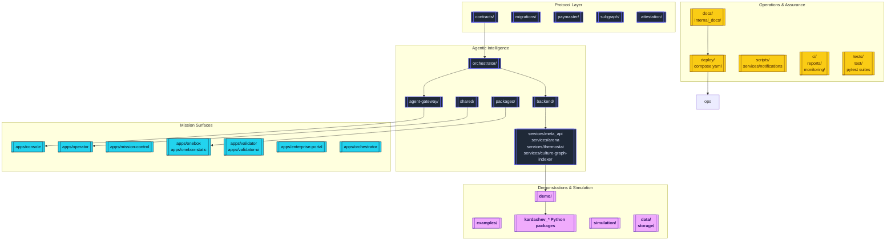
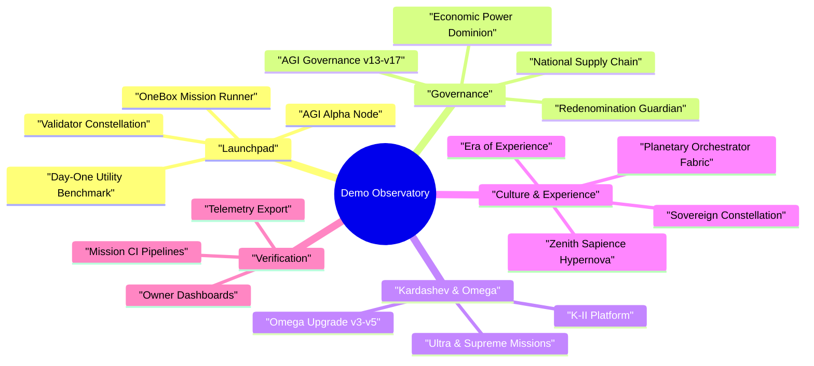

# AGIJobsv0

[](LICENSE)
[](https://github.com/MontrealAI/AGIJobsv0/actions/workflows/ci.yml)
[](https://github.com/MontrealAI/AGIJobsv0/actions/workflows/ci.yml?query=branch%3Amain+workflow%3A%22ci+%28v2%29%22)

AGIJobsv0 is the production reference stack for the AGI Jobs protocol: upgradeable Ethereum contracts, agent swarms, validator and owner consoles, mission-control services, and an expansive constellation of demos that choreograph sovereign labour markets from human scale to Kardashev-class civilizations.



## Table of Contents

- [Constellation Overview](#constellation-overview)
- [Repository Topography](#repository-topography)
- [Quickstart](#quickstart)
  - [Prerequisites](#prerequisites)
  - [Dependency Install](#dependency-install)
  - [Manual Bring-Up](#manual-bring-up)
  - [One-Click Compose](#one-click-compose)
- [Demo Observatory](#demo-observatory)
  - [Launchpad & Operations](#launchpad--operations)
  - [Governance & Economics](#governance--economics)
  - [Kardashev & Omega Expeditions](#kardashev--omega-expeditions)
  - [Sovereign Culture & Experience Labs](#sovereign-culture--experience-labs)
  - [Verification Flight Deck](#verification-flight-deck)
- [Quality Gates](#quality-gates)
- [Documentation & Support](#documentation--support)

## Constellation Overview

The monorepo packages the complete AGI Jobs mission stack:

- **Upgradeable protocol layer** — Solidity contracts, paymaster relays, subgraph indexers, and attestation flows under [`contracts/`](contracts/), [`paymaster/`](paymaster/), [`subgraph/`](subgraph/), and [`attestation/`](attestation/).
- **Agent orchestration intelligence** — mission planners, scoring engines, and telemetry routers across [`orchestrator/`](orchestrator/), [`backend/`](backend/), [`agent-gateway/`](agent-gateway/), and FastAPI micro-services in [`services/`](services/).
- **Mission surfaces** — Next.js/React consoles and HUDs in [`apps/`](apps/) backed by reusable SDKs in [`packages/`](packages/) and shared libraries in [`shared/`](shared/).
- **Expeditions and demos** — cinematic launchers inside [`demo/`](demo/), Python mission suites in the root `kardashev_*` packages, and analytics examples in [`examples/`](examples/).
- **Operations and compliance** — deployment blueprints in [`deploy/`](deploy/), [`compose.yaml`](compose.yaml), automation in [`scripts/`](scripts/), monitoring in [`monitoring/`](monitoring/), and comprehensive playbooks under [`docs/`](docs/) and [`internal_docs/`](internal_docs/).



## Repository Topography

| Domain | Key Paths | Highlights |
| --- | --- | --- |
| Protocol & Chain Control | [`contracts/`](contracts/), [`migrations/`](migrations/), [`paymaster/`](paymaster/), [`subgraph/`](subgraph/), [`attestation/`](attestation/) | Foundry & Hardhat workflows, circuit breakers, subgraph mappings, EAS flows. |
| Agent Intelligence | [`orchestrator/`](orchestrator/), [`agent-gateway/`](agent-gateway/), [`backend/`](backend/), [`services/arena`](services/arena), [`services/meta_api`](services/meta_api), [`services/thermostat`](services/thermostat) | Multi-agent planning, FastAPI surfaces, validator APIs, thermal governance. |
| Mission Applications | [`apps/console`](apps/console), [`apps/operator`](apps/operator), [`apps/mission-control`](apps/mission-control), [`apps/onebox`](apps/onebox), [`apps/enterprise-portal`](apps/enterprise-portal), [`apps/validator-ui`](apps/validator-ui) | Operator consoles, validator HUDs, mission orchestration dashboards, OneBox tooling. |
| Shared Tooling | [`packages/`](packages/), [`shared/`](shared/), [`lib/`](lib/), [`tools/`](tools/) | TypeScript SDKs, orchestrator clients, storage adapters, CLI utilities. |
| Demos & Expeditions | [`demo/`](demo/), root `kardashev_*` Python packages, [`examples/`](examples/), [`simulation/`](simulation/) | Narrative missions, Kardashev ascendancy suites, Monte Carlo workloads, telemetry exporters. |
| Operations & Assurance | [`deploy/`](deploy/), [`compose.yaml`](compose.yaml), [`scripts/`](scripts/), [`ci/`](ci/), [`tests/`](tests/), [`reports/`](reports/), [`monitoring/`](monitoring/) | Deployment automation, CI guardrails, SBOMs, coverage, health monitors. |
| Knowledge Base | [`docs/`](docs/), [`internal_docs/`](internal_docs/), [`RUNBOOK.md`](RUNBOOK.md), [`SECURITY.md`](SECURITY.md), [`MIGRATION.md`](MIGRATION.md), [`CHANGELOG.md`](CHANGELOG.md) | Architecture chronicles, operations handbooks, compliance notes, release history. |

## Quickstart

### Prerequisites

- Node.js **20.18.1** (`nvm use` reads [`.nvmrc`](.nvmrc)).
- npm **10.x**.
- Python **3.12+** with `pip`.
- Foundry toolchain (`forge`, `anvil`) and Docker (for compose deployments).

### Dependency Install

```bash
# Node/TypeScript dependencies
npm ci

# Python requirements for services and demos
python -m pip install --upgrade pip
python -m pip install -r requirements-python.txt

# Agent gateway helpers & validator simulators
python -m pip install -r requirements-agent.txt
```

### Manual Bring-Up

```bash
# Compile contracts, generate ABIs, prepare shared TypeScript constants
npm run build

# Terminal 2 — local Anvil chain
anvil --chain-id 31337 --block-time 2

# Terminal 3 — deploy the v2 system to localhost
npx hardhat run --network localhost scripts/v2/deploy.ts

# Terminal 4 — start the core FastAPI mission surface
uvicorn services.meta_api.app.main:create_app --reload --port 8000

# Optional surfaces
npm run agent:gateway        # REST & WebSocket relay for agents
npm run agent:validator      # Validator simulator
npm --prefix apps/console run dev   # Mission console UI
```

Consult [`docs/quick-start.md`](docs/quick-start.md) and [`docs/AGENTIC_QUICKSTART.md`](docs/AGENTIC_QUICKSTART.md) for wallet provisioning, validator keys, and orchestrator alignment drills.

### One-Click Compose

```bash
cp deployment-config/oneclick.env.example deployment-config/oneclick.env
# Edit secrets, RPC URLs, owner wallets

docker compose up --build
```

Exposed endpoints (default):

- `http://localhost:8545` — Anvil testnet
- `http://localhost:8000` — Meta API (FastAPI)
- `http://localhost:8080` — Orchestrator & OneBox APIs
- `http://localhost:8090` — Agent Gateway
- `http://localhost:3000` — Validator UI
- `http://localhost:3001` — Enterprise portal

All compose services read [`deployment-config/oneclick.env`](deployment-config/oneclick.env) for contract addresses, relayers, and telemetry credentials.

## Demo Observatory

The repository ships a deep catalog of cinematic simulations. After installing dependencies, launch them through `npm run demo:*`, bespoke shell scripts, or Python package CLIs. Search for `"demo:"` in [`package.json`](package.json) to discover the full manifest.

### Launchpad & Operations

| Demo | Directory | Launch Command |
| --- | --- | --- |
| AGI Alpha Node v0 | [`demo/AGI-Alpha-Node-v0/`](demo/AGI-Alpha-Node-v0/) | `npm run demo:agi-alpha-node` |
| Validator Constellation v0 | [`demo/Validator-Constellation-v0/`](demo/Validator-Constellation-v0/) | `npm run demo:validator-constellation` |
| OneBox Mission Runner | [`demo/One-Box/`](demo/One-Box/) | `npm run demo:onebox:launch` |
| AGI Jobs Day-One Utility Benchmark | [`demo/AGIJobs-Day-One-Utility-Benchmark/`](demo/AGIJobs-Day-One-Utility-Benchmark/) | `make -C demo/AGIJobs-Day-One-Utility-Benchmark e2e` |
| AGI Labor Market Control Room | [`demo/agi-labor-market-grand-demo/`](demo/agi-labor-market-grand-demo/) | `npm run demo:agi-labor-market:control-room` |

### Governance & Economics

| Demo | Directory | Launch Command |
| --- | --- | --- |
| AGI Governance (alpha v13–v17) | [`demo/agi-governance/`](demo/agi-governance/) | `npm run demo:agi-governance:alpha-v17` (latest) |
| National Supply Chain v0 | [`demo/National-Supply-Chain-v0/`](demo/National-Supply-Chain-v0/) | `npm run demo:national-supply-chain:control-room` |
| Economic Power Dominion | [`demo/Economic-Power-v0/`](demo/Economic-Power-v0/) | `npm run demo:economic-power:dominion` |
| Redenomination Guardian Drill | [`demo/REDENOMINATION/`](demo/REDENOMINATION/) | `npm run demo:redenomination:guardian-drill` |
| Trustless Economic Core | [`demo/Trustless-Economic-Core-v0/`](demo/Trustless-Economic-Core-v0/) | `npm run run:trustless-core` |

### Kardashev & Omega Expeditions

| Expedition | Package | Launch |
| --- | --- | --- |
| Kardashev II Platform Orchestration | [`demo/AGI-Jobs-Platform-at-Kardashev-II-Scale/`](demo/AGI-Jobs-Platform-at-Kardashev-II-Scale/) | `npm run demo:kardashev` |
| Stellar Civilization Lattice | [`demo/AGI-Jobs-Platform-at-Kardashev-II-Scale/stellar-civilization-lattice/`](demo/AGI-Jobs-Platform-at-Kardashev-II-Scale/stellar-civilization-lattice/) | `npm run demo:kardashev-ii-lattice:orchestrate` |
| Omega Upgrade (TypeScript) | [`demo/Kardashev-II Omega-Grade-α-AGI Business-3/`](demo/Kardashev-II%20Omega-Grade-%CE%B1-AGI%20Business-3/) | `npm run demo:kardashev-ii-omega-upgrade` |
| Omega Upgrade (Python v3/v4/v5) | [`kardashev_ii_omega_grade_upgrade_for_alpha_agi_business_3_demo_v*`](kardashev_ii_omega_grade_upgrade_for_alpha_agi_business_3_demo_v5/) | `npm run demo:kardashev-ii-omega-upgrade-v5` (latest) |
| Omega Ultra & Supreme Campaigns | [`demo/kardashev_ii_omega_grade_alpha_agi_business_3_demo_ultra/`](demo/kardashev_ii_omega_grade_alpha_agi_business_3_demo_ultra/) & [`demo/kardashev_ii_omega_grade_alpha_agi_business_3_demo_supreme/`](demo/kardashev_ii_omega_grade_alpha_agi_business_3_demo_supreme/) | `npm run demo:kardashev-ii-omega-ultra` / `python -m demo.kardashev_ii_omega_grade_alpha_agi_business_3_demo_supreme launch` |
| Omega K2 & Omega-III | [`demo/kardashev_ii_omega_grade_alpha_agi_business_3_demo_k2/`](demo/kardashev_ii_omega_grade_alpha_agi_business_3_demo_k2/) & [`demo/kardashev_ii_omega_grade_alpha_agi_business_3_demo_omega/`](demo/kardashev_ii_omega_grade_alpha_agi_business_3_demo_omega/) | `npm run demo:kardashev-ii-omega-k2` / `npm run demo:kardashev-ii-omega-operator` |

### Sovereign Culture & Experience Labs

| Demo | Directory | Launch Command |
| --- | --- | --- |
| Era of Experience v0 | [`demo/Era-Of-Experience-v0/`](demo/Era-Of-Experience-v0/) | `npm run demo:era-of-experience` |
| Planetary Orchestrator Fabric | [`demo/Planetary-Orchestrator-Fabric-v0/`](demo/Planetary-Orchestrator-Fabric-v0/) | `npm run demo:planetary-orchestrator-fabric` |
| Sovereign Constellation Atlas | [`demo/sovereign-constellation/`](demo/sovereign-constellation/) | `npm run demo:sovereign-constellation:atlas` |
| Zenith Sapience Hypernova | [`demo/zenith-sapience-initiative-supra-sovereign-hypernova-governance/`](demo/zenith-sapience-initiative-supra-sovereign-hypernova-governance/) | `npm run demo:zenith-hypernova:local` |
| Omni Sovereign Ascension OS | [`demo/omni-sovereign-ascension-operating-system/`](demo/omni-sovereign-ascension-operating-system/) | `npm run demo:omni-sovereign` |
| ASI Global & Take-Off Missions | [`demo/asi-global/`](demo/asi-global/) & [`demo/asi-takeoff/`](demo/asi-takeoff/) | `npm run demo:asi-global:local` / `npm run demo:asi-takeoff:local` |

### Verification Flight Deck

Mission suites expose audit, CI, and operator consoles:

```bash
# TypeScript demo validation
npm run test:agi-alpha-node
npm run test:validator-constellation
npm run test:economic-power
npm run test:era-of-experience

# Python/Kardashev CI
python -m demo.kardashev_ii_omega_grade_alpha_agi_business_3_demo_ultra ci --config demo/'Kardashev-II Omega-Grade-α-AGI Business-3'/kardashev_ii_omega_grade_alpha_agi_business_3_demo_ultra/config/mission.json
python -m kardashev_ii_omega_grade_upgrade_for_alpha_agi_business_3_demo_v5.cli ci
```

Many demo directories embed additional pytest or node test suites (for example [`demo/Huxley-Godel-Machine-v0/tests/`](demo/Huxley-Godel-Machine-v0/tests/) and [`tests/demo/`](tests/demo/)). Owner dashboards, export scripts, and telemetry sinks are available through the `owner:*`, `verify:*`, and `*:*:ci` scripts in [`package.json`](package.json).

## Quality Gates

Before submitting a pull request, mirror the CI guardrails:

```bash
# Contracts & generated bindings
npm run compile

# TypeScript linting and tests
npm run lint
npm run test

# Front-end smoke tests & accessibility
npm run pretest

# Python unit and integration coverage
COVERAGE_FILE=.coverage.unit coverage run --rcfile=.coveragerc -m pytest \
  test/paymaster \
  test/tools \
  test/orchestrator \
  test/simulation
COVERAGE_FILE=.coverage.unit coverage run --rcfile=.coveragerc --append -m pytest tests
# Append demo-specific coverage runs as needed (e.g. demo/Huxley-Godel-Machine-v0/tests)
COVERAGE_FILE=.coverage.integration coverage run --rcfile=.coveragerc -m pytest \
  test/routes/test_agents.py \
  test/routes/test_analytics.py \
  test/routes/test_onebox_health.py \
  test/demo \
  demo/Meta-Agentic-Program-Synthesis-v0/meta_agentic_demo/tests

coverage combine .coverage.unit .coverage.integration
coverage report --rcfile=.coveragerc

# End-to-end web coverage
npm run webapp:e2e

# Foundry fuzzing
(cd contracts && forge test)
```

## Documentation & Support

- **Architecture & systems:** [`docs/overview.md`](docs/overview.md), [`docs/architecture-v2.md`](docs/architecture-v2.md).
- **Deployment operations:** [`docs/v2-deployment-and-operations.md`](docs/v2-deployment-and-operations.md), [`docs/deployment-production-guide.md`](docs/deployment-production-guide.md), [`docs/DEPLOYED_ADDRESSES.md`](docs/DEPLOYED_ADDRESSES.md).
- **Owner & validator playbooks:** [`docs/owner-control-handbook.md`](docs/owner-control-handbook.md) plus the `docs/owner-control-*.md` companions.
- **OneBox & mission UX:** [`docs/onebox/`](docs/onebox/), [`docs/onebox-ux.md`](docs/onebox-ux.md).
- **Agent gateway & examples:** [`docs/agent-gateway.md`](docs/agent-gateway.md), [`examples/agentic/`](examples/agentic/).
- **Security, runbooks & change history:** [`SECURITY.md`](SECURITY.md), [`RUNBOOK.md`](RUNBOOK.md), [`CHANGELOG.md`](CHANGELOG.md), [`MIGRATION.md`](MIGRATION.md).

For responsible disclosure see [`SECURITY.md`](SECURITY.md). Operational escalations follow the paths in [`RUNBOOK.md`](RUNBOOK.md). The project is released under the [MIT License](LICENSE).
