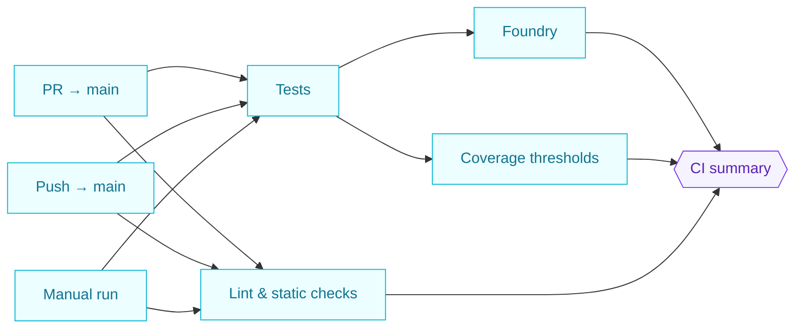
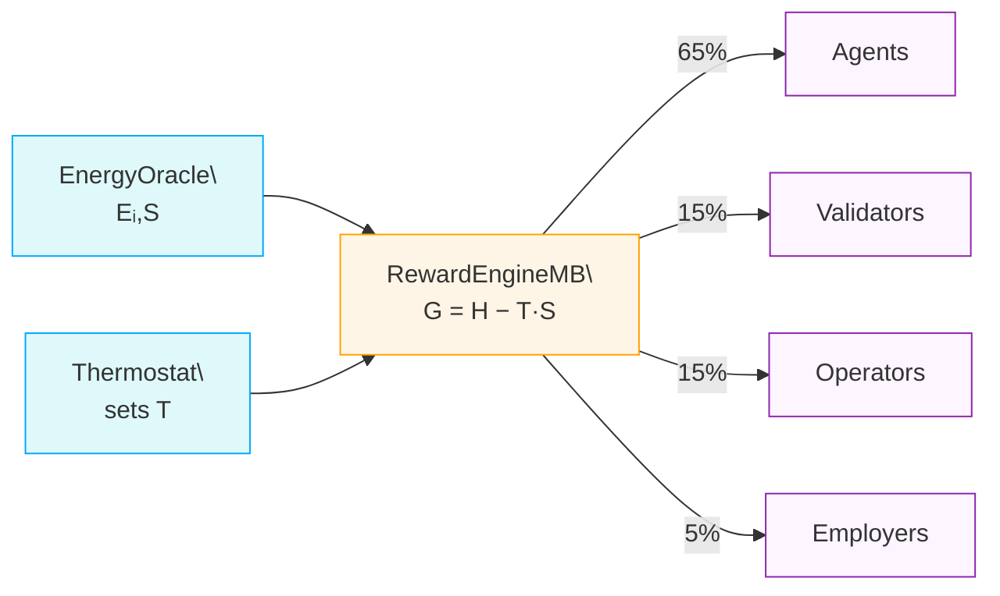
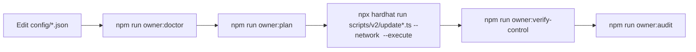
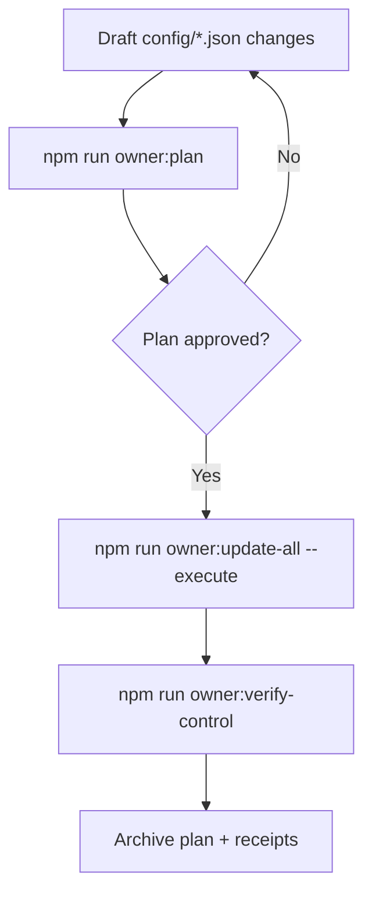
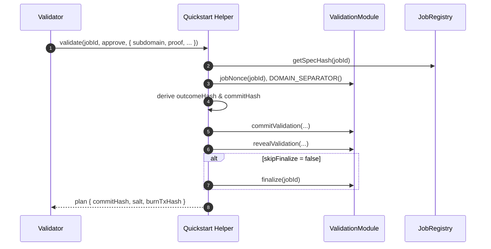

# AGIJob Manager

[](LICENSE)
[](https://github.com/MontrealAI/AGIJobsv0/actions/workflows/ci.yml)

AGIJob Manager is an experimental suite of Ethereum smart contracts and tooling for coordinating trustless labour markets among autonomous agents. The **v2** release under `contracts/v2` is the only supported version. Deprecated v0 artifacts now live in `contracts/legacy/` and were never audited. For help migrating older deployments, see [docs/migration-guide.md](docs/migration-guide.md).

> **ENS identity required:** Before participating, each agent or validator must control an ENS subdomain. Agents use `<name>.agent.agi.eth` and validators use `<name>.club.agi.eth`. Follow the [ENS identity setup guide](docs/ens-identity-setup.md) to register and configure your name.

All modules now assume the 18‑decimal `$AGIALPHA` token for payments, stakes and dispute deposits with the token address fixed at deployment. The canonical token is deployed externally; this repository ships [`contracts/test/AGIALPHAToken.sol`](contracts/test/AGIALPHAToken.sol) for local testing only. Token address and decimal configuration live in [`config/agialpha.json`](config/agialpha.json) and feed both Solidity and TypeScript consumers.

## Prerequisites

- Node.js 20.18.1 LTS and npm 10+
- Run `nvm use` to select the version from `.nvmrc`.

## Continuous Integration (CI v2)

The `ci (v2)` GitHub Actions workflow enforces quality gates on every pull request and on the `main` branch. The pipeline fan-out mirrors how operators review production releases:

- **Lint & static checks** – runs Prettier, ESLint and Solhint with production-safe rules to guarantee formatting and Solidity hygiene.
- **Tests** – compiles contracts, regenerates shared constants, and executes the full Hardhat suite together with ABI drift detection.
- **Foundry** – reuses the generated constants, installs Foundry with a warm cache, and executes high signal fuzz tests.
- **Coverage thresholds** – regenerates constants, recomputes coverage, enforces the 90% minimum, and uploads the LCOV artifact.
- **Summary gate** – publishes a human-readable status table and fails the workflow if any upstream job is unsuccessful, giving non-technical reviewers a single green/red indicator.



Branch protection can now point at the `CI summary` check so that every job listed above must succeed before merges or deployments proceed. A non-technical maintainer can follow the [CI v2 operations guide](docs/v2-ci-operations.md) for a diagrammed overview of the workflow, required status checks, and day-to-day troubleshooting steps.

### Branch protection self-test

Keep the enforcement proof close at hand by running a quick audit whenever GitHub updates workflow metadata or a new maintainer joins the project:

1. Visit **Settings → Branches → Branch protection rules → main** and confirm the five required contexts match the workflow job names exactly: `ci (v2) / Lint & static checks`, `ci (v2) / Tests`, `ci (v2) / Foundry`, `ci (v2) / Coverage thresholds`, and `ci (v2) / CI summary`. The names must stay in lockstep with the [`ci.yml` job definitions](.github/workflows/ci.yml).
2. From the terminal, run `npm run ci:verify-branch-protection` (set `GITHUB_TOKEN` with `repo` scope first). The script prints a ✅/❌ table showing whether the contexts, ordering, and admin enforcement match the CI v2 contract. The command auto-detects the repository from `GITHUB_REPOSITORY` or the local git remote, and accepts `--owner`, `--repo`, and `--branch` overrides when auditing forks.
3. If you prefer GitHub CLI, run `gh api repos/:owner/:repo/branches/main/protection --jq '{required_status_checks: .required_status_checks.contexts}'` and verify the output lists the same five contexts in order. Repeat with `gh api repos/:owner/:repo/branches/main/protection --jq '.enforce_admins.enabled'` to ensure administrators cannot bypass the checks.
4. Open the latest **ci (v2)** run under **Actions** and confirm the `CI summary` job reports every upstream result. The summary gate must remain required in branch protection so non-technical reviewers see a single ✅/❌ indicator.

For a printable walkthrough (including remediation steps when a context drifts), use the [CI v2 branch protection checklist](docs/ci-v2-branch-protection-checklist.md).

## Table of Contents

- [Identity policy](#identity-policy)
- [AGIALPHA configuration](#agialpha-configuration)
- [Fee handling and treasury](#fee-handling-and-treasury)
- [Thermodynamic Incentives](#thermodynamic-incentives)
- [Deploy defaults](#deploy-defaults)
- [One-Click Deployment](#one-click-deployment)
- [Mainnet Deployment](#mainnet-deployment)
- [Migrating from legacy](#migrating-from-legacy)
- [Quick Start](#quick-start)
- [Deployed Addresses](#deployed-addresses)
- [Step‑by‑Step Deployment with $AGIALPHA](#step-by-step-deployment-with-agialpha)
- [Agent/Validator Identity – ENS subdomain registration](#agentvalidator-identity--ens-subdomain-registration)
- [Documentation](#documentation)
- [One-Box UX](#one-box-ux)
- [Owner control surface snapshot](#owner-control-surface-snapshot)
- [Owner control verification](#owner-control-verification)
- [Owner control playbook](#owner-control-playbook)
- [Owner control blueprint](#owner-control-blueprint)
- [Owner control command center](#owner-control-command-center)
- [Owner control authority reference](#owner-control-authority-reference)
- [Owner control index](#owner-control-index)
- [Owner control doctor](#owner-control-doctor)
- [Owner control audit](#owner-control-audit)
- [Audit dossier export](#audit-dossier-export)
- [Owner control systems map](#owner-control-systems-map)
- [Owner control quick reference CLI](#owner-control-quick-reference-cli)
- [Owner control snapshot kit](#owner-control-snapshot-kit)
- [Owner control pulse](#owner-control-pulse)
- [Owner control master checklist](#owner-control-master-checklist)
- [Owner control atlas](#owner-control-atlas)
- [Owner control change ticket](#owner-control-change-ticket)
- [Owner update plan kit](#owner-update-plan-kit)
- [Owner control non-technical guide](#owner-control-non-technical-guide)
- [Owner control zero-downtime guide](#owner-control-zero-downtime-guide)
- [Owner control emergency runbook](#owner-control-emergency-runbook)
- [Owner control handbook](#owner-control-handbook)
- [Owner control configuration template](#owner-control-configuration-template)
- [Owner mission control](#owner-mission-control)
- [Owner control visual guide](#owner-control-visual-guide)
- [Owner parameter matrix](#owner-parameter-matrix)
- [Owner control parameter playbook](#owner-control-parameter-playbook)
- [Production launch blueprint](#production-launch-blueprint)
- [Production readiness index](docs/production/deployment-readiness-index.md)
- [ASI feasibility crosswalk](docs/asi-feasibility-crosswalk.md)
- [ASI feasibility production checklist](docs/asi-feasibility-production-checklist.md)
- [ASI feasibility verification suite](docs/asi-feasibility-verification-suite.md)
- [Operating system grand demonstration](docs/agi-os-grand-demo.md)
- [Astral Omnidominion operating system demo](docs/agi-os-first-class-demo.md)
- [Meta-Agentic α-AGI platform demonstration](docs/meta-agentic-alpha-agi-demo.md)
- [REDENOMINATION readiness matrix](docs/redenomination-readiness-matrix.md)

### Identity policy

Agents and validators must own ENS subdomains under `agent.agi.eth` and `club.agi.eth`. Owners of `*.alpha.agent.agi.eth` and `*.alpha.club.agi.eth` subdomains enjoy identical permissions—the `IdentityRegistry` treats those aliases as equivalent roots. All workflows perform on-chain verification and bypass mechanisms are reserved for emergency governance only. See [docs/ens-identity-policy.md](docs/ens-identity-policy.md) for details.

> **Sync configuration fast:** Use `npm run identity:update -- --network <network>` to compare the on-chain `IdentityRegistry` state against `config/identity-registry.<network>.json`. The helper adds the `alpha.agent.agi.eth` and `alpha.club.agi.eth` aliases automatically and prints any required updates before executing changes.

> **Emergency allowlists:** The `IdentityRegistry` owner can directly whitelist addresses using `addAdditionalAgent` or `addAdditionalValidator`. These overrides bypass ENS proofs and should only be used to recover from deployment errors or other emergencies.

### AGIALPHA configuration

Token parameters are defined once in [`config/agialpha.json`](config/agialpha.json). Run `npm run compile` after editing this file to regenerate `contracts/v2/Constants.sol` with the canonical token address, symbol, name, decimals, scaling factor and burn address. Any change to `config/agialpha.json` must be followed by `npm run compile` or the constants check in CI will fail. See the non-technical [Token Operations Control Guide](docs/token-operations.md) for a checklist, Mermaid diagrams and a zero-downtime rollout plan.

`npm run compile` validates the configured addresses, ERC‑20 metadata and decimals before writing the Solidity constants. The command halts if the token or burn addresses are malformed, zero (where disallowed), the symbol/name fields are empty or the decimals fall outside the supported `0-255` range, preventing a bad configuration from reaching production contracts.

Run `npm run verify:agialpha -- --rpc <https-url-or-ws-url>` after deployments to cross-check `config/agialpha.json` and `contracts/v2/Constants.sol` against the live `$AGIALPHA` token metadata. The script aborts if the on-chain decimals, symbol or name differ from the committed configuration. Set `VERIFY_RPC_URL` (or `RPC_URL`) to avoid passing `--rpc` on every invocation; use `--timeout <ms>` to override the default 15 s RPC timeout.

### Fee handling and treasury

`JobRegistry` routes protocol fees to `FeePool`, which burns a configurable percentage (`burnPct`) when an employer finalizes a job and escrows the remainder for platform stakers. By default the `treasury` is unset (`address(0)`), so any rounding dust is burned. Governance may later call `StakeManager.setTreasury`, `JobRegistry.setTreasury`, or `FeePool.setTreasury` to direct funds to a community-controlled treasury. These setters reject the owner address and, for `FeePool`, require the target to be pre-approved via `setTreasuryAllowlist`. The platform only routes funds and never initiates or profits from burns.

### Thermodynamic Incentives

`RewardEngineMB` meters task energy against a global free‑energy budget. The `EnergyOracle` reports per‑task energy `Eᵢ` and entropy `S`, while the `Thermostat` sets the system temperature `T` that scales reward spread. Using the Gibbs relation `G = H − T·S`, the engine increases rewards for low‑energy work and adjusts role‑level chemical potentials (μᵣ) to maintain balance.

Higher `T` amplifies the entropy term, spreading rewards across more participants; lower `T` concentrates payouts on the most energy‑efficient contributors. Each epoch the free‑energy budget divides **65 %** to agents, **15 %** to validators, **15 %** to operators and **5 %** to employers. See [docs/reward-settlement-process.md](docs/reward-settlement-process.md) for a full walkthrough and [docs/thermodynamic-incentives.md](docs/thermodynamic-incentives.md) for derivations.

Governance can rebalance these weights or retune the PID controller by editing [`config/thermodynamics.json`](config/thermodynamics.json) (or per-network overrides) and running [`scripts/v2/updateThermodynamics.ts`](scripts/v2/updateThermodynamics.ts). The full workflow is described in [docs/thermodynamics-operations.md](docs/thermodynamics-operations.md).

**Role shares per epoch**

- Agents – 65 %
- Validators – 15 %
- Operators – 15 %
- Employers – 5 %



#### Best Practices

- **Agents** – Optimise code and workflows to minimise measured energy per task; consistent low energy boosts rewards and reputation.
- **Validators** – Use efficient validation routines and cache common checks to lower entropy in votes, increasing payout weight.
- **Employers** – Design jobs with clear requirements so agents expend minimal energy on speculation or rework, improving overall budget share.
- **Operators** – Maintain energy‑efficient, highly available infrastructure and publish transparent metrics so the oracle can measure consumption accurately.

### Hamiltonian monitor upkeep

Governance can now retune the `HamiltonianMonitor` without redeploying. Update [`config/hamiltonian-monitor.json`](config/hamiltonian-monitor.json) with the desired window size and any observations to append, then preview the required transactions:

```bash
npx hardhat run scripts/v2/updateHamiltonianMonitor.ts --network <network>
```

Pass `--execute` once the dry run looks correct to submit the queued actions. Use `resetHistory: true` in the config to wipe accumulated observations and start fresh—either on its own or combined with a window change. The helper automatically skips recording duplicate observations if they already match the most recent on-chain history.

> **Observe thermodynamics live:** Generate human, Markdown, CSV or JSON Hamiltonian reports with \`npm run hamiltonian:report\`. The script computes aggregate H/G stats, normalises budgets into token units, and can append block timestamps for compliance artefacts. See [docs/hamiltonian-monitor.md](docs/hamiltonian-monitor.md) for full examples.

### Energy oracle signer management

Governance controls which off-chain measurement nodes can sign energy attestations. Update [`config/energy-oracle.json`](config/energy-oracle.json) (or its per-network override) with the authorised signer list. Run the helper to review the planned changes and, once satisfied, apply them on-chain. The [Energy Oracle Operations Guide](docs/energy-oracle-operations.md) covers signer due diligence, quorum rotations and verification workflows with step-by-step diagrams:

```bash
npx hardhat run scripts/v2/updateEnergyOracle.ts --network <network>
```

Pass `--execute` to submit the transactions from the governance signer or timelock. The helper prints the existing signer set, highlights additions and removals, and supports `--json` for automation workflows. By default it keeps currently authorised signers that are not listed in the configuration; add `"retainUnknown": false` to prune any stale entries automatically.

### Deploy defaults

Spin up the full stack with a single helper script:

```bash
npx hardhat run scripts/v2/deployDefaults.ts --network <network> --governance <address>
```

Provide `--governance` to assign a multisig or timelock owner. Include `--no-tax` to skip deploying `TaxPolicy`.

### System pause maintenance

`SystemPause.setModules` now validates that every module has already transferred ownership or governance to the pause contract before it rewires addresses. This prevents accidentally wiring in contracts that cannot be paused during an emergency. When swapping modules, transfer ownership to the deployed `SystemPause` address first, then run the helper script:

```bash
npx hardhat run scripts/v2/updateSystemPause.ts --network <network>
```

The script performs a dry run by default, reporting any address, ownership or pauser mismatches. Re-run with `--execute` once all modules report `owner == SystemPause` to apply the wiring transaction safely.

### Governance & ownership rotation

Keep a single source of truth for governance and ownership targets in [`config/owner-control.json`](config/owner-control.json). Populate the `governance` (timelock or multisig) and `owner` defaults, then override individual modules as required. The helper supports `governable`, `ownable` and `ownable2step` contracts and can emit a Gnosis Safe transaction bundle for non-technical operators.

```bash
# Preview pending updates
npm run owner:rotate -- --network <network>

# Emit a Safe bundle and execute changes once the plan looks correct
npm run owner:rotate -- --network <network> \
  --safe owner-rotation.json \
  --safe-name "AGIJobs Governance Rotation" \
  --execute
```

The script validates deployed bytecode, highlights modules missing configuration, and warns if any `Ownable2Step` contract still requires `acceptOwnership()` by the new controller. Safe bundles include typed inputs for inspection inside the transaction builder UI.

### Unified owner parameter updates

For day-to-day parameter maintenance run the consolidated helper, which loads every module configuration and builds a single execution plan:

```bash
# Preview all module changes defined in config/*.json
npm run owner:update-all -- --network <network>

# Limit the run to a subset or skip noisy modules
npm run owner:update-all -- --network <network> --only=stakeManager,feePool
npm run owner:update-all -- --network <network> --skip=energyOracle

# Emit machine-readable output for Gnosis Safe or change-control pipelines
npm run owner:update-all -- --network <network> --json > owner-plan.json

# Generate a ready-to-upload Gnosis Safe bundle during the dry run
npm run owner:update-all -- --network <network> \
  --safe reports/<network>-owner-update.json \
  --safe-name "AGIJobs Owner Update" \
  --safe-desc "Dry-run bundle generated by owner:update-all"

# Submit transactions once the dry run looks correct
npm run owner:update-all -- --network <network> --execute
```

The script resolves contract addresses from `config/*.json`, `.env` overrides and `config/agialpha.json`, verifies signer ownership and prints calldata for every proposed change. When invoked with `--execute`, each module action is submitted sequentially so a non-technical operator can review the dry-run output and immediately replay it against production. Optional `--only`/`--skip` filters make it easy to scope updates to specific subsystems without editing configuration files. Append `--safe` to emit a fully typed Gnosis Safe bundle; set `OWNER_UPDATE_ALL_SAFE_OUT`, `OWNER_UPDATE_ALL_SAFE_NAME`, and `OWNER_UPDATE_ALL_SAFE_DESCRIPTION` in the environment to keep filenames and metadata consistent across automation runs.

### Owner control surface snapshot

Before touching production, render the offline control surface to confirm every module has a defined owner, governance target,
and healthy configuration file:

```bash
npm run owner:surface -- --network <network>

# Generate Markdown or JSON artefacts for change control
npm run owner:surface -- --network <network> --format markdown > owner-surface.md
npm run owner:surface -- --network <network> --json --out owner-surface.json
```

The report cross-references `config/agialpha.json`, `config/owner-control.json`, and the per-module JSON files, computing SHA-256 hashes so operators can attach tamper-evident artefacts to governance records. Consult the [Owner Control Surface report](docs/owner-control-surface.md) for illustrated guidance and interpretation tips.

### Owner control verification

Confirm production ownership before executing sensitive changes. The verifier cross-references [`config/owner-control.json`](config/owner-control.json), environment overrides and [`docs/deployment-addresses.json`](docs/deployment-addresses.json) against live contract state, highlighting drift and pending `Ownable2Step` acceptances.

```bash
# Human-readable report
npm run owner:verify-control -- --network <network>

# Machine-readable output with strict failure when ownership mismatches
npm run owner:verify-control -- --network <network> --json --strict > owner-control-report.json
```

Provide per-module addresses via `modules.<name>.address`, the `AGJ_<NAME>_ADDRESS` environment variable, or `--address name=0x…` at runtime. Use `--modules`/`--skip` to scope checks and `--address-book` to point at alternative deployment records. The command exits non-zero when `--strict` is enabled and any contract lacks the expected governance, keeping change-control pipelines safe for non-technical operators. For a step-by-step evidence workflow (including JSON export patterns, module scope tips, and troubleshooting), see the [Owner Control Verification Guide](docs/owner-control-verification.md).

### Owner control playbook

Operators who prefer a narrative, non-technical runbook can follow the [Owner Control Playbook](docs/owner-control-playbook.md). It packages the multi-module configuration workflow into illustrated checklists, Mermaid diagrams, and decision tables that walk through editing `config/*.json`, generating Safe bundles, executing transactions, and verifying the final state. The playbook also documents rollback paths, health monitoring commands, and operational safeguards so the contract owner keeps full, auditable control over every tunable parameter without touching Solidity internals.

### Owner control blueprint

Change managers who need a single-page, production-ready operating model can use the [Owner Control Blueprint](docs/owner-control-blueprint.md). It maps each configurable subsystem to its JSON file, editing helper, execution script, and verification check, then layers in multiple Mermaid diagrams, emergency hotfix checklists, and governance artefact templates. Generate the latest values directly from `config/*.json` with `npm run owner:blueprint -- --network <network>` (add `--out reports/<network>-blueprint.md` for archival Markdown or `--format json` for automation pipelines). The blueprint emphasises repeatable workflows for non-technical operators and highlights mandatory guard rails (`owner:update-all` dry runs, Safe bundles, `owner:verify-control`, and `owner:dashboard`) so updates remain safe, auditable, and reversible even during high-pressure incidents.

### Owner control command center

Need a single, visualised briefing before making governance changes? The new [Owner Command Center](docs/owner-control-command-center.md) combines Mermaid journey maps, validation matrices, and step-by-step scenario playbooks so a non-technical contract owner can stage, approve, execute, and verify any parameter update with complete confidence. Pair it with `npm run owner:surface` for a baseline snapshot, then follow the mission map checklists to close the loop from diff preview to post-change artefacts. Operators who prefer a live, auto-generated digest can now run:

```bash
npm run owner:command-center -- --network <network>

# Export Markdown with diagrams for change tickets
npm run owner:command-center -- --network mainnet --format markdown --out reports/mainnet-command-center.md
```

The CLI cross-loads every governance configuration, highlights editable knobs (burn ratios, treasuries, PID gains, signer sets, tax policy text, and more), and renders an optional Mermaid flow linking governance owners to each subsystem. It is safe to run before every change window, requires no Solidity knowledge, and produces artefacts that non-technical reviewers can file directly into compliance workflows.

### Owner control authority reference

Avoid guessing which contract exposes a particular setter by consulting the [Owner Control Authority Reference](docs/owner-control-authority-reference.md). The table maps each subsystem to its access modifier, config manifest, OwnerConfigurator command, and live Solidity source so you always know which Safe bundle to execute. The guide also explains how to regenerate the matrix with `npm run owner:parameters` and how CI’s ABI drift checks keep the documentation synchronized with the contracts.【F:docs/owner-control-authority-reference.md†L1-L36】【F:docs/owner-control-authority-reference.md†L38-L61】

### Owner control index

The [Owner Control Index](docs/owner-control-index.md) consolidates every editable parameter, config manifest, and CLI helper into a single flight deck so contract owners can retune the platform without hunting through multiple guides. It layers a zero-downtime workflow, Mermaid diagrams, tables, and hardened checklists on top of the existing toolchain.



- **One-stop catalogue.** Scan a domain-to-config table that links every subsystem (thermodynamics, tax policy, signer sets, treasury routing, pause wiring, etc.) to the exact JSON manifest, update helper, and verification command.
- **Production-safe workflow.** Follow the zero-downtime checklist covering `owner:surface`, `owner:doctor`, `owner:plan`, Safe bundle export, execution, and post-change verification.
- **Visual orientation.** Reuse the included Mermaid flight-deck and mind-map diagrams inside executive briefings or change tickets.
- **Full-stack dry runs.** Kick off `npm run owner:update-all -- --network <network>` to simulate the entire update suite before enabling `--execute` on the specific modules you intend to change.

Link the index directly from compliance tickets so approvers see the latest guidance without needing Solidity expertise.

### Owner control operations playbook

Looking for a single document that unifies configuration entry points, execution commands, verification steps, and recovery flows? The [Owner Control Operations Playbook](docs/owner-control-operations.md) packages the entire governance control surface into layered Mermaid diagrams, rapid-change checklists, and failure-recovery matrices. It summarises which JSON manifests back each subsystem, how to dry-run and execute the corresponding Hardhat helpers, and how to archive evidence for compliance teams—all tuned for non-technical operators running production-critical environments.

### Owner control doctor

Before broadcasting any change, run the automated readiness sweep to surface missing addresses, invalid reward splits and unassigned guardians:

```bash
npm run owner:doctor -- --network <network>
```

Use `--strict` to fail on warnings inside CI and `--json` to feed dashboards or alerting bots. The command emits a severity-sorted punch list (with copy/paste remediation steps) so a non-technical operator can fix the highlighted configuration issues, rerun the doctor, and only proceed once the report is fully green. Full guidance, diagrams and automation patterns live in [docs/owner-control-doctor.md](docs/owner-control-doctor.md).

### Owner control audit

Need a cryptographically hashed, compliance-ready snapshot before executing owner transactions? Run the audit helper:

```bash
npm run owner:audit -- --network <network> --out reports/<network>-owner-audit.md
```

The CLI loads every module loader used by `owner:update-all`, verifies the JSON manifests parse cleanly, records SHA-256 hashes for `config/agialpha*.json` and `config/owner-control*.json`, and prints a table of owner/governance/token targets with ✅/⚠️/❌ statuses. Each row links to the dedicated Hardhat helper and the relevant operations handbook so the contract owner can adjust parameters without touching Solidity. The Markdown output embeds Mermaid diagrams, actionable remediation notes and copy/paste commands, while `--format human` and `--format json` support chat summaries and automation pipelines respectively. Full usage guidance lives in [docs/owner-control-audit.md](docs/owner-control-audit.md).

### Audit dossier export

Preparing for an external security review? Generate the complete verifier package mirrored by the CI v2 workflow with a single command:

```bash
npm run audit:dossier
```

The helper wraps linting, unit tests, coverage, dependency audits, ABI diffing, owner-control validation, and optional Foundry/Slither checks into timestamped logs under `reports/audit`. Trigger it as part of the end-to-end readiness sweep with `npm run audit:final -- --full` when you want the freeze guard, branch-protection verifier, and dossier export chained together for non-technical operators.【F:scripts/audit/final-readiness.ts†L1-L214】【F:docs/AUDIT_DOSSIER.md†L1-L120】 The process is documented in [docs/AUDIT_DOSSIER.md](docs/AUDIT_DOSSIER.md) so auditors receive a deterministic bundle of artefacts alongside reproducible commands.

### Owner control systems map

Need an executive-level orientation that connects business intent to every governance lever? The [Owner Control Systems Map](docs/owner-control-systems-map.md) stitches together a topology of owners → JSON configs → CLI tooling → on-chain modules, a sequenced execution checklist, and a parameter reference so you can retune the platform without touching Solidity. Use it when onboarding new decision-makers or preparing production runbooks that demand visual context, command palettes, and non-technical drills in a single, shareable document.

### Owner control quick reference CLI

Need a single command that fuses governance defaults, token wiring, stake economics, reward thermodynamics and signer rosters into an auditor-ready brief? Run the quickstart helper:

```bash
# Human-readable console digest with Mermaid diagram
npm run owner:quickstart -- --network <network>

# Markdown artefact for change tickets or Safe bundles
npm run owner:quickstart -- --network mainnet --format markdown --out reports/mainnet-owner-quickstart.md

# Machine-friendly JSON for CI enforcement or dashboards
npm run owner:quickstart -- --network mainnet --format json --out reports/mainnet-owner-quickstart.json
```

The CLI stitches together `config/owner-control.json`, `config/agialpha*.json`, `config/stake-manager.json`, `config/fee-pool.json`, `config/reward-engine.json`, `config/thermodynamics.json`, `config/hamiltonian-monitor.json` and `config/energy-oracle.json`, then prints a deterministic operational checklist that mirrors the `owner:update-all` workflow. Full usage guidance—including troubleshooting tables, Mermaid diagrams and automation tips—lives in [docs/owner-control-quick-reference-cli.md](docs/owner-control-quick-reference-cli.md).

### Owner control snapshot kit

Need a zero-friction dossier that proves every adjustable parameter, the exact JSON used, and the commands to retune them? Generate the snapshot kit:

```bash
npm run owner:snapshot -- --network <network>

# Optional: direct output to a custom folder and skip Mermaid diagrams
npm run owner:snapshot -- --network mainnet --out reports/mainnet/control-kit --no-mermaid
```

The helper copies every owner-governed config into `reports/<network>/owner-control-snapshot-<timestamp>/`, computes SHA-256 hashes for tamper evidence, and writes a Markdown briefing that cross-links remediation guides. Each subsystem section embeds Mermaid diagrams, update/verify command palettes and flattened parameter tables so non-technical reviewers can approve changes without opening Solidity. A machine-readable `manifest.json` summarises source paths, hashes and regeneration commands for CI or Safe pipelines. Extended examples, approval checklists, and integration ideas live in [docs/owner-control-snapshot-kit.md](docs/owner-control-snapshot-kit.md) (with additional context in [docs/owner-control-snapshot.md](docs/owner-control-snapshot.md)).

### Owner control pulse

Need an at-a-glance health score before approving a governance rotation or signing a Safe batch? The pulse helper wraps `verifyOwnerControl` into a colour-graded dashboard that non-technical owners can run in under a minute:

```bash
# Interactive terminal dashboard with JSON snapshot footer
npm run owner:pulse -- --network <network>

# Markdown artefact for change tickets or executive briefings
OWNER_PULSE_FORMAT=markdown OWNER_PULSE_OUT=reports/mainnet-owner-pulse.md \
  npm run owner:pulse -- --network mainnet

# JSON-only output for bots, monitors or spreadsheets
OWNER_PULSE_FORMAT=json OWNER_PULSE_OUT=reports/mainnet-owner-pulse.json \
  npm run owner:pulse -- --network mainnet
```

> **Note:** Hardhat consumes unknown flags before the script runs. Use the
> `OWNER_PULSE_*` environment variables when running via `npm run owner:pulse` or
> invoke Hardhat directly with a trailing `--` to pass custom flags.

The command scores every module, highlights mismatches, missing addresses and pending acceptOwnership calls, and emits both human-friendly and machine-readable summaries. Use the Markdown export to drop a Mermaid systems snapshot into a war-room deck, or pipe the JSON payload into monitoring dashboards to catch regressions automatically. Full illustrations, diagrams and workflow guidance live in [docs/owner-control-pulse.md](docs/owner-control-pulse.md).

### Owner control master checklist

Need a one-stop, checkbox-driven procedure that keeps governance, execution and verification perfectly aligned? The [Owner Control Master Checklist](docs/owner-control-master-checklist.md) distils every prerequisite, command and artefact into a production-ready worksheet. It layers Mermaid mind maps, flowcharts, sequences and Gantt timelines with copy/paste command snippets so non-technical owners can capture baselines, run the wizard, dry-run updates, execute `owner:update-all`, verify the system and archive artefacts without skipping a step. Print it for war rooms or attach the Markdown file to change tickets so auditors can confirm every control lever was handled precisely.

### Owner control atlas

Need a single artefact that fuses the owner envelope, per-module parameters, recommended commands and live health checks? Run the new Atlas generator:

```bash
npm run owner:atlas -- --network <network>
```

Export with `--out reports/<network>-owner-atlas.md` to archive a Markdown briefing, choose `--format human` for a condensed terminal digest, or `--format json` for dashboard integrations. The Atlas automatically lists every module managed by the owner, highlights zero-address treasuries, missing signers and unbalanced reward weights, and embeds a Mermaid topology that maps JSON manifests → Hardhat helpers → deployed contracts. See [docs/owner-control-atlas.md](docs/owner-control-atlas.md) for a fully illustrated walkthrough.

### Owner control change ticket

Need a pre-filled change-management packet that a non-technical owner can hand to governance, compliance and auditors? Generate the new change ticket:

```bash
npm run owner:change-ticket -- --network <network>

# Capture a Markdown artefact for approval workflows
npm run owner:change-ticket -- --network mainnet --format markdown --out reports/mainnet-owner-change-ticket.md

# Produce a JSON payload for bots or CI checks
npm run owner:change-ticket -- --network mainnet --format json --out reports/mainnet-owner-change-ticket.json
```

The helper loads every owner-facing configuration manifest, hashes them with SHA-256, and emits a sequenced stage plan (baseline → plan → execute → verify → archive) alongside module-specific update/verify commands. Each ticket embeds a Mermaid flow, attachment checklist and links to the relevant illustrated handbooks, making it trivial for the contract owner to coordinate Safe signers, document intent and prove that every adjustable parameter stayed under explicit control. Full guidance lives in [docs/owner-control-change-ticket.md](docs/owner-control-change-ticket.md).

### Owner control testnet dry-run harness

Need evidence that the full marketplace lifecycle and emergency controls work before touching a public testnet? Run the rehearsal harness:

```bash
npx hardhat compile
npm run owner:testnet:dry-run -- --network <network>

# Emit JSON for audit artefacts or CI dashboards
npm run owner:testnet:dry-run -- --network <network> --json \
  > reports/<network>-owner-testnet-dry-run.json
```

The script deploys an ephemeral fixture, exercises staking, job creation, delivery, validation and payouts, then provisions a `SystemPause` stack via the canonical on-chain `Deployer`. It records transaction hashes, gas usage, actor addresses and post-condition checks so owners can capture immutable artefacts prior to audit sign-off. Pair the output with `npm run pause:test` to satisfy the External Audit & Final Verification sprint checklist; detailed instructions live in [docs/testnet-dry-run.md](docs/testnet-dry-run.md).

### Owner update plan kit

Pair the change ticket with the [Owner Update Plan Kit](docs/owner-update-plan-kit.md)
to generate the executable dossier before touching production. Run the helper to
produce Markdown, JSON or Safe-bundle artefacts that mirror the exact payload
`owner:update-all` will submit:

```bash
npm run owner:plan -- --network <network> --out \
  reports/<network>/owner-plan-$(date +%Y%m%d%H%M).md

# Optional: build a multisig-ready batch
npm run owner:plan -- --network <network> --safe \
  reports/<network>/owner-plan-safe.json
```



The kit spells out environment flags (`OWNER_PLAN_*`), embeds troubleshooting
checklists, and ships a change-ticket snippet so non-technical operators can
attach the right artefacts automatically.

### Owner control non-technical guide

Need a **no-code**, compliance-ready runbook for production changes? Follow the
[Owner Control Non-Technical Guide](docs/owner-control-non-technical-guide.md).
It distils the wizard, batch-update and verification helpers into a sequenced
workflow with mind-map and sequence-diagram Mermaid illustrations, annotated
commands and receipt capture conventions so a business owner can update
treasuries, reward weights and signer lists safely. Copy/paste the snippets,
commit the generated Markdown/JSON artefacts, and hand the bundle to auditors or
stakeholders without ever touching Solidity.

### Owner control zero-downtime guide

For a production-ready runbook that emphasises audit trails, Safe bundles and rollback planning, follow the [Owner Control Zero-Downtime Guide](docs/owner-control-zero-downtime-guide.md). It layers:

- Pre-flight environment and credential checks so operators never push misconfigured JSON on-chain.
- Mermaid pipeline diagrams that illustrate the closed loop across `owner:surface`, `owner:update-all`, `owner:mission-control`, and `owner:verify-control`.
- Step-by-step instructions that call out `HARDHAT_NETWORK` usage for `owner:plan`, JSON teeing for dry runs, and Safe bundle generation.
- Troubleshooting, sign-off templates, and continuous-improvement loops so compliance teams can archive provable change-control artefacts.

Because every command is copy/paste-ready, non-technical coordinators can execute complex parameter updates without interrupting live markets while retaining full governance oversight.

### Owner control emergency runbook

Freeze and harden the platform under incident timelines with the [Owner Control Emergency Runbook](docs/owner-control-emergency-runbook.md). Pair it with the CLI helper to generate a network-aware binder for the current deployment:

```bash
npm run owner:emergency -- --network <network> \
  --format markdown \
  --out reports/<network>/emergency-runbook.md
```

- Outputs command checklists, validation criteria, Mermaid diagrams and follow-up actions scoped to the selected network.
- Supports `--no-mermaid` (plain text) and `--format json` for automation pipelines and ticketing bots.
- Aligns with `owner:surface`, `owner:rotate`, `owner:update-all`, `owner:audit`, `owner:mission-control` and `owner:command-center` so responders can execute the playbook without improvisation.

### Owner control handbook

Need a zero-to-production operating manual that stitches the snapshot, update,
verification and compliance workflows together? The new [Owner Control
Handbook](docs/owner-control-handbook.md) distills every owner-facing script into
step-by-step instructions, Mermaid control-loop diagrams, safety checklists and
troubleshooting matrices so a contract owner with no Solidity background can
deploy updates confidently. Export the live surface with
`npm run owner:surface -- --network <network> --format markdown --out
reports/<network>-owner-surface.md` and attach the resulting artefact to the
runbook template shipped in the handbook for instant change-control packages.

### Owner control configuration template

Want a guided starting point for `config/owner-control.json` that stays in sync
with the automation pipeline? Copy-edit the annotated
[`config/owner-control.sample.jsonc`](config/owner-control.sample.jsonc) and run
the new helper:

```bash
npm run owner:template -- --force            # write config/owner-control.json
npm run owner:template -- --stdout | tee /tmp/owner-control.json
```

The CLI strips comments, formats the JSON deterministically, and refuses to
overwrite your working file unless `--force` is present. Pair it with
`docs/owner-control-configuration-template.md` for Mermaid diagrams, field
reference tables, and a change-control Gantt chart that non-technical owners can
follow step-by-step before executing `npm run owner:update-all`.

### Owner mission control

Prefer a single command that orchestrates the surface snapshot, plan,
verification and telemetry sweep? Run the consolidated helper:

```bash
npm run owner:mission-control -- --network <network> --out runtime/<network>-mission.md
# Treat warnings as failures during high-stakes runs
npm run owner:mission-control -- --network <network> --strict
```

Mission control stitches the four core owner scripts together, emits a Markdown
or JSON report (complete with Mermaid flow, metrics and logs), and respects new
environment overrides (`OWNER_UPDATE_ALL_JSON`, `OWNER_VERIFY_JSON`,
`OWNER_DASHBOARD_JSON`, and friends) so non-technical operators can automate
dry-runs, Safe reviews and production verification. Combine `--strict` with
change-control pipelines to force a non-zero exit code whenever the summary
contains warnings or errors. The full playbook lives in
[docs/owner-mission-control.md](docs/owner-mission-control.md) with journey maps,
step tables and troubleshooting guidance.

### Owner control visual guide

Need a single command that renders an **owner authority map** for auditors or
ops reviews? Run the visual generator to produce a ready-to-share Markdown
report with Mermaid diagrams and a control matrix:

```bash
OWNER_MERMAID_OUTPUT=storage/owner-dashboards/<network>-$(date +%F).md \
  npm run owner:diagram -- --network <network>
```

The helper powers the new [Owner Control Visual Guide](docs/owner-control-visual-guide.md),
highlighting missing addresses, mismatched controllers, and pending ownership
acceptances. Supply overrides via environment variables such as
`OWNER_MERMAID_ADDRESS_OVERRIDES="stakeManager=0x..."` or
`AGJ_STAKE_MANAGER_ADDRESS=0x...` so the contract owner retains full control without
editing source files. Pair the generated diagram with
`npm run owner:verify-control` to close the loop between visualization and
transaction execution.

### Owner parameter matrix

Generate a network-aware control sheet for every configurable module in one go:

```bash
npm run owner:parameters -- --network <network> --out reports/<network>-parameter-matrix.md
```

The script expands per-module JSON into Markdown tables, injects copy/paste update
and verification commands, and embeds Mermaid control-loop diagrams so a
non-technical owner can stage, execute, and audit parameter changes without
touching Solidity. Explore the full workflow in the
[Owner Parameter Matrix guide](docs/owner-parameter-matrix.md) and pair it with
`npm run owner:surface` plus `npm run owner:verify-control` to archive a complete
change-control artefact set.

### Owner control parameter playbook

Need a concise, action-oriented walkthrough for running updates through the on-chain [`OwnerConfigurator`](contracts/v2/admin/OwnerConfigurator.sol)? The new [Owner Control Parameter Playbook](docs/owner-control-parameter-playbook.md) provides:

- A Mermaid flowchart mapping Safe interactions to emitted `ParameterUpdated` events.
- Step-by-step Safe execution instructions, including calldata encoding commands.
- Validation and rollback checklists so non-technical operators can revert quickly.

Link the playbook in change tickets whenever parameter updates are planned to keep the governance surface consistent with CI guardrails and audit expectations.

### Production launch blueprint

Need a single, production-ready playbook that connects planning, dry runs, execution,
telemetry and recovery? Read the
[`Production Launch Blueprint`](docs/production-launch-blueprint.md). It packages:

- **Mermaid systems maps** clarifying how configs, scripts and ownership interplay.
- **Copy/paste checklists** covering preparation, execution ladders and launch gates.
- **Recovery and monitoring tables** so the contract owner can pause, roll back or
  rotate signers without writing Solidity or TypeScript.

Drop the blueprint into your change tickets so non-technical stakeholders can follow
along without context switching across multiple docs.

### Production readiness index

Need an at-a-glance indicator that every institutional launch dependency is green?
Consult the new [Production Readiness Index](docs/production/deployment-readiness-index.md).
It consolidates the CI v2 enforcement proof, owner-control drills, deployment manifest
sync checks, and cadence reminders into a single table so a non-technical coordinator
can demand evidence before authorising go-live. Each row links to the command that
generates machine-verifiable artefacts plus an independent verification path, ensuring
the contract owner retains full control (including pause authority) while satisfying
auditors.

### One-Click Deployment

- **Docker Compose bundle:** `compose.yaml` packages the meta API, orchestrator, agent/validator gateway, notification sink,
  mock AA providers, Alpha bridge, validator UI, and enterprise front-end with sensible defaults. The repository now ships a
  ready-to-edit `deployment-config/oneclick.env`; update any secrets and run `docker compose --env-file
  deployment-config/oneclick.env up --build` for a fully wired stack.
- **Hands-off launcher:** `npm run deploy:oneclick:auto -- --config <path> --network <network>` runs the entire wizard in
  non-interactive mode. The helper confirms the `.env` template exists, deploys contracts, applies secure defaults, rewrites
  `deployment-config/oneclick.env`, and starts Docker Compose in detached mode unless you pass `--attach` or `--no-compose`.
- **Automated contract bootstrap:** `npm run deploy:oneclick -- --config <path> --network <network>` executes the Hardhat
  deployment, copies the generated address book, and enforces secure launch defaults (paused modules, capped job rewards,
  minimal validator windows) as defined in [`deployment-config/deployer.sample.json`](deployment-config/deployer.sample.json).
  Follow up with `npm run deploy:env` to inject the resulting addresses into `deployment-config/oneclick.env` automatically.
- **Identity allowlists:** The one-click helpers leave the agent and validator allowlists empty. Once the deployment completes,
  synchronise the desired entries via `npm run identity:update -- --network <network>` (or `scripts/v2/updateIdentityRegistry.ts`)
  using the `config/identity-registry*.json` files so `IdentityRegistry` matches your intended roster.
- **Guided wizard:** `npm run deploy:oneclick:wizard -- --config <path>` stitches the deployment, environment update, and optional
  Docker Compose launch into a single interactive prompt (pass `--yes --compose` for non-interactive runs). The helper ensures
  the `.env` template exists, forwards custom `--network`, `--env` or `--compose-file` flags, and prints the final manual commands
  if Docker is unavailable.
- **Step-by-step runbook:** see [docs/deployment/one-click.md](docs/deployment/one-click.md) for the full workflow, including
  prerequisites, environment preparation, post-launch checklist, and troubleshooting tips.
- **REDENOMINATION launch playbook:** follow [docs/production/redenomination-oneclick-playbook.md](docs/production/redenomination-oneclick-playbook.md) for a governance-signed, evidence-driven sequence that maps one-click automation to the REDENOMINATION readiness controls.
- **Configuration reference:** [docs/deployment/automated-network-configuration.md](docs/deployment/automated-network-configuration.md)
  explains how the JSON config maps to on-chain actions, the helper commands that populate ENS namehashes, and how to customise
  treasury, staking, and validator defaults without writing Solidity.

### Mainnet Deployment

For a step-by-step mainnet deployment using Truffle, see the [Deploying AGIJobs v2 to Ethereum Mainnet (CLI Guide)](docs/deploying-agijobs-v2-truffle-cli.md). Operators who prefer an automated checklist can launch the guided wizard:

```bash
npm run migrate:wizard -- --network mainnet        # dry-run preview
npm run migrate:wizard -- --network mainnet --execute
```

The wizard validates `.env` secrets, highlights ENS configuration drift, prints a Mermaid deployment pipeline, then executes `compile → migrate → wire-verify → truffle verify` with governance and owner-control safety rails when run with `--execute`.

- **Non-technical operators:** follow the [Non-Technical Mainnet Deployment Runbook (Truffle)](docs/production/nontechnical-mainnet-deployment.md) for an operations-friendly checklist powered by `npm run deploy:checklist`.
- **Etherscan-first owner control:** the [Mainnet Etherscan Deployment & Owner Control Runbook](docs/production/mainnet-etherscan-runbook.md) stitches CI readiness, the guided wizard, and post-deploy Etherscan actions into a single follow-the-prompts manual for governance owners.
- **Institutional change-control teams:** use the [Institutional Truffle Mainnet Playbook](docs/production/institutional-truffle-mainnet-playbook.md) for staged approvals, migration summaries, and sign-off artefact tracking.
- **Blueprint view:** hand non-technical coordinators the [Truffle Mainnet Blueprint](docs/production/truffle-mainnet-blueprint.md) for a storyboarded deployment plus the enhanced owner-control matrix introduced in this release.
- **Visual learners:** review the updated [Mermaid-driven workflow and owner control maps](docs/production/institutional-truffle-mainnet-playbook.md#10-owner-control-matrix-visual) to preview the entire migration pipeline and governance levers at a glance.
- **Command-line launch coordinators:** the [AGIJobs v0 Institutional Truffle Mainnet Playbook](docs/truffle-mainnet-playbook.md) packages the full CLI workflow with diagrams, rehearsals and owner-control checkpoints suitable for non-technical operators.

- [docs/deployment-production-guide.md](docs/deployment-production-guide.md) – step-by-step walkthrough for deploying AGI Jobs v2 using only a web browser and Etherscan.
- [docs/production-deployment-handbook.md](docs/production-deployment-handbook.md) – production deployment checklist.
- [docs/agi-jobs-v2-production-deployment-guide.md](docs/agi-jobs-v2-production-deployment-guide.md) – non‑technical guide highlighting best practices such as true token burning and owner updatability.
- [docs/burn-receipts.md](docs/burn-receipts.md) – employer-side token burn process and validator verification.
- [docs/expired-unclaimed-handling.md](docs/expired-unclaimed-handling.md) – guidance for expired stakes and unclaimed fees.
- [docs/release-checklist.md](docs/release-checklist.md) – steps to compile, test and prepare an Etherscan call plan.
- [docs/release-provenance.md](docs/release-provenance.md) – hardware-backed tag signing, CI enforcement, and owner control sign-off for verifiable releases.

## Migrating from legacy

The original v0 and v1 contracts are preserved under the `legacy` git tag for reference only and receive no support. New development should target the v2 modules in `contracts/v2`. See [docs/migration-guide.md](docs/migration-guide.md) for help mapping legacy entry points to their v2 equivalents.

## CI / security quickcheck

Run a smoke pass locally before pushing to surface lint, tests and wiring issues:

```bash
npm ci
npm run compile
npm test
npm run owner:health
npm run verify:agialpha -- --skip-onchain
npm run owner:plan
# Run the wiring verifier against a live RPC endpoint when available.
# Example (Hardhat node running on localhost):
#   WIRE_VERIFY_RPC_URL=http://127.0.0.1:8545 npm run wire:verify
```

Docker-based analyzers (Slither/Echidna) run automatically on GitHub-hosted runners. When Docker is unavailable—common in lightweight local containers—the workflows skip these stages without failing the build while the nightly job continues to execute full fuzzing runs.

> **Heads up:** the Echidna images are hosted on GitHub Container Registry. Run `echo "$GITHUB_TOKEN" | docker login ghcr.io -u <github-username> --password-stdin` (or supply a PAT with the `read:packages` scope) before pulling `ghcr.io/crytic/echidna:*` locally; the CI workflows authenticate automatically using the ephemeral `GITHUB_TOKEN`.

### CI/Security expectations

- **Compile, lint and unit tests** – Hardhat compilation and the full Mocha suite must succeed on every push/PR.
- **Coverage** – `npm run coverage:full` produces `coverage/coverage-summary.json`; the CI gate enforces ≥90 % line coverage once reports exist. Until coverage output is generated the threshold check logs a warning and exits cleanly.
- **Wiring and owner control** – `npm run verify:agialpha -- --skip-onchain` validates the `$AGIALPHA` constants, while `npm run owner:health` deploys the protocol on an ephemeral Hardhat network to prove privileged setters remain operable by governance.
- **Static analysis (Slither)** – The dedicated `static-analysis` workflow installs a pinned Slither/solc toolchain, compiles the contracts via Hardhat, and uploads SARIF results to the repository security tab so reviewers see findings inline. High-severity results are compared against `tools/security/slither-allowlist.json`; any unapproved findings cause the job to fail, and the allowlist requires explicit review through pull requests to keep the triage history auditable.
- **Property-based testing (Echidna)** – PRs run the smoke harness in assertion mode from `ghcr.io/crytic/echidna/echidna:v2.2.7`. A nightly workflow extends coverage with a long fuzzing session so deeper bugs surface without slowing the main CI pipeline.
- **Security artifacts** – Coverage reports, gas snapshots and ABIs are uploaded automatically to aid review and downstream tooling.

The wiring verifier doubles as a continuous identity/wiring guardrail for the α‑AGI integration workstream. As you expose new module getters or identity requirements, extend `scripts/verify-wiring.js` so CI enforces those invariants on every build.

### Governance change sets

`npm run owner:dashboard` surfaces a live snapshot of governance ownership,
treasury destinations and module wiring in both human-readable and JSON
formats. Combine it with `npm run owner:plan` (optionally with
`OWNER_PLAN_JSON=1` or `OWNER_PLAN_EXECUTE=1`) to generate a consolidated
governance plan for `JobRegistry`, `StakeManager`, and `FeePool`, comparing the
live parameters against the committed config JSON files. The helper prints
human-readable diffs, exposes the raw calldata for multisig execution,
optionally writes a machine-readable JSON artifact and, when
`OWNER_PLAN_EXECUTE=1` is provided, submits the transactions using the
connected signer. See [docs/owner-control-playbook.md](docs/owner-control-playbook.md)
for step-by-step usage guidance.

## Quick Start

Use the `examples/ethers-quickstart.js` script to interact with the deployed contracts. Export `RPC_URL`, `PRIVATE_KEY`, `JOB_REGISTRY`, `STAKE_MANAGER`, `VALIDATION_MODULE`, `ATTESTATION_REGISTRY`, and `AGIALPHA_TOKEN`. Wrap each helper in an async IIFE when executing from `node -e` so the process awaits transaction receipts before exiting.

The [API reference](docs/api-reference.md) describes every public contract function and includes TypeScript and Python snippets. For an event‑driven workflow check the minimal [agent gateway](examples/agent-gateway.js) that listens for `JobCreated` events and applies automatically.

### Validator workflow automation

The quick-start helper now derives commit/reveal pre-images on your behalf. Call `computeValidationCommit(jobId, approve, options)` to inspect the generated hashes before broadcasting, or use `validate(jobId, approve, options)` to execute the full commit → reveal → (optional) finalize flow. The helper fetches the live `jobNonce`, `DOMAIN_SEPARATOR`, and `specHash`, pads your Merkle proof, and returns the final plan (`commitHash`, `salt`, `burnTxHash`) so you can archive it alongside governance artefacts.



Key options accepted by both helpers:

- `subdomain` – ENS label used for the validator identity check (e.g. `alice`).
- `proof` – array of bytes32 Merkle proofs when validator allowlists are active.
- `burnTxHash` – optional burn receipt hash (`'auto'` generates a random placeholder that you can overwrite later).
- `salt` – provide your own bytes32 salt or let the helper mint a random value (`'auto'`/`'random'`).
- `skipFinalize` – set to `true` to stop after revealing (useful while the finalize window is still locked).

### Hardhat network configuration

Hardhat reads RPC endpoints and private keys from environment variables when running scripts or compilation targets. Use the following variables to connect to public testnets:

| Network          | RPC variable         | Private key variable(s)                                                 | Notes                                                   |
| ---------------- | -------------------- | ----------------------------------------------------------------------- | ------------------------------------------------------- |
| Ethereum Sepolia | `SEPOLIA_RPC_URL`    | `SEPOLIA_PRIVATE_KEY` (falls back to `TESTNET_PRIVATE_KEY` if unset)    | Existing Sepolia rehearsals continue to work unchanged. |
| Optimism Sepolia | `OP_SEPOLIA_RPC_URL` | `OP_SEPOLIA_PRIVATE_KEY` (falls back to `TESTNET_PRIVATE_KEY` if unset) | Enables the `--network optimismSepolia` Hardhat target. |

Set the appropriate variables in your `.env` file (or export them in the shell) before invoking Hardhat commands such as `npx hardhat compile --network optimismSepolia` or deployment scripts.

### Network timeouts

Outbound HTTP requests from the gateway, example agents and validator UI respect the `FETCH_TIMEOUT_MS` environment variable (default `5000` milliseconds). Browser clients read the value from `NEXT_PUBLIC_FETCH_TIMEOUT_MS`.

### Post a job

```bash
node -e "(async () => { await require('./examples/ethers-quickstart').postJob(); })()"
```

### Stake tokens

`StakeManager.depositStake` checks that the caller already accepted the tax policy and granted an allowance. Mirror the fork-test harness by acknowledging and approving before depositing:

```bash
node -e "(async () => { await require('./examples/ethers-quickstart').acknowledgeTaxPolicy(); })()"
node -e "(async () => { await require('./examples/ethers-quickstart').approveStake('1'); })()"
node -e "(async () => { await require('./examples/ethers-quickstart').stake('1'); })()"
```

Prefer to minimise manual sequencing? Call `prepareStake(amount)` to bundle the acknowledgement and approval before running `stake(amount)`.

### Validate a submission

```bash
node -e "(async () => {
  const plan = await require('./examples/ethers-quickstart').validate(1, true, {
    subdomain: 'validator',
    proof: [],
    skipFinalize: true
  });
  console.log(plan);
})()"
```

Need the hash ahead of time for Safe review? Derive it without broadcasting:

```bash
node -e "(async () => {
  const { commitHash, salt } = await require('./examples/ethers-quickstart').computeValidationCommit(1, true, {
    burnTxHash: '0x0000000000000000000000000000000000000000000000000000000000000000'
  });
  console.log({ commitHash, salt });
})()"
```

### Raise a dispute

```bash
node -e "require('./examples/ethers-quickstart').dispute(1, 'ipfs://evidence')"
```

## Deployed Addresses

| Module            | Address                                      |
| ----------------- | -------------------------------------------- |
| `$AGIALPHA` Token | `0xA61a3B3a130a9c20768EEBF97E21515A6046a1fA` |
| StakeManager      | `0x0000000000000000000000000000000000000000` |
| ReputationEngine  | `0x0000000000000000000000000000000000000000` |
| IdentityRegistry  | `0x0000000000000000000000000000000000000000` |
| ValidationModule  | `0x0000000000000000000000000000000000000000` |
| DisputeModule     | `0x0000000000000000000000000000000000000000` |
| CertificateNFT    | `0x0000000000000000000000000000000000000000` |
| JobRegistry       | `0x0000000000000000000000000000000000000000` |

## Step‑by‑Step Deployment with $AGIALPHA

Prefer scripted deployments when possible. The Hardhat helper at
[`scripts/deploy/providerAgnosticDeploy.ts`](scripts/deploy/providerAgnosticDeploy.ts)
automates contract deployment, wiring, token metadata verification and a
post-deploy integration test. See
[docs/deployment/provider-agnostic-deploy.md](docs/deployment/provider-agnostic-deploy.md)
for detailed instructions.

Record each address during deployment. The defaults below assume the 18‑decimal `$AGIALPHA` token; token rotation is considered legacy and is not supported in new deployments.

| Module                                                                     | Owner‑only setters                                                                                                                                             |
| -------------------------------------------------------------------------- | -------------------------------------------------------------------------------------------------------------------------------------------------------------- |
| [`AGIALPHAToken`](contracts/test/AGIALPHAToken.sol) _(local testing only)_ | `mint`, `burn`                                                                                                                                                 |
| [`StakeManager`](contracts/v2/StakeManager.sol)                            | `setMinStake`, `setSlashingPercentages`, `setTreasury`, `setMaxStakePerAddress`                                                                                |
| [`JobRegistry`](contracts/v2/JobRegistry.sol)                              | `setModules`, `setFeePool`, `setTaxPolicy`, `setAgentRootNode`, `setAgentMerkleRoot`,<br>`setTreasury`, `setIdentityRegistry`                                  |
| [`ValidationModule`](contracts/v2/ValidationModule.sol)                    | `setJobRegistry`, `setCommitWindow`, `setRevealWindow`, `setValidatorBounds`, `setApprovalThreshold`, `setIdentityRegistry`                                    |
| [`IdentityRegistry`](contracts/v2/IdentityRegistry.sol)                    | `setENS`, `setNameWrapper`, `setReputationEngine`, `setAgentRootNode`, `setClubRootNode`, `setAgentMerkleRoot`, `setValidatorMerkleRoot`, `setAgentProfileURI` |
| [`DisputeModule`](contracts/v2/modules/DisputeModule.sol)                  | `setDisputeFee`, `setTaxPolicy`, `setFeePool`                                                                                                                  |
| [`ReputationEngine`](contracts/v2/ReputationEngine.sol)                    | `setCaller`, `setWeights`, `blacklist`, `unblacklist`                                                                                                          |
| [`CertificateNFT`](contracts/v2/CertificateNFT.sol)                        | `setJobRegistry`, `setStakeManager`, `setBaseURI` _(one-time IPFS prefix)_                                                                                     |
| [`FeePool`](contracts/v2/FeePool.sol)                                      | `setStakeManager`, `setRewardRole`, `setBurnPct`, `setTreasury`                                                                                                |

### Etherscan steps

1. **Deploy contracts** – open each verified contract → **Contract → Deploy** and provide the constructor parameters listed above.
2. **Wire modules** – from each contract’s **Write** tab call:
   - `JobRegistry.setModules(validationModule, stakeManager, reputationEngine, disputeModule, certificateNFT, feePool, new address[](0))`
     - any `_ackModules` passed to this call must implement `IJobRegistryAck` and successfully respond to `acknowledgeFor(address(0))`
   - Point modules back to the registry with `StakeManager.setJobRegistry(jobRegistry)`, `ValidationModule.setJobRegistry(jobRegistry)`, `DisputeModule.setJobRegistry(jobRegistry)` and `CertificateNFT.setJobRegistry(jobRegistry)`
   - Authorise cross‑module calls using `StakeManager.setDisputeModule(disputeModule)` and `CertificateNFT.setStakeManager(stakeManager)`
   - After wiring, call `CertificateNFT.setBaseURI('ipfs://<CID>/')` once to lock the metadata prefix so `tokenURI(tokenId)` resolves deterministically
   - `JobRegistry.setTaxPolicy(taxPolicy)` then `DisputeModule.setTaxPolicy(taxPolicy)`
   - `JobRegistry.setIdentityRegistry(identityRegistry)` and `ValidationModule.setIdentityRegistry(identityRegistry)`
   - Load ENS settings with `IdentityRegistry.setAgentRootNode`, `setClubRootNode`, `setAgentMerkleRoot` and `setValidatorMerkleRoot`
3. **Verify wiring** – run `npm run wire:verify -- --network <network>` to confirm
   on-chain module references, ENS settings and root hashes match
   `config/agialpha.<network>.json` and `config/ens.<network>.json`.
4. **Example transactions** – after wiring you can:
   - Approve and stake: `$AGIALPHA.approve(StakeManager, 1_000000000000000000)` then `StakeManager.depositStake(role, 1_000000000000000000)`
   - Post a job: `JobRegistry.createJob(1_000000000000000000, "ipfs://QmHash")`

### Transfer ownership to a multisig or timelock

After deployment hand control of each module to a governance contract so no
single key can change parameters:

1. Deploy a multisig wallet or an OpenZeppelin
   `TimelockController`.
2. From the deployer account hand over control of each module:

   - `StakeManager.setGovernance(multisig)`
   - `JobRegistry.setGovernance(multisig)`
   - `transferOwnership(multisig)` on all other modules such as
     `ValidationModule`, `ReputationEngine`, `IdentityRegistry`,
     `CertificateNFT`, `DisputeModule`, `FeePool`, `PlatformRegistry`,
     `JobRouter`, `PlatformIncentives`, `TaxPolicy` and `SystemPause`.
     To automate this step run:

   ```bash
   npx ts-node --compiler-options '{"module":"commonjs"}' scripts/transfer-ownership.ts --new-owner <address>
   ```

   The script reads `docs/deployment-addresses.json` and issues the
   appropriate `setGovernance` or `transferOwnership` calls for each
   deployed module. For two-step ownable contracts (`TaxPolicy`,
   `IdentityRegistry`) it initiates the transfer and confirms the
   multisig/timelock is the pending owner—signers must still execute
   `acceptOwnership()` from the new control wallet.

3. To rotate governance later, the current multisig executes
   `setGovernance(newOwner)` or `transferOwnership(newOwner)` as
   appropriate and the new address assumes control after the relevant
   event. Timelock contracts must schedule and execute the call; direct EOA
   transactions will revert once ownership has moved.

For a day-2 operations checklist covering pauser rotation, emergency
halt procedures, and monitoring, consult
[`docs/security-deployment-guide.md`](docs/security-deployment-guide.md).

### Agent/Validator Identity – ENS subdomain registration

All participants must prove ownership of a subdomain in the AGI ENS
namespace before interacting with the system:

- **Agents** use `<name>.agent.agi.eth`.
- **Validators** use `<name>.club.agi.eth`.

To register:

1. Request a subdomain from the AGI operators or the registration dApp.
2. Set the resolver so the name points to your wallet address (or wrap the
   name with the ENS NameWrapper).
3. Confirm the transaction and keep the name assigned to the same address.

Transactions will revert if the address does not own the supplied
subdomain. Owner‑controlled allowlists
(`JobRegistry.setAgentMerkleRoot` and `ValidationModule.setValidatorMerkleRoot`)
exist only for emergencies and should not be relied on by normal users.
For a detailed walkthrough see
[docs/ens-identity-setup.md](docs/ens-identity-setup.md), including operator
steps for issuing subdomains.

### Delegate addresses with AttestationRegistry

`AttestationRegistry` lets ENS name owners pre-authorize other addresses for
agent or validator roles. Authorized addresses skip expensive on-chain ENS lookups
and can use the platform without holding the ENS name directly. Owners call
`attest(node, role, address)` to grant access and `revoke(node, role, address)` to
remove it. See [docs/attestation.md](docs/attestation.md) for a walkthrough and
CLI examples.

### Quickstart flow

1. **Obtain Merkle proof** – request your address proof from AGI operators or generate it from the published allowlist.
2. **Stake** – approve `$AGIALPHA` for the `StakeManager` and call `depositStake(role, amount)` (`role` 0 = agent, 1 = validator`).
3. **Apply** – submit `applyForJob(jobId, subdomain, proof)` on `JobRegistry` or use `stakeAndApply` to combine staking and applying.
4. **Commit & reveal** – validators call `commitValidation(jobId, hash, subdomain, proof)` then `revealValidation(jobId, approve, salt)`.
5. **Resolve disputes** – anyone can raise a dispute via `acknowledgeAndDispute(jobId, evidence)`; the owner settles it on `DisputeModule.resolve`.

### Etherscan job lifecycle

1. **Create** – on `JobRegistry` **Write Contract**, call `createJob(reward, uri)` with amounts in 18‑decimal base units.
2. **Apply** – agents stake through `StakeManager.depositStake(0, amount)` then call `applyForJob(jobId, label, proof)`.
3. **Validate** – selected validators execute `commitValidation(jobId, hash, label, proof)` followed by `revealValidation(jobId, approve, salt)`.
4. **Finalize** – once the reveal window closes anyone may call `ValidationModule.finalize(jobId)` to release rewards.
5. **Dispute** – challenges go through `JobRegistry.raiseDispute(jobId, evidence)` which forwards to `DisputeModule` for resolution.

### Updating parameters without redeployment

The contract owner can retune live systems from block‑explorer **Write** tabs:

- **ENS roots** – `IdentityRegistry.setAgentRootNode` / `setClubRootNode`.
- **Merkle roots** – `IdentityRegistry.setAgentMerkleRoot` / `setValidatorMerkleRoot`.
- **Timing & fees** – `ValidationModule.setCommitWindow`, `setRevealWindow`, `setValidatorBounds`, and `DisputeModule.setDisputeFee`.
- **Routing & policies** – `JobRegistry.setModules`, `setFeePool`, `setTaxPolicy`, then `DisputeModule.setTaxPolicy`.
- **Aggregated updates** – `StakeManager.applyConfiguration(ConfigUpdate, TreasuryAllowlistUpdate[])` (now with built-in pause/unpause toggles) and `JobRegistry.applyConfiguration(ConfigUpdate, AcknowledgerUpdate[], address[])` bundle multi-parameter governance changes with the same guards as the individual setters. Review the [institutional playbook](docs/production/institutional-truffle-mainnet-playbook.md#7a-one-transaction-owner-bundles) for step-by-step Safe instructions.

Use `npm run owner:wizard` for an interactive, non-destructive configuration walkthrough. The wizard:

- Prompts for updated stakes, fees, treasuries and reward splits using human-friendly token units.
- Validates input on the fly (addresses, percentages, integer ranges, token precision) before applying changes.
- Writes safe JSON updates to `config/job-registry.json`, `config/stake-manager.json`, and `config/fee-pool.json` only after you confirm a full change summary.
- Automatically creates `.bak` backups of each file before saving and then reminds you to run `npm run owner:plan` to generate the transaction bundle.

## Overview of v2 Modular Architecture

The v2 release decomposes the monolithic manager into single‑purpose modules. Each contract owns its state and can be replaced without touching the rest of the system. Deploy modules in the following order:

1. `$AGIALPHA` token – external mainnet contract (use [`contracts/test/AGIALPHAToken.sol`](contracts/test/AGIALPHAToken.sol) on local networks)
2. [`StakeManager`](contracts/v2/StakeManager.sol)
3. [`ReputationEngine`](contracts/v2/ReputationEngine.sol)
4. [`IdentityRegistry`](contracts/v2/IdentityRegistry.sol)
5. [`ValidationModule`](contracts/v2/ValidationModule.sol)
6. [`DisputeModule`](contracts/v2/modules/DisputeModule.sol)
7. [`CertificateNFT`](contracts/v2/CertificateNFT.sol)
8. [`JobRegistry`](contracts/v2/JobRegistry.sol)

Each subsequent constructor accepts addresses from earlier steps, so deploying in this order avoids placeholder values.

For detailed behaviour and additional modules such as `FeePool`, `TaxPolicy` and `PlatformIncentives`, consult the docs under `docs/`.

## Documentation

- [Master guide](docs/master-guide.md)
- [Codebase assessment & production sprint plan](docs/AGIJobsv0-production-sprint-plan.md)
- [Green-path go-live checklist](docs/green-path-checklist.md)
- [Architecture overview](docs/architecture-v2.md)
- [Module and interface reference](docs/v2-module-interface-reference.md)
- [Etherscan interaction guide](docs/etherscan-guide.md)
- [Deployment walkthrough with $AGIALPHA](docs/deployment-v2-agialpha.md)
- [Production deployment guide](docs/deployment-production-guide.md)
- [AGIJobs v2 sprint plan and deployment guide](docs/agi-jobs-v2-production-deployment-guide.md)
- [Institutional deployment blueprint (non-technical owners)](docs/production/v2-institutional-deployment-blueprint.md)
- [Production deployment handbook](docs/production-deployment-handbook.md)
- [Operations guide for contract owners](docs/operations_guide.md)
- [One-Box owner operations guide](docs/onebox-owner-operations.md)
- [Documentation maintenance playbook](docs/documentation-maintenance-playbook.md)
- [API reference and SDK snippets](docs/api-reference.md)
- [Job registry configuration guide](docs/job-registry-configuration.md)
- [FeePool configuration guide](docs/fee-pool-configuration.md)
- [StakeManager configuration guide](docs/stake-manager-configuration.md)
- [PlatformRegistry operations guide](docs/platform-registry-operations.md)
- [One-Box UX overview](docs/onebox-ux.md)
- [Agent gateway example](examples/agent-gateway.js)

## One-Box UX

- **Static front-end**: [`apps/onebox/`](apps/onebox/) provides an IPFS-ready, single-input UI that talks to the AGI-Alpha orchestrator (`/onebox/*`).
- **Shared data contracts**: [`packages/onebox-sdk/`](packages/onebox-sdk/) exports TypeScript interfaces for `JobIntent`, `PlanResponse`, and `ExecuteResponse`.
- **FastAPI router for `/onebox/*`**: [`routes/onebox.py`](routes/onebox.py) now ships a drop-in router with `/plan`, `/simulate`, `/execute`, `/status`, `/healthz`, and `/metrics` plus Prometheus counters. Configure via `ONEBOX_RELAYER_PRIVATE_KEY`, `ONEBOX_API_TOKEN`, `ONEBOX_EXPLORER_TX_BASE`, `PINNER_*`, etc. and mount on the existing AGI-Alpha FastAPI server.
- **Express router for `/onebox/*`**: [`apps/orchestrator/oneboxRouter.ts`](apps/orchestrator/oneboxRouter.ts) exposes the same surface for Node deployments. Start it with `ts-node apps/orchestrator/onebox-server.ts` and configure via environment variables (`ONEBOX_RELAYER_PRIVATE_KEY`, `ONEBOX_PORT`, etc.).
- **Metrics endpoint**: both routers expose `GET /onebox/metrics`, returning Prometheus counters for plan, execute, and status requests (including per-intent execution labels).
- **Planner → simulator → runner pipeline**: review [`docs/orchestration.md`](docs/orchestration.md) for field-by-field request/response references, blocker/risk semantics, and production readiness checklists that keep the orchestrator deployable under institutional controls.
- **Integration guide**: see [`docs/onebox-ux.md`](docs/onebox-ux.md) for FastAPI stubs and deployment notes.

## Analytics methodology & limitations

The meta-orchestrator now aggregates **Culture Maturity Score (CMS)** and **Self-Play Governance (SPG)** telemetry on a fixed cadence. The Python engine in [`orchestrator/analytics.py`](orchestrator/analytics.py) ingests the deterministic weekly exports under `demo/CULTURE-v0/data/analytics/` and produces derived metrics:

- **CMS metrics**
  - **Artifact count** – total artifacts minted in the window.
  - **Citation depth** – maximum lineage depth observed across artifacts.
  - **Influence dispersion** – Gini coefficient of influence share (lower ⇒ more equitable).
  - **Reuse** – count of derivative jobs referencing upstream artifacts.
- **SPG metrics**
  - **Elo deltas** – per-validator rating deltas against the previous week.
  - **Difficulty trend** – mean change in arena difficulty (`rounds.difficultyDelta.mean`).
  - **Validator honesty** – 1 − (slashes ÷ finalized rounds).

Every scheduler tick writes:

1. `storage/analytics/latest.json` – cached CMS/SPG bundle.
2. `storage/analytics/history.csv` (+ `.parquet` when `pyarrow` is available) – longitudinal snapshots for BI tools.
3. `reports/culture-weekly.md` and `reports/arena-weekly.md` – Markdown reports with Mermaid charts for dashboards.

Set `ANALYTICS_IPFS_PIN=true` to push generated artifacts to IPFS via [`scripts/pin_to_ipfs.mjs`](scripts/pin_to_ipfs.mjs). Uploads honour the existing `IPFS_*` environment variables and optionally mirror to Arweave (`ANALYTICS_MIRROR_ARWEAVE=true`).

### Validation workflow

Run `python -m orchestrator.analytics` or hit `POST /analytics/refresh` to regenerate the cache, then cross-check the output with `python tools/analytics_validation.py`. When `pandas` is installed the script computes max deltas against the raw JSON; it falls back to the standard library otherwise. Divergences > 1e-3 indicate underlying fixture drift.

### Known limitations

- `history.parquet` requires `pyarrow`; environments without it will serve CSV only.
- IPFS pinning depends on Node.js and configured providers; failures are logged but non-fatal.
- Elo deltas default to the current rating when no prior week exists, so the first snapshot represents an absolute baseline.
