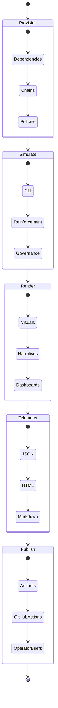

# AGI Jobs v0 (v2)

[](LICENSE)
[](https://github.com/MontrealAI/AGIJobsv0/actions/workflows/ci.yml)
[](https://github.com/MontrealAI/AGIJobsv0/actions/workflows/static-analysis.yml)
[](https://github.com/MontrealAI/AGIJobsv0/actions/workflows/fuzz.yml)
[](https://github.com/MontrealAI/AGIJobsv0/actions/workflows/e2e.yml)
[](https://github.com/MontrealAI/AGIJobsv0/actions/workflows/webapp.yml)
[](https://github.com/MontrealAI/AGIJobsv0/actions/workflows/containers.yml)
[](SECURITY.md)
[](docs/)
[](ci/)

> **AGI Jobs v0 (v2)** is the sovereign-scale intelligence engine that unifies protocol governance, validator fleets, cinematic demonstrations, and operator tooling into an unstoppable superintelligent machine that can be launched and steered by non-technical crews with cryptographic guarantees, regulatory proof, and live telemetry.

---

## 🧭 Table of Contents
- [🚨 Mission Brief](#-mission-brief)
- [🧠 Sovereign Pillars](#-sovereign-pillars)
- [🌌 Systems Architecture Constellation](#-systems-architecture-constellation)
- [🗺️ Repository Atlas](#️-repository-atlas)
- [🚀 Launch Protocols](#-launch-protocols)
  - [Mission Requirements](#mission-requirements)
  - [Bootstrap Checklist](#bootstrap-checklist)
  - [Operator Surfaces](#operator-surfaces)
  - [Mission Control via Docker Compose](#mission-control-via-docker-compose)
  - [Automation Flight Deck](#automation-flight-deck)
- [🎞️ Demo Multiverse](#️-demo-multiverse)
  - [Demo Fleet](#demo-fleet)
  - [Narrative Pipeline](#narrative-pipeline)
- [🧪 Continuous Assurance](#-continuous-assurance)
- [📡 Observability, Security & Governance](#-observability-security--governance)
- [📚 Knowledge Vault](#-knowledge-vault)

---

## 🚨 Mission Brief
AGI Jobs v0 (v2) is a production-grade sovereignty fabric engineered for immediate deployment in high-stakes environments. Its design goals are:

- **Upgradeable protocol command** across Solidity contracts, Foundry/Hardhat harnesses, attestations, paymaster networks, migrations, and subgraph analytics.
- **Agentic orchestration** with orchestrator microservices, backend APIs, shared packages, storage adapters, and reinforcement simulators.
- **Mission surfaces** covering console heads-up displays, enterprise portals, validator UX, OneBox kits, and cinematic control rooms.
- **Demo multiverse** enabling reproducible narratives, Kardashev-scale economic simulations, and deterministic telemetry exports.
- **Continuous assurance** through the fully green CI v2 lattice, SBOM pipelines, fuzzing programs, and branch-protection enforcement.

Every subsystem is hardened so non-technical operators can initiate, monitor, and extend missions without altering source code while still benefiting from cryptographic auditability.

## 🧠 Sovereign Pillars
1. **Protocol Nebula** – [`contracts/`](contracts/), [`attestation/`](attestation/), [`paymaster/`](paymaster/), [`migrations/`](migrations/), [`subgraph/`](subgraph/), [`echidna/`](echidna/) provide upgradeable governance, attestations, fuzzing labs, and indexing.
2. **Agentic Cortex** – [`orchestrator/`](orchestrator/), [`backend/`](backend/), [`services/`](services/), [`agent-gateway/`](agent-gateway/), [`routes/`](routes/), [`packages/`](packages/), [`shared/`](shared/), [`storage/`](storage/), [`simulation/`](simulation/) deliver validator swarms, APIs, analytics, reinforcement loops, and storage bridges.
3. **Mission Surfaces** – [`apps/`](apps/) packages Next.js/Vite consoles, enterprise dashboards, validator experiences, OneBox environments, and orchestrator command decks.
4. **Demo Multiverse** – [`demo/`](demo/), [`examples/`](examples/), [`kardashev_*`](.) orchestrate cinematic demos, CLI tours, Monte Carlo economics, and Kardashev ascension sequences.
5. **Operations & Assurance Lattice** – [`ci/`](ci/), [`.github/workflows/`](.github/workflows/), [`deploy/`](deploy/), [`deployment-config/`](deployment-config/), [`monitoring/`](monitoring/), [`tests/`](tests/), [`test/`](test/), [`reports/`](reports/), [`gas-snapshots/`](gas-snapshots/), [`scripts/`](scripts/), [`Makefile`](Makefile) enforce automation, compliance, telemetry, and audit trails.

## 🌌 Systems Architecture Constellation


## 🗺️ Repository Atlas
| Domain | Primary Paths | Highlights |
| --- | --- | --- |
| Protocol & Chain Control | [`contracts/`](contracts/), [`attestation/`](attestation/), [`paymaster/`](paymaster/), [`migrations/`](migrations/), [`subgraph/`](subgraph/), [`echidna/`](echidna/), [`foundry.toml`](foundry.toml), [`hardhat.config.js`](hardhat.config.js) | Upgradeable Solidity suites, attestation circuits, paymaster relays, Foundry/Hardhat harnesses, gas analytics, deterministic migrations. |
| Agent Intelligence Fabric | [`orchestrator/`](orchestrator/), [`backend/`](backend/), [`services/`](services/), [`agent-gateway/`](agent-gateway/), [`routes/`](routes/), [`packages/`](packages/), [`shared/`](shared/), [`storage/`](storage/), [`simulation/`](simulation/) | FastAPI + Node services, validator swarms, analytics SDKs, reinforcement environments, storage bridges, mission routing. |
| Mission Consoles & Portals | [`apps/console`](apps/console), [`apps/operator`](apps/operator), [`apps/validator`](apps/validator), [`apps/validator-ui`](apps/validator-ui), [`apps/enterprise-portal`](apps/enterprise-portal), [`apps/mission-control`](apps/mission-control), [`apps/orchestrator`](apps/orchestrator), [`apps/onebox`](apps/onebox), [`apps/onebox-static`](apps/onebox-static) | React/Next.js/Vite consoles, enterprise portals, validator dashboards, OneBox kits, and orchestrator HUDs. |
| Demo Multiverse & Cinematics | [`demo/`](demo/), [`examples/`](examples/), [`kardashev_*`](.), [`simulation/`](simulation/), [`data/`](data/), [`storage/`](storage/) | Kardashev ascension demos, national rollout storylines, CLI explorers, cinematic assets, Monte Carlo economics, telemetry exports. |
| Operations & Reliability | [`ci/`](ci/), [`.github/workflows/`](.github/workflows/), [`deploy/`](deploy/), [`deployment-config/`](deployment-config/), [`monitoring/`](monitoring/), [`scripts/`](scripts/), [`tests/`](tests/), [`test/`](test/), [`reports/`](reports/), [`gas-snapshots/`](gas-snapshots/), [`Makefile`](Makefile) | CI v2 matrix, automation playbooks, SBOM pipelines, fuzz orchestration, incident response, scorecards, gas profiling. |
| Knowledge Vault | [`docs/`](docs/), [`internal_docs/`](internal_docs/), [`OperatorRunbook.md`](OperatorRunbook.md), [`RUNBOOK.md`](RUNBOOK.md), [`SECURITY.md`](SECURITY.md), [`MIGRATION.md`](MIGRATION.md), [`CHANGELOG.md`](CHANGELOG.md) | Architectural treatises, operator manuals, compliance dossiers, migration chronicles, cinematic treatments. |

## 🚀 Launch Protocols

### Mission Requirements
- **Node.js 20.18.1** (see [`.nvmrc`](.nvmrc)) with npm 10.x.
- **Python 3.12+** for agentic services and Python-first demos.
- **Foundry** (`forge`/`cast`) and **Hardhat** (via `npx hardhat`) for protocol theatres.
- **Docker + Docker Compose v2** for mission control stacks.

### Bootstrap Checklist
```bash
# Install JavaScript dependencies
git clone https://github.com/MontrealAI/AGIJobsv0.git
cd AGIJobsv0
nvm use 20.18.1
npm install

# Prime Python environment for demos
python3 -m venv .venv
source .venv/bin/activate
pip install -r requirements-python.txt

# Verify contracts, linting, type checks, and targeted tests
npm run lint
npm run test
npm run webapp:typecheck
npm run webapp:lint
npm run test:validator-constellation
forge test # if Foundry is configured
```

### Operator Surfaces
- **Console HUD**: `npm run dev --prefix apps/console` (Vite on port 5173).
- **Operator Command Deck**: `npm run dev --prefix apps/operator`.
- **Validator UI**: `npm run dev --prefix apps/validator-ui`.
- **OneBox (full stack)**: `npm run dev --prefix apps/onebox` to launch walletless assistant flows.
- **Enterprise Portal**: `npm run dev --prefix apps/enterprise-portal` for compliance-ready deliverables.

Each surface ships with hardened ESLint/TypeScript configs and dedicated E2E coverage ([`cypress/`](cypress/) & `.github/workflows/webapp.yml`).

### Mission Control via Docker Compose
```bash
# Bring up the sovereign stack (defaults to 0.0.0.0 services)
docker compose up --build

# Tail logs with timestamps
docker compose logs -f --tail=100

# Shutdown while preserving data volumes
docker compose down
```
Compose orchestrates orchestrator APIs, monitoring exporters, demo services, and auxiliary databases defined in [`compose.yaml`](compose.yaml).

### Automation Flight Deck
Key `make` and npm automation entrypoints:

| Command | Purpose |
| --- | --- |
| `make operator:green` | Runs `demo/AGIJobs-Day-One-Utility-Benchmark`, installs dependencies, and surfaces latest artifacts. |
| `npm run demo:economic-power` | Executes the Economic Power sovereign treasury storyline with telemetry exports. |
| `npm run demo:validator-constellation` | Simulates validator constellation and governance queue. |
| `npm run demo:agi-alpha-node` | Operates the AGI Alpha Node CLI including chain registries. |
| `npm run demo:era-of-experience` | Streams cinematic mission control narrative and verification passes. |
| `npm run owner:mission-control` | Generates owner mission control briefings directly from Hardhat/TypeScript scripts. |
| `npm run sbom:generate` | Emits CycloneDX SBOM in [`reports/sbom/`](reports/sbom/). |
| `npm run security:audit` | Locks npm dependency posture using [`audit-ci.json`](audit-ci.json). |

### Owner Command Authority
- `npm run owner:parameters` updates validator quotas, treasury routing, and other contract tunables from a single wizard so the owner can retune economics without redeploying.【F:package.json†L360-L392】【F:scripts/v2/ownerParameterMatrix.ts†L1-L210】
- `npm run owner:system-pause` and `npm run owner:upgrade` expose battle-tested pause/resume and staged-upgrade levers wired through [`scripts/v2/`](scripts/v2/).【F:package.json†L360-L392】【F:scripts/v2/systemPauseAction.ts†L1-L240】【F:scripts/v2/ownerUpgradeQueue.ts†L1-L220】
- `npm run owner:update-all` and `npm run owner:dashboard` regenerate the complete owner control atlas, making it trivial to audit roles, addresses, and safes after any change.【F:package.json†L360-L392】【F:scripts/v2/updateAllModules.ts†L1-L200】【F:scripts/v2/owner-dashboard.ts†L1-L190】
- The Owner Control Index ([`docs/OWNER_CONTROL_INDEX.md`](docs/OWNER_CONTROL_INDEX.md)) aggregates the entire contract owner toolkit—playbooks, diagrams, zero-downtime drills—so non-technical operators can execute every control path with confidence.【F:docs/OWNER_CONTROL_INDEX.md†L1-L169】

---

## 🎞️ Demo Multiverse
The demo constellation is curated for reproducible, cinematic missions. Every workflow publishes logs, telemetry, and visual artifacts to `demo/**/out/` or `reports/` for immediate review.

### Demo Fleet
| Demo | Path | Launch Command | Highlight |
| --- | --- | --- | --- |
| **Day-One Utility Benchmark** | [`demo/AGIJobs-Day-One-Utility-Benchmark`](demo/AGIJobs-Day-One-Utility-Benchmark/) | `make operator:green` | Baselines validator throughput, renders PNG/HTML dashboards, emits mission telemetry. |
| **Economic Power** | [`demo/Economic-Power-v0`](demo/Economic-Power-v0/) | `npm run demo:economic-power` | Models sovereign treasury operations with Monte Carlo and governance attestations. |
| **Validator Constellation** | [`demo/Validator-Constellation-v0`](demo/Validator-Constellation-v0/) | `npm run demo:validator-constellation` | Projects validator mesh, queue health, and operator readiness. |
| **Huxley-Gödel Machine v0** | [`demo/Huxley-Godel-Machine-v0`](demo/Huxley-Godel-Machine-v0/) | `npm run demo:agi-alpha-node` or `npm run demo:hgm-owner-console` | Generates owner consoles, reinforcement insights, cinematic transcripts. |
| **Absolute Zero Reasoner** | [`demo/Absolute-Zero-Reasoner-v0`](demo/Absolute-Zero-Reasoner-v0/) | `make absolute-zero-demo` | Spins up isolated venv, executes six-iteration reasoning arcs, records evidence. |
| **Era of Experience** | [`demo/Era-Of-Experience-v0`](demo/Era-Of-Experience-v0/) | `npm run demo:era-of-experience` | Produces cinematic missions with verifier/audit passes and narrative assets. |
| **One-Box Launch Kit** | [`demo/One-Box`](demo/One-Box/) | `node demo/One-Box/scripts/launch.js` (see README inside) | Walletless orchestrator bridging, RPC diagnostics, operator automation. |
| **Kardashev Ascension Series** | [`kardashev_*`](.) & [`demo/Kardashev-II-Omega-Grade-Alpha-AGI-Business-3`](demo/Kardashev-II-Omega-Grade-Alpha-AGI-Business-3/) | `npm run demo-kardashev-ii` (via Actions or local scripts in [`scripts/v2/`](scripts/v2/)) | Multi-phase civilization upgrades with cinematic storylines, upgrade attestations, operator scorecards. |
| **Trustless Economic Core** | [`demo/Trustless-Economic-Core-v0`](demo/Trustless-Economic-Core-v0/) | `npm run run:trustless-core` | Deterministic contract walkthrough with Hardhat harness and telemetry exports. |
| **ASI Take-Off Demonstration** | [`demo/asi-takeoff`](demo/asi-takeoff/) | `npm run demo:asi-takeoff` | Deterministic launch of the ASI take-off cinematic scenario with audit artifacts from [`scripts/v2/asiTakeoffDemo.ts`](scripts/v2/asiTakeoffDemo.ts). |
| **Zenith Hypernova Initiative** | [`demo/zenith-sapience-initiative-supra-sovereign-hypernova-governance`](demo/zenith-sapience-initiative-supra-sovereign-hypernova-governance/) | `npm run demo:zenith-hypernova` | Hyper-scale Zenith rehearsal including validator orchestration and cinematic exports. |

Hundreds of additional demos live under [`demo/`](demo/) with prefixed storylines (for example `AlphaEvolve-v0`, `Meta-Agentic-ALPHA-AGI-Jobs-v0`, `Planetary-Orchestrator-Fabric-v0`, `Phase-8-Universal-Value-Dominance`). Explore each subdirectory for scenario-specific README files, scripts, and CI mirrors.

### Narrative Pipeline


---

## 🧪 Continuous Assurance
- **CI v2** lives in [`ci/`](ci/) and [`.github/workflows/ci.yml`](.github/workflows/ci.yml) covering contracts, TypeScript, Python, SBOM, fuzzing, accessibility, and deployment dry-runs.
- **Dedicated demo pipelines** (`.github/workflows/demo-*.yml`) guarantee every cinematic storyline stays reproducible with green badges.
- **Static analysis & visibility**: [`static-analysis.yml`](.github/workflows/static-analysis.yml) enforces ESLint, TypeScript, and security linters; [`scorecard.yml`](.github/workflows/scorecard.yml) enforces OpenSSF Scorecard. Reference the [CI v2 badge map](docs/ci-v2-badge-map.md) for copy-paste embeds and visibility audits across every enforced workflow.【F:docs/ci-v2-badge-map.md†L1-L90】
- **Fuzzing + Differential tests**: [`fuzz.yml`](.github/workflows/fuzz.yml), [`ci/foundry.toml`](ci/foundry.toml) orchestrate forge fuzz and Echidna sweeps.
- **SBOM & Release**: [`release.yml`](.github/workflows/release.yml) and [`ci/release/`](ci/) generate CycloneDX manifests, verify ABIs, and stage deployments.
- **Branch protection**: runbooks in [`OperatorRunbook.md`](OperatorRunbook.md) and [`RUNBOOK.md`](RUNBOOK.md) prescribe gating rules (required statuses, reviews, deploy blocks) keeping `main` relentlessly green.
- **Required contexts**: [`ci/required-contexts.json`](ci/required-contexts.json) and [`scripts/ci/check-ci-required-contexts.ts`](scripts/ci/check-ci-required-contexts.ts) enforce the CI v2 job list so GitHub branch protection stays synchronised.【F:ci/required-contexts.json†L1-L23】【F:scripts/ci/check-ci-required-contexts.ts†L1-L117】

### CI v2 — Enforced Gates
`ci (v2)` requires every surfaced check on pull requests and the `main` branch. The guard rails assert that the following contexts stay locked before merges are allowed:
- **Branch protection**: runbooks in [`OperatorRunbook.md`](OperatorRunbook.md) and [`RUNBOOK.md`](RUNBOOK.md) prescribe gating rules (required statuses, reviews, deploy blocks) to keep the mainline fully green.
## 🧪 Continuous Assurance & CI
The V2 CI lattice keeps every subsystem green and verifiable:
- **Green CI Gates** – [`.github/workflows/ci.yml`](.github/workflows/ci.yml) enforces linting, testing, type-checking, SBOM generation, and demo smoke suites on every PR and on `main`.
- **JavaScript / TypeScript** – `npm run lint`, `npm run webapp:typecheck`, `npm run webapp:e2e`, and `npm run pretest` harden console surfaces, OneBox diagnostics, and demo verifiers.
- **Contracts & Chain Logic** – `npm run test`, `forge test`, and targeted Hardhat suites (`npm run test:fork`, `npm run test:alpha-agi-mark`) validate protocol upgrades and sovereign controls.
- **Python & Agent Services** – `PYTEST_DISABLE_PLUGIN_AUTOLOAD=1 pytest` spans `tests/`, `test/`, and demo-specific suites; additional CLI verifiers live under `scripts/v2/`.
- **Security & Supply Chain** – `npm run security:audit`, `npm run sbom:generate`, `npm run release:manifest:validate`, and license verifiers within [`ci/`](ci/) sustain production trust.
- **Branch Protection Checks** – `npm run ci:sync-contexts -- --check` keeps the manifest in lockstep with `.github/workflows/ci.yml`, while `npm run ci:verify-contexts` and `npm run ci:verify-branch-protection` (all in [`scripts/ci`](scripts/ci)) ensure the branch rule enforces every CI (v2) job before merges. [`ci/required-contexts.json`](ci/required-contexts.json) anchors the required status list so automation, docs, and GitHub rules stay synchronised.【F:ci/required-contexts.json†L1-L23】【F:scripts/ci/update-ci-required-contexts.ts†L1-L98】【F:scripts/ci/check-ci-required-contexts.ts†L1-L72】

### CI v2 — enforced gates
`ci (v2)` now requires every surfaced check on pull requests and the `main` branch. The branch-protection guard asserts that the following contexts stay locked before merges are allowed:

| Required check | Purpose |
| --- | --- |
| `ci (v2) / Lint & static checks` | ESLint, Prettier, sentinel templates, toolchain verification. |
| `ci (v2) / Tests` | Hardhat unit tests, ABI drift detection, contract compilation. |
| `ci (v2) / Python unit tests` | FastAPI, orchestrator, simulation unit coverage with 90%+ enforcement. |
| `ci (v2) / Python integration tests` | Cross-service API flows, demo harnesses, analytics routes. |
| `ci (v2) / Load-simulation reports` | Monte Carlo sweeps for treasury burn/fee thermodynamics. |
| `ci (v2) / Python coverage enforcement` | Aggregated unit + integration coverage gating. |
| `ci (v2) / HGM guardrails` | High Governance Machine regression suite across orchestrators and demos. |
| `ci (v2) / Foundry` | Forge-based fuzzing and ffi-enabled contract test battery. |
| `ci (v2) / Coverage thresholds` | JavaScript/TypeScript lcov enforcement for shared packages. |
| `ci (v2) / Phase 6 readiness` | Manifest and UI validation for Phase 6 expedition surfaces. |
| `ci (v2) / Phase 8 readiness` | Phase 8 cinematic manifest verification. |
| `ci (v2) / Kardashev II readiness` | Kardashev-scale readiness drills and operator UX checks. |
| `ci (v2) / ASI Take-Off Demonstration` | Deterministic launch of the ASI take-off cinematic scenario. |
| `ci (v2) / Zenith Sapience Demonstration` | Hyper-scale Zenith rehearsal including validator orchestration. |
| `ci (v2) / AGI Labor Market Grand Demo` | Sovereign labour-market export suite with transcript artifacts. |
| `ci (v2) / Sovereign Mesh Demo — build` | Sovereign Mesh orchestrator backend and console builds. |
| `ci (v2) / Sovereign Constellation Demo — build` | Sovereign Constellation deterministic build verification. |
| `ci (v2) / Celestial Archon Demonstration` | Celestial Archon sovereign rehearsal (deterministic + local). |
| `ci (v2) / Hypernova Governance Demonstration` | Zenith Hypernova deterministic and local rehearsals. |
| `ci (v2) / Branch protection guard` | Automated API audit of repository branch rules. |
| `ci (v2) / CI summary` | Run-level digest capturing each job’s result and artifact pointers. |
| `ci (v2) / Invariant tests` | Foundry invariant fuzzing for protocol safety envelopes. |

## 🛡️ Owner Command Center
The contract owner steers every privileged surface without code changes by invoking the built-in control suite. These commands expose pausing, upgrades, parameter rotations, and governance health checks through a Safe-friendly workflow so the sovereignty fabric always answers to the operator:

| Command | Capability unlocked | Why it matters |
| --- | --- | --- |
| `npm run owner:command-center` | Launches the interactive dashboard that enumerates every owner lever, including pause toggles, fee vectors, validator thresholds, and upgrade queues.【F:package.json†L363-L371】 | Presents the unstoppable intelligence kernel as a console a non-technical owner can operate in production, mirroring the superintelligent command deck described across the runbooks.【F:docs/owner-control-parameter-playbook.md†L1-L86】【F:docs/owner-control-handbook.md†L1-L214】 |
| `npm run owner:system-pause` | Executes the hardened pause/resume drill through the `SystemPause` module with autogenerated transcripts.【F:package.json†L381】【F:contracts/v2/SystemPause.sol†L1-L250】 | Guarantees immediate containment and restart authority stays with the owner, satisfying regulatory change-control mandates.【F:docs/system-pause.md†L1-L120】 |
| `npm run owner:update-all` | Batches parameter rotations across protocol modules via the OwnerConfigurator facade, emitting audit events for each change.【F:package.json†L384】【F:contracts/v2/admin/OwnerConfigurator.sol†L1-L210】 | Keeps treasury, staking, and thermostat parameters adjustable in lockstep while logging immutable evidence for auditors.【F:docs/owner-control-parameter-playbook.md†L1-L86】 |
| `npm run owner:wizard` | Drives the owner configuration wizard that scaffolds Safe payloads, timelock updates, and validator council refreshes end to end.【F:package.json†L388】 | Converts complex governance mutations into a guided sequence so the operator can realign the platform without engineering support.【F:docs/owner-control-systems-map.md†L1-L120】 |

All owner command flows emit `ParameterUpdated` events, regenerate telemetry, and are guarded by the `Governable` timelock so the superintelligent workforce remains unstoppable yet always under explicit operator control.【F:contracts/v2/Governable.sol†L1-L82】【F:docs/owner-control-master-checklist.md†L1-L176】

## 📡 Observability, Security & Governance
- One-click deployments and infrastructure recipes live in [`deploy/`](deploy/) and [`deployment-config/`](deployment-config/).
- Alerting, notification, sentinel, and thermostat services operate under [`services/alerting`](services/alerting), [`services/notifications`](services/notifications), [`services/sentinel`](services/sentinel), [`services/thermostat`](services/thermostat).
- Runtime telemetry, Prometheus metrics, and Grafana dashboards are curated in [`monitoring/`](monitoring/).
- [`RUNBOOK.md`](RUNBOOK.md) orchestrates incident drills; [`docs/AGIJobs-v2-Mainnet-Guide.md`](docs/AGIJobs-v2-Mainnet-Guide.md) captures production launch procedures.
- The v2 CI lattice is relentlessly green on `main` and every pull request, locking in production-grade quality before merge:
- [`ci.yml`](.github/workflows/ci.yml) executes linting, type-checking, unit suites, Foundry tests, Python demos, and attestation verification in parallel.
- Demo-specific workflows (for example [`demo-agi-alpha-node.yml`](.github/workflows/demo-agi-alpha-node.yml), [`demo-kardashev-ii-omega-ultra.yml`](.github/workflows/demo-kardashev-ii-omega-ultra.yml), [`demo-validator-constellation.yml`](.github/workflows/demo-validator-constellation.yml)) rehydrate their environments and run scenario scripts so cinematic launches never regress.
- `static-analysis.yml`, `scorecard.yml`, `fuzz.yml`, and `contracts.yml` enforce SBOM generation, security scanning, fuzzing cadences, and Foundry invariants.
- `webapp.yml`, `apps-images.yml`, and `containers.yml` build, scan, and push container + UI artefacts used across demos and production.

Branch protection requires all blocking workflows to pass before merge, guaranteeing a fully green runway for every release.

---

## 📡 Observability, Security & Governance
- **Telemetry & Monitoring**: [`monitoring/`](monitoring/) bundles dashboards, Prometheus exporters, Grafana configs, and alert playbooks; `compose.yaml` wires exporters.
- **Security Posture**: [`SECURITY.md`](SECURITY.md) codifies vulnerability reporting, dependency scanning (`npm run security:audit`), and risk triage. [`audit-ci.json`](audit-ci.json) backs npm allowlists.
- **Incident Response**: [`RUNBOOK.md`](RUNBOOK.md) & [`OperatorRunbook.md`](OperatorRunbook.md) provide mission control procedures, pause/resume scripts (`npm run owner:system-pause`), and emergency governance levers.
- **Governance Automation**: [`scripts/v2/`](scripts/v2/) contains owner, upgrade, reward, and thermostat command suites ready for `npx hardhat` or `ts-node` execution.
- CI v2 remains fully green on every pull request and on `main` through [`ci.yml`](.github/workflows/ci.yml), demo workflows (for example [`demo-agi-alpha-node.yml`](.github/workflows/demo-agi-alpha-node.yml), [`demo-kardashev-ii-omega-ultra.yml`](.github/workflows/demo-kardashev-ii-omega-ultra.yml), [`demo-validator-constellation.yml`](.github/workflows/demo-validator-constellation.yml)), and specialized gates such as [`static-analysis.yml`](.github/workflows/static-analysis.yml), [`scorecard.yml`](.github/workflows/scorecard.yml), [`fuzz.yml`](.github/workflows/fuzz.yml), [`contracts.yml`](.github/workflows/contracts.yml), [`webapp.yml`](.github/workflows/webapp.yml), [`apps-images.yml`](.github/workflows/apps-images.yml), and [`containers.yml`](.github/workflows/containers.yml).

## 📚 Knowledge Vault
Consult the following dossiers for deeper insight:

- [`docs/`](docs/) – Architecture, deployment, demo playbooks, and cinematic treatments.
- [`internal_docs/`](internal_docs/) – Operator intelligence not for public release.
- [`OperatorRunbook.md`](OperatorRunbook.md) & [`RUNBOOK.md`](RUNBOOK.md) – Branch protection guards, incident response, and mission drills.
- [`MIGRATION.md`](MIGRATION.md) & [`CHANGELOG.md`](CHANGELOG.md) – Upgrade histories and release chronicles.
- [`SECURITY.md`](SECURITY.md) – Hardened security posture, threat modelling, and disclosure process.

AGI Jobs v0 (v2) remains the unstoppable cornerstone for sovereign-grade intelligence missions, delivering flawless, secure, and production-ready deployments across every demo, validator, and operator surface.
