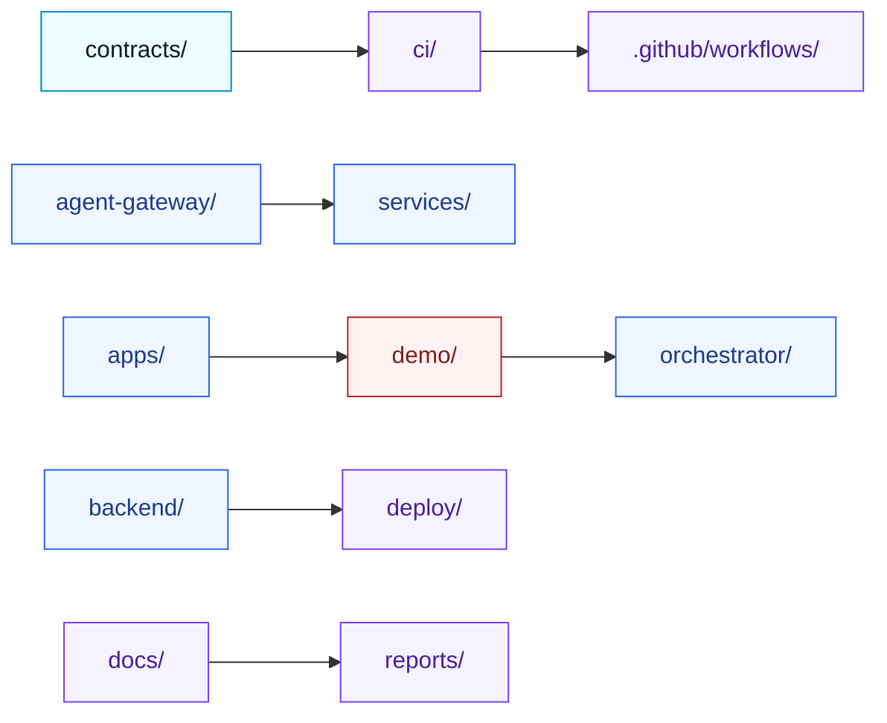
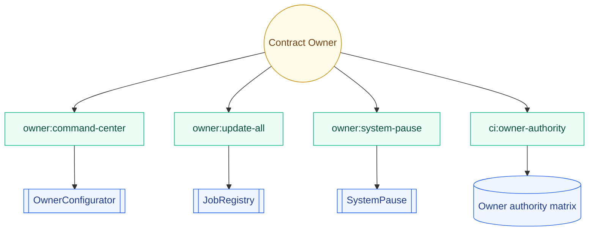
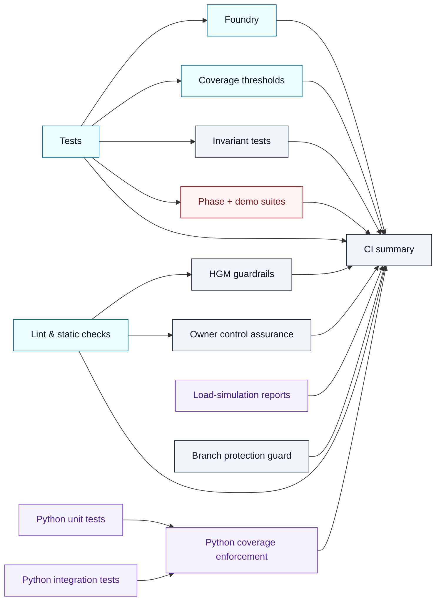
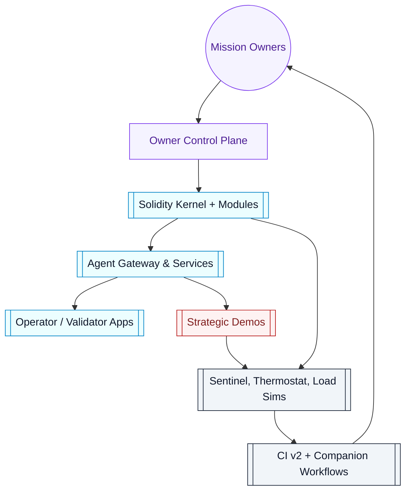

# AGI Jobs v0 (v2)

[](https://github.com/MontrealAI/AGIJobsv0/actions/workflows/ci.yml)
[](https://github.com/MontrealAI/AGIJobsv0/actions/workflows/ci.yml?query=workflow%3A%22ci+%28v2%29%22+is%3Asuccess+branch%3Amain)
[](https://github.com/MontrealAI/AGIJobsv0/actions/workflows/static-analysis.yml)
[](https://github.com/MontrealAI/AGIJobsv0/actions/workflows/fuzz.yml)
[](https://github.com/MontrealAI/AGIJobsv0/actions/workflows/webapp.yml)
[](https://github.com/MontrealAI/AGIJobsv0/actions/workflows/containers.yml)
[](https://github.com/MontrealAI/AGIJobsv0/actions/workflows/orchestrator-ci.yml)
[](https://github.com/MontrealAI/AGIJobsv0/actions/workflows/e2e.yml)
[](https://github.com/MontrealAI/AGIJobsv0/actions/workflows/scorecard.yml)

AGI Jobs v0 (v2) is delivered as a production-hardened intelligence core that fuses contracts, agents, demos, and observability into a single command surface for mission owners. The platform behaves like the reference superintelligent system for the ecosystem—autonomous, accountable, and ready to deploy in boardroom-level scenarios.

## CI v2 status wall (live)

| Required job | Status badge |
| ------------ | ------------ |
| Lint & static checks | [](https://github.com/MontrealAI/AGIJobsv0/actions/workflows/ci.yml?query=workflow%3A%22ci+%28v2%29%22+is%3Asuccess+branch%3Amain+job%3A%22Lint+%26+static+checks%22) |
| Tests | [](https://github.com/MontrealAI/AGIJobsv0/actions/workflows/ci.yml?query=workflow%3A%22ci+%28v2%29%22+is%3Asuccess+branch%3Amain+job%3ATests) |
| Python unit tests | [](https://github.com/MontrealAI/AGIJobsv0/actions/workflows/ci.yml?query=workflow%3A%22ci+%28v2%29%22+is%3Asuccess+branch%3Amain+job%3A%22Python+unit+tests%22) |
| Python integration tests | [](https://github.com/MontrealAI/AGIJobsv0/actions/workflows/ci.yml?query=workflow%3A%22ci+%28v2%29%22+is%3Asuccess+branch%3Amain+job%3A%22Python+integration+tests%22) |
| Load-simulation reports | [](https://github.com/MontrealAI/AGIJobsv0/actions/workflows/ci.yml?query=workflow%3A%22ci+%28v2%29%22+is%3Asuccess+branch%3Amain+job%3A%22Load-simulation+reports%22) |
| Python coverage enforcement | [](https://github.com/MontrealAI/AGIJobsv0/actions/workflows/ci.yml?query=workflow%3A%22ci+%28v2%29%22+is%3Asuccess+branch%3Amain+job%3A%22Python+coverage+enforcement%22) |
| HGM guardrails | [](https://github.com/MontrealAI/AGIJobsv0/actions/workflows/ci.yml?query=workflow%3A%22ci+%28v2%29%22+is%3Asuccess+branch%3Amain+job%3A%22HGM+guardrails%22) |
| Owner control assurance | [](https://github.com/MontrealAI/AGIJobsv0/actions/workflows/ci.yml?query=workflow%3A%22ci+%28v2%29%22+is%3Asuccess+branch%3Amain+job%3A%22Owner+control+assurance%22) |
| Foundry | [](https://github.com/MontrealAI/AGIJobsv0/actions/workflows/ci.yml?query=workflow%3A%22ci+%28v2%29%22+is%3Asuccess+branch%3Amain+job%3AFoundry) |
| Coverage thresholds | [](https://github.com/MontrealAI/AGIJobsv0/actions/workflows/ci.yml?query=workflow%3A%22ci+%28v2%29%22+is%3Asuccess+branch%3Amain+job%3A%22Coverage+thresholds%22) |
| Phase 6 readiness | [](https://github.com/MontrealAI/AGIJobsv0/actions/workflows/ci.yml?query=workflow%3A%22ci+%28v2%29%22+is%3Asuccess+branch%3Amain+job%3A%22Phase+6+readiness%22) |
| Phase 8 readiness | [](https://github.com/MontrealAI/AGIJobsv0/actions/workflows/ci.yml?query=workflow%3A%22ci+%28v2%29%22+is%3Asuccess+branch%3Amain+job%3A%22Phase+8+readiness%22) |
| Kardashev II readiness | [](https://github.com/MontrealAI/AGIJobsv0/actions/workflows/ci.yml?query=workflow%3A%22ci+%28v2%29%22+is%3Asuccess+branch%3Amain+job%3A%22Kardashev+II+readiness%22) |
| ASI Take-Off Demonstration | [](https://github.com/MontrealAI/AGIJobsv0/actions/workflows/ci.yml?query=workflow%3A%22ci+%28v2%29%22+is%3Asuccess+branch%3Amain+job%3A%22ASI+Take-Off+Demonstration%22) |
| Zenith Sapience Demonstration | [](https://github.com/MontrealAI/AGIJobsv0/actions/workflows/ci.yml?query=workflow%3A%22ci+%28v2%29%22+is%3Asuccess+branch%3Amain+job%3A%22Zenith+Sapience+Demonstration%22) |
| AGI Labor Market Grand Demo | [](https://github.com/MontrealAI/AGIJobsv0/actions/workflows/ci.yml?query=workflow%3A%22ci+%28v2%29%22+is%3Asuccess+branch%3Amain+job%3A%22AGI+Labor+Market+Grand+Demo%22) |
| Sovereign Mesh Demo — build | [](https://github.com/MontrealAI/AGIJobsv0/actions/workflows/ci.yml?query=workflow%3A%22ci+%28v2%29%22+is%3Asuccess+branch%3Amain+job%3A%22Sovereign+Mesh+Demo+%E2%80%94+build%22) |
| Sovereign Constellation Demo — build | [](https://github.com/MontrealAI/AGIJobsv0/actions/workflows/ci.yml?query=workflow%3A%22ci+%28v2%29%22+is%3Asuccess+branch%3Amain+job%3A%22Sovereign+Constellation+Demo+%E2%80%94+build%22) |
| Celestial Archon Demonstration | [](https://github.com/MontrealAI/AGIJobsv0/actions/workflows/ci.yml?query=workflow%3A%22ci+%28v2%29%22+is%3Asuccess+branch%3Amain+job%3A%22Celestial+Archon+Demonstration%22) |
| Hypernova Governance Demonstration | [](https://github.com/MontrealAI/AGIJobsv0/actions/workflows/ci.yml?query=workflow%3A%22ci+%28v2%29%22+is%3Asuccess+branch%3Amain+job%3A%22Hypernova+Governance+Demonstration%22) |
| Branch protection guard | [](https://github.com/MontrealAI/AGIJobsv0/actions/workflows/ci.yml?query=workflow%3A%22ci+%28v2%29%22+is%3Asuccess+branch%3Amain+job%3A%22Branch+protection+guard%22) |
| CI summary | [](https://github.com/MontrealAI/AGIJobsv0/actions/workflows/ci.yml?query=workflow%3A%22ci+%28v2%29%22+is%3Asuccess+branch%3Amain+job%3A%22CI+summary%22) |
| Invariant tests | [](https://github.com/MontrealAI/AGIJobsv0/actions/workflows/ci.yml?query=workflow%3A%22ci+%28v2%29%22+is%3Asuccess+branch%3Amain+job%3A%22Invariant+tests%22) |

Companion workflows complete the assurance wall: [static analysis](https://github.com/MontrealAI/AGIJobsv0/actions/workflows/static-analysis.yml), [fuzz](https://github.com/MontrealAI/AGIJobsv0/actions/workflows/fuzz.yml), [webapp](https://github.com/MontrealAI/AGIJobsv0/actions/workflows/webapp.yml), [containers](https://github.com/MontrealAI/AGIJobsv0/actions/workflows/containers.yml), and [e2e](https://github.com/MontrealAI/AGIJobsv0/actions/workflows/e2e.yml). Required contexts for those workflows are defined in [`ci/required-companion-contexts.json`](ci/required-companion-contexts.json) and enforced by `npm run ci:verify-companion-contexts`.

### Live verification CLI
- Run `npm run ci:status-wall -- --token <github_token>` to confirm the latest `ci (v2)` run on `main` succeeded across every required job. The command inspects the GitHub Actions API, flags missing or red jobs, and prints a breakdown with direct links to each job log. Add `--format json` when you need structured output for dashboards or automated release gates.【F:scripts/ci/check-ci-status-wall.ts†L1-L332】
- Pass `--include-companion` to extend the check across the companion workflows (static-analysis, fuzz, webapp, containers, e2e) so the full assurance wall is verified in one sweep.【F:scripts/ci/check-ci-status-wall.ts†L262-L332】【F:ci/required-companion-contexts.json†L1-L10】
- Use `--branch <name>` or `--workflow <file>` when validating release branches or pre-flight changes in forks. All options mirror the automation that the branch-protection guard enforces on protected branches.【F:scripts/ci/check-ci-status-wall.ts†L200-L332】

| Scenario | Command | Notes |
| --- | --- | --- |
| Enforce success on `main` | `npm run ci:status-wall -- --token $GITHUB_TOKEN --require-success` | Fails fast unless every job finished in `success` or `skipped` state.【F:scripts/ci/check-ci-status-wall.ts†L93-L199】 |
| Include companion lattice | `npm run ci:status-wall -- --token $GITHUB_TOKEN --include-companion` | Adds static-analysis, fuzz, webapp, containers, and e2e to the report.【F:scripts/ci/check-ci-status-wall.ts†L262-L332】 |
| Export dashboards | `npm run ci:status-wall -- --token $GITHUB_TOKEN --format json > reports/ci/status.wall.json` | Emits machine-readable payload for dashboards and alerting.【F:scripts/ci/check-ci-status-wall.ts†L110-L332】 |

```mermaid
flowchart TD
    classDef entry fill:#ecfeff,stroke:#0369a1,color:#0f172a,stroke-width:1px;
    classDef api fill:#f5f3ff,stroke:#7c3aed,color:#4c1d95,stroke-width:1px;
    classDef guard fill:#fef2f2,stroke:#b91c1c,color:#7f1d1d,stroke-width:1px;
    classDef artefact fill:#f1f5f9,stroke:#1e293b,color:#0f172a,stroke-width:1px;

    statusWall[ci:status-wall CLI]:::entry --> ghRuns[GitHub Actions runs API]:::api
    statusWall --> ghJobs[GitHub Actions jobs API]:::api
    ghJobs --> manifest[ci/required-contexts.json]:::guard
    ghJobs --> companion[ci/required-companion-contexts.json]:::guard
    manifest --> verdict[Branch protection guard parity]:::guard
    companion --> verdict
    verdict --> artefacts[reports/ci/status.{md,json}]:::artefact
```

The same manifest powers the branch-protection guard inside CI v2 and the local verification CLI, so green walls locally guarantee green walls on GitHub before merge.【F:.github/workflows/ci.yml†L966-L1089】【F:ci/required-contexts.json†L1-L24】

## Executive signal
- **Unification:** Smart contracts, agent gateways, demos, and analytics are orchestrated as one lattice, keeping governance, telemetry, and delivery in lockstep for non-technical operators.【F:agent-gateway/README.md†L1-L53】【F:apps/validator-ui/README.md†L1-L40】【F:services/thermostat/README.md†L1-L60】
- **Owner supremacy:** Every critical lever is surfaced through deterministic owner tooling so the contract owner can pause, upgrade, and retune parameters on demand, without redeploying or editing code.【F:contracts/v2/admin/OwnerConfigurator.sol†L7-L112】【F:package.json†L135-L226】
- **Evergreen assurance:** CI v2 enforces a wall of 23 required contexts plus companion workflows, uploads audit artefacts, and verifies branch protection so every release inherits a fully green, enforceable policy.【F:.github/workflows/ci.yml†L22-L965】【F:.github/workflows/ci.yml†L970-L1181】【F:ci/required-contexts.json†L1-L24】【F:ci/required-companion-contexts.json†L1-L11】

## Quickstart for operators
1. Use Node.js 20.18.1 (`.nvmrc`) and Python 3.12 to match the automated toolchain.【F:.nvmrc†L1-L1】【F:.github/workflows/ci.yml†L118-L145】
2. Hydrate dependencies (do **not** omit optional packages—the Hardhat toolbox requires the platform-specific `@nomicfoundation/solidity-analyzer-*` binary and will fail exactly like CI if you pass `--omit=optional`):
   ```bash
   npm install
   python -m pip install --upgrade pip
   python -m pip install -r requirements-python.txt
   ```
3. Confirm the deterministic toolchain locks before coding:
   ```bash
   npm run ci:preflight
   npm run ci:verify-toolchain
   npm run ci:sync-contexts -- --check
   npm run ci:verify-contexts
   npm run ci:verify-companion-contexts
   ```
   The sync command confirms `ci/required-contexts.json` matches the workflow before the verification scripts enforce ordering, so keeping this quartet green locally mirrors branch protection expectations.【F:package.json†L135-L150】【F:scripts/ci/update-ci-required-contexts.ts†L1-L83】【F:.github/workflows/ci.yml†L34-L74】
4. Validate the critical suites (prime the Hardhat cache once so local runs mirror CI performance):
   ```bash
   npm run compile           # generates artifacts exactly like the tests job
   npm test                  # reuses the compiled artefacts, matching ci (v2) / Tests
   npm run lint:ci
   npm run coverage
   forge test -vvvv --ffi --fuzz-runs 256
   ```
   Compiling first avoids the local fallback where `hardhat test --no-compile` triggers a fresh Solidity build, bringing the experience in line with the workflow’s dedicated compile step before `npm test`. These commands reproduce the Hardhat, linting, coverage, and Foundry stages the pipeline requires.【F:package.json†L233-L245】【F:.github/workflows/ci.yml†L75-L546】
5. When the signal is green, push signed commits and open a pull request—CI v2 enforces the exact same contexts on `main` and PRs.

## Repository atlas


| Domain | Highlights |
| ------ | ---------- |
| Contracts (`contracts/`) | Solidity kernel, modules, admin façades, and invariant harnesses tested through Hardhat + Foundry with owner-first controls.【F:contracts/README.md†L1-L82】 |
| Agent Gateway (`agent-gateway/`) | TypeScript service providing REST, WebSocket, and gRPC bridges into the contract stack with deterministic telemetry exports.【F:agent-gateway/README.md†L1-L86】 |
| Apps (`apps/`) | Operator and validator UIs that consume the gateway and orchestrator APIs for mission dashboards.【F:apps/validator-ui/README.md†L1-L40】 |
| Services (`services/`) | Sentinels, thermostat, culture indexers, and auxiliary control planes feeding observability and safeguards.【F:services/thermostat/README.md†L1-L60】 |
| CI (`ci/` + `.github/workflows/`) | Scripts, manifests, and workflows that lock toolchains, enforce branch protection, and publish compliance artefacts.【F:ci/required-contexts.json†L1-L24】【F:.github/workflows/ci.yml†L24-L546】 |
| Demo constellation (`demo/`) | High-stakes rehearsals (Kardashev, ASI take-off, Zenith sapience, etc.) codified as reproducible scripts and UI bundles.【F:.github/workflows/ci.yml†L548-L965】 |

## Owner command authority


| Command | Purpose |
| ------- | ------- |
| `npm run owner:system-pause -- --network <network>` | Toggle pause levers across kernel and module contracts in one transaction, enforcing ownership checks before execution.【F:package.json†L180-L195】【F:contracts/v2/SystemPause.sol†L15-L157】 |
| `npm run owner:update-all -- --network <network>` | Reconcile manifests against on-chain parameters through the `OwnerConfigurator`, emitting structured audit logs per change.【F:package.json†L195-L215】【F:contracts/v2/admin/OwnerConfigurator.sol†L7-L112】 |
| `npm run owner:command-center` | Render a consolidated mission-control report (mermaid + JSON) so non-technical owners can approve operations before broadcasting.【F:package.json†L165-L190】 |
| `npm run owner:parameters -- --network <network>` | Export the full parameter matrix referenced in CI and compliance reviews.【F:package.json†L165-L208】【F:scripts/v2/ownerParameterMatrix.ts†L1-L612】 |
| `npm run ci:owner-authority -- --network ci --out reports/owner-control` | Regenerate the authority matrix consumed by CI artefacts and branch protection guards.【F:package.json†L138-L149】【F:.github/workflows/ci.yml†L393-L440】 |

Every command supports `--dry-run` and report exports, ensuring the contract owner retains absolute control while the automation stays auditable.【F:scripts/v2/ownerControlDoctor.ts†L1-L252】【F:scripts/v2/ownerControlQuickstart.ts†L1-L220】

## Parameter recalibration pipeline
```mermaid
flowchart LR
    classDef inputs fill:#ecfeff,stroke:#0369a1,color:#0f172a,stroke-width:1px;
    classDef analysis fill:#f5f3ff,stroke:#7c3aed,color:#4c1d95,stroke-width:1px;
    classDef command fill:#fef3c7,stroke:#d97706,color:#7c2d12,stroke-width:1px;
    classDef execution fill:#eff6ff,stroke:#2563eb,color:#1e3a8a,stroke-width:1px;

    configs[Config manifests\n(config/, storage/)]:::inputs --> surface[owner:surface]:::analysis
    surface --> matrix[owner:parameters]:::analysis
    matrix --> doctor[owner:doctor]:::analysis
    doctor --> mission[owner:mission-control]:::command
    mission --> updateAll[owner:update-all]:::execution
    updateAll --> contractsCore[contracts/v2 core modules]:::execution
```

- **Surface scan:** `npm run owner:surface` fingerprints every config file, normalises addresses, and highlights drift against the deployed control plane so owners see exactly which modules need attention before touching the chain.【F:scripts/v2/ownerControlSurface.ts†L1-L120】【F:scripts/v2/ownerControlSurface.ts†L121-L248】
- **Matrix export:** `npm run owner:parameters` renders markdown, JSON, and mermaid matrices that map every subsystem to its calibration commands and verification steps, ready to drop into compliance reports or mission reviews.【F:scripts/v2/ownerParameterMatrix.ts†L1-L120】【F:scripts/v2/ownerParameterMatrix.ts†L121-L240】
- **Doctor triage:** `npm run owner:doctor` scores each subsystem with `pass/warn/fail`, escalates on missing keys, and recommends remediation commands, enforcing deterministic ownership of the entire lattice.【F:scripts/v2/ownerControlDoctor.ts†L1-L120】【F:scripts/v2/ownerControlDoctor.ts†L121-L248】
- **Mission orchestration:** `npm run owner:mission-control` condenses the owner dossier, parameter diffs, and pause levers into a single decision brief for final sign-off.【F:scripts/v2/ownerMissionControl.ts†L1-L200】
- **Deterministic execution:** `npm run owner:update-all` streams the plan into Hardhat transactions or Safe bundles so parameter updates and address rotations land atomically, with artifacts saved alongside the CI owner-control reports.【F:scripts/v2/updateAllModules.ts†L1-L120】【F:scripts/v2/updateAllModules.ts†L121-L240】

Each stage emits markdown and JSON artefacts beneath `reports/owner-control/`, the same directory uploaded by CI v2 to prove the owner still wields ultimate authority while the automation remains fully transparent.【F:.github/workflows/ci.yml†L393-L440】

## CI v2 orchestration


### Required contexts
The branch protection rule enforces the following `ci (v2)` contexts, guaranteeing a visible, fully green wall before merge:

| Context | Description |
| ------- | ----------- |
| Lint & static checks | Hardhat/TypeScript linting, manifest validation, and lock enforcement.【F:.github/workflows/ci.yml†L34-L74】 |
| Tests | Hardhat compilation, test execution, ABI drift detection.【F:.github/workflows/ci.yml†L75-L117】 |
| Python unit tests | Unit-level analytics covering paymaster, tools, orchestrator, and simulation suites.【F:.github/workflows/ci.yml†L118-L167】 |
| Python integration tests | Route-level API integration, demo rehearsal validation, and deterministic analytics.【F:.github/workflows/ci.yml†L168-L215】 |
| Load-simulation reports | Monte Carlo sweeps producing CSV + JSON artefacts for economic stress tests.【F:.github/workflows/ci.yml†L216-L292】 |
| Python coverage enforcement | Combines unit/integration coverage and enforces thresholds.【F:.github/workflows/ci.yml†L293-L349】 |
| HGM guardrails | Higher Governance Machine regression suite spanning Node + Python controllers.【F:.github/workflows/ci.yml†L350-L392】 |
| Owner control assurance | Owner doctor reports, command center digest, and parameter matrices proving the owner retains ultimate authority.【F:.github/workflows/ci.yml†L393-L440】 |
| Foundry | Forge test harness with fuzz + invariant coverage for Solidity contracts.【F:.github/workflows/ci.yml†L444-L494】 |
| Coverage thresholds | Solidity coverage plus access-control remapping and enforcement.【F:.github/workflows/ci.yml†L496-L546】 |
| Phase 6 readiness | Scenario validation for the Phase 6 expansion demo.【F:.github/workflows/ci.yml†L548-L577】 |
| Phase 8 readiness | Scenario validation for the Phase 8 dominance demo.【F:.github/workflows/ci.yml†L580-L608】 |
| Kardashev II readiness | Kardashev II + Stellar rehearsals to keep planetary demos deployable.【F:.github/workflows/ci.yml†L610-L641】 |
| ASI Take-Off Demonstration | Full-length ASI take-off run with artefact exports.【F:.github/workflows/ci.yml†L644-L684】 |
| Zenith Sapience Demonstration | Deterministic + local rehearsal for Zenith Sapience initiatives.【F:.github/workflows/ci.yml†L686-L736】 |
| AGI Labor Market Grand Demo | Exports transcripts for the labour market grand simulation.【F:.github/workflows/ci.yml†L742-L782】 |
| Sovereign Mesh Demo — build | Builds sovereign mesh server + console bundles.【F:.github/workflows/ci.yml†L785-L819】 |
| Sovereign Constellation Demo — build | Builds constellation orchestrator + console assets.【F:.github/workflows/ci.yml†L822-L858】 |
| Celestial Archon Demonstration | Deterministic + local rehearsals for Celestial Archon governance.【F:.github/workflows/ci.yml†L860-L910】 |
| Hypernova Governance Demonstration | Hypernova rehearsal with local deterministic replay.【F:.github/workflows/ci.yml†L911-L965】 |
| Branch protection guard | Audits GitHub branch protection live against the manifests and fails on drift. Forked PRs log a bypass note yet keep the required context green so protected branches still enforce the policy.【F:.github/workflows/ci.yml†L966-L1089】【F:ci/required-contexts.json†L1-L24】 |
| CI summary | Aggregates every job outcome, writes Markdown + JSON status artefacts, and fails if any job was red or artefacts are missing.【F:.github/workflows/ci.yml†L1026-L1155】 |
| Invariant tests | Dedicated Forge invariant suite with cached build graph and fuzz tuning.【F:.github/workflows/ci.yml†L1157-L1181】 |

Companion workflows are also required (`static-analysis`, `fuzz`, `webapp`, `containers`, `e2e`), guaranteeing the checks tab mirrors the entire assurance surface.【F:ci/required-companion-contexts.json†L1-L11】

### Companion workflow lattice
```mermaid
flowchart TD
    classDef main fill:#ecfeff,stroke:#0284c7,color:#0f172a,stroke-width:1px;
    classDef companion fill:#fef3c7,stroke:#d97706,color:#7c2d12,stroke-width:1px;
    classDef checks fill:#f1f5f9,stroke:#1e293b,color:#0f172a,stroke-width:1px;

    ciSummary[ci (v2) / CI summary]:::main --> checksWall[GitHub checks wall]:::checks
    staticAnalysis[static-analysis / Slither static analysis]:::companion --> checksWall
    fuzzSuite[fuzz / forge-fuzz]:::companion --> checksWall
    webappCi[webapp / webapp-ci]:::companion --> checksWall
    containersNode[containers / build (node-runner)]:::companion --> checksWall
    containersValidator[containers / build (validator-runner)]:::companion --> checksWall
    containersGateway[containers / build (gateway)]:::companion --> checksWall
    containersWebapp[containers / build (webapp)]:::companion --> checksWall
    containersOwner[containers / build (owner-console)]:::companion --> checksWall
    e2eSuite[e2e / orchestrator-e2e]:::companion --> checksWall
```

The manifest in `ci/required-companion-contexts.json` marks every companion workflow as required so the PR checks wall cannot go green unless they all pass beside the `ci (v2)` contexts, and `npm run ci:verify-companion-contexts` fails if the manifest drifts from GitHub's configuration.【F:ci/required-companion-contexts.json†L1-L11】【F:package.json†L135-L146】

### Branch protection autopilot

```mermaid
flowchart LR
    classDef manifest fill:#ecfdf5,stroke:#10b981,color:#064e3b,stroke-width:1px;
    classDef guard fill:#f1f5f9,stroke:#1e293b,color:#0f172a,stroke-width:1px;
    classDef summary fill:#eff6ff,stroke:#2563eb,color:#1e3a8a,stroke-width:1px;

    manifestDeck[ci/required-contexts.json\nci/required-companion-contexts.json]:::manifest --> branchGuard[ci (v2) / Branch protection guard]:::guard
    branchGuard --> githubAPI[GitHub Branch Protection API\n(enforced contexts)]:::guard
    branchGuard --> ciSummary[ci (v2) / CI summary]:::summary
    ciSummary --> checksTab[Protected branch checks wall]:::summary
```

Run the manifest + enforcement bundle whenever you add or rename CI jobs to keep PRs and `main` locked to the green wall:

| Step | Command | Purpose |
| ---- | ------- | ------- |
| 1 | `npm run ci:sync-contexts -- --check` | Assert that `ci/required-contexts.json` mirrors `.github/workflows/ci.yml`; rerun without `--check` to regenerate after intentional changes.【F:ci/required-contexts.json†L1-L24】【F:package.json†L135-L146】 |
| 2 | `npm run ci:verify-contexts` | Validate the friendly names used in branch protection so badge text and required contexts stay aligned.【F:package.json†L135-L146】 |
| 3 | `npm run ci:verify-companion-contexts` | Confirm the companion workflows stay registered as required alongside the main CI lattice.【F:ci/required-companion-contexts.json†L1-L11】【F:package.json†L135-L146】 |
| 4 | `npm run ci:verify-branch-protection -- --branch main` | Fetch the live branch protection rule via the GitHub API and fail on missing contexts before merges slip through.【F:package.json†L135-L146】【F:.github/workflows/ci.yml†L966-L1057】 |
| 5 | `npm run ci:enforce-branch-protection -- --branch main` | Apply the manifest to GitHub branch protection so the checks wall must remain fully green on `main` and protected release branches.【F:package.json†L135-L146】 |

The `ci (v2) / Branch protection guard` job re-runs step 4 inside every workflow execution and writes a bypass notice when forks lack administrative scopes, while the `ci (v2) / CI summary` job fails the run if any required job or artefact is missing—ensuring the enforcement wall is both visible and blocking.【F:.github/workflows/ci.yml†L966-L1155】

### CI badge wall (ci (v2))

| Job | Live badge |
| --- | ---------- |
| Lint & static checks | [](https://github.com/MontrealAI/AGIJobsv0/actions/workflows/ci.yml?query=workflow%3A%22ci+%28v2%29%22+is%3Asuccess+branch%3Amain+job%3A%22Lint+%26+static+checks%22) |
| Tests | [](https://github.com/MontrealAI/AGIJobsv0/actions/workflows/ci.yml?query=workflow%3A%22ci+%28v2%29%22+is%3Asuccess+branch%3Amain+job%3ATests) |
| Python unit tests | [](https://github.com/MontrealAI/AGIJobsv0/actions/workflows/ci.yml?query=workflow%3A%22ci+%28v2%29%22+is%3Asuccess+branch%3Amain+job%3A%22Python+unit+tests%22) |
| Python integration tests | [](https://github.com/MontrealAI/AGIJobsv0/actions/workflows/ci.yml?query=workflow%3A%22ci+%28v2%29%22+is%3Asuccess+branch%3Amain+job%3A%22Python+integration+tests%22) |
| Load-simulation reports | [](https://github.com/MontrealAI/AGIJobsv0/actions/workflows/ci.yml?query=workflow%3A%22ci+%28v2%29%22+is%3Asuccess+branch%3Amain+job%3A%22Load-simulation+reports%22) |
| Python coverage enforcement | [](https://github.com/MontrealAI/AGIJobsv0/actions/workflows/ci.yml?query=workflow%3A%22ci+%28v2%29%22+is%3Asuccess+branch%3Amain+job%3A%22Python+coverage+enforcement%22) |
| HGM guardrails | [](https://github.com/MontrealAI/AGIJobsv0/actions/workflows/ci.yml?query=workflow%3A%22ci+%28v2%29%22+is%3Asuccess+branch%3Amain+job%3A%22HGM+guardrails%22) |
| Owner control assurance | [](https://github.com/MontrealAI/AGIJobsv0/actions/workflows/ci.yml?query=workflow%3A%22ci+%28v2%29%22+is%3Asuccess+branch%3Amain+job%3A%22Owner+control+assurance%22) |
| Foundry | [](https://github.com/MontrealAI/AGIJobsv0/actions/workflows/ci.yml?query=workflow%3A%22ci+%28v2%29%22+is%3Asuccess+branch%3Amain+job%3AFoundry) |
| Coverage thresholds | [](https://github.com/MontrealAI/AGIJobsv0/actions/workflows/ci.yml?query=workflow%3A%22ci+%28v2%29%22+is%3Asuccess+branch%3Amain+job%3A%22Coverage+thresholds%22) |
| Phase 6 readiness | [](https://github.com/MontrealAI/AGIJobsv0/actions/workflows/ci.yml?query=workflow%3A%22ci+%28v2%29%22+is%3Asuccess+branch%3Amain+job%3A%22Phase+6+readiness%22) |
| Phase 8 readiness | [](https://github.com/MontrealAI/AGIJobsv0/actions/workflows/ci.yml?query=workflow%3A%22ci+%28v2%29%22+is%3Asuccess+branch%3Amain+job%3A%22Phase+8+readiness%22) |
| Kardashev II readiness | [](https://github.com/MontrealAI/AGIJobsv0/actions/workflows/ci.yml?query=workflow%3A%22ci+%28v2%29%22+is%3Asuccess+branch%3Amain+job%3A%22Kardashev+II+readiness%22) |
| ASI Take-Off Demonstration | [](https://github.com/MontrealAI/AGIJobsv0/actions/workflows/ci.yml?query=workflow%3A%22ci+%28v2%29%22+is%3Asuccess+branch%3Amain+job%3A%22ASI+Take-Off+Demonstration%22) |
| Zenith Sapience Demonstration | [](https://github.com/MontrealAI/AGIJobsv0/actions/workflows/ci.yml?query=workflow%3A%22ci+%28v2%29%22+is%3Asuccess+branch%3Amain+job%3A%22Zenith+Sapience+Demonstration%22) |
| AGI Labor Market Grand Demo | [](https://github.com/MontrealAI/AGIJobsv0/actions/workflows/ci.yml?query=workflow%3A%22ci+%28v2%29%22+is%3Asuccess+branch%3Amain+job%3A%22AGI+Labor+Market+Grand+Demo%22) |
| Sovereign Mesh Demo — build | [](https://github.com/MontrealAI/AGIJobsv0/actions/workflows/ci.yml?query=workflow%3A%22ci+%28v2%29%22+is%3Asuccess+branch%3Amain+job%3A%22Sovereign+Mesh+Demo+%E2%80%94+build%22) |
| Sovereign Constellation Demo — build | [](https://github.com/MontrealAI/AGIJobsv0/actions/workflows/ci.yml?query=workflow%3A%22ci+%28v2%29%22+is%3Asuccess+branch%3Amain+job%3A%22Sovereign+Constellation+Demo+%E2%80%94+build%22) |
| Celestial Archon Demonstration | [](https://github.com/MontrealAI/AGIJobsv0/actions/workflows/ci.yml?query=workflow%3A%22ci+%28v2%29%22+is%3Asuccess+branch%3Amain+job%3A%22Celestial+Archon+Demonstration%22) |
| Hypernova Governance Demonstration | [](https://github.com/MontrealAI/AGIJobsv0/actions/workflows/ci.yml?query=workflow%3A%22ci+%28v2%29%22+is%3Asuccess+branch%3Amain+job%3A%22Hypernova+Governance+Demonstration%22) |
| Branch protection guard | [](https://github.com/MontrealAI/AGIJobsv0/actions/workflows/ci.yml?query=workflow%3A%22ci+%28v2%29%22+is%3Asuccess+branch%3Amain+job%3A%22Branch+protection+guard%22) |
| CI summary | [](https://github.com/MontrealAI/AGIJobsv0/actions/workflows/ci.yml?query=workflow%3A%22ci+%28v2%29%22+is%3Asuccess+branch%3Amain+job%3A%22CI+summary%22) |
| Invariant tests | [](https://github.com/MontrealAI/AGIJobsv0/actions/workflows/ci.yml?query=workflow%3A%22ci+%28v2%29%22+is%3Asuccess+branch%3Amain+job%3A%22Invariant+tests%22) |

The badge query filters directly on the workflow run logs, so PR reviewers and release captains can confirm the fully green wall without leaving the repository homepage. Each job corresponds to the required contexts enumerated below and enforced by branch protection.【F:.github/workflows/ci.yml†L34-L1181】【F:ci/required-contexts.json†L1-L24】

### Enforcing branch protection
1. Generate or refresh required contexts:
   ```bash
   npm run ci:sync-contexts -- --check
   npm run ci:verify-contexts
   npm run ci:verify-companion-contexts
   ```
   Use `npm run ci:sync-contexts` (without `--check`) if you add or rename CI jobs; it rewrites the manifest deterministically and fails when duplicates slip in.【F:package.json†L135-L146】【F:scripts/ci/update-ci-required-contexts.ts†L1-L83】
2. Audit the live rule without mutations:
   ```bash
   npm run ci:enforce-branch-protection -- --dry-run --branch main
   ```
3. Verify the GitHub rule via the public API without mutating anything (requires a fine-grained PAT or GitHub App token with `administration:read` scope):
   ```bash
   GITHUB_TOKEN=<token> npm run ci:verify-branch-protection -- --owner MontrealAI --repo AGIJobsv0 --branch main
   ```
   The script confirms the live protection rule matches `ci/required-contexts.json` and `ci/required-companion-contexts.json`, failing if the GitHub configuration is stale or missing contexts.【F:package.json†L138-L146】【F:scripts/ci/verify-branch-protection.ts†L1-L239】
4. Apply the rule (requires repo admin token):
   ```bash
   npm run ci:enforce-branch-protection -- --branch main
   ```
   The branch protection guard job revalidates these expectations on every push to `main`, keeping policy and automation in sync while gracefully bypassing forked PRs that lack administrative scope.【F:package.json†L135-L146】【F:.github/workflows/ci.yml†L966-L1089】

### Artefacts
- `reports/ci/status.{md,json}` – machine-readable run summaries consumed by release captains and compliance audits.【F:.github/workflows/ci.yml†L1026-L1155】
- `reports/owner-control/**` – authority matrices, doctor reports, command-center digest, and parameter plans proving owner command coverage.【F:.github/workflows/ci.yml†L393-L440】
- `reports/load-sim/**` – Monte Carlo CSV + JSON payloads with economic dissipation analysis.【F:.github/workflows/ci.yml†L216-L292】

## Architecture panorama


## Documentation & support
- [`OperatorRunbook.md`](OperatorRunbook.md) – live incident and escalation procedures for mission owners.
- [`RUNBOOK.md`](RUNBOOK.md) – consolidated runbooks for validators, agents, and deployment captains.
- [`SECURITY.md`](SECURITY.md) – disclosure policy, threat model, and contact instructions.
- [`docs/user-guides/`](docs/user-guides/README.md) – curated mission guides that plug directly into the owner control plane.
- [`ci/`](ci/README.md) – detailed CI v2 manifest, branch protection checklist, and verification commands.

## License
Released under the MIT License. See [`LICENSE`](LICENSE) for details.
