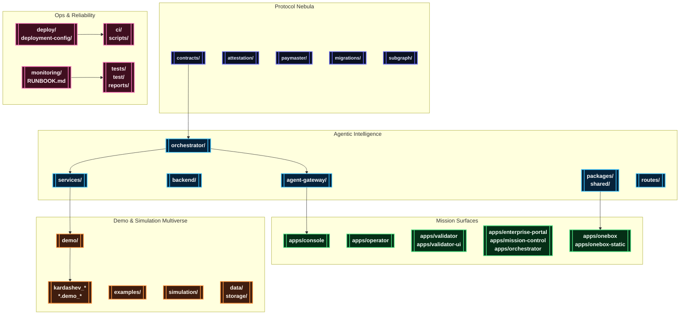

# AGIJobsv0

[](LICENSE)
[](https://github.com/MontrealAI/AGIJobsv0/actions/workflows/ci.yml)
[](https://github.com/MontrealAI/AGIJobsv0/actions/workflows/ci.yml?query=branch%3Amain+workflow%3A%22ci+%28v2%29%22)

> The interstellar reference stack for AGI Jobs — on-chain protocol, agentic intelligence fabric, cinematic demo multiverse, and sovereign-scale observability.

## 🧭 Table of Contents
- [🌌 Mission Brief](#-mission-brief)
- [🛰️ System Nebula](#-system-nebula)
- [🗂️ Repository Atlas](#-repository-atlas)
- [⚙️ Launch Procedures](#-launch-procedures)
  - [Requirements](#requirements)
  - [Install & Bootstrap](#install--bootstrap)
  - [Manual Bring-Up](#manual-bring-up)
  - [Mission Control via Docker Compose](#mission-control-via-docker-compose)
  - [Core Endpoints](#core-endpoints)
  - [Automation Playbooks](#automation-playbooks)
- [🎞️ Demo Constellation](#-demo-constellation)
  - [Launch & Operations](#launch--operations)
  - [Economics & Governance](#economics--governance)
  - [Culture, Experience & Media](#culture-experience--media)
  - [Sovereign & Kardashev Expeditions](#sovereign--kardashev-expeditions)
  - [Omega & Supra-Sovereign Ascension](#omega--supra-sovereign-ascension)
  - [Research & Simulation Labs](#research--simulation-labs)
- [🧬 Python Bridge Packages](#-python-bridge-packages)
- [🧪 Quality & Verification](#-quality--verification)
- [📡 Operations & Observability](#-operations--observability)
- [📚 Documentation Signals](#-documentation-signals)

## 🌌 Mission Brief
AGIJobsv0 fuses the entire AGI Jobs production stack into a single repository:

- **Upgradeable protocol nebula** of Solidity contracts, Foundry/Hardhat pipelines, EAS attestation flows, paymaster relays, and a dedicated subgraph indexer.
- **Agentic intelligence fabric** across orchestrators, FastAPI/Node services, validator swarms, HGM guardrails, analytics pipelines, and shared SDKs for both TypeScript and Python.
- **Mission surfaces** spanning Next.js HUDs for operators, validators, enterprise partners, orchestrator control rooms, and the OneBox mission runner.
- **Demo multiverse** with cinematic expeditions, sovereign-scale rituals, Monte-Carlo simulation kits, and narrative assets for every Kardashev tier.
- **Operations & observability** ready for mainnet: Docker Compose clusters, deployment playbooks, monitoring stacks, SBOM tooling, and runbooks for incident response.

Each subsystem coheres into a continuously learning, owner-directed intelligence engine that compounds strategic leverage beyond conventional capital frameworks, delivering the production-ready capabilities expected from a sovereign-scale AGI steward.

## 🛰️ System Nebula


## 🗂️ Repository Atlas
| Domain | Primary Paths | Highlights |
| --- | --- | --- |
| Protocol & Chain Control | [`contracts/`](contracts/), [`attestation/`](attestation/), [`paymaster/`](paymaster/), [`migrations/`](migrations/), [`subgraph/`](subgraph/) | Upgradeable solidity modules, Foundry/Hardhat orchestration, attestations, relayers, subgraph indexers, gas reports. |
| Agent Intelligence Fabric | [`orchestrator/`](orchestrator/), [`backend/`](backend/), [`agent-gateway/`](agent-gateway/), [`services/`](services/), [`routes/`](routes/), [`packages/`](packages/), [`shared/`](shared/) | Mission planners, FastAPI + Node microservices, validator swarms, storage adapters, reusable SDKs, shared finite state machines. |
| Mission Consoles & Portals | [`apps/console`](apps/console), [`apps/operator`](apps/operator), [`apps/validator`](apps/validator), [`apps/validator-ui`](apps/validator-ui), [`apps/enterprise-portal`](apps/enterprise-portal), [`apps/mission-control`](apps/mission-control), [`apps/orchestrator`](apps/orchestrator) | Next.js HUDs for operators, validators, partners, orchestrator command decks, and cinematic mission control. |
| OneBox Surfaces & Tooling | [`apps/onebox`](apps/onebox), [`apps/onebox-static`](apps/onebox-static), [`packages/onebox-*`](packages/), [`demo/One-Box`](demo/One-Box) | Self-contained runner, CLI diagnostics, orchestrator harness, Docker templates, validator readiness flows. |
| Demo Multiverse | [`demo/`](demo/), [`kardashev_*`](./), [`*.demo_*`](./), [`examples/`](examples/), [`simulation/`](simulation/), [`data/`](data/), [`storage/`](storage/) | Cinematic expeditions, Kardashev upgrades, Monte-Carlo toolkits, narrative datasets, cinematic exports. |
| Operations & Assurance | [`deploy/`](deploy/), [`deployment-config/`](deployment-config/), [`ci/`](ci/), [`monitoring/`](monitoring/), [`scripts/`](scripts/), [`tests/`](tests/), [`test/`](test/) | One-click infrastructure, CI guardrails, observability, integration suites, release tooling, SBOM automation. |
| Knowledge Base | [`docs/`](docs/), [`internal_docs/`](internal_docs/), [`RUNBOOK.md`](RUNBOOK.md), [`SECURITY.md`](SECURITY.md), [`MIGRATION.md`](MIGRATION.md), [`CHANGELOG.md`](CHANGELOG.md) | Architecture briefings, operations manuals, compliance dossiers, migration histories, cinematic treatments. |

## ⚙️ Launch Procedures

### Requirements
- **Node.js 20.18.1** (via `nvm use` from [`.nvmrc`](.nvmrc)) with npm 10.x.
- **Python 3.12+** with `pip` for agent services and Python-first demos.
- **Foundry** (`forge`, `anvil`) for contract compilation, fuzzing, and gas analysis.
- **Docker & Docker Compose** for one-click clusters.
- **Git LFS** for large demo payloads under [`data/`](data/) or [`storage/`](storage/) (optional).

### Install & Bootstrap
```bash
nvm install && nvm use
npm ci
python -m pip install --upgrade pip
python -m pip install -r requirements-python.txt
python -m pip install -r requirements-agent.txt
```
Additional demos include scoped `requirements.txt` files within their directories (for example `demo/AGIJobs-Day-One-Utility-Benchmark/requirements.txt`).

### Manual Bring-Up
```bash
# Build contracts, packages, and generated artifacts
npm run build

# Terminal 2 – launch a local chain
anvil --chain-id 31337 --block-time 2

# Terminal 3 – deploy protocol v2 and bootstrap modules
npx hardhat run --network localhost scripts/v2/deploy.ts

# Terminal 4 – start the Meta API surface
uvicorn services.meta_api.app.main:app --reload --port 8000

# Optional: mission consoles & services
npm run agent:gateway                 # Agent gateway REST/WebSocket bridge
npm run agent:validator               # Validator simulator
npm --prefix apps/console run dev     # Mission console (Next.js)
npm --prefix apps/operator run dev    # Operator dashboard
npm --prefix apps/validator-ui run dev
```
Consult [`docs/quick-start.md`](docs/quick-start.md), [`docs/AGENTIC_QUICKSTART.md`](docs/AGENTIC_QUICKSTART.md), and [`docs/onebox/`](docs/onebox/) for wallet setup, validator keys, and orchestrator configuration.

### Mission Control via Docker Compose
```bash
cp deployment-config/oneclick.env.example deployment-config/oneclick.env
# Populate RPC URLs, private keys, relayer secrets, telemetry tokens

docker compose up --build
```
Use `docker compose down -v` to reset the cluster. Compose wiring draws defaults from [`deployment-config/oneclick.env`](deployment-config/oneclick.env).

### Core Endpoints
| Service | Default URL | Notes |
| --- | --- | --- |
| Local Anvil testnet | `http://localhost:8545` | Hardhat/Foundry-compatible development chain. |
| Meta API (FastAPI) | `http://localhost:8000` | Mission telemetry, orchestrator analytics, OneBox health. |
| Orchestrator/OneBox APIs | `http://localhost:8080` | Unified orchestration ingress and OneBox runner services. |
| Agent Gateway | `http://localhost:8090` | REST + WebSocket bridge for agent swarms. |
| Mission Console UI | `http://localhost:3000` | Primary operator HUD (`apps/console`). |
| Enterprise Portal | `http://localhost:3001` | Partner & enterprise oversight (`apps/enterprise-portal`). |

### Automation Playbooks
- `Makefile` targets cover culture deployments (`make culture-bootstrap`), HGM guardrails (`make demo-hgm`), and Absolute Zero simulations (`make absolute-zero-demo`).
- [`scripts/`](scripts/) bundles deployment aides, CI verifiers, sovereign readiness checks, and cinematic export tooling.
- Owner consoles stay empowered through the [`owner:*`](package.json) script constellation (`owner:mission-control`, `owner:update-all`, `owner:system-pause`, etc.), wiring directly into the `OwnerConfigurator` facade so the contract owner can retune parameters, rotate governance, or pause the network without touching Solidity.
- [`examples/`](examples/) contains agentic starter kits (validator swarms, orchestration loops) runnable via `npm run agent:*` scripts.

## 🎞️ Demo Constellation
```mermaid
%% Celestial demo atlas
mindmap
  classDef launch fill:#0f172a,stroke:#38bdf8,color:#e0f2fe,font-weight:bold,stroke-width:2px;
  classDef economics fill:#1f2937,stroke:#f97316,color:#fff7ed,font-weight:bold,stroke-width:2px;
  classDef culture fill:#22092c,stroke:#f472b6,color:#fff0f6,font-weight:bold,stroke-width:2px;
  classDef sovereign fill:#1c1917,stroke:#facc15,color:#fef9c3,font-weight:bold,stroke-width:2px;
  classDef omega fill:#111827,stroke:#a855f7,color:#ede9fe,font-weight:bold,stroke-width:2px;
  classDef research fill:#052e16,stroke:#4ade80,color:#f0fdf4,font-weight:bold,stroke-width:2px;
  classDef galaxy fill:#0f172a,stroke:#f8fafc,color:#e2e8f0,font-size:22px,font-weight:bold,stroke-width:3px;

  root((🌌 Demo Constellation)):::galaxy
    "Launchpad 🚀":::launch
      "AGI-Alpha-Node-v0"
      "Validator-Constellation-v0"
      "AGIJobs-Day-One-Utility-Benchmark"
      "Meta-Agentic-ALPHA-AGI-Jobs-v0"
      "asi-global"
      "asi-takeoff"
      "One-Box"
    "Economics & Governance 💱":::economics
      "Economic-Power-v0"
      "Trustless-Economic-Core-v0"
      "AGI-Jobs-Platform-at-Kardashev-II-Scale"
      "REDENOMINATION"
      "Phase-6-Scaling-Multi-Domain-Expansion"
      "Phase-8-Universal-Value-Dominance"
    "Culture & Experience ✨":::culture
      "Era-Of-Experience-v0"
      "CULTURE-v0"
      "AlphaEvolve-v0"
      "AlphaEvolve_v0"
      "aurora"
      "ICONIC-OPERATING-SYSTEM-DEMO"
    "Sovereign & Kardashev 👑":::sovereign
      "Planetary-Orchestrator-Fabric-v0"
      "sovereign-constellation"
      "sovereign-mesh"
      "zenith-sapience-initiative-*"
      "validator_constellation_v0"
    "Omega & Ascension 🜂":::omega
      "Kardashev-II Omega-Grade-α-AGI Business-3"
      "Meta-Agentic-Program-Synthesis-v0"
      "CELESTIAL-SOVEREIGN-ORBITAL-AGI-OS-GRAND-DEMONSTRATION"
      "OMNIPHOENIX-ASCENDANT-HYPERSTRUCTURE"
      "OMNIGENESIS-GLOBAL-SOVEREIGN-SYMPHONY"
      "astral-omnidominion-operating-system"
      "imperatrix-celestia-operating-system"
      "cosmic-omni-sovereign-symphony"
    "Research & Simulation 🔬":::research
      "Absolute-Zero-Reasoner-v0"
      "MuZero-style-v0"
      "Open-Endedness-v0"
      "Tiny-Recursive-Model-v0"
      "Simulation Toolkit"
```

The `demo/` directory hosts cinematic launches, CLI simulations, dashboards, and scripted walkthroughs. Many scenarios expose npm scripts, Makefile targets, or Python entrypoints for fast reproduction.

### Launch & Operations
| Demo | Location | Quick Launch |
| --- | --- | --- |
| AGI Alpha Node | [`demo/AGI-Alpha-Node-v0`](demo/AGI-Alpha-Node-v0) | `npm run demo:agi-alpha-node` (TypeScript CLI) or `npm run demo:agi-alpha-node:prod`. |
| Validator Constellation | [`demo/Validator-Constellation-v0`](demo/Validator-Constellation-v0) | `npm run demo:validator-constellation` or `npm run demo:validator-constellation:scenario`. |
| AGIJobs Day One Utility Benchmark | [`demo/AGIJobs-Day-One-Utility-Benchmark`](demo/AGIJobs-Day-One-Utility-Benchmark) | `make -C demo/AGIJobs-Day-One-Utility-Benchmark e2e` or `python demo/AGIJobs-Day-One-Utility-Benchmark/run_demo.py e2e`. |
| Meta-Agentic Alpha AGI | [`demo/Meta-Agentic-ALPHA-AGI-Jobs-v0`](demo/Meta-Agentic-ALPHA-AGI-Jobs-v0) | `npm run demo:meta-agentic-alpha`. |
| AGI Governance Briefings | [`demo/agi-governance`](demo/agi-governance) | `npm run demo:agi-governance:full` for cinematic walkthroughs or `npm run demo:agi-governance:ci` in headless mode. |
| ASI Launch Programs | [`demo/asi-global`](demo/asi-global), [`demo/asi-takeoff`](demo/asi-takeoff) | `npm run demo:asi-global` / `npm run demo:asi-takeoff` (kits, control rooms, scripted exports). |
| OneBox Mission Runner | [`demo/One-Box`](demo/One-Box) | `npm run demo:onebox:doctor` then `npm run demo:onebox:launch`; Docker users: `docker compose -f demo/One-Box/docker-compose.yaml up`. |

### Economics & Governance
| Demo | Location | Quick Launch |
| --- | --- | --- |
| Economic Power | [`demo/Economic-Power-v0`](demo/Economic-Power-v0) | `npm run demo:economic-power` (supports scenario flags). |
| Trustless Economic Core | [`demo/Trustless-Economic-Core-v0`](demo/Trustless-Economic-Core-v0) | `npm run run:trustless-core`. |
| AGI Jobs Platform at Kardashev-II Scale | [`demo/AGI-Jobs-Platform-at-Kardashev-II-Scale`](demo/AGI-Jobs-Platform-at-Kardashev-II-Scale) | `npm run demo:kardashev-ii:orchestrate` and lattice variants. |
| REDENOMINATION & macro transitions | [`demo/REDENOMINATION`](demo/REDENOMINATION) | `npm run demo:redenomination` plus guardian/mission control scripts. |
| Scaling Programs | [`demo/Phase-6-Scaling-Multi-Domain-Expansion`](demo/Phase-6-Scaling-Multi-Domain-Expansion), [`demo/Phase-8-Universal-Value-Dominance`](demo/Phase-8-Universal-Value-Dominance) | `npm run demo:phase6:*` / `npm run demo:phase8:*` for orchestrations, IoT sims, DID audits. |

### Culture, Experience & Media
| Demo | Location | Quick Launch |
| --- | --- | --- |
| Era of Experience | [`demo/Era-Of-Experience-v0`](demo/Era-Of-Experience-v0) | `npm run demo:era-of-experience` or `npm run demo:era-of-experience:audit`. |
| CULTURE v0 | [`demo/CULTURE-v0`](demo/CULTURE-v0) | Narrative assets, generative culture loops, CLI utilities. |
| AlphaEvolve Suite | [`demo/AlphaEvolve-v0`](demo/AlphaEvolve-v0), [`demo/AlphaEvolve_v0`](demo/AlphaEvolve_v0) | Evolutionary scripts, governance notes, multimedia staging. |
| Aurora Media Suite | [`demo/aurora`](demo/aurora) | `npm run demo:aurora:local` or `npm run demo:aurora:report` for cinematic exports. |
| Iconic Atlases | [`demo/ICONIC-OPERATING-SYSTEM-DEMO`](demo/ICONIC-OPERATING-SYSTEM-DEMO), [`demo/astral-citadel`](demo/astral-citadel) | Visual design boards, cinematic treatments, mission scripts. |

### Sovereign & Kardashev Expeditions
| Demo | Location | Quick Launch |
| --- | --- | --- |
| Planetary Orchestrator Fabric | [`demo/Planetary-Orchestrator-Fabric-v0`](demo/Planetary-Orchestrator-Fabric-v0) | `npm run demo:planetary-orchestrator-fabric` plus CI/restart drills. |
| Sovereign Constellation Atlases | [`demo/sovereign-constellation`](demo/sovereign-constellation), [`demo/sovereign-mesh`](demo/sovereign-mesh) | `npm run demo:sovereign-constellation` + flight plans. |
| Zenith Sapience Initiatives | [`demo/zenith-sapience-*`](demo) | Planetary & supra-sovereign governance frameworks with cinematic briefs. |
| Validator Constellation Atlas | [`demo/validator_constellation_v0`](demo/validator_constellation_v0) | Supplemental validator strategy assets and notebooks. |

### Omega & Supra-Sovereign Ascension
| Demo | Location | Quick Launch |
| --- | --- | --- |
| Omega Grade Business 3 | [`demo/Kardashev-II Omega-Grade-α-AGI Business-3`](demo/Kardashev-II%20Omega-Grade-%CE%B1-AGI%20Business-3) and [`kardashev_ii_omega_grade_alpha_agi_business_3_demo*`](./) | `python -m kardashev_ii_omega_grade_alpha_agi_business_3_demo.cli launch --config ...` plus v2–v5/ultra/k2/omega variants. |
| Meta Agentic Program Synthesis | [`demo/Meta-Agentic-Program-Synthesis-v0`](demo/Meta-Agentic-Program-Synthesis-v0) | `npm run demo:meta-agentic-program-synthesis` for synthesis pipelines. |
| Celestial Sovereign Grand Demonstration | [`demo/CELESTIAL-SOVEREIGN-ORBITAL-AGI-OS-GRAND-DEMONSTRATION`](demo/CELESTIAL-SOVEREIGN-ORBITAL-AGI-OS-GRAND-DEMONSTRATION) | Orbital sovereign OS showcase. |
| Omni Ascension Suite | [`demo/OMNIPHOENIX-ASCENDANT-HYPERSTRUCTURE`](demo/OMNIPHOENIX-ASCENDANT-HYPERSTRUCTURE), [`demo/OMNIGENESIS-GLOBAL-SOVEREIGN-SYMPHONY`](demo/OMNIGENESIS-GLOBAL-SOVEREIGN-SYMPHONY), [`demo/omni-sovereign-ascension-operating-system`](demo/omni-sovereign-ascension-operating-system) | Hyperstructure playbooks, operator matrices, cinematic scripts. |
| Cosmic & Infinity Symphonies | [`demo/cosmic-omni-sovereign-symphony`](demo/cosmic-omni-sovereign-symphony), [`demo/cosmic-omniversal-grand-symphony`](demo/cosmic-omniversal-grand-symphony), [`demo/infinity-symphony`](demo/infinity-symphony), [`demo/omnisovereign`](demo/omnisovereign) | Multi-phase scorecards, orchestration artbooks, narrative missions. |
| Astral Omnidominion & Imperatrix | [`demo/astral-omnidominion-operating-system`](demo/astral-omnidominion-operating-system), [`demo/astral-omnidominion-operating-system-command-theatre`](demo/astral-omnidominion-operating-system-command-theatre), [`demo/imperatrix-celestia-operating-system`](demo/imperatrix-celestia-operating-system), [`demo/omni-orchestrator-singularity`](demo/omni-orchestrator-singularity) | Command theatres, sovereignty OS suites, orchestrator matrices. |

### Research & Simulation Labs
| Demo | Location | Quick Launch |
| --- | --- | --- |
| Absolute Zero Reasoner | [`demo/Absolute-Zero-Reasoner-v0`](demo/Absolute-Zero-Reasoner-v0) | `make absolute-zero-demo` provisions a virtualenv and runs the simulation. |
| MuZero-style Mission | [`demo/MuZero-style-v0`](demo/MuZero-style-v0) | Reinforcement learning orchestrations & evaluation notebooks. |
| Open Endedness | [`demo/Open-Endedness-v0`](demo/Open-Endedness-v0) | Evolutionary sandboxes and meta-learning scripts. |
| Tiny Recursive Model | [`demo/Tiny-Recursive-Model-v0`](demo/Tiny-Recursive-Model-v0) | Minimal recursion demos, notebooks, policy sketches. |
| Simulation Toolkit | [`simulation/`](simulation/) | Sharded Monte Carlo harnesses, `python simulation/run_sharded_simulation.py`. |

## 🧬 Python Bridge Packages
Root-level packages such as [`kardashev_ii_omega_grade_alpha_agi_business_3_demo`](kardashev_ii_omega_grade_alpha_agi_business_3_demo) re-export their sibling `demo/…` modules. Installable via `pip -e .`, they enable `python -m ...` execution while keeping cinematic assets within [`demo/`](demo/).

## 🧪 Quality & Verification
- `npm run lint`, `npm run webapp:typecheck`, and `npm run webapp:e2e` guard the Next.js surfaces.
- `npm run test` executes Hardhat unit tests; `forge test` uses Foundry profiles from [`foundry.toml`](foundry.toml).
- `PYTEST_DISABLE_PLUGIN_AUTOLOAD=1 pytest` covers Python demos (`tests/`, `test/`, `demo/*/test/`).
- `npm run pretest` orchestrates cross-surface smoke suites, including OneBox diagnostics and demo verifiers.
- `npm run sbom:generate`, `npm run security:audit`, and `npm run release:manifest:validate` provide supply-chain checks.
- `npm run ci:verify-branch-protection` interrogates GitHub branch rules to ensure every `ci (v2)` gate remains enforced before merges land.
- Coverage, gas, and scenario reports live in [`reports/`](reports/) and [`gas-snapshots/`](gas-snapshots/).

### CI v2 — enforced gates
`ci (v2)` now requires every surfaced check on pull requests and the `main` branch. The branch-protection guard asserts that the following contexts stay locked before merges are allowed:

| Required check | Purpose |
| --- | --- |
| `ci (v2) / Lint & static checks` | ESLint, Prettier, sentinel templates, and toolchain verification. |
| `ci (v2) / Tests` | Hardhat unit tests, ABI drift detection, and contract compilation. |
| `ci (v2) / Python unit tests` | FastAPI, orchestrator, and simulation module unit coverage with 90%+ enforcement. |
| `ci (v2) / Python integration tests` | Cross-service API flows, demo harnesses, and analytics routes. |
| `ci (v2) / Load-simulation reports` | Monte Carlo sweeps for treasury burn/fee thermodynamics. |
| `ci (v2) / Python coverage enforcement` | Aggregated unit + integration coverage gating. |
| `ci (v2) / HGM guardrails` | High Governance Machine regression suite across orchestrators and demos. |
| `ci (v2) / Foundry` | Forge-based fuzzing and ffi-enabled contract test battery. |
| `ci (v2) / Coverage thresholds` | JavaScript/TypeScript lcov enforcement for shared packages. |
| `ci (v2) / Phase 6 readiness` | Manifest and UI validation for Phase 6 expedition surfaces. |
| `ci (v2) / Phase 8 readiness` | Phase 8 cinematic manifest verification. |
| `ci (v2) / Kardashev II readiness` | Kardashev-scale readiness drills and operator UX checks. |
| `ci (v2) / ASI Take-Off Demonstration` | Deterministic launch of the ASI take-off cinematic scenario. |
| `ci (v2) / Zenith Sapience Demonstration` | Hyper-scale Zenith rehearsal, including local validator orchestration. |
| `ci (v2) / AGI Labor Market Grand Demo` | Sovereign labour-market export suite with transcript artefacts. |
| `ci (v2) / Sovereign Mesh Demo — build` | Sovereign Mesh orchestrator backend and console builds. |
| `ci (v2) / Sovereign Constellation Demo — build` | Sovereign Constellation deterministic build verification. |
| `ci (v2) / Celestial Archon Demonstration` | Celestial Archon sovereign rehearsal (deterministic + local). |
| `ci (v2) / Hypernova Governance Demonstration` | Zenith Hypernova deterministic and local rehearsals. |
| `ci (v2) / Branch protection guard` | Automated API audit of repository branch rules. |
| `ci (v2) / CI summary` | Run-level digest capturing each job’s result and artefact pointers. |
| `ci (v2) / Invariant tests` | Foundry invariant fuzzing for protocol safety envelopes. |

## 📡 Operations & Observability
- One-click deployments and infrastructure recipes reside in [`deploy/`](deploy/) and [`deployment-config/`](deployment-config/).
- Alerting, notification, sentinel, and thermostat services operate under [`services/alerting`](services/alerting), [`services/notifications`](services/notifications), [`services/sentinel`](services/sentinel), and [`services/thermostat`](services/thermostat).
- Runtime telemetry, Prometheus metrics, and Grafana dashboards are curated in [`monitoring/`](monitoring/).
- [`RUNBOOK.md`](RUNBOOK.md) and [`docs/AGIJobs-v2-Mainnet-Guide.md`](docs/AGIJobs-v2-Mainnet-Guide.md) provide production playbooks and on-call drills.

## 📚 Documentation Signals
Explore the knowledge base for deeper dives:

- [`docs/AGI_Jobs_v0_Whitepaper_v2.md`](docs/AGI_Jobs_v0_Whitepaper_v2.md) – protocol thesis and economic primitives.
- [`docs/AGIJobsAlphav3.md`](docs/AGIJobsAlphav3.md) – historical release dossiers and architecture notes.
- [`docs/owner-control-quick-reference.md`](docs/owner-control-quick-reference.md) & [`docs/owner-control-quick-reference-cli.md`](docs/owner-control-quick-reference-cli.md) – owner command checklists.
- [`MIGRATION.md`](MIGRATION.md), [`CHANGELOG.md`](CHANGELOG.md), and [`SECURITY.md`](SECURITY.md) – governance over upgrades, releases, security posture.
- [`internal_docs/`](internal_docs/) – mission scripts, design reviews, sovereign readiness dossiers.

---

Licensed under the [MIT License](LICENSE).
