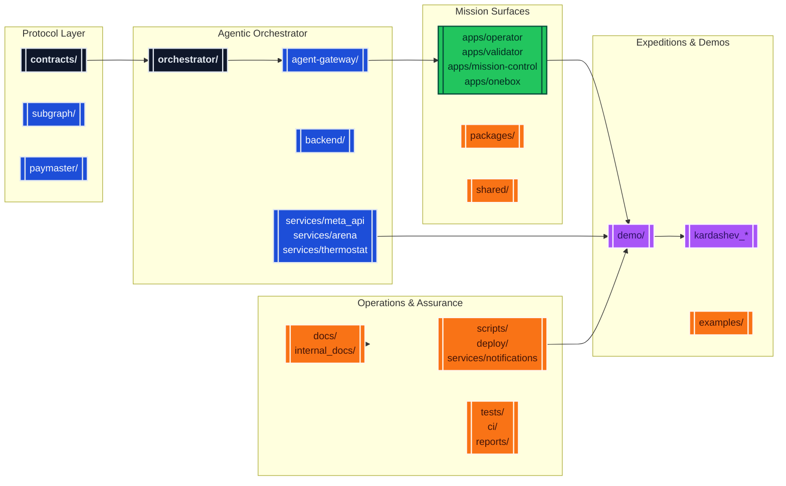
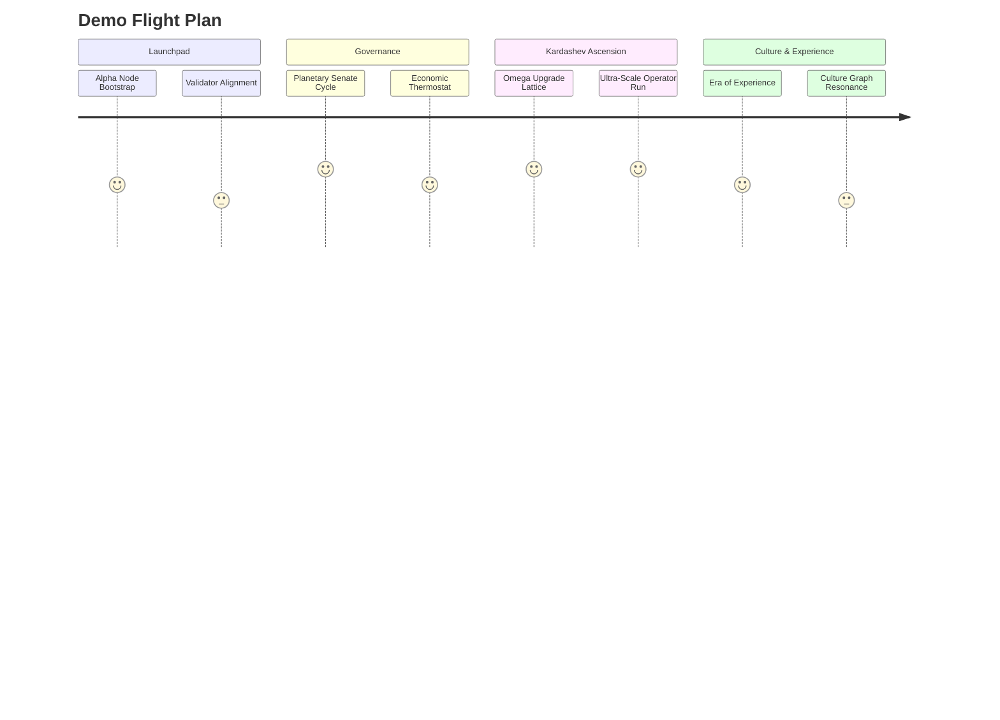

# AGIJobsv0

[](LICENSE)
[](https://github.com/MontrealAI/AGIJobsv0/actions/workflows/ci.yml)
[](https://github.com/MontrealAI/AGIJobsv0/actions/workflows/ci.yml?query=branch%3Amain+workflow%3A%22ci+%28v2%29%22)

The AGIJobsv0 monorepo delivers the production reference stack for the AGI Jobs protocol: upgradeable Ethereum smart contracts, multi-agent orchestrators, validator/owner consoles, mission control services, and an expansive gallery of cinematic demos that explore the labour markets of post-scarcity civilizations.



## Table of Contents

- [Platform Overview](#platform-overview)
- [Repository Atlas](#repository-atlas)
- [Getting Started](#getting-started)
  - [Prerequisites](#prerequisites)
  - [Install Dependencies](#install-dependencies)
  - [Manual Bring-up](#manual-bring-up)
  - [Docker Compose Launch](#docker-compose-launch)
- [Demo Command Deck](#demo-command-deck)
  - [Launchpad Demos](#launchpad-demos)
  - [Governance & Economic Simulations](#governance--economic-simulations)
  - [Kardashev-Class Expeditions](#kardashev-class-expeditions)
  - [Experience, Culture & Research Labs](#experience-culture--research-labs)
  - [Verification & Health Checks](#verification--health-checks)
- [Quality Gates](#quality-gates)
- [Documentation & Operations](#documentation--operations)
- [Contributing & Support](#contributing--support)

## Platform Overview

AGIJobsv0 packages the contracts, data plane, and agent intelligence that power an autonomous labour market. The repository includes:

- **Upgradeable protocol contracts** under [`contracts/`](contracts/) with Foundry and Hardhat flows, circuit breakers, and staging migrations in [`migrations/`](migrations/).
- **Orchestration intelligence** in [`orchestrator/`](orchestrator/), [`backend/`](backend/), and [`agent-gateway/`](agent-gateway/) for mission planning, telemetry, and validator APIs.
- **Operational surfaces** in [`apps/`](apps/) (Operator Console, Validator UI, Mission Control, Enterprise Portal, OneBox, Orchestrator HUD) powered by reusable packages in [`packages/`](packages/) and [`shared/`](shared/).
- **Service mesh** modules in [`services/`](services/) (meta API, arena, thermostat, culture graph, notifications, sentinel, alerting) with deployment automation in [`deploy/`](deploy/) and [`compose.yaml`](compose.yaml).
- **Expansive demos** in [`demo/`](demo/) and Kardashev-class Python suites (`kardashev_*`) that showcase orchestrated economies across stellar civilizations.

## Repository Atlas

| Domain | Key paths | Highlights |
| --- | --- | --- |
| Protocol & Chain | [`contracts/`](contracts/), [`migrations/`](migrations/), [`subgraph/`](subgraph/), [`paymaster/`](paymaster/), [`attestation/`](attestation/) | Solidity core, Foundry fuzzing, Hardhat deployments, subgraph indexers, EAS attestation flows. |
| Agent Intelligence | [`orchestrator/`](orchestrator/), [`backend/`](backend/), [`agent-gateway/`](agent-gateway/), [`services/meta_api`](services/meta_api), [`services/arena`](services/arena) | Mission planners, scoring engines, FastAPI routers, telemetry streaming, arena simulations. |
| Experience Surfaces | [`apps/operator`](apps/operator), [`apps/validator`](apps/validator), [`apps/mission-control`](apps/mission-control), [`apps/onebox`](apps/onebox), [`apps/orchestrator`](apps/orchestrator) | Next.js/React consoles, real-time dashboards, orchestrator supervision HUDs. |
| Shared Libraries | [`packages/`](packages/), [`shared/`](shared/), [`lib/`](lib/), [`tools/`](tools/) | TypeScript SDKs, contract bindings, CLI helpers, analytics libraries. |
| Data & Simulation | [`simulation/`](simulation/), [`storage/`](storage/), [`reports/`](reports/), [`data/`](data/), [`examples/`](examples/) | Monte Carlo load tests, coverage & SBOM artefacts, dataset staging, minimal client scripts. |
| Demos & Expeditions | [`demo/`](demo/), [`kardashev_*`](./), [`kardashev_ii_omega_grade_alpha_agi_business_3_demo`](kardashev_ii_omega_grade_alpha_agi_business_3_demo) and variants | Narrative missions, Kardashev Omega upgrades, ultra-scale operator runs, CI harnesses. |
| Operations | [`docs/`](docs/), [`internal_docs/`](internal_docs/), [`scripts/`](scripts/), [`ci/`](ci/), [`RUNBOOK.md`](RUNBOOK.md), [`SECURITY.md`](SECURITY.md) | Deployment handbooks, incident response, automation scripts, CI policies. |

## Getting Started

### Prerequisites

- Node.js 20.18.1 (`nvm use` picks the pinned version in [`.nvmrc`](.nvmrc)).
- npm 10+
- Python 3.12 with `pip`
- Foundry toolchain (`forge`, `anvil`) and Docker (for the full stack).

### Install Dependencies

```bash
# Install Node/TypeScript dependencies
npm ci

# Bootstrap Python tooling for orchestrator, demos, and analytics
python -m pip install --upgrade pip
python -m pip install -r requirements-python.txt
```

### Manual Bring-up

```bash
# Compile contracts and generate shared TypeScript constants
npm run build

# (new terminal) Launch a local Anvil chain
anvil --chain-id 31337 --block-time 2

# Deploy the v2 contract system locally
npx hardhat run --network localhost scripts/v2/deploy.ts

# Start the meta API with orchestrator routes
uvicorn services.meta_api.app.main:create_app --reload --port 8000

# Optional: bring up gateway & validator tooling
npm run agent:gateway
npm run agent:validator
```

Consult [`docs/quick-start.md`](docs/quick-start.md) for owner role provisioning, identity wallets, and validator alignment.

### Docker Compose Launch

```bash
cp deployment-config/oneclick.env.example deployment-config/oneclick.env  # customise secrets
docker compose up --build
```

Exposed services:

- `http://localhost:8545` – Anvil testnet
- `http://localhost:8000` – Meta API (FastAPI)
- `http://localhost:8080` – Orchestrator + OneBox endpoints
- `http://localhost:8090` – Agent Gateway
- `http://localhost:3000` – Validator UI
- `http://localhost:3001` – Enterprise Portal

All Compose services consume [`deployment-config/oneclick.env`](deployment-config/oneclick.env) for contract addresses and relayer secrets.

## Demo Command Deck

The `demo/` root and Kardashev Python packages deliver deep-narrative simulations, each with launch scripts, telemetry exports, and CI harnesses. After installing Node and Python dependencies, use the `npm run demo:*` commands (TypeScript missions) or the packaged Python CLIs for Kardashev campaigns.



### Launchpad Demos

| Demo | Directory | Command |
| --- | --- | --- |
| AGI Alpha Node v0 | [`demo/AGI-Alpha-Node-v0/`](demo/AGI-Alpha-Node-v0/) | `npm run demo:agi-alpha-node` |
| OneBox Mission Runner | [`demo/One-Box/`](demo/One-Box/) | `npm run demo:onebox:launch` |
| Validator Constellation v0 | [`demo/Validator-Constellation-v0/`](demo/Validator-Constellation-v0/) | `npm run demo:validator-constellation` |
| AGI Labor Market Control Room | [`demo/agi-labor-market-grand-demo/`](demo/agi-labor-market-grand-demo/) | `npm run demo:agi-labor-market:control-room` |
| AGI OS First-Class Experience | [`scripts/v2/agiOsFirstClassDemo.ts`](scripts/v2/agiOsFirstClassDemo.ts) | `npm run demo:agi-os:first-class` |

### Governance & Economic Simulations

| Demo | Directory | Command |
| --- | --- | --- |
| AGI Governance (Alpha) | [`demo/agi-governance/`](demo/agi-governance/) | `npm run demo:agi-governance:full` |
| Economic Power v0 | [`demo/Economic-Power-v0/`](demo/Economic-Power-v0/) | `npm run demo:economic-power` |
| Meta-Agentic Program Synthesis | [`demo/Meta-Agentic-Program-Synthesis-v0/`](demo/Meta-Agentic-Program-Synthesis-v0/) | `npm run demo:meta-agentic-program-synthesis:full` |
| National Supply Chain | [`demo/National-Supply-Chain-v0/`](demo/National-Supply-Chain-v0/) | `npm run demo:national-supply-chain:control-room` |
| Redenomination Guardian Drill | [`demo/REDENOMINATION/`](demo/REDENOMINATION/) | `npm run demo:redenomination:guardian-drill` |

### Kardashev-Class Expeditions

| Expedition | Package | Launch |
| --- | --- | --- |
| Kardashev II Platform Orchestration | [`demo/AGI-Jobs-Platform-at-Kardashev-II-Scale/`](demo/AGI-Jobs-Platform-at-Kardashev-II-Scale/) | `npm run demo:kardashev-ii:orchestrate` |
| Stellar Civilization Lattice | [`demo/AGI-Jobs-Platform-at-Kardashev-II-Scale/stellar-civilization-lattice/`](demo/AGI-Jobs-Platform-at-Kardashev-II-Scale/stellar-civilization-lattice/) | `npm run demo:kardashev-ii-lattice:orchestrate` |
| Kardashev Ω Upgrade (TypeScript orchestration) | [`demo/AGI-Jobs-Platform-at-Kardashev-II-Scale/scripts/`](demo/AGI-Jobs-Platform-at-Kardashev-II-Scale/scripts/) | `npm run demo:kardashev` |
| Kardashev Ω Operator Mesh | [`demo/Kardashev-II Omega-Grade-α-AGI Business-3/kardashev_ii_omega_grade_alpha_agi_business_3_demo_omega`](demo/Kardashev-II%20Omega-Grade-%CE%B1-AGI%20Business-3/kardashev_ii_omega_grade_alpha_agi_business_3_demo_omega) | `npm run demo:kardashev-ii-omega-operator` |
| Kardashev Ω Upgrade (v3) | [`demo/Kardashev-II Omega-Grade-α-AGI Business-3/kardashev_ii_omega_grade_upgrade_for_alpha_agi_business_3_demo_v3`](demo/Kardashev-II%20Omega-Grade-%CE%B1-AGI%20Business-3/kardashev_ii_omega_grade_upgrade_for_alpha_agi_business_3_demo_v3) | `npm run demo:kardashev-ii-omega-upgrade-v3` |
| Kardashev Ω Upgrade (v5) | [`demo/Kardashev-II Omega-Grade-α-AGI Business-3/kardashev_ii_omega_grade_upgrade_for_alpha_agi_business_3_demo_v5`](demo/Kardashev-II%20Omega-Grade-%CE%B1-AGI%20Business-3/kardashev_ii_omega_grade_upgrade_for_alpha_agi_business_3_demo_v5) | `npm run demo:kardashev-ii-omega-upgrade-v5` |
| Kardashev Ω Ultra Run | [`demo/Kardashev-II Omega-Grade-α-AGI Business-3/kardashev_ii_omega_grade_alpha_agi_business_3_demo_ultra`](demo/Kardashev-II%20Omega-Grade-%CE%B1-AGI%20Business-3/kardashev_ii_omega_grade_alpha_agi_business_3_demo_ultra) | `npm run demo:kardashev-ii-omega-ultra` |
| Kardashev Ω K2 Campaign | [`demo/Kardashev-II Omega-Grade-α-AGI Business-3/kardashev_ii_omega_grade_alpha_agi_business_3_demo_k2`](demo/Kardashev-II%20Omega-Grade-%CE%B1-AGI%20Business-3/kardashev_ii_omega_grade_alpha_agi_business_3_demo_k2) | `npm run demo:kardashev-ii-omega-k2` |
| Kardashev Ω Omega-III Runtime | [`demo/Kardashev-II Omega-Grade-α-AGI Business-3`](demo/Kardashev-II%20Omega-Grade-%CE%B1-AGI%20Business-3) | `npm run demo:kardashev-omega-iii:run` |

> **Tip:** Each Kardashev package ships `ci`, `status`, and `owner` entrypoints. Append `ci`, `status`, or `owner` to the command for automated verification, health monitoring, or operator dashboards.

### Experience, Culture & Research Labs

| Demo | Directory | Command |
| --- | --- | --- |
| Era of Experience v0 | [`demo/Era-Of-Experience-v0/`](demo/Era-Of-Experience-v0/) | `npm run demo:era-of-experience` |
| Planetary Orchestrator Fabric v0 | [`demo/Planetary-Orchestrator-Fabric-v0/`](demo/Planetary-Orchestrator-Fabric-v0/) | `npm run demo:planetary-orchestrator-fabric` |
| Sovereign Constellation Atlas | [`demo/sovereign-constellation/`](demo/sovereign-constellation/) | `npm run demo:sovereign-constellation:atlas` |
| Zenith Hypernova | [`demo/zenith-sapience-initiative-supra-sovereign-hypernova-governance/`](demo/zenith-sapience-initiative-supra-sovereign-hypernova-governance/) | `npm run demo:zenith-hypernova:local` |
| Zenith Sapience Planetary OS | [`demo/zenith-sapience-initiative-planetary-operating-system-governance/`](demo/zenith-sapience-initiative-planetary-operating-system-governance/) | `npm run demo:zenith-sapience-planetary-os:local` |

Search for `"demo:"` inside [`package.json`](package.json) to discover the full mission catalog, including celestial sovereignty arcs, zenith sapience suites, and cinematic orchestration runs.

### Verification & Health Checks

Many demos provide automated verification scripts:

```bash
npm run test:agi-alpha-node
npm run test:validator-constellation
npm run test:economic-power
npm run test:era-of-experience
python -m demo.kardashev_ii_omega_grade_alpha_agi_business_3_demo_ultra ci --config demo/'Kardashev-II Omega-Grade-α-AGI Business-3'/kardashev_ii_omega_grade_alpha_agi_business_3_demo_ultra/config/mission.json
```

Python-heavy demos expose pytest suites in [`tests/demo/`](tests/demo/) and within each demo directory (for example [`demo/Huxley-Godel-Machine-v0/tests/`](demo/Huxley-Godel-Machine-v0/tests/)).

## Quality Gates

Run the same checks enforced in CI before opening a pull request:

```bash
# Contract artefacts and generated types
npm run compile

# TypeScript linting and tests
npm run lint
npm run test

# Front-end bundles and accessibility smoke tests
npm run pretest

# Python unit + integration coverage
COVERAGE_FILE=.coverage.unit coverage run --rcfile=.coveragerc -m pytest \
  test/paymaster \
  test/tools \
  test/orchestrator \
  test/simulation
COVERAGE_FILE=.coverage.unit coverage run --rcfile=.coveragerc --append -m pytest tests
COVERAGE_FILE=.coverage.unit coverage run --rcfile=.coveragerc --append -m pytest demo/Huxley-Godel-Machine-v0/tests
COVERAGE_FILE=.coverage.integration coverage run --rcfile=.coveragerc -m pytest \
  test/routes/test_agents.py \
  test/routes/test_analytics.py \
  test/routes/test_onebox_health.py \
  test/demo \
  demo/Meta-Agentic-Program-Synthesis-v0/meta_agentic_demo/tests

coverage combine .coverage.unit .coverage.integration
coverage report --rcfile=.coveragerc
```

Add Foundry fuzzing with `forge test` inside [`contracts/`](contracts/) and execute Cypress end-to-end coverage via `npm run webapp:e2e`.

## Documentation & Operations

- **Architecture & Overview:** [`docs/overview.md`](docs/overview.md), [`docs/architecture-v2.md`](docs/architecture-v2.md).
- **Deployment Guides:** [`docs/v2-deployment-and-operations.md`](docs/v2-deployment-and-operations.md), [`docs/deployment-production-guide.md`](docs/deployment-production-guide.md), [`docs/DEPLOYED_ADDRESSES.md`](docs/DEPLOYED_ADDRESSES.md).
- **Owner & Validator Operations:** [`docs/owner-control-handbook.md`](docs/owner-control-handbook.md) plus the suite of `docs/owner-control-*.md` guides.
- **OneBox & Experience Docs:** [`docs/onebox/`](docs/onebox/), [`docs/onebox-ux.md`](docs/onebox-ux.md).
- **Agent Gateway & Examples:** [`docs/agent-gateway.md`](docs/agent-gateway.md), [`examples/agentic/`](examples/agentic/).
- **Security & Compliance:** [`docs/security/`](docs/security/), [`SECURITY.md`](SECURITY.md), [`RUNBOOK.md`](RUNBOOK.md), [`CHANGELOG.md`](CHANGELOG.md), [`MIGRATION.md`](MIGRATION.md).

## Contributing & Support

1. Fork the repository and branch off `main`.
2. Follow the [Quality Gates](#quality-gates) checklist locally.
3. Open a pull request—ensure the `ci (v2)` workflow succeeds.

Responsible disclosure lives in [`SECURITY.md`](SECURITY.md). For operational escalation see [`RUNBOOK.md`](RUNBOOK.md). New agent developers can begin with [`docs/AGENTIC_QUICKSTART.md`](docs/AGENTIC_QUICKSTART.md).

AGIJobsv0 ships under the [MIT License](LICENSE).
