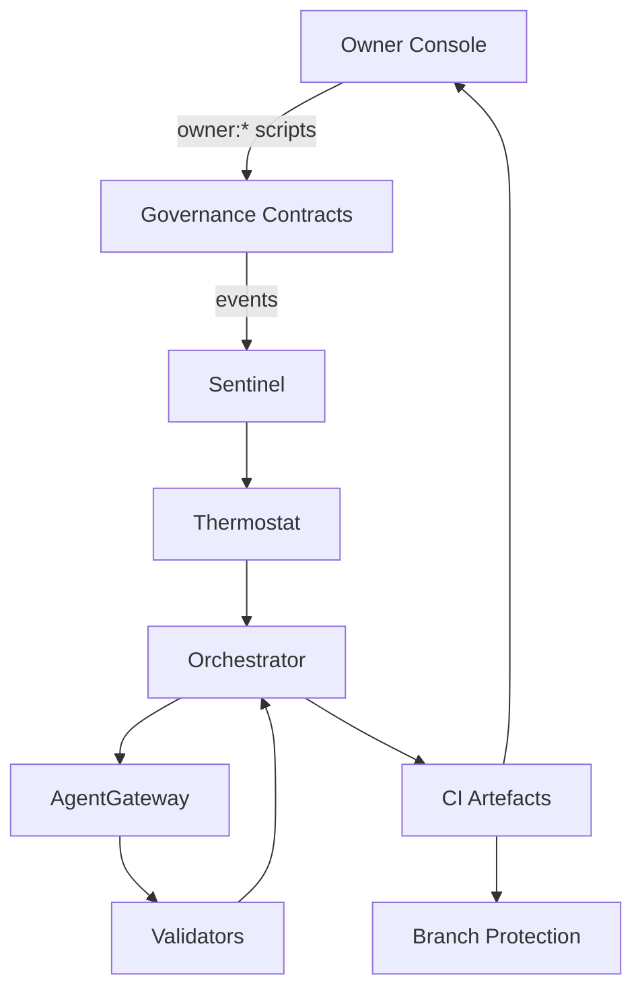

# AGI Jobs v0 (v2)

[](https://github.com/MontrealAI/AGIJobsv0/actions/workflows/ci.yml)
[](https://github.com/MontrealAI/AGIJobsv0/actions/workflows/static-analysis.yml)
[](https://github.com/MontrealAI/AGIJobsv0/actions/workflows/fuzz.yml)
[](https://github.com/MontrealAI/AGIJobsv0/actions/workflows/webapp.yml)
[](https://github.com/MontrealAI/AGIJobsv0/actions/workflows/containers.yml)
[](https://github.com/MontrealAI/AGIJobsv0/actions/workflows/orchestrator-ci.yml)
[](https://github.com/MontrealAI/AGIJobsv0/actions/workflows/e2e.yml)
[](https://github.com/MontrealAI/AGIJobsv0/actions/workflows/scorecard.yml)

AGI Jobs v0 (v2) operates as a production-hardened intelligence platform—a superintelligent machine with deterministic guardrails, owner-first controls, and battle-tested mission playbooks that non-technical operators can run without leaving the repo.

## Quick start (operator friendly)

1. Align your toolchain with the automation surface (Node.js 20.19.0 is pinned in `.nvmrc` and CI uses the GitHub Releases mirror for Cypress installs):
   ```bash
   nvm use
   export CYPRESS_INSTALL_BINARY=https://github.com/cypress-io/cypress/releases/download/v13.17.0/cypress-linux-x64.zip
   npm ci --no-audit --prefer-offline --progress=false
   python -m pip install --upgrade pip
   python -m pip install -r requirements-python.txt
   ```
2. Rehearse the gating checks locally before opening a pull request:
   ```bash
   npm run ci:verify-toolchain
   npm run ci:sync-contexts -- --check
   npm run ci:verify-contexts
   npm run ci:verify-companion-contexts
   npm run lint:ci
   npm test
   forge test -vvvv --ffi --fuzz-runs 256
   coverage run --rcfile=.coveragerc -m pytest test/paymaster test/tools test/orchestrator test/simulation
   coverage run --rcfile=.coveragerc --append -m pytest tests packages/hgm-core/tests demo/Huxley-Godel-Machine-v0/tests
   coverage combine
   ```
3. Generate the baseline operator artefacts that leadership expects after every change:
   ```bash
   make operator:green
   ```
4. Confirm branch protection stays aligned with the required contexts:
   ```bash
   npm run ci:enforce-branch-protection -- --branch main --dry-run
   ```
   Run with a personal access token to apply changes when the dry run looks correct.

## Mission-critical capabilities

- **On-chain owner command surface** – `OwnerConfigurator` exposes batched configuration while emitting structured events so the contract owner can mutate every subsystem and keep a tamper-evident log. Owner tooling such as `ownerControlDoctor` and the parameter matrix CLI audit live configs, enforce thresholds, and render machine-readable artefacts for compliance teams. The npm `owner:*` scripts keep these workflows one command away for non-technical operators.
- **Agent gateway integration** – The gateway contracts and service guide mission traffic into validators and job markets, with deployment, security, and API docs living alongside the implementation.
- **Validator mesh console** – The Next.js validator UI automates commit/reveal, ENS validation, and failure recovery so validator pods can keep jobs on track during high-pressure incidents.
- **Thermostat & sentinel guardrails** – Dedicated services govern ROI, pause levers, and anomaly escalation. They are covered by the Python test suites that CI v2 executes on every run to guarantee systemic stability.
- **Runbooks & playbooks** – Operator, security, and migration runbooks stay updated in the repo so every mission owner can execute emergency manoeuvres using the same instructions the CI pipeline validates.

## Repository map

| Surface | Purpose |
| --- | --- |
| [`contracts/`](contracts/README.md) | Core protocol, governance, and upgrade contracts plus Foundry/Hardhat configuration for deterministic builds. |
| [`agent-gateway/`](agent-gateway/README.md) | Bidirectional bridge between operators and agents, including REST APIs, auth, and deployment guidance. |
| [`services/`](services/thermostat/README.md) | Long-running services (thermostat, sentinel, culture indexers) that feed the governance machine actionable telemetry. |
| [`apps/`](apps/validator-ui/README.md) | Operator and validator front-ends that inherit the same CI and lint guardrails as the core contracts. |
| [`demo/`](demo/AGIJobs-Day-One-Utility-Benchmark/README.md) | High-stakes demos and simulations showcasing the machine’s capabilities across economic, governance, and planetary scenarios. |
| [`ci/`](ci/required-contexts.json) | Declarative manifests for required status checks used by automation and branch protection, plus the guardrail scripts consumed by CI v2. |
| [`docs/`](docs/user-guides/README.md) | Deep-dive guides, whitepapers, and operator briefs that complement the runbooks and workflow documentation. |

## CI & assurance

The `ci (v2)` workflow stitches together linting, contract suites, Python analytics, deterministic demos, and governance audits under a single summary job. Review the [CI v2 Operations Playbook](docs/v2-ci-operations.md) for the full topology, local rehearsal commands, and artefact expectations. Required contexts live in `ci/required-contexts.json`, companion workflows in `ci/required-companion-contexts.json`, and the branch protection guard enforces strict, admin-protected rules on `main`. When policies drift, follow the [branch protection checklist](docs/ci-v2-branch-protection-checklist.md) to sync manifests, update the GitHub rule, and archive the resulting CI summary artefacts.



## Owner operations

- Run `npm run owner:doctor -- --network <network>` to audit every module before and after changes; CI v2 publishes the same report in `reports/owner-control/` so audits stay reproducible.
- Render the parameter matrix with `npm run owner:parameters -- --network <network> --format markdown` to confirm pausable modules, treasury routes, and thermostat bounds before handing control to downstream teams.
- Execute emergency levers such as pauses, upgrades, or owner rotations with the packaged `owner:*` scripts; each call emits structured events from `OwnerConfigurator` so nothing happens off-ledger.

## Documentation & support

- Operator, mission, and security runbooks live at the repository root and in `docs/`.
- For production incidents, follow the escalation flows in `OperatorRunbook.md`, then capture artefacts from `reports/ci/status.json` to close the loop with governance.
- Use `make operator:green` plus the demo READMEs to rehearse mission-critical playbooks before public launches.

AGI Jobs v0 (v2) remains fully under the contract owner’s control: every subsystem is adjustable, every safeguard is auditable, and every workflow is visible through an always-green CI surface.
