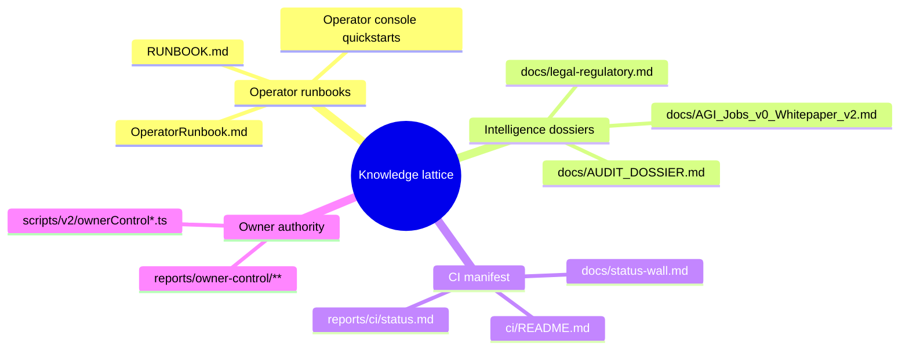
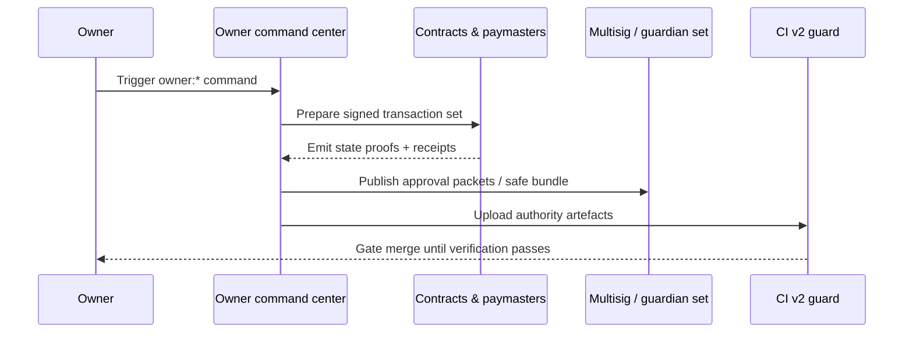
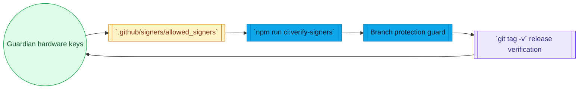
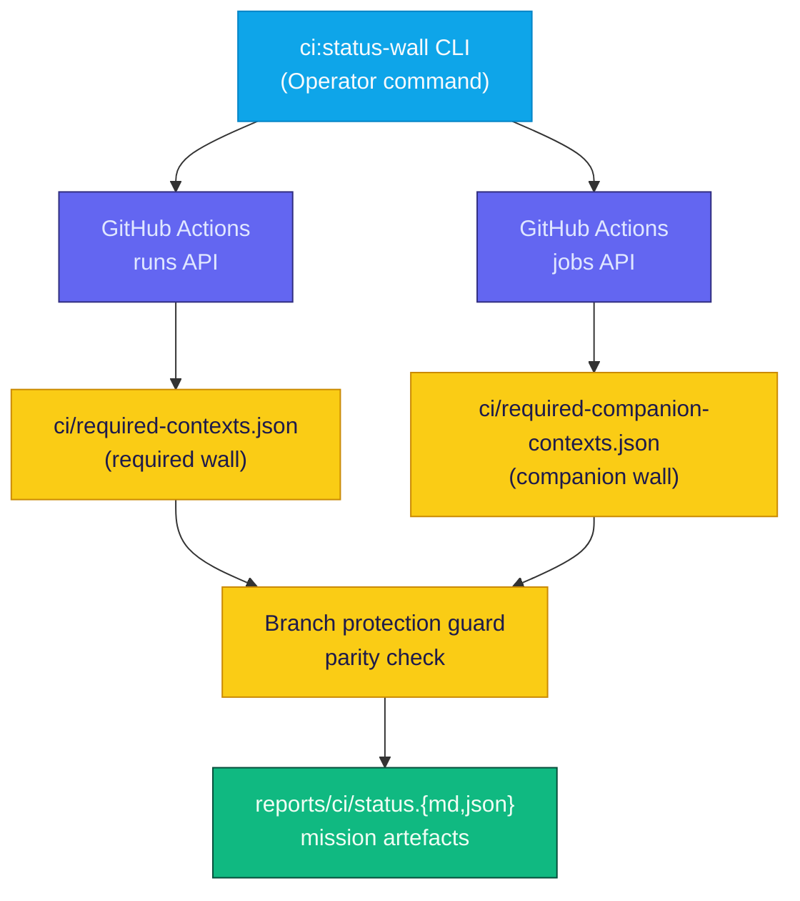
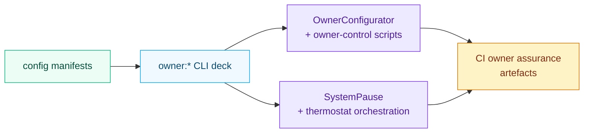
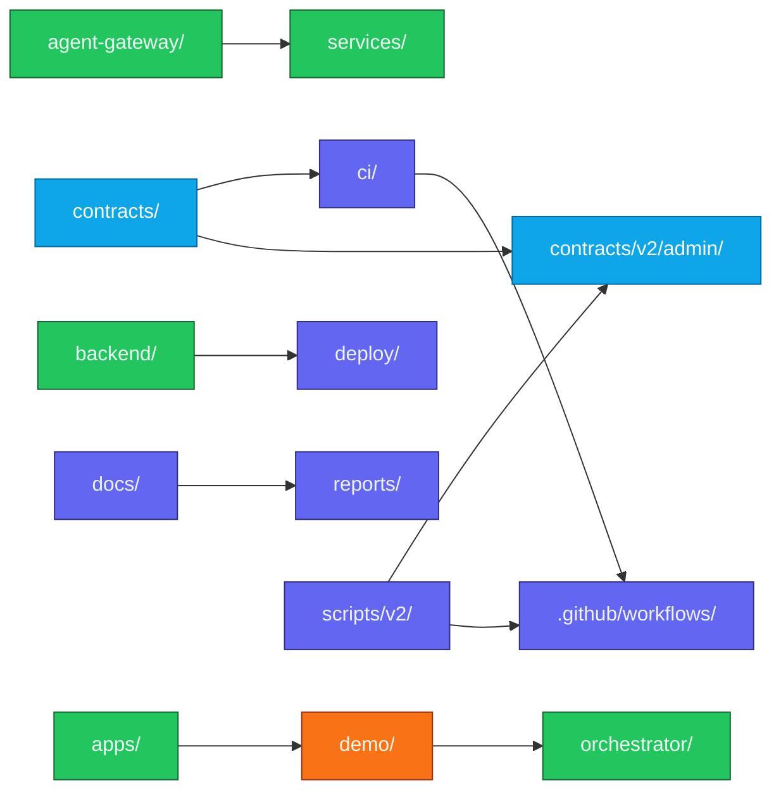
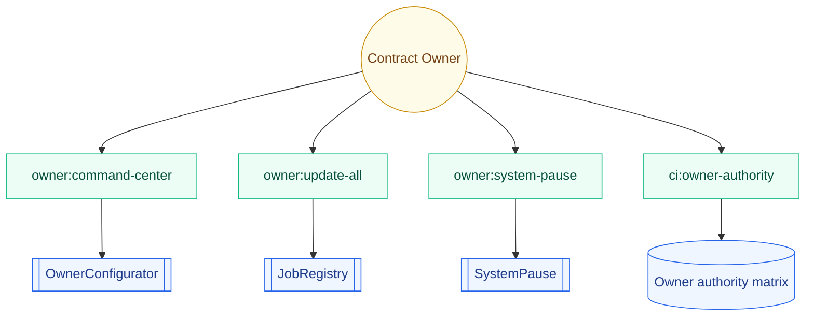
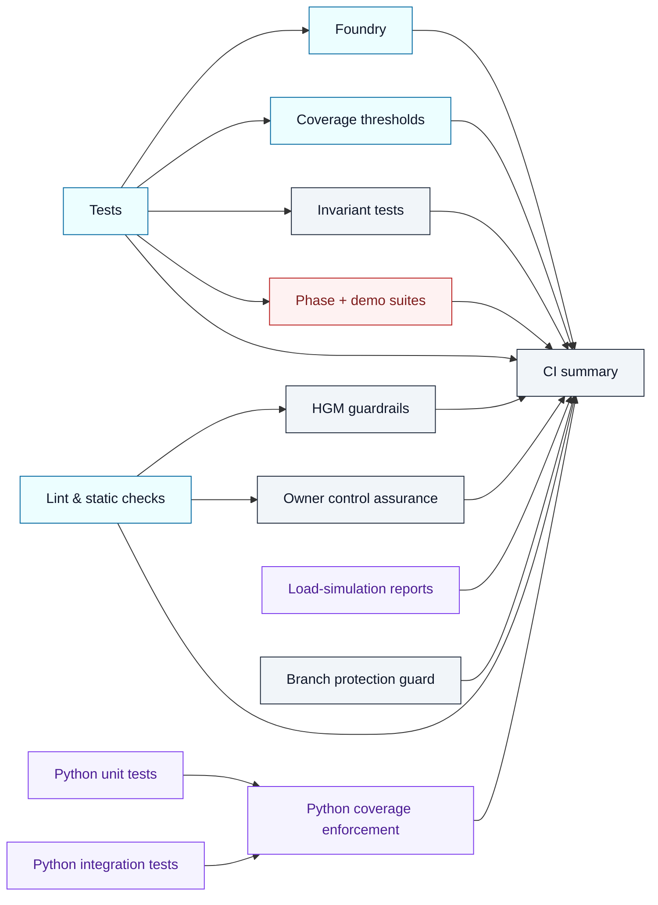
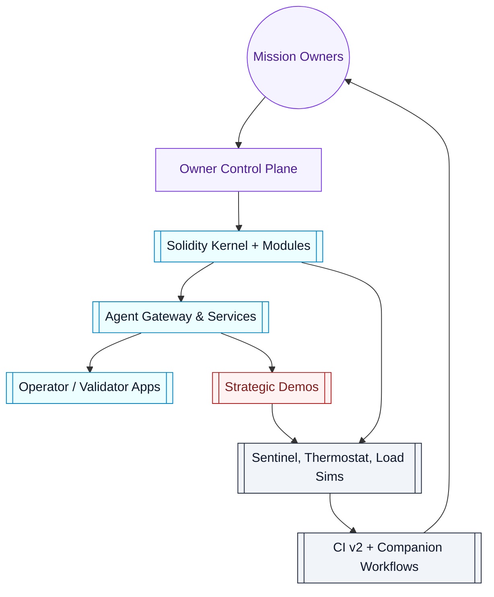

# AGI Jobs v0 (v2)

[](https://github.com/MontrealAI/AGIJobsv0/actions/workflows/ci.yml)
[](https://github.com/MontrealAI/AGIJobsv0/actions/workflows/ci.yml?query=workflow%3A%22ci+%28v2%29%22+is%3Asuccess+branch%3Amain)
[](https://github.com/MontrealAI/AGIJobsv0/actions/workflows/static-analysis.yml)
[](https://github.com/MontrealAI/AGIJobsv0/actions/workflows/fuzz.yml)
[](https://github.com/MontrealAI/AGIJobsv0/actions/workflows/webapp.yml)
[](https://github.com/MontrealAI/AGIJobsv0/actions/workflows/containers.yml)
[](https://github.com/MontrealAI/AGIJobsv0/actions/workflows/orchestrator-ci.yml)
[](https://github.com/MontrealAI/AGIJobsv0/actions/workflows/e2e.yml)
[](https://github.com/MontrealAI/AGIJobsv0/actions/workflows/scorecard.yml)

AGI Jobs v0 (v2) brings together job contracts, agent gateways, validators, operator consoles, orchestration, simulations, and demos. The architecture aims to support verifiable agent work with owner-controlled governance and observable execution.

**Start here:** [Local setup and role guide](docs/START_HERE.md) · [Production readiness and remaining blockers](docs/production/readiness-2026-10-04.md) · [Demo guide and complete catalog](demo/README.md) · [Documentation catalog](docs/readme-catalog.md).

**Explore the demos visually:** [AGI Jobs Demo Observatory](https://montrealai.github.io/AGIJobsv0/) — searchable collection, individual demo pages, original guides and flowcharts, and a browser-only job walkthrough. [Website source and publishing instructions](website/README.md).

**Coordinate computer-based work:** the [computer-work integration](docs/computer-work.md) connects admitted jobs to isolated OpenClaw workers, including their configured native Codex Computer Use capabilities. Start with the [supplier-desk browser lab](demo/One-Box/computer-work/README.md): it produces real browser evidence and separately checks both a correct and an incorrect recommendation. Live workers require explicit task admission, protected credentials and independent acceptance review. The vision's **$40T/year** opportunity is a planning assumption, not a verified market-size or revenue claim.

**Exercise the production gates locally:** run `npm run production:rehearse` after dependency setup in a clean committed checkout. The [production rehearsal](docs/production/rehearsal.md) combines real cryptographic checks, HTTP fault injection, adversarial contract tests, and three settled local jobs into an inspectable, signed simulation report.

**Deployment status:** local tests are not a mainnet certification. The four previously oversized contracts now use [fixed implementations and staged deployment](docs/production/fixed-implementations.md), and the size gate passes with normal Ethereum limits enforced. Release still requires authorized signing keys, completed deployment configuration, and passing CI. All existing architectural diagrams and demonstration surfaces are retained.


```mermaid
flowchart LR
    classDef core fill:#f3e8ff,stroke:#7c3aed,color:#2e1065,stroke-width:1px;
    classDef guard fill:#dcfce7,stroke:#16a34a,color:#14532d,stroke-width:1px;
    classDef ops fill:#e0f2fe,stroke:#0284c7,color:#0c4a6e,stroke-width:1px;
    classDef owner fill:#fef3c7,stroke:#d97706,color:#7c2d12,stroke-width:1px;

    OwnerConsole[[Owner command center CLI]]:::owner --> AuthorityMatrix[Owner authority matrix<br/>`npm run owner:verify-control`]:::guard
    AuthorityMatrix --> Contracts{{Contracts + Paymasters}}:::core
    Contracts --> Agents{{Agent gateway & orchestrators}}:::core
    Agents --> Demos{{Demonstration suites + simulations}}:::core
    Demos --> Observability[[Observability fabric<br/>`reports/**`]]:::ops
    Observability --> CIStatus[[CI v2 status wall]]:::guard
    CIStatus --> BranchProtection[[Branch protection guard]]:::guard
    BranchProtection --> OwnerConsole
```

The loop above describes the intended verification path. CI checks owner authority manifests and generates telemetry artifacts; effective merge protection also depends on the repository rules. A passing test run does not replace contract deployability checks, deployment verification, or operational commissioning.

## Documentation lattice

The repository’s manuals, runbooks, and subsystem READMEs are catalogued in [`docs/readme-catalog.md`](docs/readme-catalog.md). Use it to locate operator instructions and subsystem diagrams. The [demo guide](demo/README.md) adds a generated inventory of every tracked demo directory and its nested guides; the [Demo gallery workflow](.github/workflows/demo-gallery.yml) rejects a stale demo inventory. Document indexing and test results establish their stated coverage, not automatic verification of every narrative claim.


```mermaid
mindmap
  root((Knowledge lattice))
    Operator runbooks
      OperatorRunbook.md
      RUNBOOK.md
      Operator console quickstarts
    Intelligence dossiers
      docs/AUDIT_DOSSIER.md
      docs/AGI_Jobs_v0_Whitepaper_v2.md
      docs/legal-regulatory.md
    CI manifest
      ci/README.md
      docs/status-wall.md
      reports/ci/status.md
    Owner authority
      scripts/v2/ownerControl*.ts
      reports/owner-control/**
```

Use the catalogue to jump directly into any subsystem; the documents are regenerated whenever directories shift so the map never falls out of sync with the codebase.

## Owner command authority

The contract owner maintains unilateral, auditable control over the entire platform. Every command emits deterministic artefacts (`reports/owner-control/**`) and is enforced by CI so branch protection never accepts a regression.

| Capability | Command | Output |
| ---------- | ------- | ------ |
| Prove governance posture | `npm run owner:verify-control` | Authority matrix, role bindings, guardian quorum reports. ([package.json](package.json)) ([ci.yml](.github/workflows/ci.yml)) |
| Pause or resume execution | `npm run owner:system-pause` / `npm run owner:emergency` | Transaction scripts + pause certificates ready for multisig execution. ([package.json](package.json)) ([systemPauseAction.ts](scripts/v2/systemPauseAction.ts)) |
| Reconfigure parameters | `npm run owner:parameters` | Parameter matrix CSV/JSON for rapid reprogramming across contracts, agents, and paymasters. ([package.json](package.json)) ([ownerParameterMatrix.ts](scripts/v2/ownerParameterMatrix.ts)) |
| Stage upgrades | `npm run owner:upgrade` / `npm run owner:upgrade-status` | Upgrade queue diffs, bytecode fingerprints, upgrade state proofs. ([package.json](package.json)) ([ownerUpgradeQueue.ts](scripts/v2/ownerUpgradeQueue.ts)) |
| Generate dashboards | `npm run owner:dashboard` / `npm run owner:command-center` | Owner dashboards, command plans, and compliance briefings for non-technical operators. ([package.json](package.json)) ([ownerCommandCenter.ts](scripts/v2/ownerCommandCenter.ts)) |

Owner commands have different side effects and prerequisites. Read the command-specific runbook before execution: live checks require RPC access, and transaction commands may write on-chain. Use only the preview and output flags supported by that command. Combine them with `npm run owner:plan:safe` to produce multisig-ready transaction bundles when deploying from custodial safes. ([package.json](package.json)) ([run-owner-plan.js](scripts/v2/run-owner-plan.js))


```mermaid
sequenceDiagram
    participant Owner
    participant CommandCenter as Owner command center
    participant Ledger as Contracts & paymasters
    participant Guardians as Multisig / guardian set
    participant CI as CI v2 guard

    Owner->>CommandCenter: Trigger owner:* command
    CommandCenter->>Ledger: Prepare signed transaction set
    Ledger-->>CommandCenter: Emit state proofs + receipts
    CommandCenter->>Guardians: Publish approval packets / safe bundle
    CommandCenter->>CI: Upload authority artefacts
    CI-->>Owner: Gate merge until verification passes
```

The resulting artefacts feed the `Owner control assurance` CI job and the branch protection guard so every production deployment is traceable back to an approved owner command path. ([ci.yml](.github/workflows/ci.yml))

## Release provenance lattice

Every release tag must be cryptographically attributable to the guardians who shepherd AGI Jobs v0 (v2). The `.github/signers/allowed_signers` register contains illustrative placeholders, not usable maintainer keys. Preserve the examples for reference and replace them with authorized SSH public keys before a production release. ([allowed_signers](.github/signers/allowed_signers)) Execute `npm run ci:verify-signers` to enforce actual OpenSSH key parsing, namespace scoping, and duplicate detection. This check intentionally fails on the shipped placeholders. ([package.json](package.json)) ([check-signers.js](scripts/ci/check-signers.js))


```mermaid
flowchart LR
    classDef register fill:#fef3c7,stroke:#d97706,color:#7c2d12,stroke-width:1px;
    classDef guardian fill:#dcfce7,stroke:#16a34a,color:#14532d,stroke-width:1px;
    classDef ci fill:#0ea5e9,stroke:#0284c7,color:#0f172a,stroke-width:1px;
    classDef release fill:#ede9fe,stroke:#7c3aed,color:#312e81,stroke-width:1px;

    Guardians((Guardian hardware keys)):::guardian --> SignerRegistry[[`.github/signers/allowed_signers`]]:::register
    SignerRegistry --> ProvenanceCheck[[`npm run ci:verify-signers`]]:::ci
    ProvenanceCheck --> BranchGuard[[Branch protection guard]]:::ci
    BranchGuard --> ReleaseTag[[`git tag -v` release verification]]:::release
    ReleaseTag --> Guardians
```

The release workflow fails closed if a maintainer attempts to publish a tag without a registered key, preserving the intelligence engine’s audit trail while giving the owner full power to rotate, pause, or expand the guardian set at will. ([check-signers.js](scripts/ci/check-signers.js))

## CI v2 status wall (live)

The full mapping between wall entries, workflow job identifiers, and maintenance steps lives in [`docs/status-wall.md`](docs/status-wall.md). The wall is enforced twice: GitHub branch protection consumes `ci/required-contexts.json`, and the `CI summary` job fails fast when any upstream signal degrades. Release captains regenerate the wall locally with `npm run ci:status-wall -- --require-success --include-companion --format markdown` so this table mirrors the live GitHub truth at all times. ([README.md](ci/README.md)) ([check-ci-status-wall.ts](scripts/ci/check-ci-status-wall.ts))

| Required job | Status badge |
| ------------ | ------------ |
| Lint & static checks | [](https://github.com/MontrealAI/AGIJobsv0/actions/workflows/ci.yml?query=workflow%3A%22ci+%28v2%29%22+is%3Asuccess+branch%3Amain+job%3A%22Lint+%26+static+checks%22) |
| Tests | [](https://github.com/MontrealAI/AGIJobsv0/actions/workflows/ci.yml?query=workflow%3A%22ci+%28v2%29%22+is%3Asuccess+branch%3Amain+job%3ATests) |
| Python unit tests | [](https://github.com/MontrealAI/AGIJobsv0/actions/workflows/ci.yml?query=workflow%3A%22ci+%28v2%29%22+is%3Asuccess+branch%3Amain+job%3A%22Python+unit+tests%22) |
| Python integration tests | [](https://github.com/MontrealAI/AGIJobsv0/actions/workflows/ci.yml?query=workflow%3A%22ci+%28v2%29%22+is%3Asuccess+branch%3Amain+job%3A%22Python+integration+tests%22) |
| Load-simulation reports | [](https://github.com/MontrealAI/AGIJobsv0/actions/workflows/ci.yml?query=workflow%3A%22ci+%28v2%29%22+is%3Asuccess+branch%3Amain+job%3A%22Load-simulation+reports%22) |
| Python coverage enforcement | [](https://github.com/MontrealAI/AGIJobsv0/actions/workflows/ci.yml?query=workflow%3A%22ci+%28v2%29%22+is%3Asuccess+branch%3Amain+job%3A%22Python+coverage+enforcement%22) |
| HGM guardrails | [](https://github.com/MontrealAI/AGIJobsv0/actions/workflows/ci.yml?query=workflow%3A%22ci+%28v2%29%22+is%3Asuccess+branch%3Amain+job%3A%22HGM+guardrails%22) |
| Owner control assurance | [](https://github.com/MontrealAI/AGIJobsv0/actions/workflows/ci.yml?query=workflow%3A%22ci+%28v2%29%22+is%3Asuccess+branch%3Amain+job%3A%22Owner+control+assurance%22) |
| Foundry | [](https://github.com/MontrealAI/AGIJobsv0/actions/workflows/ci.yml?query=workflow%3A%22ci+%28v2%29%22+is%3Asuccess+branch%3Amain+job%3AFoundry) |
| Coverage thresholds | [](https://github.com/MontrealAI/AGIJobsv0/actions/workflows/ci.yml?query=workflow%3A%22ci+%28v2%29%22+is%3Asuccess+branch%3Amain+job%3A%22Coverage+thresholds%22) |
| Phase 6 readiness | [](https://github.com/MontrealAI/AGIJobsv0/actions/workflows/ci.yml?query=workflow%3A%22ci+%28v2%29%22+is%3Asuccess+branch%3Amain+job%3A%22Phase+6+readiness%22) |
| Phase 8 readiness | [](https://github.com/MontrealAI/AGIJobsv0/actions/workflows/ci.yml?query=workflow%3A%22ci+%28v2%29%22+is%3Asuccess+branch%3Amain+job%3A%22Phase+8+readiness%22) |
| Kardashev II readiness | [](https://github.com/MontrealAI/AGIJobsv0/actions/workflows/ci.yml?query=workflow%3A%22ci+%28v2%29%22+is%3Asuccess+branch%3Amain+job%3A%22Kardashev+II+readiness%22) |
| ASI Take-Off Demonstration | [](https://github.com/MontrealAI/AGIJobsv0/actions/workflows/ci.yml?query=workflow%3A%22ci+%28v2%29%22+is%3Asuccess+branch%3Amain+job%3A%22ASI+Take-Off+Demonstration%22) |
| Zenith Sapience Demonstration | [](https://github.com/MontrealAI/AGIJobsv0/actions/workflows/ci.yml?query=workflow%3A%22ci+%28v2%29%22+is%3Asuccess+branch%3Amain+job%3A%22Zenith+Sapience+Demonstration%22) |
| AGI Labor Market Grand Demo | [](https://github.com/MontrealAI/AGIJobsv0/actions/workflows/ci.yml?query=workflow%3A%22ci+%28v2%29%22+is%3Asuccess+branch%3Amain+job%3A%22AGI+Labor+Market+Grand+Demo%22) |
| Sovereign Mesh Demo — build | [](https://github.com/MontrealAI/AGIJobsv0/actions/workflows/ci.yml?query=workflow%3A%22ci+%28v2%29%22+is%3Asuccess+branch%3Amain+job%3A%22Sovereign+Mesh+Demo+%E2%80%94+build%22) |
| Sovereign Constellation Demo — build | [](https://github.com/MontrealAI/AGIJobsv0/actions/workflows/ci.yml?query=workflow%3A%22ci+%28v2%29%22+is%3Asuccess+branch%3Amain+job%3A%22Sovereign+Constellation+Demo+%E2%80%94+build%22) |
| Celestial Archon Demonstration | [](https://github.com/MontrealAI/AGIJobsv0/actions/workflows/ci.yml?query=workflow%3A%22ci+%28v2%29%22+is%3Asuccess+branch%3Amain+job%3A%22Celestial+Archon+Demonstration%22) |
| Hypernova Governance Demonstration | [](https://github.com/MontrealAI/AGIJobsv0/actions/workflows/ci.yml?query=workflow%3A%22ci+%28v2%29%22+is%3Asuccess+branch%3Amain+job%3A%22Hypernova+Governance+Demonstration%22) |
| Branch protection guard | [](https://github.com/MontrealAI/AGIJobsv0/actions/workflows/ci.yml?query=workflow%3A%22ci+%28v2%29%22+is%3Asuccess+branch%3Amain+job%3A%22Branch+protection+guard%22) |
| CI summary | [](https://github.com/MontrealAI/AGIJobsv0/actions/workflows/ci.yml?query=workflow%3A%22ci+%28v2%29%22+is%3Asuccess+branch%3Amain+job%3A%22CI+summary%22) |
| Invariant tests | [](https://github.com/MontrealAI/AGIJobsv0/actions/workflows/ci.yml?query=workflow%3A%22ci+%28v2%29%22+is%3Asuccess+branch%3Amain+job%3A%22Invariant+tests%22) |

Companion workflows complete the assurance wall: [static analysis](https://github.com/MontrealAI/AGIJobsv0/actions/workflows/static-analysis.yml), [fuzz](https://github.com/MontrealAI/AGIJobsv0/actions/workflows/fuzz.yml), [webapp](https://github.com/MontrealAI/AGIJobsv0/actions/workflows/webapp.yml), [containers](https://github.com/MontrealAI/AGIJobsv0/actions/workflows/containers.yml), and [e2e](https://github.com/MontrealAI/AGIJobsv0/actions/workflows/e2e.yml). Required contexts for those workflows are defined in [`ci/required-companion-contexts.json`](ci/required-companion-contexts.json) and enforced by `npm run ci:verify-companion-contexts`.

### Live verification CLI
- Run `npm run ci:status-wall -- --token <github_token>` to confirm the latest `ci (v2)` run on `main` succeeded across every required job. The command inspects the GitHub Actions API, flags missing or red jobs, and prints a breakdown with direct links to each job log. Add `--format markdown` to render a README-ready table or `--format json` when you need structured output for dashboards or automated release gates. ([check-ci-status-wall.ts](scripts/ci/check-ci-status-wall.ts))
- Pass `--include-companion` to extend the check across the companion workflows (static-analysis, fuzz, webapp, containers, e2e) so the full assurance wall is verified in one sweep. ([check-ci-status-wall.ts](scripts/ci/check-ci-status-wall.ts)) ([required-companion-contexts.json](ci/required-companion-contexts.json))
- Use `--branch <name>` or `--workflow <file>` when validating release branches or pre-flight changes in forks. All options mirror the automation that the branch-protection guard enforces on protected branches. ([check-ci-status-wall.ts](scripts/ci/check-ci-status-wall.ts))

| Scenario | Command | Notes |
| --- | --- | --- |
| Enforce success on `main` | `npm run ci:status-wall -- --token $GITHUB_TOKEN --require-success` | Fails fast unless every job finished in `success` or `skipped` state. ([check-ci-status-wall.ts](scripts/ci/check-ci-status-wall.ts)) |
| Include companion lattice | `npm run ci:status-wall -- --token $GITHUB_TOKEN --include-companion` | Adds static-analysis, fuzz, webapp, containers, and e2e to the report. ([check-ci-status-wall.ts](scripts/ci/check-ci-status-wall.ts)) |
| Export dashboards | `npm run ci:status-wall -- --token $GITHUB_TOKEN --format json > reports/ci/status.wall.json` | Emits machine-readable payload for dashboards and alerting. ([check-ci-status-wall.ts](scripts/ci/check-ci-status-wall.ts)) |
| Refresh README table | `npm run ci:status-wall -- --token $GITHUB_TOKEN --format markdown > reports/ci/status-wall.md` | Generates a GitHub-flavoured table matching the live status wall for direct embedding. ([check-ci-status-wall.ts](scripts/ci/check-ci-status-wall.ts)) |


```mermaid
flowchart TD
    classDef entry fill:#0ea5e9,stroke:#0284c7,color:#f8fafc,stroke-width:1px;
    classDef api fill:#6366f1,stroke:#312e81,color:#e0e7ff,stroke-width:1px;
    classDef guard fill:#facc15,stroke:#ca8a04,color:#1e1b4b,stroke-width:1px;
    classDef artefact fill:#10b981,stroke:#064e3b,color:#f0fdf4,stroke-width:1px;

    statusWall["ci:status-wall CLI\n(Operator command)"]:::entry --> ghRuns["GitHub Actions\nruns API"]:::api
    statusWall --> ghJobs["GitHub Actions\njobs API"]:::api
    ghRuns --> manifest["ci/required-contexts.json\n(required wall)"]:::guard
    ghJobs --> companion["ci/required-companion-contexts.json\n(companion wall)"]:::guard
    manifest --> verdict["Branch protection guard\nparity check"]:::guard
    companion --> verdict
    verdict --> artefacts["reports/ci/status.{md,json}\nmission artefacts"]:::artefact
```

The same manifest powers the branch-protection guard inside CI v2 and the local verification CLI, so green walls locally guarantee green walls on GitHub before merge. ([ci.yml](.github/workflows/ci.yml)) ([required-contexts.json](ci/required-contexts.json))

#### API-level verification

Executive operators can independently corroborate the wall without local tooling by interrogating the GitHub REST API. With `curl` and `jq` installed:

```bash
# 1. Inspect the most recent workflow result on main
curl -s 'https://api.github.com/repos/MontrealAI/AGIJobsv0/actions/workflows/ci.yml/runs?branch=main&per_page=1' \
  | jq -r '.workflow_runs[0].status, .workflow_runs[0].conclusion'

# 2. Capture the run identifier for downstream job queries
RUN_ID=$(curl -s 'https://api.github.com/repos/MontrealAI/AGIJobsv0/actions/workflows/ci.yml/runs?branch=main&per_page=1' \
  | jq -r '.workflow_runs[0].id')

# 3. Enumerate job conclusions for that run
curl -s "https://api.github.com/repos/MontrealAI/AGIJobsv0/actions/runs/${RUN_ID}/jobs?per_page=100" \
  | jq -r '.jobs[] | "\(.name): \(.conclusion)"'

# 4. Assert every job concluded successfully (exit code 0 means green wall)
curl -s "https://api.github.com/repos/MontrealAI/AGIJobsv0/actions/runs/${RUN_ID}/jobs?per_page=100" \
  | jq -e 'all(.jobs[].conclusion == "success")'
```

The final check returns `true` and a zero exit status only when each required context is green, enabling air-gapped compliance suites or third-party dashboards to verify the wall without invoking repository scripts. Combine the API snapshot with `npm run ci:status-wall -- --require-success --include-companion` to cross-check manifest-driven expectations against the live Actions event stream. ([check-ci-status-wall.ts](scripts/ci/check-ci-status-wall.ts))

### Double-green enforcement drill
1. **Interrogate the wall:** `npm run ci:status-wall -- --token <github_token> --require-success --include-companion` must return all ✅ lines and regenerate both Markdown and JSON artefacts in `reports/ci/`. Cross-check the printed run ID with the Actions UI so the command and GitHub agree on the latest passing workflow. ([check-ci-status-wall.ts](scripts/ci/check-ci-status-wall.ts))
2. **Lock the manifest:** Immediately execute `npm run ci:sync-contexts -- --check` to prove that the required context manifest still mirrors `.github/workflows/ci.yml`. The command fails fast on any drift so branch protection cannot silently fall behind. ([update-ci-required-contexts.ts](scripts/ci/update-ci-required-contexts.ts)) ([required-contexts.json](ci/required-contexts.json))
3. **Audit the rule:** Finish with `npm run ci:verify-branch-protection -- --owner MontrealAI --repo AGIJobsv0 --branch main --require` and archive the console output. The script queries the GitHub REST API and enforces parity with the manifest, so a single invocation validates CI status, manifests, and the live protection rule in one sweep. ([verify-branch-protection.ts](scripts/ci/verify-branch-protection.ts))

```mermaid
flowchart TD
    classDef cli fill:#ecfeff,stroke:#0369a1,color:#0f172a,stroke-width:1px;
    classDef api fill:#f1f5f9,stroke:#1e293b,color:#0f172a,stroke-width:1px;
    classDef guard fill:#fefce8,stroke:#ca8a04,color:#713f12,stroke-width:1px;
    classDef artefact fill:#f5f3ff,stroke:#7c3aed,color:#4c1d95,stroke-width:1px;

    statusCLI[ci:status-wall]:::cli --> ghRunsAPI[GitHub Actions runs API]:::api
    statusCLI --> statusArtefacts[reports/ci/status.{md,json}]:::artefact
    manifestCheck[ci:sync-contexts --check]:::cli --> workflowFile[.github/workflows/ci.yml]:::guard
    manifestCheck --> manifestJSON[ci/required-contexts.json]:::guard
    branchAudit[ci:verify-branch-protection]:::cli --> githubBranchAPI[GitHub branch protection API]:::api
    manifestJSON --> branchAudit
    workflowFile --> branchAudit
    branchAudit --> enforcementReceipt[Archived enforcement log]:::artefact
```

Running the drill before every release forces status verification, manifest locking, and branch protection auditing to agree, creating a triple-check loop that mirrors CI v2’s internal guard rails. ([ci.yml](.github/workflows/ci.yml)) ([required-contexts.json](ci/required-contexts.json))

## Executive signal
- **Unification:** Smart contracts, agent gateways, demos, and analytics are orchestrated as one lattice, keeping governance, telemetry, and delivery in lockstep for non-technical operators. ([README.md](agent-gateway/README.md)) ([README.md](apps/validator-ui/README.md)) ([README.md](services/thermostat/README.md))
- **Owner supremacy:** Every critical lever is surfaced through deterministic owner tooling so the contract owner can pause, upgrade, and retune parameters on demand, without redeploying or editing code. ([OwnerConfigurator.sol](contracts/v2/admin/OwnerConfigurator.sol)) ([package.json](package.json))
- **Evergreen assurance:** CI v2 enforces a wall of 23 required contexts plus companion workflows, uploads audit artefacts, and verifies branch protection so operators can inspect the required evidence before approving a release. Check the current run and repository rules rather than assuming all checks are green. ([ci.yml](.github/workflows/ci.yml)) ([required-contexts.json](ci/required-contexts.json)) ([required-companion-contexts.json](ci/required-companion-contexts.json))

## Owner dominion console
The platform’s operator CLI renders full-spectrum control to the contract owner without touching Solidity or TypeScript. Each command combines deterministic manifests from [`config/`](config/README.md) with the governance façades inside [`contracts/v2/admin`](contracts/README.md) so pauses, treasury updates, and validator quotas can be reconfigured in minutes while CI records immutable artefacts. ([README.md](config/README.md)) ([README.md](contracts/README.md)) ([ci.yml](.github/workflows/ci.yml))


```mermaid
flowchart LR
    classDef deck fill:#f0f9ff,stroke:#0ea5e9,color:#0c4a6e,stroke-width:1px;
    classDef manifest fill:#ecfdf5,stroke:#10b981,color:#064e3b,stroke-width:1px;
    classDef contract fill:#ede9fe,stroke:#7c3aed,color:#4c1d95,stroke-width:1px;
    classDef ci fill:#fef3c7,stroke:#d97706,color:#7c2d12,stroke-width:1px;

    manifests[config manifests]:::manifest --> ownerCli[owner:* CLI deck]:::deck
    ownerCli --> configurator[OwnerConfigurator<br/>+ owner-control scripts]:::contract
    ownerCli --> pauseSwitch[SystemPause<br/>+ thermostat orchestration]:::contract
    configurator --> ciArtefacts[CI owner assurance<br/>artefacts]:::ci
    pauseSwitch --> ciArtefacts
```

| Command | Capability | Execution surface |
| ------- | ---------- | ----------------- |
| `npm run owner:parameters -- --network <net>` | Regenerates the full fee, treasury, validator, and thermostat matrix that CI stores under `reports/owner-control/`, ensuring executives can validate every toggle before signing transactions. ([ownerParameterMatrix.ts](scripts/v2/ownerParameterMatrix.ts)) ([ci.yml](.github/workflows/ci.yml)) | Owner CLI + CI artefact wall |
| `npm run owner:system-pause -- --network <net>` | Emits pause/unpause calldata, previews the transaction JSON, and enforces module ownership so a single command can freeze or resume the lattice safely. ([systemPauseAction.ts](scripts/v2/systemPauseAction.ts)) ([SystemPause.sol](contracts/v2/SystemPause.sol)) | Owner CLI |
| `npm run owner:update-all -- --network <net>` | Applies manifest diffs through `OwnerConfigurator` with dependency ordering and dry-run previews, matching the upgrades rehearsed in CI’s owner assurance job. ([updateAllModules.ts](scripts/v2/updateAllModules.ts)) ([ci.yml](.github/workflows/ci.yml)) | Owner CLI + CI |
| `npm run ci:owner-authority -- --network <net> --out reports/owner-control` | Regenerates Markdown/JSON authority matrices so the contract owner and auditors both see a living, CI-backed digest of who controls every lever. ([package.json](package.json)) ([ci.yml](.github/workflows/ci.yml)) | CI pipelines + local drill |

The same commands run automatically in the `Owner control assurance` job, so the checks wall refuses a merge unless the owner retains total dominion over pause switches, treasury routing, and upgrade paths. ([ci.yml](.github/workflows/ci.yml))

## Quickstart for operators
1. Use Node.js 22.23.3 (`.nvmrc`/`.node-version`) and Python 3.12 to match the automated toolchain. ([.nvmrc](.nvmrc)) ([ci.yml](.github/workflows/ci.yml)) If your base image is missing `node`/`npm`, install the pinned version explicitly so tests don’t fall back to distro defaults, then validate the toolchain with `npm run doctor:node` so Hardhat builds don’t silently run under the wrong runtime. ([check-node.js](scripts/check-node.js)) ([package.json](package.json))
   ```bash
   # With nvm installed, use the repository's exact Node pin.
   nvm install
   nvm use
   npm install --global npm@10.8.2
   npm run doctor:node
   ```
2. Hydrate dependencies (do **not** omit optional packages—the Hardhat toolbox requires the platform-specific `@nomicfoundation/solidity-analyzer-*` binary and will fail exactly like CI if you pass `--omit=optional`):
   ```bash
   CYPRESS_INSTALL_BINARY=0 npm ci
   python3.12 -m venv .venv
   source .venv/bin/activate
   python -m pip install --upgrade pip
   python -m pip install -r requirements-python.txt
   python -m pip check
   ```
3. Confirm the deterministic toolchain locks before coding:
   ```bash
   npm run ci:preflight
   npm run ci:verify-toolchain
   npm run ci:sync-contexts -- --check
   npm run ci:verify-contexts
   npm run ci:verify-companion-contexts
   npm run ci:verify-summary-needs
   ```
   The sync command confirms `ci/required-contexts.json` matches the workflow before the verification scripts enforce ordering, and the summary check proves the wall coverage is intact—keeping this quintet green locally mirrors branch protection expectations. ([package.json](package.json)) ([update-ci-required-contexts.ts](scripts/ci/update-ci-required-contexts.ts)) ([check-summary-needs.js](scripts/ci/check-summary-needs.js)) ([ci.yml](.github/workflows/ci.yml))
4. Validate the critical suites (prime the Hardhat cache once so local runs mirror CI performance):
   ```bash
   npm run compile           # generates artifacts exactly like the tests job
   npm test                  # reuses the compiled artefacts, matching ci (v2) / Tests
   npm run lint:ci
   npm run coverage
   forge test -vvvv --ffi --fuzz-runs 256
   ```
   Compiling first avoids the local fallback where `hardhat test --no-compile` triggers a fresh Solidity build, bringing the experience in line with the workflow’s dedicated compile step before `npm test`. These commands reproduce the Hardhat, linting, coverage, and Foundry stages the pipeline requires. ([package.json](package.json)) ([ci.yml](.github/workflows/ci.yml))
   The Python coverage harness additionally exercises the HGM worker dispatcher and sharded simulation CLI so CI’s 85% gate reflects the orchestrator workloads developers rehearse locally. ([test_worker.py](test/orchestrator/test_worker.py)) ([test_harness.py](test/simulation/test_harness.py)) ([test_sharded_simulation.py](test/simulation/test_sharded_simulation.py))
5. When the signal is green, push signed commits and open a pull request—CI v2 enforces the exact same contexts on `main` and PRs.

## Repository atlas

```mermaid
flowchart LR
    classDef core fill:#0ea5e9,stroke:#0369a1,color:#f8fafc,stroke-width:1px;
    classDef ops fill:#6366f1,stroke:#312e81,color:#eef2ff,stroke-width:1px;
    classDef demos fill:#f97316,stroke:#9a3412,color:#fff7ed,stroke-width:1px;
    classDef svc fill:#22c55e,stroke:#166534,color:#ecfdf5,stroke-width:1px;

    contracts[contracts/]:::core --> ci[ci/]:::ops
    contracts --> contractsOwner[contracts/v2/admin/]:::core
    agentGateway[agent-gateway/]:::svc --> services[services/]:::svc
    apps[apps/]:::svc --> demos[demo/]:::demos
    backend[backend/]:::svc --> deploy[deploy/]:::ops
    docs[docs/]:::ops --> reports[reports/]:::ops
    ci --> workflows[.github/workflows/]:::ops
    demos --> orchestrator[orchestrator/]:::svc
    ownerScripts[scripts/v2/]:::ops --> contractsOwner
    ownerScripts --> workflows
```

| Domain | Highlights |
| ------ | ---------- |
| Contracts (`contracts/`) | Solidity kernel, modules, admin façades, and invariant harnesses tested through Hardhat + Foundry with owner-first controls. ([README.md](contracts/README.md)) |
| Agent Gateway (`agent-gateway/`) | TypeScript service providing REST, WebSocket, and gRPC bridges into the contract stack with deterministic telemetry exports. ([README.md](agent-gateway/README.md)) |
| Apps (`apps/`) | Operator and validator UIs that consume the gateway and orchestrator APIs for mission dashboards. ([README.md](apps/validator-ui/README.md)) |
| Services (`services/`) | Sentinels, thermostat, culture indexers, and auxiliary control planes feeding observability and safeguards. ([README.md](services/thermostat/README.md)) |
| CI (`ci/` + `.github/workflows/`) | Scripts, manifests, and workflows that lock toolchains, enforce branch protection, and publish compliance artefacts. ([required-contexts.json](ci/required-contexts.json)) ([ci.yml](.github/workflows/ci.yml)) |
| Demo constellation (`demo/`) | High-stakes rehearsals (Kardashev, ASI take-off, Zenith sapience, etc.) codified as reproducible scripts and UI bundles. ([ci.yml](.github/workflows/ci.yml)) |

### Control-plane architecture

```mermaid
flowchart TD
    classDef entry fill:#0ea5e9,stroke:#0284c7,color:#f8fafc,stroke-width:1px;
    classDef contract fill:#6366f1,stroke:#312e81,color:#eef2ff,stroke-width:1px;
    classDef service fill:#f97316,stroke:#9a3412,color:#fff7ed,stroke-width:1px;
    classDef ci fill:#22c55e,stroke:#166534,color:#ecfdf5,stroke-width:1px;

    subgraph Operator Surface
        gateway[Agent gateway APIs]:::service
        consoles[Operator consoles (`apps/`)]:::service
        ownerDeck[Owner CLI + control scripts]:::entry
    end

    subgraph Intelligence Core
        contractsStack[Contracts kernel + modules]:::contract
        orchestratorSvc[Orchestrator services]:::service
        sentinels[Sentinel & thermostat services]:::service
    end

    subgraph Assurance Lattice
        ciMain[CI v2 pipelines]:::ci
        companion[Companion workflows]:::ci
        reports[Audit & CI reports]:::ci
        branchGuard[Branch protection guard]:::ci
    end

    ownerDeck --> gateway
    ownerDeck --> orchestratorSvc
    consoles --> gateway
    gateway --> contractsStack
    orchestratorSvc --> contractsStack
    sentinels --> orchestratorSvc
    sentinels --> reports
    ciMain --> reports
    companion --> reports
    branchGuard --> reports
    reports --> ownerDeck
    reports --> consoles
```

The control plane ties owners, operators, and automation into one verifiable surface: owners drive changes through deterministic CLI entry points, agent services marshal those commands into contract-safe transactions, and sentinel services plus CI pipelines export signed artefacts for audits. ([package.json](package.json)) ([README.md](agent-gateway/README.md)) ([README.md](services/sentinel/README.md)) ([README.md](services/thermostat/README.md))

## Owner command authority

```mermaid
flowchart TD
    classDef owner fill:#fefce8,stroke:#ca8a04,color:#713f12,stroke-width:1px;
    classDef script fill:#ecfdf5,stroke:#10b981,color:#064e3b,stroke-width:1px;
    classDef contract fill:#eff6ff,stroke:#2563eb,color:#1e3a8a,stroke-width:1px;

    Owner((Contract Owner)):::owner --> CommandCenter[owner:command-center]:::script
    CommandCenter --> OwnerConfigurator[[OwnerConfigurator]]:::contract
    Owner --> OwnerUpdate[owner:update-all]:::script --> Registry[[JobRegistry]]:::contract
    Owner --> OwnerPause[owner:system-pause]:::script --> SystemPause[[SystemPause]]:::contract
    Owner --> Authority[ci:owner-authority]:::script --> Matrix[(Owner authority matrix)]:::contract
```

| Command | Purpose |
| ------- | ------- |
| `npm run owner:system-pause -- --network <network>` | Toggle pause levers across kernel and module contracts in one transaction, enforcing ownership checks before execution. ([package.json](package.json)) ([SystemPause.sol](contracts/v2/SystemPause.sol)) |
| `npm run owner:update-all -- --network <network>` | Reconcile manifests against on-chain parameters through the `OwnerConfigurator`, emitting structured audit logs per change. ([package.json](package.json)) ([OwnerConfigurator.sol](contracts/v2/admin/OwnerConfigurator.sol)) |
| `npm run owner:command-center` | Render a consolidated mission-control report (mermaid + JSON) so non-technical owners can approve operations before broadcasting. ([package.json](package.json)) |
| `npm run owner:parameters -- --network <network>` | Export the full parameter matrix referenced in CI and compliance reviews. ([package.json](package.json)) ([ownerParameterMatrix.ts](scripts/v2/ownerParameterMatrix.ts)) |
| `npm run ci:owner-authority -- --network ci --out reports/owner-control` | Regenerate the authority matrix consumed by CI artefacts and branch protection guards. ([package.json](package.json)) ([ci.yml](.github/workflows/ci.yml)) |

Preview and export support varies by command; confirm the documented flags before supplying RPC credentials or signing transactions. ([ownerControlDoctor.ts](scripts/v2/ownerControlDoctor.ts)) ([ownerControlQuickstart.ts](scripts/v2/ownerControlQuickstart.ts))

### Attestation registry safety lever

- `AttestationRegistry.pause()` / `unpause()` — owner-only circuit breaker that halts ENS-backed delegation while responding to compromised subdomains. Use the OwnerConfigurator (`owner:update-all`) or Hardhat console to invoke the pause, then resume once the attestor set is remediated. The mutation path is guarded by OpenZeppelin `Ownable` + `Pausable`, and attestation calls revert with `Pausable: paused` until unpaused. ([AttestationRegistry.sol](contracts/v2/AttestationRegistry.sol))

### Governance oversight loop

```mermaid
flowchart LR
    classDef actor fill:#fefce8,stroke:#ca8a04,color:#713f12,stroke-width:1px;
    classDef auto fill:#ecfdf5,stroke:#10b981,color:#064e3b,stroke-width:1px;
    classDef guard fill:#eff6ff,stroke:#2563eb,color:#1e3a8a,stroke-width:1px;
    classDef repo fill:#f1f5f9,stroke:#1e293b,color:#0f172a,stroke-width:1px;

    OwnerCouncil((Owner council)):::actor --> ControlDoctor[Owner control doctor]:::auto
    ControlDoctor --> AuthorityMatrix[(Owner authority matrix)]:::guard
    AuthorityMatrix --> BranchGuard[Branch protection guard]:::guard
    BranchGuard --> GitHub[GitHub branch protection]:::repo
    GitHub --> CIWall[ci (v2) / CI summary]:::guard
    CIWall --> Reports[reports/ci/status.{md,json}]:::repo
    Reports --> OwnerCouncil
    Reports --> Operators[Operator consoles]:::auto
```

The governance loop keeps owner supremacy verifiable: owner council scripts regenerate the authority matrix, CI v2 enforces branch protection parity, and the resulting artefacts cycle back into operator consoles and decision briefings. ([ci.yml](.github/workflows/ci.yml)) ([README.md](reports/audit/README.md)) ([ownerControlDoctor.ts](scripts/v2/ownerControlDoctor.ts))

## Parameter recalibration pipeline
```mermaid
flowchart LR
    classDef inputs fill:#ecfeff,stroke:#0369a1,color:#0f172a,stroke-width:1px;
    classDef analysis fill:#f5f3ff,stroke:#7c3aed,color:#4c1d95,stroke-width:1px;
    classDef command fill:#fef3c7,stroke:#d97706,color:#7c2d12,stroke-width:1px;
    classDef execution fill:#eff6ff,stroke:#2563eb,color:#1e3a8a,stroke-width:1px;

    configs[Config manifests\n(config/, storage/)]:::inputs --> surface[owner:surface]:::analysis
    surface --> matrix[owner:parameters]:::analysis
    matrix --> doctor[owner:doctor]:::analysis
    doctor --> mission[owner:mission-control]:::command
    mission --> updateAll[owner:update-all]:::execution
    updateAll --> contractsCore[contracts/v2 core modules]:::execution
```

- **Surface scan:** `npm run owner:surface` fingerprints every config file, normalises addresses, and highlights drift against the deployed control plane so owners see exactly which modules need attention before touching the chain. ([ownerControlSurface.ts](scripts/v2/ownerControlSurface.ts))
- **Matrix export:** `npm run owner:parameters` renders markdown, JSON, and mermaid matrices that map every subsystem to its calibration commands and verification steps, ready to drop into compliance reports or mission reviews. ([ownerParameterMatrix.ts](scripts/v2/ownerParameterMatrix.ts))
- **Doctor triage:** `npm run owner:doctor` scores each subsystem with `pass/warn/fail`, escalates on missing keys, and recommends remediation commands, enforcing deterministic ownership of the entire lattice. ([ownerControlDoctor.ts](scripts/v2/ownerControlDoctor.ts))
- **Mission orchestration:** `npm run owner:mission-control` condenses the owner dossier, parameter diffs, and pause levers into a single decision brief for final sign-off. ([ownerMissionControl.ts](scripts/v2/ownerMissionControl.ts))
- **Deterministic execution:** `npm run owner:update-all` streams the plan into Hardhat transactions or Safe bundles so parameter updates and address rotations land atomically, with artifacts saved alongside the CI owner-control reports. ([updateAllModules.ts](scripts/v2/updateAllModules.ts))

Each stage emits markdown and JSON artefacts beneath `reports/owner-control/`, the same directory uploaded by CI v2 to prove the owner still wields ultimate authority while the automation remains fully transparent. ([ci.yml](.github/workflows/ci.yml))

## CI v2 orchestration

```mermaid
flowchart LR
    classDef base fill:#ecfeff,stroke:#0369a1,color:#0f172a,stroke-width:1px;
    classDef analytics fill:#f5f3ff,stroke:#7c3aed,color:#4c1d95,stroke-width:1px;
    classDef demo fill:#fef2f2,stroke:#b91c1c,color:#7f1d1d,stroke-width:1px;
    classDef guard fill:#f1f5f9,stroke:#1e293b,color:#0f172a,stroke-width:1px;

    lint[Lint & static checks]:::base --> hgm[HGM guardrails]:::guard
    lint --> ownerCtl[Owner control assurance]:::guard
    tests[Tests]:::base --> foundry[Foundry]:::base
    tests --> coverage[Coverage thresholds]:::base
    tests --> invariants[Invariant tests]:::guard
    tests --> demos[Phase + demo suites]:::demo
    pyUnit[Python unit tests]:::analytics --> pyCov[Python coverage enforcement]:::analytics
    pyInt[Python integration tests]:::analytics --> pyCov
    pyLoad[Load-simulation reports]:::analytics --> summary[CI summary]:::guard
    branchGuard[Branch protection guard]:::guard --> summary
    foundry --> summary
    coverage --> summary
    invariants --> summary
    hgm --> summary
    ownerCtl --> summary
    demos --> summary
    pyCov --> summary
    lint --> summary
    tests --> summary
```

### CI telemetry feed & dashboards

```mermaid
flowchart LR
    classDef artefact fill:#ecfeff,stroke:#0369a1,color:#0f172a,stroke-width:1px;
    classDef cli fill:#f5f3ff,stroke:#7c3aed,color:#4c1d95,stroke-width:1px;
    classDef surface fill:#f1f5f9,stroke:#1e293b,color:#0f172a,stroke-width:1px;

    summaryJob[ci (v2) / CI summary]:::cli --> statusJson[reports/ci/status.json]:::artefact
    summaryJob --> statusMarkdown[reports/ci/status.md]:::artefact
    statusJson --> dashboards[Mission dashboards\n& release control rooms]:::surface
    statusMarkdown --> briefings[Owner briefings\n& PR threads]:::surface
    cliProbe[npm run ci:status-wall]:::cli --> statusJson
```

- `reports/ci/status.json` exposes a machine-readable feed of the latest CI lattice; it is generated in every run and uploaded as an artefact so dashboards and compliance monitors can subscribe without scraping GitHub. ([ci.yml](.github/workflows/ci.yml))
- `reports/ci/status.md` mirrors the JSON feed in Markdown for direct inclusion in release notes, investor updates, or PR discussions. ([ci.yml](.github/workflows/ci.yml))
- `npm run ci:status-wall -- --token <github_token> --require-success --include-companion --format json` fetches the same data from the GitHub API on demand, giving mission owners and release captains a deterministic way to gate deployments or cut dashboards from their local terminal. Swap in `--format markdown` to reproduce the README tables programmatically. ([check-ci-status-wall.ts](scripts/ci/check-ci-status-wall.ts))
- The artefacts capture the full badge wall, including fork bypass annotations, so anyone consuming the feed has the same visibility as the GitHub checks tab without needing repo admin permissions. ([ci.yml](.github/workflows/ci.yml))

### Required contexts
The branch protection rule enforces the following `ci (v2)` contexts, guaranteeing a visible, fully green wall before merge:

| Context | Description |
| ------- | ----------- |
| Lint & static checks | Hardhat/TypeScript linting, manifest validation, and lock enforcement. ([ci.yml](.github/workflows/ci.yml)) |
| Tests | Hardhat compilation, test execution, ABI drift detection. ([ci.yml](.github/workflows/ci.yml)) |
| Python unit tests | Unit-level analytics covering paymaster, tools, orchestrator, and simulation suites. ([ci.yml](.github/workflows/ci.yml)) |
| Python integration tests | Route-level API integration, demo rehearsal validation, and deterministic analytics. ([ci.yml](.github/workflows/ci.yml)) |
| Load-simulation reports | Monte Carlo sweeps producing CSV + JSON artefacts for economic stress tests. ([ci.yml](.github/workflows/ci.yml)) |
| Python coverage enforcement | Combines unit/integration coverage and enforces thresholds. ([ci.yml](.github/workflows/ci.yml)) |
| HGM guardrails | Higher Governance Machine regression suite spanning Node + Python controllers. ([ci.yml](.github/workflows/ci.yml)) |
| Owner control assurance | Owner doctor reports, command center digest, and parameter matrices proving the owner retains ultimate authority. ([ci.yml](.github/workflows/ci.yml)) |
| Foundry | Forge test harness with fuzz + invariant coverage for Solidity contracts. ([ci.yml](.github/workflows/ci.yml)) |
| Coverage thresholds | Solidity coverage plus access-control remapping and enforcement. ([ci.yml](.github/workflows/ci.yml)) |
| Phase 6 readiness | Scenario validation for the Phase 6 expansion demo. ([ci.yml](.github/workflows/ci.yml)) |
| Phase 8 readiness | Scenario validation for the Phase 8 dominance demo. ([ci.yml](.github/workflows/ci.yml)) |
| Kardashev II readiness | Kardashev II + Stellar rehearsals to keep planetary demos deployable. ([ci.yml](.github/workflows/ci.yml)) |
| ASI Take-Off Demonstration | Full-length ASI take-off run with artefact exports. ([ci.yml](.github/workflows/ci.yml)) |
| Zenith Sapience Demonstration | Deterministic + local rehearsal for Zenith Sapience initiatives. ([ci.yml](.github/workflows/ci.yml)) |
| AGI Labor Market Grand Demo | Exports transcripts for the labour market grand simulation. ([ci.yml](.github/workflows/ci.yml)) |
| Sovereign Mesh Demo — build | Builds sovereign mesh server + console bundles. ([ci.yml](.github/workflows/ci.yml)) |
| Sovereign Constellation Demo — build | Builds constellation orchestrator + console assets. ([ci.yml](.github/workflows/ci.yml)) |
| Celestial Archon Demonstration | Deterministic + local rehearsals for Celestial Archon governance. ([ci.yml](.github/workflows/ci.yml)) |
| Hypernova Governance Demonstration | Hypernova rehearsal with local deterministic replay. ([ci.yml](.github/workflows/ci.yml)) |
| Branch protection guard | Audits GitHub branch protection live against the manifests and fails on drift. Forked PRs log a bypass note yet keep the required context green so protected branches still enforce the policy. ([ci.yml](.github/workflows/ci.yml)) ([required-contexts.json](ci/required-contexts.json)) |
| CI summary | Aggregates every job outcome, writes Markdown + JSON status artefacts, and fails if any job was red or artefacts are missing. ([ci.yml](.github/workflows/ci.yml)) |
| Invariant tests | Dedicated Forge invariant suite with cached build graph and fuzz tuning. ([ci.yml](.github/workflows/ci.yml)) |

Companion workflows are also required (`static-analysis`, `fuzz`, `webapp`, `containers`, `e2e`), guaranteeing the checks tab mirrors the entire assurance surface. ([required-companion-contexts.json](ci/required-companion-contexts.json))

### Companion workflow lattice
```mermaid
flowchart TD
    classDef main fill:#ecfeff,stroke:#0284c7,color:#0f172a,stroke-width:1px;
    classDef companion fill:#fef3c7,stroke:#d97706,color:#7c2d12,stroke-width:1px;
    classDef checks fill:#f1f5f9,stroke:#1e293b,color:#0f172a,stroke-width:1px;

    ciSummary[ci (v2) / CI summary]:::main --> checksWall[GitHub checks wall]:::checks
    staticAnalysis[static-analysis / Slither static analysis]:::companion --> checksWall
    fuzzSuite[fuzz / forge-fuzz]:::companion --> checksWall
    webappCi[webapp / webapp-ci]:::companion --> checksWall
    containersNode[containers / build (node-runner)]:::companion --> checksWall
    containersValidator[containers / build (validator-runner)]:::companion --> checksWall
    containersGateway[containers / build (gateway)]:::companion --> checksWall
    containersWebapp[containers / build (webapp)]:::companion --> checksWall
    containersOwner[containers / build (owner-console)]:::companion --> checksWall
    e2eSuite[e2e / orchestrator-e2e]:::companion --> checksWall
```

The manifest in `ci/required-companion-contexts.json` marks every companion workflow as required so the PR checks wall cannot go green unless they all pass beside the `ci (v2)` contexts, and `npm run ci:verify-companion-contexts` fails if the manifest drifts from GitHub's configuration. ([required-companion-contexts.json](ci/required-companion-contexts.json)) ([package.json](package.json))

### Branch protection autopilot

```mermaid
flowchart LR
    classDef manifest fill:#ecfdf5,stroke:#10b981,color:#064e3b,stroke-width:1px;
    classDef guard fill:#f1f5f9,stroke:#1e293b,color:#0f172a,stroke-width:1px;
    classDef summary fill:#eff6ff,stroke:#2563eb,color:#1e3a8a,stroke-width:1px;

    manifestDeck[ci/required-contexts.json\nci/required-companion-contexts.json]:::manifest --> branchGuard[ci (v2) / Branch protection guard]:::guard
    branchGuard --> githubAPI[GitHub Branch Protection API\n(enforced contexts)]:::guard
    branchGuard --> ciSummary[ci (v2) / CI summary]:::summary
    ciSummary --> checksTab[Protected branch checks wall]:::summary
```

Run the manifest + enforcement bundle whenever you add or rename CI jobs to keep PRs and `main` locked to the green wall:

| Step | Command | Purpose |
| ---- | ------- | ------- |
| 1 | `npm run ci:sync-contexts -- --check` | Assert that `ci/required-contexts.json` mirrors `.github/workflows/ci.yml`; rerun without `--check` to regenerate after intentional changes. ([required-contexts.json](ci/required-contexts.json)) ([package.json](package.json)) |
| 2 | `npm run ci:verify-contexts` | Validate the friendly names used in branch protection so badge text and required contexts stay aligned. ([package.json](package.json)) |
| 3 | `npm run ci:verify-companion-contexts` | Confirm the companion workflows stay registered as required alongside the main CI lattice. ([required-companion-contexts.json](ci/required-companion-contexts.json)) ([package.json](package.json)) |
| 4 | `npm run ci:verify-branch-protection -- --branch main` | Fetch the live branch protection rule via the GitHub API and fail on missing contexts before merges slip through. ([package.json](package.json)) ([ci.yml](.github/workflows/ci.yml)) |
| 5 | `npm run ci:enforce-branch-protection -- --branch main` | Apply the manifest to GitHub branch protection so the checks wall must remain fully green on `main` and protected release branches. ([package.json](package.json)) |

The `ci (v2) / Branch protection guard` job re-runs step 4 inside every workflow execution and writes a bypass notice when forks lack administrative scopes, while the `ci (v2) / CI summary` job fails the run if any required job or artefact is missing—ensuring the enforcement wall is both visible and blocking. ([ci.yml](.github/workflows/ci.yml))

### CI badge wall (ci (v2))

| Job | Live badge |
| --- | ---------- |
| Lint & static checks | [](https://github.com/MontrealAI/AGIJobsv0/actions/workflows/ci.yml?query=workflow%3A%22ci+%28v2%29%22+is%3Asuccess+branch%3Amain+job%3A%22Lint+%26+static+checks%22) |
| Tests | [](https://github.com/MontrealAI/AGIJobsv0/actions/workflows/ci.yml?query=workflow%3A%22ci+%28v2%29%22+is%3Asuccess+branch%3Amain+job%3ATests) |
| Python unit tests | [](https://github.com/MontrealAI/AGIJobsv0/actions/workflows/ci.yml?query=workflow%3A%22ci+%28v2%29%22+is%3Asuccess+branch%3Amain+job%3A%22Python+unit+tests%22) |
| Python integration tests | [](https://github.com/MontrealAI/AGIJobsv0/actions/workflows/ci.yml?query=workflow%3A%22ci+%28v2%29%22+is%3Asuccess+branch%3Amain+job%3A%22Python+integration+tests%22) |
| Load-simulation reports | [](https://github.com/MontrealAI/AGIJobsv0/actions/workflows/ci.yml?query=workflow%3A%22ci+%28v2%29%22+is%3Asuccess+branch%3Amain+job%3A%22Load-simulation+reports%22) |
| Python coverage enforcement | [](https://github.com/MontrealAI/AGIJobsv0/actions/workflows/ci.yml?query=workflow%3A%22ci+%28v2%29%22+is%3Asuccess+branch%3Amain+job%3A%22Python+coverage+enforcement%22) |
| HGM guardrails | [](https://github.com/MontrealAI/AGIJobsv0/actions/workflows/ci.yml?query=workflow%3A%22ci+%28v2%29%22+is%3Asuccess+branch%3Amain+job%3A%22HGM+guardrails%22) |
| Owner control assurance | [](https://github.com/MontrealAI/AGIJobsv0/actions/workflows/ci.yml?query=workflow%3A%22ci+%28v2%29%22+is%3Asuccess+branch%3Amain+job%3A%22Owner+control+assurance%22) |
| Foundry | [](https://github.com/MontrealAI/AGIJobsv0/actions/workflows/ci.yml?query=workflow%3A%22ci+%28v2%29%22+is%3Asuccess+branch%3Amain+job%3AFoundry) |
| Coverage thresholds | [](https://github.com/MontrealAI/AGIJobsv0/actions/workflows/ci.yml?query=workflow%3A%22ci+%28v2%29%22+is%3Asuccess+branch%3Amain+job%3A%22Coverage+thresholds%22) |
| Phase 6 readiness | [](https://github.com/MontrealAI/AGIJobsv0/actions/workflows/ci.yml?query=workflow%3A%22ci+%28v2%29%22+is%3Asuccess+branch%3Amain+job%3A%22Phase+6+readiness%22) |
| Phase 8 readiness | [](https://github.com/MontrealAI/AGIJobsv0/actions/workflows/ci.yml?query=workflow%3A%22ci+%28v2%29%22+is%3Asuccess+branch%3Amain+job%3A%22Phase+8+readiness%22) |
| Kardashev II readiness | [](https://github.com/MontrealAI/AGIJobsv0/actions/workflows/ci.yml?query=workflow%3A%22ci+%28v2%29%22+is%3Asuccess+branch%3Amain+job%3A%22Kardashev+II+readiness%22) |
| ASI Take-Off Demonstration | [](https://github.com/MontrealAI/AGIJobsv0/actions/workflows/ci.yml?query=workflow%3A%22ci+%28v2%29%22+is%3Asuccess+branch%3Amain+job%3A%22ASI+Take-Off+Demonstration%22) |
| Zenith Sapience Demonstration | [](https://github.com/MontrealAI/AGIJobsv0/actions/workflows/ci.yml?query=workflow%3A%22ci+%28v2%29%22+is%3Asuccess+branch%3Amain+job%3A%22Zenith+Sapience+Demonstration%22) |
| AGI Labor Market Grand Demo | [](https://github.com/MontrealAI/AGIJobsv0/actions/workflows/ci.yml?query=workflow%3A%22ci+%28v2%29%22+is%3Asuccess+branch%3Amain+job%3A%22AGI+Labor+Market+Grand+Demo%22) |
| Sovereign Mesh Demo — build | [](https://github.com/MontrealAI/AGIJobsv0/actions/workflows/ci.yml?query=workflow%3A%22ci+%28v2%29%22+is%3Asuccess+branch%3Amain+job%3A%22Sovereign+Mesh+Demo+%E2%80%94+build%22) |
| Sovereign Constellation Demo — build | [](https://github.com/MontrealAI/AGIJobsv0/actions/workflows/ci.yml?query=workflow%3A%22ci+%28v2%29%22+is%3Asuccess+branch%3Amain+job%3A%22Sovereign+Constellation+Demo+%E2%80%94+build%22) |
| Celestial Archon Demonstration | [](https://github.com/MontrealAI/AGIJobsv0/actions/workflows/ci.yml?query=workflow%3A%22ci+%28v2%29%22+is%3Asuccess+branch%3Amain+job%3A%22Celestial+Archon+Demonstration%22) |
| Hypernova Governance Demonstration | [](https://github.com/MontrealAI/AGIJobsv0/actions/workflows/ci.yml?query=workflow%3A%22ci+%28v2%29%22+is%3Asuccess+branch%3Amain+job%3A%22Hypernova+Governance+Demonstration%22) |
| Branch protection guard | [](https://github.com/MontrealAI/AGIJobsv0/actions/workflows/ci.yml?query=workflow%3A%22ci+%28v2%29%22+is%3Asuccess+branch%3Amain+job%3A%22Branch+protection+guard%22) |
| CI summary | [](https://github.com/MontrealAI/AGIJobsv0/actions/workflows/ci.yml?query=workflow%3A%22ci+%28v2%29%22+is%3Asuccess+branch%3Amain+job%3A%22CI+summary%22) |
| Invariant tests | [](https://github.com/MontrealAI/AGIJobsv0/actions/workflows/ci.yml?query=workflow%3A%22ci+%28v2%29%22+is%3Asuccess+branch%3Amain+job%3A%22Invariant+tests%22) |

The badge query filters directly on the workflow run logs, so PR reviewers and release captains can confirm the fully green wall without leaving the repository homepage. Each job corresponds to the required contexts enumerated below and enforced by branch protection. ([ci.yml](.github/workflows/ci.yml)) ([required-contexts.json](ci/required-contexts.json))

### Enforcing branch protection
1. Generate or refresh required contexts:
   ```bash
   npm run ci:sync-contexts -- --check
   npm run ci:verify-contexts
   npm run ci:verify-companion-contexts
   ```
   Use `npm run ci:sync-contexts` (without `--check`) if you add or rename CI jobs; it rewrites the manifest deterministically and fails when duplicates slip in. ([package.json](package.json)) ([update-ci-required-contexts.ts](scripts/ci/update-ci-required-contexts.ts))
2. Audit the live rule without mutations:
   ```bash
   npm run ci:enforce-branch-protection -- --dry-run --branch main
   ```
3. Verify the GitHub rule via the public API without mutating anything (requires a fine-grained PAT or GitHub App token with `administration:read` scope):
   ```bash
   GITHUB_TOKEN=<token> npm run ci:verify-branch-protection -- --owner MontrealAI --repo AGIJobsv0 --branch main
   ```
   The script confirms the live protection rule matches `ci/required-contexts.json` and `ci/required-companion-contexts.json`, failing if the GitHub configuration is stale or missing contexts. ([package.json](package.json)) ([verify-branch-protection.ts](scripts/ci/verify-branch-protection.ts))
4. Apply the rule (requires repo admin token):
   ```bash
   npm run ci:enforce-branch-protection -- --branch main
   ```
   The branch protection guard job revalidates these expectations on every push to `main`, keeping policy and automation in sync while gracefully bypassing forked PRs that lack administrative scope. ([package.json](package.json)) ([ci.yml](.github/workflows/ci.yml))

### Artefacts
- `reports/ci/status.{md,json}` – machine-readable run summaries consumed by release captains and compliance audits. ([ci.yml](.github/workflows/ci.yml))
- `reports/owner-control/**` – authority matrices, doctor reports, command-center digest, and parameter plans proving owner command coverage. ([ci.yml](.github/workflows/ci.yml))
- `reports/load-sim/**` – Monte Carlo CSV + JSON payloads with economic dissipation analysis. ([ci.yml](.github/workflows/ci.yml))

## Architecture panorama

```mermaid
flowchart TD
    classDef ops fill:#f5f3ff,stroke:#7c3aed,color:#4c1d95,stroke-width:1px;
    classDef core fill:#ecfeff,stroke:#0284c7,color:#0f172a,stroke-width:1px;
    classDef demos fill:#fef2f2,stroke:#b91c1c,color:#7f1d1d,stroke-width:1px;
    classDef obs fill:#f1f5f9,stroke:#1e293b,color:#0f172a,stroke-width:1px;

    Owners((Mission Owners)):::ops --> OwnerPlane[Owner Control Plane]:::ops
    OwnerPlane --> Contracts[[Solidity Kernel + Modules]]:::core
    Contracts --> Services[[Agent Gateway & Services]]:::core
    Services --> Apps[[Operator / Validator Apps]]:::core
    Services --> Demos[[Strategic Demos]]:::demos
    Contracts --> Observability[[Sentinel, Thermostat, Load Sims]]:::obs
    Observability --> CI[[CI v2 + Companion Workflows]]:::obs
    CI --> Owners
    Demos --> Observability
```

## Documentation & support
- [`OperatorRunbook.md`](OperatorRunbook.md) – live incident and escalation procedures for mission owners.
- [`RUNBOOK.md`](RUNBOOK.md) – consolidated runbooks for validators, agents, and deployment captains.
- [`SECURITY.md`](SECURITY.md) – disclosure policy, threat model, and contact instructions.
- [`docs/user-guides/`](docs/user-guides/README.md) – curated mission guides that plug directly into the owner control plane.
- [`ci/`](ci/README.md) – detailed CI v2 manifest, branch protection checklist, and verification commands.

## License
Released under the MIT License. See [`LICENSE`](LICENSE) for details.
