# AGI Jobs v0 (v2)

[](LICENSE)
[](https://github.com/MontrealAI/AGIJobsv0/actions/workflows/ci.yml)
[](SECURITY.md)
[](docs/)

> **AGI Jobs v0 (v2)** is the production sovereign intelligence engine—an immediately deployable superintelligent machine that fuses labor markets, cinematic governance, validator orchestration, and narrative control into a single faultless operating continuum. The platform is pre-calibrated for non-technical launch crews while remaining hardened for the most critical economic and sovereign missions.

---

## 🧭 Stellar Navigation
- [🌠 Mission Brief](#-mission-brief)
- [🛰️ Orbital Systems Map](#-orbital-systems-map)
- [📦 Monorepo Atlas](#-monorepo-atlas)
- [🚀 Launch Protocols](#-launch-protocols)
  - [Mission Requirements](#mission-requirements)
  - [Bootstrap Sequence](#bootstrap-sequence)
  - [Manual Bring-Up](#manual-bring-up)
  - [Mission Control via Docker Compose](#mission-control-via-docker-compose)
  - [Service & Telemetry Waypoints](#service--telemetry-waypoints)
  - [Automation Playbooks](#automation-playbooks)
- [🎞️ Demo Nebula](#-demo-nebula)
  - [Celestial Demo Codex](#celestial-demo-codex)
  - [Sector Launch Manifest](#sector-launch-manifest)
  - [Running a Demo Locally](#running-a-demo-locally)
- [🧪 Continuous Assurance & CI](#-continuous-assurance--ci)
- [📡 Observability & Security](#-observability--security)
- [📚 Knowledge Vault](#-knowledge-vault)

---

## 🌠 Mission Brief
AGI Jobs v0 (v2) unifies six battle-tested theatres into a cohesive, high-trust platform:

1. **Upgradeable protocol nebula** — Solidity contracts, Foundry labs, Hardhat deployments, EAS attestations, paymaster relays, and a subgraph indexer tuned for chain migrations.
2. **Agentic intelligence fabric** — orchestrators, validator swarms, guardrails, analytics, FastAPI + Node microservices, and SDKs that act as a single programmable cortex.
3. **Mission surfaces** — Next.js heads-up displays, cinematic operator decks, and OneBox runners rendering validator, governance, and enterprise experiences.
4. **Demo multiverse** — reproducible scripts, CLI tours, and filmic assets illustrating each civilization step from day-one onboarding to Kardashev II ascension.
5. **Observability and assurance lattice** — green CI, fuzzing, Scorecard, branch protection, and monitoring runbooks that keep every release verifiable.

Each subsystem coheres into a continuously learning, owner-directed intelligence engine that compounds strategic leverage beyond conventional capital frameworks, delivering the production-ready capabilities expected from a sovereign-scale AGI steward.

## 🛰️ System Nebula
The result is that AGI Jobs v0 (v2) stands as the superintelligent machine that carries the economic, cultural, and sovereign transformation encoded in this repository.
1. **Upgradeable protocol nebula** — Solidity contracts, Foundry laboratories, Hardhat deployments, EAS attestations, paymaster relays, and subgraph indexers engineered for seamless migrations.
2. **Agentic intelligence fabric** — orchestrators, validator swarms, reinforcement services, analytics, and SDKs that operate as a shared autonomous cortex.
3. **Mission surfaces** — Next.js heads-up displays, cinematic operator decks, and portable OneBox runners that deliver instant situational awareness.
4. **Demo multiverse** — reproducible simulations, CLI tours, and film-ready assets capturing every civilization step from day-one activation to Kardashev ascension.
5. **Observability and assurance lattice** — fully green CI, fuzzing, Scorecard gates, and monitoring runbooks enforcing provable reliability on every commit.
1. **Protocol Nebula** — Foundry, Hardhat, paymasters, attestations, subgraph analytics, and upgrade orchestrations protected by reproducible migrations and fuzzing.
2. **Agentic Cortex** — orchestrators, validator swarms, reinforcement arenas, analytics services, SDK libraries, and simulation hubs operating as a shared autonomous nervous system.
3. **Mission Surfaces** — Next.js/React heads-up displays, enterprise portals, validator consoles, OneBox command centers, and cinematic storytelling decks for instant situational awareness.
4. **Demo Multiverse** — reproducible cinematic demos, CLI tours, simulation scripts, and sovereign-grade economic scenarios spanning every Kardashev upgrade path.
5. **Observability Lattice** — telemetry stacks, monitoring playbooks, scorecards, and incident response automation for unwavering uptime.
6. **Continuous Assurance Wall** — relentlessly green CI, security hardening, SBOM pipelines, and branch protections ensuring each commit meets production criteria.

---

## 🛰️ Orbital Systems Map


---

## 📦 Monorepo Atlas
| Domain | Primary Paths | Highlights |
| --- | --- | --- |
| Protocol & Chain Control | [`contracts/`](contracts/), [`attestation/`](attestation/), [`paymaster/`](paymaster/), [`migrations/`](migrations/), [`subgraph/`](subgraph/), [`echidna/`](echidna/) | Upgradeable Solidity suites, Foundry & Hardhat flows, attestations, paymaster relays, and subgraph analytics locked by reproducible migrations. |
| Agent Intelligence Fabric | [`orchestrator/`](orchestrator/), [`backend/`](backend/), [`agent-gateway/`](agent-gateway/), [`services/`](services/), [`routes/`](routes/), [`packages/`](packages/), [`shared/`](shared/), [`simulation/`](simulation/), [`storage/`](storage/) | Validator swarms, FastAPI + Node microservices, reinforcement harnesses, analytics SDKs, and stateful bridges. |
| Mission Consoles & Portals | [`apps/console`](apps/console), [`apps/operator`](apps/operator), [`apps/validator`](apps/validator), [`apps/validator-ui`](apps/validator-ui), [`apps/enterprise-portal`](apps/enterprise-portal), [`apps/mission-control`](apps/mission-control), [`apps/orchestrator`](apps/orchestrator) | Next.js/React HUDs for operators, validators, enterprises, and sovereign control rooms. |
| OneBox & Runner Kits | [`apps/onebox`](apps/onebox), [`apps/onebox-static`](apps/onebox-static), [`demo/One-Box`](demo/One-Box), [`examples/agentic`](examples/agentic) | Portable runner with CLI diagnostics, orchestrator harnesses, WebSocket bridges, validator readiness flows, and cinematic bootstraps. |
| Demo Multiverse | [`demo/`](demo/), [`kardashev_*`](./), [`*.demo_*`](./), [`examples/`](examples/), [`simulation/`](simulation/), [`data/`](data/), [`storage/`](storage/) | Cinematic expeditions, national rollouts, Kardashev upgrades, Monte Carlo simulators, and narrative datasets. |
| Operations & Assurance | [`ci/`](ci/), [`deploy/`](deploy/), [`deployment-config/`](deployment-config/), [`monitoring/`](monitoring/), [`scripts/`](scripts/), [`tests/`](tests/), [`test/`](test/), [`reports/`](reports/), [`gas-snapshots/`](gas-snapshots/) | GitHub Actions matrix, release automation, telemetry stacks, integration suites, SBOM generation, and gas analytics. |
| Knowledge Base | [`docs/`](docs/), [`internal_docs/`](internal_docs/), [`RUNBOOK.md`](RUNBOOK.md), [`SECURITY.md`](SECURITY.md), [`MIGRATION.md`](MIGRATION.md), [`CHANGELOG.md`](CHANGELOG.md) | Architecture briefs, production playbooks, compliance dossiers, migration histories, and cinematic treatments. |

---

## 🚀 Launch Protocols

### Mission Requirements
- **Node.js 20.18.1** and npm 10.x (respect `.nvmrc`).
- **Python 3.12+** with `pip` for agentic services and Python-first demos.
- **Foundry** (`forge`, `anvil`) for contract compilation, fuzzing, and gas profiling.
- **Docker & Docker Compose** for mission control clusters and demo orchestration.
- **Git LFS** (optional) for cinematic payloads under [`data/`](data/) and [`storage/`](storage/).

### Bootstrap Sequence
```bash
nvm install && nvm use
npm ci
python -m pip install --upgrade pip
python -m pip install -r requirements-python.txt
python -m pip install -r requirements-agent.txt
```
Many demos ship additional environment scripts or `requirements.txt` manifests inside their folders (see [`demo/**/README.md`](demo)).

### Manual Bring-Up
```bash
# Terminal 1 — build TypeScript + shared artefacts
npm run build

# Terminal 2 — launch a local development chain
anvil --chain-id 31337 --block-time 2

# Terminal 3 — deploy protocol v2 and bootstrap modules
npx hardhat run --network localhost scripts/v2/deploy.ts

# Terminal 4 — start mission-critical services
uvicorn services.meta_api.app.main:app --reload --port 8000
npm run agent:gateway
npm run agent:validator
npm --prefix apps/console run dev
```
Consult [`docs/quick-start.md`](docs/quick-start.md), [`docs/AGENTIC_QUICKSTART.md`](docs/AGENTIC_QUICKSTART.md), and [`docs/onebox/`](docs/onebox/) for orchestrator credentials, validator keys, and wallet hygiene.

### Mission Control via Docker Compose
```bash
cp deployment-config/oneclick.env.example deployment-config/oneclick.env
# Populate secrets, RPC URLs, and wallet parameters.
docker compose --profile core up --build
```
Compose profiles include `core`, `observability`, and demo-specific overlays. Inspect [`compose.yaml`](compose.yaml) and [`deployment-config/`](deployment-config/) for parameters.

### Service & Telemetry Waypoints
| Component | Local Entry Point | Notes |
| --- | --- | --- |
| Meta API | `http://localhost:8000/docs` | FastAPI schema for intelligence orchestration. |
| Agent Gateway | `ws://localhost:8787` | Bidirectional coordinator for validator and console agents. |
| Console HUD | `http://localhost:3000` | Operator dashboard powered by `apps/console`. |
| Mission Control | `http://localhost:3010` | Enterprise orchestration portal. |
| Validator UI | `http://localhost:3020` | Validator onboarding & staking flows. |
| Monitoring Stack | `http://localhost:9090` / `:16686` | Prometheus, Grafana, Jaeger (toggle via compose profiles). |

### Automation Playbooks
- `Makefile` targets cover culture deployments (`make culture-bootstrap`), HGM guardrails (`make demo-hgm`), and Absolute Zero simulations (`make absolute-zero-demo`).
- [`scripts/`](scripts/) bundles deployment aides, CI verifiers, sovereign readiness checks, and cinematic export tooling.
- Owner consoles stay empowered through the [`owner:*`](package.json) script constellation (`owner:mission-control`, `owner:update-all`, `owner:system-pause`, etc.), wiring directly into the `OwnerConfigurator` facade so the contract owner can retune parameters, rotate governance, or pause the network without touching Solidity.
- [`examples/`](examples/) contains agentic starter kits (validator swarms, orchestration loops) runnable via `npm run agent:*` scripts.
- [`Makefile`](Makefile) targets cover Culture deployments (`make culture-bootstrap`), Huxley-Gödel machine drills (`make demo-hgm`), and Absolute Zero simulations (`make absolute-zero-demo`).
- [`scripts/`](scripts/) contains deployment aides, CI verifiers, sovereign readiness checks, cinematic export tooling, and branch-protection probes.
- [`examples/`](examples/) provides agentic starter kits (validator swarms, orchestration loops) runnable via `npm run agent:*` scripts.
- `make lint` — lint TypeScript, Python, and Solidity (delegates to ESLint, Ruff, Foundry fmt).
- `make test` — orchestrated tests across smart contracts, services, and apps.
- `make coverage` — generates composite coverage artefacts (see [`reports/`](reports/)).
- `npm run agent:check` — static validation for agent runners.
- `forge test` — contract test suite with fuzzing harnesses.
- `./ci/hgm-suite.sh` — mirrors the CI entrypoint for end-to-end validation.
- `make demo-hgm` / `make absolute-zero-demo` — guided cinematic demo pilots from the CLI.

---

## 🎞️ Demo Nebula
The demo constellation is the crown jewel of AGI Jobs v0 (v2), showcasing sovereign labor markets, validator ascension, cinematic economics, and Kardashev-grade storytelling. Every directory contains scripts, notebooks, media, and README dossiers. Most demos are enforced by dedicated GitHub Actions workflows, ensuring replayability and on-demand validation.

### Celestial Demo Codex

```mermaid
%% Iconic demo galaxy map
flowchart TD
    classDef launch fill:#111827,stroke:#38bdf8,color:#e0f2fe,font-weight:bold,stroke-width:2px;
    classDef economics fill:#1f2937,stroke:#f97316,color:#fff7ed,font-weight:bold,stroke-width:2px;
    classDef culture fill:#22092c,stroke:#f472b6,color:#fff0f6,font-weight:bold,stroke-width:2px;
    classDef sovereign fill:#1c1917,stroke:#facc15,color:#fef9c3,font-weight:bold,stroke-width:2px;
    classDef omega fill:#0f172a,stroke:#a855f7,color:#ede9fe,font-weight:bold,stroke-width:2px;
    classDef research fill:#052e16,stroke:#4ade80,color:#f0fdf4,font-weight:bold,stroke-width:2px;
    classDef empowerment fill:#172554,stroke:#22d3ee,color:#ecfeff,font-weight:bold,stroke-width:2px;
    classDef nexus fill:#f97316,stroke:#0f172a,color:#fff7ed,font-size:20px,font-weight:bold,stroke-width:3px;

    Nexus((🌌 Demo Nexus)):::nexus
    subgraph Launchpad_Cluster ["Launchpad 🚀"]
        L1[AGI-Alpha-Node-v0]:::launch
        L2[Validator-Constellation-v0]:::launch
        L3[AGIJobs-Day-One-Utility-Benchmark]:::launch
        L4[asi-global]:::launch
        L5[asi-takeoff]:::launch
        L6[One-Box]:::launch
        L7[validator_constellation_v0]:::launch
    end

    subgraph Economics_Cluster ["Economics & Governance 💱"]
        E1[AGI-Jobs-Platform-at-Kardashev-II-Scale]:::economics
        E2[Economic-Power-v0]:::economics
        E3[Trustless-Economic-Core-v0]:::economics
        E4[REDENOMINATION]:::economics
        E5[Phase-8-Universal-Value-Dominance]:::economics
    end

    subgraph Culture_Cluster ["Culture & Experience ✨"]
        C1[Era-Of-Experience-v0]:::culture
        C2[CULTURE-v0]:::culture
        C3[AlphaEvolve-v0 / AlphaEvolve_v0]:::culture
        C4[aurora]:::culture
        C5[ICONIC-OPERATING-SYSTEM-DEMO]:::culture
    end

    subgraph Sovereign_Cluster ["Sovereign & Planetary 👑"]
        S1[Planetary-Orchestrator-Fabric-v0]:::sovereign
        S2[sovereign-constellation]:::sovereign
        S3[sovereign-mesh]:::sovereign
        S4[zenith-sapience-*]:::sovereign
    end

    subgraph Omega_Cluster ["Omega & Ascension 🜂"]
        O1[Kardashev-II Omega-Grade α AGI Business-3]:::omega
        O2[kardashev_ii_omega_grade_upgrade_*]:::omega
        O3[kardashev_ii_omega_grade_alpha_agi_business_3_demo_k2*]:::omega
        O4[cosmic-omni-sovereign-symphony]:::omega
        O5[CELESTIAL-SOVEREIGN-ORBITAL-AGI-OS-GRAND-DEMONSTRATION]:::omega
        O6[OMNIPHOENIX-ASCENDANT-HYPERSTRUCTURE]:::omega
        O7[OMNIGENESIS-GLOBAL-SOVEREIGN-SYMPHONY]:::omega
        O8[astral-omnidominion-operating-system]:::omega
        O9[imperatrix-celestia-operating-system]:::omega
    end

    subgraph Research_Cluster ["Research & Simulation 🔬"]
        R1[Absolute-Zero-Reasoner-v0]:::research
        R2[MuZero-style-v0]:::research
        R3[Open-Endedness-v0]:::research
        R4[Tiny-Recursive-Model-v0]:::research
        R5[Huxley-Godel-Machine-v0]:::research
    end

    subgraph Empowerment_Cluster ["Empowerment & Society 🌍"]
        X1[superintelligent-empowerment]:::empowerment
        X2[agi-labor-market-grand-demo]:::empowerment
        X3[agi-governance]:::empowerment
    end

    Nexus --> Launchpad_Cluster
    Nexus --> Economics_Cluster
    Nexus --> Culture_Cluster
    Nexus --> Sovereign_Cluster
    Nexus --> Omega_Cluster
    Nexus --> Research_Cluster
    Nexus --> Empowerment_Cluster
```


### Sector Launch Manifest
| Sector | Demo Paths | Primary Workflows |
| --- | --- | --- |
| **Launchpad 🚀** | [`demo/AGI-Alpha-Node-v0`](demo/AGI-Alpha-Node-v0), [`demo/Validator-Constellation-v0`](demo/Validator-Constellation-v0), [`demo/validator_constellation_v0`](demo/validator_constellation_v0), [`demo/AGIJobs-Day-One-Utility-Benchmark`](demo/AGIJobs-Day-One-Utility-Benchmark), [`demo/asi-global`](demo/asi-global), [`demo/asi-takeoff`](demo/asi-takeoff), [`demo/One-Box`](demo/One-Box) | [`demo-agi-alpha-node.yml`](.github/workflows/demo-agi-alpha-node.yml), [`demo-validator-constellation.yml`](.github/workflows/demo-validator-constellation.yml), [`validator-constellation-demo.yml`](.github/workflows/validator-constellation-demo.yml), [`demo-day-one-utility-benchmark.yml`](.github/workflows/demo-day-one-utility-benchmark.yml), [`demo-asi-global.yml`](.github/workflows/demo-asi-global.yml), [`demo-asi-takeoff.yml`](.github/workflows/demo-asi-takeoff.yml), [`demo-aurora.yml`](.github/workflows/demo-aurora.yml) (OneBox cinematic assets). |
| **Economics & Governance 💱** | [`demo/AGI-Jobs-Platform-at-Kardashev-II-Scale`](demo/AGI-Jobs-Platform-at-Kardashev-II-Scale), [`demo/Economic-Power-v0`](demo/Economic-Power-v0), [`demo/Trustless-Economic-Core-v0`](demo/Trustless-Economic-Core-v0), [`demo/REDENOMINATION`](demo/REDENOMINATION), [`demo/Phase-8-Universal-Value-Dominance`](demo/Phase-8-Universal-Value-Dominance) | [`demo-kardashev-ii.yml`](.github/workflows/demo-kardashev-ii.yml), [`demo-economic-power.yml`](.github/workflows/demo-economic-power.yml), [`demo-trustless-economic-core.yml`](.github/workflows/demo-trustless-economic-core.yml), [`demo-redenomination.yml`](.github/workflows/demo-redenomination.yml), [`demo-phase-8-universal-value-dominance.yml`](.github/workflows/demo-phase-8-universal-value-dominance.yml). |
| **Culture & Experience ✨** | [`demo/Era-Of-Experience-v0`](demo/Era-Of-Experience-v0), [`demo/CULTURE-v0`](demo/CULTURE-v0), [`demo/AlphaEvolve-v0`](demo/AlphaEvolve-v0), [`demo/AlphaEvolve_v0`](demo/AlphaEvolve_v0), [`demo/aurora`](demo/aurora), [`demo/ICONIC-OPERATING-SYSTEM-DEMO`](demo/ICONIC-OPERATING-SYSTEM-DEMO) | [`culture-ci.yml`](.github/workflows/culture-ci.yml), [`demo-aurora.yml`](.github/workflows/demo-aurora.yml), [`demo-cosmic-flagship.yml`](.github/workflows/demo-cosmic-flagship.yml), [`demo-alpha-agi-mark.yml`](.github/workflows/demo-alpha-agi-mark.yml), [`demo-alpha-agi-insight-mark.yml`](.github/workflows/demo-alpha-agi-insight-mark.yml). |
| **Sovereign & Planetary 👑** | [`demo/Planetary-Orchestrator-Fabric-v0`](demo/Planetary-Orchestrator-Fabric-v0), [`demo/sovereign-constellation`](demo/sovereign-constellation), [`demo/sovereign-mesh`](demo/sovereign-mesh), [`demo/zenith-sapience`](demo/zenith-sapience), [`demo/zenith-sapience-initiative`](demo/zenith-sapience-initiative), [`demo/zenith-sapience-initiative-*`](demo) | [`demo-planetary-orchestrator-fabric.yml`](.github/workflows/demo-planetary-orchestrator-fabric.yml), [`demo-sovereign-constellation.yml`](.github/workflows/demo-sovereign-constellation.yml), [`demo-national-supply-chain.yml`](.github/workflows/demo-national-supply-chain.yml), [`demo-zenith-sapience-initiative.yml`](.github/workflows/demo-zenith-sapience-initiative.yml), [`demo-zenith-sapience-celestial-archon.yml`](.github/workflows/demo-zenith-sapience-celestial-archon.yml), [`demo-zenith-sapience-planetary-os.yml`](.github/workflows/demo-zenith-sapience-planetary-os.yml), [`demo-zenith-sapience-omnidominion.yml`](.github/workflows/demo-zenith-sapience-omnidominion.yml), [`demo-zenith-hypernova.yml`](.github/workflows/demo-zenith-hypernova.yml). |
| **Omega & Ascension 🜂** | [`demo/Kardashev-II-Omega-Grade-Alpha-AGI-Business-3`](demo/Kardashev-II-Omega-Grade-Alpha-AGI-Business-3) and upgrade suites (`kardashev_ii_omega_grade_alpha_agi_business_3_demo*`, [`kardashev_ii_omega_grade_upgrade_for_alpha_agi_business_3_demo*`](kardashev_ii_omega_grade_upgrade_for_alpha_agi_business_3_demo), [`kardashev_ii_omega_grade_alpha_agi_business_3_demo_k2*`](kardashev_ii_omega_grade_alpha_agi_business_3_demo_k2), [`kardashev_ii_omega_grade_alpha_agi_business_3_demo_omega`](kardashev_ii_omega_grade_alpha_agi_business_3_demo_omega), [`kardashev_ii_omega_grade_alpha_agi_business_3_demo_ultra`](kardashev_ii_omega_grade_alpha_agi_business_3_demo_ultra)), [`demo/cosmic-omni-sovereign-symphony`](demo/cosmic-omni-sovereign-symphony), [`demo/CELESTIAL-SOVEREIGN-ORBITAL-AGI-OS-GRAND-DEMONSTRATION`](demo/CELESTIAL-SOVEREIGN-ORBITAL-AGI-OS-GRAND-DEMONSTRATION), [`demo/OMNIPHOENIX-ASCENDANT-HYPERSTRUCTURE`](demo/OMNIPHOENIX-ASCENDANT-HYPERSTRUCTURE), [`demo/OMNIGENESIS-GLOBAL-SOVEREIGN-SYMPHONY`](demo/OMNIGENESIS-GLOBAL-SOVEREIGN-SYMPHONY), [`demo/astral-omnidominion-operating-system`](demo/astral-omnidominion-operating-system), [`demo/imperatrix-celestia-operating-system`](demo/imperatrix-celestia-operating-system) | [`demo-kardashev-ii-omega-operator.yml`](.github/workflows/demo-kardashev-ii-omega-operator.yml), [`demo-kardashev-ii-omega-upgrade.yml`](.github/workflows/demo-kardashev-ii-omega-upgrade.yml), [`demo-kardashev-ii-omega-upgrade-v2.yml`](.github/workflows/demo-kardashev-ii-omega-upgrade-v2.yml), [`demo-kardashev-ii-omega-upgrade-v4.yml`](.github/workflows/demo-kardashev-ii-omega-upgrade-v4.yml), [`demo-kardashev-ii-omega-upgrade-v5.yml`](.github/workflows/demo-kardashev-ii-omega-upgrade-v5.yml), [`demo-kardashev-ii-omega-upgrade-k2.yml`](.github/workflows/demo-kardashev-ii-omega-upgrade-k2.yml), [`demo-kardashev-ii-omega-ultra.yml`](.github/workflows/demo-kardashev-ii-omega-ultra.yml), [`demo-kardashev-omega-iii.yml`](.github/workflows/demo-kardashev-omega-iii.yml), [`demo-cosmic-flagship.yml`](.github/workflows/demo-cosmic-flagship.yml), [`demo-meta-agentic-program-synthesis.yml`](.github/workflows/demo-meta-agentic-program-synthesis.yml). |
| **Research & Simulation 🔬** | [`demo/Absolute-Zero-Reasoner-v0`](demo/Absolute-Zero-Reasoner-v0), [`demo/MuZero-style-v0`](demo/MuZero-style-v0), [`demo/Open-Endedness-v0`](demo/Open-Endedness-v0), [`demo/Tiny-Recursive-Model-v0`](demo/Tiny-Recursive-Model-v0), [`demo/Huxley-Godel-Machine-v0`](demo/Huxley-Godel-Machine-v0), [`simulation/`](simulation/), [`examples/`](examples/) | [`demo-muzero-style.yml`](.github/workflows/demo-muzero-style.yml), [`demo-tiny-recursive-model.yml`](.github/workflows/demo-tiny-recursive-model.yml), [`demo-huxley-godel-machine.yml`](.github/workflows/demo-huxley-godel-machine.yml), [`demo-zenith-sapience-celestial-archon.yml`](.github/workflows/demo-zenith-sapience-celestial-archon.yml) (simulation overlays). |
| **Empowerment & Society 🌍** | [`demo/superintelligent-empowerment`](demo/superintelligent-empowerment), [`demo/agi-labor-market-grand-demo`](demo/agi-labor-market-grand-demo), [`demo/agi-governance`](demo/agi-governance) | [`demo-agi-labor-market.yml`](.github/workflows/demo-agi-labor-market.yml), [`demo-agi-governance.yml`](.github/workflows/demo-agi-governance.yml) (empowerment policy sweeps). |

### Running a Demo Locally
Most demos ship a `bin/`, `scripts/`, or `Makefile` entrypoint. Common patterns include:

```bash
# Activate cinematic validator takeover
bash demo/Validator-Constellation-v0/bin/constellation.sh --local

# Run the OneBox cinematic deployment
bash demo/One-Box/bin/onebox.sh --fast

# Launch the Kardashev-II Omega flagship (dry-run)
bash demo/cosmic-omni-sovereign-symphony/bin/flagship-demo.sh --ci --dry-run

# Execute the Huxley Gödel Machine scenario via Makefile
make demo-hgm ARGS="--iterations 8"
```
Consult each demo's README or `bin/` directory for scenario-specific environment variables, credential requirements, and post-processing scripts. Workflows in `.github/workflows/demo-*.yml` mirror the same commands to guarantee reproducibility.

---

## 🧪 Continuous Assurance & CI
- **Green CI Gates** – [`ci/workflows/ci.yml`](ci/workflows/ci.yml) enforces linting, testing, type-checking, SBOM generation, and demo smoke suites on every PR and on `main`.
- **JavaScript / TypeScript** – `npm run lint`, `npm run webapp:typecheck`, `npm run webapp:e2e`, and `npm run pretest` harden console surfaces, OneBox diagnostics, and demo verifiers.
- **Contracts & Chain Logic** – `npm run test`, `forge test`, and targeted Hardhat suites (`npm run test:fork`, `npm run test:alpha-agi-mark`) validate protocol upgrades and sovereign controls.
- **Python & Agent Services** – `PYTEST_DISABLE_PLUGIN_AUTOLOAD=1 pytest` spans `tests/`, `test/`, and demo-specific suites; additional CLI verifiers live under `scripts/v2/`.
- **Security & Supply Chain** – `npm run security:audit`, `npm run sbom:generate`, `npm run release:manifest:validate`, and license verifiers within [`ci/`](ci/) sustain production trust.
- **Branch Protection Checks** – `npm run ci:verify-branch-protection` (in [`scripts/ci`](scripts/ci)) ensures all CI (v2) workflows remain mandatory before merges.

### CI v2 — enforced gates
`ci (v2)` now requires every surfaced check on pull requests and the `main` branch. The branch-protection guard asserts that the following contexts stay locked before merges are allowed:

| Required check | Purpose |
| --- | --- |
| `ci (v2) / Lint & static checks` | ESLint, Prettier, sentinel templates, and toolchain verification. |
| `ci (v2) / Tests` | Hardhat unit tests, ABI drift detection, and contract compilation. |
| `ci (v2) / Python unit tests` | FastAPI, orchestrator, and simulation module unit coverage with 90%+ enforcement. |
| `ci (v2) / Python integration tests` | Cross-service API flows, demo harnesses, and analytics routes. |
| `ci (v2) / Load-simulation reports` | Monte Carlo sweeps for treasury burn/fee thermodynamics. |
| `ci (v2) / Python coverage enforcement` | Aggregated unit + integration coverage gating. |
| `ci (v2) / HGM guardrails` | High Governance Machine regression suite across orchestrators and demos. |
| `ci (v2) / Foundry` | Forge-based fuzzing and ffi-enabled contract test battery. |
| `ci (v2) / Coverage thresholds` | JavaScript/TypeScript lcov enforcement for shared packages. |
| `ci (v2) / Phase 6 readiness` | Manifest and UI validation for Phase 6 expedition surfaces. |
| `ci (v2) / Phase 8 readiness` | Phase 8 cinematic manifest verification. |
| `ci (v2) / Kardashev II readiness` | Kardashev-scale readiness drills and operator UX checks. |
| `ci (v2) / ASI Take-Off Demonstration` | Deterministic launch of the ASI take-off cinematic scenario. |
| `ci (v2) / Zenith Sapience Demonstration` | Hyper-scale Zenith rehearsal, including local validator orchestration. |
| `ci (v2) / AGI Labor Market Grand Demo` | Sovereign labour-market export suite with transcript artefacts. |
| `ci (v2) / Sovereign Mesh Demo — build` | Sovereign Mesh orchestrator backend and console builds. |
| `ci (v2) / Sovereign Constellation Demo — build` | Sovereign Constellation deterministic build verification. |
| `ci (v2) / Celestial Archon Demonstration` | Celestial Archon sovereign rehearsal (deterministic + local). |
| `ci (v2) / Hypernova Governance Demonstration` | Zenith Hypernova deterministic and local rehearsals. |
| `ci (v2) / Branch protection guard` | Automated API audit of repository branch rules. |
| `ci (v2) / CI summary` | Run-level digest capturing each job’s result and artefact pointers. |
| `ci (v2) / Invariant tests` | Foundry invariant fuzzing for protocol safety envelopes. |

## 📡 Operations & Observability
- One-click deployments and infra recipes live in [`deploy/`](deploy/) and [`deployment-config/`](deployment-config/).
- Alerting, notification, sentinel, and thermostat services operate under [`services/alerting`](services/alerting), [`services/notifications`](services/notifications), [`services/sentinel`](services/sentinel), and [`services/thermostat`](services/thermostat).
- Runtime telemetry, Prometheus metrics, and Grafana dashboards are curated in [`monitoring/`](monitoring/).
- [`RUNBOOK.md`](RUNBOOK.md) orchestrates incident drills; [`docs/AGIJobs-v2-Mainnet-Guide.md`](docs/AGIJobs-v2-Mainnet-Guide.md) captures production launch procedures.
The V2 CI architecture enforces a fully green pipeline on every pull request and on `main`:
The v2 CI lattice is relentlessly green on `main` and for every pull request, gating merges with required checks:
The v2 CI lattice is relentlessly green on `main` and across all pull requests, locking in production-grade quality:

- [`ci.yml`](.github/workflows/ci.yml) — monorepo matrix (lint, unit tests, type checks, contract builds, packaging) enforced as a required check.
- [`static-analysis.yml`](.github/workflows/static-analysis.yml), [`culture-ci.yml`](.github/workflows/culture-ci.yml), [`orchestrator-ci.yml`](.github/workflows/orchestrator-ci.yml) — deep linting across Python, TypeScript, and cultural demos.
- [`contracts.yml`](.github/workflows/contracts.yml), [`fuzz.yml`](.github/workflows/fuzz.yml) — Foundry builds, invariant suites, Echidna fuzzing, and gas regression reporting.
- [`apps-images.yml`](.github/workflows/apps-images.yml), [`containers.yml`](.github/workflows/containers.yml) — multi-arch container builds and image integrity validation.
- [`e2e.yml`](.github/workflows/e2e.yml), [`webapp.yml`](.github/workflows/webapp.yml) — end-to-end and web-app regressions for mission surfaces.
- [`scorecard.yml`](.github/workflows/scorecard.yml), [`release.yml`](.github/workflows/release.yml), [`release-mainnet.yml`](.github/workflows/release-mainnet.yml) — security scorecards, SBOM pipelines, and staged release gates.
- [`demo-*.yml`](.github/workflows) fleet — scenario-specific validations for every constellation, economic rollout, and omega expedition.

Reproduce the same guarantees locally:
```bash
npm run lint
npm test
forge fmt
forge test
ruff check
pytest
./ci/hgm-suite.sh
```
All commands must pass before shipping to keep the CI wall fully green and maintain sovereign-grade reliability.

---

## 📡 Observability & Security
- [`monitoring/`](monitoring/) — Grafana, Prometheus, Jaeger, alertmanager, and runbook-driven dashboards defined as code.
- [`services/alerting`](services/alerting) & [`services/notifications`](services/notifications) — event routing, paging, and stakeholder broadcasts.
- [`SECURITY.md`](SECURITY.md), [`RUNBOOK.md`](RUNBOOK.md) — incident response, triage SLAs, and operational readiness playbooks.
- [`audit-ci.json`](audit-ci.json), [`requirements-python.txt`](requirements-python.txt), [`requirements-agent.txt`](requirements-agent.txt) — supply-chain locks for npm and Python ecosystems.

---

## 📚 Knowledge Vault
- [`docs/`](docs/) — architecture briefs, operator handbooks, economic charters, cinematic treatments.
- [`internal_docs/`](internal_docs/) — private research notes, sovereign economic dossiers, systems futures.
- [`MIGRATION.md`](MIGRATION.md) & [`CHANGELOG.md`](CHANGELOG.md) — upgrade chronicles and release history.
- [`RUNBOOK.md`](RUNBOOK.md) — day-2 operations, incident scenarios, manual overrides, and governance escalation procedures.

AGI Jobs v0 (v2) ships as a flawless, secure, user-friendly machine that any mission crew can deploy today and guide toward Kardashev-grade sovereignty without compromising reliability.
