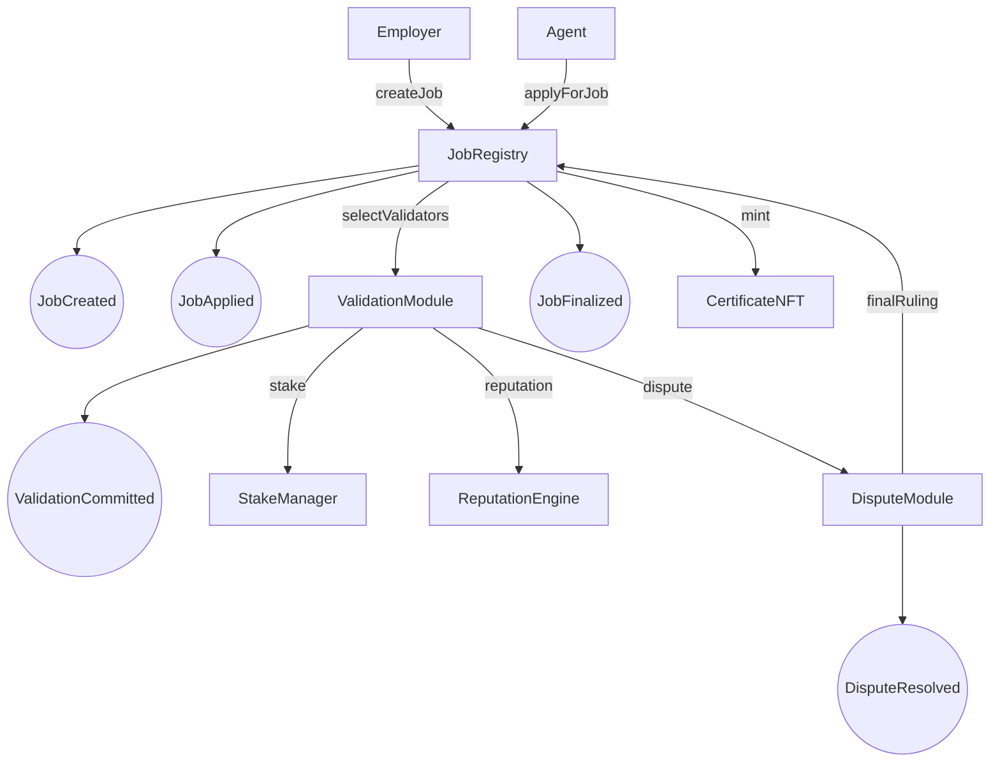
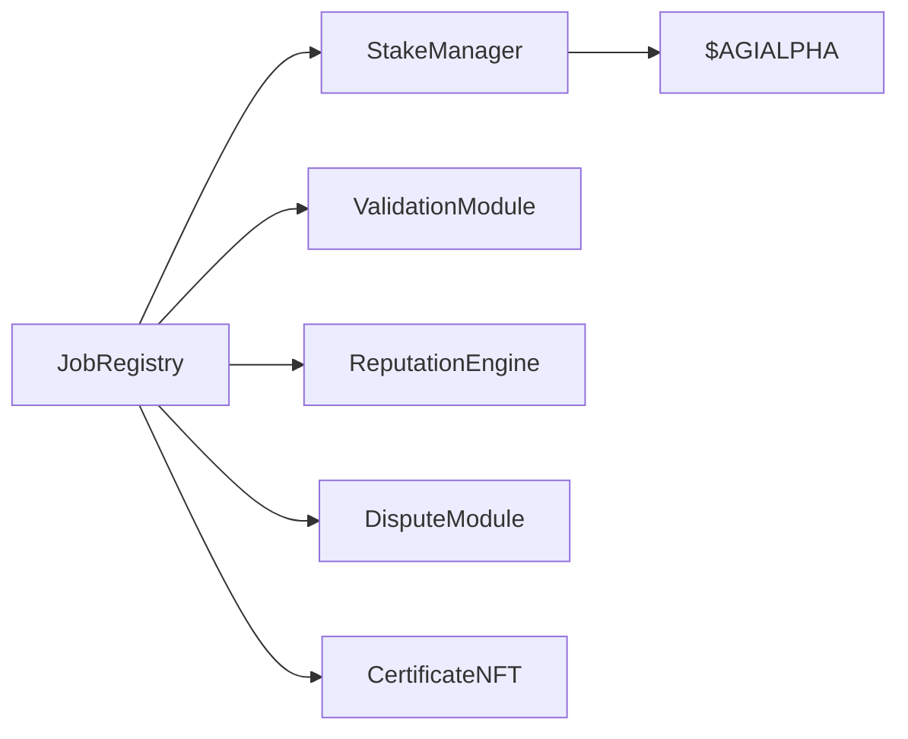
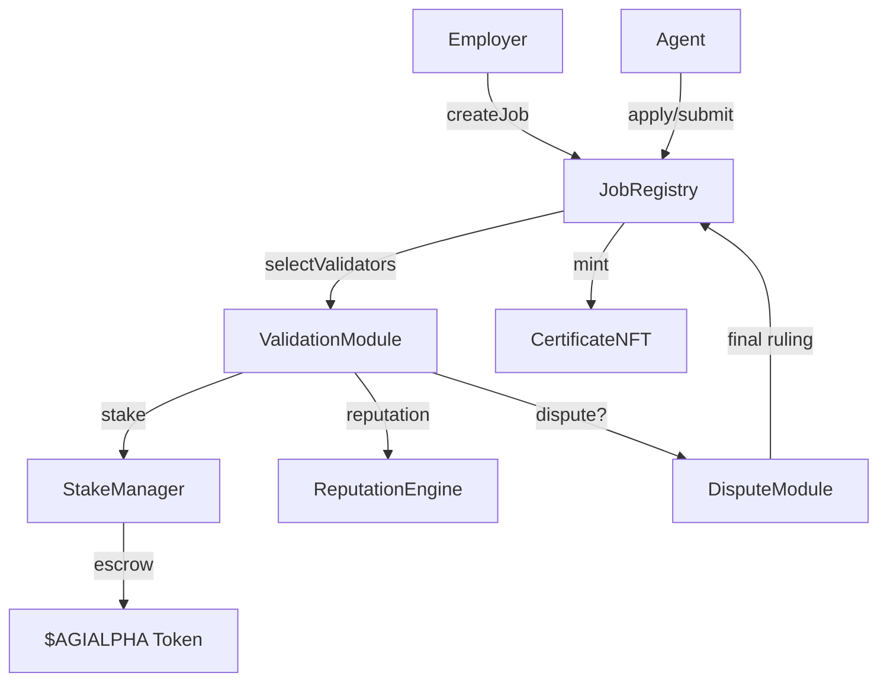
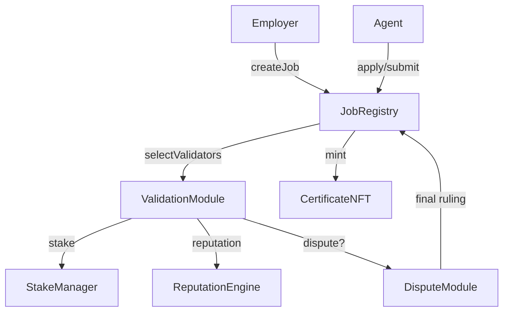
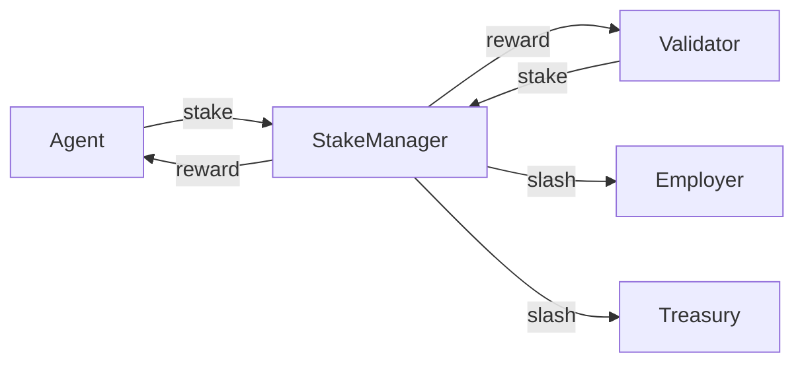
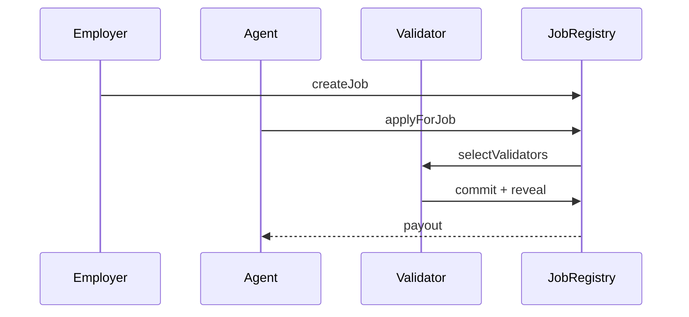
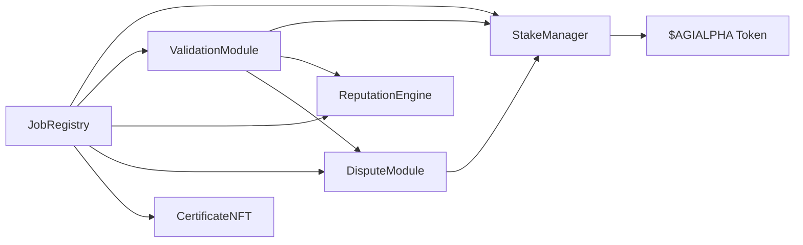

# AGIJob Manager
[](LICENSE) [](https://github.com/MontrealAI/AGIJobsv0/actions/workflows/ci.yml)

AGIJob Manager is an experimental suite of Ethereum smart contracts and tooling for coordinating trustless labor markets among autonomous agents. Both the legacy v0 contract and the modular v2 suite default to [$AGIALPHA](https://etherscan.io/address/0x2e8fb54c3ec41f55f06c1f082c081a609eaa4ebe) – a 6‑decimal ERC‑20 used for payments, staking, rewards and dispute deposits. The token address is stored on-chain and the contract owner may replace it at any time (`AGIJobManagerv0.updateAGITokenAddress` or `StakeManager.setToken` / `FeePool.setToken`) without redeploying any module. This repository hosts the immutable mainnet deployment (v0) and an unaudited v1 prototype under active development. Treat every address as unverified until you confirm it on-chain and through official AGI.eth channels.

Non‑technical owners can deploy and configure the legacy contract entirely from a web browser. The [deployment guide](docs/deployment-v0-agialpha.md) walks through using block‑explorer "Write" tabs to initialise `$AGIALPHA` for payments, staking, rewards and dispute resolution, all of which remain owner‑configurable without redeployment.

All modules expect amounts in 6‑decimal base units (`1 token = 1_000000`). Agents must control an ENS subdomain ending in `.agent.agi.eth`, while validators require one ending in `.club.agi.eth`. Should the owner choose to migrate to a different ERC‑20, calling `setToken` on `StakeManager` and `FeePool` updates the system without redeployment or data loss.

For a quick reference on migrating code, see [docs/v1-v2-function-map.md](docs/v1-v2-function-map.md) which maps every v1 function to its v2 counterpart.

For step‑by‑step instructions on deploying the legacy manager with `$AGIALPHA`, see [docs/deployment-v0-agialpha.md](docs/deployment-v0-agialpha.md). The guide uses block‑explorer write tabs so non‑technical owners can configure the contract without additional tooling.

## v2 Modular Contract Overview

The v2 release splits the monolithic manager into single‑purpose modules. Each contract owns its state and can be replaced without touching the rest of the system. Deploy modules sequentially in the following order:

1. [`AGIALPHAToken`](contracts/v2/AGIALPHAToken.sol) – 6‑decimal ERC‑20 used for stakes, rewards, and fees.
2. [`StakeManager`](contracts/v2/StakeManager.sol)
3. [`ReputationEngine`](contracts/v2/ReputationEngine.sol)
4. [`IdentityRegistry`](contracts/v2/IdentityRegistry.sol)
5. [`ValidationModule`](contracts/v2/ValidationModule.sol)
6. [`DisputeModule`](contracts/v2/modules/DisputeModule.sol)
7. [`CertificateNFT`](contracts/v2/CertificateNFT.sol)
8. [`JobRegistry`](contracts/v2/JobRegistry.sol)

Each subsequent constructor accepts addresses from earlier steps, so deploying in this order avoids placeholder values.

- **JobRegistry** – canonical job storage and router for companion modules; owner may swap module addresses with `setModules`.
- **StakeManager** – escrows rewards and stakes, distributes payouts, and supports token swaps via `setToken`.
- **IdentityRegistry** – verifies that agents and validators control the required ENS subdomains or are manually allowlisted.
- **ValidationModule** – selects validators and enforces commit/reveal finalization windows.
- **ReputationEngine** – tracks reputation and exposes `blacklist(user, status)` for owner‑managed access control.
- **DisputeModule** – optional appeals layer for contested jobs.
- **CertificateNFT** – mints ERC‑721 completion certificates after successful finalization.
- **FeePool** and **TaxPolicy** – collect protocol fees and burn or route them according to owner‑set percentages.

Owners retain `onlyOwner` control over parameters, letting them reconfigure live deployments without redeploying the suite.

## Deployment & Configuration

### Scripted deployment

For automated setups the repository ships with Hardhat and Foundry scripts.
Running them deploys the `$AGIALPHA` token and all core modules, wires
dependencies, transfers ownership to an optional multisig and writes contract
addresses to `docs/deployment-addresses.json`.

#### Hardhat

```bash
npx hardhat run scripts/deployAll.ts --network <network>
# transfer ownership to a multisig
MULTISIG=0xYourSafe npx hardhat run scripts/deployAll.ts --network <network>
```

#### Foundry

```bash
PRIVATE_KEY=<hex> OWNER=0xYourSafe \
forge script script/DeployAll.s.sol --broadcast --rpc-url $RPC_URL
```

#### Updating parameters post‑deployment

Rotate ENS roots or Merkle roots without redeploying:

```bash
# Hardhat
AGENT_ROOT=0x.. CLUB_ROOT=0x.. \
npx hardhat run scripts/updateParams.ts --network <network>

# Foundry
AGENT_ROOT=0x.. CLUB_ROOT=0x.. \
forge script script/UpdateParams.s.sol --broadcast --rpc-url $RPC_URL --private-key $PRIVATE_KEY
```

### Deploying legacy v0 with $AGIALPHA

**Prerequisites**
- `$AGIALPHA` token address (6‑decimal).
- ENS registry and NameWrapper contract addresses.
- ENS subdomain roots for `.agent.agi.eth` and `.club.agi.eth`; participants must control matching subdomains.

**Steps**
1. Deploy or reuse the [$AGIALPHA](https://etherscan.io/address/0x2e8fb54c3ec41f55f06c1f082c081a609eaa4ebe) token; it powers job payouts, agent/validator stakes, validation rewards and dispute fees by default.
2. On a block explorer, open `legacy/AGIJobManagerv0.sol` and use the **Deploy** or **Write Contract** interface to provide the constructor fields: token address, base IPFS URI, ENS registry, NameWrapper, agent/club root nodes, and the corresponding Merkle roots.
3. Submit the transaction; the sender becomes the owner.
4. After deployment the owner can switch payout, staking and reward tokens with `updateAGITokenAddress(newToken)` and rotate ENS roots or allowlists without redeploying.
5. All job posting, application, validation, dispute, and NFT marketplace calls happen through the contract's **Write** tab. Enter token amounts using 6‑decimal units (`1 token = 1_000000`).
6. For a screenshot walkthrough tailored to non‑technical users, consult [docs/etherscan-guide.md](docs/etherscan-guide.md).

#### Etherscan deployment steps
1. Browse to the verified `AGIJobManagerv0` contract on a block explorer and open **Contract → Write Contract**.
2. Connect the wallet that will own the deployment.
3. In the constructor section, supply `_agiTokenAddress` (6‑decimal `$AGIALPHA`), `_baseIpfsUrl`, `_ensAddress`, `_nameWrapperAddress`, `_clubRootNode`, `_agentRootNode`, and their Merkle roots.
4. Send the transaction; the sender becomes `owner`.
5. Still in **Write Contract**, the owner may update parameters at any time – e.g., `updateAGITokenAddress`, `setAgentRootNode`, `setClubRootNode`, `setAgentMerkleRoot`, or blacklist calls. Enter token amounts in 6‑decimal units.
6. To migrate to a different ERC‑20 later, call `updateAGITokenAddress(newToken)`; state persists and no redeployment is required.

### Manual v2 deployment via Etherscan

**Prerequisites**
- `$AGIALPHA` token address (6‑decimal) or another ERC‑20 to stake with.
- ENS registry and NameWrapper contract addresses.
- ENS root nodes for `.agent.agi.eth` and `.club.agi.eth`; only addresses with matching subdomains may participate.

**Steps**
1. **Deploy `$AGIALPHA`** – open the verified [`AGIALPHAToken`](contracts/v2/AGIALPHAToken.sol) on Etherscan, connect your wallet, and use **Contract → Deploy**. The token reports `decimals = 6`, so later amounts use base units (`1 token = 1_000000`).
2. **Deploy `StakeManager`** – on its contract page provide the token address and any desired fee or treasury parameters; leave module addresses zero for now.
3. **Deploy `ReputationEngine`** – supply the `StakeManager` address so reputation calculations can read staked balances.
4. **Deploy `IdentityRegistry`** – provide ENS registry, NameWrapper, and root nodes so agents and validators can prove ownership.
5. **Deploy `ValidationModule`** – pass the `StakeManager` address and defaults for timing and validator bounds. The `JobRegistry` address may be `0` at this stage.
6. **Deploy `DisputeModule`** – constructor takes the `JobRegistry` (optional for now), dispute fee (6‑decimal units) and window length.
7. **Deploy `CertificateNFT`** – provide name and symbol; the owner can later set the `JobRegistry` and `StakeManager` addresses via `setJobRegistry` and `setStakeManager`.
8. **Deploy `JobRegistry`** – supply addresses of the previously deployed modules along with any fee or stake defaults. Verify each contract source before proceeding.
9. **Wire modules and configure** – from each contract’s **Write Contract** tab call `JobRegistry.setModules(...)`, set ENS roots (`JobRegistry.setAgentRootNode`, `ValidationModule.setClubRootNode`), load Merkle roots, and register the identity registry using `JobRegistry.setIdentityRegistry` and `ValidationModule.setIdentityRegistry`. Enter all token amounts in 6‑decimal units.
10. **Rotate tokens later** – the owner may swap to a new ERC‑20 at any time by calling `StakeManager.setToken(newToken)` (and `FeePool.setToken` if used); no modules need redeployment.

### Owner configuration via Write tabs

After deployment, owners wire modules and tune parameters directly from block‑explorer **Write Contract** tabs:

- **Token address** – call `StakeManager.setToken(token)` (and `FeePool.setToken` if used) to register the 6‑decimal payout token.
- **ENS roots** – update identity anchors with `JobRegistry.setAgentRootNode` and `ValidationModule.setClubRootNode`.
- **Merkle roots** – load allowlists via `JobRegistry.setAgentMerkleRoot` and `ValidationModule.setValidatorMerkleRoot`.
- **Fees & thresholds** – adjust economics using `DisputeModule.setDisputeFee`, `StakeManager.setFeePct`, and `ValidationModule.setApprovalThreshold` / `setValidatorBounds`.
- **Module wiring** – from `JobRegistry` call `setModules(stakeManager, validationModule, disputeModule, certificateNFT, reputationEngine, feePool)` and update the reverse pointers on `StakeManager`, `ValidationModule`, and `CertificateNFT` with their respective setters.

### Etherscan Deployment Checklist

1. **Deploy `$AGIALPHAToken`** – a 6‑decimal ERC‑20 that powers stakes, rewards, and fees. When entering amounts on block explorers, supply integers (`1 token = 1_000000`).
2. **Deploy core modules** – `JobRegistry`, `StakeManager`, `ValidationModule`, `FeePool`, `TaxPolicy`, and any extras. Use [`Deployer.deployDefaults()`](contracts/v2/Deployer.sol) for a one‑shot setup or deploy each contract individually.
3. **Wire modules** – on `JobRegistry` → **Write Contract**, call `setModules(stakeManager, validationModule, disputeModule, feePool)` with the deployed addresses.
4. **Configure parameters** – from each module’s **Write** tab set tokens with `StakeManager.setToken` and `FeePool.setToken`; load ENS root nodes and allowlists via `JobRegistry.setAgentRootNode`, `ValidationModule.setClubRootNode`, `JobRegistry.setAgentMerkleRoot`, and `ValidationModule.setValidatorMerkleRoot`; initialize validator pools; and point `JobRegistry`/`DisputeModule` to a `TaxPolicy` using `setTaxPolicy`. Every setting is owner‑only and can be updated later without redeployment.
5. **Verify & interact** – verify sources for each address on Etherscan, then use the **Write Contract** tabs for staking, posting jobs, claiming rewards, and future admin updates.

> **ENS note:** Agents must control a `.agent.agi.eth` subdomain and validators a `.club.agi.eth` subdomain. Obtain the Merkle proof for your address from AGI operators or generate it from the published allowlist, then include the label and proof when calling `applyForJob` or `commitValidation`. See [ENS subdomain prerequisites](#ens-subdomain-prerequisites) for details.

### Module sequence
1. **Deploy** – use [`Deployer.sol`](contracts/v2/Deployer.sol) and call `deployDefaults()` or deploy each module manually.
2. **Wire modules** – if deploying individually, call `setModules(...)` on `JobRegistry` to provide the addresses of `StakeManager`, `ValidationModule`, `DisputeModule`, and `FeePool`.
3. **Verify events** – check for `ModulesUpdated` and `TokenUpdated` on each contract before allowing user funds.

### One-shot deployment & token swaps
1. Open the [`Deployer`](contracts/v2/Deployer.sol) contract on a block explorer and connect your wallet in **Write Contract**.
2. Execute **deployDefaults(ids)** – leaving struct fields empty uses `$AGIALPHA` and sensible defaults; the caller becomes owner and all modules wire themselves.
3. To change the payout token later, call [`StakeManager.setToken(newToken)`](contracts/v2/StakeManager.sol) and [`FeePool.setToken(newToken)`](contracts/v2/FeePool.sol); emit `TokenUpdated` to confirm the swap.
4. Other modules remain untouched, so token rotation never requires redeployment.

```ts
// deploy everything with sensible defaults
const Deployer = await ethers.getContractFactory("Deployer");
const deployer = await Deployer.deploy();
await deployer.deployDefaults({});

// swap the ERC-20 used for fees, stakes, and rewards
await stakeManager.setToken("0xNewToken");
await feePool.setToken("0xNewToken");
```

### Token setup
- All modules default to `$AGIALPHA` (6 decimals) for fees, staking, and rewards.
- To change the token later:
  1. On `StakeManager` → **Write**, call `setToken(newToken)`.
  2. On `FeePool` → **Write**, call `setToken(newToken)`.
  3. Wait for `TokenUpdated` on both contracts before proceeding.

### Etherscan interaction steps
**Employers**
1. Approve `$AGIALPHA` for the `StakeManager`.
2. In `JobRegistry` **Write**, call `acknowledgeTaxPolicy` then `createJob(reward, uri)`.
3. After validation, call `finalize(jobId)` to release funds.

**Agents**
1. In `StakeManager` **Write**, call `depositStake(0, amount)` using 6‑decimal units.
2. In `JobRegistry`, call `applyForJob(jobId)` and later `submit(jobId, uri)`.

**Validators**
1. Stake via `depositStake(1, amount)` on `StakeManager`.
2. In `ValidationModule`, call `commitValidation(jobId, hash)` then `revealValidation(jobId, approve, salt)`.

**Moderators**
1. Watch for `JobDisputed` events on `JobRegistry`.
2. Review evidence off-chain.
3. In `DisputeModule` → **Write**, call `resolve(jobId, employerWins)`.
4. Confirm `DisputeResolved` in the transaction log.

#### End-to-End Etherscan Flow
1. **Create job** – employer approves `$AGIALPHA` and calls `acknowledgeAndCreateJob(reward, uri)` on `JobRegistry`.
2. **Apply** – agent stakes if required and calls `applyForJob(jobId, subdomain, proof)` (or `stakeAndApply(jobId, amount)`).
3. **Validate** – selected validators call `commitValidation(jobId, hash, subdomain, proof)` and later `revealValidation(jobId, approve, salt)`.
4. **Finalize** – after the reveal window the employer calls `finalize(jobId)` (or any validator can finalize once the window closes); rewards and stakes settle automatically.

### NFT marketplace
`JobNFT` and `CertificateNFT` include minimal listing helpers for peer-to-peer sales. All prices use 6-decimal `$AGIALPHA` units (e.g., `ethers.parseUnits("1", 6)` for `1.000000`).

1. **List** – token owner calls `list(tokenId, price)`.
2. **Purchase** – buyer approves the NFT contract for `price` and calls `purchase(tokenId)`; the contract transfers `price` tokens to the seller and moves the NFT to the buyer.
3. **Delist** – seller removes an active listing via `delist(tokenId)`.

### Owner controls
The contract owner can reconfigure live deployments without redeployment. Use a block explorer's **Write Contract** tab to call the setters below.

#### JobRegistry
- `setValidationModule(address)`
- `setReputationEngine(address)`
- `setStakeManager(address)`
- `setCertificateNFT(address)`
- `setDisputeModule(address)`
- `setFeePool(address)`
- `setFeePct(uint256)`
- `setAgentRootNode(bytes32)`
- `setAgentMerkleRoot(bytes32)`
- `setJobParameters(uint256 reward, uint256 stake)`
- `setModules(address validationModule, address reputationEngine, address stakeManager, address certificateNFT, address disputeModule)` – emits `ModulesUpdated`
- `pause()` / `unpause()`

#### StakeManager
- `setMinStake(uint256)`
- `setMaxStakePerAddress(uint256)`
- `setSlashingPercentage(uint8 role, uint256 pct)`
- `setToken(address)`
- `setTreasury(address)`
- `setBlacklist(address, bool)`
- `pause()` / `unpause()`

#### ValidationModule
- `setStakeManager(address)`
- `setDisputeBond(uint256)`
- `setChallengeWindow(uint256)`
- `setDisputeResolution(address)`
- `setReputationEngine(address)`
- `setClubRootNode(bytes32)`
- `setValidatorMerkleRoot(bytes32)`
- `setValidatorsPerJob(uint256)`
- `setCommitWindow(uint256)`
- `setRevealWindow(uint256)`
- `setValidatorPool(address[])`
- `setOutcome(uint256 jobId, bool success)`

#### ReputationEngine
- `setCaller(address, Role)`
- `setAgentThreshold(uint256)`
- `setValidatorThreshold(uint256)`
- `setThreshold(Role, uint256)`
- `setValidationRewardPercentage(uint256)`
- `setDecayConstant(uint256)`

#### DisputeModule
- `setStakeManager(address)`
- `setReputationEngine(address)`
- `setValidationModule(address)`

#### CertificateNFT
- `setBaseURI(string)`
- `setJobRegistry(address)`

#### FeePool
- `ownerWithdraw(address to, uint256 amount)`
- `setToken(address)`
- `setStakeManager(address)`
- `setRewardRole(uint8 role)`
- `setBurnPct(uint256)`
- `setTreasury(address)`

#### TaxPolicy
- `setPolicyURI(string)`
- `setAcknowledgement(string)`
- `setPolicy(string uri, string text)`
- `bumpPolicyVersion()`

### Ownership transfer sequence

To safeguard administration rights, move ownership of every module to a multisig wallet (e.g. Gnosis Safe) after deployment:

1. **Deploy/choose multisig** – create or identify the multisig address that will administer the system.
2. **Transfer each module** – from the current owner, call `transferOwnership(multisig)` on `JobRegistry`, `StakeManager`, `ValidationModule`, `ReputationEngine`, `DisputeModule`, `CertificateNFT`, `FeePool`, `TaxPolicy`, and any other live contracts.
3. **Verify ownership** – confirm the `OwnershipTransferred` event or call `owner()` on each contract to ensure the multisig now controls it.
4. **Operate via multisig** – execute future admin actions (pause/unpause, root rotations, parameter updates) from the multisig account.

## Non-technical deployment guide

1. **Deploy modules** – on the [`Deployer`](contracts/v2/Deployer.sol) page of a block explorer choose `deployDefaults()`; the caller becomes owner and all modules wire themselves using `$AGIALPHA` with sensible defaults (5% fee, 5% burn, 1‑token minimum stake).
2. **Confirm defaults** – after deployment check emitted `TokenUpdated`, `FeePctUpdated`, and similar events to verify parameters. Constructors fall back to the caller for owner/treasury addresses when inputs are left blank.
3. **Post jobs** – employers approve `$AGIALPHA` for the `StakeManager` and call `JobRegistry.acknowledgeAndCreateJob(reward, uri)` from the Write tab.
4. **Stake & apply** – agents approve the stake amount and call `JobRegistry.stakeAndApply(jobId, amount)` (or `acknowledgeAndApply(jobId)` when no stake is required).
5. **Register platforms** – operators stake and register in one transaction through `PlatformRegistry.acknowledgeStakeAndRegister(amount)` or use `PlatformIncentives.acknowledgeStakeAndActivate(amount)` to enable routing.
6. **Claim fees** – stakers withdraw revenue by calling `FeePool.claimRewards()`, which first runs the idempotent `distributeFees` so no extra transaction is needed.
7. **Reconfigure as needed** – the owner can swap payout tokens via `StakeManager.setToken` and `FeePool.setToken`, or update ENS roots and allowlists with `setAgentRootNode`, `setClubRootNode`, `setAgentMerkleRoot`, `setValidatorMerkleRoot`, `setENS`, and `setNameWrapper`—no redeploy required.

For narrated walkthroughs and block‑explorer screenshots, see [docs/deployment-agialpha.md](docs/deployment-agialpha.md) and [docs/etherscan-guide.md](docs/etherscan-guide.md).

**$AGIALPHA units** – The token powers all fees, stakes, and rewards. It reports `decimals = 6`, so enter amounts in base units (`1` token = `1_000000`).

### ENS subdomain prerequisites

- **Agents** must control an ENS subdomain ending in `.agent.agi.eth`.
- **Validators** require a subdomain ending in `.club.agi.eth`.
- Calls like `applyForJob` and `commitValidation` take your subdomain label and a Merkle proof. A valid proof lets [`ENSOwnershipVerifier.verifyOwnership`](contracts/v2/modules/ENSOwnershipVerifier.sol) skip on-chain ENS lookups, confirming membership off-chain and saving gas.
- Owners may rotate ENS roots or allowlists at any time with `setAgentRootNode`, `setClubRootNode`, `setAgentMerkleRoot`, `setValidatorMerkleRoot`, `setENS`, and `setNameWrapper` without redeploying contracts.
- **Getting a subdomain** – open `agi.eth` in the [ENS Manager](https://app.ens.domains), create `yourname.agent.agi.eth` or `yourname.club.agi.eth`, and point it to your wallet address. If creation is restricted, request a subdomain from the AGI operators. For more on managing subdomains, see the [ENS documentation](https://docs.ens.domains/fundamentals/subdomains).

Sample `verifyOwnership` call:

```solidity
ENSOwnershipVerifier.verifyOwnership(
    0xYourAddress,
    "alice",
    [0xabc..., 0xdef...],
    agentRootNode
);
```

Troubleshooting tips:
- Ensure the subdomain label matches the ENS name exactly (case-sensitive).
- Use the correct root node: `agentRootNode` for agents, `clubRootNode` for validators.
- If a proof fails, verify your address is in the operator's allowlist and that the proof order matches.
- Wrapped names require the `NameWrapper` address to be set; otherwise the lookup falls back to the resolver.
## Quick Deploy with $AGIALPHA

Call `Deployer.deployDefaults()` to spin up and wire all core modules in one transaction. It applies baked‑in economics (5% fee, 5% burn, 1‑token minimum stake) and makes the caller the owner.

**One-call helpers**

- `JobRegistry.acknowledgeAndCreateJob(reward, uri)`
- `JobRegistry.stakeAndApply(jobId, amount)`
- `JobRegistry.acknowledgeAndApply(jobId)`
- `PlatformRegistry.acknowledgeStakeAndRegister(amount)`
- `PlatformRegistry.acknowledgeAndDeregister()`
- `PlatformIncentives.acknowledgeStakeAndActivate(amount)`
- `PlatformIncentives.stakeAndActivate(amount)`
- `JobEscrow.acknowledgeAndAcceptResult(jobId)`

**Base units:** `$AGIALPHA` uses 6 decimals (`1 token = 1_000000`). Approve these amounts before using helpers.

| Constructor default | Value (base units) | Notes |
| --- | --- | --- |
| `feePct` | 5% | Protocol fee in `JobRegistry` |
| `burnPct` | 5% | Portion of each fee burned by `FeePool` |
| `commitWindow` | 86400 | Validator commit window (1 day) |
| `revealWindow` | 86400 | Validator reveal window (1 day) |
| `minStake` | 1_000000 | Global minimum stake |
| `jobStake` | 1_000000 | Minimum agent stake per job |

| Helper | Required approval (base units) | Description |
| --- | --- | --- |
| `acknowledgeAndCreateJob` | `reward + fee` to `StakeManager` | Post a job after acknowledging policy |
| `stakeAndApply` | `amount` to `StakeManager` | Deposit stake and apply in one call |
| `acknowledgeAndApply` | `0` if no stake | Acknowledge policy and apply with no deposit |
| `acknowledgeStakeAndRegister` | `amount` to `StakeManager` | Stake and register a platform |
| `acknowledgeStakeAndActivate` | `amount` to `StakeManager` | Stake, register, and enable routing |
| `stakeAndActivate` | `amount` to `StakeManager` | Register and route without acknowledgement |
| `acknowledgeAndDeregister` | `0` | Deregister a platform after acknowledging policy |
| `acknowledgeAndAcceptResult` | `0` | Employer acknowledges policy and accepts result |

For screenshot walkthroughs, see [docs/deployment-agialpha.md](docs/deployment-agialpha.md) and [docs/etherscan-guide.md](docs/etherscan-guide.md).

### Step-by-Step Etherscan Instructions

Use the following quick checklists for common flows (see [docs/etherscan-guide.md](docs/etherscan-guide.md) for screenshots):

#### Post a Job
1. **Approve** – on the `$AGIALPHA` token page approve `StakeManager` for `reward + fee` in 6‑decimal units.
2. **Helper call** – in `JobRegistry` → **Write**, call `acknowledgeAndCreateJob(reward, uri)`.
3. **Verify events** – check the transaction log for `JobCreated`.

#### Verify ENS Ownership
1. Obtain the Merkle proof for your address from the operator.
2. On `ENSOwnershipVerifier` → **Write**, call `verifyOwnership(you, subdomain, proof, rootNode)`.
   - Agents use the root node for `agent.agi.eth`; validators use `club.agi.eth`.
   - A valid proof bypasses on-chain ENS lookups and emits `OwnershipVerified`.

#### Apply for a Job
1. **Approve** – approve the stake amount on `$AGIALPHA` if required.
2. **Call** – in `JobRegistry` → **Write**, call `applyForJob(jobId, subdomain, proof)` (or `stakeAndApply(jobId, amount)` to combine staking).
3. **Verify events** – confirm `JobApplied` on `JobRegistry` and any `StakeDeposited` logs on `StakeManager`.

#### Commit a Vote
1. During the commit window, open `ValidationModule` → **Write**.
2. Call `commitValidation(jobId, commitHash, subdomain, proof)`.
3. When the reveal window opens, call `revealValidation(jobId, approve, salt)` from the same tab.

#### Register a Platform
1. **Approve** – approve a stake for `StakeManager` (owners may pass `0`).
2. **Helper call** – on `PlatformRegistry` → **Write**, call `acknowledgeStakeAndRegister(amount)`.
3. **Verify events** – check for `Registered` and any `StakeDeposited` logs.

#### Contribute to the Reward Pool
1. **Approve** – approve the contribution amount on `$AGIALPHA`.
2. **Call** – on `FeePool` → **Write**, call `contribute(amount)` using 6‑decimal units.
3. **Verify events** – check for `RewardPoolContribution` on `FeePool`.

#### Raise a Dispute
1. **Approve** – approve the dispute fee on `$AGIALPHA`.
2. **Helper call** – in `JobRegistry` → **Write**, call `acknowledgeAndDispute(jobId, evidence)`; the registry forwards to `DisputeModule.raiseDispute`.
3. **Verify events** – confirm `DisputeRaised` on the `DisputeModule`.

For screenshots and extended walkthroughs, see [docs/etherscan-guide.md](docs/etherscan-guide.md). Owners may swap payout tokens later without redeploying via `StakeManager.setToken` and `FeePool.setToken`.

### One-call flows

All helper calls below accept `$AGIALPHA` amounts in 6‑decimal base units and automatically record tax acknowledgements on-chain:

- `StakeManager.acknowledgeAndDeposit`
- `PlatformRegistry.acknowledgeAndRegister`
- `PlatformRegistry.acknowledgeStakeAndRegister`
- `PlatformRegistry.acknowledgeAndDeregister`
- `PlatformIncentives.acknowledgeStakeAndActivate`
- `JobRegistry.acknowledgeAndCreateJob` / `JobRegistry.stakeAndApply`
- `JobEscrow.acknowledgeAndAcceptResult`

### Deployment simplifications & defaults

StakeManager and FeePool constructors each accept an `IERC20 token` address and an optional `_treasury`. Leaving address fields blank (`0` or `address(0)`) defaults them to `msg.sender`, streamlining Etherscan deployments. StakeManager additionally lets the deployer pre‑wire a `jobRegistry` and `disputeModule`; supplying `address(0)` for either defers wiring to a later `setModules` call. Deployments here default to the $AGIALPHA token above, and passing `address(0)` uses the owner as treasury. Should economics change, the owner may later call `setToken` on these modules to point to a different ERC‑20 without redeploying. If a zero token address is supplied, both modules automatically fall back to the $AGIALPHA default.

Other constructors now ship with sensible defaults so a deployer can leave parameters empty when using Etherscan:

- `StakeManager` splits slashing 100% to the treasury when percentages are omitted.
- `JobRegistry` applies a 5% protocol fee if `_feePct` is `0`.
- `JobRegistry` emits `ModuleUpdated` events for any modules supplied at deployment, making on-chain verification easier.
- `ValidationModule` defaults to 1‑day commit/reveal windows with 1–3 validators if zero values are provided.
- Constructors emit configuration events (`TokenUpdated`, `MinStakeUpdated`, etc.) at deployment so non‑technical users can confirm settings directly on Etherscan.
- `GovernanceReward` falls back to `$AGIALPHA`, a 1‑week epoch and 5% reward share when its constructor arguments are left blank.

All v2 constructors omit the `owner` argument—the deploying address automatically becomes the owner via `Ownable(msg.sender)`.

Helper functions expose common flows in single calls so Etherscan users do not have to chain multiple transactions:

- `JobRegistry.acknowledgeAndCreateJob` posts work after acknowledging the tax policy.
- `JobRegistry.acknowledgeAndCancel` cancels a job after acknowledging the tax policy.
- `JobRegistry.stakeAndApply` deposits stake and applies to a job.
- `JobRegistry.acknowledgeAndApply` acknowledges the tax policy and applies when no stake is needed.
- `PlatformIncentives.stakeAndActivate` (and `acknowledgeStakeAndActivate`) stakes and registers a platform for routing and fees.
- `PlatformRegistry.acknowledgeAndRegister` lists an operator without staking.
- `PlatformRegistry.acknowledgeAndDeregister` removes an operator after acknowledging the tax policy.
- `JobEscrow.acknowledgeAndAcceptResult` lets employers acknowledge the policy and release escrow.
- `FeePool.claimRewards` auto-distributes any pending fees before paying the caller.
- `FeePool.distributeFees` never reverts; if no stake exists, fees are sent to the treasury after burning.
- `FeePool.contribute` transfers tokens to the pool and credits `pendingFees`.
- `StakeManager.acknowledgeAndDeposit` and `acknowledgeAndDepositFor` stake tokens after acknowledging the tax policy, reducing transactions for users and helpers.

All participants opt in by staking `$AGIALPHA`. Staked operators gain routing priority and revenue share, while the main deploying entity is a special case that registers with **stake = 0**, earning no boosts so it remains tax neutral. Because every incentive flows on-chain, operators can participate pseudonymously without creating off‑chain reporting obligations.

For a step‑by‑step deployment walkthrough using $AGIALPHA and Etherscan, see [docs/deployment-agialpha.md](docs/deployment-agialpha.md).
For a detailed description of the platform-wide incentive architecture, see [docs/universal-platform-incentive-architecture.md](docs/universal-platform-incentive-architecture.md).

### Quick start: $AGIALPHA deployment

1. Verify the [$AGIALPHA](https://etherscan.io/address/0x2e8fb54c3ec41f55f06c1f082c081a609eaa4ebe) token address (6 decimals) and all module addresses listed in [docs/deployment-agialpha.md](docs/deployment-agialpha.md).
2. Through a block explorer’s **Write Contract** tabs:
   - Approve `$AGIALPHA` for the `StakeManager`.
   - Call `StakeManager.acknowledgeAndDeposit(role, amount)` (or `acknowledgeAndDepositFor` when staking for another address) using 6‑decimal units (`1` token = `1_000000`).
   - Platform operators may call `PlatformIncentives.stakeAndActivate(amount)` to stake and register in one step.
   - Employers can accept the tax policy and post work in one transaction via
     `JobRegistry.acknowledgeAndCreateJob(reward, uri)` after approving the
     `StakeManager` for `reward + fee`.
   - Agents can deposit stake and apply in one call with
     `JobRegistry.stakeAndApply(jobId, amount)` after approving the
     `StakeManager` for the stake amount, or simply
     `JobRegistry.acknowledgeAndApply(jobId)` if no stake is required.
   - Stakers can claim protocol fees with a single call to `FeePool.claimRewards()`; any pending fees are distributed automatically.
3. Fees, staking rewards, and dispute deposits all move in `$AGIALPHA` by default. The contract owner can swap the payment token later via `StakeManager.setToken` and related setters without redeploying other modules.
4. Before staking or claiming rewards, call `JobRegistry.acknowledgeTaxPolicy` and confirm `isTaxExempt()` on each module.

#### Beginner-friendly Etherscan flow

1. **Open a contract** – navigate to its address on Etherscan and select the **Contract → Write** tab.
2. **Connect wallet** – click *Connect to Web3* so transactions come from your address.
3. **Approve spending** – on the `$AGIALPHA` token page call `approve(StakeManager, amount)` using 6‑decimal units.
4. **Stake** – on `StakeManager` call `acknowledgeAndDeposit(role, amount)`.
5. **Activate a platform** – if you are an operator, call `PlatformIncentives.stakeAndActivate(amount)` (use `0` for the owner’s zero‑stake case).
6. **Verify registration** – check `PlatformRegistry.getScore(address)` and `JobRouter.registered(address)` in the **Read** tabs.
7. **Claim fees later** – simply call `FeePool.claimRewards()`; it first runs the idempotent `distributeFees` to settle any pending fees before paying rewards.

This summary is for convenience only. Screenshots and extended explanations are provided in [docs/deployment-agialpha.md](docs/deployment-agialpha.md).

### Regulatory disclaimer

Regulatory shifts may change compliance obligations even when rewards flow entirely on-chain. While the design minimises reporting by routing fees directly in $AGIALPHA, participants must still monitor policy updates, obey local laws, and obtain professional advice before interacting with the contracts. On-chain rewards do not exempt any party from local regulations. The protocol itself never issues tax forms or collects personal data; every operator remains responsible for self‑reporting and compliance within their jurisdiction. Nothing in this repository or its documentation constitutes legal, financial, or tax advice.

### Trust assumptions

- **Deterministic randomness** – validator selection mixes owner-supplied seeds with on-chain entropy. Results are reproducible, and no external randomness oracle is consulted.
- **Owner control** – every module is `Ownable`; the owner can retune parameters or swap tokens at any time. Participants implicitly trust this address.
- **No external subscriptions** – the system uses on-chain entropy only. It has no Chainlink VRF or subscription-based dependencies.

### Roles & Staking Summary

- **Employer** – posts jobs and escrows rewards.
- **Agent** – stakes under role `0` and submits work.
- **Validator** – stakes under role `1` and votes on jobs.
- **Platform operator** – stakes under role `2` then registers for routing priority and fee share.

**Staking & Fees**
1. Approve $AGIALPHA and call `StakeManager.acknowledgeAndDeposit(role, amount)` using 6‑decimal base units (`1` token = `1_000000`, `0.5` = `500000`).
2. Platform operators call `PlatformRegistry.register()` after staking.
3. When jobs finalize, anyone can call `FeePool.distributeFees()`; stakers withdraw via `FeePool.claimRewards()`.

*Zero‑stake deployer* – the owner may register with amount `0`, appearing in `PlatformRegistry` without routing weight or rewards.

Key incentive features in the v2 suite:

- **On‑chain revenue sharing** – `FeePool` redistributes protocol fees to staked platform operators, requiring no off‑chain reporting.
- **Stake‑weighted routing & discovery** – `PlatformRegistry` and `JobRouter` prioritise operators with higher stake and reputation; well‑staked validators receive additional validation slots.
- **Governance rewards** – `GovernanceReward` pays bonuses to voters who participate in parameter polls.
- **Sybil and regulatory mitigation** – minimum stakes, burn sinks, and blacklist controls deter abuse while keeping participants pseudonymous.
- **Tax‑neutral pseudonymity** – every module rejects direct ETH and exposes `isTaxExempt()` so rewards flow on‑chain in $AGIALPHA with no off‑chain reporting.
- **Owner‑controlled configuration** – every module exposes `Ownable` setters so the owner can adjust tokens, fees and stake thresholds directly through Etherscan without redeploying contracts.

### Platform Operator Incentives

Staking $AGIALPHA through `PlatformIncentives.stakeAndActivate` registers a platform in `PlatformRegistry`, boosts its routing priority in `JobRouter`, and entitles it to a proportional share of fees from `FeePool`. Fees are split on-chain according to `stake / totalStake`, so an operator with 2,000,000 units (2 tokens) out of 10,000,000 total stake receives 20% of each distribution. The main deployer, with a default stake of `0`, is listed only for demonstration and earns no share. In short: **staking → routing priority → revenue share**.

#### Etherscan registration

- **Register with stake**
  1. Approve `StakeManager` for the desired amount of $AGIALPHA.
  2. Open `PlatformIncentives` on Etherscan and call `stakeAndActivate(amount)` from the **Write Contract** tab.
  3. Verify `PlatformRegistry.getScore(address)` is greater than zero and later claim fees via `FeePool.claimRewards()`.

- **Owner zero-stake registration** – The deployer may register to test the system but receives no routing or revenue boost.
  1. Skip staking and open `PlatformRegistry` on Etherscan.
  2. From the **Write Contract** tab, call `register()` to list the platform without routing weight or fee share.
  3. `PlatformRegistry.getScore(owner)` returns `0` and `FeePool.claimRewards()` emits a zero payout.

On-chain rewards do not remove your obligation to follow local tax laws; consult professionals.

### Owner Controls

The contract owner may retune any economic parameter without redeploying modules. `StakeManager.setToken`, `FeePool.setToken`, and related setters swap the payment token (default $AGIALPHA, 6 decimals), while `setMinStake`, `setFeePct`, `setBurnPct`, and module `setModules` calls update fees, stake thresholds, burn rates, and wiring. All changes are performed through block‑explorer "Write" tabs, keeping administration accessible to non‑technical owners.

### Universal Stake-Based Incentive Architecture

- Operators opt in by staking **$AGIALPHA**. Staked addresses gain routing priority, a share of protocol fees, and permission to activate their own job portals.
- The main deploying entity is a special case with **stake = 0**. It receives no routing preference or fee share, keeping its involvement tax neutral and reporting free while still demonstrating network functionality.
- All value flows are enforced entirely on-chain through modules such as `StakeManager`, `FeePool`, and `PlatformRegistry`, allowing participants to remain pseudonymous and avoiding off-chain accounting or reporting.
- Every economic parameter—token address, fee split, minimum stake, burn percentage—can be retuned by the contract owner via `Ownable` setters, without redeploying modules.
- Staked participants must comply with local regulations even though rewards are distributed on-chain; see [docs/tax-obligations.md](docs/tax-obligations.md) for guidance.
- All interactions are available through block explorer "Write" tabs, keeping the system accessible to non-technical users without bespoke tooling.
- `PlatformIncentives` lets operators stake and register in a single `stakeAndActivate` call after approving the `StakeManager`, streamlining on‑chain onboarding.

Within this unified, pseudonymous economy:
- **Employers** lock job rewards in $AGIALPHA.
- **Agents** and **validators** stake to access work and secure validation rights.
- **Platform operators** stake to activate portals, gain routing priority, and claim protocol fees.
- The **contract owner** tunes parameters only; with a default stake of `0`, it receives no fee share or routing boost.
All value transfers occur on-chain while `Ownable` setters let the owner retune incentives without redeployment.


| Role              | Stake Requirement | Incentives unlocked                                             |
|-------------------|------------------:|-----------------------------------------------------------------|
| Platform operator | `minPlatformStake`| Routing priority, platform‑fee share, ability to activate portal |
| Agent             | `jobStake`        | Job rewards, reputation points, certificate NFTs                |
| Validator         | owner‑set minimum | Validation rewards, reputation gains                            |
| Main deployer     | 0                 | Demonstration only; **no** fee share or routing preference      |

> **Critical Security Notice:** `AGIJobManagerv0.sol` in `legacy/` is the exact source for the mainnet contract at [`0x0178…ba477`](https://etherscan.io/address/0x0178b6bad606aaf908f72135b8ec32fc1d5ba477). It is immutable and must never be altered. Any future releases will appear as new files (for example, `contracts/AGIJobManagerv1.sol`) and will be announced only through official AGI.eth channels. Always cross‑check contract addresses and bytecode on multiple explorers before sending funds or interacting with a deployment.

## Quick Links

- [AGIJobManager v0 on Etherscan](https://etherscan.io/address/0x0178b6bad606aaf908f72135b8ec32fc1d5ba477#code) – verify the 0x0178… address independently before interacting.
- [AGIJobManager v0 on Blockscout](https://blockscout.com/eth/mainnet/address/0x0178b6bad606aaf908f72135b8ec32fc1d5ba477/contracts)
- [AGIJobs NFT Collection on OpenSea](https://opensea.io/collection/agijobs) – confirm the collection contract on a block explorer before trading.
- [AGIJobs NFT contract on Etherscan](https://etherscan.io/address/0x0178b6bad606aaf908f72135b8ec32fc1d5ba477#code) / [Blockscout](https://blockscout.com/eth/mainnet/address/0x0178b6bad606aaf908f72135b8ec32fc1d5ba477/contracts) – cross-check the address on multiple explorers before trading.
- [$AGI token contract on Etherscan](https://etherscan.io/address/0xf0780F43b86c13B3d0681B1Cf6DaeB1499e7f14D#code) / [Blockscout](https://eth.blockscout.com/address/0xf0780F43b86c13B3d0681B1Cf6DaeB1499e7f14D?tab=contract) – cross-verify the token address before transacting.
- [$AGIALPHA token contract on Etherscan](https://etherscan.io/address/0x2e8fb54c3ec41f55f06c1f082c081a609eaa4ebe#code) – verify this 6‑decimal token on-chain before using it for staking or payments.
- [AGIALPHAToken source](contracts/v2/AGIALPHAToken.sol) – default 6‑decimal ERC‑20 with owner‑controlled mint and burn.
- [Etherscan Interaction Guide](docs/etherscan-guide.md) – module diagram, deployed addresses, role-based instructions, and verification checklist.
- [AGIALPHA operational workflows](docs/agialpha-workflows.md) – approval/staking, platform registration, fee claiming, and dispute steps with 6‑decimal examples.
- [Project Overview](docs/overview.md) – architecture diagram, module summaries, governance table, incentive mechanics, deployment addresses, and quick start.
- [AGIJobManager v0 Source](legacy/AGIJobManagerv0.sol)
- [AGIJobManager v1 Source](contracts/AGIJobManagerv1.sol) – experimental upgrade using Solidity 0.8.21; includes an automatic token burn on final validation via the `JobFinalizedAndBurned` event and configurable burn parameters. Not deployed; treat any address claiming to be v1 as unverified until announced through official channels.
- [AGIJobManager v2 Architecture](docs/architecture-v2.md) – modular design with incentive analysis and interface definitions.
- [Modular Architecture & Interfaces](docs/modular-architecture-v2.md) – contract separation with interface snippets and gas tips.
- [v2 Module & Interface Reference](docs/v2-module-interface-reference.md) – condensed module graph, core interfaces, and gas/incentive notes.
- [Coding Sprint for v2](docs/coding-sprint-v2.md) – step-by-step plan for implementing the modular suite.
- [Incentive Mechanisms for $AGIALPHA](docs/incentive-mechanisms-agialpha.md) – revenue sharing, routing priority, governance rewards, and sybil mitigation.
- [Coding Sprint: $AGIALPHA Incentive Modules](docs/coding-sprint-agialpha-incentives.md) – tasks for integrating fee pools and discovery incentives.
- [Coding Sprint: Platform Incentives](docs/coding-sprint-platform-incentives.md) – consolidates operator staking, routing and fee share.
- [Coding Sprint: ENS Identity & v1 Feature Parity](docs/coding-sprint-ens-parity.md) – tasks for ENS subdomain enforcement and v0 parity.
- [Production-Scale AGIJobs Platform Sprint Plan](docs/ProductionScaleAGIJobsPlatformSprintPlanv0.md) – background research and
  architectural rationale behind the modular design.
- [Deployment Guide for $AGIALPHA](docs/deployment-agialpha.md) – non-technical walkthrough for deploying and configuring the suite with the 6‑decimal token.
- [Deployment Guide: AGIJobManager v0 with $AGIALPHA](docs/deployment-v0-agialpha.md) – step-by-step explorer walkthrough for the monolithic contract.
- [Tax Obligations & Disclaimer](docs/tax-obligations.md) – participants bear all taxes; contracts and owner remain exempt.
- [TaxPolicy contract](contracts/v2/TaxPolicy.sol) – owner‑updatable disclaimer with `policyDetails`, `policyVersion`, and `isTaxExempt()` helpers; `JobRegistry.acknowledgeTaxPolicy` emits `TaxAcknowledged(user, version, acknowledgement)` for on‑chain proof.
- [v2 deployment script](scripts/v2/deploy.ts) – deploys core modules, wires `StakeManager`, and installs the tax‑neutral `TaxPolicy`.

## Etherscan "Write" Checklist

- [ ] Connect to Web3 on a contract's **Write** tab
- [ ] Call `PlatformIncentives.stakeAndActivate`
- [ ] Trigger `FeePool.distributeFees`
- [ ] Withdraw with `FeePool.claimRewards`

For screenshots and step-by-step instructions, see [docs/etherscan-guide.md](docs/etherscan-guide.md).

## Deploying with $AGIALPHA

The modular v2 suite is deployed module by module and then wired together on‑chain. The 6‑decimal **$AGIALPHA** token is the default currency for payments, staking, rewards, and dispute deposits. Deploy modules in the following order:

1. `StakeManager`
2. `JobRegistry`
3. `ValidationModule`
4. `ReputationEngine`
5. `DisputeModule`
6. `CertificateNFT`
7. `PlatformRegistry`
8. `JobRouter`
9. `PlatformIncentives`
10. `FeePool`
11. `TaxPolicy` (optional)
12. `ModuleInstaller` (optional)

If any addresses were left unset during deployment, transfer ownership of each module to the installer and call `ModuleInstaller.initialize(jobRegistry, stakeManager, validationModule, reputationEngine, disputeModule, certificateNFT, platformIncentives, platformRegistry, jobRouter, feePool, taxPolicy)` once from the installer's owner. This `onlyOwner` call wires cross‑links, sets the protocol fee pool and optional tax policy, and automatically returns ownership. Every parameter remains owner‑configurable post‑deployment via module `onlyOwner` setters.

Authorize a helper such as `PlatformIncentives` with `PlatformRegistry.setRegistrar` and `JobRouter.setRegistrar` so operators can opt in using one transaction. Dispute appeals require approving the `StakeManager` for the `disputeFee` in $AGIALPHA and calling `JobRegistry.raiseDispute(jobId, evidence)`; no ETH is ever sent, the bond stays entirely in `$AGIALPHA`.

Tune economics via `StakeManager.setMinStake`, `StakeManager.setSlashingPercentages`, `ValidationModule.setCommitRevealWindows` (24h defaults) and `ValidationModule.setValidatorBounds`, `DisputeModule.setDisputeFee`, and `FeePool.setBurnPct`.

### Token units & swapping

$AGIALPHA uses 6‑decimal base units for all payments, stakes and dispute bonds:

```
1 token   = 1_000000
0.5 token =   500000
0.1 token =   100000
25 tokens = 25_000000
```

Use these integers for every approval and constructor parameter. The owner can later swap to a different ERC‑20 via `StakeManager.setToken` without redeploying other modules. The deployer must also stake; an address with zero stake receives no job routing or FeePool revenue.

### Etherscan registration checklist

- Sign in to [Etherscan](https://etherscan.io) and open each deployed contract address.
- Under **Contract → Verify and Publish**, upload the source to register the bytecode.
- In **Contract → Write Contract**, click **Connect to Web3** and configure modules or stakes.

Safety tips:

- Verify addresses and constructor parameters on multiple explorers before sending transactions.
- Prefer hardware wallets or multisigs for owner actions.
- After each setter call, confirm new values in the **Read Contract** tab.

For step‑by‑step screenshots of these flows, see [docs/deployment-agialpha.md](docs/deployment-agialpha.md).

*This documentation is not legal or tax advice. Review [docs/tax-obligations.md](docs/tax-obligations.md) before deployment.*

## Pseudonymity & Legal Minimisation

- Every module rejects direct ether and exposes an `isTaxExempt()` view so neither the contracts nor the owner ever take custody or earn revenue.
- All value flows occur directly between participant wallets in $AGIALPHA, allowing operators to remain pseudonymous with no off‑chain reporting.
- Staking gates, slashing and optional blacklist hooks deter sybil attacks while preserving address‑level privacy.
- Owners configure fees, burns, stakes and even swap the payment token entirely through `Ownable` setters accessible in Etherscan's **Write Contract** tab.
- Operators must independently comply with local laws and tax rules; the protocol provides no KYC or reporting facilities.

## Quick Start: FeePool, JobRouter & GovernanceReward

1. **Deploy & verify** – deploy `FeePool(token, stakeManager, burnPct, treasury)` (rewards default to platform stakers) and `JobRouter(stakeManager, reputationEngine)`. The deployer automatically becomes the owner. On Etherscan, open each address, select the **Contract** tab, and use **Verify and Publish** to upload the source code.
2. **Connect wallet** – from the **Write Contract** tab click **Connect to Web3**. Owners may initialize modules immediately after verification.
3. **Initialize parameters**
   - On `StakeManager`, call `setToken(token)` if the staking token differs from the constructor value.
   - On `JobRegistry`, call `setModules(validationModule, stakeManager, reputationEngine, disputeModule, certificateNFT, [extraAcknowledgers])` followed by `setFeePool(feePool)` to enable revenue sharing. The `StakeManager` and any addresses in the optional array are automatically authorised to acknowledge the tax policy for users.
   - On `FeePool`, call `setTreasury(treasury)` so rounding dust from distributions goes to the treasury and adjust `setBurnPct(pct)` if burning is desired.
4. **Stake & register** – still in **Write Contract**, stake with `depositStake(role, amount)` on `StakeManager` (role `2` for platform operators). Amounts use 6‑decimal base units—`25_000000` stakes 25 tokens. Afterwards register the platform through `JobRouter.registerPlatform(operator)`.
5. **Governance bonuses** – after a parameter vote, call `recordVoters([...])` on `GovernanceReward`, approve bonus tokens, then `finalizeEpoch(totalReward)` so voters can claim via `claim(epoch)`.

### Base‑Unit Conversions (6 decimals)

```
1 token   = 1_000_000
0.5 token =   500_000
25 tokens = 25_000000
```

### JSON‑RPC Decimal Check

```bash
curl -s -X POST https://mainnet.infura.io/v3/YOUR_KEY \
  -H "Content-Type: application/json" \
  -d '{"jsonrpc":"2.0","method":"eth_call","params":[{"to":"TOKEN_ADDRESS","data":"0x313ce567"}, "latest"],"id":1}'
# -> 0x...06 confirms 6 decimals
```

### Further Reading

- [FeePool.sol](contracts/v2/FeePool.sol) – revenue sharing module · [tests](test/v2/FeePool.t.sol)
- [JobRouter.sol](contracts/v2/modules/JobRouter.sol) – stake‑weighted routing · [tests](test/v2/JobRouter.t.sol)
- [GovernanceReward.sol](contracts/v2/GovernanceReward.sol) – voter bonus distribution · [tests](test/v2/GovernanceReward.test.js)

## Architecture Diagram



### Modular v2 Contract Suite

The platform’s v2 release decomposes coordination into immutable, single‑purpose modules:

- **JobRegistry** – posts jobs, escrows rewards, and routes calls to companion modules.
- **ValidationModule** – runs commit–reveal voting and tallies preliminary outcomes.
- **StakeManager** – holds stakes, escrows payouts, and executes slashing.
- **ReputationEngine** – accrues or subtracts reputation, manages blacklists, and exposes `canAccessPremium(user)` for gating premium features.
- **DisputeModule** – optional appeal layer for contested jobs.
- **CertificateNFT** – mints ERC‑721 completion certificates to employers.



Each module inherits `Ownable` so only the contract owner can update parameters. Upgrades occur by deploying a replacement module and repointing `JobRegistry.setModules`, preserving governance composability while keeping every contract immutable. Full interface definitions and gas‑optimization tips live in [docs/v2-module-interface-reference.md](docs/v2-module-interface-reference.md).

#### Interface Snapshot
```solidity
interface IJobRegistry { function createJob(string calldata details, uint256 reward) external; }
interface IStakeManager { function depositStake(uint256 amount) external; function setToken(address newToken) external; }
interface IValidationModule { function commit(uint256 jobId, bytes32 hash) external; function reveal(uint256 jobId, bool verdict, bytes32 salt) external; }
interface IReputationEngine { function addSuccess(address user, uint256 weight) external; }
interface IDisputeModule { function raiseDispute(uint256 jobId, string calldata reason) external; }
interface ICertificateNFT { function mintCertificate(address employer, uint256 jobId) external; }
```

#### Solidity Structure Tips
- Mark module references `immutable` where possible and cache them in local variables.
- Prefer `external` and `calldata` for user inputs; use custom errors instead of revert strings.
- Pack related storage variables (e.g., `uint64` timestamps) to reduce slot usage.
- Wrap arithmetic in `unchecked` when invariants guarantee no overflow.

### Owner Controls & Upgradeability

- Deploy replacement modules and update their addresses through `JobRegistry.setModules(...)`.
- Adjust stakes, reward rates, timing windows, and reputation thresholds via owner‑only setters; every change emits a dedicated event.
- Swap the payment token at any time using `StakeManager.setToken(newToken)`.
- Transfer ownership to a multisig or timelock for added security.
- Public functions accept primitive types and include NatSpec comments so owners can administer modules directly through Etherscan's **Write Contract** tab without scripts.

### Using $AGIALPHA (6 decimals) – Etherscan Deployment Quickstart

This section walks a non‑technical owner through deploying and operating the suite directly from a browser on [Etherscan](https://etherscan.io). $AGIALPHA (6‑decimal ERC‑20) is the default currency for payments, staking, rewards and dispute deposits, yet the owner may swap the token or retune parameters later without redeploying any module.

The v2 contracts treat the payment token as an owner‑configurable parameter. By default the `StakeManager` points to the $AGIALPHA ERC‑20 at `0x2e8fb54c3ec41f55f06c1f082c081a609eaa4ebe` (6 decimals). All token operations are scaled by `10**6`, so callers must convert whole values to base units before submitting transactions. For example:

```
1   token = 1_000_000
0.1 token =   100_000
5   tokens = 5_000_000
```

When integrating with standard 18‑decimal ERC‑20s, divide amounts by `1e12` to obtain 6‑decimal values; this downscaling can truncate precision beyond six decimals.

**Etherscan deployment steps**

1. **Deploy modules** – From each contract's **Deploy** tab, deploy `StakeManager(token, minStake, employerPct, treasuryPct, treasury, jobRegistry, disputeModule)`, `JobRegistry(validation, stakeManager, reputation, dispute, certificate, feePool, taxPolicy, feePct, jobStake)`, `ValidationModule(jobRegistry, stakeManager, commitWindow, revealWindow, minValidators, maxValidators[, validatorPool])`, `ReputationEngine(stakeManager)` (or pass `0` to wire later), `DisputeModule(jobRegistry, disputeFee, moderator, jury)`, `CertificateNFT(name, symbol)`, `FeePool(token, stakeManager, burnPct, treasury)` (payouts default to platform stakers) and `TaxPolicy(uri, acknowledgement)`. The deployer address becomes the owner for every module. Leaving numeric fields or addresses as `0` uses sensible defaults and allows wiring via `setModules` or `ModuleInstaller.initialize` later.
2. **Wire them together** – If any module addresses were left as `0` during deployment, call `JobRegistry.setModules(validation, stakeManager, reputation, dispute, certificate, [extraAcknowledgers])` then `setFeePool(feePool)` and `setFeePct(pct)`. This auto-registers the `StakeManager` and any optional addresses as tax-policy acknowledgers. Link the `StakeManager` to the registry and dispute module with `setModules(jobRegistry, disputeModule)`.
3. **Configure identity** – Point `JobRegistry.setAgentRootNode(node)` and `ValidationModule.setClubRootNode(node)` at your ENS parent names. Optional allowlists can be loaded via `setAgentMerkleRoot` and `setValidatorMerkleRoot`, enabling agents and validators to prove membership with Merkle proofs instead of on-chain ENS lookups.
4. **Approve and stake** – Employers and agents `approve` the `StakeManager` to spend `$AGIALPHA` and then:
   - Employers post work with `createJob(reward, uri)` or combine acknowledgement via `acknowledgeAndCreateJob(reward, uri)` after approving `reward + fee`.
   - Agents stake with `depositStake(role, amount)` or one‑shot with `stakeAndApply(jobId, amount)` (or `acknowledgeAndApply(jobId)` when no stake is required) after approving the stake.
   - Platform operators stake under `Role.Platform` via `depositStake(2, amount)` and register through `JobRouter.registerPlatform(operator)`.
5. **Claim and govern** – Staked operators collect protocol fees with `FeePool.claimRewards()`. For governance bonuses deploy `GovernanceReward(token, feePool, stakeManager, role)`, record voters after each poll and call `finalizeEpoch(totalReward)` so participants can `claim`.
6. **Adjust over time** – The owner can update burn rates, stake thresholds or even swap the token using `setToken` on `StakeManager`, `FeePool` and reward modules. All interactions use simple primitive types suitable for the **Write Contract** tab.

Each module is deployed once and remains immutable; the owner upgrades components by deploying a replacement and repointing `JobRegistry.setModules` or other owner‑only setters. Token amounts are always passed in base units (1 AGIALPHA = 1e6 units). The owner may replace the token later without redeploying other modules via `StakeManager.setToken(newToken)`.

For a full step‑by‑step deployment walkthrough using $AGIALPHA, see [docs/deployment-agialpha.md](docs/deployment-agialpha.md).

> **Warning**: Links above are provided for reference only. Always validate contract addresses and metadata on multiple block explorers before interacting.

> **Tax Neutral Infrastructure:** Every module rejects unsolicited ether and exposes an `isTaxExempt()` helper so users on explorers like Etherscan can confirm that only employers, agents, and validators carry tax duties while the contracts and deploying corporation remain perpetually exempt.

## System Overview

### Architecture



### Incentive Summary

- **On-chain revenue sharing** – the `FeePool` redistributes protocol fees to platform operators in proportion to their staked $AGIALPHA so rewards require no off-chain reporting.
- **Algorithmic & reputational perks** – `JobRouter`, `DiscoveryModule` and the `ReputationEngine` grant stake‑weighted job routing priority, validator throughput and search visibility.
- **Governance-aligned rewards** – staked operators vote on parameters and `GovernanceReward` pays equal bonuses to recorded voters after each epoch.
- **Sybil & regulatory mitigation** – minimum stakes, slashing, appeal deposits, and owner‑tuned burns and blacklist thresholds keep operations pseudonymous while deterring sybil attacks.
- **Tax‑neutral pseudonymous value flows** – all transfers occur directly between wallets in $AGIALPHA with no off‑chain reporting, leaving operators tax‑neutral and the owner revenue‑free.
- **Owner-controlled & Etherscan-friendly** – only the contract owner can adjust fees, burns, stake thresholds or even swap the token, and every action uses simple function calls suitable for Etherscan.

### Economic Model

- Stakes lock potential rewards and create downside for misbehaviour.
- Slashing and dispute fees exceed any expected malicious gain.
- Reputation increases after successes and declines on failures, influencing future selection.

#### Game theory & thermodynamic view

- Validator committees scale with job value and decide by majority; minority voters can escalate to the `DisputeModule`.
- Slashing percentages are set higher than any potential reward, so collusion has negative expected value.
- Randomised commit–reveal selection injects entropy while stake-at-risk raises the system's enthalpy. With owner‑tuned parameters acting as temperature, honest behaviour minimises the Gibbs free energy \(G = H - T S\).
- See [docs/incentive-analysis-v2.md](docs/incentive-analysis-v2.md) for a deeper Hamiltonian and Nash‑equilibrium analysis.

### Key Parameters

| Parameter | Description |
| --- | --- |
| `commitWindow` | Seconds allowed for validators to submit hashed votes. |
| `revealWindow` | Seconds validators have to reveal votes. |
| `reviewWindow` | Delay before validation begins. |
| `resolveGracePeriod` | Buffer after reveal before anyone can resolve a stalled job. |
| `burnPercentage` | Portion of payout burned on job finalisation (basis points). |
| `validationRewardPercentage` | Share of payout granted to correct validators. |
| `cancelRewardPercentage` | Share awarded to the caller when cancelling expired jobs. |

### Interaction Flow

1. Employers, agents, and validators must call `JobRegistry.acknowledgeTaxPolicy` before staking, voting, or appealing. The transaction emits `TaxAcknowledged(user, version, acknowledgement)` so the accepted disclaimer is permanently logged on‑chain.
2. Employer escrows a reward and posts a job via `JobRegistry.createJob`.
3. Agents stake and apply; the assigned agent submits work with `submit`, triggering validator selection.
4. Validators commit and reveal votes. `ValidationModule.finalize(jobId)` tallies results and pushes the outcome to `JobRegistry`.
5. `JobRegistry.finalize` pays the agent and validators or allows `DisputeModule` appeal.
6. On success, `CertificateNFT` mints proof of completion.

## Module Responsibilities & Deployed Addresses

| Module | Responsibility | Interface | Key owner controls | Local address |
| --- | --- | --- | --- | --- |
| JobRegistry | job lifecycle and escrow | [`IJobRegistry`](contracts/v2/interfaces/IJobRegistry.sol) | `setModules`, `setJobParameters`, `setTaxPolicy` | 0x9fE46736679d2D9a65F0992F2272dE9f3c7fa6e0 |
| ValidationModule | commit–reveal validator voting | [`IValidationModule`](contracts/v2/interfaces/IValidationModule.sol) | `setParameters` | 0xCf7Ed3AccA5a467e9e704C703E8D87F634fB0Fc9 |
| StakeManager | custody of stakes and payouts | [`IStakeManager`](contracts/v2/interfaces/IStakeManager.sol) | `setToken`, `setMinStake`, `setSlashingPercentages`, `setTreasury` | 0xe7f1725E7734CE288F8367e1Bb143E90bb3F0512 |
| ReputationEngine | tracks reputation and blacklists | [`IReputationEngine`](contracts/v2/interfaces/IReputationEngine.sol) | `setCaller`, `setThreshold`, `setBlacklist` | 0xDc64a140Aa3E981100a9becA4E685f962f0cF6C9 |
| DisputeModule | optional appeal layer | [`IDisputeModule`](contracts/v2/interfaces/IDisputeModule.sol) | `setAppealParameters` | 0x0165878A594ca255338adfa4d48449f69242Eb8F |
| CertificateNFT | issues completion NFTs | [`ICertificateNFT`](contracts/v2/interfaces/ICertificateNFT.sol) | `setJobRegistry` | 0x5FC8d32690cc91D4c39d9d3abcBD16989F875707 |

### Contract Interfaces & Solidity Tips

Below are abbreviated interface snippets; see [docs/modular-architecture-v2.md](docs/modular-architecture-v2.md) for full definitions and gas notes.

```solidity
interface IJobRegistry {
    event JobCreated(
        uint256 indexed jobId,
        address indexed employer,
        address indexed agent,
        uint256 reward,
        uint256 stake,
        uint256 fee
    );
    function createJob(string calldata details, uint256 reward) external;
    function setModules(address validation, address stake, address reputation, address dispute, address certificate, address[] calldata extraAcknowledgers) external;
}

interface IStakeManager {
    event TokenUpdated(address newToken);
    function depositStake(uint256 amount) external;
    function lockReward(address from, uint256 amount) external;
    function payReward(address to, uint256 amount) external;
    function slash(address offender, address beneficiary, uint256 amount) external;
    function setToken(address newToken) external;
}

interface IValidationModule {
    event ValidatorsSelected(uint256 jobId, address[] validators);
    function commitValidation(uint256 jobId, bytes32 commitHash) external;
    function revealValidation(uint256 jobId, bool approve, bytes32 salt) external;
    function finalize(uint256 jobId) external returns (bool success);
    function setCommitRevealWindows(uint256 commitWindow, uint256 revealWindow) external;
}

interface IReputationEngine {
    event ReputationChanged(address indexed user, int256 delta, uint256 newScore);
    function add(address user, uint256 amount) external;
    function subtract(address user, uint256 amount) external;
    function reputation(address user) external view returns (uint256);
    function canAccessPremium(address user) external view returns (bool);
    function setCaller(address caller, bool allowed) external;
}

interface IDisputeModule {
    event DisputeRaised(uint256 indexed jobId, address indexed caller);
    function appeal(uint256 jobId) external payable;
    function resolve(uint256 jobId, bool employerWins) external;
    function setDisputeFee(uint256 fee) external;
}
```

Structure guidelines:

- Mark module addresses `immutable` and cache them locally during calls.
- Prefer `uint64`/`uint128` for counters and timestamps to pack storage.
- Use `external` + `calldata` on user functions and custom errors for gas savings.
- Guard cross‑module calls with `nonReentrant` in `JobRegistry` and `StakeManager`.
- Emit events for every parameter change to aid governance tracking.

## Etherscan Walk-through

Interact with the deployment directly from a block explorer using the **Write** tab.

### Job Posting
1. Owner wires modules with `JobRegistry.setModules(...)` and tunes parameters via owner-only `set...` functions.
2. Employer approves the `StakeManager` to pull rewards and calls `JobRegistry.createJob(details, reward)`.

### Staking
1. Agents and validators acknowledge the tax policy.
2. Lock collateral by calling `StakeManager.depositStake(role, amount)`.

### Validation
1. Validators commit with `ValidationModule.commitValidation(jobId, commitHash)` during the commit window.
2. Validators reveal using `ValidationModule.revealValidation(jobId, approve, salt)`.
3. After reveals, anyone may call `ValidationModule.finalize` and `JobRegistry.finalize` to release rewards.

### Dispute
1. If the outcome is contested, call `DisputeModule.raiseDispute(jobId, reason)`.
2. Moderators resolve via `DisputeModule.resolve(jobId, upheld)`; results flow back to `JobRegistry` for payout.

No custom tooling is required—everything happens in the browser.

## Security & Governance

- Every mutable parameter and module pointer is guarded by `onlyOwner`.
- Ownership may be transferred to a multisig wallet for decentralised control.
- `Pausable` and `ReentrancyGuard` from OpenZeppelin protect against runaway state changes and reentrancy attacks.
- Events such as `ModuleUpdated`, `TokenUpdated`, and `ParameterUpdated` provide an on-chain audit trail.

## AGI Token

The $AGI ERC‑20 token is deployed at `0xf0780F43b86c13B3d0681B1Cf6DaeB1499e7f14D`. Cross‑verify this address on Etherscan and Blockscout before transferring or staking tokens. Consult the [Safety Checklist](#safety-checklist) for operational best practices.

## Tax Obligations & Disclaimer

**Summary**

- Employers, agents, and validators bear every tax obligation.
- Employers, agents, and validators must call `JobRegistry.acknowledgeTaxPolicy` before staking, voting, or appealing; the call emits `TaxAcknowledged(user, version, acknowledgement)` as an immutable record of the disclaimer text.
- Smart contracts and the deploying corporation are tax‑exempt worldwide; `isTaxExempt()` on each module (viewable via explorer **Read Contract** tabs) proves it.
- Verify the policy on Etherscan by reading `taxPolicyDetails` (acknowledgement + URI), then calling `acknowledgeTaxPolicy` and reviewing the `TaxAcknowledged` event log, and finally confirming `isTaxExempt()`.
- The owner updates text or URI via `setPolicyURI`/`setAcknowledgement`, tracks changes through `policyVersion`, and enforces a new `taxPolicyVersion` with `bumpTaxPolicyVersion`.

All taxes in the AGI Jobs ecosystem fall solely on AGI Employers, AGI Agents, and Validators who exchange value. The smart contract suite and the deploying corporation are perpetually exempt from any direct, indirect, or theoretical tax liability in every jurisdiction—including the United States, Canada, and the European Union—because no revenue, fees, or asset disposals ever accrue to the infrastructure:

- **Employers** fund jobs and supply the tokens that may be burned. Burning is a disposal of property, so employers calculate any capital gain or loss on the burned amount. Tokens paid to agents may be deductible business expenses.
- **Agents** receive tokens as compensation. The fair‑market value at receipt is ordinary income and becomes the cost basis for later capital gain or loss calculations. Burned tokens never belong to the agent and carry no tax impact.
- **Validators** are taxed only on rewards they actually receive. Validators without rewards incur no tax from their participation.
- **Passive token holders** experience no tax consequence from others’ burns or payouts until they dispose of their own tokens.
- **All participants** must track their own transactions and consult qualified professionals; the platform provides no tax reporting services.

The smart contracts and the corporation that deployed them:

- **Collect no fees and never custody tokens.** All core modules reject stray ether so no value ever accrues on‑chain to the infrastructure.
- **Provide a free service.** With no consideration exchanged, no sales/VAT/GST obligations arise.
- **Remain tax‑neutral worldwide.** No direct, indirect, or theoretical liability can emerge because the owner realises no income and does not dispose of assets.
- **Expose on-chain proof of neutrality.** Every core module exposes an `isTaxExempt()` helper so explorers can verify that the contracts and owner remain outside any tax scope.

These principles are encoded on‑chain via the owner‑controlled [`TaxPolicy`](contracts/v2/TaxPolicy.sol) contract. The owner alone may revise the canonical policy URI or acknowledgement text using `setPolicyURI`, `setAcknowledgement`, or `setPolicy`; unauthorized calls revert. Each update automatically increments the contract’s own `policyVersion`. The owner may also call `bumpPolicyVersion` to advance the counter without changing text. Whenever the version changes, the owner should bump the mirrored `taxPolicyVersion` in [`JobRegistry`](contracts/v2/JobRegistry.sol), forcing all non‑owner participants to re‑acknowledge the disclaimer. Acknowledgements are tracked per user through `taxAcknowledgedVersion`. `JobRegistry` mirrors the current disclaimer via `taxAcknowledgement`, `taxPolicyURI`, and `taxPolicyDetails` so any participant can confirm the message in a single read. See [tax-obligations.md](docs/tax-obligations.md) for a broader discussion and [TaxPolicyv0.md](docs/TaxPolicyv0.md) for the jurisdictional rationale.

The sample [deployment script](scripts/v2/deploy.ts) wires the modules, sets the `TaxPolicy`, and points the `StakeManager` at the `JobRegistry`, providing a turnkey, tax‑neutral configuration that non‑technical users can verify on explorers.

For easy verification on block explorers, [`TaxPolicy`](contracts/v2/TaxPolicy.sol), [`JobRegistry`](contracts/v2/JobRegistry.sol), [`StakeManager`](contracts/v2/StakeManager.sol), [`ValidationModule`](contracts/v2/ValidationModule.sol), [`ReputationEngine`](contracts/v2/ReputationEngine.sol), [`DisputeModule`](contracts/v2/modules/DisputeModule.sol), and [`CertificateNFT`](contracts/v2/CertificateNFT.sol) each expose `isTaxExempt()` which always returns `true`, signalling that neither these contracts nor the owner can ever accrue tax liability.

### Checking the tax disclaimer on Etherscan

Non‑technical participants can verify the policy directly in a browser:

1. Open the `JobRegistry` address on a block explorer such as Etherscan.
2. Under **Read Contract**, call `taxPolicyDetails` to view the current disclaimer text and canonical URI, and compare `taxPolicyVersion` with `TaxPolicy.policyVersion`.
3. Switch to **Write Contract** and call `acknowledgeTaxPolicy` to record acceptance of the active `taxPolicyVersion`. The resulting transaction emits `TaxAcknowledged(user, version, acknowledgement)` containing the disclaimer text for easy verification in the event log.
4. Back in **Read Contract**, confirm `isTaxExempt` returns `true` and check `taxAcknowledgedVersion(address)` against `taxPolicyVersion`.
5. Only the contract owner can change the policy via `setPolicyURI`, `setAcknowledgement`, `setPolicy`, or `bumpPolicyVersion`; unauthorized calls revert.

### Owner checklist: updating the policy via Etherscan

Owners can update the disclaimer text or URI without affecting the platform's tax‑exempt status:

1. Open the `TaxPolicy` contract on Etherscan and switch to **Write Contract**.
2. Connect the owner wallet.
3. Call `setPolicyURI` to change the document, `setAcknowledgement` to change the message, or `setPolicy` to update both at once. Each call increments `policyVersion`; the owner can also call `bumpPolicyVersion` to increment without changing text. After any increment, call `bumpTaxPolicyVersion` on `JobRegistry` so participants must re‑acknowledge.
4. Verify the transaction and confirm the new values and `policyVersion` under **Read Contract**, then ensure `taxPolicyVersion` advanced on `JobRegistry`.

### Read/Write Contract quick guide

Employers, agents, and validators interact with the system through standard explorer tabs:

**Employers**
1. Open the `JobRegistry` address.
2. In **Write Contract**, connect the employer wallet and call `createJob` with the job parameters and escrowed tokens.
3. Monitor `JobCreated` events and job details under **Read Contract**.

**Agents**
1. Visit the same `JobRegistry` address.
2. In **Write Contract**, connect the agent wallet and use `applyForJob`, `submitWork`, and `requestJobCompletion`.
3. Track job status via **Read Contract** calls like `getJob`.

**Validators**
1. Navigate to the `ValidationModule` address.
2. Stake tokens and participate in voting via **Write Contract** functions such as `stake`, `commitValidation`, and `revealValidation`.
3. Check assignments and results in **Read Contract**.

See [etherscan-guide.md](docs/etherscan-guide.md) for detailed explorer instructions.

All core modules—`JobRegistry`, `StakeManager`, `ValidationModule`, `DisputeModule`, and `TaxPolicy`—revert on direct ETH transfers so the infrastructure never holds funds. The contracts and their owner therefore remain perpetually tax‑exempt.

## Architecture

The modular design separates concerns across dedicated contracts:

- [JobRegistry](contracts/JobRegistry.sol) – orchestrates job lifecycle and coordinates with external modules.
- [StakeManager](contracts/StakeManager.sol) – holds deposits, pays rewards, and slashes stake when necessary.
- [ReputationEngine](contracts/ReputationEngine.sol) – tracks reputation scores for employers and agents.
- [ValidationModule](contracts/ValidationModule.sol) – supplies validation outcomes for submitted work.
- [DisputeModule](docs/architecture-v2.md#modules) – optional appeal layer for moderator or jury decisions.
- [CertificateNFT](contracts/CertificateNFT.sol) – mints ERC721 certificates upon successful completion.

| Module | Core responsibility | Key interactions |
| --- | --- | --- |
| JobRegistry | job postings, escrow, lifecycle management | ValidationModule, StakeManager, ReputationEngine, CertificateNFT, DisputeModule |
| ValidationModule | validator selection, commit–reveal voting, slashing | StakeManager, ReputationEngine, DisputeModule |
| StakeManager | custody of stakes and payouts | JobRegistry, ValidationModule |
| ReputationEngine | reputation scores and blacklists | JobRegistry, ValidationModule |
| CertificateNFT | ERC‑721 proof of completion | JobRegistry |
| DisputeModule | appeal and moderator decisions | JobRegistry, ValidationModule |



Legacy sequence diagrams appear in [docs/architecture.md](docs/architecture.md); the modular v2 design, interfaces and incentive model are detailed in [docs/architecture-v2.md](docs/architecture-v2.md).

### AGIJobManager v2

The forthcoming v2 release splits responsibilities across immutable modules. Each contract is `Ownable`, allowing the owner to tune economics directly from Etherscan while the code itself remains fixed. The suite comprises:

- **JobRegistry** – posts jobs, escrows payouts and routes calls to other modules.
- **ValidationModule** – pseudo‑random validator selection plus commit–reveal majority voting.
- **StakeManager** – custodial contract for agent/validator stakes, reward release and slashing.
- **ReputationEngine** – tracks scores and blacklists low‑reputation actors.
- **DisputeModule** – optional appeal layer for contested outcomes.
- **CertificateNFT** – mints ERC‑721 certificates proving completion.

Owner‑only setter functions keep governance simple while preserving immutability. The table below highlights each module's primary responsibility and the configuration knobs available to the contract owner.

| Module | Responsibility | Key owner controls |
| --- | --- | --- |
| JobRegistry | job postings, escrow, lifecycle management | `setModules`, `setJobParameters` |
| ValidationModule | validator selection and voting | `setParameters` |
| StakeManager | custody of stakes and slashing | `setToken`, `setMinStake`, `setSlashingPercentages`, `setTreasury` |
| ReputationEngine | reputation scores and blacklist | `setCaller`, `setThreshold`, `setBlacklist` |
| DisputeModule | appeal and final ruling | `setAppealParameters` |
| CertificateNFT | ERC‑721 certificate minting | `setJobRegistry` |

Validator committees reach majority decisions with dissenters able to escalate through the DisputeModule, and slashing percentages exceed potential rewards so cheating is irrational. Interfaces remain minimal to keep Etherscan usage straightforward, and incentive settings such as burn rate, stake ratios and slashing percentages are updated through owner‑only functions. Interface definitions live in [contracts/v2/interfaces](contracts/v2/interfaces) and architectural diagrams—including a Hamiltonian view of incentives—in [docs/architecture-v2.md](docs/architecture-v2.md).

Key incentive refinements include:

- Majority validator approval finalises jobs while minorities can appeal via the DisputeModule.
- Validator committee size scales with job payout (e.g. 3 for <1k AGI, 5 for 1k–10k, 7 for >10k), raising collusion costs and configurable via owner parameters.
- Slashing percentages exceed potential gains and a share of slashed agent stake returns to the employer.
- Lone validators who misvote or fail to reveal suffer amplified penalties, deterring extortion attempts.
- Commit–reveal randomness and owner‑set seeds inject entropy, making validator selection hard to game.
- Validator selection relies solely on on‑chain entropy; no Chainlink VRF or subscription services are required.

#### Module interface paths

| Module | Interface |
| --- | --- |
| JobRegistry | [`contracts/v2/interfaces/IJobRegistry.sol`](contracts/v2/interfaces/IJobRegistry.sol) |
| ValidationModule | [`contracts/v2/interfaces/IValidationModule.sol`](contracts/v2/interfaces/IValidationModule.sol) |
| StakeManager | [`contracts/v2/interfaces/IStakeManager.sol`](contracts/v2/interfaces/IStakeManager.sol) |
| ReputationEngine | [`contracts/v2/interfaces/IReputationEngine.sol`](contracts/v2/interfaces/IReputationEngine.sol) |
| DisputeModule | [`contracts/v2/interfaces/IDisputeModule.sol`](contracts/v2/interfaces/IDisputeModule.sol) |
| CertificateNFT | [`contracts/v2/interfaces/ICertificateNFT.sol`](contracts/v2/interfaces/ICertificateNFT.sol) |

#### Incentive flow



A more detailed incentive flow chart appears in [docs/architecture-v2.md#incentive-flow-diagram](docs/architecture-v2.md#incentive-flow-diagram).

### Owner Controls

Each module exposes owner-only functions for updating parameters:

- `JobRegistry.setJobParameters(reward, stake)`
- `ValidationModule.setParameters(...)` for stake, reward and timing settings
- `StakeManager.setToken(token)`, `setMinStake(amount)`, `setSlashingPercentages(empPct, treasPct)`, `setTreasury(addr)`
- `ReputationEngine.setCaller(caller, allowed)`, `setThreshold(threshold)` and `setBlacklist(user, status)`
- `CertificateNFT.setBaseURI(uri)`
- `DisputeModule.setAppealParameters(disputeFee, jurySize)`

These calls can be made directly on Etherscan, giving non‑technical governors fine‑grained control without redeploying contracts.

### Upgrade Strategy

All v2 modules are deployed as standalone, immutable contracts. If logic needs to change, a new module is deployed and wired in through an owner‑only setter on `JobRegistry` or the corresponding module. The procedure is:

1. Deploy and verify the replacement contract on a block explorer.
2. From the owner account, call `JobRegistry.setModules` or the relevant `set...` function with the new address.
3. Confirm the `*Updated` event in the transaction logs.

Existing state remains intact and calls immediately route to the new implementation, giving simple upgradability without proxy complexity.

### Incentive Model & Gibbs Free Energy Analogy

The protocol’s economics are tuned so that honest behaviour minimises each participant’s expected loss. Slashing percentages exceed potential rewards while the commit‑reveal process injects entropy, making dishonest strategies energetically costly. In thermodynamic terms the network tends toward the minimum Gibbs free energy \(G = H - T S\): stake losses raise the enthalpy \(H\), commit‑reveal randomness increases entropy \(S\), and owner‑set parameters serve as the temperature \(T\) that steers equilibrium.

| Validator \\ Agent | Honest | Cheat |
| --- | --- | --- |
| **Honest** | Agent paid, validator rewarded | Validator slashed |
| **Cheat** | Agent slashed, validator rewarded | Both slashed; dispute escalated |

Honesty therefore represents the ground state of the system.


## Role-Specific Etherscan Walk-throughs

Use a block explorer like Etherscan—no coding required. Always verify addresses on at least two explorers before sending transactions.

### Employers
1. Open the **Write Contract** tab of `JobRegistry` and connect your wallet.
2. Call `createJob(agent)` with the agreed payout and escrowed AGI.
3. Share the `JobCreated` event with the agent to communicate the job ID.
4. When work is finished, call `finalize(jobId)` or `cancelExpiredJob(jobId)` as appropriate.

### Agents
1. On `JobRegistry`, call `acknowledgeTaxPolicy()` and confirm `isTaxExempt()` to verify the contract and owner are tax‑neutral.
2. In `StakeManager` **Read Contract**, check `isTaxExempt()` then stake AGI with `depositStake(0, amount)` (role `0` = Agent).
3. Apply using `JobRegistry.applyForJob(jobId)` and, once hired, submit work with `submitWork(jobId, details)`.
4. Call `requestJobCompletion(jobId, evidence)` to trigger validation.
5. If validators reject the result, open the `DisputeModule`, confirm `isTaxExempt()`, and escalate by calling `JobRegistry.raiseDispute(jobId, evidence)`.

### Validators
1. On `JobRegistry`, call `acknowledgeTaxPolicy()` and confirm `isTaxExempt()`.
2. In `StakeManager` **Read Contract**, verify `isTaxExempt()` then lock the required stake with `depositStake(1, amount)` (role `1` = Validator).
3. When selected, confirm `ValidationModule.isTaxExempt()` and send a hashed vote with `commitValidation(jobId, commitHash)`.
4. After the commit window, reveal the vote using `revealValidation(jobId, approve, salt)`.
5. Once the review window passes, anyone may call `JobRegistry.finalize(jobId)`; correct validators receive rewards while incorrect ones are slashed.

### Appeals
1. After a failed job outcome, ensure you have acknowledged the tax policy and confirmed `JobRegistry.isTaxExempt()` and `DisputeModule.isTaxExempt()`.
2. Approve the `StakeManager` for the `disputeFee` in `$AGIALPHA` and then invoke `JobRegistry.raiseDispute(jobId, evidence)`; the registry forwards to `DisputeModule.raiseDispute(jobId, evidence)` and no ETH is ever sent.
3. Track `DisputeRaised` and `DisputeResolved` events on both contracts to follow the appeal.

### Moderators
1. Monitor `DisputeModule` for `DisputeRaised` events.
2. In the **Write Contract** tab, connect the moderator wallet and call `resolve(jobId, employerWins)`.
3. Confirm the transaction emits `DisputeResolved` and the corresponding `JobResolved` event in `JobRegistry`.

## Using AGIJobManager v1 on Etherscan

> **Important:** Always verify the contract address on at least two explorers and through official AGI.eth channels before interacting. Call [`acceptTerms`](contracts/AGIJobManagerv1.sol#L689) with the IPFS hash of the terms of service and re-accept whenever `TermsVersionUpdated` is emitted. Monitor `*Updated` events for configuration changes.

`getValidatorConfig`, `getPayoutConfig`, `getAgentConfig`, `getTimingConfig`, `getAddresses`, and `getGeneralInfo` expose human-readable settings in the **Read Contract** tab so non‑technical users can inspect parameters without decoding storage.

### Employers

1. Confirm the AGIJobManager v1 address on [Etherscan](https://etherscan.io/) and a secondary explorer.
2. In **Read Contract**, look up `reviewWindow()`, `validatorsPerJob()`, and other getters to understand current timing and validation parameters. `previewJobParameters(payout)` shows the required agent stake and how funds would be split between burn, validators, and the agent.
3. In **Write Contract**, use `createJob` to post work and escrow funds. Record the `JobCreated` event to obtain the job ID.
4. Track `JobApplied`, `ValidationCommitted`, and `JobFinalizedAndBurned` events to monitor progress.
5. If validators reject the work, your escrow is returned minus the burn and validator reward portions.

### Agents

1. Verify the contract address and call `acceptTerms` with the IPFS hash of the terms. Re-accept if `TermsVersionUpdated` is emitted.
2. Use `getAgentConfig()` in **Read Contract** to inspect staking, slashing, and reputation requirements. `previewJobParameters(payout)` or `computeRequiredAgentStake(payout)` calculate the exact stake needed for a job payout and show how escrow would be distributed.
3. Stake via `stakeAgent` if needed, then `applyForJob` with the job ID.
4. After work is complete, call `requestJobCompletion` with an IPFS hash or URL and watch for `ValidatorsSelected` and `JobFinalizedAndBurned` events.

### Validators

1. Verify the contract address and accept terms. Re-accept whenever `TermsVersionUpdated` is emitted.
2. Use **Read Contract** to check `stakeRequirement()`, `validatorStakePercentage()`, `minValidatorReputation()`, `commitDuration()`, and `revealDuration()` before staking. `computeRequiredValidatorStake(payout)` shows the exact stake needed for a given job payout.
3. Stake AGI with `stake` and wait to be selected.
4. **Commit:** Off‑chain, compute `commitHash = keccak256(abi.encode(jobId, approve, salt))` using any Keccak‑256 tool (e.g., Node, ethers.js). Example: `node -e "console.log(require('ethers').solidityPackedKeccak256(['uint256','bool','bytes32'], [JOB_ID,true,'0xSALT']))"`. Call `commitValidation(jobId, commitHash)` during the commit window.
5. **Reveal:** After the commit window ends, call `revealValidation(jobId, approve, salt)` using the same `approve` flag and secret `salt`.
6. Finalize with `validateJob` or `disapproveJob` after the review window; correct validators split the reserved reward and any slashed stakes up to the `maxSlashedRewardPercentage` cap (excess goes to `slashedStakeRecipient`). Repeated incorrect or missed votes increase `validatorPenaltyCount`; reaching the owner‑set `validatorBlacklistThreshold` automatically blacklists the validator. Owners may restore participation with `clearValidatorBlacklist`. Monitor `ValidationCommitted`, `ValidationRevealed`, and `JobFinalizedAndBurned` events.

### Owner Configuration Summary

| Parameter | Setter | Purpose |
| --- | --- | --- |
| `burnPercentage` | `setBurnPercentage(uint256)` | Portion of payout burned on finalization |
| `burnAddress` | `setBurnAddress(address)` | Destination for burned tokens |
| `validationRewardPercentage` | `setValidationRewardPercentage(uint256)` | Payout share awarded to correct validators |
| `validatorReputationPercentage` | `setValidatorReputationPercentage(uint256)` | Portion of agent reputation granted to correct validators |
| `cancelRewardPercentage` | `setCancelRewardPercentage(uint256)` | Share of escrow paid to caller when cancelling expired jobs |
| `payout parameters` | `setPayoutConfig(address,uint256,uint256,uint256)` | Atomically update burn, validator reward, cancel reward and burn address |
| `slashedStakeRecipient` | `setSlashedStakeRecipient(address)` | Recipient of slashed stake if no validator votes correctly |
| `stakeRequirement` | `setStakeRequirement(uint256)` | Minimum validator stake |
| `validatorStakePercentage` | `setValidatorStakePercentage(uint256)` | Portion of payout required as validator stake |
| `agentStakeRequirement` | `setAgentStakeRequirement(uint256)` | Minimum agent stake |
| `agentStakePercentage` | `setAgentStakePercentage(uint256)` | Portion of payout required as agent stake |
| `validatorSlashingPercentage` | `setValidatorSlashingPercentage(uint256)` | Stake slashed from incorrect validators |
| `agentSlashingPercentage` | `setAgentSlashingPercentage(uint256)` | Stake slashed from agents on failure or dispute |
| `maxSlashedRewardPercentage` | `setMaxSlashedRewardPercentage(uint256)` | Cap on slashed stake redistributed to correct validators |
| `minValidatorReputation` | `setMinValidatorReputation(uint256)` | Minimum validator reputation |
| `minAgentReputation` | `setMinAgentReputation(uint256)` | Minimum agent reputation |
| `agent parameters` | `setAgentConfig(uint256,uint256,uint256,uint256,uint256)` | Update all agent incentive settings in one call |
| `validatorsPerJob` | `setValidatorsPerJob(uint256)` | Number of validators drawn per job |
| `validatorSelectionSeed` | `setValidatorSelectionSeed(bytes32)` | Extra entropy for validator selection |
| `commitDuration` | `setCommitDuration(uint256)` | Length of commit phase (seconds) |
| `revealDuration` | `setRevealDuration(uint256)` | Length of reveal phase (seconds) |
| `reviewWindow` | `setReviewWindow(uint256)` | Delay before validators vote |
| `resolveGracePeriod` | `setResolveGracePeriod(uint256)` | Time before anyone may resolve a stalled job |
| `requiredValidatorApprovals` | `setRequiredValidatorApprovals(uint256)` | Approvals needed to finalize |
| `requiredValidatorDisapprovals` | `setRequiredValidatorDisapprovals(uint256)` | Disapprovals needed to reject |
| `premiumReputationThreshold` | `setPremiumReputationThreshold(uint256)` | Reputation needed for premium tier |
| `maxReputation` | `setMaxReputation(uint256)` | Upper bound on reputation |
| `maxJobPayout` | `setMaxJobPayout(uint256)` | Maximum allowed job payout |
| `maxJobDuration` | `setMaxJobDuration(uint256)` | Maximum job duration |
| `agentBlacklistThreshold` | `setAgentBlacklistThreshold(uint256)` | Penalties before automatic agent blacklist |
| `validatorBlacklistThreshold` | `setValidatorBlacklistThreshold(uint256)` | Penalties before automatic validator blacklist |
| `maxValidatorPoolSize` | `setMaxValidatorPoolSize(uint256)` | Cap on validator pool size |
| `maxAGITypes` | `setMaxAGITypes(uint256)` | Maximum allowed AGI types |
| `AGI token address` | `updateAGITokenAddress(address)` | Replace the $AGI token used for payments |
| `baseURI` | `setBaseURI(string)` | Prefix for NFT metadata |

Review `*Updated` events after any call to confirm changes on-chain.

## Module Owner Configuration

### JobRegistry
- `setModules(address validation, address stakeMgr, address reputation, address dispute, address certNFT, address[] extraAcknowledgers)` – wire up external modules used for validation, staking, reputation, disputes and certificates. The stake manager and any addresses in `extraAcknowledgers` are auto-authorised to acknowledge the tax policy for users.

### StakeManager
- `setToken(address token)` – update the ERC20 token used for staking and rewards. Default is the $AGI token.

### ValidationModule
- `setParameters(...)` – configure stake ratios, reward/penalty rates, timing windows and validators per job.

### ReputationEngine
- `setCaller(address caller, bool allowed)` – authorize modules that may adjust reputation (e.g., JobRegistry). `allowed` should be `true` or `false`.

### CertificateNFT
- `setBaseURI(string uri)` – configure the base token URI for minted certificates. Leave empty for none.

### DisputeModule
- `setAppealParameters(uint256 disputeFee, uint256 jurySize)` – tune dispute fees and jury size.

## Validator Selection Randomness

Validator selection combines the previous block hash, `block.prevrandao`, the
job ID, and an owner-supplied `validatorSelectionSeed`. This pseudo-random
mechanism makes prediction harder but is not cryptographically secure—miners or
sequencers can nudge block data and slightly bias which validators are chosen.

### Rotating the Seed

To reduce predictability, owners should refresh the seed regularly:

1. Generate a new 32-byte value (e.g., `openssl rand -hex 32`).
2. On a block explorer's **Write** tab, connect the owner wallet.
3. Call `setValidatorSelectionSeed` with `0x` plus the random hex.
4. Submit the transaction and wait for confirmation.
5. Verify the `ValidatorSelectionSeedUpdated` event in the receipt.
6. Repeat periodically, such as before large job batches.

### Commit Hash Example

During the commit phase, validators submit a hash of their vote:

```
commitHash = keccak256(abi.encodePacked(validatorAddress, jobId, approve, salt))
```

- **Browser:** Use any Keccak-256 tool to compute the hash and paste the result
  into `commitValidation` on a block explorer.
- **CLI:**

  ```bash
  node -e "const {solidityPackedKeccak256}=require('ethers'); const salt='0x'+require('crypto').randomBytes(32).toString('hex'); console.log('salt', salt); console.log('commit', solidityPackedKeccak256(['address','uint256','bool','bytes32'], ['0xVALIDATOR', 1, true, salt]));"
  # send the transaction with Foundry's cast
  cast send $AGI_JOB_MANAGER "commitValidation(uint256,bytes32,string,bytes32[])" 1 0xCOMMIT "" [] --from $VALIDATOR
  ```

  Use the printed `commit` value in `commitValidation(jobId, commitHash)` and
  reveal later with the same `salt`. Validators must re-run the hash if the
  sending address changes.

## Disclaimer

- Verify every address independently before sending transactions. Cross-check on multiple block explorers (e.g., Etherscan, Blockscout) and official channels.
- **Audit Status:** Unaudited – use at your own risk.
- **Security Notice:** This repository is research code. Confirm contract addresses, compiled bytecode, and deployment parameters yourself and experiment on public testnets before interacting with real assets.
- **Validator Risk:** Validators must lock stake before voting. Incorrect votes are slashed and stakes remain locked until all of the validator's jobs finalize; review the slashing and withdrawal rules before committing funds.

## Safety Checklist

Follow these steps before trusting any address or artifact:

- Confirm the $AGI token address `0xf0780F43b86c13B3d0681B1Cf6DaeB1499e7f14D` on at least two explorers.
- Verify contract and token addresses on at least two explorers (e.g., Etherscan and Blockscout).
- Ensure the verified source code matches the compiled bytecode.
- Exercise new code on public testnets prior to mainnet usage.
- Reproduce builds locally with pinned compiler and dependency versions to confirm bytecode.
- Avoid links or addresses from untrusted third parties.
- Marketplace functions prevent duplicate listings and block sellers from purchasing their own NFTs, reducing accidental misuse.
- Verify repository integrity (`git tag --verify` / `git log --show-signature`) before relying on published code.
- Understand that tokens are burned instantly upon the final validator approval, irreversibly sending `burnPercentage` of escrow to `burnAddress`. The burn occurs only after all internal state updates are complete to follow the checks‑effects‑interactions pattern. Both parameters remain `onlyOwner` configurable.
- All percentage parameters use basis points (1 bp = 0.01%); double‑check values before submitting transactions.
- Jobs finalize only after the agent calls `requestJobCompletion`; even moderator resolutions in favor of the agent revert otherwise.
- Once both commit and reveal windows pass, a `resolveGracePeriod` begins. If validators fail to finalize within this window, anyone may call `resolveStalledJob(jobId)` to pay the agent when approvals outnumber disapprovals or refund the employer otherwise. The call only proceeds when total validator participation meets `validatorsPerJob`; otherwise `JobQuorumNotMet` fires and the job moves to `Disputed`. When participation meets quorum but approvals and disapprovals tie, the job also moves to `Disputed` and emits `JobTie`. Monitor open jobs so funds aren't locked indefinitely.
- Escrowed payouts and validator stakes are tracked separately; `withdrawAGI` only permits withdrawing surplus funds not locked for jobs or staking.
- Confirm the current `stakeRequirement`, `validatorStakePercentage`, `agentStakeRequirement`, `agentStakePercentage`, and `minAgentReputation` with the contract's **Read** tab before staking or applying; `withdrawStake` only succeeds once all of your jobs are finalized without disputes. Agents can check their own stake via `agentStake(address)`.
- Monitor `*Updated` events for changes to burn rates, slashing percentages, reward splits, minimum reputation, the slashed‑stake recipient, or validator pool resets via `ValidatorPoolSet`.
- Validators that fall below `minValidatorReputation` are automatically blacklisted; the restriction lifts once their reputation rises back above the threshold.
- If no validator votes correctly, slashed stake goes to `slashedStakeRecipient` and the reserved validator reward portion returns to the job's agent or employer; if at least one validator is correct, they split the reserved reward and slashed stake up to the `maxSlashedRewardPercentage` cap (including any rounding remainder) and any excess slashed stake is sent to `slashedStakeRecipient`.

## Default Parameters

These values reflect the contract's initial configuration. Confirm current settings with the on-chain getters before interacting.

### Timing Defaults

| Parameter | Default | Purpose | Getter |
| --- | --- | --- | --- |
| `commitDuration` | `3600 s` (1 h) | Length of commit phase for hashed votes | `commitDuration()` |
| `revealDuration` | `3600 s` (1 h) | Time validators have to reveal votes | `revealDuration()` |
| `reviewWindow` | `7200 s` (2 h) | Delay after completion request before finalization | `reviewWindow()` |
| `resolveGracePeriod` | `3600 s` (1 h) | Additional time before anyone can resolve stalled jobs | `resolveGracePeriod()` |

### Stake & Slashing Defaults

| Parameter | Default | Notes |
| --- | --- | --- |
| `stakeRequirement` | `0 AGI` | Minimum validator bond before voting |
| `validatorStakePercentage` | `0 bps` | Portion of payout required as validator stake |
| `agentStakeRequirement` | `0 AGI` | Minimum agent bond before applying |
| `agentStakePercentage` | `0 bps` | Portion of payout required as agent stake |
| `validationRewardPercentage` | `8%` | Portion of payout shared among correct validators |
| `validatorSlashingPercentage` | `0%` | Stake burned when a validator votes incorrectly |
| `agentSlashingPercentage` | `0%` | Stake burned if an agent misses a deadline or loses a dispute |
| `maxSlashedRewardPercentage` | `8%` | Maximum slashed stake share paid to correct validators |

## Simple Workflow

Interact with the contracts using a wallet or block explorer. Always verify contract addresses on multiple explorers before sending transactions. For method-level details and code samples, see the [Quick Start](#quick-start). See the [Glossary](docs/glossary.md) for definitions of the commit phase, review window, and other terms.

**Employers**
- Confirm the AGIJobManager contract address on Etherscan, Blockscout, or official channels.
- From the explorer's **Write** tab or your wallet's contract interface, call `createJob` to post the task and escrow funds (≈1 transaction).
- Wait for an agent to apply and for validators to finalize; the NFT and remaining payout arrive automatically.
- Track the job's deadline; if the agent misses it, anyone can call `cancelExpiredJob(jobId)` from the contract's Write tab to return your escrow **and earn a small reward**, so monitor deadlines so funds aren't locked longer than necessary.
- Validators reviewing the job are selected pseudo-randomly using recent block data mixed with an owner-provided seed. This provides reasonable variability but is not tamper-proof; high-value deployments should integrate a verifiable randomness source such as a VRF oracle, which the project may adopt in a future upgrade.
**Agents**
- Double-check the contract address before interacting.
- Call `acceptTerms` with the IPFS hash of the terms of service before staking or applying, and re-accept if `TermsVersionUpdated` is emitted.
- Stake at least `max(agentStakeRequirement, payout * agentStakePercentage / 10_000)` via `stakeAgent` and maintain `minAgentReputation` before applying. Check the thresholds with `agentStakeRequirement()`, `agentStakePercentage()`, and `minAgentReputation()` and verify your balance with `agentStake(address)` in the contract's **Read** tab.
- Use `applyForJob` to claim the task (≈1 transaction).
- After completing the work, call `requestJobCompletion` with a non-empty result reference such as an IPFS hash (≈1 transaction).
- Monitor the job status until validators approve and funds release.
- Request completion before the deadline or anyone can cancel via `cancelExpiredJob` to refund the employer's escrow and claim the caller reward, so keep a close eye on the timer.
- Losing a dispute reduces your reputation and can slash any staked AGI. The `AgentPenalized` event records the penalty.
- Accumulating three penalties (missed deadlines or employer wins) automatically blacklists your address until the owner calls `clearAgentBlacklist`. The owner may adjust this threshold via `setAgentBlacklistThreshold`.
 - Disputes still resolve even if your stake drops below the required threshold; jobs finalize but no additional slashing occurs when funds are insufficient.

**Penalties**
- Missing a deadline or having a moderator side with the employer via `resolve` can lower your reputation and slash staked AGI if the job is cancelled with `cancelExpiredJob`.
- After the configured number of penalties, `blacklistedAgents[agent]` becomes `true` and you must appeal to the owner to run `clearAgentBlacklist` before applying again. By default, the threshold is three.

**Validators**
- Verify the contract address and ensure you meet the current stake requirement.
- Call `acceptTerms` with the IPFS hash of the terms of service before staking and re-accept whenever `TermsVersionUpdated` is emitted.
- Stake AGI with `stake` to join the validator pool (≈1 transaction).
- Validators are chosen via on-chain pseudo-randomness mixed with an owner-provided seed. This makes reviews hard to predict but is not fully tamper-proof; later versions may integrate a verifiable randomness function (VRF).
- When selected, submit `commitValidation` during the commit phase (≈1 transaction) and later `revealValidation` in the reveal phase (≈1 transaction).
- Finalize the job with `validateJob` or `disapproveJob` once the review window ends (≈1 transaction).
- Expect roughly 4–5 transactions per job, not counting the initial stake.

### Validation Timeline


### Stake Locking, Slashing, and Rewards

- **Locking:** Validator `stake()` and agent `stakeAgent()` deposits remain locked while they have unresolved jobs. Withdrawals succeed only after all associated jobs finalize without disputes.
- **Slashing:** Incorrect validator reveals forfeit `validatorSlashingPercentage` of their bonded stake. Agents lose `agentSlashingPercentage` of stake when a deadline is missed or a dispute favors the employer.
- **Rewards:** Correct validators split `validationRewardPercentage` of the job's remaining payout plus any slashed validator stake. Agents receive the remaining escrow minus burn and validator rewards when validators approve their work.

## Quick Start

### Plain-Language Quick Start
See the [Glossary](docs/glossary.md) for key terminology.

**Employers**
- Post a job and deposit the payout.
- Wait for an agent to finish and validators to approve.
- If no completion request arrives before the deadline, anyone may call `cancelExpiredJob(jobId)` to refund the employer and pay a small reward to the caller, so monitor the deadline.
- Validators are selected pseudo-randomly using blockhash, `block.prevrandao`, and an owner-supplied seed, reducing predictability though not eliminating collusion risk.
 - Validators are selected pseudo-randomly using blockhash, `block.prevrandao`, and an owner-supplied seed. This reduces predictability though not eliminating collusion risk; a future upgrade may replace this with a verifiable randomness function (VRF) for stronger guarantees.
- Receive the NFT and any remaining funds.
- Example: [createJob transaction](https://etherscan.io/tx/0xccd6d21a8148a06e233063f57b286832f3c2ca015ab4d8387a529e3508e8f32e).
**Agents**
- Call `acceptTerms` with the IPFS hash of the terms of service and re-accept if `TermsVersionUpdated` is emitted.
- Stake the required AGI with `stakeAgent` and ensure your reputation meets `minAgentReputation` before claiming an open job. Verify your balance with `agentStake(address)` and check the thresholds via `agentStakeRequirement()`, `agentStakePercentage()`, and `minAgentReputation()`.
- Submit your work with a link or hash.
- Be sure to request completion before the job duration expires; otherwise anyone can call `cancelExpiredJob` to refund the employer and claim the caller reward, so track your deadline closely.
- Missing the deadline or losing a dispute can reduce your reputation and staked AGI.
- Get paid after validators sign off.
- Examples: [applyForJob](https://etherscan.io/tx/0x55f8ee0370c9c08a6e871a4184650419b520d4e9666536cbdcf47f4f03917ce2) · [requestJobCompletion](https://etherscan.io/tx/0xd4f85a33a73319c04df3497ebe8f43095bfae6ed8e5acdd6a80d295869e6f809).

**Validators**
- Call `acceptTerms` with the IPFS hash of the terms of service and re-accept whenever `TermsVersionUpdated` is emitted.
- Stake AGI to join the pool.
- Validator selection uses on-chain pseudo-randomness with owner-provided entropy, so miners and participants cannot easily predict who will review a job. This mechanism may be upgraded to a verifiable randomness function (VRF) for tamper-resistant selection.
- Submit a hashed vote during the commit phase and reveal it later.
- Finalize the job after the review window.
- Example: [validateJob transaction](https://etherscan.io/tx/0x90d59c0d47ae3e36b7dc6b26ad06fe2ce64955c6d049e675a42bbd5a24647832).

### Contract Quick Start

**Employers**
- Call [`createJob`](contracts/AGIJobManagerv1.sol#L643) to post a task and escrow the payout.
- Confirm the contract address and wait for the `JobCreated` event to learn the job ID.
- If the agent misses the deadline without requesting completion, anyone may call [`cancelExpiredJob`](contracts/AGIJobManagerv1.sol#L1709) with the job ID to refund the employer's escrow (minus a small reward to the caller), so monitor job deadlines.
- Validators are drawn pseudo-randomly using blockhash and `block.prevrandao` mixed with an owner seed; the [`ValidatorsSelected`](contracts/AGIJobManagerv1.sol#L308) event shows who was chosen for each job. This approach may later be replaced with a verifiable randomness function (VRF) for stronger unpredictability.
- After commit and reveal phases conclude, a `resolveGracePeriod` starts. If no validator finalizes the job within this period, anyone can call [`resolveStalledJob`](contracts/AGIJobManagerv1.sol#L989) to settle based on majority votes. The function requires a quorum of `validatorsPerJob`; lacking that, it emits `JobQuorumNotMet` and marks the job disputed. When quorum is met but votes tie, it emits `JobTie` and also moves the job to `Disputed`; monitor jobs for this timeout.

**Agents**
- Call [`acceptTerms`](contracts/AGIJobManagerv1.sol#L689) with the IPFS hash of the terms of service and re-accept if `TermsVersionUpdated` is emitted.
- Stake AGI with [`stakeAgent`](contracts/AGIJobManagerv1.sol#L2088) to meet the greater of `agentStakeRequirement` or `payout * agentStakePercentage / 10_000` and ensure your reputation meets `minAgentReputation`, then use [`applyForJob`](contracts/AGIJobManagerv1.sol#L665) to claim an open job. Use the contract's **Read** tab to check `agentStakeRequirement()`, `agentStakePercentage()`, `minAgentReputation()`, and your current stake with `agentStake(address)`.
- After finishing work, [`requestJobCompletion`](contracts/AGIJobManagerv1.sol#L694) with a non-empty IPFS hash.
- Submit before the deadline to avoid cancellation via [`cancelExpiredJob`](contracts/AGIJobManagerv1.sol#L1709); deadlines are enforced and anyone can cancel once they pass, earning a small reward.
- An employer win via [`resolveDispute`](contracts/AGIJobManagerv1.sol#L953) or a missed deadline can cut your reputation and staked AGI.
- Verify addresses and watch for `JobApplied` and `JobCompletionRequested` events.

- **Validators**
- Call [`acceptTerms`](contracts/AGIJobManagerv1.sol#L689) with the IPFS hash of the terms of service and re-accept whenever `TermsVersionUpdated` is emitted.
- Deposit stake with [`stake`](contracts/AGIJobManagerv1.sol#L2061); confirm via the `StakeDeposited` event.
- Validator selection uses on-chain pseudo-randomness, skipping blacklisted or underqualified addresses and reverting if fewer than `validatorsPerJob` meet `computeRequiredValidatorStake(job.payout)` and `minValidatorReputation`. Future releases may swap this for a verifiable randomness function (VRF) to harden selection against manipulation.
- During the commit window, [`commitValidation`](contracts/AGIJobManagerv1.sol#L775) with your vote commitment.
- Reveal it through [`revealValidation`](contracts/AGIJobManagerv1.sol#L812) once the reveal window opens.
 - Finalize by calling [`validateJob`](contracts/AGIJobManagerv1.sol#L847) or [`disapproveJob`](contracts/AGIJobManagerv1.sol#L891).
- Always verify contract addresses and monitor `ValidationCommitted`, `ValidationRevealed`, and `JobFinalizedAndBurned` events.

### Resolving Ties and Validator No-Shows

An upcoming update to `resolveStalledJob` clarifies what happens when validators fail to deliver a clear verdict.

- **Tie votes:** Example: two validators approve Alice's work and two disapprove. After the grace period, anyone calls `resolveStalledJob`, moving the job to `Disputed`. If a moderator later sides with Alice, the payout releases and dissenting validators lose a slice of stake and reputation. If the employer prevails, the escrow returns and Alice's reputation and staked AGI drop.
- **Zero participation:** Example: Bob submits his work but none of the selected validators reveal a vote. The updated `resolveStalledJob` refunds the employer while Bob's reputation decreases and part of his stake is slashed. Validators who skipped earn nothing.

These rules keep funds from being locked when validators tie or fail to participate.

### Lifecycle Examples

- **Pseudo-random validator selection**: Alice posts a job and Bob completes it. When Bob calls `requestJobCompletion`, the contract mixes recent block data, `block.prevrandao`, and an owner-provided seed to select validators, making predictions difficult though not impossible.
- **Expiry caller reward**: If an agent fails to request completion before the deadline, anyone—such as Carol—can invoke `cancelExpiredJob` to refund the employer and immediately receive the caller reward.
- **Agent reputation requirement**: Dana has a reputation of 2 but `minAgentReputation` is 5. Her attempt to `applyForJob` reverts until she finishes smaller tasks to raise her score, after which she can claim higher-value jobs.
## Owner Configuration

Only the contract owner can adjust global settings. The following `onlyOwner`
functions control validation incentives, burn behavior, and system limits.

| Function | Purpose | Safe Default Range |
| --- | --- | --- |
| `setBurnPercentage(uint256 bps)` | Portion of job payout burned on finalization (basis points). | `0`–`1000` (0–10%) |
| `setBurnAddress(address addr)` | Destination for burned tokens (non-zero). | Use a known burn or treasury address. |
| `setCancelRewardPercentage(uint256 bps)` | Share of escrow awarded to the caller when cancelling an expired job. | `0`–`1000` (0–10%) |
| `setValidationRewardPercentage(uint256 bps)` | Share of payout granted to correct validators. | `0`–`2000` (0–20%) |
| `setValidatorReputationPercentage(uint256 bps)` | Share of agent reputation awarded to correct validators. | `0`–`1000` (0–10%) |
| `setStakeRequirement(uint256 amount)` | Minimum AGI stake required to validate. | `10`–`1000` AGI |
| `setValidatorSlashingPercentage(uint256 bps)` | Validator stake forfeited for incorrect votes. | `0`–`1000` (0–10%) |
| `setAgentSlashingPercentage(uint256 bps)` | Agent stake forfeited on failures or disputes. | `0`–`1000` (0–10%) |
| `setMinValidatorReputation(uint256 value)` | Reputation threshold validators must meet. | `0`–`100` |
| `setMinAgentReputation(uint256 value)` | Reputation threshold agents must meet. | `0`–`100` |
| `setValidatorsPerJob(uint256 count)` | Number of validators selected per job (pseudo-randomly). | `1`–`10` (default `3`) |
| `setValidatorSelectionSeed(bytes32 seed)` | Extra entropy mixed into validator selection. | any `bytes32` |
| `setCommitRevealWindows(uint256 commit, uint256 reveal)` | Length of commit/reveal phases in seconds. | `300`–`3600` seconds each |
| `setCommitDuration(uint256 secs)` | Adjust commit phase length without changing reveal. | `300`–`3600` seconds |
| `setRevealDuration(uint256 secs)` | Adjust reveal phase length without changing commit. | `300`–`3600` seconds |
| `setReviewWindow(uint256 secs)` | Waiting period before validators vote. | ≥ commit + reveal, typically `3600`–`86400` |
| `setResolveGracePeriod(uint256 secs)` | Time after reveal before anyone may resolve a stalled job. | `300`–`3600` seconds |
| `setTimingConfig(uint256 commit, uint256 reveal, uint256 review, uint256 grace)` | Update all timing parameters atomically. | see above |
| `addAdditionalValidator(address validator)` | Manually whitelist a validator outside the Merkle allowlist; emits `AdditionalValidatorUpdated`. | non-zero address |
| `removeAdditionalValidator(address validator)` | Remove a validator from the manual allowlist; emits `AdditionalValidatorUpdated`. | previously added address |
| `addAdditionalAgent(address agent)` | Manually whitelist an agent; emits `AdditionalAgentUpdated`. | non-zero address |
| `removeAdditionalAgent(address agent)` | Remove an agent from the manual allowlist; emits `AdditionalAgentUpdated`. | previously added address |
| `updateAGITokenAddress(address addr)` | Switch to a new $AGI token contract if ever required. | non-zero address |

Validator selection mixes owner‑supplied seeds with on‑chain entropy and purposely avoids any subscription‑based randomness services. No Chainlink VRF is required.

Convenience functions:

- `setBurnConfig(address addr, uint256 bps)` atomically updates burn address and percentage and reverts if burn plus validator reward exceed 100%.
- `setValidatorConfig(...)` adjusts reward, reputation, staking, slashing, and timing in one call.
- `getTimingConfig()` and `getValidatorConfig()` let anyone inspect current timing and incentive parameters in a single read call.
- `getPayoutConfig()` reports burn, validator reward, and expiration caller reward settings along with the burn address.
- `getAGITypes()` lists all NFT collections currently eligible for payout bonuses.

### Example: Updating Burn and Validator Settings with a Block Explorer

1. Verify the AGIJobManager contract address on at least two explorers.
2. In a block explorer's **Write** tab, connect your owner wallet.
3. Call **setBurnConfig** with the burn address and percentage (basis points) and submit the transaction.
4. Confirm `BurnAddressUpdated` and `BurnPercentageUpdated` events appear in the receipt.
5. Call **setValidatorConfig** with desired reward, reputation, staking, slashing, and timing parameters.
6. Verify the transaction emitted `ValidatorConfigUpdated` with the expected values.
7. Cross-check both transactions on another explorer to ensure changes were applied.

> **Warning:** Always double-check contract addresses before sending transactions. After any update, confirm parameter changes via the emitted events and monitor them on-chain.

## Overview

AGIJob Manager orchestrates trustless labor markets for autonomous agents. When a job is validated and its NFT is minted, a configurable portion of the escrowed payout is burned. The project contains two smart‑contract generations and a third modular release in progress:

- **v0** – immutable mainnet release at [0x0178…ba477](https://etherscan.io/address/0x0178b6bad606aaf908f72135b8ec32fc1d5ba477).
- **v1** – an in‑development upgrade tracking best practices and modern tooling.
- **v2** – a modular architecture composed of standalone contracts wired through `JobRegistry`.

All addresses should be independently verified before use. For interface diagrams see [docs/architecture-v2.md](docs/architecture-v2.md) and for the build roadmap consult [docs/coding-sprint-v2.md](docs/coding-sprint-v2.md).



## Modular v2 Architecture

The v2 release decomposes the marketplace into a suite of immutable modules, each exposed through concise interfaces so non‑technical users can trigger calls from explorers like Etherscan. Modules are deployed as **stand‑alone contracts** and wired together only through the addresses stored in `JobRegistry`, preserving storage isolation and making the system upgrade‑free. `JobRegistry` lets the owner swap module addresses, enabling governance to upgrade components individually without redeploying the entire suite. Every module inherits `Ownable`, ensuring that only the owner (or future governance) can adjust parameters. These owner‑only setters—such as stake ratios, timing windows or reputation thresholds—are callable through the explorer **Write** tabs, keeping administration approachable for non‑technical operators while remaining fully transparent on‑chain.



Validator committees expand with job value and settle outcomes by majority after a commit–reveal process. `StakeManager` enforces slashing percentages that exceed any potential reward and routes a share of penalties back to the employer, making honest participation the rational strategy. All economic and timing parameters are owner‑configurable, so modules remain immutable yet fully governable.

### Token Configuration

The suite defaults to [$AGIALPHA](https://etherscan.io/address/0x2e8fb54c3ec41f55f06c1f082c081a609eaa4ebe) – a 6‑decimal ERC‑20 used for staking and rewards. The owner may point `StakeManager` at a new token via `setToken(newToken)`; clients should scale amounts according to the token's decimals when switching.

| Module | Responsibility |
| --- | --- |
| `JobRegistry` | Post jobs, escrow payouts, manage lifecycle. |
| `ValidationModule` | Select validators, run commit‑reveal voting, return provisional outcomes. |
| `DisputeModule` | Coordinate appeals and moderator or jury decisions. |
| `StakeManager` | Hold validator/agent collateral, release rewards, execute slashing. |
| `ReputationEngine` | Track reputation, apply penalties, maintain blacklists. |
| `CertificateNFT` | Mint ERC‑721 certificates for completed jobs. |
| `TaxPolicy` | Publish tax disclaimer and canonical policy URI/acknowledgement. |

| Module | Key owner controls |
| --- | --- |
| `JobRegistry` | `setModules`, `setJobParameters`, `setTaxPolicy` |
| `ValidationModule` | `setParameters` |
| `StakeManager` | `setToken`, `setMinStake`, `setSlashingPercentages`, `setTreasury` |
| `ReputationEngine` | `setCaller`, `setThreshold`, `setBlacklist` |
| `DisputeModule` | `setAppealParameters` |
| `CertificateNFT` | `setJobRegistry` |
| `TaxPolicy` | `setPolicyURI`, `setAcknowledgement`, `setPolicy` |

| Module | Interface / Key functions |
| --- | --- |
| `JobRegistry` | [`IJobRegistry`](contracts/v2/interfaces/IJobRegistry.sol) – `createJob`, `applyForJob`, `submit`, `finalizeAfterValidation(jobId, success)` (validation module only), `dispute`, `finalize`, `acknowledgeTaxPolicy`, `taxPolicyDetails`, `taxPolicyVersion` |
| `ValidationModule` | [`IValidationModule`](contracts/v2/interfaces/IValidationModule.sol) – `selectValidators`, `commitValidation`, `revealValidation`, `finalize`, `appeal` |
| `StakeManager` | [`IStakeManager`](contracts/v2/interfaces/IStakeManager.sol) – `depositStake`, `withdrawStake`, `lockStake`, `slash`, `stakeOf` |
| `ReputationEngine` | [`IReputationEngine`](contracts/v2/interfaces/IReputationEngine.sol) – `addReputation`, `subtractReputation`, `setBlacklist`, `isBlacklisted` |
| `DisputeModule` | [`IDisputeModule`](contracts/v2/interfaces/IDisputeModule.sol) – `raiseDispute`, `resolve` |
| `CertificateNFT` | [`ICertificateNFT`](contracts/v2/interfaces/ICertificateNFT.sol) – `mint` |
| `TaxPolicy` | – `policyURI`, `acknowledgement`, `setPolicyURI`, `setAcknowledgement`, `setPolicy`, `acknowledge` |

```solidity
// Minimal StakeManager interface
interface IStakeManager {
    function depositStake(uint256 amount) external;
    function lockReward(address from, uint256 amount) external;
    function payReward(address to, uint256 amount) external;
    function slash(address offender, address beneficiary, uint256 amount) external;
    function setToken(address newToken) external;
}
```

#### Module Addresses & Roles

| Module | Address | Role |
| --- | --- | --- |
| `JobRegistry` | `0x9fE46736679d2D9a65F0992F2272dE9f3c7fa6e0` | Posts jobs, escrows payouts, tracks lifecycle |
| `ValidationModule` | `0xCf7Ed3AccA5a467e9e704C703E8D87F634fB0Fc9` | Selects validators and runs commit‑reveal voting |
| `StakeManager` | `0xe7f1725E7734CE288F8367e1Bb143E90bb3F0512` | Custodies collateral and executes slashing |
| `ReputationEngine` | `0xDc64a140Aa3E981100a9becA4E685f962f0cF6C9` | Updates reputation scores and applies penalties |
| `PlatformRegistry` | `0x0000000000000000000000000000000000000000` | Registers staked operators and exposes routing scores |
| `DisputeModule` | `0x0165878A594ca255338adfa4d48449f69242Eb8F` | Handles appeals and renders final rulings |
| `CertificateNFT` | `0x5FC8d32690cc91D4c39d9d3abcBD16989F875707` | Mints ERC‑721 certificates for completed jobs |
| `TaxPolicy` | `0x0000000000000000000000000000000000000000` | Stores tax disclaimer URI and acknowledgement helper |


### Deployment Guide (AGIJobManager v0 with $AGIALPHA)

The legacy monolithic manager can be deployed directly from a block explorer without scripts. All amounts use six‑decimal `$AGIALPHA` units and the owner may update any setting later without redeploying.

1. **Constructor inputs** – on `AGIJobManagerv0` supply:
   - `_agiTokenAddress`: `$AGIALPHA` token.
   - `_baseIpfsUrl`: prefix for result metadata, e.g. `ipfs://`.
   - `_ensAddress` and `_nameWrapperAddress`: official ENS contracts.
   - `_clubRootNode`, `_agentRootNode`, `_validatorMerkleRoot`, `_agentMerkleRoot`: namehashes or `0x00`.
2. **Post‑deployment configuration** – from the **Write Contract** tab the owner can:
   - Swap payout tokens via `updateAGITokenAddress`.
   - Manage allowlists with `addAdditionalAgent` / `addAdditionalValidator` and control blacklists.
   - Tune parameters like `setRequiredValidatorApprovals`, `setValidationRewardPercentage`, `setMaxJobPayout`, and `setJobDurationLimit`.
   - Update ENS roots or Merkle proofs as identity policies evolve.
3. **Usage** – employers approve `$AGIALPHA` and call `createJob`; agents call `applyForJob(subdomain, proof)`; validators use `validateJob` / `disapproveJob`; disputes are handled via `disputeJob` and `resolveDispute`.

See [docs/deployment-v0-agialpha.md](docs/deployment-v0-agialpha.md) for a screenshot walkthrough.

### Deployment Guide (AGIJobs v2 with $AGIALPHA)

$AGIALPHA is a 6‑decimal ERC‑20 token used across the platform for payments, staking, rewards, and dispute fees. All modules allow the owner to update the token or parameters without redeploying contracts.

1. **Deploy core modules** in the following order using any wallet or Etherscan `Write` tab:
   - `StakeManager` – constructor takes the $AGIALPHA token and treasury address.
   - `ReputationEngine` – pass your address as owner and later call `setCaller` for authorized modules.
   - `FeePool`, `JobRegistry`, `ValidationModule`, `DisputeModule`, `CertificateNFT`, and `PlatformRegistry` – use the previously deployed module addresses in their constructors.
2. **Configure staking and rewards**
   - On `StakeManager`, call `setMinStake`, `setSlashingPercentages`, and `setTreasury` as needed.
   - On `FeePool`, rewards already flow to platform stakers; owners may call `setRewardRole` to redirect payouts, adjust `setBurnPct` if desired, and `setTreasury(treasury)` to collect any rounding dust from distributions.
   - The deploying entity may register its reference platform without staking; it will appear in `PlatformRegistry` but receive no routing priority or fee share.
      - **Worked example**
        1. The owner skips `depositStake` (amount = `0`) and calls `PlatformRegistry.register()`.
        2. Querying `PlatformRegistry.getScore(owner)` returns `0`, so the platform has no routing weight.
        3. Calling `FeePool.claimRewards()` emits `RewardsClaimed(owner, 0)`, confirming no payout.
3. **Wire modules together**
   - In `JobRegistry`, call `setModules` with addresses of `ValidationModule`, `StakeManager`, `ReputationEngine`, `DisputeModule`, `CertificateNFT`, and optionally an array of extra acknowledgers. The stake manager and any addresses in this array can acknowledge the tax policy on behalf of users.
   - In `ValidationModule`, commit and reveal windows default to 24 hours; adjust them only if needed, then set validator bounds and pool, and connect the `ReputationEngine`.
   - Once operators have staked tokens (role `2 = Platform`), have them call `register()` on `PlatformRegistry` to gain routing priority and fee shares.
4. **Token flexibility**
   - If a new payout token is needed, the owner may call `setToken` on `StakeManager`, `FeePool`, and any other module holding tokens. No redeployment is required.

Once configured, all interaction—job creation, staking, validation, dispute resolution, and revenue claims—can be performed directly through Etherscan without any off‑chain reporting.

### Quick Etherscan Guide

- Verify each module address above on at least two explorers.
- The contracts and their owner are globally tax‑exempt; call `isTaxExempt()` on any module to confirm. Employers, agents, and validators shoulder all tax duties.
- Before staking, voting, or appealing:
  1. Open `JobRegistry` in **Read Contract** and call `taxPolicyDetails`.
  2. Switch to **Write Contract** and execute `acknowledgeTaxPolicy`.
  3. Back in **Read Contract**, confirm `isTaxExempt()` returns `true`.

**depositStake**
1. Open `StakeManager` **Read Contract** and confirm `isTaxExempt()`.
2. In **Write Contract**, call `depositStake(role, amount)` (role `0` = Agent, `1` = Validator, `2` = Platform) using 6‑decimal base units (`1` token = `1_000000`).
   

**registerPlatform**
1. After staking under role `2`, open `PlatformRegistry` **Write Contract** and call `register()` to receive routing priority and fee shares.
   

**claimRewards**
1. In `FeePool`, call `distributeFees()` to push pending fees.
   
2. Then call `claimRewards()` to withdraw your share.
   

**commitValidation / revealValidation**
1. On `ValidationModule` **Read Contract**, check `isTaxExempt()`.
2. During the commit window, call `commitValidation(jobId, commitHash)`.
3. When the reveal window opens, call `revealValidation(jobId, approve, salt)`.

**appeal**
1. Confirm `isTaxExempt()` on both `JobRegistry` and `DisputeModule`.
2. In `JobRegistry` **Write Contract**, call `raiseDispute(jobId, evidence)`; the registry forwards to `DisputeModule.raiseDispute(jobId, evidence)`.

Role-based quick steps:

**Employers**
1. Acknowledge the tax policy as above, then post work through JobRegistry `createJob(reward, uri)` after approving AGI.
2. Once validation succeeds, call `finalize(jobId)` to pay the agent.

**Agents**
1. Acknowledge the tax policy and confirm exemptions.
2. Stake tokens in StakeManager via `depositStake(0, amount)`.
3. Join a task with JobRegistry `applyForJob(jobId)` and submit results using `submit(jobId, uri)`. After validators vote, `ValidationModule.finalize(jobId)` pushes the outcome to JobRegistry.

**Validators**
1. Acknowledge the tax policy and confirm exemptions.
2. Stake via StakeManager using `depositStake(1, amount)`.
3. Cast a commit with ValidationModule `commitValidation(jobId, hash)` and later reveal via `revealValidation(jobId, approve, salt)`.
4. If a vote period lapses without resolution, anyone may call `finalize(jobId)` on the ValidationModule.

#### Owner Control Quick Reference

The contract owner can retune economics or swap tokens at any time without redeploying modules. Common setters accessible from a block explorer include:

| Module | Owner-only setters |
| --- | --- |
| StakeManager | `setToken`, `setMinStake`, `setSlashingPercentages`, `setTreasury`, `setMaxStakePerAddress` |
| FeePool | `setToken`, `setStakeManager`, `setRewardRole`, `setBurnPct`, `setTreasury` |
| PlatformRegistry | `setStakeManager`, `setReputationEngine`, `setMinPlatformStake` |
| ReputationEngine | `setCaller`, `setWeights`, `blacklist`, `unblacklist` |
| GovernanceReward | `setToken`, `recordVoters`, `finalizeEpoch` |
| DisputeModule | `setDisputeFee`, `setTaxPolicy`, `setFeePool` |
| JobRegistry | `setModules`, `setFeePool`, `setTaxPolicy` |
| CertificateNFT | `setJobRegistry`, `setStakeManager`, `setBaseURI` |

All amounts are entered using the 6‑decimal base units of $AGIALPHA, preserving on‑chain accounting while keeping the owner tax neutral.

### Step-by-Step Job Flow via Etherscan

Verified contract addresses:

- [AGIJobManager v0](https://etherscan.io/address/0x0178b6bad606aaf908f72135b8ec32fc1d5ba477#code)
- [$AGI Token](https://etherscan.io/address/0xf0780F43b86c13B3d0681B1Cf6DaeB1499e7f14D#code)

1. **Create job** – open [JobRegistry `createJob`](https://etherscan.io/address/0x9fE46736679d2D9a65F0992F2272dE9f3c7fa6e0#writeContract) and supply the reward in 6‑decimal `$AGIALPHA` units along with an IPFS URI.
2. **Stake & apply** – after approving the token, call [StakeManager `depositStake`](https://etherscan.io/address/0xe7f1725E7734CE288F8367e1Bb143E90bb3F0512#writeContract) (`0` = Agent, `1` = Validator) using base units, then [JobRegistry `applyForJob`](https://etherscan.io/address/0x9fE46736679d2D9a65F0992F2272dE9f3c7fa6e0#writeContract).
3. **Submit work** – the chosen agent uploads results and calls [`submit(jobId, uri)`](https://etherscan.io/address/0x9fE46736679d2D9a65F0992F2272dE9f3c7fa6e0#writeContract).
4. **Commit & reveal** – validators execute [`commitValidation(jobId, hash)`](https://etherscan.io/address/0xCf7Ed3AccA5a467e9e704C703E8D87F634fB0Fc9#writeContract) and later [`revealValidation(jobId, approve, salt)`](https://etherscan.io/address/0xCf7Ed3AccA5a467e9e704C703E8D87F634fB0Fc9#writeContract).
5. **Finalize** – once the reveal window closes, anyone may call [`finalize(jobId)`](https://etherscan.io/address/0xCf7Ed3AccA5a467e9e704C703E8D87F634fB0Fc9#writeContract) on the ValidationModule to release `$AGIALPHA` rewards to the agent and validator set.
6. **Dispute** – if results are challenged, call [JobRegistry `raiseDispute(jobId, evidence)`](https://etherscan.io/address/0x9fE46736679d2D9a65F0992F2272dE9f3c7fa6e0#writeContract) with the dispute fee (6‑decimals); the registry forwards to the [DisputeModule](https://etherscan.io/address/0x0165878A594ca255338adfa4d48449f69242Eb8F#writeContract) for resolution.

Review emitted events on each contract to confirm execution.

For detailed walkthroughs see [docs/etherscan-guide.md](docs/etherscan-guide.md).

See [docs/architecture-v2.md](docs/architecture-v2.md) for expanded diagrams and interface definitions; the development plan appears in [docs/coding-sprint-v2.md](docs/coding-sprint-v2.md).

### Marketplace Flow via Etherscan

Browse existing certificates on [OpenSea](https://opensea.io/collection/agijobs).

1. **List a certificate**
   - Open the deployed `CertificateNFT` on Etherscan and switch to the **Write** tab.
   - Call `list(tokenId, price)` with the token ID and sale price (6‑decimals).
2. **Purchase a certificate**
   - Buyer approves the `CertificateNFT` contract to spend the required amount of the staking token.
   - Call `purchase(tokenId)` to transfer tokens and the NFT in a single transaction.
3. **Delist a certificate**
   - If the seller changes their mind, call `delist(tokenId)` to remove the listing.

Each call emits `NFTListed`, `NFTPurchased`, or `NFTDelisted`, allowing marketplace activity to be tracked directly from event logs.

## Incentive Design

- Validators finalise jobs by majority after a review window; minorities may escalate to the `DisputeModule` for an appeal.
- Slashing percentages exceed potential rewards so dishonest behaviour has negative expected value.
- Employers receive a share of slashed agent stake on failures, aligning incentives across roles.
- Commit–reveal randomness combined with owner‑tuned parameters keeps the Gibbs free energy lowest at honest participation, mirroring a Hamiltonian system where slashing raises enthalpy and randomness adds entropy so the stable state is honest behaviour.
- The resulting strategy profile forms a Nash equilibrium: honest agents and validators maximise expected utility, while any unilateral deviation increases potential energy and is discouraged.
- For an expanded rationale, see [docs/incentive-analysis-v2.md](docs/incentive-analysis-v2.md).


## Versions

- **v0 – Legacy:** Immutable code deployed at [0x0178b6bad606aaf908f72135b8ec32fc1d5ba477](https://etherscan.io/address/0x0178b6bad606aaf908f72135b8ec32fc1d5ba477).
- **v1 – Development:** Uses Solidity 0.8.21 (pinned) with custom errors and gas‑optimized loops; deployment address: _TBA_. Any contract advertised as v1 prior to an official release should be regarded as untrusted.

> **Caution:** v0 is frozen and must not be modified. All new work should target v1.

For version details, see the [changelog](CHANGELOG.md).

## Repository Structure

- **legacy/AGIJobManagerv0.sol** – immutable contract deployed on Ethereum mainnet.
- **contracts/AGIJobManagerv1.sol** – forward-looking upgrade under active development.
- **scripts/** – helper utilities like [deploy.ts](scripts/deploy.ts) for network deployment.
- Project metadata: configuration, changelog, and documentation.

## Project Purpose
Aims to coordinate trustless labor markets for autonomous agents using the $AGI token. See the full narrative and diagram in [docs/project-purpose.md](docs/project-purpose.md).

## Features

- **On-chain job board** – employers escrow $AGI and assign tasks to approved agents.
- **Reputation system** – agents and validators earn points that unlock premium capabilities.
- **NFT marketplace** – completed jobs mint NFTs that can be listed, purchased, or delisted; marketplace calls are pausable and guarded by `ReentrancyGuard`, with checks preventing duplicate listings and self-purchases.
- **Base URI metadata** – completion NFTs derive metadata from a contract-level base URI set via `setBaseURI`; token URIs follow the `<baseURI><tokenId>` pattern, so deployments migrating from older versions should configure the base URI to preserve existing links.
- **ENS & Merkle verification** – subdomain ownership and allowlists guard access to jobs and validation.
- **Pausable and owner‑controlled** – emergency stop, moderator management, and tunable parameters.
- **Transparent moderation** – emits `AgentBlacklisted`, `ValidatorBlacklisted`, `ModeratorAdded`, and `ModeratorRemoved` events for on-chain auditability.
- **Indexed events** – key identifiers like `jobId` and participant addresses are indexed in events (`JobCreated`, `JobCompleted`, `JobValidated`, etc.) for easier off-chain filtering and monitoring.
- **Escrow accounting** – tracks total job escrow and validator stakes so owner withdrawals never touch locked funds.
- **Custom-error reverts** – v1 eliminates string `require` messages in favor of named custom errors across admin and validation paths, reducing gas and giving clearer failures.
- **Checks–effects–interactions discipline** – `createJob` now transfers escrow before recording job details, and dispute-resolution loops cache lengths with unchecked increments, reducing reentrancy surface and gas usage.
- **Reentrancy safeguards** – `validateJob` and `resolveDispute` are marked `nonReentrant`, blocking malicious re-entry during finalization and dispute resolution.
- **Enhanced state enforcement** – agents can only apply to jobs in the `Open` state, and validator actions revert with dedicated
  custom errors (e.g., `InsufficientStake`, `ReviewWindowActive`) for clearer failure modes and lower gas use.
- **Explicit completion checks** – `requestJobCompletion` now reverts with dedicated errors (`JobExpired`, `JobNotOpen`) and validator selection fails fast with `NotEnoughValidators` when the pool lacks participants.
- **Enum-based dispute resolution** – moderators settle conflicts with a typed `DisputeOutcome` enum instead of fragile string comparisons.
- **Unified job status** – a `JobStatus` enum (`Open`, `CompletionRequested`, `Disputed`, `Completed`) replaces multiple booleans and is emitted with state-change events like `JobCreated`, `JobCompletionRequested`, `JobDisputed`, and `JobCompleted`.
- **Stake-based validator incentives**
  - Validators must stake $AGI and maintain a minimum reputation.
  - Rewards accrue only to validators whose votes match the final outcome; others are excluded.
  - Misaligned votes are slashed and lose reputation; correct validators split slashed stakes up to a configurable cap.
  - `validatorsPerJob` defaults to three and can never fall below the approval or disapproval thresholds, preventing owner misconfiguration.
  - If no validator votes correctly, all slashed stakes are sent to `slashedStakeRecipient` and the reserved reward portion refunds to the agent or employer; otherwise, correct validators share the reserved reward plus slashed stakes up to the configured cap.
  - Default timing uses a one-hour commit phase and one-hour reveal phase with a two-hour review window, all adjustable by the owner. Attempts to set either window to zero revert with the `InvalidDuration` custom error.
  - Validator reputation gains use a separate `validatorReputationPercentage` so reputation rewards can differ from token rewards.
  - All validator parameters (reward %, reputation %, slashing %, stake requirement,
    approval thresholds, commit/reveal/review windows, validator count, slashed-stake recipient, etc.) are owner-configurable via `onlyOwner` functions.
  - The contract owner may add or remove validators from the selection pool with `addAdditionalValidator` and `removeAdditionalValidator`; updates emit `AdditionalValidatorUpdated` (with `allowed` set accordingly) and validators set to `false` become ineligible for future jobs.
  - The validator pool is limited by `maxValidatorPoolSize` (default 100). Exceeding the cap in `addAdditionalValidator` or `setValidatorPool` reverts. Owners can adjust the limit via `setMaxValidatorPoolSize`, which emits `MaxValidatorPoolSizeUpdated`.
  - Setting the stake requirement or slashing percentage to `0` disables those mechanisms.
- **Basis-point standardization** – percentage parameters like burns, slashing, and rewards are expressed in basis points for deterministic math.
  - **Configurable slashed stake recipient** – if no validator votes correctly, all slashed stake is sent to `slashedStakeRecipient` (initially the owner but adjustable, e.g. to the burn address) and the reserved reward portion reverts to the agent or employer. When at least one validator is correct, the reward pool—including capped slashed stake and any rounding remainder—is shared among them.
- **Automatic finalization & configurable token burn** – the last validator approval triggers `_finalizeJobAndBurn`, minting the completion NFT, releasing the payout, and burning the configured portion of escrow. The `JobFinalizedAndBurned` event records agent payouts and burn amounts.

### NFT Bonus

Agents holding qualifying AGI NFTs receive a payout boost derived from the agent's base payout after subtracting validator rewards and burns. The highest applicable bonus (specified in basis points when calling `addAGIType`) is applied. If the bonus would push total distributions over the job's escrow, validator rewards are reduced first and then the burn portion so the sum of payouts never exceeds escrow.

### Burn Mechanism

The v1 prototype destroys a slice of each finalized job's escrow, permanently reducing total supply. Burning occurs automatically when the last validator approval triggers `_finalizeJobAndBurn` to mint the NFT, release payment and burn tokens—no separate call is required.

- **BURN_ADDRESS / burnAddress** – `BURN_ADDRESS` is the canonical dead wallet (`0x000000000000000000000000000000000000dEaD`). The mutable `burnAddress` variable starts at this value but the owner may redirect burns via `setBurnAddress(newAddress)`, emitting `BurnAddressUpdated(newAddress)`.
- **BURN_PERCENTAGE / burnPercentage** – `BURN_PERCENTAGE` (500 basis points) seeds the mutable `burnPercentage` variable. The owner may change or disable burning with `setBurnPercentage(newBps)`; setting `0` halts burning. Each update emits `BurnPercentageUpdated(newBps)`.
- **setBurnConfig(newAddress, newBps)** – convenience method for owners to update both settings atomically. Emits `BurnAddressUpdated(newAddress)` and `BurnPercentageUpdated(newBps)` in a single transaction.
- **Automatic finalization** – the final validator approval executes `_finalizeJobAndBurn`, minting the completion NFT, releasing payment and burning `burnPercentage` of the escrow to `burnAddress`. `JobFinalizedAndBurned(jobId, agent, employer, payoutToAgent, tokensBurned)` records the transfer.
- **Caution:** Tokens sent to the burn address are irrecoverable; monitor `BurnPercentageUpdated` and `BurnAddressUpdated` events when changing parameters.

**Execution flow**

1. The employer escrows `$AGI` when posting the job.
2. When completion is requested, validators enter the commit phase and submit hashed votes via `commitValidation`.
3. After the commit phase, validators reveal their votes with `revealValidation`.
4. After the commit and reveal windows **and** the review window have all closed, validators call `validateJob` or `disapproveJob`; the final approval triggers `_finalizeJobAndBurn`.
5. The contract computes `burnAmount = payout * burnPercentage / 10_000` and sends it to `burnAddress`.
6. Validator rewards and the remaining payout are transferred. If the agent qualifies for an NFT bonus, it is funded from validator rewards and then the burn portion while ensuring the total of agent, validator, and burn amounts never exceeds the original escrow.
7. The completion NFT is minted and sent to the employer.

### Security & Marketplace Updates

- **`jobExists` requirement** – The new [`jobExists`](contracts/AGIJobManagerv1.sol#L624-L628) modifier guards functions and reverts when an unknown job ID is supplied.
- **Checks–effects–interactions** – job cancellation and marketplace functions such as [`cancelJob`](contracts/AGIJobManagerv1.sol#L1690-L1706), [`delistJob`](contracts/AGIJobManagerv1.sol#L1155-L1171), [`listNFT`](contracts/AGIJobManagerv1.sol#L1887-L1897), [`purchaseNFT`](contracts/AGIJobManagerv1.sol#L1899-L1913), and [`delistNFT`](contracts/AGIJobManagerv1.sol#L1915-L1924) update internal state before token transfers to prevent reentrancy and ensure escrow accounting is accurate.
- **Storage cleanup** – marketplace listings are deleted on purchase or delist to reclaim gas and prevent stale entries.
- **Safe minting and transfers** – Completion NFTs are minted with [`_safeMint`](contracts/AGIJobManagerv1.sol#L1794) and traded with [`_safeTransfer`](contracts/AGIJobManagerv1.sol#L1909), ensuring recipients implement ERC-721.
- **Custom error finalization** – [`_finalizeJobAndBurn`](contracts/AGIJobManagerv1.sol#L1734-L1880) reverts with dedicated custom errors, lowering gas costs versus string-based `require`s.
- **Pseudo-random validator selection** – Validators are chosen using blockhash, `block.prevrandao`, and an owner-provided seed so no participant can easily predict who reviews a job.
- **Owner-controlled parameters** – Only the contract owner may tune validator counts, reward and slashing percentages, burn settings, timing windows, and recipient addresses via `onlyOwner` functions such as [`setValidatorConfig`](contracts/AGIJobManagerv1.sol#L1515-L1574) and [`setBurnConfig`](contracts/AGIJobManagerv1.sol#L1394-L1404); each change emits a corresponding `*Updated` event.
- **User-friendly getters** – [`getJobInfo`](contracts/AGIJobManagerv1.sol#L1338-L1372), [`getSelectedValidators`](contracts/AGIJobManagerv1.sol#L1388-L1394), and [`getValidatorPool`](contracts/AGIJobManagerv1.sol#L1398-L1402) expose job and validator details for front‑end integrations without traversing storage mappings.

**Setup checklist**

1. `setBurnConfig(newAddress, newBps)` – set burn destination and rate in one call, or use `setBurnAddress`/`setBurnPercentage` individually.
2. Maintain a sufficiently large validator pool; selection uses pseudo-randomness and still requires a healthy number of eligible validators to avoid repeated draws.
3. Ensure each validator has staked at least `computeRequiredValidatorStake(job.payout)` before validating and each agent meets the greater of `agentStakeRequirement` or `payout * agentStakePercentage / 10_000` and `minAgentReputation` before applying.
4. Curate the validator set with `addAdditionalValidator` and `removeAdditionalValidator`; listen for `AdditionalValidatorUpdated` with `allowed` set to `false` when pruning the pool and adjust `maxValidatorPoolSize` with `setMaxValidatorPoolSize` if the pool approaches the cap.
5. Validators may call `withdrawStake` only after all of their jobs finalize without disputes.
6. Monitor `StakeRequirementUpdated`, `AgentStakeRequirementUpdated`, `SlashingPercentageUpdated`, `ValidationRewardPercentageUpdated`, `MinValidatorReputationUpdated`, `ValidatorsPerJobUpdated` (always ≥ the approval/disapproval thresholds), `MaxValidatorPoolSizeUpdated`, `CommitRevealWindowsUpdated`, `ReviewWindowUpdated` (must remain ≥ `commitDuration + revealDuration`), and `SlashedStakeRecipientUpdated` for configuration changes.
7. On final validator approval, watch for `JobFinalizedAndBurned` to confirm payout and burn amounts.

**Example finalization**

```javascript
// commit during the commit phase
await manager
  .connect(validator)
  .commitValidation(jobId, commitment, "", []);

// reveal during the reveal phase
await manager.connect(validator).revealValidation(jobId, true, salt);

// finalize after the review window
await manager.connect(validator).validateJob(jobId, "", []);
// burnPercentage (in basis points) of escrow is sent to burnAddress
// employer receives the completion NFT
```

### Validator Workflow

  - **Staking requirement** – bond $AGI via [`stake`](contracts/AGIJobManagerv1.sol#L2061-L2067) and exit with [`withdrawStake`](contracts/AGIJobManagerv1.sol#L2069-L2087), emitting [`StakeDeposited`](contracts/AGIJobManagerv1.sol#L390) and [`StakeWithdrawn`](contracts/AGIJobManagerv1.sol#L391).
  - **Commit → reveal → finalize** – submit a hashed vote with [`commitValidation`](contracts/AGIJobManagerv1.sol#L775-L806), disclose it via [`revealValidation`](contracts/AGIJobManagerv1.sol#L812-L841), then call [`validateJob`](contracts/AGIJobManagerv1.sol#L847-L886) or [`disapproveJob`](contracts/AGIJobManagerv1.sol#L891-L929) once the review window closes. These steps emit [`ValidationCommitted`](contracts/AGIJobManagerv1.sol#L298-L302), [`ValidationRevealed`](contracts/AGIJobManagerv1.sol#L303-L307), [`JobValidated`](contracts/AGIJobManagerv1.sol#L290), and [`JobDisapproved`](contracts/AGIJobManagerv1.sol#L291).
  - **Slashing & rewards** – correct validators split [`validationRewardPercentage`](contracts/AGIJobManagerv1.sol#L144) of escrow plus slashed stake up to `maxSlashedRewardPercentage`, while incorrect votes lose [`validatorSlashingPercentage`](contracts/AGIJobManagerv1.sol#L150) and may trigger `StakeSlashed`. Final approval emits [`JobFinalizedAndBurned`](contracts/AGIJobManagerv1.sol#L311-L318).
  - **Validator pool management** – the contract owner can replace the entire validator list with [`setValidatorPool`](contracts/AGIJobManagerv1.sol#L1973-L2010), which rejects zero addresses and duplicate entries. Each job then draws validators from this pool using pseudo-randomness.
  - **Owner controls** – validator settings are adjustable via [`setValidatorConfig`](contracts/AGIJobManagerv1.sol#L2068-L2130) or individual setters like [`setStakeRequirement`](contracts/AGIJobManagerv1.sol#L1906-L1910), [`setValidatorStakePercentage`](contracts/AGIJobManagerv1.sol#L1913-L1919), [`setValidatorSlashingPercentage`](contracts/AGIJobManagerv1.sol#L1941-L1948), [`setAgentSlashingPercentage`](contracts/AGIJobManagerv1.sol#L1952-L1956), [`setValidationRewardPercentage`](contracts/AGIJobManagerv1.sol#L1983-L1992), [`setMinValidatorReputation`](contracts/AGIJobManagerv1.sol#L1994-L1997), and [`setSlashedStakeRecipient`](contracts/AGIJobManagerv1.sol#L1900-L1904), each emitting their respective `*Updated` events. `setValidatorConfig` additionally sets commit, reveal, and review windows plus the number of validators per job.

**Commit, reveal, finalize**

```ts
await agiJobManager.connect(validator).stake(ethers.parseUnits("100", 18));
const commitment = ethers.solidityPackedKeccak256(
  ["address", "uint256", "bool", "bytes32"],
  [validator.address, jobId, true, salt]
);
await agiJobManager
  .connect(validator)
  .commitValidation(jobId, commitment, "", []);
await agiJobManager.connect(validator).revealValidation(jobId, true, salt);
await agiJobManager.connect(validator).validateJob(jobId, "", []);
// JobFinalizedAndBurned(jobId, ...) records payout and burn
```

### Allowlist and ENS Management

Owners can refresh allowlists and name-service references without redeploying the contract.

- `setValidatorMerkleRoot(bytes32 newValidatorMerkleRoot)` – rotates the validator allowlist and emits `MerkleRootUpdated`.
- `setAgentMerkleRoot(bytes32 newAgentMerkleRoot)` – updates the agent allowlist and emits `MerkleRootUpdated`.
- `setClubRootNode(bytes32 newClubRootNode)` – changes the ENS root node used for validator proofs, emitting `RootNodeUpdated`.
- `setAgentRootNode(bytes32 newAgentRootNode)` – replaces the agent ENS root node and emits `RootNodeUpdated`.
- `setENS(address newEnsAddress)` / `setNameWrapper(address newNameWrapperAddress)` – refresh external contract references and emit `ENSAddressUpdated` / `NameWrapperAddressUpdated`.

**When to update**

Rotate Merkle roots when membership changes or an allowlist leak is suspected. Update ENS or NameWrapper addresses if the registry or wrapper contracts are redeployed. After each change, monitor the emitted events to confirm the new values.

**Security considerations**

Control these owner functions with a multisig or timelock, and watch the event logs for unexpected modifications. Continuous monitoring helps detect unauthorized updates before they affect job flow.

### Configuration Change Events

Several operational parameters are adjustable by the owner. Every update emits a dedicated event so off‑chain services can react to new values:

- `updateAGITokenAddress(address newToken)` → `AGITokenAddressUpdated` (reverts if `newToken` is the zero address)
- `setBaseURI(string newBaseURI)` → `BaseURIUpdated`
- `setRequiredValidatorApprovals(uint256 count)` → `RequiredValidatorApprovalsUpdated`
- `setRequiredValidatorDisapprovals(uint256 count)` → `RequiredValidatorDisapprovalsUpdated`
- `setPremiumReputationThreshold(uint256 newThreshold)` → `PremiumReputationThresholdUpdated`
- `setMaxJobPayout(uint256 newMax)` → `MaxJobPayoutUpdated`
- `setMaxJobDuration(uint256 newLimit)` → `JobDurationLimitUpdated`
- `setCommitRevealWindows(uint256 commitWindow, uint256 revealWindow)` → `CommitRevealWindowsUpdated` – controls how long validators have to commit and reveal votes; the existing `reviewWindow` must be at least `commitWindow + revealWindow`. Zero values are rejected.
- `setCommitDuration(uint256 newCommit)` or `setRevealDuration(uint256 newReveal)` → `CommitRevealWindowsUpdated` – tweak individual phase lengths; `reviewWindow` must remain ≥ `commitDuration + revealDuration`.
- `setReviewWindow(uint256 newWindow)` → `ReviewWindowUpdated` – defines the mandatory wait after completion requests and must be greater than or equal to `commitDuration + revealDuration`.
- `updateTermsAndConditionsIpfsHash(string newHash)` → `TermsAndConditionsIpfsHashUpdated`
- `updateContactEmail(string newEmail)` → `ContactEmailUpdated`
- `updateAdditionalText1(string newText)` → `AdditionalText1Updated`
- `updateAdditionalText2(string newText)` → `AdditionalText2Updated`
- `updateAdditionalText3(string newText)` → `AdditionalText3Updated`

### Enum-Based Dispute Resolution

Disputes between agents and employers are settled by moderators using a strongly typed `DisputeOutcome` enum with `AgentWin` and `EmployerWin` values. When an employer prevails, the agent's reputation is reduced and any staked AGI may be slashed, emitting `AgentPenalized`. This removes ambiguity from string-based resolutions and simplifies client handling.

### Reputation Threshold Gating and Automatic Suspension

Validators must maintain reputation above `minValidatorReputation`. When slashing or penalties drop a validator below this threshold, the contract automatically blacklists them and prevents further validations until their reputation climbs back above the threshold.

### Basis-Point Standardization

All tunable percentages—such as `burnPercentage`, `validationRewardPercentage`, and the validator/agent slashing percentages—are supplied in basis points (1 basis point = 0.01%). This consistent unit avoids rounding issues and clarifies configuration.

### Handling of Slashed Stake

Incorrect validator votes lose stake according to `validatorSlashingPercentage`. Slashed tokens are pooled and distributed to validators whose votes matched the outcome. If none were correct, slashed tokens go to `slashedStakeRecipient` and the escrowed validator reward returns to the agent or employer, depending on the final outcome. Agents that miss deadlines or lose disputes forfeit `agentSlashingPercentage` of their stake.

### Validator Incentives
Validators follow a commit–reveal process and can finalize their vote only after the review window closes.
- **Quick-start:**
  1. **Stake tokens** – deposit the required $AGI before voting.

     ```ts
     await agiJobManager.connect(validator).stake(ethers.parseUnits("100", 18));
     ```

 2. **Commit vote** – during the commit phase, submit a hashed vote with `commitValidation`.

     ```ts
     await agiJobManager
       .connect(validator)
       .commitValidation(jobId, commitment, "", []);
     ```

 3. **Reveal vote** – after the commit phase ends, disclose your vote with `revealValidation`.

     ```ts
     await agiJobManager.connect(validator).revealValidation(jobId, true, salt);
     ```

 4. **Approve or disapprove** – once the review window elapses, finalize with `validateJob` or `disapproveJob`.

     ```ts
     await agiJobManager.connect(validator).validateJob(jobId, "", []);
     // or
     await agiJobManager.connect(validator).disapproveJob(jobId, "", []);
     ```

 5. **Rewards & slashing** – when required approvals/disapprovals are met, correct validators split `validationRewardPercentage` of escrow plus slashed stake up to `maxSlashedRewardPercentage`. Incorrect votes lose `validatorSlashingPercentage` of their bonded tokens.

     ```ts
     await agiJobManager.connect(v1).commitValidation(jobId, commit1, "", []);
     await agiJobManager.connect(v1).revealValidation(jobId, true, salt1);
     await agiJobManager.connect(v2).commitValidation(jobId, commit2, "", []);
     await agiJobManager.connect(v2).revealValidation(jobId, false, salt2);
     await agiJobManager.connect(v1).validateJob(jobId, "", []);
     await agiJobManager.connect(v2).disapproveJob(jobId, "", []);
     // finalization distributes rewards and applies slashing
     ```

  6. **Withdraw stake** – succeeds only after every job you've voted on is finalized without disputes.

     ```ts
     await agiJobManager.connect(validator).withdrawStake(ethers.parseUnits("100", 18));
     ```

- **Owner‑configurable parameters:** [setValidatorConfig](contracts/AGIJobManagerv1.sol#L2068-L2130), [setStakeRequirement](contracts/AGIJobManagerv1.sol#L1906-L1910), [setValidatorStakePercentage](contracts/AGIJobManagerv1.sol#L1913-L1919), [setValidatorSlashingPercentage](contracts/AGIJobManagerv1.sol#L1941-L1948), [setAgentSlashingPercentage](contracts/AGIJobManagerv1.sol#L1952-L1956), [setValidationRewardPercentage](contracts/AGIJobManagerv1.sol#L1983-L1992), [setMinValidatorReputation](contracts/AGIJobManagerv1.sol#L1994-L1997), and [setSlashedStakeRecipient](contracts/AGIJobManagerv1.sol#L1900-L1904).
- Validators must maintain an on-chain stake and reputation before voting. The minimum bonded $AGI is the greater of `stakeRequirement` and `payout * validatorStakePercentage / 10_000`, computed via `computeRequiredValidatorStake(payout)`, while `validatorSlashingPercentage` dictates how much of that stake is forfeited on an incorrect vote. When a job concludes, validators whose votes match the outcome split `validationRewardPercentage` of the remaining escrow plus slashed stake up to `maxSlashedRewardPercentage`; others lose the slashed amount. The owner may set `validationRewardPercentage` to `0` to disable rewards entirely.

- **Staking & withdrawals** – validators deposit $AGI via `stake()` and may top up incrementally. Validation is only permitted once their total stake meets the requirement from `computeRequiredValidatorStake(job.payout)`. Stakes can be withdrawn with `withdrawStake` only after all participated jobs are finalized and undisputed.
- **Aligned rewards** – when a job finalizes, only validators whose votes match the outcome split `validationRewardPercentage` basis points of the remaining escrow along with slashed stake up to `maxSlashedRewardPercentage`. If no votes are correct, slashed tokens go to `slashedStakeRecipient` and the reserved validator reward portion is returned to the job's agent or employer. Any slashed stake above the cap also goes to `slashedStakeRecipient`.
- **Slashing & reputation penalties** – incorrect votes lose `validatorSlashingPercentage` basis points of staked tokens and incur a reputation deduction.
- **Remainder handling** – integer division leftovers from reward calculations are distributed across correct validators. If no validator votes correctly, all slashed stake goes to `slashedStakeRecipient` and the validator reward pool returns to the agent or employer as appropriate.
- **Owner‑tunable parameters** – the contract owner can adjust `stakeRequirement` (must be greater than zero), `validatorStakePercentage`, `validatorSlashingPercentage` and `agentSlashingPercentage` (basis points), `validationRewardPercentage` (basis points), `minValidatorReputation`, `slashedStakeRecipient`, and approval/disapproval thresholds. All of these values can be updated atomically via `setValidatorConfig`, which also sets `slashedStakeRecipient`; each `onlyOwner` update emits a dedicated event.
- **Dispute lock** – once a job is disputed, no additional validator votes are accepted until a moderator resolves the dispute.
- **Dispute timing** – `disputeJob` is callable only after the review window and commit/reveal phases elapse (`block.timestamp >= job.validationStart + commitDuration + revealDuration`).
- **Single-shot voting** – validators cannot change their vote once cast; a validator address may approve *or* disapprove a job, but never both. Attempts to vote twice revert.

#### Employer-Win Dispute Path

When validators disapprove a job and the employer prevails:

- Disapproving validators split `validationRewardPercentage` basis points of the escrow along with slashed stake up to `maxSlashedRewardPercentage` and any rounding remainder. If none disapprove correctly, slashed tokens go to `slashedStakeRecipient` and the reward portion returns to the employer. Any excess slashed stake above the cap is also sent to `slashedStakeRecipient`.
- Approving validators are slashed and receive no reward.
- The remaining escrow returns to the employer.

**Example employer-win dispute**

```ts
await agiJobManager.connect(v1).commitValidation(jobId, commitA, "", []);
await agiJobManager.connect(v1).revealValidation(jobId, true, saltA);
await agiJobManager.connect(v2).commitValidation(jobId, commitB, "", []);
await agiJobManager.connect(v2).revealValidation(jobId, false, saltB);
await agiJobManager.connect(v3).commitValidation(jobId, commitC, "", []);
await agiJobManager.connect(v3).revealValidation(jobId, false, saltC);
await agiJobManager.connect(v1).validateJob(jobId); // incorrect approval; slashed and may trigger auto-blacklist
await agiJobManager.connect(v2).disapproveJob(jobId, "", []); // correct disapproval
await agiJobManager.connect(v3).disapproveJob(jobId, "", []); // employer wins, v2 & v3 split rewards and slashed stake
await agiJobManager.resolveDispute(jobId, AGIJobManager.DisputeOutcome.EmployerWin);
```

## Validator Incentives

Validators must lock stake before participating in job approvals. Each vote carries slashing risk: incorrect votes forfeit a portion of the bonded stake while correct votes earn outcome‑aligned rewards from the job's escrow and any slashed tokens. During disputes, validator rewards come exclusively from the stakes lost by misaligned validators.

### Workflow

1. `stake` – deposit at least `computeRequiredValidatorStake(job.payout)` of $AGI before voting.
2. `commitValidation` – submit a hashed vote during the commit phase.
3. `revealValidation` – disclose your vote when the reveal window opens.
4. `validateJob` / `disapproveJob` – finalize the vote after the review window.
5. `withdrawStake` – reclaim bonded tokens once all jobs you touched are finalized without dispute.

### Owner Controls

Only the contract owner may tune validator economics via:

- `setValidatorConfig`
- `setValidationRewardPercentage`
- `setStakeRequirement`
- `setValidatorSlashingPercentage`
- `setAgentSlashingPercentage`
- `setMinValidatorReputation`
- `setSlashedStakeRecipient`

These `onlyOwner` functions define stake requirements, reward shares, slashing rates, reputation floors, and where forfeited stake is sent.

## Table of Contents
- [Quick Links](#quick-links)
- [Disclaimer](#disclaimer)
- [Safety Checklist](#safety-checklist)
- [Overview](#overview)
- [Versions](#versions)
- [Repository Structure](#repository-structure)
- [Project Purpose](#project-purpose)
- [Features](#features)
- [Burn Mechanism](#burn-mechanism)
- [Validator Workflow](#validator-workflow)
- [Allowlist and ENS Management](#allowlist-and-ens-management)
- [Configuration Change Events](#configuration-change-events)
- [Validator Incentives](#validator-incentives)
- [Prerequisites](#prerequisites)
- [Installation](#installation)
- [Configuration](#configuration)
- [Quick Start](#quick-start)
- [Deployment](#deployment)
- [Deployed Contracts](#deployed-contracts)
- [Contract Verification](#contract-verification)
- [Example Interactions](#example-interactions)
- [Testing](#testing)
- [Linting](#linting)
- [AGIJobManagerv0.sol Capabilities](#agijobmanagerv0sol-capabilities)
- [The Economy of AGI](#the-economy-of-agi)
- [Legal & Regulatory](#legal--regulatory)
- [Roadmap](#roadmap)
- [Contributing](#contributing)
- [Security](#security)
- [References](#references)
- [Changelog](#changelog)
- [License](#license)

## Prerequisites
- **Node.js & npm** – Node.js ≥ 20.x LTS (tested with v20.19.4; check with `node --version`).
- **Hardhat 2.26.1** or **Foundry** – choose either development toolkit and use its respective commands (`npx hardhat` or `forge`).
- **Solidity Compiler** – version 0.8.21 (pinned).
- **OpenZeppelin Contracts** – version 5.4.0 with `SafeERC20` for secure token transfers.

Confirm toolchain versions:

```bash
node --version
npm --version
npm view hardhat version
npm view @openzeppelin/contracts version
hardhat --version
```

## Installation
1. **Clone the repository and install pinned dependencies**

   ```bash
   git clone https://github.com/MontrealAI/AGIJobsv0.git
   cd AGIJobsv0
   npm ci
   ```

2. **Install Node.js 20.x LTS and npm**
   Using [`nvm`](https://github.com/nvm-sh/nvm):

   ```bash
   curl -o- https://raw.githubusercontent.com/nvm-sh/nvm/v0.39.7/install.sh | bash
   source ~/.nvm/nvm.sh
   nvm install 20
   ```

   > For platform-specific installation details or newer LTS releases (e.g., Node 22 when available), see the [official Node.js documentation](https://nodejs.org/en/download/package-manager).
3. **Set up a development framework**
   - Hardhat
     ```bash
     npm install --save-dev hardhat@2.26.1
     npm install --save-dev @nomicfoundation/hardhat-toolbox@6.1.0
     npx hardhat init
     ```
     *`@nomicfoundation/hardhat-toolbox` bundles the `hardhat-ethers` plugin required by [`scripts/deploy.ts`](scripts/deploy.ts).*
   - Foundry
     ```bash
     curl -L https://foundry.paradigm.xyz | bash
     foundryup
     forge init
     ```

## Configuration
Set the following environment variables in a local `.env` file so deployment tools can access your RPC endpoint and signer:

```bash
API_URL="https://your.rpc.provider"      # RPC endpoint for the target chain
PRIVATE_KEY="0xabc123..."                # Private key of the deploying wallet
# optional: only needed for contract verification
ETHERSCAN_API_KEY="your-etherscan-api-key"
```

Remember to add `.env` to your `.gitignore` and never commit private keys.

```gitignore
.env
```

### Hardhat
Load these variables in `hardhat.config.js`:

```js
require("dotenv").config();
require("@nomicfoundation/hardhat-toolbox");

module.exports = {
  networks: {
    sepolia: {
      url: process.env.API_URL,
      accounts: process.env.PRIVATE_KEY ? [process.env.PRIVATE_KEY] : [],
    },
  },
  solidity: {
    version: "0.8.21",
    settings: { optimizer: { enabled: true, runs: 200 }, viaIR: true },
  },
  paths: { sources: "./contracts" },
};
```

### Foundry
Example `foundry.toml` network configuration:

```toml
[rpc_endpoints]
sepolia = "${API_URL}"

[profile.default]
private_key = "${PRIVATE_KEY}"
```


## Quick Start

1. **Clone & install**
   ```bash
   git clone https://github.com/MontrealAI/AGIJobsv0.git
   cd AGIJobsv0
   npm ci
   ```
2. **Compile**
   ```bash
   npm run compile
   ```
3. **Lint & test**
   ```bash
   npm run lint
   npm run test
   ```
4. **Deploy**
   ```bash
   # Hardhat (deploys modular v2 suite with a mock 6‑decimal token)
   npx hardhat run scripts/v2/deploy.ts --network sepolia
   ```
   The script deploys `StakeManager`, `JobRegistry`, `ValidationModule`, `ReputationEngine`, `DisputeModule`, `CertificateNFT`, and `TaxPolicy`, wiring them together. Modify the script or call `StakeManager.setToken` to point at an existing ERC‑20 such as [$AGIALPHA](https://etherscan.io/address/0x2e8fb54c3ec41f55f06c1f082c081a609eaa4ebe).

5. **Verify on a block explorer**
   ```bash
   npx hardhat verify --network sepolia <MODULE_ADDRESS> <constructor args>
   ```
   Run once for each deployed module and ensure `ETHERSCAN_API_KEY` (or `SEPOLIA_ETHERSCAN_API_KEY`) is set in your environment. The script above prints the addresses in deployment order.

6. **Stake & validate (example)**
   ```ts
   await stakeManager.depositStake(ethers.parseUnits("100", 6));
   await validationModule.commit(jobId, commitmentHash);
   await validationModule.reveal(jobId, true, salt);
   await validationModule.finalize(jobId);
   await stakeManager.withdrawStake(ethers.parseUnits("100", 6));
   ```

## Deployment

For a production deployment using $AGIALPHA (6 decimals):

1. Deploy `StakeManager` with the token address and owner address.
2. Deploy `JobRegistry`, `ValidationModule`, `ReputationEngine`, `DisputeModule`, `CertificateNFT`, and `TaxPolicy`.
3. Call `StakeManager.setModules(jobRegistry, disputeModule)` and `JobRegistry.setModules` to link them.
4. Configure stakes, timing windows, and fees in base units of 1e6 via the owner‑only setter functions.
5. Verify each module on Etherscan and record the addresses.

A more detailed, non‑technical walkthrough is available in [docs/deployment-agialpha.md](docs/deployment-agialpha.md). Always deploy to a public test network first and verify contract addresses on multiple explorers before handling real assets.

### Deployed Contracts

| Version | Network | Address | Status |
|---------|---------|---------|--------|
| v0 | Ethereum mainnet | [0x0178…ba477](https://etherscan.io/address/0x0178b6bad606aaf908f72135b8ec32fc1d5ba477) | Immutable |
| v1 | _TBA_ | _TBA_ | In development |

> Cross-check the address on an official block explorer before interacting. No mainnet address exists for v1 at this time.

## Contract Verification

The **v0** contract is verified on [Etherscan](https://etherscan.io/address/0x0178b6bad606aaf908f72135b8ec32fc1d5ba477#code) for transparency. To reproduce the verification yourself:

```bash
export ETHERSCAN_API_KEY="your-etherscan-api-key"
npx hardhat verify --network mainnet 0x0178b6bad606aaf908f72135b8ec32fc1d5ba477
```

Using Foundry:

```bash
export ETHERSCAN_API_KEY="your-etherscan-api-key"
forge verify-contract 0x0178b6bad606aaf908f72135b8ec32fc1d5ba477 AGIJobManagerv0 ./legacy/AGIJobManagerv0.sol --chain mainnet
```

Double-check the bytecode from more than one RPC endpoint:

```bash
cast code --rpc-url https://rpc.ankr.com/eth 0x0178b6bad606aaf908f72135b8ec32fc1d5ba477
```

Compare the compiler settings and bytecode against the deployed address on multiple explorers before interacting with any contract instance.

### Example Interactions

- **List a job**
  ```ts
  await agiJobManager.createJob(
    "ipfs://Qm...",
    ethers.parseUnits("10", 18),
    7 * 24 * 60 * 60,
    "Translate article"
  );
  ```
- **Submit work**
  ```ts
  await agiJobManager.requestJobCompletion(jobId, "ipfs://Qm...result");
  ```
- **Verify ownership when applying**
  ```ts
  await agiJobManager.applyForJob(jobId, "alice", proof); // emits OwnershipVerified
  ```
- **Manage NFTs**
  ```ts
  await agiJobManager.listNFT(tokenId, ethers.parseUnits("50", 18));
  await agiJobManager.purchaseNFT(tokenId);
  await agiJobManager.delistNFT(tokenId);
  ```

#### Validator Staking & Flow

Validators stake tokens before voting. Correct votes share rewards, while incorrect votes are slashed and lose reputation. The final approval releases payment, burns tokens, and mints the completion NFT.
Validators whose reputation falls below the owner-set `minValidatorReputation` threshold are prevented from validating and may be automatically blacklisted, but they regain validation privileges automatically once their reputation exceeds the threshold again.

```ts
await agiJobManager.connect(v1).stake(ethers.parseUnits("100", 18));
await agiJobManager.connect(v2).stake(ethers.parseUnits("100", 18));
await agiJobManager.connect(v1).commitValidation(jobId, commit1, "", []);
await agiJobManager.connect(v2).commitValidation(jobId, commit2, "", []);
await agiJobManager.connect(v1).revealValidation(jobId, true, salt1);
await agiJobManager.connect(v2).revealValidation(jobId, true, salt2);
await agiJobManager.connect(v1).validateJob(jobId); // 1/2 approvals
await agiJobManager.connect(v2).validateJob(jobId); // 2/2 approvals triggers burn, slashing logic, and payout
await agiJobManager.connect(v1).withdrawStake(ethers.parseUnits("100", 18)); // after job finalization
```

CLI example using `cast`:

```bash
cast send $AGI_JOB_MANAGER "commitValidation(uint256,bytes32,string,bytes32[])" $JOB_ID $COMMIT_V1 "" [] --from $V1
cast send $AGI_JOB_MANAGER "revealValidation(uint256,bool,bytes32)" $JOB_ID true $SALT_V1 --from $V1
cast send $AGI_JOB_MANAGER "commitValidation(uint256,bytes32,string,bytes32[])" $JOB_ID $COMMIT_V2 "" [] --from $V2
cast send $AGI_JOB_MANAGER "revealValidation(uint256,bool,bytes32)" $JOB_ID true $SALT_V2 --from $V2
cast send $AGI_JOB_MANAGER "validateJob(uint256)" $JOB_ID --from $V1
cast send $AGI_JOB_MANAGER "validateJob(uint256)" $JOB_ID --from $V2 # finalizes and burns
```

### Owner Controls for Validators

The contract owner can tune validator requirements and incentives. Each update emits an event so indexers can track new values:

- `setValidatorConfig(uint256 rewardPct, uint256 repPct, uint256 stakeReq, uint256 validatorSlashPct, uint256 agentSlashPct, uint256 minRep, uint256 approvals, uint256 disapprovals, address slashRecipient, uint256 commitWindow, uint256 revealWindow, uint256 reviewWin, uint256 validatorsCount)` – update all validator and agent parameters in one transaction; emits `ValidatorConfigUpdated`. Zero `commitWindow` or `revealWindow` values are rejected.
- `setValidationRewardPercentage(uint256 percentage)` – define the token reward share for validators in basis points (set to `0` to disable); emits `ValidationRewardPercentageUpdated`.
- `setValidatorReputationPercentage(uint256 percentage)` – set the fraction of agent reputation awarded to correct validators; emits `ValidatorReputationPercentageUpdated`.
- `setValidatorSlashingPercentage(uint256 percentage)` – adjust how much validator stake is slashed for incorrect votes (basis points); emits `ValidatorSlashingPercentageUpdated`.
- `setAgentSlashingPercentage(uint256 percentage)` – adjust how much agent stake is slashed on failure (basis points); emits `AgentSlashingPercentageUpdated`.
- `setMinValidatorReputation(uint256 minimum)` – set the reputation floor validators must maintain; emits `MinValidatorReputationUpdated`.
- `setSlashedStakeRecipient(address newRecipient)` – designate the beneficiary of slashed stake when no validator votes correctly; emits `SlashedStakeRecipientUpdated`.

Example updating multiple parameters at once:

```ts
await agiJobManager.setValidatorConfig(
  800,                     // rewardPct = 8%
  800,                     // repPct = 8%
  ethers.parseUnits("100", 18), // stakeReq = 100 AGI
  500,                     // slashPct = 5%
  50,                      // minRep
  2,                       // approvals
  1,                       // disapprovals
  "0x1234567890abcdef1234567890ABCDEF12345678", // slashRecipient
  3600,                   // commitWindow = 1h
  3600,                   // revealWindow = 1h
  7200,                   // reviewWin = 2h
  3                        // validatorsCount
);
```

`ValidatorConfigUpdated` fires with the new settings, enabling off-chain services to monitor validator policy changes.

## Testing

Run the test suite with either Hardhat or Foundry:

```bash
npx hardhat test
forge test
REPORT_GAS=true npx hardhat test # gas usage report
```

## Linting

Ensure code quality with linting tools:

- `solhint` for Solidity contracts
- `eslint` for TypeScript or JavaScript

```bash
npx solhint 'contracts/**/*.sol'
npx eslint .
```

## AGIJobManagerv0.sol Capabilities
- **Job assignments** – employers post jobs, Agents apply, validators confirm completion, and payouts are released.
- **Reputation tracking** – Agents build reputation from finished work which unlocks premium features and influences future opportunities.
- **NFT marketplace** – completed jobs can mint NFTs that are listed, purchased, or delisted using $AGI tokens, and include protections against duplicate listings and self-purchases.
- **Reward pool contributions** – participants can contribute $AGI to a communal pool; custom AGI types and payout percentages enable flexible reward schemes.
- **AGI type limit** – the list of NFT collections granting payout bonuses is capped at 50 entries to keep per-job checks efficient.
- Use `getAGITypes()` to view the currently registered bonus NFT collections on-chain.

## The Economy of AGI
How jobs, reputation, and value circulate within the AGI ecosystem. Read the expanded discussion in [docs/economy-of-agi.md](docs/economy-of-agi.md).

## Legal & Regulatory
Explains the utility-token nature of $AGI and related considerations. See [docs/legal-regulatory.md](docs/legal-regulatory.md) for full details.

Regulatory landscapes evolve quickly. While on-chain rewards reduce reporting duties, they do not eliminate personal obligations: every employer, agent, validator, and platform operator must follow the laws of their jurisdiction and consult professionals as needed. This repository provides no legal or tax advice.

## Roadmap
A snapshot of planned enhancements and future directions is available in [docs/roadmap.md](docs/roadmap.md).

## Contributing
Contributions are welcome! Before submitting a pull request, ensure the project compiles, lints, and tests successfully:

```bash
npm run compile
npm run lint
npm run test
```

To contribute:
1. Fork the repository.
2. Create a feature branch: `git checkout -b feature/your-feature`.
3. Run the above scripts and fix any issues.
4. Commit your changes: `git commit -am 'Add new feature'`.
5. Push to your fork: `git push origin feature/your-feature`.
6. Open a pull request.
7. For each version bump, record changes in [CHANGELOG.md](CHANGELOG.md).

## Security

**Audit Status:** Unaudited – use at your own risk.

This project has not undergone a formal security audit. Before any production deployment, commission an independent third-party security review.

### Operational Best Practices

- Confirm contract addresses and bytecode on multiple block explorers before transacting.
- Prefer hardware wallets and offline signing when deploying or managing privileged roles.
- Pin dependencies and build artifacts (`npm ci`, fixed compiler versions) to avoid supply-chain surprises.
- Use multisig or time-locked accounts for owner or moderator keys.

Please report security issues responsibly. Contact **security@agi.network** or open a private issue so we can address vulnerabilities quickly.

## Glossary / FAQ

- **What is $AGIALPHA?** A 6‑decimal ERC‑20 token used for staking and rewards.
- **Do I need special tools to interact?** No. All actions can be performed through block explorer "Write" tabs.
- **What happens if validators disagree?** Anyone may raise a dispute and the `DisputeModule` resolves it.
- **Can the token change?** Yes. The owner can update the staking token via `StakeManager.setToken`.
- **What is slashing?** Removal of part of a stake as a penalty for dishonest behaviour.

## References

- Explore the [AGIJobs NFT collection](https://opensea.io/collection/agijobs), showcasing job NFTs minted from completed tasks in this ecosystem. Each token represents delivered work and illustrates how job outputs become tradable assets.

- **AGIJobManager v2 contracts** – addresses will be published here once the upgraded suite is live.

- [AGI.eth](https://agi.eth.limo) – official resources and updates from the AGI ecosystem.
- [Ethereum Name Service (ENS)](https://ens.domains/) – decentralized naming for wallets and contracts.
- [ERC-20 Token Standard](https://eips.ethereum.org/EIPS/eip-20) – fungible token specification.
- [ERC-721 Non-Fungible Token Standard](https://eips.ethereum.org/EIPS/eip-721) – NFT specification used for job artifacts.
- [OpenZeppelin Contracts](https://docs.openzeppelin.com/contracts/) – audited building blocks for Ethereum development.

## Changelog

See [CHANGELOG.md](CHANGELOG.md) for a summary of major changes across releases.

## License
Distributed under the MIT License. See [LICENSE](LICENSE) for more information.

---

*Regulatory note: this README is not legal or tax advice. Review [docs/tax-obligations.md](docs/tax-obligations.md) for jurisdiction‑specific guidance before interacting with the contracts.*

