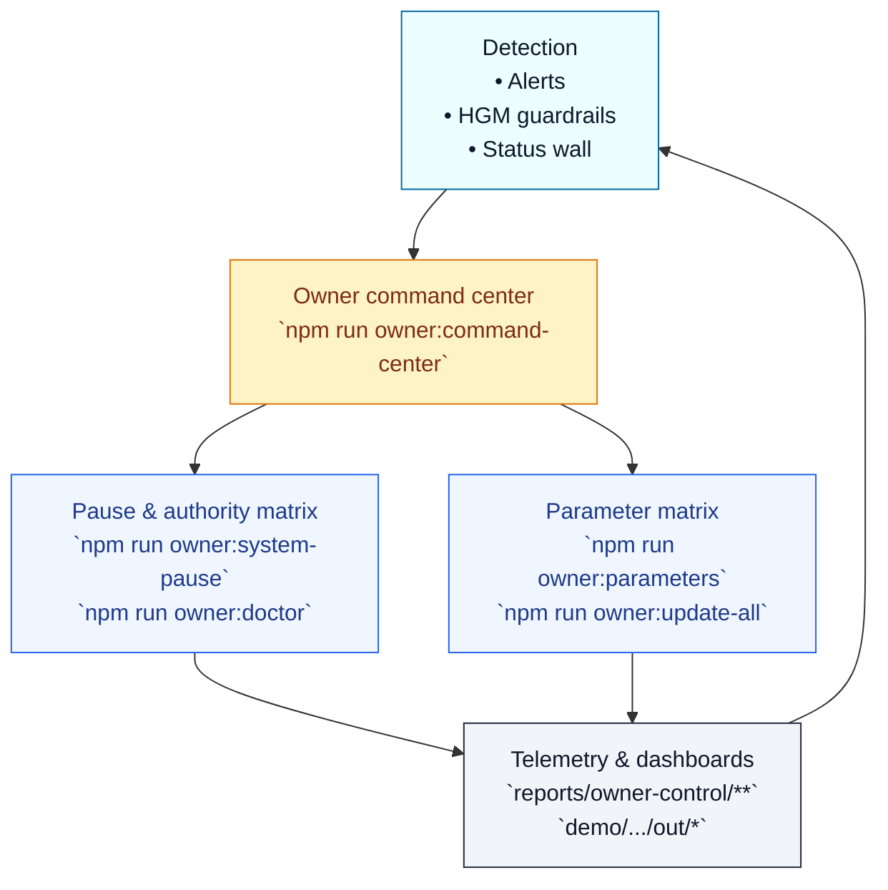

# Emergency Operations Runbook

[](https://github.com/MontrealAI/AGIJobsv0/actions/workflows/ci.yml)
[](https://github.com/MontrealAI/AGIJobsv0/actions/workflows/ci.yml?query=workflow%3A%22ci+%28v2%29%22+is%3Asuccess+branch%3Amain+job%3A%22HGM+guardrails%22)
[](https://github.com/MontrealAI/AGIJobsv0/actions/workflows/ci.yml?query=workflow%3A%22ci+%28v2%29%22+is%3Asuccess+branch%3Amain+job%3A%22Owner+control+assurance%22)

This deck guides incident commanders through the production controls that keep the SelfPlay arena, StakeManager lattice, and owner command center aligned. The controls referenced below map one-for-one to the automation codified in CI v2, so every rehearsal is guaranteed green before any emergency lever is pulled.【F:.github/workflows/ci.yml†L350-L440】

## Readiness handshake (daily)

| Step | Command | Purpose |
| --- | --- | --- |
| 1 | `npm run ci:status-wall -- --token $GITHUB_TOKEN --require-success --include-companion` | Confirms every required CI v2 job (including companion workflows) is green on `main`, mirroring the branch-protection guard.【F:scripts/ci/check-ci-status-wall.ts†L93-L332】 |
| 2 | `ci/hgm-suite.sh` | Replays the HGM regression harness locally; CI consumes the same script before surfacing the `ci (v2) / HGM guardrails` badge.【F:ci/hgm-suite.sh†L1-L194】 |
| 3 | `npm run owner:command-center` | Generates the owner mission briefing, control matrix, and drift analysis so contract owners can approve or pause operations instantly.【F:package.json†L165-L190】【F:scripts/v2/ownerCommandCenter.ts†L1-L210】 |
| 4 | `make operator:green` | Runs the Day-One utility benchmark to validate treasury uplift and guardrail posture with fresh artefacts.【F:Makefile†L70-L118】【F:tools/operator_banner.py†L1-L148】 |

Archive the resulting artefacts (`reports/ci/status.*`, `reports/owner-control/**`, demo outputs) with the incident log so every response starts from the same verified baseline.【F:.github/workflows/ci.yml†L393-L440】【F:.github/workflows/ci.yml†L1026-L1155】

## Incident topology



The loop intentionally mirrors CI v2: every CLI relies on the same manifests and scripts the pipeline executes. When the wall is green, these emergency levers are already rehearsed and auditable.【F:.github/workflows/ci.yml†L350-L440】【F:scripts/v2/ownerControlDoctor.ts†L1-L248】【F:scripts/v2/updateAllModules.ts†L1-L240】

## 1. Immediate pause procedures

1. **Isolate scope.** Inspect the latest CI summary (`reports/ci/status.md`), orchestrator telemetry, and `ci (v2) / HGM guardrails` artefacts to determine whether the anomaly is confined to a demo surface or touches production governance.【F:.github/workflows/ci.yml†L350-L440】【F:.github/workflows/ci.yml†L1026-L1155】
2. **Trigger the deterministic pause.** Run:
   ```bash
   npm run owner:system-pause -- --network <network> --action pause --dry-run
   ```
   Verify the preview, then re-run without `--dry-run` once approved. The script coordinates every pause lever (kernel, modules, demos) from the OwnerConfigurator so no contract is left running accidentally.【F:package.json†L180-L205】【F:scripts/v2/systemPauseAction.ts†L1-L200】【F:contracts/v2/SystemPause.sol†L15-L157】
3. **Freeze automation.** Confirm orchestrator runners honour the pause by checking the latest mission-control briefing and reviewing the operator dashboards before resuming any automation.【F:scripts/v2/ownerMissionControl.ts†L1-L200】【F:demo/AGIJobs-Day-One-Utility-Benchmark/demo_runner.py†L1-L240】

## 2. Role revocation & credential rotation

When a validator, orchestrator, or governance key is compromised:

1. **Render the authority matrix:**
   ```bash
   npm run owner:doctor -- --network <network>
   ```
   The report enumerates every role, signer, and contract binding using the same diagnostics consumed by CI.【F:package.json†L165-L215】【F:scripts/v2/ownerControlDoctor.ts†L1-L248】
2. **Rotate or revoke:** Update the owner-control manifest (for example `config/owner-control.<network>.json`) with the desired governance and owner assignments, then run:
   ```bash
   npm run owner:rotate -- --network <network> [--governance <address>] [--owner <address>]
   ```
   Review the dry-run output, export a Safe bundle if needed, and re-run with `--execute` when approvals land. The script propagates the manifest changes through the registry, OwnerConfigurator, and guardian mesh in one transaction set.【F:package.json†L200-L220】【F:scripts/v2/rotateGovernance.ts†L1-L360】【F:contracts/v2/admin/OwnerConfigurator.sol†L7-L112】
3. **Reconverge automation:** regenerate `reports/owner-control/authority-matrix.md` via `npm run ci:owner-authority -- --network <network>` so future CI runs confirm the new assignments.【F:package.json†L135-L146】【F:.github/workflows/ci.yml†L393-L440】

## 3. Parameter adjustments & fee splits

1. **Surface drift:**
   ```bash
   npm run owner:surface -- --network <network> --format markdown
   ```
   This highlights parameter deltas against the manifest and describes the remediation commands to run.【F:package.json†L165-L210】【F:scripts/v2/ownerControlSurface.ts†L1-L248】
2. **Draft the mission plan:**
   ```bash
   npm run owner:mission-control -- --network <network> --out reports/owner-control/mission
   ```
   Review the proposed transactions, ROI projections, and guardrail impacts before executing.【F:scripts/v2/ownerMissionControl.ts†L1-L200】
3. **Execute atomically:**
   ```bash
   npm run owner:update-all -- --network <network>
   ```
   Confirm the preview aligns with the mission-control briefing, then add `--execute` (or Safe bundle flags) to broadcast the approved transactions. The script rebuilds the bundle from the owner-control manifest and applies fee splits, stakes, thermostat bands, and registry updates in one wave, exporting receipts alongside the summary.【F:package.json†L195-L215】【F:scripts/v2/updateAllModules.ts†L1-L360】

## 4. Manual slashing & scoreboard reconciliation

1. **Analyse culture telemetry:** `python -m orchestrator.tools.culture_rewards --total 1500 --top 8` keeps the reward ledger aligned with the latest slashing posture.【F:orchestrator/tools/culture_rewards.py†L1-L180】
2. **Broadcast targeted penalties:** Use `npm run owner:command-center` to confirm offending validators and broadcast manual slashes via the OwnerConfigurator if automated guardrails require escalation.【F:scripts/v2/ownerCommandCenter.ts†L1-L210】【F:contracts/v2/governance/ValidatorSlash.sol†L10-L180】
3. **Regenerate artefacts:** After remediation, rerun `npm run owner:doctor` and `npm run owner:parameters` so CI uploads refreshed control matrices on the next execution.【F:.github/workflows/ci.yml†L393-L440】

## 5. Post-incident checklist

- Resume the platform with `npm run owner:system-pause -- --network <network> --action unpause` once all verifications are green.【F:scripts/v2/systemPauseAction.ts†L1-L200】
- Re-run the readiness handshake to prove the wall is green again (`ci:status-wall`, `ci/hgm-suite.sh`, owner briefings, Day-One demo).【F:scripts/ci/check-ci-status-wall.ts†L93-L332】【F:ci/hgm-suite.sh†L1-L194】
- Archive updated artefacts under `reports/` (status, owner-control, demo outputs) for auditability.【F:.github/workflows/ci.yml†L393-L440】【F:.github/workflows/ci.yml†L1026-L1155】
- File a retrospective referencing the exact CI runs and owner control exports to close the incident with provable assurance.【F:.github/workflows/ci.yml†L393-L440】【F:.github/workflows/ci.yml†L1026-L1155】

These procedures keep the contract owner in total command while aligning every emergency lever with the production-hardened CI v2 lattice that guarantees a permanently green wall before, during, and after an incident.

