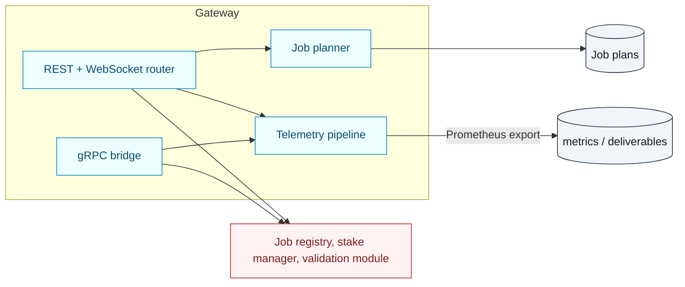

# AGI Jobs v0 (v2) — Agent Gateway Service

[](https://github.com/MontrealAI/AGIJobsv0/actions/workflows/ci.yml)
[](https://github.com/MontrealAI/AGIJobsv0/actions/workflows/containers.yml)

The agent gateway is the on-chain mission control bridge for the superintelligent platform. It exposes authenticated REST,
WebSocket, and gRPC interfaces that orchestrate job creation, validator staking, telemetry ingestion, and audit anchoring against
the deployed contracts. All configuration is driven from `config/` manifests so the contract owner can rotate parameters without
changing code.



## Runtime features

- **REST + WebSocket API** – `/jobs`, `/agents`, `/deliverables`, `/telemetry`, `/metrics`, and `/auth/challenge` endpoints power
  agent UX and operator dashboards. Authentication accepts either an API key or signature-based challenge using the rotating
  nonce defined in `utils.ts` (nonce rotates after each successful signature).【F:agent-gateway/routes.ts†L1-L115】
- **gRPC control plane** – The gRPC server mirrors the REST surface for high-throughput integrations and streams results to the
  Alpha Bridge client. All protobuf types live in `protos/agi/alpha/bridge/v1`. The service adapts HTTP errors back to canonical
  gRPC codes so clients always receive deterministic error handling.【F:agent-gateway/grpc.ts†L1-L120】
- **Telemetry + audit anchoring** – Incoming telemetry is validated, stored, and exported both via `/metrics` and the anchoring
  tasks under `auditAnchoring.ts`, ensuring every deliverable carries an immutable record.【F:agent-gateway/auditAnchoring.ts†L1-L160】【F:agent-gateway/telemetry.ts†L1-L200】
- **Staking automation** – `stakeCoordinator.ts` wraps the stake manager ABI so agents can top-up, withdraw, or restake directly
  through the gateway (REST and gRPC endpoints use the same helpers).【F:agent-gateway/stakeCoordinator.ts†L1-L220】
- **Job planning + opportunities** – The job planner persists multi-step execution plans and resumes them on startup, while the
  opportunity forecaster modules expose economic intelligence to the UI.【F:agent-gateway/jobPlanner.ts†L1-L200】【F:agent-gateway/opportunities.ts†L1-L160】

## Environment configuration

Set the following variables before launching the service:

| Variable | Purpose |
| -------- | ------- |
| `RPC_URL` | JSON-RPC endpoint for contract interactions (HTTP or WS).【F:agent-gateway/utils.ts†L9-L47】 |
| `JOB_REGISTRY_ADDRESS` | Registry contract address controlling job lifecycle.【F:agent-gateway/utils.ts†L48-L75】 |
| `VALIDATION_MODULE_ADDRESS` | Validator commit/reveal module used for quorum management.【F:agent-gateway/utils.ts†L48-L75】 |
| `STAKE_MANAGER_ADDRESS` | Optional; enables reward logging + stake info feeds.【F:agent-gateway/utils.ts†L52-L74】 |
| `DISPUTE_MODULE_ADDRESS` | Optional dispute integration for escalations.【F:agent-gateway/utils.ts†L52-L74】 |
| `KEYSTORE_URL` + `KEYSTORE_TOKEN` | Remote keystore endpoint from which signing keys are fetched. HTTPS enforced.【F:agent-gateway/utils.ts†L76-L121】 |
| `BOT_WALLET`, `ORCHESTRATOR_WALLET` | Optional hot wallets surfaced in startup logs for monitoring.【F:agent-gateway/utils.ts†L52-L74】 |
| `PORT`, `GRPC_PORT` | HTTP and gRPC listener ports (default 3000 / 50051).【F:agent-gateway/utils.ts†L37-L47】 |
| `GATEWAY_API_KEY` | Optional API key for non-signature automation flows.【F:agent-gateway/routes.ts†L94-L115】 |

Token metadata (`TOKEN_DECIMALS`, symbol, name, address) are resolved from `config/agialpha*.json`, so updating those manifests
automatically reconfigures the gateway after redeploy.【F:agent-gateway/utils.ts†L126-L153】

## Local development

```bash
npm install
npm run agent:gateway          # Start the service with live reload (uses ts-node + nodemon)
PORT=4000 RPC_URL=http://127.0.0.1:8545 JOB_REGISTRY_ADDRESS=<addr> VALIDATION_MODULE_ADDRESS=<addr> KEYSTORE_URL=https://... npm run agent:gateway
```

A Prometheus-compatible metrics stream is available at `GET /metrics`. WebSocket clients connect to the same origin; the gateway
uses `registerEvents` to broadcast validator assignments and job changes.【F:agent-gateway/index.ts†L1-L61】

## Testing & CI

- `npm run test` executes the Hardhat suite that consumes this service’s mocks.
- `ci (v2) / Owner control assurance` regenerates owner doctor reports using the gateway helpers to guarantee that contract owner
  controls remain reachable.【F:.github/workflows/ci.yml†L386-L434】
- `containers.yml` builds the Docker image (`Dockerfile`) and runs Trivy scans so production deployments remain reproducible.
- The multi-stage [`Dockerfile`](Dockerfile) now pins Node.js 20.18.1 and npm 10.8.2, runs installs through [`scripts/ci/npm-ci.sh`](../scripts/ci/npm-ci.sh), and uses BuildKit caching for deterministic container builds that mirror CI.【F:agent-gateway/Dockerfile†L1-L46】

## Operational runbook

1. Launch the service with signed environment variables (see `.env.example`).
2. Verify `/auth/challenge` and `/metrics` respond as expected.
3. Tail `reports/owner-control/doctor.json` after CI to confirm owner levers resolved correctly.
4. Use `npm run owner:command-center` to render the mermaid authority graph—gateway endpoints reflect the same contract addresses
   when queried via `/system/health`.

The gateway is the connective tissue between owners, agents, and validators. Keep its configuration aligned with the manifests
and the superintelligent machine remains fully responsive to contract owner directives.
