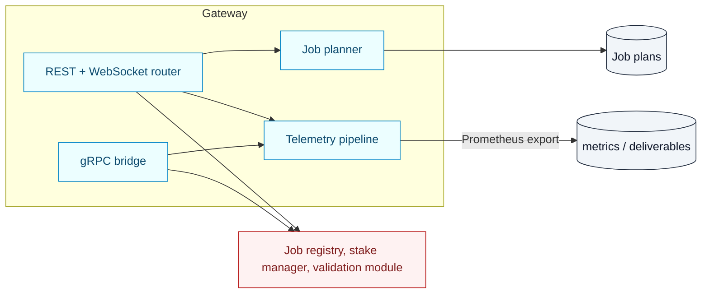

# AGI Jobs v0 (v2) — Agent Gateway Service

[](https://github.com/MontrealAI/AGIJobsv0/actions/workflows/ci.yml)
[](https://github.com/MontrealAI/AGIJobsv0/actions/workflows/containers.yml)

The agent gateway connects authorized workers and validators to the platform's contracts. It exposes authenticated REST,
WebSocket, and gRPC interfaces that orchestrate job creation, validator staking, telemetry ingestion, and audit anchoring against
the deployed contracts. Operators configure deployments through `config/` manifests and environment variables, with live
authorization, provider behavior and recovery verified during commissioning.


```mermaid
flowchart LR
    classDef svc fill:#ecfeff,stroke:#0284c7,color:#0c4a6e,stroke-width:1px;
    classDef chain fill:#fef2f2,stroke:#b91c1c,color:#7f1d1d,stroke-width:1px;
    classDef data fill:#f1f5f9,stroke:#1e293b,color:#0f172a,stroke-width:1px;

    subgraph Gateway
        API[REST + WebSocket router]:::svc
        GRPC[gRPC bridge]:::svc
        Planner[Job planner]:::svc
        Telemetry[Telemetry pipeline]:::svc
    end

    API --> Planner
    API --> Telemetry
    GRPC --> Telemetry
    Telemetry -->|Prometheus export| Metrics[(metrics / deliverables)]:::data
    Planner --> Jobs[(Job plans)]:::data
    API --> ChainContracts
    GRPC --> ChainContracts
    ChainContracts[Job registry, stake manager, validation module]:::chain
```

## Runtime features

- **REST + WebSocket API** – `/jobs`, `/agents`, `/deliverables`, `/telemetry`, `/metrics`, and `/auth/challenge` endpoints power
  agent UX and operator dashboards. Authentication accepts either an API key or signature-based challenge using the rotating
  challenge nonce returned by `/auth/challenge` (nonce rotates after each successful signature). A signature authorizes only its
  managed wallet; the operator API key authorizes wallet selection and privileged operations. [Source](routes.ts)
- **gRPC control plane** – `agentgateway.v1.AgentGateway` exposes eight unary RPCs for authentication challenges, result submission,
  heartbeats, telemetry, job information, staking and reward claims. Its schema is [`protos/agent_gateway.proto`](protos/agent_gateway.proto).
  It shares submission and staking helpers with REST and uses gRPC status codes for failures. Job event broadcasts use the
  separate WebSocket interface; the Alpha Bridge has its own protocol. [Source](grpc.ts)
- **Telemetry + audit anchoring** – Incoming telemetry is validated, stored, and exported both via `/metrics` and the anchoring
  tasks under `auditAnchoring.ts`, supporting verifiable audit records when anchoring is configured and confirmed. [Source](auditAnchoring.ts) [Source](telemetry.ts)
- **Staking automation** – `stakeCoordinator.ts` wraps the stake manager ABI so agents can top-up, withdraw, or restake directly
  through the gateway (REST and gRPC endpoints use the same helpers). [Source](stakeCoordinator.ts)
- **Job planning + opportunities** – The job planner persists multi-step execution plans and resumes them on startup, while the
  opportunity forecaster modules expose economic intelligence to the UI. [Source](jobPlanner.ts) [Source](opportunities.ts)

## Environment configuration

Set the following variables before launching the service:

| Variable                            | Purpose                                                                                                                                                                                                                     |
| ----------------------------------- | --------------------------------------------------------------------------------------------------------------------------------------------------------------------------------------------------------------------------- |
| `RPC_URL`                           | HTTP(S) JSON-RPC endpoint for the service's `JsonRpcProvider`. [Source](utils.ts)                                                                                                                                           |
| `JOB_REGISTRY_ADDRESS`              | Registry contract address controlling job lifecycle. [Source](utils.ts)                                                                                                                                                     |
| `VALIDATION_MODULE_ADDRESS`         | Validator commit/reveal module used for quorum management. [Source](utils.ts)                                                                                                                                               |
| `STAKE_MANAGER_ADDRESS`             | Optional; enables reward logging + stake info feeds. [Source](utils.ts)                                                                                                                                                     |
| `DISPUTE_MODULE_ADDRESS`            | Optional dispute integration for escalations. [Source](utils.ts)                                                                                                                                                            |
| `KEYSTORE_URL` + `KEYSTORE_TOKEN`   | Required wallet-key endpoint and optional bearer credential. It returns `{ "keys": ["<private-key>"] }`. Use an authenticated HTTPS service outside isolated local fixtures; the loader accepts HTTP(S). [Source](utils.ts) |
| `BOT_WALLET`, `ORCHESTRATOR_WALLET` | Select automation and orchestration addresses already loaded from the keystore. Defaults use the first wallet, then the automation wallet. [Source](utils.ts)                                                               |
| `PORT`, `GRPC_PORT`                 | HTTP/WebSocket and gRPC listener ports (default 3000 / 50051); `GRPC_PORT=0` disables gRPC. [Source](utils.ts)                                                                                                              |
| `GATEWAY_API_KEY`                   | Operator credential for selecting managed wallets and privileged POST operations. Required for those operator routes; wallet-scoped challenge authentication remains available without it. [Source](routes.ts)              |

Token metadata (decimals, symbol and name) comes from the selected `config/agialpha*.json` manifest. `AGIALPHA_TOKEN` can explicitly
select the deployed token address; startup checks its metadata on chain. `AGIALPHA_NETWORK` or `NETWORK` selects the manifest.
`AGENT_PRIVATE_KEY` is used by separate examples; this service obtains wallets through `KEYSTORE_URL`. [Source](utils.ts)

## Local development

Run from the repository root with Node.js 22.23.3 and npm 10.8.2. Export the environment from the
[setup guide](../docs/gateway-setup.md#running-the-gateway), then:

```bash
npm ci
npm run gateway
# Or build once and start the packaged service separately:
npm run build:gateway
node agent-gateway/dist/agent-gateway/index.js
```

`npm run gateway` builds and starts the service; `npm run agent:gateway` launches the separate example in
`examples/agentic/v2-agent-gateway.js`. Neither command provides automatic live reload. The service's HTTP and gRPC listeners
use plaintext transports; configure TLS termination and the intended network access controls for deployment.

A Prometheus-compatible metrics stream is available at `GET /metrics`. WebSocket clients connect to the same origin; the gateway
uses `registerEvents` to broadcast validator assignments and job changes. [Source](index.ts)
Public WebSocket connections receive broadcasts. Control messages require the operator API key in the connection's
`X-Api-Key` handshake header: `register` must match an agent ID and wallet already registered through authenticated `POST /agents`,
and `ack` can update only that socket's registered agent queue. Keep these credentials in a trusted server client; see the
[Node WebSocket example](../docs/gateway-setup.md#websocket-stream).

Keep the operator API key with trusted operators. A worker signs the current challenge using its own managed wallet and can act
only for that same wallet; changing the body address does not grant another wallet's authority. REST uses `/auth/challenge`,
while gRPC uses its separate `GetAuthChallenge` RPC. Challenges expire after five minutes and rotate after successful signature
authentication; one client's successful signature consumes that transport's shared nonce. Concurrent clients may need to fetch
and sign a fresh challenge. Privileged agent registration, audit anchoring, blueprint
creation, employer planning/job posting and quarantine release require the operator API key. See the [authentication contract](../docs/gateway-setup.md#authentication)
for exact routes, metadata and error codes.

REST and gRPC each enforce fixed, process-local budgets before authentication: 240 requests per transport peer per minute and
2,400 per process per minute. Challenges, reads and failed authentication count. REST returns `429` and gRPC returns
`RESOURCE_EXHAUSTED` with retry timing. A reverse proxy's clients share its observed peer quota; forwarded headers do not change
that identity. Configure aggregate ingress limits when using replicas. See [request budgets](../docs/gateway-setup.md#request-budgets).
WebSocket connections and inbound messages have separate process-local budgets, active-connection caps and a 64 KiB payload
limit. Exceeding a budget attempts a `1013` close; unauthorized control messages attempt `1008`. The transport is then
terminated immediately so clients that ignore close handshakes cannot retain resources. Clients may observe an abrupt close.

Result submission calls the registry's current `submit` function with an ENS identity proof. It does not settle a job. See
[proof formats and request examples](../docs/gateway-setup.md#proofs-and-result-submission) for REST/gRPC compatibility and the
separate independent-validation and settlement steps. A deliverable's `success` field is a worker report, not a validator verdict.

Evidence signatures are optional and separate from request authentication. A signed submission must supply both `signature`
and `signedPayload`, where the payload is exactly the 32-byte `resultHash` and the managed wallet signs its decoded bytes using
EIP-191. Invalid, incomplete or mismatched attestations fail before tax acknowledgement or result submission. Authenticated
requests omitting both fields remain unsigned; the gateway does not manufacture a content signature. See the
[signature example](../docs/gateway-setup.md#optional-evidence-signatures).

## Persistence and restart recovery

Deliverables, heartbeats and telemetry records are stored under `storage/deliverables`; employer plans live under
`storage/employer/plans` and are loaded on startup. These paths are relative to the runtime package: repository-root `storage`
for source execution, or `agent-gateway/dist/storage` for the compiled service. The container uses
`/app/agent-gateway/dist/storage`; persist it on a writable volume owned by the service user. Validator commitments may use
the separate `VALIDATION_STORAGE_DIR` described below. [Source](deliverableStore.ts) [Source](jobPlanner.ts)

New evidence records and large telemetry payloads are stored together in parameterized SQLite transactions in
`storage/deliverables/deliverables.sqlite`; the in-memory index updates only after commit. Existing JSONL journals and telemetry
files remain readable and are not rewritten, deleted or automatically migrated. Payload `path` values are opaque storage
locators resolved against the database first and then legacy files; they are not promises of a newly written file.

The store accepts bounded plain JSON: at most 1 MiB per serialized record or payload, depth 32 and 16,384 visited values.
Submission inputs have a 960 KiB preflight limit to reserve receipt metadata space. Telemetry up to 8 KiB can remain inline.
Each record kind has a 64 MiB budget for new record/payload JSON plus legacy journal bytes; the SQLite database has a 256 MiB page
limit including payloads and overhead. These fixed limits are separate from request limits. Cycles, accessors, custom object
prototypes and non-finite numbers are rejected. Evidence directories (`0700`) and files (`0600`) must belong to the service user;
symlinks, multiply linked files and unsafe existing storage are rejected rather than silently repaired.

Run one gateway writer per evidence store. Stop the service before backing up the entire deliverables directory, including the
database, any SQLite recovery sidecars and legacy files. SQLite uses `DELETE` journaling with `synchronous=FULL`; do not copy only
a live database or remove recovery files to bypass an error. Readiness checks test a write transaction and storage budgets but
do not reserve disk space; conservative headroom checks reject work before hard caps are exhausted. A final write can fail after chain confirmation: reconcile the receipt before retrying. Plan retention
and recovery before reaching limits; no history is automatically truncated. Storage errors use `DELIVERABLE_STORAGE_*` codes.
Treat persisted text as untrusted data and never execute it or expose the private evidence directory as web content.

The live jobs/agents maps, pending delivery queues and timers remain in memory. Event listeners do not provide a durable,
checkpointed replay of every missed job event. After a restart, verify active jobs against canonical contract state, re-register
external agents as needed, and reconcile outstanding transactions before resuming work. File-backed plans and evidence are
useful recovery records, but do not provide multi-instance coordination or replace deployment recovery testing.

## Private validator state

Set `VALIDATION_STORAGE_DIR` to an absolute directory on a durable, private volume before starting a validator. Its parent must already exist, belong to the service user and not be writable by other users. The default remains `storage/validation` relative to the runtime package: repository-root `storage/validation` for source execution, or `agent-gateway/dist/storage/validation` for the compiled gateway. Use an explicit path when mounting production storage.

The gateway creates private directories (`0700`) and records (`0600`). Existing paths must satisfy ownership and permission checks; symlinks, shared files and unsafe paths are rejected. Stop the service and back up existing state before correcting permissions as the owning user. Do not delete commitment records, intent markers or lock files to force a retry: reconcile wallet transactions and the current contract round first. Protect archives and backups because they contain plaintext reveal salts.

A fresh checkout leaves `storage/validation` absent so the gateway can create it privately on first use. When upgrading a checkout that already has this directory, stop the gateway, verify ownership and preserve its contents, then set the directory to `0700` as its owner (for example, `chmod 700 /absolute/path/to/storage/validation`). Existing record files must be private (`0600`) as well. Explicit `VALIDATION_STORAGE_DIR` overrides retain the same strict checks; the gateway does not silently change an existing directory's permissions.

Records are bounded JSON data, limited to 1 MiB with additional depth and node limits. Network-derived evidence and labels remain untrusted data after persistence. Never execute these files, serve the private volume over HTTP, or render its text as trusted HTML. A storage validation or durability error prevents a new vote broadcast; it is not permission to discard earlier evidence.

Automatic validators reserve `awaiting-review` for verified independent-review requirements, including computer work. Temporary lookup failures receive bounded read-only retries. `reconciliation-required` means automation cannot safely establish the current transaction or round state; retain the records and compare canonical receipts, the active round and wallet transactions before operator recovery. An uncertain validator broadcast is not automatically resent.

Before saving a new commitment intent, both gateway entry points recheck the canonical round and its commit deadline after asynchronous preparation. An expired window reports `VALIDATION_COMMIT_WINDOW_CLOSED` without writing an intent or sending a transaction. Automatic evaluation waits for a later selection rather than retrying the closed window. Existing commitments remain available for inspection and reveal during the reveal phase.

Selection callbacks and retries verify committee membership at the round snapshot's block; both commit entry points recheck membership before saving an intent. An obsolete committee member enters `not-selected` with `VALIDATION_VALIDATOR_NOT_SELECTED`, cancels its pending continuations and writes no new vote. A later confirmed selection can start a new assignment. Temporary committee lookup failures retain the bounded read-only selection retries.

If reveal scheduling exhausts its read retries or observes a closed reveal window, the assignment explicitly enters `reconciliation-required` with the lookup error retained for operators. A mined commitment whose send response was lost can be recovered from canonical commitment events before advancing to a later round; a missing or orphaned receipt still blocks replacement.

Manual and automatic reveals share one durable claim before broadcasting and save the transaction hash before waiting for confirmation. The compatibility-preserved `automaticRevealStatus` metadata key guards both entry points. A repeated manual request returns a transaction only after checking its successful canonical receipt and matching reveal event; a lost send response can be reconciled from that event within the saved round. An unresolved attempt or a changed round requires reconciliation and never authorizes a duplicate reveal. Stored vote data takes precedence over any in-memory cache.

## Testing & CI

- `npm run test` executes the Hardhat suite that consumes this service’s mocks.
- `ci (v2) / Owner control assurance` regenerates owner doctor reports using the gateway helpers to check configured contract owner
  controls. [Source](../.github/workflows/ci.yml)
- `containers.yml` builds the Docker image (`Dockerfile`) and scans the built image with Trivy.

## Operational runbook

1. Configure the required environment variables (see [`.env.example`](../.env.example)) and launch the service.
2. Verify `/auth/challenge` and `/metrics` respond as expected.
3. Tail `reports/owner-control/doctor.json` after CI to confirm owner levers resolved correctly.
4. Use `npm run owner:command-center` to render the mermaid authority graph—gateway endpoints reflect the same contract addresses
   when queried via `/system/health`.

The gateway connects owners, agents, and validators. Keep its configuration aligned with the manifests and verify owner controls,
recovery and settlement in the intended deployment.

## Provider execution and local simulations

An agent endpoint failure stops `executeJob` before result upload, signing, or submission. `runAgentTask` retains preview fallback output with `executionMode: 'failed'`; callers must inspect its error and mode. Missing endpoints produce an explicitly marked simulation, not a provider result.

Synthetic submission requires `AGENT_ALLOW_SIMULATED_EXECUTION=true` **and** a wallet connected to chain ID **31337**. It is disabled by default and rejected on mainnet or without a connected provider. Execution results and receipt payloads include `executionMode`; synthetic output also includes `simulation: true`. An explicitly configured endpoint that fails remains a failure even when local simulation is enabled.

The HTTP adapter rejects redirects, non-success status codes, empty responses, malformed declared JSON, and responses over 1 MiB. Its timeout covers response-body reading. JSON and ordinary text deliverables remain supported. The packaged IPFS adapter loads its ESM client through a shipped CommonJS bridge and uses a 30-second default timeout.

Use the [production rehearsal](../docs/production/rehearsal.md) to exercise the compiled HTTP/IPFS adapters against actual local HTTP endpoints, including failure and recovery cases. These fixtures do not claim model quality, real IPFS persistence, or live-provider commissioning.
