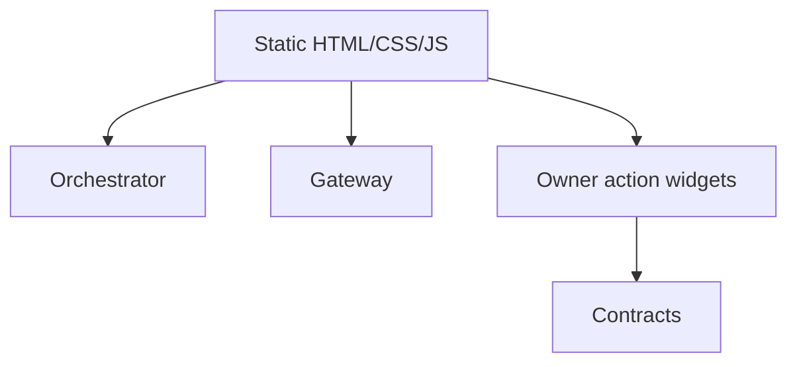

# AGI Jobs v0 (v2) — Onebox Static Console

[](https://github.com/MontrealAI/AGIJobsv0/actions/workflows/webapp.yml)
[](https://github.com/MontrealAI/AGIJobsv0/actions/workflows/ci.yml)

This package delivers the zero-dependency static console that can be hosted on any CDN. It mirrors the Next.js cockpit but ships as
plain HTML/CSS/JS so the contract owner can drop a preconfigured dashboard into sovereign environments without building assets.

## Architecture

- `app.mjs` – Core runtime that validates ICS payloads, calls the orchestrator REST endpoints, streams SSE responses, and renders
  owner console widgets for on-chain parameter changes.【F:apps/onebox-static/app.mjs†L1-L160】
- `config.mjs` – Build-time configuration (orchestrator URLs, IPFS endpoints, storage keys) that can be overridden by the hosting
  environment before deployment.【F:apps/onebox-static/config.mjs†L1-L56】
- `lib.mjs` – Utilities for intent validation, IPFS pinning, and transcript formatting.
- `scripts/` – Build helpers for hashing assets and publishing static bundles.



## Local preview

```bash
cd apps/onebox-static
npm install
npm run onebox:static:build    # builds dist/ with hashed assets
npm run onebox:static:publish  # optional deploy helper (configurable)
```

Open `dist/index.html` in a browser and set the orchestrator base URL using the on-screen controls or by defining the following
query parameters:

```
?orchestrator=https://alpha-orchestrator.example.com&oneboxPrefix=/onebox
```

Saved values are cached under `localStorage` keys declared in `config.mjs`, so operators can persist approved endpoints between
sessions.【F:apps/onebox-static/app.mjs†L19-L80】

## Owner console

The static bundle includes an owner action panel that wraps the same controls exposed by `npm run owner:command-center`. Operators
can update stake thresholds, treasury addresses, and fee/burn percentages directly from the browser; the console prepares
calldata compatible with the orchestrator SDK for review before submission.【F:apps/onebox-static/app.mjs†L81-L160】

## Extending the bundle

1. Edit `config.mjs` to add new configuration knobs or CSP origins.
2. Extend `app.mjs` with the corresponding UI and orchestrator interaction.
3. Update `apps/onebox/README.md` if the static and dynamic consoles diverge in capabilities.
4. Rebuild (`npm run onebox:static:build`) and capture screenshots for documentation.

The static console keeps the superintelligent machine operable even in air-gapped or compliance-restricted environments—no build
pipeline or Node.js runtime required.
