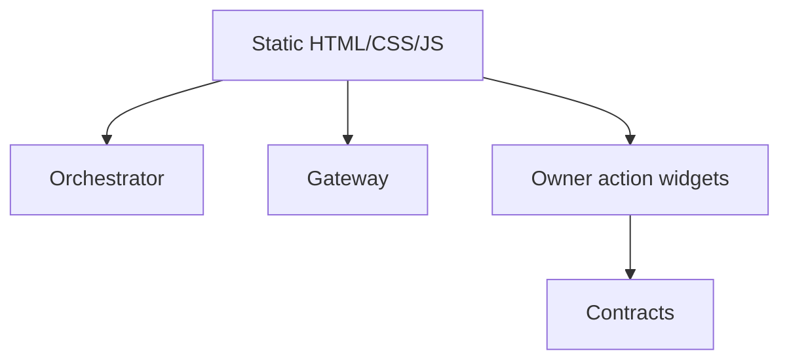

# AGI Jobs v0 (v2) — Onebox Static Console

[](https://github.com/MontrealAI/AGIJobsv0/actions/workflows/webapp.yml)
[](https://github.com/MontrealAI/AGIJobsv0/actions/workflows/ci.yml)

This package delivers the zero-dependency static console that can be hosted on any CDN. It mirrors the Next.js cockpit but ships as
plain HTML/CSS/JS so the contract owner can drop a preconfigured dashboard into sovereign environments after building the hashed, integrity-checked assets.

## Architecture

- `app.mjs` – Core runtime that validates ICS payloads, calls the orchestrator REST endpoints, streams SSE responses, and renders
  owner console widgets for on-chain parameter changes.
- `config.mjs` – Build-time configuration (orchestrator URLs, IPFS endpoints, storage keys) that can be overridden by the hosting
  environment before deployment.
- `lib.mjs` – Utilities for intent validation, IPFS pinning, and transcript formatting.
- `scripts/` – Build helpers for hashing assets and publishing static bundles.


```mermaid
flowchart TD
    StaticUI[Static HTML/CSS/JS] --> Orchestrator
    StaticUI --> Gateway
    StaticUI --> OwnerConsole[Owner action widgets]
    OwnerConsole --> Contracts
```

## Local preview

From the repository root, use the pinned Node version and locked dependencies:

```bash
nvm use
npm ci
npm run demo:onebox:launch -- --demo
```

The launcher serves the built bundle over HTTP. Do not open `dist/index.html` with `file://`: module scripts and CSP need a web origin. Follow the [complete One-Box guide](../../demo/One-Box/README.md) for the five-step mission, evidence export, connected mode and Docker.

The offline preview uses a session-local state model and blocks API/provider connections. It resets on reload and labels all evidence as simulated. Connected mode requires a reviewed deployment and authentic credentials; the currently supported job-intent actions are post job and finalize. Endpoint preferences may persist in localStorage, but the orchestrator API token is held in page memory only and clears on reload or endpoint changes.

For an independently hosted bundle, configure the intended API origin in the build's CSP before deployment. The One-Box launcher automatically includes its configured origin. Set the API token using Advanced, never a shared launch URL. Build and verify with `npm run onebox:static:build` and `npm run verify:sri`. The existing publish helper remains available for deliberately configured deployments.

## Owner console

The static bundle includes an owner action panel that wraps the same controls exposed by `npm run owner:command-center`. Operators
can inspect stake thresholds, treasury addresses, and fee/burn percentages; the console prepares proposals and
calldata compatible with the orchestrator SDK for review before submission.

## Extending the bundle

1. Edit `config.mjs` to add new configuration knobs or CSP origins.
2. Extend `app.mjs` with the corresponding UI and orchestrator interaction.
3. Update `apps/onebox/README.md` if the static and dynamic consoles diverge in capabilities.
4. Rebuild (`npm run onebox:static:build`) and capture screenshots for documentation.

The static console keeps the superintelligent machine operable even in air-gapped or compliance-restricted environments—no build
pipeline or Node.js runtime required.
