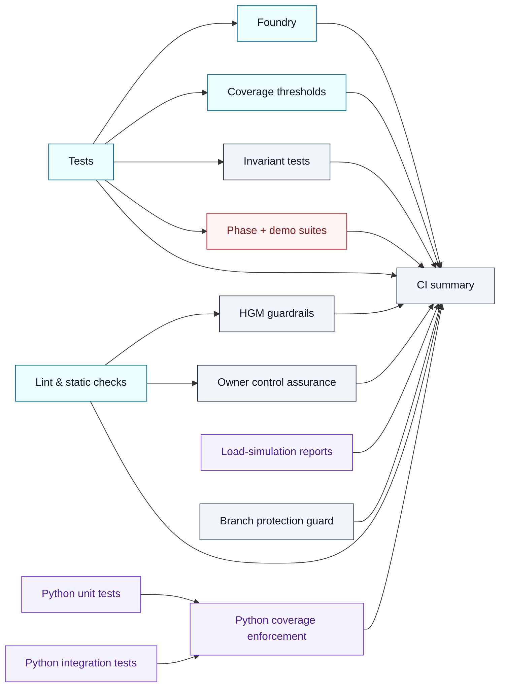

# CI v2 Manifest & Enforcement Deck

[](https://github.com/MontrealAI/AGIJobsv0/actions/workflows/ci.yml)
[](https://github.com/MontrealAI/AGIJobsv0/actions/workflows/static-analysis.yml)
[](https://github.com/MontrealAI/AGIJobsv0/actions/workflows/fuzz.yml)
[](https://github.com/MontrealAI/AGIJobsv0/actions/workflows/webapp.yml)
[](https://github.com/MontrealAI/AGIJobsv0/actions/workflows/containers.yml)
[](https://github.com/MontrealAI/AGIJobsv0/actions/workflows/e2e.yml)

## Live status wall

Every required context publishes its own badge so the assurance wall is visible on PRs, the default branch, and in external dashboards. Each badge links directly to the CI v2 workflow with the job pre-filtered, making drift obvious at a glance.

| Job | Badge |
| --- | --- |
| Lint & static checks | [](https://github.com/MontrealAI/AGIJobsv0/actions/workflows/ci.yml?query=workflow%3A%22ci+%28v2%29%22+is%3Asuccess+branch%3Amain+job%3A%22Lint+%26+static+checks%22) |
| Tests | [](https://github.com/MontrealAI/AGIJobsv0/actions/workflows/ci.yml?query=workflow%3A%22ci+%28v2%29%22+is%3Asuccess+branch%3Amain+job%3ATests) |
| Python unit tests | [](https://github.com/MontrealAI/AGIJobsv0/actions/workflows/ci.yml?query=workflow%3A%22ci+%28v2%29%22+is%3Asuccess+branch%3Amain+job%3A%22Python+unit+tests%22) |
| Python integration tests | [](https://github.com/MontrealAI/AGIJobsv0/actions/workflows/ci.yml?query=workflow%3A%22ci+%28v2%29%22+is%3Asuccess+branch%3Amain+job%3A%22Python+integration+tests%22) |
| Load-simulation reports | [](https://github.com/MontrealAI/AGIJobsv0/actions/workflows/ci.yml?query=workflow%3A%22ci+%28v2%29%22+is%3Asuccess+branch%3Amain+job%3A%22Load-simulation+reports%22) |
| Python coverage enforcement | [](https://github.com/MontrealAI/AGIJobsv0/actions/workflows/ci.yml?query=workflow%3A%22ci+%28v2%29%22+is%3Asuccess+branch%3Amain+job%3A%22Python+coverage+enforcement%22) |
| HGM guardrails | [](https://github.com/MontrealAI/AGIJobsv0/actions/workflows/ci.yml?query=workflow%3A%22ci+%28v2%29%22+is%3Asuccess+branch%3Amain+job%3A%22HGM+guardrails%22) |
| Owner control assurance | [](https://github.com/MontrealAI/AGIJobsv0/actions/workflows/ci.yml?query=workflow%3A%22ci+%28v2%29%22+is%3Asuccess+branch%3Amain+job%3A%22Owner+control+assurance%22) |
| Foundry | [](https://github.com/MontrealAI/AGIJobsv0/actions/workflows/ci.yml?query=workflow%3A%22ci+%28v2%29%22+is%3Asuccess+branch%3Amain+job%3AFoundry) |
| Coverage thresholds | [](https://github.com/MontrealAI/AGIJobsv0/actions/workflows/ci.yml?query=workflow%3A%22ci+%28v2%29%22+is%3Asuccess+branch%3Amain+job%3A%22Coverage+thresholds%22) |
| Phase 6 readiness | [](https://github.com/MontrealAI/AGIJobsv0/actions/workflows/ci.yml?query=workflow%3A%22ci+%28v2%29%22+is%3Asuccess+branch%3Amain+job%3A%22Phase+6+readiness%22) |
| Phase 8 readiness | [](https://github.com/MontrealAI/AGIJobsv0/actions/workflows/ci.yml?query=workflow%3A%22ci+%28v2%29%22+is%3Asuccess+branch%3Amain+job%3A%22Phase+8+readiness%22) |
| Kardashev II readiness | [](https://github.com/MontrealAI/AGIJobsv0/actions/workflows/ci.yml?query=workflow%3A%22ci+%28v2%29%22+is%3Asuccess+branch%3Amain+job%3A%22Kardashev+II+readiness%22) |
| ASI Take-Off Demonstration | [](https://github.com/MontrealAI/AGIJobsv0/actions/workflows/ci.yml?query=workflow%3A%22ci+%28v2%29%22+is%3Asuccess+branch%3Amain+job%3A%22ASI+Take-Off+Demonstration%22) |
| Zenith Sapience Demonstration | [](https://github.com/MontrealAI/AGIJobsv0/actions/workflows/ci.yml?query=workflow%3A%22ci+%28v2%29%22+is%3Asuccess+branch%3Amain+job%3A%22Zenith+Sapience+Demonstration%22) |
| AGI Labor Market Grand Demo | [](https://github.com/MontrealAI/AGIJobsv0/actions/workflows/ci.yml?query=workflow%3A%22ci+%28v2%29%22+is%3Asuccess+branch%3Amain+job%3A%22AGI+Labor+Market+Grand+Demo%22) |
| Sovereign Mesh Demo — build | [](https://github.com/MontrealAI/AGIJobsv0/actions/workflows/ci.yml?query=workflow%3A%22ci+%28v2%29%22+is%3Asuccess+branch%3Amain+job%3A%22Sovereign+Mesh+Demo+%E2%80%94+build%22) |
| Sovereign Constellation Demo — build | [](https://github.com/MontrealAI/AGIJobsv0/actions/workflows/ci.yml?query=workflow%3A%22ci+%28v2%29%22+is%3Asuccess+branch%3Amain+job%3A%22Sovereign+Constellation+Demo+%E2%80%94+build%22) |
| Celestial Archon Demonstration | [](https://github.com/MontrealAI/AGIJobsv0/actions/workflows/ci.yml?query=workflow%3A%22ci+%28v2%29%22+is%3Asuccess+branch%3Amain+job%3A%22Celestial+Archon+Demonstration%22) |
| Hypernova Governance Demonstration | [](https://github.com/MontrealAI/AGIJobsv0/actions/workflows/ci.yml?query=workflow%3A%22ci+%28v2%29%22+is%3Asuccess+branch%3Amain+job%3A%22Hypernova+Governance+Demonstration%22) |
| Branch protection guard | [](https://github.com/MontrealAI/AGIJobsv0/actions/workflows/ci.yml?query=workflow%3A%22ci+%28v2%29%22+is%3Asuccess+branch%3Amain+job%3A%22Branch+protection+guard%22) |
| CI summary | [](https://github.com/MontrealAI/AGIJobsv0/actions/workflows/ci.yml?query=workflow%3A%22ci+%28v2%29%22+is%3Asuccess+branch%3Amain+job%3A%22CI+summary%22) |
| Invariant tests | [](https://github.com/MontrealAI/AGIJobsv0/actions/workflows/ci.yml?query=workflow%3A%22ci+%28v2%29%22+is%3Asuccess+branch%3Amain+job%3A%22Invariant+tests%22) |

The `ci/` deck defines the manifest, verification scripts, and artefacts that keep AGI Jobs v0 (v2) permanently green. Required contexts here mirror the branch protection rule; automation in `.github/workflows/ci.yml` fails immediately when drift is detected, so release captains always see the full assurance wall.【F:.github/workflows/ci.yml†L24-L144】【F:.github/workflows/ci.yml†L1194-L1324】

## Workflow topology


## Required contexts (`ci (v2)`)
| Job | Context name | Focus |
| --- | ------------- | ----- |
| `lint` | `ci (v2) / Lint & static checks` | Hardhat + TypeScript lint, manifest validation, toolchain lock enforcement.【F:.github/workflows/ci.yml†L44-L133】 |
| `tests` | `ci (v2) / Tests` | Contract compilation, test execution, ABI drift guard.【F:.github/workflows/ci.yml†L150-L206】 |
| `python_unit` | `ci (v2) / Python unit tests` | Paymaster, tools, orchestrator, and simulation unit analytics with coverage export.【F:.github/workflows/ci.yml†L188-L260】 |
| `python_integration` | `ci (v2) / Python integration tests` | API + demo integrations plus coverage export.【F:.github/workflows/ci.yml†L206-L318】 |
| `python_load_sim` | `ci (v2) / Load-simulation reports` | Monte Carlo sweeps writing CSV + JSON stress reports.【F:.github/workflows/ci.yml†L318-L378】 |
| `python_coverage` | `ci (v2) / Python coverage enforcement` | Combines analytics coverage sets and enforces thresholds.【F:.github/workflows/ci.yml†L378-L434】 |
| `hgm_guardrails` | `ci (v2) / HGM guardrails` | Node + Python governance regression suite.【F:.github/workflows/ci.yml†L434-L486】 |
| `owner_controls` | `ci (v2) / Owner control assurance` | Owner doctor + authority matrix regeneration.【F:.github/workflows/ci.yml†L486-L538】 |
| `foundry` | `ci (v2) / Foundry` | Forge fuzz testing for Solidity surface.【F:.github/workflows/ci.yml†L538-L592】 |
| `coverage` | `ci (v2) / Coverage thresholds` | Solidity coverage enforcement and access-control remapping.【F:.github/workflows/ci.yml†L592-L646】 |
| `phase6` | `ci (v2) / Phase 6 readiness` | Phase 6 scenario rehearse.【F:.github/workflows/ci.yml†L646-L690】 |
| `phase8` | `ci (v2) / Phase 8 readiness` | Phase 8 dominance rehearsal.【F:.github/workflows/ci.yml†L690-L732】 |
| `kardashev_demo` | `ci (v2) / Kardashev II readiness` | Kardashev II + Stellar demos.【F:.github/workflows/ci.yml†L732-L780】 |
| `asi_takeoff_demo` | `ci (v2) / ASI Take-Off Demonstration` | Autonomous take-off drill with artefacts.【F:.github/workflows/ci.yml†L780-L826】 |
| `zenith_demo` | `ci (v2) / Zenith Sapience Demonstration` | Deterministic + local Zenith sapience rehearsals.【F:.github/workflows/ci.yml†L826-L892】 |
| `agi_labor_market_demo` | `ci (v2) / AGI Labor Market Grand Demo` | Labour market transcript export.【F:.github/workflows/ci.yml†L892-L938】 |
| `sovereign_mesh_demo` | `ci (v2) / Sovereign Mesh Demo — build` | Sovereign mesh server + console build.【F:.github/workflows/ci.yml†L938-L1000】 |
| `sovereign_constellation_demo` | `ci (v2) / Sovereign Constellation Demo — build` | Constellation orchestrator + console build.【F:.github/workflows/ci.yml†L1000-L1062】 |
| `celestial_archon_demo` | `ci (v2) / Celestial Archon Demonstration` | Celestial Archon deterministic + local rehearsals.【F:.github/workflows/ci.yml†L1062-L1128】 |
| `hypernova_demo` | `ci (v2) / Hypernova Governance Demonstration` | Hypernova deterministic + local rehearsals.【F:.github/workflows/ci.yml†L1128-L1194】 |
| `branch_protection` | `ci (v2) / Branch protection guard` | Live GitHub branch protection audit against manifests.【F:.github/workflows/ci.yml†L1194-L1266】【F:ci/required-contexts.json†L1-L24】 |
| `summary` | `ci (v2) / CI summary` | Aggregates job outcomes, writes `reports/ci/status.{md,json}`, fails on missing artefacts or red jobs.【F:.github/workflows/ci.yml†L1266-L1324】 |
| `invariants` | `ci (v2) / Invariant tests` | Forge invariant harness with fuzz-runs 512.【F:.github/workflows/ci.yml†L1324-L1389】 |

The manifest lives in [`required-contexts.json`](required-contexts.json). `npm run ci:verify-contexts` validates that the workflow display names match this file before CI ever runs.【F:ci/required-contexts.json†L1-L24】【F:package.json†L135-L146】

## Companion workflows
| Workflow | Required job | Purpose |
| -------- | ------------ | ------- |
| `static-analysis` | `Slither static analysis` | Solidity static analysis with Slither guardrails.【F:ci/required-companion-contexts.json†L1-L3】 |
| `fuzz` | `forge-fuzz` | Dedicated Forge fuzzing outside the main CI cadence.【F:ci/required-companion-contexts.json†L1-L4】 |
| `webapp` | `webapp-ci` | Next.js console lint/build/test smoke.【F:ci/required-companion-contexts.json†L1-L5】 |
| `containers` | `build (node-runner)` / `build (validator-runner)` / `build (gateway)` / `build (webapp)` / `build (owner-console)` | Hardened container builds for every runtime surface.【F:ci/required-companion-contexts.json†L1-L9】 |
| `e2e` | `orchestrator-e2e` | Deterministic orchestrator E2E rehearsal.【F:ci/required-companion-contexts.json†L1-L11】 |

Use `npm run ci:verify-companion-contexts` to make sure the manifest stays synchronised with GitHub configuration.【F:package.json†L135-L146】

## Branch protection automation
1. Dry-run the rule to inspect drift without applying changes:
   ```bash
   npm run ci:enforce-branch-protection -- --dry-run --branch main
   ```
2. Verify the live GitHub rule against the manifests (requires a fine-grained PAT with `administration:read` scope or a GitHub App token):
   ```bash
   GITHUB_TOKEN=<token> npm run ci:verify-branch-protection -- --owner MontrealAI --repo AGIJobsv0 --branch main
   ```
   The script fetches branch protection via the REST API, compares the enforced contexts to `required-contexts.json` and `required-companion-contexts.json`, and fails if any item is missing or out of order.【F:package.json†L138-L146】【F:scripts/ci/verify-branch-protection.ts†L1-L239】
3. Apply enforcement after reviewing the dry-run output:
   ```bash
   npm run ci:enforce-branch-protection -- --branch main
   ```
   The branch protection guard job uses the same manifests and fails the workflow if enforcement is misconfigured, keeping `main` locked to the manifest expectations.【F:package.json†L135-L146】【F:.github/workflows/ci.yml†L1194-L1266】

## Artefacts & forensic trail
- `reports/ci/status.{md,json}` – Consolidated run summary and JSON feed for downstream dashboards.【F:.github/workflows/ci.yml†L1266-L1324】
- `reports/owner-control/**` – Owner doctor, authority matrix, and parameter matrix outputs uploaded on every run.【F:.github/workflows/ci.yml†L486-L538】
- `reports/load-sim/**` – Monte Carlo CSV + JSON results for economic dissipation analysis.【F:.github/workflows/ci.yml†L318-L378】

## Local verification checklist
```bash
npm run ci:preflight               # Toolchain + lock enforcement
npm run ci:verify-toolchain        # Hardhat, Foundry, npm version parity
npm run ci:verify-contexts         # Required context manifest sync
npm run ci:verify-companion-contexts  # Companion workflow manifest sync
npm run ci:owner-authority -- --network ci --out reports/owner-control  # Authority matrix regeneration
```
Every command feeds directly into CI v2 so local runs reproduce the enforcement envelope.【F:package.json†L135-L149】【F:.github/workflows/ci.yml†L44-L538】

## Governance notes
- Keep Node.js (20.18.x) and npm (≥10.8.0 <11) aligned with `.nvmrc` and `package.json` engines before running scripts.【F:.nvmrc†L1-L1】【F:package.json†L121-L134】
- CI jobs harden the runner, cache deterministic artefacts, and upload evidence. Do not remove upload steps—branch protection will fail the run if artefacts are missing.【F:.github/workflows/ci.yml†L44-L434】【F:.github/workflows/ci.yml†L1266-L1324】
- Update `required-contexts.json` and `required-companion-contexts.json` whenever new jobs are introduced. The verification scripts and branch guard will block merges until the manifests and workflow stay in sync.【F:ci/required-contexts.json†L1-L24】【F:ci/required-companion-contexts.json†L1-L11】【F:.github/workflows/ci.yml†L1194-L1339】
