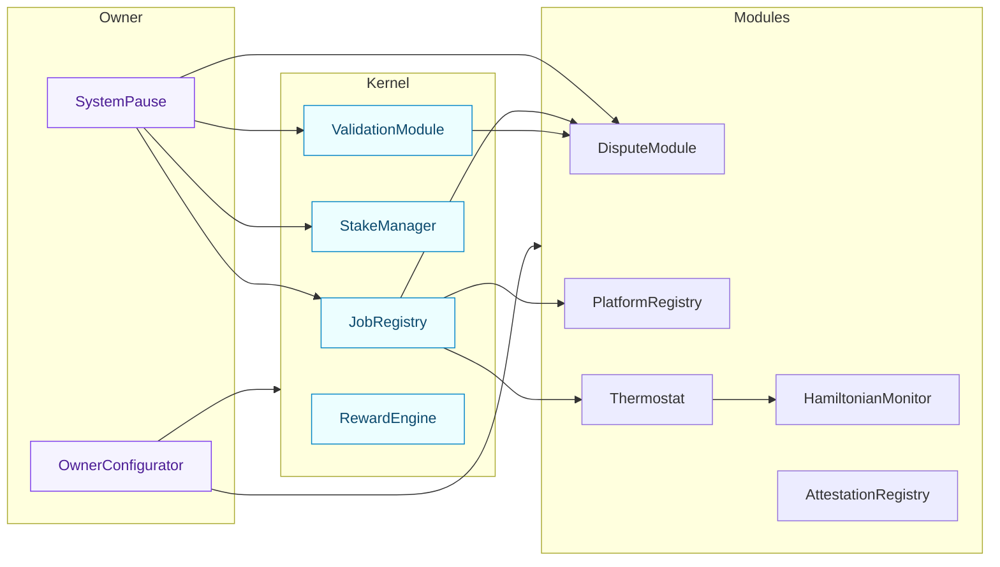
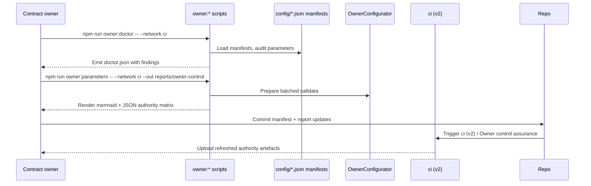

# AGI Jobs v0 (v2) — Smart Contract Stack

[](https://github.com/MontrealAI/AGIJobsv0/actions/workflows/ci.yml)
[](https://github.com/MontrealAI/AGIJobsv0/actions/workflows/fuzz.yml)
[](https://github.com/MontrealAI/AGIJobsv0/actions/workflows/ci.yml)

The `contracts/` tree delivers the production Solidity system that powers the AGI Jobs v0 (v2) superintelligence. It packages the
kernel that governs job lifecycle and staking, the module adapters that extend governance, and the owner tooling that keeps the
contract owner in direct command of every parameter. CI v2 compiles, tests, fuzzes, and enforces coverage on every change so the
system stays deployable in high-stakes environments.

## Contract families



| Directory | Contents |
| --------- | -------- |
| `v2/kernel/` | Core runtime (job registry, validation module, stake manager, reward engine) with ownable governance shims and pause hooks.【F:contracts/v2/JobRegistry.sol†L4-L157】 |
| `v2/modules/` | Auxiliary governance modules (dispute resolution, thermostat, culture registry, quadratic voting) that plug into the kernel interfaces. |
| `v2/admin/` | Owner-focused façade contracts such as `OwnerConfigurator` for batched parameter updates.【F:contracts/v2/admin/OwnerConfigurator.sol†L7-L112】 |
| `v2/governance/` | Commit-reveal governance, quadratic voting, and council scaffolding for validator assemblies. |
| `v2/utils/` & `v2/libraries/` | Shared math, encoding, and Ownable2Step primitives that keep the surface area small and auditable. |
| `coverage/` | Solidity coverage instrumentation used by `npm run coverage`. |
| `test/` | Solidity mocks and fixtures consumed by the Hardhat + Foundry suites. |

## Owner control surface

- **Batch parameter updates** – `OwnerConfigurator` emits a `ParameterUpdated` event for every change, giving the owner console a
  complete audit log while executing batched upgrades.【F:contracts/v2/admin/OwnerConfigurator.sol†L16-L112】
- **System pause** – `SystemPause` validates the addresses of every connected module and lets governance pause/unpause them in a
  single transaction, enforcing that ownership has been delegated correctly before changes land.【F:contracts/v2/SystemPause.sol†L15-L157】
- **Tax & treasury safety** – `JobRegistry` never escrows tax liabilities, routing them to the configured policy so the owner can
  rotate destinations without redeploying the kernel.【F:contracts/v2/JobRegistry.sol†L21-L54】

These contracts are wired to the `npm run owner:*` commands documented in [`config/README.md`](../config/README.md), ensuring the
contract owner maintains total control over pause levers, treasury routing, and validator quotas.

### Owner rehearsal cadence



- `npm run owner:doctor` performs strict validation of every owner-controlled parameter and fails on missing treasury, validator, or thermostat wiring before changes ever reach the blockchain.【F:package.json†L359-L375】【F:scripts/v2/ownerControlDoctor.ts†L1-L160】
- `npm run owner:parameters -- --out reports/owner-control` renders the same matrix that CI uploads, keeping local rehearsals aligned with branch-protection enforcement.【F:package.json†L359-L377】【F:scripts/v2/ownerParameterMatrix.ts†L1-L612】

## Developer workflow

```bash
npm run compile          # Hardhat compile with profile-aware constants
npm test                 # Hardhat test suite (see test/v2/**)
forge test -vvvv --ffi   # Foundry fuzz + invariant harness
npm run coverage         # Generates lcov + access-control coverage reports
```

The Hardhat tests exercise the registry, governance, and module flows defined under `test/v2/**` and the shared fixtures under
`contracts/test/`. Foundry invariants extend this by fuzzing stateful interactions and validating owner guardrails before CI marks
a run green.【F:.github/workflows/ci.yml†L62-L189】【F:.github/workflows/ci.yml†L478-L552】

## Quality gates

- **Coverage** – `ci (v2) / Coverage thresholds` enforces ≥90 % Solidity coverage and maps results back to the access-control
  modules listed in `ci.yml`, catching regressions in pause/governance paths.【F:.github/workflows/ci.yml†L500-L552】
- **Fuzzing** – The dedicated [`fuzz.yml`](../.github/workflows/fuzz.yml) workflow and the `ci (v2) / Invariant tests` job run
  Foundry fuzz cases on every PR for continuous assurance.【F:.github/workflows/fuzz.yml†L1-L144】【F:.github/workflows/ci.yml†L1208-L1339】
- **Owner control assurance** – The CI job regenerates calldata through the owner doctor scripts so any missing configurator
  wiring fails fast.【F:.github/workflows/ci.yml†L386-L434】

## Artefact outputs

- **ABIs** – `npm run abi:export` writes JSON ABIs under `artifacts/` for downstream services.
- **Gas reports** – `npm run gas:report` produces deterministic gas snapshots under `gas-snapshots/`.
- **Authority matrix** – `npm run ci:owner-authority` exports Markdown and JSON matrices describing every owner lever; the CI job
  uploads them as artefacts for release management.【F:.github/workflows/ci.yml†L418-L434】

The contract stack is designed to remain flawless under owner-led configuration changes and to emit the artefacts regulators and
operators need to deploy AGI Jobs v0 (v2) at production scale.
