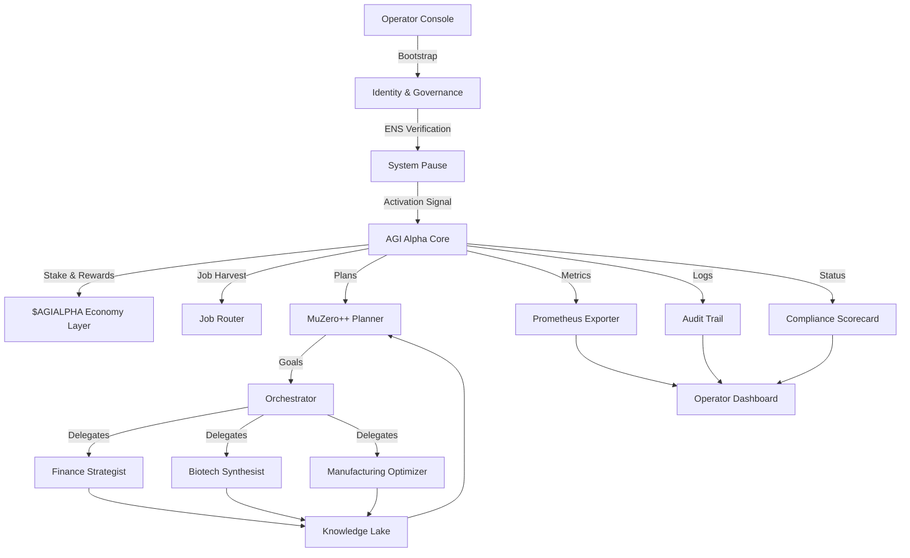

# AGI Alpha Node Demo (v0)

> A production-grade, non-technical friendly showcase that proves AGI Jobs v0 (v2) empowers anyone to operate an autonomous, super-intelligent economic agent capable of orchestrating entire value chains.

## Vision

This demo packages the **AGI Alpha Node** into a turn-key experience. A single command boots a sovereign AI economy operator that:

- Verifies on-chain identity through ENS before touching capital.
- Stakes $AGIALPHA, routes AGI Jobs, and reinvests autonomously.
- Plans with a MuZero-inspired engine, backed by specialist agents and a shared Knowledge Lake.
- Exposes real-time dashboards, Prometheus metrics, and compliance telemetry ready for institutional audit.
- Gives the operator pause, governance, and upgrade control at every step.

The result: a non-technical user can operate a machine that compounds intelligence and capital at unprecedented scale.

## Architecture Overview



## Highlights

- **Ultra-resilient safety rails** – automated drills, invariant checks, and a first-class pause circuit.
- **Institutional governance** – ENS ownership verification, governance key rotation, and ownership transfer helpers.
- **AI swarm intelligence** – MuZero++ planner plus finance, biotech, and manufacturing specialists sharing a persistent memory.
- **Economic flywheel** – real $AGIALPHA staking hooks, mockable for local integration tests.
- **Observability-first** – human-readable console, Prometheus metrics, structured logs, compliance scorecards, and dashboards.

## Quickstart

```bash
python demo/AGI-Alpha-Node-v0/src/agi_alpha_node_demo/cli.py --config demo/AGI-Alpha-Node-v0/config/default.toml status
```

The CLI walks non-technical operators through bootstrap, activation, running drills, executing jobs, and exporting compliance proofs.

## Directory Layout

- `config/` – production-ready TOML configs with clear defaults.
- `src/agi_alpha_node_demo/` – the complete Alpha Node runtime.
  - `blockchain/` – ENS verification, staking client, job registry integrations.
  - `planner/` – MuZero++ planning loop.
  - `specialists/` – domain agents with deterministic fallbacks.
  - `knowledge/` – SQLite-backed Knowledge Lake.
  - `compliance/` – compliance scoring, drills, safety rails.
  - `metrics/` – Prometheus exporter and structured log wiring.
  - `logging_utils/` – battle-tested logging, audit trail sinks.
  - `tasks/` – job harvesting, orchestration, execution pipeline.
- `web/` – static dashboard served by the CLI.
- `tests/` – pytest suite covering identity, staking, planner, specialists, and compliance.

## Production Checklist

1. Configure the ENS subdomain in `config/production.toml`.
2. Provide the RPC URL, governance keys, and $AGIALPHA stake wallet.
3. Run `python ... bootstrap` to verify ENS, initialize governance, and stake.
4. Start the node with `python ... run --serve-dashboard`.
5. Monitor with Prometheus (`agi_alpha_*` metrics) and the live compliance report.

All components are modular, auditable, and ready for extension to the main AGI Jobs orchestration fabric.
