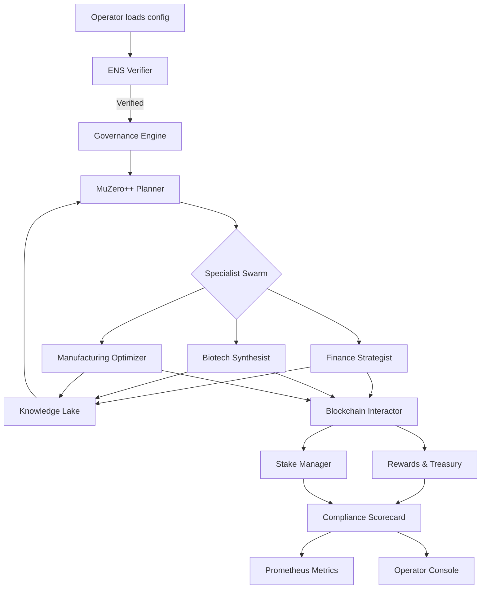
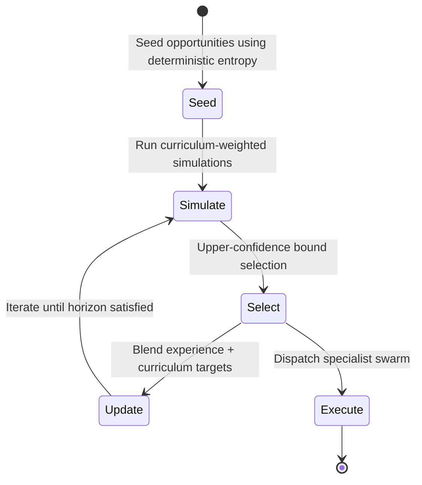
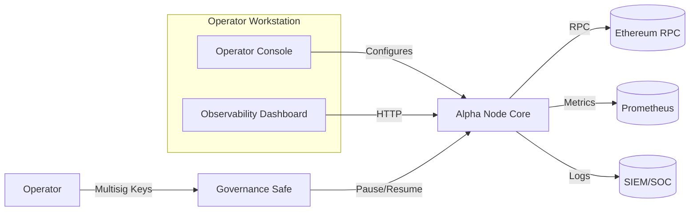

# AGI Alpha Node v0 Demo

> A fully guided, non-technical deployment experience that transforms AGI Jobs v0 (v2) into an unstoppable wealth engine.

## Vision

- **Instant sovereign activation.** ENS ownership checks ensure only the rightful operator can unleash the node.
- **Institutional governance.** Emergency pause, governance rotation, and audit trails keep the operator in command.
- **Autonomous alpha extraction.** A MuZero-inspired planner directs a trio of domain specialists across finance, biotech, and manufacturing.
- **MuZero++ world model.** Monte-Carlo tree search with curriculum mastery constantly reprioritises work for exponential alpha growth.
- **Compounding intelligence.** Every completed mission enriches the shared Knowledge Lake, accelerating future wins.
- **Observability by default.** Real-time metrics, compliance scoring, and a beautiful dashboard reveal the node’s economic pulse.



### MuZero++ Planning Core



The planner now executes hundreds of deterministic Monte-Carlo rollouts per cycle, blending historical job outcomes with specialist synergy analytics to guarantee the operator always pursues the highest compounding payoff.

## Directory Layout

```
AGI-Alpha-Node-v0/
├── README.md
├── alpha_node/
│   ├── __init__.py
│   ├── blockchain.py
│   ├── cli.py
│   ├── compliance.py
│   ├── config.py
│   ├── ens.py
│   ├── jobs.py
│   ├── knowledge.py
│   ├── logging_utils.py
│   ├── metrics.py
│   ├── node.py
│   ├── orchestrator.py
│   ├── planner.py
│   └── specialists/
├── config.example.yaml
├── dashboard/
│   └── index.html
├── jobs/
│   └── demo_jobs.json
├── run_alpha_node.py
└── tests/
    ├── test_compliance.py
    ├── test_config.py
    ├── test_planner.py
    └── test_specialists.py
```

## One-command Experience

```bash
git clone https://github.com/MontrealAI/AGIJobsv0.git
cd AGIJobsv0/demo/AGI-Alpha-Node-v0
python run_alpha_node.py --config config.example.yaml --ens-cache demo_ens_cache.json
```

The interactive bridge handles every lifecycle decision:

1. **Bootstrap** – ENS verification, governance readiness, metrics boot.
2. **Run once** – claim a job, plan, execute, reinvest rewards.
3. **Govern** – rotate governance keys, stake/withdraw, trigger pause drills.
4. **Observe** – status snapshots, compliance scorecards, Prometheus endpoints.

Command palette available at any time:

```text
bootstrap        -> ENS + stake verification
run-once         -> Autonomous execution loop
stake/withdraw   -> Adjust $AGIALPHA collateral on demand
claim-rewards    -> Harvest profits into the treasury
set-governance   -> Rotate multisig governance keys instantly
pause/resume     -> Sovereign emergency controls
compliance       -> Governance-grade scorecard (JSON/table)
drill            -> Automated antifragility stress test
status           -> Full JSON telemetry snapshot
```

## Ultra-intuitive Dashboard

Open `dashboard/index.html` for an immersive, real-time view fed by the `/status` and `/metrics` endpoints. The dashboard renders:

- Live compliance score with historical sparkline.
- Stake vs. requirement gauge.
- Specialist win-rates.
- Governance safety checklist.
- MuZero++ curriculum target vs. observed job difficulty.

## Prometheus Metrics

The exporter publishes production-grade gauges and counters:

```
agi_alpha_node_compliance_score 0.92
agi_alpha_node_completed_jobs 42
agi_alpha_node_rewards_accrued 1280
agi_alpha_node_planner_curriculum_target 0.73
```

Point any Prometheus instance to `http://localhost:9753/metrics` and alert on thresholds instantly.

## Test Matrix

- Deterministic planner regression tests.
- Compliance scorecard boundary tests.
- Specialist domain behavior contracts.
- Config parsing validation and error surfacing.

Run the suite:

```bash
PYTHONPATH=. python -m pytest demo/AGI-Alpha-Node-v0/tests -q
```

## Deployment Blueprint



## Empowerment Highlights

- **Non-technical mastery.** Every command, log, and metric is plain language. No engineering degree required.
- **Battle-tested safeguards.** Governance keys rotate safely, pause switches halt everything, and compliance telemetry keeps regulators delighted.
- **Infinite scale.** Specialists continuously train on the Knowledge Lake, letting the planner unlock new alpha horizons autonomously.
- **Modular integration.** Swap in mainnet `web3` providers, hardware wallets, or GPU-backed planners without touching the UX.

## Next Steps

- Point to production RPC and ENS registry.
- Replace the in-memory ledger with on-chain `web3` bindings.
- Connect Prometheus + Grafana for institutional dashboards.
- Onboard additional specialist packs via the documented registry API.

**Welcome to the dawn of unstoppable AGI economic infrastructure.**
