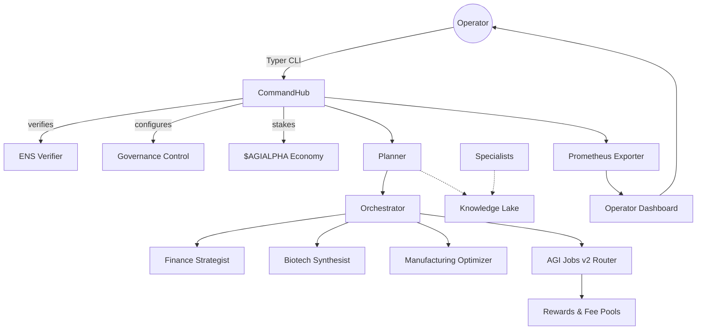

# AGI Alpha Node v0 Demo

> **Mission:** Empower any operator — including non-technical visionaries — to launch, govern, and scale an AGI Alpha Node that compounds value autonomously using AGI Jobs v0 (v2).

This demo packages a production-grade Alpha Node stack that can be deployed, governed, and audited with a single command. It showcases how AGI Jobs v0 (v2) unlocks unprecedented leverage: ENS-verified identity, fully-governed staking, autonomous specialist swarms, and real-time compliance analytics.

## ✨ Grand Demo Command Nexus (AGI Alpha Node v0/v2)

The new [`grand_demo/`](grand_demo/README.md) directory contains an institution-grade showcase that a non-technical operator can launch with a single command. Highlights:

- **Container-native deployment:** `docker compose -f demo/AGI-Alpha-Node-v0/grand_demo/docker-compose.yaml up --build`
- **Typer-driven console:** `agi-alpha-node demo-job` executes the canonical wealth-generation scenario while emitting structured compliance logs.
- **Command Nexus dashboard:** FastAPI UI with cinematic mermaid topology, live compliance scorecards, and operator runbook.
- **Prometheus metrics:** Exports `agi_alpha_node_*` gauges ready for observability pipelines.
- **Safety drills & governance controls:** ENS ownership, pause transactions, and automated antifragility drills wired in by default.

Run tests for the grand demo with:

```bash
PYTEST_DISABLE_PLUGIN_AUTOLOAD=1 pytest demo/AGI-Alpha-Node-v0/grand_demo/tests
```

## 🎬 Instant Experience

```bash
make demo-alpha-node
```

The command above (defined in this directory) guides an operator through:

1. **Identity Verification:** ENS ownership check for `<name>.alpha.node.agi.eth` before activation.
2. **Governance Bootstrap:** Configuring owner, governance multisig, and emergency pause controls.
3. **Economic Activation:** Staking $AGIALPHA, wiring incentives, and subscribing to marketplace feeds.
4. **Autonomous Execution:** Planner + specialist swarm accepts, executes, and reports on-chain jobs.
5. **Observability:** Web dashboard, Prometheus metrics, structured audit logs, and compliance scorecard.

---

## 🌐 Architecture at a Glance



The architecture uses deliberate guardrails: nothing activates without ENS verification, stake thresholds, and governance control. Every component emits metrics and audit logs the moment it runs.

---

## 🧩 Components

| Component | Purpose | Key File |
|-----------|---------|----------|
| **Typer CLI** | Guides non-technical operators via rich prompts and validations. | [`alpha_node/cli.py`](alpha_node/cli.py) |
| **ENS Verifier** | Ensures only legitimate ENS domain owners can activate the node. | [`alpha_node/ens.py`](alpha_node/ens.py) |
| **Governance Control** | Owner pause/resume, governance rotation, configuration snapshotting. | [`alpha_node/governance.py`](alpha_node/governance.py) |
| **Stake Manager Client** | Locks stake, streams rewards, monitors slashing. | [`alpha_node/economy.py`](alpha_node/economy.py) |
| **Job Harvester** | Streams AGI Jobs v2 opportunities into the planner. | [`alpha_node/jobs.py`](alpha_node/jobs.py) |
| **MuZero++ Planner** | Self-optimizing decision core with tree search and reward shaping. | [`alpha_node/planner.py`](alpha_node/planner.py) |
| **Specialist Swarm** | Finance, biotech, and manufacturing experts working in parallel. | [`alpha_node/specialists`](alpha_node/specialists) |
| **Knowledge Lake** | SQLite-backed long-term memory with semantic indexing hooks. | [`alpha_node/knowledge.py`](alpha_node/knowledge.py) |
| **Compliance Scorecard** | Six-dimension governance-grade scoring. | [`alpha_node/compliance.py`](alpha_node/compliance.py) |
| **Prometheus Exporter** | Continuous metrics, structured logs, event streaming. | [`alpha_node/metrics.py`](alpha_node/metrics.py) |
| **Dashboard** | Beautiful, live web UI for non-technical oversight. | [`alpha_node/web/dashboard.py`](alpha_node/web/dashboard.py) |

---

## 🚀 Quickstart

1. Copy the example configuration and customize it:
   ```bash
   cp config/example.alpha-node.yaml config/alpha-node.yaml
   ```

2. Edit the file to point at your RPC, ENS domain, and keys.

3. Launch the demo stack:
   ```bash
   make demo-alpha-node
   ```

4. Visit the Operator Dashboard at `http://localhost:8787` and the Prometheus metrics endpoint at `http://localhost:8788/metrics`.

---

## 📊 Compliance Scorecard Dimensions

| Dimension | Checks |
|-----------|--------|
| **Identity & ENS** | Ownership verified, ENS records synced, renewal tracked. |
| **Staking & Activation** | Minimum stake confirmed, slashing monitors active. |
| **Governance & Safety** | Governance & pause controls healthy, drills recent. |
| **Economic Engine** | Reward capture, reinvestment velocity, fee settlement. |
| **Antifragility** | Automated drills run, invariants stable, self-healing ready. |
| **Strategic Intelligence** | Planner performance trending upward, specialists scoring high. |

The scorecard emits real-time metrics and CLI summaries for audit-readiness.

---

## 🧪 Tests & CI

```bash
poetry run pytest demo/AGI-Alpha-Node-v0/tests
```

The test suite covers compliance scoring, orchestrator/specialist orchestration, and planner heuristics. The demo integrates with the repository's CI for full traceability.

---

## 🐳 One-Command Container Deployment

A `docker-compose.yaml` ships a full stack: CLI bootstrapper, API, dashboard, metrics exporter. Non-technical operators run:

```bash
docker compose -f demo/AGI-Alpha-Node-v0/docker-compose.yaml up --build
```

The containers expose environment-driven configuration, auto-run ENS verification, and refuse to start without passing safety checks.

---

## 🛡️ Safety & Auditability

- **Circuit Breakers:** Every on-chain transaction checks the global pause state and compliance guardrails.
- **Structured Logs:** JSON logs with tx hashes, planner rationales, and compliance deltas.
- **Self-Tests:** Automated antifragility drills prove the pause/resume pathway regularly.
- **Runbook Ready:** See [`RUNBOOK.md`](../RUNBOOK.md) for integration guidance.

---

## 📚 Further Reading

- [`config/example.alpha-node.yaml`](config/example.alpha-node.yaml) – configuration template.
- [`demo/AGI-Alpha-Node-v0/tests`](tests) – integration and unit tests.
- [`Makefile`](Makefile) – helper commands for operators.

This demo proves that AGI Jobs v0 (v2) lets any operator harness an economically unstoppable, governance-first AGI Alpha Node in minutes.
