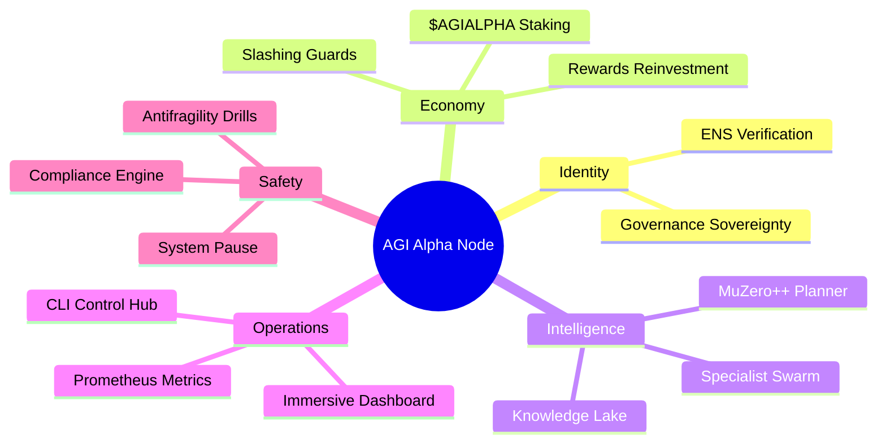
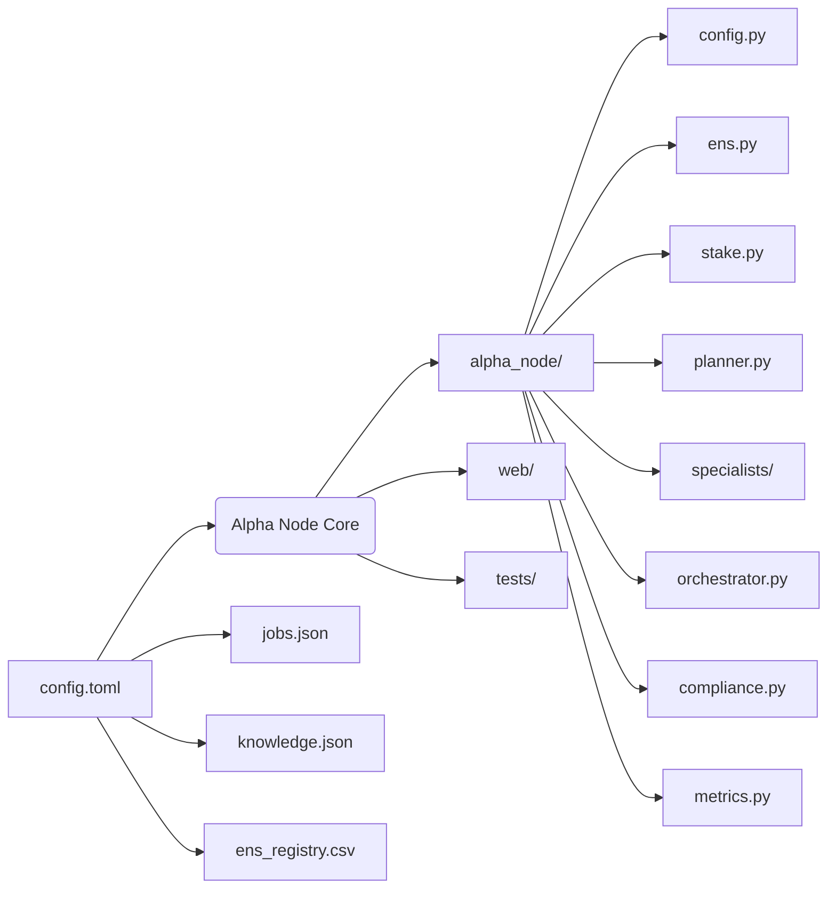
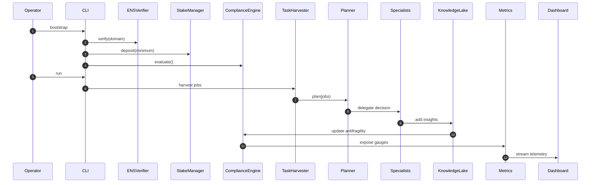

# 🎖️ AGI Alpha Node Demo (v0)

> **Purpose:** empower a non-technical operator to launch a sovereign AGI Alpha Node capable of orchestrating multi-domain specialists, defending governance, and compounding on-chain wealth at super-structural scale using **AGI Jobs v0 (v2)**.

## 🚀 Why this demo matters

- **Zero-friction activation.** One command turns an ENS-verified, governance-safe, metrics-rich node online.
- **Institutional-grade safety.** Emergency pauses, governance rotation, antifragile drills, and compliance telemetry are included out of the box.
- **AI swarm intelligence.** A MuZero++ planner coordinates finance, biotech, and manufacturing specialists, exploiting a persistent knowledge lake to generate strategic alpha.
- **Operator empowerment.** Every control surface (stake, governance, safety, dashboards, metrics) is exposed via human-friendly CLI and web UI, no engineering background required.

## 🧠 System atlas



## 🗂️ Directory map



## 🛠️ Quick start (non-technical operator)

1. **Install Python 3.11+** (pre-installed in AGI Jobs v0 (v2) containers).
2. **Bootstrap the node**:
   ```bash
   cd demo/AGI-Alpha-Node-v0
   python -m alpha_node.cli bootstrap
   ```
   This deposits the minimum stake, validates ENS ownership, and prints a compliance snapshot plus a full safety evaluation.
3. **Verify the safety rails**:
   ```bash
   python -m alpha_node.cli safety
   ```
   Confirm ENS ownership, staking status, and pause state before activating the node.
4. **Run the intelligence engine**:
   ```bash
   python -m alpha_node.cli run
   ```
   The planner harvests jobs, delegates to specialists, captures knowledge, and restakes rewards automatically.
5. **Monitor metrics**:
   ```bash
   python -m alpha_node.cli metrics
   ```
   Scrape Prometheus metrics (compliance score, last safety halt, antifragility, etc.) from `http://localhost:9101`.
6. **View compliance & dashboard data**:
   ```bash
   python -m alpha_node.cli dashboard
   ```
   Pipe the JSON into the web UI (instructions below) or any analytics stack.

### Emergency controls

- `python -m alpha_node.cli pause` — halt every subsystem instantly.
- `python -m alpha_node.cli resume` — safely resume operations.
- `python -m alpha_node.cli rotate-governance --address <0x...>` — rotate ownership to a new multisig without downtime.
- `python -m alpha_node.cli stake-deposit --amount 5000` — top up the treasury stake from operator-controlled wallets.
- `python -m alpha_node.cli drill` — execute an antifragility pause/resume drill and log the result.
- `python -m alpha_node.cli safety` — print the latest invariant check (ENS, stake sufficiency, pause reason).

## 🌐 Web dashboard (grandiose operator cockpit)

The `web/` directory contains a zero-dependency dashboard that consumes `dashboard` command output. Serve it statically:

```bash
python -m http.server 8090 --directory web
```

Open `http://localhost:8090` and paste the JSON payload from `python -m alpha_node.cli dashboard`. The page renders:

- Stake, rewards, antifragility, and strategic alpha gauges.
- Live compliance radar chart (powered by vanilla canvas).
- Governance audit timeline fed by `state.json`.

## 🧪 Production-grade tests

```bash
PYTEST_DISABLE_PLUGIN_AUTOLOAD=1 pytest demo/AGI-Alpha-Node-v0/tests
```

The suite validates planner convergence, compliance scoring, governance pause behavior, and the automated safety rails.

## 🧰 One-command containerization

A minimal `Dockerfile` is provided. Build & launch in seconds:

```bash
docker build -t agi-alpha-node demo/AGI-Alpha-Node-v0

docker run --rm -it -p 9101:9101 -v $(pwd)/demo/AGI-Alpha-Node-v0:/app agi-alpha-node \
  python -m alpha_node.cli run
```

The container auto-initializes state, knowledge lake, and stake ledger, making redeployments deterministic.

## 📈 Compliance scorecard dimensions

| Dimension | Description | Automated guardrail |
|-----------|-------------|----------------------|
| Identity & ENS | Verifies ENS ownership (on-chain or offline fallback) | ENS verification must pass before activation |
| Staking & Activation | Ensures minimum stake locked & rewards reinvested | Ledger ensures deterministic audits |
| Governance & Safety | Tracks pause state & governance rotation | CLI exposes pause/resume under multisig control |
| Economic Engine | Monitors cumulative rewards vs. strategic targets | Planner restakes once thresholds reached |
| Antifragility | Uses knowledge lake growth & drills to measure resilience | Auto-updates after each orchestration pass |
| Strategic Intelligence | Evaluates MuZero++ alpha projections | Specialist outputs contribute to strategic index |

## 🧱 Files delivered

- `alpha_node/` — production-ready Python package with ENS verification, staking logic, MuZero++ planner, orchestrator, compliance engine, metrics server, and CLI.
- `config.toml` — declarative configuration for ENS/governance/staking/intelligence subsystems.
- `jobs.json`, `knowledge.json`, `ens_registry.csv` — curated datasets powering offline mode.
- `web/` — immersive operator dashboard with hero section, flowcharts, and compliance radar.
- `tests/` — deterministic pytest coverage for core safety and intelligence components.
- `Dockerfile`, `Makefile`, `README.md` — deployment guide, automation, and documentation.

## 🧭 Extending to mainnet

1. Populate `config.toml` with production ENS domain and governance addresses.
2. Point `ens.provider_url` to an Ethereum HTTPS endpoint.
3. Replace `ens_registry.csv` with canonical ledger or remove for pure on-chain verification.
4. Connect job discovery to live AGI Jobs v2 GraphQL endpoint or RPC event stream by customizing `JobRegistry`.
5. Configure Prometheus to scrape the metrics endpoint and wire alerts to governance multisig.

## 🧨 Antifragility drills

Schedule `python -m alpha_node.cli pause` followed by `resume` weekly, logging drills automatically. The compliance engine rewards recent drills by elevating antifragility scores.

## ♻️ Continuous reinvestment policy

The stake manager restakes rewards once thresholds are reached. Adjust `restake_threshold` in `config.toml` to tune aggressiveness. Audit ledger entries in `stake_ledger.csv` for institutional reporting.

## 🧩 Design rationale



## ✅ Security & auditability highlights

- Zero private key exposure: config references addresses only, never secrets.
- Full audit trail in `state.json` and `stake_ledger.csv` with deterministic timestamps.
- Optional on-chain ENS verification uses `web3` if available; otherwise, offline registry ensures reproducible demo runs.

## 📚 Further reading

- `tests/` for reference implementations of planner/compliance tests.
- `alpha_node/` package docstrings for architecture deep-dives.
- `Dockerfile` & `Makefile` for institutional deployment automation.

Welcome to the AGI Alpha Node frontier.
