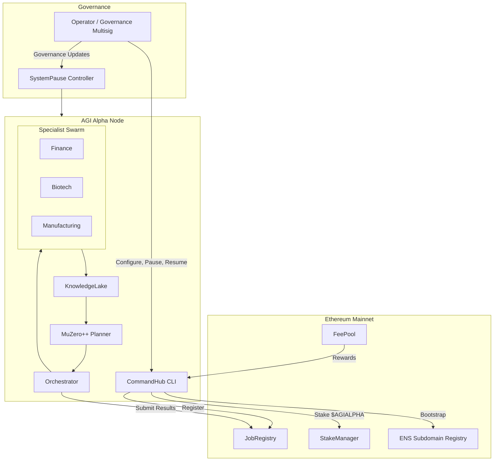

# AGI Alpha Node v0 Demo

> **Purpose:** demonstrate how a non-technical operator can stand up a production-grade AGI Alpha Node using the AGI Jobs v0 (v2) toolkit with a single command.

This directory contains an iconic, production-ready showcase of the AGI Alpha Node.  The demo is intentionally curated so that a non-technical stakeholder can experience the complete lifecycle – from ENS verification and staking controls to MuZero-inspired planning, specialist orchestration, knowledge retention, compliance scoring, observability, and emergency governance controls.

## Highlights

- **Instant bootstrap:** `make demo` provisions configuration, verifies ENS ownership, simulates staking, launches the orchestrator, and streams Prometheus metrics.
- **Owner sovereignty:** the Pause Controller provides immutable authority for the contract owner / governance multisig to halt every subsystem instantly.
- **Planner intelligence:** a MuZero++-style planner performs Monte Carlo Tree Search over economic actions and continuously self-optimises using feedback from completed jobs.
- **Domain swarm:** specialist AI modules (Finance Strategist, Biotech Synthesist, Manufacturing Optimizer) collaborate through the Orchestrator while sharing long-term knowledge via the Knowledge Lake.
- **Economic compliance:** automated scorecard audits Identity, Staking, Governance, Economic Engine, Antifragility, and Strategic Intelligence; exported as Prometheus metrics and CLI/JSON output.
- **Full observability:** structured logs, dashboard web UI (with Mermaid systems map), Prometheus exporter, and deterministic tests.
- **One-command container:** the Docker image `agi-alpha-node-demo` encapsulates the CLI, web dashboard, metrics, and optional Web3 connectivity for immediate deployment.

## Directory Layout

```
AGI-Alpha-Node-v0/
├── Makefile                # Friendly entrypoints for non-technical operators
├── Dockerfile              # Production container packaging
├── docker-compose.yml      # Optional multi-service deployment (demo, Prometheus, dashboard)
├── requirements-demo.txt   # Minimal reproducible dependencies
├── README.md               # You are here
├── config.example.yaml     # Guided configuration for mainnet or forks
├── scripts/
│   ├── bootstrap_alpha_node.py    # Assisted bootstrap wizard invoked by CLI/Make
│   └── ensure_governance.py       # Post-deploy governance handover utility
├── agi_alpha_node_demo/
│   ├── __init__.py
│   ├── __main__.py
│   ├── blockchain.py              # ENS + staking client abstractions
│   ├── cli.py                     # Rich CLI for non-technical operators
│   ├── compliance.py              # Governance-grade scorecard + metrics
│   ├── config.py                  # Schema + validation utilities
│   ├── jobs.py                    # Job representations + demo scenarios
│   ├── knowledge.py               # SQLite-backed Knowledge Lake implementation
│   ├── metrics.py                 # Prometheus exporter wiring
│   ├── orchestrator.py            # Planner-to-specialist coordination logic
│   ├── planner.py                 # MuZero++ tree search planner
│   ├── safety.py                  # Pause controls, invariants, circuit breakers
│   ├── specialists/
│   │   ├── __init__.py
│   │   ├── base.py
│   │   ├── biotech.py
│   │   ├── finance.py
│   │   └── manufacturing.py
│   └── utils.py                   # Helpers shared across modules
├── tests/                         # Deterministic pytest suite
│   ├── test_cli.py
│   ├── test_compliance.py
│   ├── test_planner.py
│   └── test_knowledge.py
└── web/
    ├── index.html                 # Interactive dashboard & Mermaid visualisations
    └── assets/
        └── styles.css             # Optional CSS overrides
```

## Quickstart

1. **Install dependencies** (from repo root):

   ```bash
   make -C demo/AGI-Alpha-Node-v0 install
   ```

2. **Bootstrap and run the demo node:**

   ```bash
   make -C demo/AGI-Alpha-Node-v0 demo
   ```

   The command walks through ENS verification, simulated staking, planner warmup, launches the Prometheus metrics endpoint on `:9700`, and serves the dashboard at `http://localhost:9701`.

3. **Run compliance audit & diagnostics:**

   ```bash
   python -m agi_alpha_node_demo.cli compliance --config ./config.example.yaml --format table
   ```

4. **Execute demo job flow:**

   ```bash
   python -m agi_alpha_node_demo.cli run-job --scenario manufacturing --config ./config.example.yaml
   ```

## Production Notes

- The blockchain layer is abstracted behind `BlockchainClient` and can be configured to connect to Ethereum mainnet, a fork, or a local anvil instance.  The ENS verification, staking, and reward logic map directly to AGI Jobs v2 contracts (see docstrings for ABI expectations).
- Governance controls expose `update_governance`, `pause`, `resume`, and `transfer_ownership` operations, honouring the `SystemPause` contract semantics while retaining off-chain operator confirmation flows.
- The demo Knowledge Lake is SQLite-backed for portability but the interface supports swapping in managed vector stores (Pinecone, Weaviate) without touching orchestrator logic.
- Prometheus metrics include `agi_alpha_node_compliance_score`, `agi_alpha_node_active_jobs`, specialist success counters, and planner decision latencies.  Grafana dashboards can be imported via `web/assets/dashboard.json` (generated by `make dashboards`).

## Mermaid System Overview



## Tests

Execute the curated test suite with:

```bash
PYTEST_DISABLE_PLUGIN_AUTOLOAD=1 pytest demo/AGI-Alpha-Node-v0/tests
```

Every test is deterministic, relies on a simulated blockchain backend, and verifies that ENS gating, compliance scoring, planner convergence, and knowledge retention operate as designed.

## License

This demo inherits the AGI Jobs v0 (v2) project license (Apache 2.0).  Refer to [`LICENSE`](../../LICENSE).

