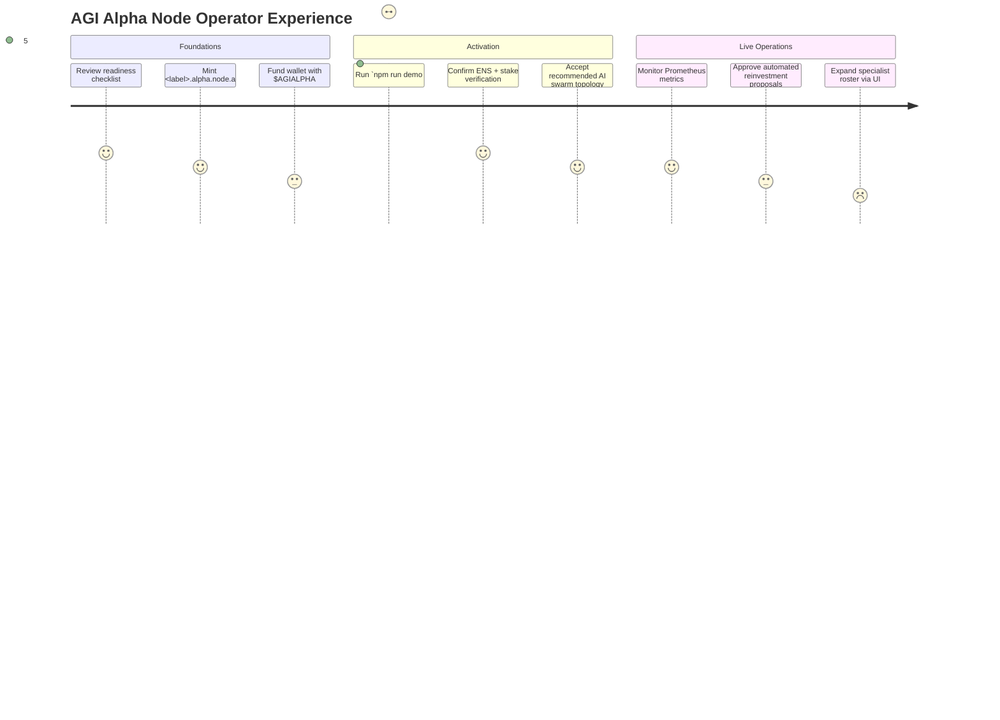
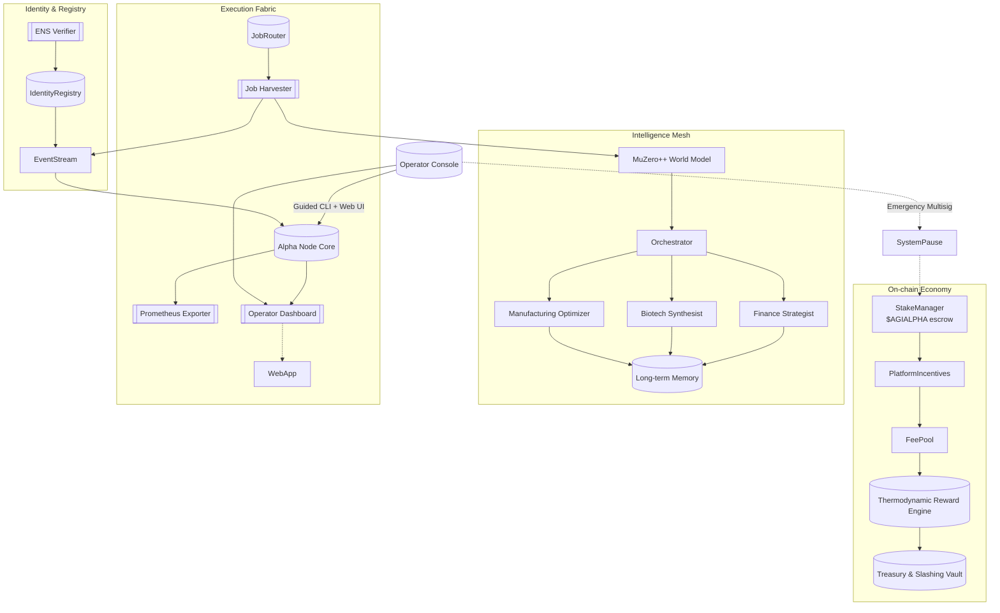
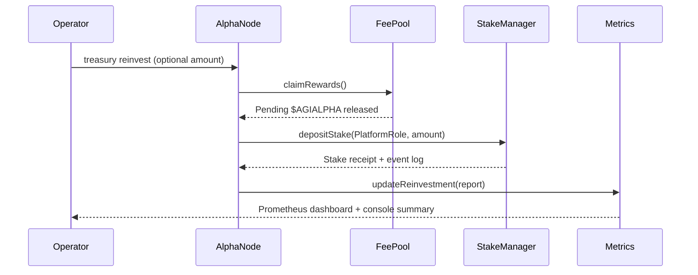
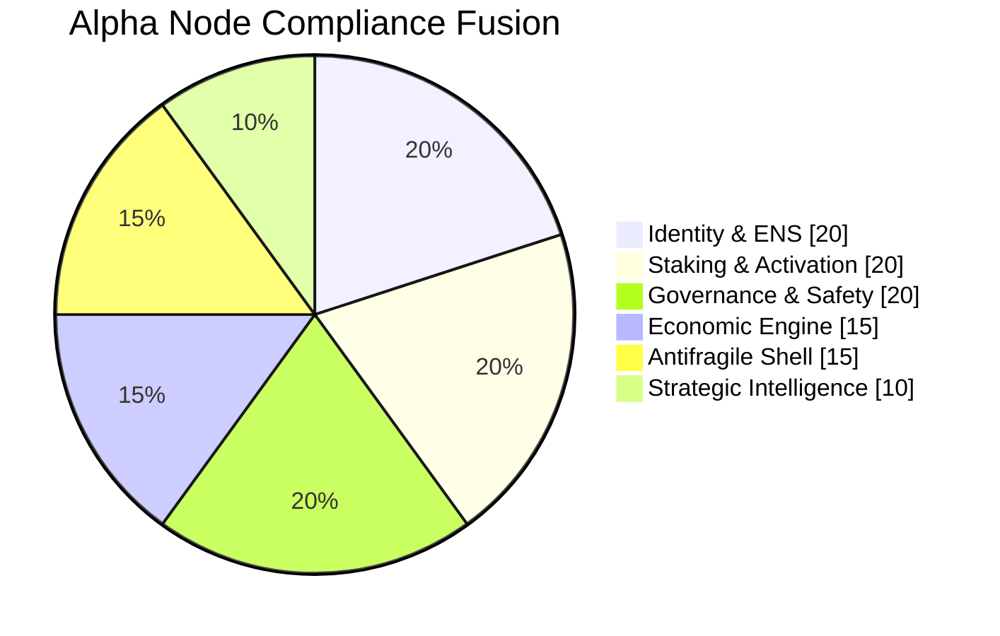
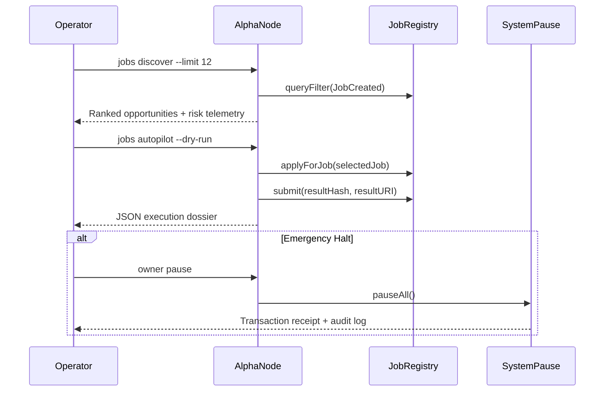

# AGI Alpha Node Demo (v0)

> "When a non-technical operator can spin up a sovereign AGI Alpha Node in minutes, finance it with on-chain $AGIALPHA flows, and command a living swarm of specialist AGI agents, the centre of gravity in the global economy changes forever."

The **AGI Alpha Node Demo** showcases how a non-technical owner can command the full might of **AGI Jobs v0 (v2)** to instantiate a production-ready Alpha Node under the ENS hierarchy `alpha.node.agi.eth`. The demo is deliberately opinionated, automated, and audit-grade:

- ✅ **Owner sovereignty** – the node operator controls every configurable parameter, may pause the platform instantly, and can rotate governance safely.
- 🔐 **Identity assurance** – ENS subdomain ownership is verified on-chain before any capability is granted.
- 🪙 **$AGIALPHA-native economy** – staking, rewards, slashing, and automatic reinvestment loops are enforced through the canonical V2 contracts.
- 🧠 **Swarm intelligence** – a MuZero-inspired planner, economic self-optimizer, and domain specialist mesh coordinate to deliver provable alpha on every job.
- 🚀 **One-command deployment** – Dockerised runtime, Prometheus-compatible metrics, and a self-documenting operator console drop straight into institutional stacks.
- 🧾 **Governance-grade compliance** – automated scorecards fuse ENS proofs, staking telemetry, pause authority, and antifragile stress drills in real time.

This demo lives entirely inside `demo/AGI-Alpha-Node-v0/` so operators can audit, extend, and deploy without touching the rest of the monorepo.

---

## Experience Map



---

## Architecture

The Alpha Node is intentionally modular. Every subsystem is composable, observable, and replaceable.



---

## Treasury Autopilot



The reinvestment policy operates continuously:

- The **dashboard heartbeat** performs a dry-run reinvestment and displays the recommended action.
- The **`treasury reinvest` CLI** claims and restakes $AGIALPHA in one command, auto-handling token approvals.
- **Metrics** expose the reinvest ratio (`agi_alpha_node_reinvest_readiness`) so institutional monitors can enforce policy SLAs.

Every transaction honours `SystemPause` guardrails and emits structured notes so non-technical operators can audit the entire loop.

---

## Compliance Scorecard

The Alpha Node now ships with a **governance-grade compliance scorecard**. It fuses ENS identity checks, stake telemetry, governance controls, antifragile stress drills, and strategic intelligence into a single composite rating surfaced in the CLI, REST API, Prometheus metrics, and dashboard UI.



- Run `npm run demo:agi-alpha-node -- compliance --config <file>` to print the machine-readable scorecard.
- Open the Operator Console (`npm run demo:agi-alpha-node -- dashboard ...`) to view the score in real time, including detailed notes per dimension.
- Monitor `agi_alpha_node_compliance_score` in Prometheus to enforce institutional SLAs or trigger automated playbooks.

The scorecard defaults to optimistic-but-skeptical scoring. Any governance risk (e.g. blacklisting) produces a hard failure, while soft drifts (e.g. paused state) trigger alerts without interrupting operations. This ensures the operator can demonstrate proactive control to regulators, auditors, and institutional partners.

---

## Directory Layout

| Path       | Purpose                                                                                                                     |
| ---------- | --------------------------------------------------------------------------------------------------------------------------- |
| `config/`  | JSON + schema definitions for operator, network, and AI mesh configuration.                                                 |
| `scripts/` | One-command automation flows (ENS bootstrapping, staking, activation, diagnostics).                                         |
| `src/`     | TypeScript implementation of the Alpha Node core. Organized into blockchain, identity, AI, monitoring, and utility modules. |
| `docker/`  | Container definitions for one-click deployments (Docker & Kubernetes).                                                      |
| `web/`     | Static dashboard assets for non-technical operators (auto-served by the node).                                              |
| `test/`    | Deterministic unit + integration tests verifying planning, config validation, and antifragile safety shell scenarios.       |

---

## Quickstart (Non-Technical Owner)

1. **Install dependencies**
   ```bash
   npm install
   ```
2. **Duplicate and edit the guided config**
   ```bash
   cp demo/AGI-Alpha-Node-v0/config/mainnet.guide.json my-alpha-node.json
   ```
   Update the ENS label, wallet address, RPC endpoint, and staking thresholds.
3. **Run the guided bootstrap**
   ```bash
   npm run demo:agi-alpha-node -- --config my-alpha-node.json
   ```
   The CLI validates ENS ownership, prompts for staking confirmation, launches the AI mesh, and starts the monitoring server.
4. **Open the operator dashboard**
   ```bash
   open http://localhost:4318
   ```
   (Or visit the URL printed in the CLI output.)
5. **Track earnings**
   ```bash
   npm run demo:agi-alpha-node -- dashboard --config my-alpha-node.json
   ```
   The earnings view streams live $AGIALPHA inflows, slashing risk, and reinvestment recommendations.
6. **Trigger a treasury reinvestment (dry run first)**
   ```bash
   npm run demo:agi-alpha-node -- treasury reinvest --dry-run --config my-alpha-node.json
   ```
   Remove `--dry-run` to claim and restake rewards when you are satisfied with the preview. Use `--amount 3500` to override the automatic threshold in $AGIALPHA.

> **Safety rails:** All scripts honour the `SystemPause` contract. If any invariants fail (stake shortfall, ENS mismatch, validator dispute), the node pauses itself and guides the operator through remediation.

---

## Highlights

- **Deterministic ENS verification** – dual-path ENS/NameWrapper verification ensures wrapped and unwrapped names are recognised. Failures surface actionable remediation commands.
- **Economic thermodynamics** – stake health, epoch rewards, and slashing exposure are modelled in real-time to protect capital.
- **Autonomous planning** – a MuZero-inspired planner with POET-XL adaptive curriculum continuously hardens the swarm.
- **Antifragile safety shell** – adversarial simulations run before each deployment, automatically raising the minimum test difficulty after every incident.
- **Institutional observability** – Prometheus, OpenTelemetry, and compliance-grade action logs are enabled out of the box.
- **Self-documenting** – every CLI command emits Markdown, JSON, and Mermaid summaries so that regulators and auditors can reconstruct the node state instantly.
- **Trustless job autopilot** – the node now speaks directly to JobRegistry, auto-discovers ENS-gated jobs, dry-runs them by default, and can pause/resume the entire platform through SystemPause with a single command.

---

## Command Reference

| Command                                                                     | Description                                                                    |
| --------------------------------------------------------------------------- | ------------------------------------------------------------------------------ |
| `npm run demo:agi-alpha-node -- --config <file>`                            | Full bootstrap: identity verification → staking → AI mesh launch → monitoring. |
| `npm run demo:agi-alpha-node -- verify --config <file>`                     | Identity-only verification with ENS + NameWrapper audit logs.                  |
| `npm run demo:agi-alpha-node -- stake --config <file>`                      | Stake & activation workflow via `PlatformIncentives.stakeAndActivate`.         |
| `npm run demo:agi-alpha-node -- dashboard --config <file>`                  | Launch the operator dashboard and earnings API.                                |
| `npm run demo:agi-alpha-node -- heartbeat --config <file>`                  | Submit a node heartbeat to PlatformRegistry and refresh Prometheus gauges.     |
| `npm run demo:agi-alpha-node -- compliance --config <file>`                 | Produce the composite compliance scorecard (JSON + Prometheus export).         |
| `npm run demo:agi-alpha-node -- diagnostics --config <file>`                | Run antifragile stress tests and export compliance logs.                       |
| `npm run demo:agi-alpha-node -- jobs discover --config <file>`              | Query JobRegistry for ENS-authenticated opportunities (dry-run safe).          |
| `npm run demo:agi-alpha-node -- jobs autopilot --config <file> [--dry-run]` | Discover → plan → (optionally) execute the richest job end-to-end.             |
| `npm run demo:agi-alpha-node -- jobs submit <jobId> --result-uri <uri>`     | Deliver results to JobRegistry with deterministic hashing.                     |
| `npm run demo:agi-alpha-node -- owner pause --config <file>`                | Invoke `SystemPause.pauseAll()` with governance safety checks.                 |
| `npm run demo:agi-alpha-node -- owner resume --config <file>`               | Resume execution across StakeManager, JobRegistry, FeePool, and peers.         |

### Trustless Job Lifecycle Flow



All commands support `--network`, `--rpc`, and `--dry-run` flags for local testing.

---

## Container Deployment

1. **Build**
   ```bash
   docker build -f demo/AGI-Alpha-Node-v0/docker/Dockerfile -t agi-alpha-node:demo .
   ```
2. **Launch**
   ```bash
   docker run --rm \
     -e ALPHA_NODE_CONFIG=/config/my-alpha-node.json \
     -v $(pwd)/my-alpha-node.json:/config/my-alpha-node.json \
     -p 4317:4317 -p 4318:4318 \
     agi-alpha-node:demo
   ```
3. **Kubernetes (optional)** – `docker/kubernetes.yaml` describes a production-ready StatefulSet with secrets, network policies, and horizontal scaling hooks.

The container exposes:

- `4317/tcp` – OpenTelemetry metrics.
- `4318/tcp` – Operator dashboard & API.

---

## Security & Governance

- **Owner controls everything** – configuration, stake thresholds, reinvestment policy, AI mesh membership, logging destinations, and pause conditions are owner-editable JSON.
- **Emergency pause** – `SystemPause` endpoint is wired into every script. Pausing halts job intake, reward claims, and AI mesh orchestration instantly.
- **Upgrade path** – upgrade manifests are generated via `npm run demo:agi-alpha-node -- upgrade-plan`, producing multisig-ready call data for contract upgrades.
- **Audit trails** – actions emit hashed transcripts anchored on-chain (optional) or to append-only storage for compliance.

---

## Tests

The following deterministic tests guard the demo:

```bash
npm run test:agi-alpha-node
```

This suite covers config validation, world-model convergence, antifragile shell stress escalations, and ENS verification edge cases (wrapped vs. unwrapped, resolver mismatch, stale ownership).

---

## Extending the Demo

- Add new specialist agents by editing `config/mainnet.guide.json` and re-running the bootstrap script.
- Integrate hardware enclaves or custodial wallets by extending `src/utils/keyManagement.ts`.
- Push metrics to your institutional observability stack via the OpenTelemetry exporter in `src/monitoring/metrics.ts`.
- Connect to external job networks by implementing additional harvesters under `src/ai/harvesters/`.

---

## Support

If anything fails, run `npm run demo:agi-alpha-node -- diagnostics`. The output includes:

- Mermaid diagrams of the current state.
- Suggested remediation runbooks.
- Links into AGI Jobs v0/v2 documentation for deeper dives.

---

## License

MIT. See [LICENSE](../../LICENSE).
