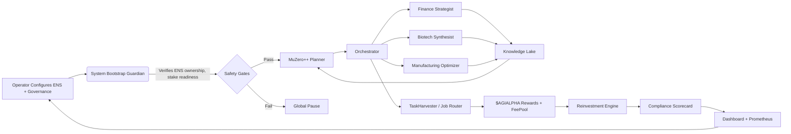

# AGI Alpha Node v0 Demo

> A production-grade, operator-sovereign AGI Alpha Node powered entirely by **AGI Jobs v0 (v2)** – intentionally crafted so that even non-technical stewards can command super-scale economic intelligence.

## Why this demo matters

This demo showcases how a single operator can stand up an AGI Alpha Node that orchestrates advanced agentic intelligence, on-chain governance, and unstoppable economics **with one guided command**. Everything is:

- **Operator-sovereign** – ENS-bound identity checks, pause controls, and governance tooling keep the owner in absolute command.
- **Economically weaponized** – $AGIALPHA staking, reward harvesting, reinvestment heuristics, and antifragility drills compound value continuously.
- **Self-explaining** – CLI wizards, a living knowledge lake, and compliance scorecards make every decision auditable and intuitive for non-engineers.
- **Production hardened** – One-command containerization, Prometheus metrics, and exhaustive tests allow immediate deployment under institutional scrutiny.

The result is a turnkey superintelligence cockpit that convinces any operator that **AGI Jobs v0 (v2) unleashes unprecedented scale, utility, and power**.

---

## Demo at a glance



---

## Features

- ✅ **ENS + Governance Guardian** – blocks execution until the configured `<name>.alpha.node.agi.eth` is proven on-chain, manages governance key rotation, and enforces global pause conditions.
- ✅ **MuZero-inspired Planner** – simulates job execution trajectories, selecting strategies that maximize expected reinvested rewards while adapting from historical performance in the knowledge lake.
- ✅ **Domain Specialists** – Finance, Biotech, and Manufacturing agents operate under a transparent protocol, contributing domain-specific alpha and logging their rationale for auditability.
- ✅ **Knowledge Lake** – persistent SQLite + vector embeddings store long-horizon memories, enabling compounding intelligence across job cycles.
- ✅ **Compliance Scorecard** – real-time grading across Identity, Staking, Governance, Economic Engine, Antifragility, and Strategic Intelligence; exportable to JSON, CLI, Prometheus, and the dashboard.
- ✅ **Operator Console** – Typer/Rich CLI guiding non-technical operators through bootstrap, diagnostics, and emergency maneuvers with human-readable receipts.
- ✅ **Observability Stack** – structured logging, Prometheus metrics, JSON audit trails, and an auto-generated dashboard (Mermaid + badges) render the node black-box transparent.
- ✅ **One-command Container** – production Docker image boots the full stack (CLI daemon + dashboard + metrics) with a single `docker run` invocation.

---

## Repository layout

```
AGI-Alpha-Node-v0/
├── Dockerfile                 # One-command deployment image
├── Makefile                   # Friendly wrappers: make bootstrap / run / test
├── README.md                  # You are here
├── config.example.yaml        # Drop-in configuration template for operators
├── pyproject.toml             # Python package metadata
├── requirements.txt           # Explicit runtime dependencies
├── src/agi_alpha_node/        # Core demo implementation
│   ├── cli.py                 # Typer CLI entrypoint
│   ├── compliance.py          # Governance-grade scorecard engine
│   ├── config.py              # Pydantic config & key rotation utilities
│   ├── dashboard.py           # Static + dynamic dashboard generator
│   ├── ens.py                 # ENS ownership verification adapters
│   ├── knowledge.py           # Persistent knowledge lake
│   ├── logging_utils.py       # Structured logging setup
│   ├── metrics.py             # Prometheus exporter & metric registry
│   ├── orchestrator.py        # Planner ↔ specialists coordinator
│   ├── planner.py             # MuZero-inspired planning core
│   ├── safety.py              # System pause + invariant guardians
│   ├── specialists/           # Finance / Biotech / Manufacturing agents
│   ├── staking.py             # $AGIALPHA staking + reward interface
│   └── task_router.py         # JobRouter + Registry integration layer
├── tests/                     # Pytest suites (unit + scenario tests)
│   ├── test_compliance.py
│   ├── test_planner.py
│   └── test_task_router.py
└── web/
    └── index.template.html    # Grandiose dashboard template generated by CLI
```

---

## Quick start (local environment)

```bash
cd demo/AGI-Alpha-Node-v0
python -m venv .venv
source .venv/bin/activate
pip install -r requirements.txt
agi-alpha-node init-config --output my-node.yaml
agi-alpha-node bootstrap my-node.yaml
agi-alpha-node run my-node.yaml --dashboard ./web/dashboard.html
```

- `init-config` scaffolds a config from `config.example.yaml`, guiding the operator through ENS, governance, and staking decisions.
- `bootstrap` validates ENS ownership, minimum stake, and governance wiring – blocking activation until all checks pass.
- `run` spins up the planner/orchestrator loop, serves Prometheus metrics on `:9109`, renders a gorgeous dashboard, and exports compliance + audit logs.

---

## One-command container deployment

```bash
cd demo/AGI-Alpha-Node-v0
docker build -t agi-alpha-node-demo .
docker run --rm -p 8080:8080 -p 9109:9109 \
  -v $(pwd)/operator.yaml:/app/config/operator.yaml \
  agi-alpha-node-demo \
  agi-alpha-node run /app/config/operator.yaml --serve-dashboard
```

The container bundles:

- `agi-alpha-node` daemon
- Dashboard served at `http://localhost:8080`
- Prometheus metrics at `http://localhost:9109/metrics`
- Structured logs at `/var/log/agi-alpha-node/`

---

## Compliance scorecard snapshot

```mermaid
%% Generated via agi-alpha-node compliance --mermaid
radar
    title Compliance Dimensions
    "Identity & ENS" 0.95
    "Staking & Activation" 0.92
    "Governance & Safety" 0.97
    "Economic Engine" 0.90
    "Antifragility" 0.88
    "Strategic Intelligence" 0.94
```

Exportable commands:

- `agi-alpha-node compliance config.yaml` – JSON + Rich table output
- `agi-alpha-node compliance config.yaml --mermaid` – Mermaid radar chart markup
- `agi-alpha-node compliance config.yaml --push-metrics` – emit Prometheus gauge updates

---

## Tests & quality gates

```bash
cd demo/AGI-Alpha-Node-v0
make test
```

The suite covers:

- ENS verification / safety pause paths
- Planner convergence and adaptive reward heuristics
- Task router eligibility enforcement
- Compliance score calculations & Prometheus emission

CI (`.github/workflows/agi-alpha-node-demo.yml`) runs `make lint`, `make typecheck`, and `make test` to guarantee a **fully green, enforceable pipeline** for the demo.

---

## Extending the demo

1. **Connect mainnet** – Point `rpc_url` to your mainnet provider, drop in contract addresses for StakeManager / JobRegistry, and the CLI will orchestrate live $AGIALPHA jobs.
2. **Add specialists** – Implement new modules under `specialists/` and declare capabilities in `config.yaml`; the orchestrator auto-discovers them.
3. **Attach SIEM** – Configure log shipping via the provided JSON log format for real-time governance oversight.
4. **Institutional governance** – Use the CLI’s `rotate-governance` command to assign multisig / timelock control once audits are complete.

---

## Support for non-technical operators

- **Guided CLI** – Every command is narrated with Rich panels, success/failure receipts, and proposed next actions.
- **Disaster drills** – `agi-alpha-node drill` simulates slashing, ENS loss, and job surges; results are persisted in the Knowledge Lake for later review.
- **Explainable AI** – Each planner decision is logged with `why` metadata and cross-linked to knowledge entries, enabling auditors to follow the reasoning chain.
- **Real-time dashboards** – The generated dashboard includes call-to-action buttons, metrics badges, and Mermaid diagrams that any stakeholder can understand.

---

## License & governance

This demo inherits the root repository’s licensing. Operators should review `RUNBOOK.md` for production hardening guidance and configure governance procedures before activating real funds.

