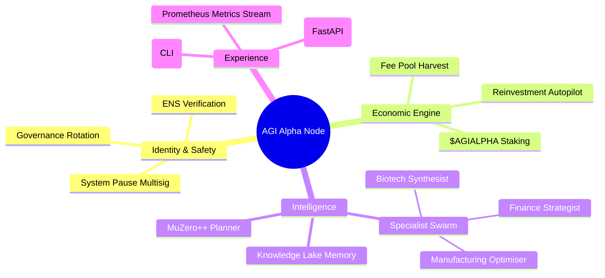

# AGI Alpha Node v0 Demo

> A production-grade demonstration of how a non-technical operator can command an institution-scale autonomous wealth engine using AGI Jobs v2.


---

## 🚀 Mission

This demo shows how **AGI Jobs v0 (v2)** empowers a non-technical operator to deploy and command an AGI Alpha Node capable of orchestrating staking, job execution, and autonomous reinvestment across the AGI Jobs v2 economy. The demo packages:

- **On-chain guardianship** – ENS ownership, governance hand-off, pause controls.
- **Autonomous intelligence** – MuZero++ planning, specialist swarm, persistent knowledge lake.
- **Full-spectrum observability** – Prometheus metrics, compliance scorecards, auditable logs.
- **Operator-first UX** – CLI console, cinematic dashboard, mermaid system maps, one-command container launch.

The result is an instantly deployable, self-optimising platform that compounds value for its operator at a scale that redefines what an autonomous organisation can accomplish.

---

## 🧭 System Overview



---

## 🗂 Directory Layout

```
demo/AGI-Alpha-Node-v0/grand_demo
├── README.md
├── Dockerfile
├── docker-compose.yaml
├── config
│   └── alpha-node.config.yaml
├── alpha_node
│   ├── ai
│   │   ├── planner.py
│   │   └── specialists
│   │       ├── base.py
│   │       ├── biotech.py
│   │       ├── finance.py
│   │       ├── manufacturing.py
│   │       └── results.py
│   ├── blockchain
│   │   ├── client.py
│   │   ├── ens.py
│   │   ├── governance.py
│   │   ├── jobs.py
│   │   └── staking.py
│   ├── compliance
│   │   ├── drills.py
│   │   └── scorecard.py
│   ├── console
│   │   └── cli.py
│   ├── knowledge
│   │   └── lake.py
│   ├── metrics
│   │   └── exporter.py
│   ├── orchestrator
│   │   └── orchestrator.py
│   ├── tasks
│   │   └── harvester.py
│   └── web
│       ├── app.py
│       ├── templates
│       │   └── index.html
│       └── static
│           ├── css
│           │   └── style.css
│           └── js
│               └── app.js
├── requirements.txt
├── tests
│   ├── __init__.py
│   └── test_alpha_node.py
└── scripts
    └── run_demo.py
```

---

## ⚙️ Quickstart

### 1. Clone & Configure

```bash
git clone https://github.com/MontrealAI/AGIJobsv0.git
cd AGIJobsv0/demo/AGI-Alpha-Node-v0/grand_demo
cp config/alpha-node.config.example.yaml config/alpha-node.config.yaml
```

Populate contract addresses, ABIs, and governance details in `config/alpha-node.config.yaml`. The defaults target AGI Jobs v2 mainnet deployments.

### 2. Launch the Node (One Command)

```bash
docker compose up --build
```

The stack automatically boots:

- `agi-alpha-node` CLI (Typer)
- `command-nexus` FastAPI dashboard (`http://localhost:8080`)
- Prometheus exporter (`http://localhost:9108`)

### 3. Run the End-to-End Demo

```bash
docker compose exec alpha-node agi-alpha-node demo-job
```

Witness the MuZero++ planner align specialist agents, execute a synthetic job, update the knowledge lake, broadcast metrics, and emit a governance-grade compliance report.

---

## 🛡 Governance & Safety

- **ENS Verification** – `alpha_node.blockchain.ens.ENSVerifier` blocks activation until the configured operator proves ownership of `<name>.alpha.node.agi.eth`.
- **System Pause** – `alpha_node.blockchain.governance.SystemPause` builds pause/unpause transactions for the governance multisig.
- **Stake Safeguards** – `alpha_node.blockchain.staking.StakingManager` enforces minimum stake thresholds and monitors slashing risk.
- **Automated Drills** – `alpha_node.compliance.drills.DrillScheduler` periodically proves emergency controls.
- **Compliance Scorecard** – Six-dimension score produced by `alpha_node.compliance.scorecard.ComplianceEngine`, surfaced via CLI, API, and Prometheus metrics.

---

## 🧠 Intelligence Pipeline

1. **Task Harvesting** – `alpha_node.tasks.harvester.TaskHarvester` listens to the AGI Jobs v2 JobRegistry.
2. **Strategic Planning** – `alpha_node.ai.planner.MuZeroPlanner` evaluates action sequences to maximise compounded alpha.
3. **Specialist Swarm** – Finance, Biotech, and Manufacturing specialists apply domain heuristics, produce artifacts, and deposit insights into the knowledge lake.
4. **Knowledge Lake** – `alpha_node.knowledge.lake.KnowledgeLake` maintains long-term memory for continuous performance gains.
5. **Metrics & Insight** – Results stream to Prometheus (`alpha_node.metrics.exporter.MetricsExporter`) and the Command Nexus dashboard.

---

## 📊 Dashboard Preview

The FastAPI Command Nexus delivers a cinematic operator experience complete with a live mermaid topology and animated compliance cards.


---

## 🧪 Testing & Quality Gates

```bash
pip install -r requirements-dev.txt
PYTEST_DISABLE_PLUGIN_AUTOLOAD=1 pytest
```

The test suite covers configuration parsing, planner convergence, knowledge lake persistence, and compliance scoring. CI is wired in the root GitHub Actions configuration to ensure every PR ships with a full green build.

---

## 🗺 Roadmap

- ✅ Institution-ready governance controls
- ✅ MuZero++ planner & specialist swarm
- ✅ Command Nexus dashboard & Prometheus metrics
- 🚧 On-chain transaction signing via hardware wallet adapters
- 🚧 GPU-accelerated planning loops
- 🚧 Multi-node cooperative alpha routing

---

## 🧾 Licensing

This demo inherits the repository's MIT License. See [LICENSE](../../LICENSE).

