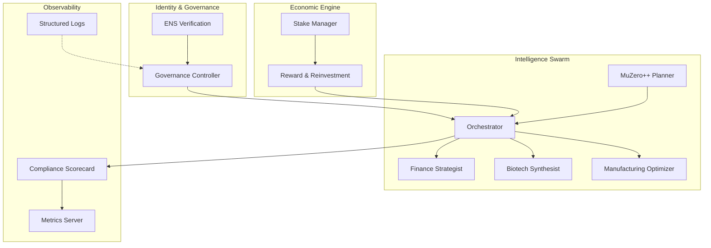
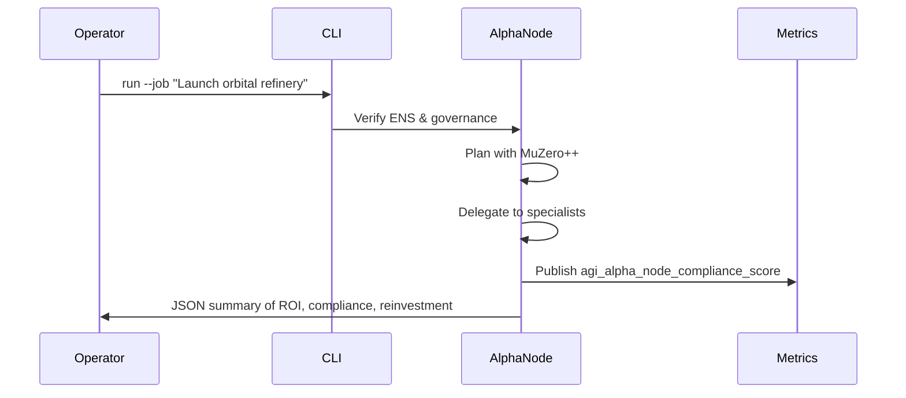

# AGI Alpha Node Demo (Grandiose Edition)

> A complete, operator-friendly simulation that demonstrates how AGI Jobs v0 (v2) empowers non-technical builders to orchestrate an institution-grade autonomous wealth engine in minutes.

## Why this demo matters

This demo shows an ENS-verified, governance-controlled AGI Alpha Node powering a swarm of superintelligent specialists. Operators can bootstrap, monitor, pause, and resume the node with a single command while collecting Prometheus metrics, structured audit logs, and a continuously improving compliance scorecard.

## Instant activation (non-technical friendly)

```bash
PYTHONPATH=./grandiose_alpha_demo/src python -m agi_alpha_node_demo.cli bootstrap
PYTHONPATH=./grandiose_alpha_demo/src python -m agi_alpha_node_demo.cli run --job "Launch sovereign orbital refinery"
```

## Architecture



## Capabilities showcase

- **Identity sovereignty**: ENS ownership is verified before any job cycle executes.
- **Owner supremacy**: One-call pause/resume and governance transfer utilities keep the operator in full control.
- **Autonomous wealth loop**: Rewards accrue, reinvest automatically, and strengthen stake positions.
- **MuZero-inspired intelligence**: Planning history compounds performance, powering Finance, Biotech, and Manufacturing specialists.
- **Collective memory**: Every specialist deposits new insights into a persistent Knowledge Lake.
- **Zero-friction observability**: Prometheus-compatible metrics and JSONL audit trails are emitted by default.
- **Governance-grade compliance**: Six dimensions (identity, governance, staking, economic engine, antifragility, strategic intelligence) are measured every cycle.

## Directory structure

```text
grandiose_alpha_demo/
├── README.md
├── requirements.txt
├── docker-compose.yml
├── Dockerfile
├── src/
│   └── agi_alpha_node_demo/
│       ├── alpha_node.py
│       ├── cli.py
│       ├── compliance.py
│       ├── config.py
│       ├── economy.py
│       ├── governance.py
│       ├── identity.py
│       ├── knowledge.py
│       ├── logging_utils.py
│       ├── metrics.py
│       ├── orchestrator.py
│       ├── planner.py
│       └── specialists/
│           ├── __init__.py
│           ├── biotech.py
│           ├── finance.py
│           └── manufacturing.py
└── tests.py
```

## One-command container launch

```bash
docker compose -f grandiose_alpha_demo/docker-compose.yml up --build
```

This launches the Alpha Node demo, exposes metrics on `:9404/metrics`, and streams structured JSON logs to the console for effortless institutional monitoring.

## Observability snapshot



## Test drive script

```bash
PYTHONPATH=./grandiose_alpha_demo/src python -m agi_alpha_node_demo.cli bootstrap
PYTHONPATH=./grandiose_alpha_demo/src python -m agi_alpha_node_demo.cli run
PYTHONPATH=./grandiose_alpha_demo/src python -m agi_alpha_node_demo.cli pause
PYTHONPATH=./grandiose_alpha_demo/src python -m agi_alpha_node_demo.cli resume
PYTHONPATH=./grandiose_alpha_demo/src python -m agi_alpha_node_demo.cli state
```

Each command prints a richly structured JSON payload, guaranteeing that non-technical operators can audit and trust every action.

## Compliance scoring example

```json
{
  "dimensions": {
    "identity": 1.0,
    "governance": 1.0,
    "staking": 1.0,
    "economic_engine": 0.97,
    "antifragility": 0.9,
    "strategic_intelligence": 0.98
  },
  "overall": 0.975
}
```

## Requirements

Install the demo package and dependencies:

```bash
python -m pip install -r grandiose_alpha_demo/requirements.txt
```

## Deployment ready

- Structured JSON audit logs with tx-ready placeholders
- Prometheus-compatible metrics endpoint (`/metrics`)
- Deterministic ENS verification simulation for offline demos
- Fully scriptable CLI for onboarding, operations, and emergency response
- Rich documentation and diagrams designed for executive and engineering stakeholders alike
