# 🎖️ AGI Jobs One‑Box 👁️✨

The One‑Box demo shows how a non-technical operator can wield the full AGI Jobs v0 (v2) platform from a single conversational interface. It packages the orchestrator, on-chain execution, and operator controls into an instantly runnable bundle so that anyone can post, simulate, and finalize AGI-powered jobs without touching Solidity, wallets, or scripting.

## Why this demo matters

* **One input, all power.** Users chat with the assistant in natural language. Behind the scenes the orchestrator plans, simulates, and executes production-grade job flows on Ethereum.
* **Production defaults.** The bundle is wired to the live AGI Jobs contracts, identity/escrow controls, and policy guardrails. It is ready for mainnet-level infrastructure out of the box.
* **Owner-first governance.** Every lever (fees, limits, pause switches, validator rules) stays under explicit owner control via the standard `owner:*` playbooks.
* **Instant evidence.** Jobs, IPFS CIDs, receipts, and explorer links stream back into the UI automatically, providing audit-grade visibility to stakeholders.

## High level flow

```mermaid
sequenceDiagram
    participant U as Non-technical user
    participant UI as One-Box web UI
    participant OR as Orchestrator (AI planner + relayer)
    participant IP as IPFS pinning service
    participant CH as Ethereum + AGI Jobs v2 contracts
    U->>UI: Describe desired outcome (plain text)
    UI->>OR: /plan request (LLM planner synthesises job intent)
    OR-->>UI: Plan & preview summary
    U->>UI: Confirm
    UI->>OR: /simulate then /execute plan
    OR->>IP: Pin job spec bundle
    OR->>CH: Escrow tokens + create job
    CH-->>OR: JobCreated event + tx hash
    OR-->>UI: Execution status and receipt payload
    UI-->>U: ✅ Live job ID, explorer link, pinned spec
```



## Quickstart (15 minutes, no code required)

1. **Install dependencies once**
   ```bash
   npm install
   ```
2. **Prepare configuration**
   ```bash
   cp demo/AGI-Jobs-One-Box/onebox.env.example demo/AGI-Jobs-One-Box/.env
   # edit .env with your RPC URL, relayer key, API token, and explorer base URL
   ```
3. **Start the orchestrator**
   ```bash
   ONEBOX_ENV_FILE=demo/AGI-Jobs-One-Box/.env npm run onebox:server
   ```
4. **Launch the One‑Box assistant UI**
   ```bash
   npm run dev --prefix apps/onebox
   ```
5. **Open http://localhost:3000** and chat with the assistant. Say e.g.:
   > “Create a 500 image labelling job. Reward 12 AGIALPHA, deadline 5 days.”

The assistant previews the full job intent, simulates fees, requests your confirmation, and then executes the transaction bundle using the relayer credentials you supplied.

### Production-grade docker option

```bash
cd demo/AGI-Jobs-One-Box
cp onebox.env.example .env
# fill in values then
docker compose up --build
```

The compose stack builds the orchestrator service and serves the static Next.js build via Nginx, ready for IPFS or edge deployment.

## Non-technical operator journey

1. **Greeted with context.** The hero panel explains that the assistant can design, simulate, and post jobs end-to-end.
2. **Guided prompts.** One-click “mission templates” help the user express intent (content moderation, AI fine-tuning, validation jobs, etc.).
3. **AI produces the execution plan.** The preview card summarises the reward, deliverables, deadline, safeguard policies, and validator requirements in plain language.
4. **Simulation clarity.** The assistant translates raw fee data into digestible callouts (escrowed reward, protocol fee %, burn %, estimated duration, guardrail warnings).
5. **Execution receipts.** Explorer links, IPFS CIDs, and job IDs auto-populate the Receipts panel so the operator can forward proof to stakeholders instantly.
6. **Owner confidence.** If the platform is paused or parameters need adjusting, the UI surfaces friendly diagnostics instead of stack traces, and the README links to the exact `owner:*` scripts required to remediate.

## Owner control and safety runbook

* **Pause / resume instantly.** Run `npm run owner:system-pause` or the generated multisig bundle to halt job creation, then resume once the incident is resolved.
* **Update any parameter.** Use `npm run owner:update-all` (with `--dry-run` first) to align contract state with `config/v2/*.json` definitions, or `npm run owner:parameters` to inspect current limits.
* **Rotate relayer keys.** Change `ONEBOX_RELAYER_PRIVATE_KEY` in the `.env`, restart the orchestrator, and (optionally) use `owner:rotate` to push on-chain role updates.
* **Escrow health.** The Receipts panel shows remaining balance and warnings if `ESCROW_BALANCE_LOW` is triggered; top up via `npm run owner:mission-control` or a direct AGIALPHA transfer.

## Continuous verification

The AGI Jobs CI v2 workflow enforces:

* `npm run lint` – Solidity, TypeScript, scripts.
* `npm test` – Hardhat unit tests (plus Node test suites for One‑Box helpers).
* `npm run coverage` – Solidity coverage ≥ 90%.
* `npm run ci:verify-branch-protection` – ensures branch protection rules remain intact.

Run them locally before shipping updates:

```bash
npm run lint
npm test
npm run coverage
```

## Assets included in this demo package

* `docker-compose.yaml` – production stack with orchestrator + static UI.
* `onebox.env.example` – curated configuration baseline with inline documentation.
* `README.md` (this file) – operational handbook for non-technical and technical staff.

Together they transform AGI Jobs v0 (v2) into a “single pane of glass” that convinces any stakeholder the platform can orchestrate complex economic activity at unprecedented scale.
