# AGI Jobs Platform at Kardashev II Scale — Demonstration Command Deck

> **Thesis**: a non-technical steward can summon, audit, and steer a civilisation-scale AGI labour mesh – spanning Earth, Mars, and orbital habitats – using **AGI Jobs v0 (v2)** from a laptop. This demo ships the command surfaces, telemetry, calldata, and verification harness to make that real in minutes.

---

## 🧭 Ultra-deep readiness map

1. **Scope definition**  
   We implement a Kardashev-II control plane with:
   * Hierarchical federations (`earth`, `mars`, `orbital`) that each keep local autonomy while rolling up into an Interstellar Council.
   * Energy-aware job routing that obeys the Dyson Swarm thermostat (`energyProtocols.stellarLattice` + `thermostat`).
   * Fully-governable smart-contract payloads (Phase 8 manager controls) guaranteeing the owner can pause, upgrade, or redeploy any subsystem instantly.
   * Machine-verifiable outputs (Safe transaction batch, telemetry ledger, Mermaid schematics) suitable for regulated production use.

2. **Decomposition & challenge analysis**  
   We interrogated three perspectives:
   * **Operational** – can a single operator configure, pause, and relaunch thousands of domains? Answer: yes; the orchestrator synthesises deterministic calldata and Safe payloads per federation, so a single copy-paste activates or halts entire planetary clusters.
   * **Thermodynamic** – do rewards and task routing respect physical energy constraints? Answer: the manifest encodes per-region availability and a Dyson Swarm expansion curve; the CLI double-audits totals and warns if usage exceeds safety margins.
   * **Governance** – can owners override everything? Answer: we encode `setGlobalParameters`, `setGuardianCouncil`, `setSystemPause`, `forwardPauseCall`, and `setSelfImprovementPlan` transactions, all `onlyGovernance`, so contract owners retain absolute control.

3. **Triple verification**  
   * **Schema validation** – strict Zod schemas enforce numeric ranges, address formats, autonomy bounds, and manifest hashes.
   * **Cross-metric reconciliation** – telemetry recomputes energy, compute, and value metrics three ways (per-federation sum, council aggregate, Dyson programme projection) and fails if any disagree by >0.1%.
   * **Fail-safe audit** – CI runs `npm run demo:kardashev-ii:ci`, which replays the orchestrator in check mode, verifies README guardrails, and ensures Mermaid diagrams and Safe batches stay in sync with the manifest.

4. **Residual risk review**  
   Edge conditions like bridge outages, sentinel downtime, or negative autonomy deltas surface as explicit warnings in `output/kardashev-orchestration-report.md`; any fatal condition exits with non-zero status so CI and operators are forced to intervene. The README documents manual overrides and escalation paths.

5. **Final reflection loop**  
   After producing outputs, rerun `npm run demo:kardashev-ii:orchestrate -- --reflect` to regenerate metrics, recompute hashes, and print a checklist prompting human-in-the-loop confirmation. The CLI refuses to write artefacts if reflection steps fail.

---

## 🚀 Kardashev-II operator quickstart

1. **Install dependencies once**
   ```bash
   npm ci
   ```
2. **Synthesize calldata, telemetry, and diagrams**
   ```bash
   npm run demo:kardashev-ii:orchestrate
   ```
   You receive:
   * `output/kardashev-safe-transaction-batch.json` – Safe Transaction Builder payload with manager, guardian, pause, and domain actions.
   * `output/kardashev-orchestration-report.md` – non-technical runbook covering energy budgets, bridge latencies, and pause levers.
   * `output/kardashev-telemetry.json` – machine-readable metrics for dashboards, including triple-verified energy + compute deltas.
   * `output/kardashev-scenario-sweep.json` – deterministic stress simulations covering energy, bridges, sentinels, compute, and Dyson scheduling.
   * `output/kardashev-mermaid.mmd` – federated systems map (rendered automatically in the UI).
   * `output/kardashev-dyson.mmd` – Dyson Swarm expansion Gantt chart for timeline rehearsal.
   * `output/kardashev-operator-briefing.md` – concise owner & guardian directive pack with verification status.
   * `output/kardashev-stability-ledger.json` – consensus ledger uniting deterministic, redundant, and thermodynamic checks.
   * Console output summarising dominance scores, delta checks, and incident alerts.
3. **Launch the holographic control surface**
   ```bash
   npx serve demo/AGI-Jobs-Platform-at-Kardashev-II-Scale
   ```
   Visit `http://localhost:3000` to interact with:
   * **Federated Command Deck** – flip between Earth/Mars/Orbital, inspect autonomy levers, and trigger pause/resume.
   * **Dyson Swarm Progression** – animated milestone timeline bound to the manifest, showing captured GW vs target with the Gantt chart output.
   * **Bridge Sentinel Monitor** – live badge of interplanetary bridge health sourced from `kardashev-telemetry.json`.
   * **Owner directive console** – mission powers, escalation hotlines, and drill cadence lifted from the manifest.
   * **Federation readiness grid** – per-federation energy, compute, domain, and sentinel posture snapshots for non-technical audits.
4. **Enforce Kardashev-II readiness in CI**
   ```bash
   npm run demo:kardashev-ii:ci
   ```
   This revalidates manifests, recalculates telemetry, ensures README guardrails remain intact, and fails if artefacts drift.

---

## 🧱 Architecture overview

```mermaid
flowchart TD
  IC[Interstellar Council
  Phase8 Manager
  (Owner-only control)] -->|setGlobalParameters|
  GF{Federation}:::federation
  GF --> E[Earth Dominion Grid]
  GF --> M[Mars Terraforming Mesh]
  GF --> O[Orbital Research Halo]
  E -->|registerDomain|
  E_FIN[Earth Finance]
  E -->|registerDomain|
  E_INF[Orbital Infrastructure]
  M --> M_TERRA[Mars Terraforming]
  O --> O_DEF[Orbital Defense]
  O --> O_RES[Interstellar Research]
  IC -->|setGuardianCouncil| GC[Guardian Council]
  IC -->|setSystemPause| SP[System Pause]
  SP -->|forwardPauseCall| {Pause/Resume}
  classDef federation fill:#141a3d,stroke:#4c5fff,color:#f8f9ff;
  classDef default fill:#0f172a,stroke:#475569,color:#f8fafc;
```


---

## 🪪 Identity lattice & trust fabric

* **Tri-federation DID mesh** – `identityProtocols.federations` codifies Earth, Mars, and Orbital registries with on-chain anchors, DID registries, fallback ENS registrars, and attestation methods. The CLI refuses to emit artefacts if any federation lacks quorum anchors, stale rotations, or coverage below the 92% floor.
* **Revocation thermodynamics** – Attestation and revocation flow are double-accounted. The orchestrator computes revocation parts-per-million, compares against the 120ppm tolerance, and emits ledger evidence plus dashboard badges if the forged-credential surge scenario breaches thresholds.
* **Latency covenant** – Maximum attestation latency is reconciled against the 240s revocation window. Dashboards surface the live window (`identity-latency`) so guardians can confirm the trust lattice remains within emergency revocation bounds before greenlighting Safe payloads.

```mermaid
flowchart LR
  Root[(Root Authority\n0x4C9f…)] --> EarthID{Earth Identity Mesh}
  Root --> MarsID{Mars Identity Council}
  Root --> OrbitalID{Orbital Identity Halo}
  EarthID -->|anchors 5| EarthAnchors[[Anchors ∑5]]
  MarsID -->|anchors 5| MarsAnchors[[Anchors ∑5]]
  OrbitalID -->|anchors 5| OrbAnchors[[Anchors ∑5]]
  EarthID -->|revocations 820/24h| EarthLedger[(Δ Agents)]
  MarsID -->|revocations 340/24h| MarsLedger[(Δ Agents)]
  OrbitalID -->|revocations 410/24h| OrbLedger[(Δ Agents)]
  classDef council fill:#0b1120,stroke:#6366f1,color:#e2e8f0;
  classDef registry fill:#111c4e,stroke:#818cf8,color:#f8fafc;
  classDef ledger fill:#0f172a,stroke:#38bdf8,color:#e2f5ff;
```



---

## 🛰️ Compute fabric hierarchy

* **Three-plane orchestration** – `computeFabrics.orchestrationPlanes` models Solara Earth Core, Ares Horizon Fabric, and Helios Orbital Halo. Each plane exposes scheduler addresses, orchestrator Safes, capacity, latency, energy draw, and failover partners so non-technical operators can reason about compute placement from the manifest alone.
* **Quorum-aware failover** – The CLI recomputes total vs failover capacity, compares to the 52% quorum policy, and encodes ledger evidence (`compute-fabric-failover`). Scenario sweeps simulate the loss of the largest plane and prove the remaining fabric sustains quorum.
* **Energy-balanced dispatch** – Telemetry reconciles plane energy usage with the Dyson thermostat. The dashboard summarises total exaFLOPs, availability, and partner pairings, letting owners retune the Dyson thermostat or reassign capital streams before pushing the Safe batch.


---

## 🔌 Energy & compute governance

* **Stellar lattice thermostat** – The CLI enforces `energyProtocols.stellarLattice.safetyMarginPct`, refusing to route jobs if predicted Dyson Swarm draw would exceed the margin. It prints redline warnings whenever utilisation > 87.5% of captured GW.
* **Kelvin guardrails** – Reward temperature (Kelvin) must stay between 0.35 and 0.92; the orchestrator double checks the manifest and telemetry and aborts if the Thermostat would fall outside the band.
* **Regional energy arbitration** – Earth, Mars, and Orbital clusters provide available GW, storage, and latency; the CLI sorts workloads accordingly and reports energy debt so operators can top-up storage before dispatching long-running swarms.
* **Compute rollup** – All compute capacity is measured in exaFLOPs and agent counts. A reconciliation matrix confirms that per-region totals equal the Interstellar Council view and Dyson programme requirements.

## 🎛️ Mission directives & verification dashboards

* **Operator briefing pack** – `output/kardashev-operator-briefing.md` condenses owner powers, escalation pathways, drill cadence, and verification status so non-technical stewards can sign off in under two minutes.
* **Mission directives mirroring** – The UI reflects `missionDirectives.ownerPowers` and hotlines verbatim, ensuring Safe transaction order, phone numbers, and bridge failover text are always in sync with the manifest.
* **Triple-verification badges** – Dashboard metrics highlight energy model agreement, compute deviation vs tolerance, and bridge latency tolerance; each badge flips red if the orchestrator’s cross-checks fail.
* **Federation readiness grid** – Per-federation cards summarise chain IDs, governance Safes, energy posture, compute load, dominant domains, and sentinel coverage so governors can prioritise interventions at a glance.

---

## 🔭 Scenario stress sweep

* **Deterministic five-pack** – `npm run demo:kardashev-ii:orchestrate` simulates a 20% energy surge, doubled bridge latency, sentinel downtime, 15% compute drawdown, and a 30-day Dyson slip. Outputs are codified in `output/kardashev-scenario-sweep.json` and surfaced in telemetry.
* **Actionable scoring** – Each scenario emits a confidence percentage, coloured status, and recommended Safe actions. The stability ledger ingests the average confidence to extend the unstoppable consensus calculation.
* **Dashboard rehearsal** – The static UI renders the sweep with metric-by-metric evidence so non-technical owners can rehearse interventions (pause, bridge isolation, capital reallocation) without parsing raw JSON.
* **Reflection enforcement** – Reflection mode now fails if any scenario turns critical, preventing deployment until governors resolve the highlighted mitigation plan.

---

## 🛡️ Governance and safety levers

* **Absolute owner control** – Every mutating action uses owner-gated Phase 8 manager calls. The Safe batch positions `setGlobalParameters`, `setGuardianCouncil`, `setSystemPause`, `registerDomain`, `registerSentinel`, `registerCapitalStream`, `setSelfImprovementPlan`, and dual `forwardPauseCall` payloads (pause/unpause) at the top of the queue.
* **Guardian coverage** – Sentinels guarantee coverage seconds ≥ guardian review window; the CLI recalculates coverage deltas and warns if any fall below threshold.
* **Bridge sentries** – Interplanetary bridge latency/bandwidth metrics are embedded into telemetry and displayed in the UI. Paired sentinel actions ensure that, if latency rises above thresholds, the pause bundle can isolate the affected federation instantly.
* **Self-improvement charter** – `selfImprovement.planHash` and `planURI` are hashed and referenced in the Safe batch. Operators get a runbook section explaining how to log future executions (`recordSelfImprovementExecution`).

---

## 📦 Artefacts in this directory

| Path | Purpose |
| --- | --- |
| `config/kardashev-ii.manifest.json` | Canonical manifest describing federations, energy, compute, sentinels, capital streams, bridges, and Dyson Phases. |
| `scripts/run-kardashev-demo.ts` | Orchestrator CLI that validates the manifest, computes dominance/energy metrics, and emits Safe payloads + diagrams. |
| `scripts/ci-validate.ts` | CI harness ensuring outputs, README sections, and manifest invariants stay in sync. |
| `output/kardashev-telemetry.json` | Telemetry ledger driving the dashboard, verification badges, and CI drift checks. |
| `output/kardashev-scenario-sweep.json` | Stress-test outcomes (energy, bridge, sentinel, compute, Dyson slip) with confidence + mitigations. |
| `output/kardashev-orchestration-report.md` | Detailed runbook for non-technical operators (energy, bridges, checklist). |
| `output/kardashev-dyson.mmd` | Dyson Swarm Gantt timeline rendered in the UI for programme rehearsals. |
| `output/kardashev-operator-briefing.md` | Mission directives pack consolidating owner powers, escalation, and verification state. |
| `output/kardashev-stability-ledger.json` | Composite consensus ledger blending deterministic, redundant, and thermodynamic verifications. |
| `output/kardashev-safe-transaction-batch.json` | Safe payload bundling global parameters, sentinel bindings, capital streams, and pause toggles. |
| `index.html` | Zero-build dashboard that renders telemetry, Mermaid diagrams, and operator controls in any static server. |
| `ui/` | Assets powering the static dashboard (styles, JavaScript modules). |

---

## 🧬 Stability ledger & unstoppable consensus

* **Composite quorum** – `kardashev-stability-ledger.json` scores governance, energy, compute, bridge, and pause levers with deterministic weights. The dashboard promotes the score, colour-coding it green only when ≥95% of weighted checks pass.
* **Redundant verification vectors** – The ledger records independent confidence methods: boolean consensus, redundant telemetry agreement, and residual Dyson thermostat buffer. Operators can inspect divergences instantly.
* **Alert surfacing** – Any failing check propagates into an `alerts` array consumed by the UI and CI. No Safe batch is marked deployable if a single high-severity invariant breaks.
* **Owner lever audit** – Manager, guardian council, system pause, and pause/resume calldata inclusion are mirrored in the ledger so non-technical governors can assert absolute control before execution.

---

## 🧪 Verification rituals

1. **Local** – run `npm run demo:kardashev-ii:orchestrate` and confirm no warnings. Inspect `output/kardashev-telemetry.json` and ensure `energy.tripleCheck === true`, `verification.energyModels.withinMargin === true`, `governance.ownerOverridesReady === true`, and every entry in `scenarioSweep` reports `status !== "critical"`.
2. **CI** – `npm run demo:kardashev-ii:ci` executes the orchestrator in check mode, validates README headings, ensures Mermaid code fences exist, and fails on drift.
3. **Runtime** – Serve the UI and click “Trigger Pause Simulation” to confirm pause/unpause calldata toggles update the status badge, review the Dyson timeline, and verify each owner directive matches `kardashev-operator-briefing.md`.
4. **Manual** – Operators copy/paste the Safe batch into a production Safe, verify the prefilled manager/system pause addresses, and stage the transaction.
5. **Guardian sign-off** – Circulate `output/kardashev-operator-briefing.md` to guardians; all verification badges must remain green before signatures are collected.

---

## 🧠 Reflective checklist for owners

Run `npm run demo:kardashev-ii:orchestrate -- --reflect` to receive:

- ✅ Recomputed manifest hash vs `interstellarCouncil.manifestoHash`.
- ✅ Confirmation that guardian coverage ≥ guardian review window.
- ✅ Energy debt matrix (Earth, Mars, Orbital) all ≤ 0.
- ✅ Bridge latency vs Dyson failsafe latency.
- ✅ Scenario stress sweep free of critical statuses (confidence badges ≥ 95%).
- ✅ Pause bundle parity (pause/unpause both targeting configured SystemPause).

Only sign the Safe transaction after all checks print green.

---

## 📡 Interoperability hooks

* **Bridges** – Telemetry includes `bridges.latencySeconds` + `bridges.bandwidthGbps`. The UI surfaces warnings if delay threatens cadence.
* **Data plane** – `setGlobalParameters` configures the knowledge graph address while the manifest tracks `knowledgeGraphURI` for human-readable provenance, so operators can redirect identity registries or swap subgraphs instantly.
* **Energy oracle** – `energyProtocols.stellarLattice` parameters match the RewardEngineMB thermostat. Set new energy budgets via the Safe batch to immediately retune incentives.

---

## ♻️ Maintenance playbook

1. Update `config/kardashev-ii.manifest.json` with new domains/sentinels.
2. Run `npm run demo:kardashev-ii:orchestrate` to regenerate artefacts.
3. Commit the regenerated files (CI will fail if outputs don’t match the manifest).
4. Notify guardians with the refreshed `output/kardashev-orchestration-report.md`.
5. Run `npm run owner:mission-control` (existing v2 tooling) if you want to diff live contract state vs generated calldata.

---

**Result**: AGI Jobs v0 (v2) becomes the civilisation-scale operating system a Kardashev-II steward needs – with clarity, safety, and absolute control packaged for non-technical operators.
