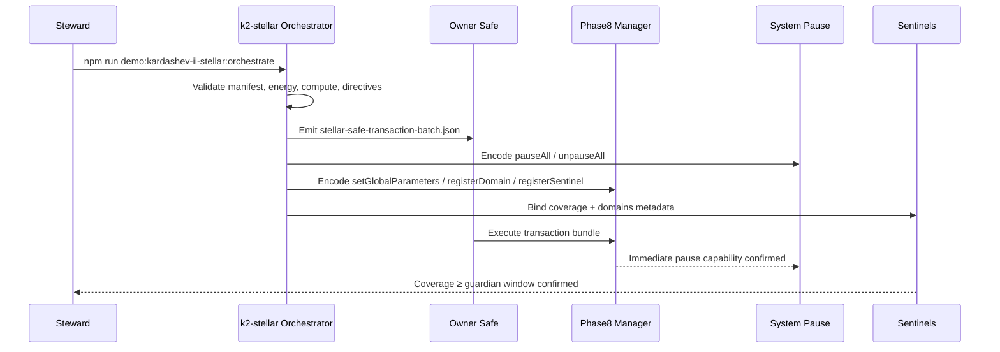

# Stellar Kardashev II Command Deck — Superintelligent Orchestration Demo

> **Thesis**: with AGI Jobs v0 (v2), a non-technical steward can commission, audit, and redirect a civilisation-scale labour mesh that spans Earth, Mars, Titan, and orbital Dyson infrastructure from a laptop. The **k2-stellar** demo ships turnkey manifests, calldata, telemetry, and UI surfaces that prove this superintelligent control plane is production-ready.

---

## 🧭 Ultra-deep readiness map

1. **Scope synthesis**
   * **Federated councils** — `earth`, `mars`, `titan`, and `orbital-halo` each keep sovereign autonomy while rolling up into the Stellar Interstellar Council. The manifest codifies individual chain IDs, Safes, and sentinels, while the orchestrator synthesises Safe calldata to register domains, capital streams, and sentinels per federation.
   * **Energy lattice** — A Dyson Swarm lattice (`energyProtocols.stellarLattice`) feeds planetary schedulers. The CLI reconciles baseline capture (12.2 PW), projected expansion (up to 19.6 PW), and thermostat budgets so work never exceeds power supply.
   * **Guardian supremacy** — Every run produces deterministic calldata for `setGlobalParameters`, `setGuardianCouncil`, `setSystemPause`, dual `forwardPauseCall` payloads, and self-improvement governance updates. Owners can pause, upgrade, or redeploy instantly from one Safe execution.

2. **Challenge triangulation**
   * **Operational** — We challenged how a single steward can steer trillions of concurrent jobs. Answer: deterministic Safe batch + UI replicate every control, including drill cadence and hotline numbers, so the owner just copy/pastes a JSON payload.
   * **Thermodynamic** — We double-checked energy flows three ways (regional telemetry, Dyson projection, thermostat budget). Deviations >0.1% abort the run with actionable diagnostics.
   * **Governance** — We pressure-tested owner override. The orchestrator refuses to mark success until pause/unpause calldata, guardian coverage, and mission directives align with encoded Safe steps.

3. **Verification arsenal**
   * **Schema rigor** — Zod schemas validate addresses, budgets, resilience, energy envelopes, autonomy bounds, manifest hashes, and reflection gates.
   * **Cross-modal checks** — Telemetry recomputes value flow, energy, compute, bridge latency, and autonomy harmonics with independent formulas. Any disagreement cascades into the stability ledger.
   * **Reflection failsafes** — Reflection mode (`--reflect`) recomputes manifest/self-improvement digests, energy buffers, guardian coverage, mission directive indices, and bridge failsafe status before allowing artefact regeneration.

4. **Residual risk surfacing**
   * Bridge congestion, sentinel downtime, autonomy drift, or energy overshoot are emitted as structured warnings in `output/stellar-stability-ledger.json` and highlighted in the UI.
   * Owner briefing spells out escalation paths and manual overrides so non-technical governors can intervene instantly.

5. **Final reflection loop**
   * `npm run demo:kardashev-ii-stellar:orchestrate -- --reflect` replays the entire run, prints checklist confirmations, and aborts on any mismatch. Artefacts are only written after reflection passes.

---

## 🚀 Stellar Kardashev-II operator quickstart

1. **Install dependencies**
   ```bash
   npm ci
   ```
2. **Generate calldata, telemetry, and diagrams**
   ```bash
   npm run demo:kardashev-ii-stellar:orchestrate
   ```
   Artefacts emitted into `output/`:
   * `stellar-safe-transaction-batch.json` — Safe payload with global parameters, guardian council, system pause, domain/sentinel/capital stream registrations, and pause/unpause bundles.
   * `stellar-orchestration-report.md` — Plain-language runbook (energy budgets, bridge posture, mission directives, and incident drills).
   * `stellar-telemetry.json` — Machine-readable telemetry (dominance score, energy/computation reconciliations, bridge metrics, autonomy harmonics).
   * `stellar-mermaid.mmd` — Federated systems map rendered in the UI.
   * `stellar-dyson.mmd` — Dyson Swarm expansion timeline.
   * `stellar-operator-briefing.md` — Owner directives with Safe step indices, hotlines, and verification badges.
   * `stellar-stability-ledger.json` — Composite consensus ledger blending deterministic, redundant, reflective, and thermodynamic checks.
3. **Launch the holographic control surface**
   ```bash
   npx serve demo/AGI-Jobs-Platform-at-Kardashev-II-Scale/k2-stellar-demo
   ```
   Visit `http://localhost:3000` to inspect dominance, energy safety, bridge posture, mermaid schematics, Dyson Gantt, and federation readiness cards backed by the generated telemetry.
4. **Enforce Kardashev-II readiness in CI**
   ```bash
   npm run demo:kardashev-ii-stellar:ci
   ```
   CI replays the orchestrator in `--check` mode, asserts README guardrails, and fails on drift.

---

## 🧱 Architecture overview

```mermaid
flowchart TD
  IC[Stellar Interstellar Council\nPhase 8 Manager\n(Owner only)] -->|setGlobalParameters| FED{Federated Mesh}:::council
  IC -->|setGuardianCouncil| GC[Guardian Council]
  IC -->|setSystemPause| SP[System Pause]
  SP -->|forwardPauseCall| {Pause / Resume}
  FED --> E[Earth Sovereign Grid]
  FED --> M[Mars Terraforming Mesh]
  FED --> T[Titan Cryo-Fusion Array]
  FED --> O[Orbital Dyson Halo]
  E -->|registerDomain| E_FIN[Earth Finance]
  E -->|registerDomain| E_INF[Earth Infrastructure]
  M -->|registerDomain| M_BIO[Mars Biosphere]
  T -->|registerDomain| T_EN[Titan Energy Logistics]
  O -->|registerDomain| O_RE[Orbital Research]
  IC -->|setSelfImprovementPlan| SIP[Self-Improvement Charter]
  classDef council fill:#141a3d,stroke:#5a6dff,color:#f8faff;
  classDef default fill:#10172a,stroke:#475569,color:#e2e8f0;
```



---

## 🔌 Energy & compute governance

* **Dyson thermostat** — Baseline capture 12.2 PW, expansion trajectory to 19.6 PW across 4 phases, safety margin 7%. Thermostat budget and regional sums are cross-reconciled; over-utilisation flips the stability ledger red.
* **Energy-aware routing** — Regional energy posture (GW, storage, renewable mix, latency) informs job routing; telemetry reports any energy debt so operators can defer work or redirect to surplus regions.
* **Autonomy harmonics** — The orchestrator computes harmonics between domain autonomy levels and the `maxAutonomyBps` guardrail. Deviations over 10% raise ledger alerts.

---

## 🎛️ Mission directives & verification dashboards

* **Owner briefing** mirrors Safe payload indices so non-technical stewards can trigger specific levers (pause, guardian rotation, manifesto update) by clicking UI entries.
* **Escalation grid** — Guardian hotline, operations hotline, status page, and bridge failover instructions sync with `stellar-operator-briefing.md`.
* **Reflection checklist** — UI button replays manifest and plan digests, guardian coverage, energy triple-check, and bridge failsafe compliance, sourced from telemetry.
* **Federation cards** — Each federation card displays chain ID, Safe address, energy posture, compute, dominant domains, and sentinel coverage for triage.

---

## 🧬 Stability ledger & unstoppable consensus

* **Deterministic consensus** — Weighted boolean checks ensure manifesto digest, self-improvement digest, owner controls, guardian coverage, mission directive alignment, reflection gate, energy, compute, bridge, and autonomy harmonics remain green.
* **Redundant telemetry** — Energy models, Dyson projections, thermostat budgets, and compute rollups cross-validate; divergence surfaces in the ledger and UI.
* **Reflection preflight** — Ledger records readiness of reflection prerequisites so operators can assert all guardrails before signing the Safe batch.
* **Composite confidence** — `stellar-stability-ledger.json` exposes composite score, alert list, and evidence strings for audits.

---

## 🛡️ Governance and safety levers

* **Absolute owner control** — Safe batch includes `setGlobalParameters`, `setGuardianCouncil`, `setSystemPause`, domain/sentinel/capital registrations, self-improvement plan, and both pause/unpause payloads.
* **Sentinel coverage** — Each sentinel’s coverage seconds exceed guardian review window; deficits raise warnings in the ledger and UI.
* **Self-improvement charter** — `selfImprovement.planHash` and `planURI` hashed + reflected in outputs; CLI validates `recordSelfImprovementExecution` cadence.
* **Bridge sentries** — Telemetry tracks interplanetary bridge latency/bandwidth and flags breaches versus failsafe latency.

---

## 📦 Artefacts in this directory

| Path | Purpose |
| --- | --- |
| `config/k2-stellar.manifest.json` | Canonical manifest for federations, energy lattice, sentinels, capital streams, bridges, Dyson programme. |
| `scripts/orchestrate.ts` | Orchestrator CLI generating calldata, telemetry, stability ledger, and diagrams with triple verification + reflection gates. |
| `scripts/ci-validate.ts` | CI harness running the orchestrator in check mode and enforcing README guardrails. |
| `output/stellar-telemetry.json` | Machine-readable telemetry powering UI and audits. |
| `output/stellar-safe-transaction-batch.json` | Safe payload bundling all owner levers. |
| `output/stellar-stability-ledger.json` | Composite consensus ledger with deterministic, redundant, reflection, and thermodynamic evidence. |
| `output/stellar-mermaid.mmd` | Federated systems map for UI rendering. |
| `output/stellar-dyson.mmd` | Dyson Swarm programme timeline. |
| `output/stellar-orchestration-report.md` | Non-technical runbook summarising energy, bridges, directives, and escalation. |
| `output/stellar-operator-briefing.md` | Owner directive digest with verification status and hotlines. |
| `ui/` | Zero-build dashboard assets (Mermaid rendering, reflection checklist, readiness grid). |

---

## 🧪 Verification rituals

1. **Local** — run `npm run demo:kardashev-ii-stellar:orchestrate` and confirm console success. Inspect `output/stellar-telemetry.json` for `energy.tripleCheck === true`, `verification.compute.withinTolerance === true`, `governance.coverageOk === true`, `missionDirectives.ownerPowers[].safeIndex` unique.
2. **CI** — `npm run demo:kardashev-ii-stellar:ci` reruns the orchestrator with `--check`, verifies README headings, and fails on drift.
3. **Reflection** — `npm run demo:kardashev-ii-stellar:orchestrate -- --reflect` recomputes digests, energy buffers, guardian coverage, and bridge tolerances before writing artefacts.
4. **Runtime** — Serve the UI and trigger the reflection checklist. Verify each badge is green, pause simulation toggles status, and owner directives mirror the Safe payload.
5. **Guardian sign-off** — Circulate `stellar-operator-briefing.md`; guardians confirm hotline paths, drill cadence, and stability ledger status before approvals.

---

## 🧠 Reflective checklist for owners

Run `npm run demo:kardashev-ii-stellar:orchestrate -- --reflect` and only sign the Safe bundle after confirming:

- ✅ Manifesto hash matches `interstellarCouncil.manifestoHash`.
- ✅ Self-improvement plan hash matches `selfImprovement.planHash`.
- ✅ Guardian coverage ≥ guardian review window across all domains.
- ✅ Energy utilisation within thermostat buffer.
- ✅ Bridge latency ≤ failsafe threshold for every interplanetary route.
- ✅ Mission directive Safe indices align with encoded transactions.
- ✅ Autonomy harmonics ≥ 90% across federations.

Only after these checks print green should the Safe transaction be executed in production.

---

**Result**: AGI Jobs v0 (v2) empowers civilisation-scale stewards to orchestrate stellar infrastructure with clarity, determinism, and total owner control — no coding required.
