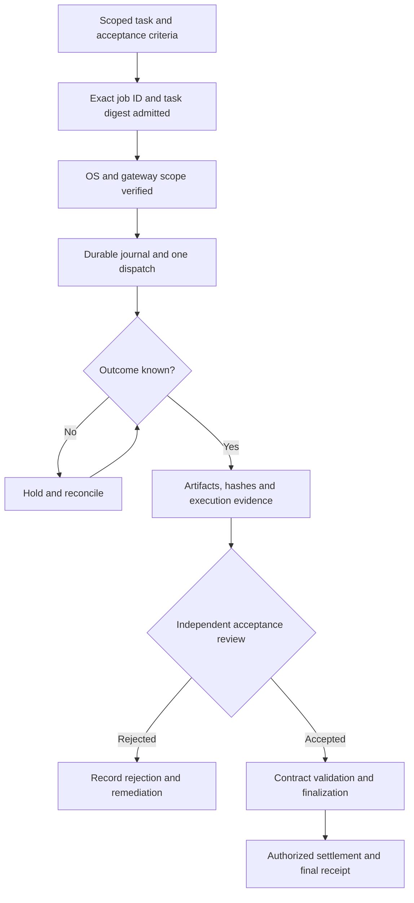

# Computer work: from a scoped task to a work fabric

This runbook connects the Kardashev-II coordination vision to work that can be specified, executed and independently checked today. It supplements every existing model, ledger and flowchart. The civilization-scale energy, economic and governance outputs remain deterministic simulations; this document does not commission physical infrastructure.

**Start here:** open any of the three command decks, choose **Computer work**, inspect a task's inputs and acceptance checks, and change the worker/reviewer assumptions. No wallet, provider account or secret is needed. All six source/portable dashboard routes contain the same locally executed planner and ten task examples.

## What runs, and what requires commissioning

| Experience | What actually happens | What a passing result establishes |
| --- | --- | --- |
| Kardashev-II command deck | Reads recorded model artifacts; calculates a separate annual capacity scenario in your browser | Consistent assumptions and review-constrained arithmetic, not demand or automation performance |
| Downloadable task draft | Exports the repository's computer-work task schema with synthetic inputs | A proposed scope; no approved job, provider admission or funding |
| Supplier Desk fixture | Chromium operates a local synthetic UI through the repository's real worker adapter and a fixture Responses gateway | Browser execution and evidence/reviewer behavior for this bounded fixture |
| Live OpenClaw worker | An operator configures a dedicated gateway, Codex harness, native service, OS permissions and exact task admission | Only measured task-specific behavior in that commissioned environment |
| ChatGPT Work operator workflow | An operator grants scoped desktop access and directs a bounded task in Work | A desktop result requiring exported evidence and separate review; not an automatic contract submission |

Computer interaction widens the set of potential work surfaces, but it does not establish that an agent can reliably perform every human task. Prefer structured APIs or MCP tools for repeatable operations; use GUI interaction when layout, application behavior or visual judgment requires it. Validate capability with representative tasks, failures and independent acceptance checks.

## Ten complete starter scopes

The selector supplies synthetic inputs, concrete deliverables and checks for supplier comparison, operations reconciliation, software maintenance, API/SDK tooling, AI evaluation, data dashboards, executable documentation, evidence-based research, accessibility review and numerical reproducibility. Each exercise is self-contained. Its outputs are text/Markdown/CSV/JSON artifacts supported by the current adapter; binary screenshots belong in a separate evidence archive.

1. Choose a scope and inspect **the exact task JSON**. Its worker profile is `k2_sandbox`, its data class is `synthetic`, and its only allowed origin is `http://127.0.0.1:4175`.
2. Download the JSON draft. Before any real use, replace the profile/origin with the operator-provided isolated workspace and explicitly licensed inputs. The dashboard server is read-only; it is not a provisioned worker desktop or the Supplier Desk fixture.
3. Define the job's acceptance criteria and required artifacts before economic commitment. Keep credentials outside the JSON. Changing any field changes the normalized admission digest.
4. Inspect the draft with the authoritative adapter parser, after building the orchestrator:

   ```bash
   npm run build:orchestrator
   npm run demo:computer-work -- inspect /absolute/path/k2-supplier-task-draft.json
   ```

   Expected: a normalized task and SHA-256 digest with `admitted: false`. Inspection does not dispatch a worker or approve the task. Keep the digest with the operator's exact approved job ID; the filename is not an identity or authorization boundary.
5. Review each submitted artifact against the stated criteria. A plausible narrative is insufficient: verify calculations, sources, code/test results and required artifact hashes. Record unexecuted tests as unexecuted.

## Run real browser actions on synthetic data

From a trusted repository checkout, use the pinned Node/npm versions (`nvm install`, `nvm use`) and install dependencies with `npm ci`. Then:

```bash
npm run build:orchestrator
npx playwright install chromium
npm run demo:computer-work
npm run demo:computer-work -- --inject-error
```

The first run starts a literal-loopback Supplier Desk and fixture Responses gateway, performs browser actions, compares three quotes, and emits evidence under `reports/computer-work/<run-id>/`. Expect Stellar at USD 490 × 40 = USD 19,600, delivered in seven days. Laurentian costs less but misses the seven-day deadline. Tax/shipping are excluded. No purchase is placed.

The fault-injection run intentionally recommends the late supplier. **Expected exit code: 1, with failed independent review.** Inspect both evidence bundles and their hashes. A rejection is the intended result; do not suppress it or relabel the fixture gateway as a live OpenClaw integration. The fixture's ephemeral port and profile are provisioned by its runner, separately from the downloaded K2 task drafts.

If Chromium is missing, run the installation command above. On a minimal Linux host, install Playwright's supported OS dependencies before running browser checks. If the runner reports a missing orchestrator build, repeat `npm run build:orchestrator`. Never supply live secrets to this fixture.

## Commission OpenClaw with the Codex Computer Use harness

Guidance checked on **2026-10-05** against [OpenClaw's Codex Computer Use documentation](https://docs.openclaw.ai/plugins/codex-computer-use) and [OpenResponses HTTP API documentation](https://docs.openclaw.ai/gateway/openresponses-http-api).

1. Use a dedicated gateway and isolated desktop trust boundary for the approved workload. Select a supported model through your actual deployment; record model/provider versions, OS/app versions, permission settings and policy configuration.
2. Enable `plugins.entries.codex.config.computerUse`. Set `strictReadiness: true` so turns require a live readiness probe. `autoInstall` may provision the verified native service; installation alone is not desktop readiness. Grant required OS permissions deliberately.
3. Run `/codex computer-use status` and a harmless scoped desktop probe. Capture actual results. A default readiness check with `strictReadiness: false` does not prove that the desktop can be controlled.
4. Explicitly enable `gateway.http.endpoints.responses.enabled` only on the dedicated gateway when using the repository's HTTP adapter. `/v1/responses` is disabled by default. Its shared-secret bearer token carries full gateway operator authority; session keys do not isolate privileges and declared scopes do not reduce that token's authority.
5. Follow the [repository computer-work integration guide](https://github.com/MontrealAI/AGIJobsv0/blob/main/docs/computer-work.md) for the absolute worker-profile file, token environment reference, durable deployment-scoped journal, exact approved job ID and normalized task digest. Use the `openclaw/<agentId>` route configured on your gateway. Keep an empty admission list until the operator has approved the exact task.
6. Enforce application, filesystem, network and data access through the OS/gateway boundary. The task's allowed-origin list and prompt are not an OS sandbox. Treat documents, web pages, screenshots and tool output as untrusted instructions.
7. Exercise normal completion, malformed/incomplete output, timeout after dispatch, worker restart, unknown outcome, rejected evidence and finalization failure. Preserve the journal and reconcile uncertain outcomes before a new dispatch. Record real results with no substituted signatures or inferred approvals.

The Codex harness's native Computer Use service is distinct from OpenClaw's other computer-control integrations. Do not assume that installing one provisions or authorizes the others. The existing adapter sends a bounded Responses request to an explicitly configured gateway; it does not bypass native permissions or turn a session name into a security boundary.

## Use ChatGPT Work as an operator workflow

Follow the current [ChatGPT Work Computer Use guide](https://learn.chatgpt.com/docs/computer-use). On a supported platform, install and enable the Computer Use plugin, review server/skill permissions, grant required OS permissions and scope the task to approved applications. macOS requires the relevant screen/accessibility permissions; Windows targets must remain visible and unlocked. Record the permissions and environment used for the actual task.

Give Work the approved input and acceptance criteria, supervise consequential actions, and export the resulting artifacts plus an evidence record for independent review. Work is not a remote `/v1/responses` endpoint invented by this demo. Do not represent an operator-directed desktop session as an automatically admitted contract job. Use the separately commissioned worker adapter if you need that integration.

## Evidence and settlement lifecycle



The dashboard does not advance this lifecycle or authenticate any actor. It explains gates implemented or required by the repository's worker/contract workflow. Unknown outcomes must not trigger blind redispatch or training as a known failure. Evidence-ready output still requires independent review, and learning/settlement waits for actual contract finalization. Keep authenticated approvals and provider evidence outside regenerated simulation outputs.

An evidence record should identify the job ID, normalized task digest, deployment/profile, policy and environment versions, timestamps, actual inputs, artifact names/media types/hashes, action trace, validation results, independent reviewer decision, outcome reconciliation and final chain receipt where applicable. Redact secrets and restrict sensitive screenshots. Archive a retention policy and a way to reproduce the acceptance checks.

## Capacity and the USD 40 trillion vision

**USD 40 trillion/year is a user-supplied planning assumption.** This demo provides no independent TAM validation and no claim that the platform earns that amount. The planner's gross USD job value is separate from `$AGIALPHA`, fictional civilization ledgers, provider revenue and profit. It performs no token conversion or treasury action.

The initial scenario assumes 100 workers, eight submissions/day, 250 operating days, 25 reviewers, six review hours/day, 20 minutes/submission, 90% acceptance and USD 100/accepted job. It produces 200,000 submissions, capacity to review 112,500, 101,250 accepted jobs, 87,500 unreviewed submissions and USD 10,125,000 of modeled gross job value. Reviewing every submission would require 45 reviewers at those assumptions.

All submissions consume review capacity before acceptance is applied. Zero reviewers or zero acceptance yields zero accepted value. Whole-number bounds prevent blank, nonfinite, fractional, negative or unsafe inputs from producing a result. Reset restores documented defaults. This annual steady-state model excludes failures, retries, demand, costs, fatigue, ramp-up and capital constraints; it cannot establish real throughput or market capture. Replace its assumptions with measured, versioned provider and reviewer data before operational planning.

## Verify changes without erasing the vision

```bash
node --test demo/AGI-Jobs-Platform-at-Kardashev-II-Scale/tests/computer-work.test.mjs
npm run demo:kardashev-ii:orchestrate
npm run demo:kardashev-ii-lattice:orchestrate
npm run demo:kardashev-ii-stellar:orchestrate
npm run demo:kardashev-ii:ci
npm run demo:kardashev-ii-lattice:ci
npm run demo:kardashev-ii-stellar:ci
node --test demo/AGI-Jobs-Platform-at-Kardashev-II-Scale/tests/runtime.test.cjs
node demo/AGI-Jobs-Platform-at-Kardashev-II-Scale/scripts/browser-qa.mjs
```

Regeneration copies the same planner into each source variant and portable output. Read-only CI compares these shared assets as well as the original model artifacts. Browser QA exercises all six routes, every task selection, exported JSON, invalid assumptions, reviewer bottlenecks, mobile layouts and WCAG checks. Preserve all original flowcharts; new guidance is additive.

A simulated drill is useful evidence of simulation behavior. It cannot replace authentic maintainer signing, independent security review, real provider commissioning or target-network deployment evidence. Record those as pending until actually completed.
