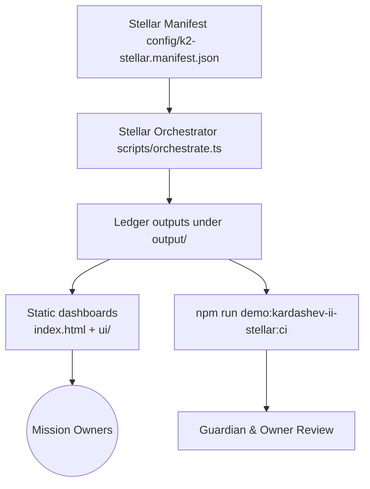
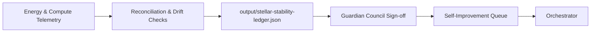

# AGI Jobs v0 (v2) — Demo → AGI Jobs Platform at Kardashev II Scale → K2 Stellar Demo

> **Execution scope:** deterministic offline simulation with synthetic, historically dated inputs. No provider calls,
> authenticated signatures, physical infrastructure control or payments are performed. Safe batches are unsigned
> proposals with placeholder targets and must not be submitted to a production wallet.

Follow the [complete parent runbook](https://github.com/MontrealAI/AGIJobsv0/blob/main/demo/AGI-Jobs-Platform-at-Kardashev-II-Scale/README.md) for toolchain setup, model interpretation, experiments and troubleshooting.
From the repository root: `nvm install`, `nvm use`, `npm ci`, then `npm run demo:kardashev-ii-stellar:orchestrate` and
`npm run demo:kardashev-ii-stellar:ci`. Serve this exact variant with
`npm run demo:kardashev-ii:serve -- --profile k2-stellar-demo`.
The server uses loopback only and the dashboard uses local Mermaid assets.
`--check` is a read-only artifact comparison and readiness gate; generation is the command without `--check`.
The run-manifest JSON records SHA-256 input hashes. Model scores and "proof" labels describe synthetic calculations and proposal structure.

> This module explores the AGI Jobs vision through a specialised Kardashev-II stellar model with deterministic guardian checks. Its scale and capabilities are scenario assumptions.

## Computer work, evidence and review-constrained scale

This variant includes the same ten synthetic work scopes, downloadable task drafts and interactive worker/reviewer capacity planner as the main deck.
Follow the [computer-work runbook](COMPUTER-WORK.md) for real browser fixture execution, OpenClaw/ChatGPT Work commissioning and acceptance evidence.
The planner's USD 40 trillion/year market input is an assumption; it is separate from this variant's fictional energy, governance and economic ledgers.

## 🧭 Ultra-deep readiness map
- **Location**: `demo/AGI-Jobs-Platform-at-Kardashev-II-Scale/k2-stellar-demo/`
- **Operating manifest**: `config/k2-stellar.manifest.json` (council, logistics, self-improvement cadence).
- **Energy & compute telemetry**: `output/stellar-telemetry.json`, `output/stellar-stability-ledger.json`.
- **Decision ledger**: `output/stellar-orchestration-report.md` summarises the last orchestrator pass.
- **UI entry point**: `index.html` with overlays wired to `ui/` assets.
- **CI gate**: `npm run demo:kardashev-ii-stellar:ci` (enforced for any PR touching this directory).

## 🚀 Stellar Kardashev-II operator quickstart
1. Install dependencies from the repo root: `npm ci`.
2. Run `npm run demo:kardashev-ii-stellar:ci` to validate artefacts and README integrity.
3. Launch a deterministic dry-run with `npm run demo:kardashev-ii-stellar:orchestrate -- --check` to recompute ledgers without writing new outputs.
4. Generate full artefacts with `npm run demo:kardashev-ii-stellar:orchestrate -- --reflect` to attach introspection notes, then serve the dashboard with `npm run demo:kardashev-ii:serve -- --profile k2-stellar-demo` and open the printed loopback URL.
5. Escalate anomalies using the guardian contacts embedded in [`OperatorRunbook.md`](https://github.com/MontrealAI/AGIJobsv0/blob/main/OperatorRunbook.md) and `config/k2-stellar.manifest.json`.

## 🧱 Architecture overview

- `scripts/orchestrate.ts` ingests the manifest to regenerate ledgers under `output/`.
- Dashboards in `index.html` + `ui/` ingest these ledgers to project readiness metrics for mission owners.
- CI validation (`scripts/ci-validate.ts`) replays orchestrator checks and enforces documentation parity.

## 🔌 Energy & compute governance
- Energy parameters sourced from `config/k2-stellar.manifest.json.energyProtocols` with telemetry published to `output/stellar-telemetry.json`.
- Compute fabric health and validator coverage propagate into `output/stellar-stability-ledger.json`.
- The configured cross-verification margin determines warnings in `output/stellar-orchestration-report.md`; inspect the emitted tolerances rather than assuming a fixed ±0.1% rule.

## 🎛️ Mission directives & verification dashboards
- Owner directives under `config/k2-stellar.manifest.json.missionDirectives` map to Safe transaction bundles in `output/stellar-safe-transaction-batch.json`.
- Verification dashboards consume generated JSON ledgers. Read `output/stellar-orchestration-report.md` and `output/stellar-operator-briefing.md` alongside them.
- UI entry point: `index.html` with components rendered by `ui/` scripts to visualise domains, sentinels, and capital streams.

## 🧬 Stability ledger & unstoppable consensus

- System resilience metrics recorded in `output/stellar-stability-ledger.json` with drift checks across energy, compute, and logistics corridors.
- Thermostat guardrails and pause levers surface in `output/stellar-safe-transaction-batch.json` for council audits.
- CI checks local artifact reproducibility and model readiness via `scripts/orchestrate.ts --check`; it does not replay chain transactions or establish distributed consensus.

## 🛡️ Governance and safety levers
- Pause, upgrade, and deployment levers defined in `config/k2-stellar.manifest.json.missionDirectives.ownerPowers`.
- Guardian drill cadence is a configured assumption; see `missionDirectives.drills` in the manifest. The runner does not execute drills.
- Align with repo-level emergency playbooks under `demo/agi-governance/` for multi-mission escalations.

## 📦 Artefacts in this directory
- `config/` — manifest describing council anchors, corridors, domains, and guardrails.
- `scripts/` — TypeScript automation for orchestration and CI enforcement.
- `output/` — generated ledgers, complete offline dashboards, and Mermaid sources.
- `ui/` — static dashboards consuming the latest artefacts.
- `index.html` — mission owner entry point wired to the ledger outputs.

## 🧪 Verification rituals
- **Per-change**: `npm run demo:kardashev-ii-stellar:ci` (required; fails if documentation or ledgers drift).
- **Pre-launch**: `npm run demo:kardashev-ii-stellar:orchestrate -- --check` to dry-run invariants against new manifests.
- **Full publish**: `npm run demo:kardashev-ii-stellar:orchestrate -- --reflect` to write refreshed artefacts and dashboards.

## 🧠 Reflective checklist for owners
- [ ] Have the deterministic ledgers and run-manifest input hashes been regenerated and checked?
- [ ] Are logistics buffers in `config/k2-stellar.manifest.json.logisticsCorridors` meeting the minimums surfaced in the dashboards?
- [ ] Has `npm run demo:kardashev-ii-stellar:ci` produced a ✔ result after your changes?
- [ ] Are mission directives mirrored in the directive cards rendered by the UI?
- [ ] Have unsigned proposal checks been kept separate from any real guardian approvals?

---

**Continuous alignment**: rerun `npm run demo:kardashev-ii-stellar:ci` after every change in this tree. A passing run establishes checked model behavior and reproducibility; it does not guarantee real-world consensus.
