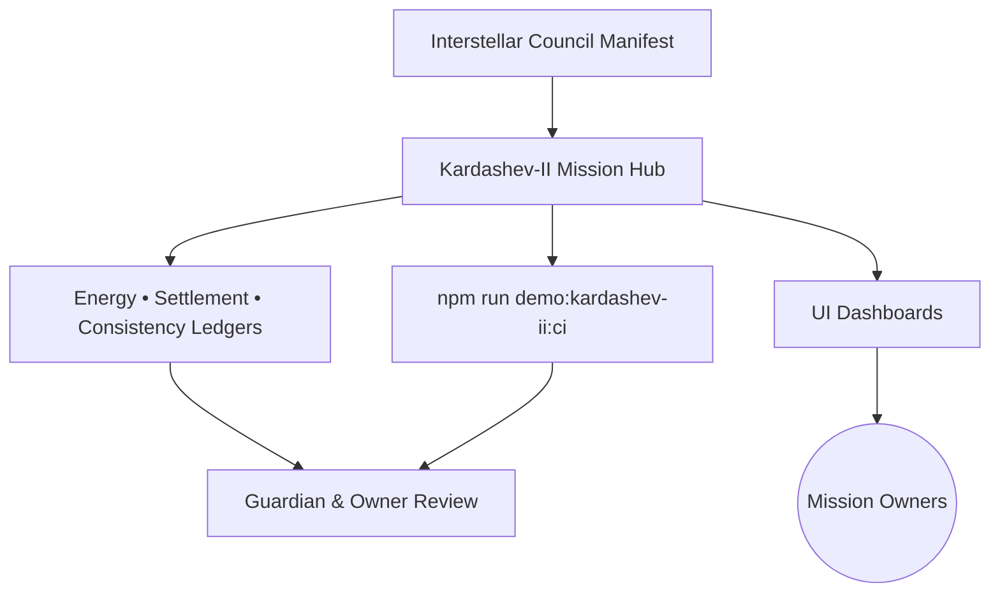
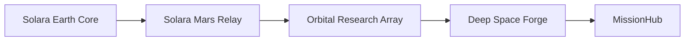

# AGI Jobs v0 (v2) — Demo → AGI Jobs Platform at Kardashev II Scale

> **Vision:** model civilization-scale coordination across energy, compute, work, logistics and human governance. This executable demo explores that vision with deterministic synthetic inputs; it does not demonstrate deployed Kardashev-II infrastructure or measured economic superiority.

This dossier is the living operator manual for `demo/AGI-Jobs-Platform-at-Kardashev-II-Scale`. It explains how to reproduce the simulation, inspect its assumptions, interpret its evidence and test changes. The command deck is read-only; it has no wallet connection or transaction submission.

## Start with a useful question

**Can the modeled mission fit its available power, compute capacity, validator coverage and governance constraints?**
The demo computes a reviewable answer from JSON inputs, then shows the allocations, warnings, stress scenarios,
unsigned call proposals and diagrams. It does not contact energy providers, bridge networks, identity services or a blockchain.
Historical fixture dates remain intact so that runs are reproducible; they are not claims of fresh observations.

| Experience | Purpose | Generate | Verify |
| --- | --- | --- | --- |
| Main command deck | Energy, task hierarchy, allocation, logistics, settlement and governance model | `npm run demo:kardashev-ii:orchestrate` | `npm run demo:kardashev-ii:ci` |
| [Sovereign Lattice](https://github.com/MontrealAI/AGIJobsv0/blob/main/demo/AGI-Jobs-Platform-at-Kardashev-II-Scale/stellar-civilization-lattice/README.md) | Four-federation variant using the same engine | `npm run demo:kardashev-ii-lattice:orchestrate` | `npm run demo:kardashev-ii-lattice:ci` |
| [Stellar](https://github.com/MontrealAI/AGIJobsv0/blob/main/demo/AGI-Jobs-Platform-at-Kardashev-II-Scale/k2-stellar-demo/README.md) | Independent, smaller orchestration model with a larger assumed energy budget | `npm run demo:kardashev-ii-stellar:orchestrate` | `npm run demo:kardashev-ii-stellar:ci` |
| Legacy Python/Node model | Earlier synthetic throughput, welfare and equilibrium experiment; different telemetry schema | `python3 demo/AGI-Jobs-Platform-at-Kardashev-II-Scale/run_demo.py --output-dir /tmp/k2-legacy` | Append `--check` to validate inputs without writing |

The legacy model remains available and is never an automatic fallback for the canonical orchestrator.
Its default output is a cache directory, keeping the canonical checked-in snapshot intact.

## Computer work: practical scopes and a path to scale

Every command deck now prominently includes **Computer work**: ten self-contained synthetic task scopes,
exact JSON drafts, required deliverables and independent acceptance criteria, plus an interactive annual capacity planner.
Start with one verifiable digital job, then model workers and human review capacity together.

Read the [complete computer-work runbook](COMPUTER-WORK.md) for the actual Chromium Supplier Desk fixture,
fault injection, OpenClaw Codex Computer Use readiness, ChatGPT Work permissions, operator admission,
evidence, reconciliation and contract finalization. The downloadable drafts use the repository's current worker schema;
they grant no authority and contact no provider. The planner is a separate local exercise, not an input to the civilization ledgers.

**USD 40 trillion/year is a user-supplied market planning assumption.** Neither universal human-task automation nor market capture
is established by this demo. Test representative capabilities in a commissioned environment and retain independent review.

## 🧭 Ultra-deep readiness map
- **Location**: `demo/AGI-Jobs-Platform-at-Kardashev-II-Scale/`
- **Operating manifest**: `config/kardashev-ii.manifest.json` (council, logistics, verification, and drill cadence).
- **Energy & compute telemetry**: `output/kardashev-energy-feeds.json`, `output/kardashev-telemetry.json`.
- **Decision ledger**: `output/kardashev-orchestration-report.md` summarises the last orchestrator pass.
- **CI gate**: `npm run demo:kardashev-ii:ci` (enforced on PRs touching this directory).

## 🚀 Kardashev-II operator quickstart
From the repository root, use the pinned toolchain:

```bash
nvm install
nvm use
npm ci
npm run demo:kardashev-ii:orchestrate
npm run demo:kardashev-ii:ci
npm run demo:kardashev-ii:serve
```

Open **http://127.0.0.1:4175/**. Stop with **Ctrl+C**. The server binds only to loopback;
it serves a snapshot and performs no wallet or provider actions. Use `-- --port 4176` if the port is occupied.
For the other variants, generate them with the commands above, then serve with
`npm run demo:kardashev-ii:serve -- --profile stellar-civilization-lattice` or `--profile k2-stellar-demo`.
`--generate` explicitly regenerates the selected profile before serving; a failed run stops startup instead of changing models.

**Expected main result:** three programmes, eleven stress scenarios, no critical scenario, and five scenario warnings
in the bundled baseline. The equilibrium warning is intentionally visible; “generated” does not mean every indicator is nominal.
Inspect `output/kardashev-run-manifest.json` for input SHA-256 hashes and simulation scope.
Inspect `kardashev-stability-ledger.json` for individual checks, not just its aggregate score.

**What check mode does:** `--check` / `--ci` recomputes artifacts, compares them byte-for-byte, checks dashboard assets,
and fails on malformed inputs or critical/high model-readiness failures. It writes nothing, including when output is missing.
Medium/low advisories remain visible. `--reflect` prints additional diagnostics; `--check` is not a generation command.

### A controlled experiment

```bash
mkdir -p /tmp/k2-experiment
cp -R demo/AGI-Jobs-Platform-at-Kardashev-II-Scale/config /tmp/k2-experiment/config
npm run demo:kardashev-ii:orchestrate -- --config-root /tmp/k2-experiment --output-dir /tmp/k2-result
npm run demo:kardashev-ii:serve -- --output-dir /tmp/k2-result
```

Change one input in the copied manifest, such as a bridge latency beyond its failsafe limit, and rerun.
The generated ledgers show the failed checks and the command exits nonzero. Restore the input and confirm recovery.
Duplicate IDs, missing references, cyclic dependencies, malformed timestamps, non-finite numbers and inconsistent
thermostat bounds fail validation before generation. Paths resolve from the current working directory;
misspelled flags and missing values fail instead of silently selecting defaults.

### How to read the model

- **Power and storage:** GW is power; GWh is energy. Regional allocation must fit captured capacity after its reserve margin
  and the thermostat budget. Planned Dyson capacity can exceed regional load; that surplus is not reconciliation drift.
  The retained delta fields show distance between those assumptions, not disagreement between independent measurements.
- **Model scores:** dominance, equilibrium, welfare, confidence and “unstoppable” are named heuristics derived from the fixture.
  They are not empirical probabilities, AGI capability benchmarks, security certifications or financial forecasts.
- **Thermostat:** legacy fields named `minKelvin`, `targetKelvin` and `maxKelvin` are normalized control parameters, not measured stellar temperatures.
- **Governance:** the Safe JSON is an unsigned proposal containing placeholder addresses. Selector decoding and hashes establish
  structural consistency only. Do not submit the bundled batch to a wallet or production chain.
- **Boundary:** authentic signing, independently verified provider integration, security review and target-network commissioning
  remain separate steps. The demo's scale is an architectural scenario, not a physical Kardashev classification measurement.

### Troubleshooting

| Symptom | Action |
| --- | --- |
| Artifact drift or missing output | Run the matching variant's generator, inspect its exit status and diff, then rerun its CI command. |
| Model readiness failure | Read the named failed check and ledger evidence; correct the assumption or retain the result as an explicitly failing stress experiment. |
| Dashboard is incomplete | Regenerate the selected profile. The page shows an error instead of silently substituting another model. |
| Port already in use | Pass `--port 4176` to the server. Invalid ports are rejected. |
| Diagram cannot render | Inspect its preserved source and regenerate assets. All three decks use the locally pinned Mermaid bundle. |
| Node/dependency error | Run the pinned Node/npm versions and `npm ci` from the repository root. Python's legacy wrapper still needs Node. |

## 🧱 Architecture overview

- `scripts/run-kardashev-demo.ts` ingests the manifest and fabric definitions to regenerate ledgers under `output/`.
- Dashboards in `index.html` + `ui/dashboard.js` ingest these ledgers to project readiness metrics for mission owners.
- CI validation (`scripts/ci-validate.ts`) replays orchestrator checks and enforces documentation parity.

## 🪪 Identity lattice & trust fabric
- Defined inside `config/kardashev-ii.manifest.json.identityProtocols` for global and federation-specific anchors.
- Identity anchors, attestation latency and coverage assumptions appear in `output/kardashev-telemetry.json`; owner-proof JSON instead describes encoded governance calls.
- Actual guardian approvals are external to this simulation. No signature is collected or authenticated by this runner.

## 🛰️ Compute fabric hierarchy

- Details live under `config/kardashev-ii.manifest.json.computeFabrics`.
- Availability, failover partner, and energy draw metrics synchronise into `output/kardashev-telemetry.json`.
- `output/kardashev-mermaid.mmd` auto-renders the hierarchy for downstream dashboards and is loaded by `ui/dashboard.js`.

## 🔌 Energy & compute governance
- Energy parameters sourced from `config/energy-feeds.json` and `config/kardashev-ii.manifest.json.energyProtocols`.
- Governance playbook stored in `output/governance-playbook.md` with explicit guardian cadence.
- Thermostat ranges are inputs to local model calculations. This runner does not send them to an external thermostat service.

## ⚡ Live energy feed reconciliation
- `output/kardashev-energy-feeds.json` captures regional supply; `output/kardashev-energy-schedule.json` cross-verifies dispatch windows.
- `scripts/run-kardashev-demo.ts` performs kahan- and pairwise-sum comparisons to eliminate reconciliation drift.
- The configured feed and cross-verification tolerances determine warnings; inspect the emitted tolerances rather than assuming a fixed ±0.1% rule.

## 🔋 Energy window scheduler & coverage ledger
- Scheduler logic resides in `scripts/run-kardashev-demo.ts` (energy schedule calculation) and writes to `output/kardashev-energy-schedule.json`.
- Coverage and reliability projections appear in `output/kardashev-energy-schedule.json`; fabric-ledger JSON describes shard routing and coverage references.
- Keep signed operational approvals separately; the generated owner-proof file is overwritten reproducibly and contains no authenticated signatures.

## 🚚 Interstellar logistics lattice
- Logistics corridors declared in `config/kardashev-ii.manifest.json.logisticsCorridors`.
- Runtime health published to `output/kardashev-logistics-ledger.json` with capacity, jitter, and buffer-day metrics.
- Logistics visualisations refresh in `index.html` via the `renderLogistics` handler inside `ui/dashboard.js`.

## 🕸️ Sharded job fabric & routing ledger
- Federation shards and job registries defined in `config/fabric.json`.
- Routing results captured in `output/kardashev-task-ledger.json`, mapping tasks to shards and guardians.
- Cross-reference validation checks declared identifiers; it cannot guarantee operational routing or consensus.

## 🎛️ Mission directives & verification dashboards
- Owner directives under `config/kardashev-ii.manifest.json.missionDirectives` map to Safe transaction bundles.
- Verification dashboards consume generated JSON ledgers. Read `output/kardashev-orchestration-report.md` alongside them; `output/kardashev-report.md` belongs to the legacy runner.
- UI entry point: `index.html` with components rendered by `ui/dashboard.js`.

## 🌐 Settlement lattice & forex fabric
- Settlement exposures and forex references export to `output/kardashev-settlement-ledger.json`.
- Treasury data originates from `config/kardashev-ii.manifest.json.interstellarCouncil` addresses.
- These are modeled exposures and finality assumptions. The runner releases no payments; the legacy `kardashev-report.md` is not a transaction receipt.

## ♾️ Consistency ledger & multi-angle verification
- `output/kardashev-consistency-ledger.json` records agreement between local calculations. Input fingerprints are in the run manifest; no guardian signatures are produced.
- CI recomputes deterministic artifacts and readiness checks. Keccak256 hashes support consistency checks, not distributed consensus or signer authentication.
- Diff noise is surfaced in `kardashev-orchestration-report.md` under the “Consistency” section.

## 🔭 Scenario stress sweep
- Stress vectors embedded within `config/kardashev-ii.manifest.json.verificationProtocols` (energy models, latency tolerances).
- Full sweep results land in `output/kardashev-scenario-sweep.json` and are summarized in `output/kardashev-orchestration-report.md`.
- Schedule a sweep post-change with `npm run demo:kardashev-ii:orchestrate -- --reflect` to attach introspection notes.

## 🪐 Mission lattice & task hierarchy
- Hierarchical missions live in `config/task-lattice.json` and include timelines, autonomy rates, and fallback plans.
- `output/kardashev-task-hierarchy.mmd` renders the mission tree for rapid situational awareness.
- Guardians cross-link tasks to sentinel coverage inside `output/kardashev-task-ledger.json`.

## 🧬 Stability ledger & unstoppable consensus
- System resilience metrics recorded in `output/kardashev-stability-ledger.json`.
- Thermostat guardrails and pause levers surfaced in `output/kardashev-owner-proof.json` for council audits.
- CI checks encoded pause/resume proposals and model readiness; it does not replay transactions on a chain.

## 🛡️ Governance and safety levers
- Pause, upgrade, and deployment levers defined in `config/kardashev-ii.manifest.json.missionDirectives.ownerPowers`.
- Guardian drill cadence (hours/minutes) is a configured assumption; see `missionDirectives.drills` in the manifest. The runner does not execute drills.
- Align with repo-level emergency playbooks under `demo/agi-governance/` for multi-mission escalations.

## 🗝️ Owner override proof deck
- Owner-call structure and payload hashes are recorded in `output/kardashev-owner-proof.json`; the unsigned batch is in `kardashev-safe-transaction-batch.json`.
- The orchestration report summarizes structural checks, not approvals from actual signers.
- No scheduled compliance export is performed by this demo. Archive reviewed artifacts separately when required.

## 📦 Artefacts in this directory
- `config/` — manifest, fabric topology, energy feeds, and mission lattice JSON.
- `scripts/` — TypeScript automation for orchestration and CI enforcement.
- `output/` — generated ledgers, complete offline dashboards, and Mermaid sources.
- `output/kardashev-equilibrium-ledger.json` — equilibrium scoring across energy, allocation, welfare, logistics, and compute fabrics.
- `ui/` — static dashboards consuming the latest artefacts.
- `k2-stellar-demo/`, `stellar-civilization-lattice/` — specialised sub-demos with their own manifests and CI rituals.
- `run-demo.cjs`, `index.html` — launchers for the operator experience.

## 🧪 Verification rituals
- **Per-change**: `npm run demo:kardashev-ii:ci` (required; fails if documentation or ledgers drift).
- **Pre-launch**: `npm run demo:kardashev-ii:orchestrate -- --check` to dry-run invariants against new manifests.
- **Full publish**: `npm run demo:kardashev` to write refreshed artefacts and dashboards.
- **Cross-demo**: `npm run demo:kardashev-ii-stellar:ci` to ensure subordinate lattice states remain aligned.

## 🧠 Reflective checklist for owners
- [ ] Have the input hashes and explicitly simulated evidence scope been inspected?
- [ ] Are energy windows (`output/kardashev-energy-schedule.json`) covering ≥ 1.1× projected demand?
- [ ] Do logistics buffers in `output/kardashev-logistics-ledger.json` exceed the minimums in the manifest?
- [ ] Has `npm run demo:kardashev-ii:ci` produced a ✔ result after your changes?
- [ ] Are mission directives in `config/kardashev-ii.manifest.json` mirrored in the directive cards rendered by `ui/dashboard.js`?
- [ ] Have unsigned proposal checks been kept separate from any real guardian approvals?

---

**Continuous alignment**: rerun `npm run demo:kardashev-ii:ci` after every change in this tree. A passing run establishes the checked model behavior and reproducibility; it does not guarantee real-world consensus.
