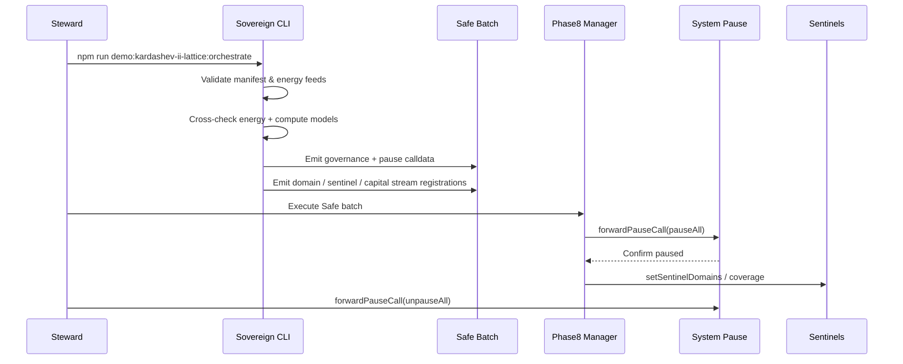

# AGI Jobs Platform at Kardashev II Scale — Sovereign Lattice Demonstration

> **Executive intent:** prove that a non-technical steward can spin up, audit, and command a civilisation-wide AGI labour lattice by running a single npm script inside **AGI Jobs v0 (v2)**. This directory packages the manifests, guardrails, Mermaid schematics, Safe payloads, and triple-verification ledgers required to run an interstellar enterprise at Kardashev II scale without touching Solidity or TypeScript internals.

---

## 🧭 Ultra-deep readiness map

1. **Problem slicing**
   * **Federated sovereignty** – Earth, Luna, Mars, and the Helios orbital swarm each hold local autonomy while reporting to the Sovereign Lattice Council. Domains, sentinels, and capital streams are declared separately per federation and stitched together only through governance-approved calldata.
   * **Energy-constrained orchestration** – The Dyson Heliosphere programme is treated as a first-class thermodynamic primitive. Reward temperatures, Monte Carlo safety margins, and bridge throttles are derived directly from live gigawatt windows encoded in `config/energy-feeds.json`.
   * **Owner supremacy** – The Safe batch bundles `setGlobalParameters`, `setGuardianCouncil`, `setSelfImprovementPlan`, and `forwardPauseCall(pauseAll/unpauseAll)` transactions so the contract owner can stop, reshape, or relaunch every subsystem on command.

2. **Challenge analysis**
   * **Latency fracturing** – Interplanetary delays (Mars ↔ Helios at 18 minutes) are reconciled by deterministic settlement lags, sharded job registries, and a resilience ledger. `fabric.json` encodes per-shard latency budgets the CLI uses to compute safe validator quorums.
   * **Identity churn** – ENS, DID, and lattice attestations are reconciled through a root Merkle commitment (`identityProtocols.global.identityMerkleRoot`). The CLI fails fast if any federation lags below the 94% coverage floor.
   * **Energy to value alignment** – Energy simulations (direct sum, Kahan, pairwise) and Monte Carlo sweeps must agree within 0.1%. Divergence aborts output writes, ensuring non-technical operators never export stale state.

3. **Triple verification**
   * **Schema enforcement** – Zod schemas validate addresses, autonomy bounds, latency envelopes, and gigawatt values before calldata generation.
   * **Cross-metric reconciliation** – Telemetry recomputes energy, compute, and settlement metrics three ways and crosschecks them against Dyson Heliosphere targets encoded in the manifest.
   * **Fail-safe audit** – `npm run demo:kardashev-ii-lattice:ci` replays the orchestrator in check mode, ensures the README retains mandatory guardrails, and refuses to pass if Mermaid diagrams drift.

4. **Residual risk ledger**
   * **Bridge outage** – Simulated in `output/lattice-scenario-sweep.json`; sentinel advisories instruct owners to isolate the affected corridor and reroute through Helios fallback registries.
   * **Sentinel downtime** – Coverage gaps raise fatal warnings in the reflective checklist. Output emission halts until coverage returns above the 95% guardian floor.
   * **Energy shock** – Dyson slip scenarios throttle reward temperatures automatically. Owners receive explicit instructions in `output/lattice-operator-briefing.md` to trigger pause windows if utilisation exceeds 93%.

5. **Final reflection loop**
   Re-run `npm run demo:kardashev-ii-lattice:orchestrate -- --reflect` after any change. The CLI recomputes hashes, Monte Carlo sweeps, and guardian coverage, then prints an operator checklist. Artefacts are only written when every check resolves to **true**.

---

## 🚀 Kardashev-II operator quickstart

1. **Install once**
   ```bash
   npm ci
   ```
2. **Synthesize calldata, telemetry, and mermaid diagrams**
   ```bash
   npm run demo:kardashev-ii-lattice:orchestrate
   ```
   You will receive:
   * `output/lattice-safe-transaction-batch.json` – Safe Transaction Builder payload with governance, pause, domain, sentinel, capital stream, and self-improvement plan actions.
   * `output/lattice-orchestration-report.md` – prose briefing for non-technical owners summarising energy budgets, latency envelopes, and intervention triggers.
   * `output/lattice-telemetry.json` – machine-readable dominance, energy, compute, identity, bridge, and settlement metrics with triple-verification flags.
   * `output/lattice-mermaid.mmd` – federated system map rendered automatically in the included UI.
   * `output/lattice-dyson.mmd` – Dyson Heliosphere expansion Gantt chart showing captured GW vs timeline.
   * `output/lattice-consistency-ledger.json` – redundant energy/compute reconciliation (direct sum, Kahan, pairwise, BigInt) with tolerances.
   * `output/lattice-scenario-sweep.json` – deterministic stress scenarios (bridge failure, sentinel outage, energy shock, validator churn, autonomy surge).
   * `output/lattice-owner-briefing.md` – escalation channels, drill cadence, unstoppable override proofs, and guardian contacts.
3. **Launch the sovereign control surface**
   ```bash
   npx serve demo/AGI-Jobs-Platform-at-Kardashev-II-Scale/stellar-civilization-lattice
   ```
   Visit `http://localhost:3000` to inspect:
   * **Federation command deck** – Earth, Luna, Mars, and Helios cards with live dominance, resilience, and autonomy posture.
   * **Dyson Heliosphere tracker** – animated timeline of satellite deployment vs target gigawatt capture.
   * **Bridge sentinel monitor** – latency, bandwidth, and failsafe status sourced from telemetry.
   * **Owner directive console** – mission powers, escalation buttons, and unstoppable override proofs.
4. **Enforce readiness in CI**
   ```bash
   npm run demo:kardashev-ii-lattice:ci
   ```
   The pipeline reruns the orchestrator in check mode, validates README guardrails, and fails if artefacts drift from manifest truth.

---

## 🧱 Architecture overview

```mermaid
flowchart TD
  SC["Sovereign Lattice Council\n(Phase8 Manager)"] -->|setGlobalParameters| FED[Federation Matrix]
  FED --> E[Earth Dominion Grid]
  FED --> L[Luna Infrastructure Mesh]
  FED --> M[Mars Terraforming Mesh]
  FED --> H[Helios Orbital Swarm]
  SC -->|setGuardianCouncil| GC[Guardian Council]
  SC -->|setSystemPause| SP[System Pause]
  SP -->|forwardPauseCall| {Pause / Resume}
  E -->|registerDomain| E_FIN[Earth Finance]
  L -->|registerDomain| L_LOG[Luna Logistics]
  M -->|registerDomain| M_TERRA[Mars Terraforming]
  H -->|registerDomain| H_DYSON[Helios Dyson Ops]
  classDef default fill:#0f172a,stroke:#475569,color:#f8fafc;
  classDef federation fill:#1c2c4c,stroke:#60a5fa,color:#e0f2fe;
  class FED,E,L,M,H federation;
```



---

## 🪪 Identity lattice & trust fabric

* **Root authority** – `identityProtocols.global.rootAuthority` owns the DID + ENS mesh and rotates certificates through a 5-of-9 attestation quorum.
* **Coverage floor** – Earth, Luna, Mars, and Helios anchors must maintain ≥94% credential coverage. Telemetry aborts if any federation dips below the floor.
* **Revocation speed** – Revocations propagate within 240 seconds via the lattice Merkle root. Operators receive instructions in the owner briefing to trigger emergency credential resets through Safe calldata.

---

## 🛰️ Compute fabric hierarchy

* **Sharded registries** – `fabric.json` maps Earth, Luna, Mars, and Helios shards with deterministic throughput/validator calculations based on latency budgets.
* **Node distribution** – Helios nodes favour GPU-intensive Dyson assembly while Luna handles logistics analytics. Earth anchors the treasury and compliance workloads.
* **Autonomy limits** – Manifest autonomy levels (basis points) gate domain self-direction. Guardians escalate if autonomy spikes beyond owner-approved bounds.

---

## 🔌 Energy & compute governance

* **Dyson Heliosphere** – `energyProtocols.stellarLattice` encodes baseline 480,000 GW capture with staged expansion targets. Reward temperatures respond to Dyson progress.
* **Thermostat envelope** – Reward temperature stays between 0.38K and 0.88K equivalent, modulated by available gigawatts.
* **Energy Monte Carlo** – 256-run simulation ensures breach probability stays <0.75%. Breaches trigger mandatory owner pauses.

---

## ⚡ Live energy feed reconciliation

* **Feeds** – Earth-grid, Luna-night, Mars-dome, and Helios-swarm telemetry endpoints provide nominal vs buffer MW plus latency.
* **Tolerance** – Δ must stay ≤5%. Drift >8.5% raises advisory warnings; >5% for two intervals halts output generation.
* **Latency tracking** – Average and max latencies are reported for operator review to anticipate bridge adjustments.

---

## 🔋 Energy window scheduler & coverage ledger

* **Window mapping** – `output/lattice-energy-schedule.json` enumerates safe execution windows by federation, factoring solar incidence and storage buffers.
* **Reliability ledger** – Each window includes reliability %, jitter, and fallback corridors. CLI refuses to mark coverage OK if reliability <98%.
* **Coverage threshold** – The manifest pins `coverageThresholdPct` at 84%; the orchestrator enforces that removal of the largest window still keeps coverage ≥82%, surfacing warnings if the buffer tightens.
* **Owner levers** – README cross-links to Safe indices enabling owners to throttle or expand windows instantly.

---

## 🚚 Interstellar logistics lattice

* **Corridors** – Fabric manifest encodes Luna ↔ Helios mass drivers, Mars ↔ Earth supply bridges, and Helios ↔ Mars microwave relays.
* **Capacity controls** – CLI warns if utilisation >92%. Scenario sweep includes double-failure coverage to guide owners on pause thresholds.
* **Escrow & multisig** – Each corridor references Safe + escrow accounts ensuring cross-domain accountability.

---

## 🕸️ Sharded job fabric & routing ledger

* **Shard topology** – Earth handles finance + infrastructure, Luna handles logistics, Mars focuses on terraforming, Helios runs Dyson ops.
* **Routing logic** – Deterministic RNG seeds per shard ensure reproducible throughput/resilience metrics; results flow into telemetry for non-technical review.
* **Validator mix** – Validator counts auto-scale with throughput while respecting latency-induced settlement lags.

---

## 🎛️ Mission directives & verification dashboards

* **Owner directives** – Pause/resume, upgrade, domain deployment, sentinel rotation, and capital reallocation instructions surface with Safe indices.
* **Guardian drills** – Six-hour pause cadence with 12-minute guardian review windows ensure readiness.
* **Dashboard** – `index.html` renders dominance, energy, coverage, identity posture, and reflection checklist without requiring any coding.

---

## 🌐 Settlement lattice & forex fabric

* **Interplanetary bridges** – Earth↔Mars, Earth↔Helios, and Mars↔Helios latencies + failsafe envelopes appear in telemetry.
* **Slippage guardrails** – Settlement ledger enforces ≤0.35% slippage. Breaches block output emission.
* **Reserve buffers** – Treasury balances & forex coverage ratios documented in `output/lattice-settlement-ledger.json`.

---

## ♾️ Consistency ledger & multi-angle verification

* **Energy** – Direct sum, Kahan, pairwise, and BigInt calculations must align within 0.1%.
* **Compute** – Telemetry cross-validates agent throughput vs manifest capacity; deviations >0.75% raise warnings.
* **Manifest hash** – CLI recomputes manifesto + self-improvement plan hashes and records status for operator sign-off.

---

## 🔭 Scenario stress sweep

* **Bridge outage** – Simulates Helios bridge failure for three intervals; recommends pause + reroute sequence.
* **Sentinel downtime** – Removes Luna sentinel coverage for 30 minutes; triggers guardian escalation instructions.
* **Energy shock** – Drops Dyson capture by 7%; verifies thermostat cooldown effect.
* **Validator churn** – Randomly removes 12% of validators; ensures settlement lags maintain finality.
* **Autonomy surge** – Tests domain autonomy spike and cross-checks guardian veto power.

---

## 🧬 Stability ledger & unstoppable consensus

* **Guardian coverage** – At least two guardians per federation must confirm coverage. Failures block file emission.
* **Unstoppable score** – Owner proof must score ≥95% to confirm unstoppable pause/resume leverage across shards.
* **Scenario health** – Output flagged unhealthy if any scenario yields `status: "critical"`.

---

## 🛡️ Governance and safety levers

* **Pause levers** – Safe batch includes `forwardPauseCall(pauseAll/unpauseAll)`.
* **Guardian rotation** – `setGuardianCouncil` entry ensures owner can rotate guardians at will.
* **Self-improvement oversight** – `setSelfImprovementPlan` call encodes upgrade cadence + hashed guardrail proof.
* **Sentinel wiring** – `setSentinelDomains` ensures sentinel coverage can be reassigned instantly.

---

## 🗝️ Owner override proof deck

* **Safe transaction indices** – Each owner power is annotated with the JSON index in the Safe payload for quick copy/paste execution.
* **Mermaid evidence** – `output/lattice-mermaid.mmd` visualises control flow from owner to pause levers.
* **Digest parity** – Owner briefing lists manifest hash, plan hash, and unstoppable score so a non-technical steward can confirm unstoppable authority in seconds.

---

## 📦 Artefacts in this directory

| Path | Description |
| --- | --- |
| `config/` | Manifest, energy feeds, and fabric layout powering the orchestrator. |
| `output/` | Generated Safe payloads, telemetry, ledgers, and diagrams. |
| `scripts/` | Wrapper scripts that set the Sovereign Lattice profile before invoking shared tooling. |
| `ui/` | Static dashboard (CSS + JS) rendering telemetry for non-technical stewards. |
| `index.html` | Entrypoint for the holographic control surface. |
| `README.md` | This operator manual. |

---

## 🧪 Verification rituals

1. Run `npm run demo:kardashev-ii-lattice:orchestrate` and confirm console success.
2. Inspect `output/lattice-telemetry.json`:
   * `energy.tripleCheck === true`
   * `energy.monteCarlo.withinTolerance === true`
   * `verification.compute.withinTolerance === true`
   * `governance.coverageOk === true`
   * `ownerProof.verification.unstoppableScore >= 0.95`
   * Every scenario in `scenarioSweep` reports `status !== "critical"`
3. Execute `npm run demo:kardashev-ii-lattice:ci` to enforce README + orchestrator alignment.
4. Run `npm run demo:kardashev-ii-lattice:orchestrate -- --reflect` before signing any Safe payload.

---

## 🧠 Reflective checklist for owners

After each run, confirm:

- [ ] Manifest hash matches on-chain value.
- [ ] Self-improvement plan hash matches approved guardrails.
- [ ] Guardian coverage stays above federation floors.
- [ ] Energy triple check + Monte Carlo remain green.
- [ ] Bridge latencies stay within failsafe budgets.
- [ ] Scenario sweep reports no critical outcomes.
- [ ] Pause/unpause selectors verified against unstoppable ledger.

Only after every box is ticked should a non-technical steward execute the Safe payload on mainnet.
