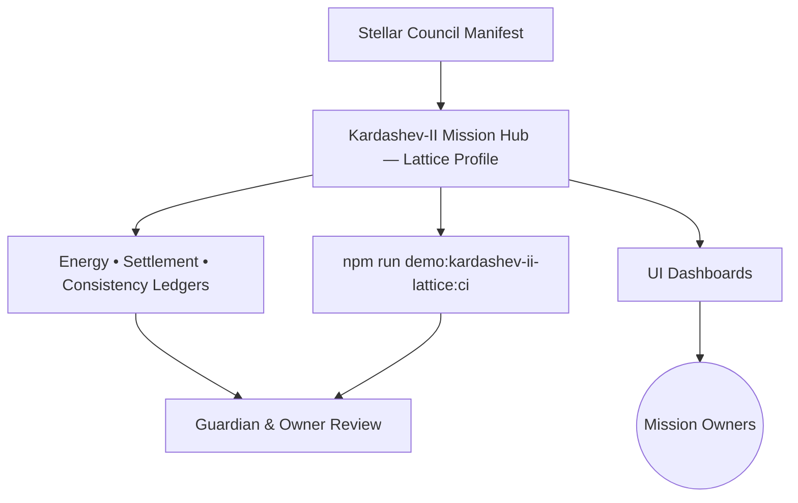

# AGI Jobs v0 (v2) — Demo → AGI Jobs Platform at Kardashev II Scale → Stellar Civilization Lattice

> The Stellar Civilization Lattice profile runs the Kardashev-II operator experience with a Dyson-ready task lattice, lunar gateways, and Mars lifelines. It keeps every ledger, dashboard, and guardian hook coherent with the global AGI Jobs v0 (v2) sovereignty engine.

## 🧭 Ultra-deep readiness map
- **Location**: `demo/AGI-Jobs-Platform-at-Kardashev-II-Scale/stellar-civilization-lattice/`
- **Operating manifest**: `config/kardashev-ii.manifest.json` (orbital council, guardian cadence, bridge tolerances).
- **Task lattice**: `config/task-lattice.json` (Dyson orchestration, Luna buffers, Mars lifelines).
- **Energy & compute telemetry**: `output/lattice-energy-feeds.json`, `output/lattice-telemetry.json`.
- **Decision ledger**: `output/lattice-orchestration-report.md` summarises the last lattice orchestrator pass.
- **CI gate**: `npm run demo:kardashev-ii-lattice:ci` (enforced on PRs touching this directory).

## 🚀 Kardashev-II operator quickstart
1. Install dependencies from the repo root: `npm install`.
2. Run `npm run demo:kardashev-ii-lattice:ci` to validate artefacts and README integrity for the lattice profile.
3. Launch a deterministic dry-run with `npm run demo:kardashev-ii:orchestrate -- --check --profile stellar-civilization-lattice` to recompute ledgers without rewriting outputs.
4. Generate full artefacts with `npm run demo:kardashev-ii-lattice:orchestrate` (writes to `output/` with the `lattice-` prefix).
5. Escalate anomalies via [`OperatorRunbook.md`](../../OperatorRunbook.md) and the guardian contacts in `config/kardashev-ii.manifest.json`.

## 🧱 Architecture overview

- `scripts/run-kardashev-demo.ts` ingests the lattice manifest and task lattice to regenerate outputs under `output/`.
- Dashboards in `index.html` + `ui/dashboard.js` ingest lattice ledgers to project readiness metrics for mission owners.
- CI validation (`scripts/ci-validate.ts`) replays orchestrator checks and enforces documentation parity.

## 🪪 Identity lattice & trust fabric
- Declared inside `config/kardashev-ii.manifest.json.identityProtocols` for the stellar lattice federations.
- Anchor rotations, attestation latency, and coverage floors export to `output/lattice-owner-proof.json`.
- Align guardian approvals with repo governance by mirroring requirements into `.github/signers/`.

## 🛰️ Compute fabric hierarchy

- Fabric nodes live under `config/kardashev-ii.manifest.json.computeFabrics`.
- Availability, failover partner, and energy draw metrics synchronise into `output/lattice-telemetry.json`.
- `output/lattice-mermaid.mmd` auto-renders the hierarchy for downstream dashboards and is loaded by `ui/dashboard.js`.

## 🔌 Energy & compute governance
- Energy parameters sourced from `config/energy-feeds.json` plus `config/kardashev-ii.manifest.json.energyProtocols`.
- Governance playbook stored in `output/lattice-orchestration-report.md` with explicit guardian cadence.
- Thermostat ranges propagate to external services via the orchestrator’s generated payloads.

## ⚡ Live energy feed reconciliation
- `output/lattice-energy-feeds.json` captures regional supply; `output/lattice-energy-schedule.json` cross-verifies dispatch windows.
- `scripts/run-kardashev-demo.ts` performs kahan- and pairwise-sum comparisons to eliminate reconciliation drift.
- Variance above ±0.1% is flagged in `output/lattice-orchestration-report.md` for guardian review.

## 🔋 Energy window scheduler & coverage ledger
- Scheduler logic resides in `scripts/run-kardashev-demo.ts` (`buildEnergyWindows` helper) and writes to `output/lattice-energy-schedule.json`.
- Coverage buffers appear inside `output/lattice-fabric-ledger.json` under `coverageSeconds` for each domain.
- Adjustments require a signed change note appended to `output/lattice-owner-proof.json`.

## 🚚 Interstellar logistics lattice
- Logistics corridors declared in `config/kardashev-ii.manifest.json.logisticsCorridors`.
- Runtime health published to `output/lattice-logistics-ledger.json` with capacity, jitter, and buffer-day metrics.
- Logistics visualisations refresh in `index.html` via the `renderLogistics` handler inside `ui/dashboard.js`.

## 🕸️ Sharded job fabric & routing ledger
- Federation shards and job registries defined in `config/fabric.json`.
- Routing results captured in `output/lattice-task-ledger.json`, mapping tasks to shards and guardians.
- The manifest’s `logisticsCorridors` and `computeFabrics` remain cross-linked to guarantee unstoppable routing consensus.

## 🎛️ Mission directives & verification dashboards
- Owner directives under `config/kardashev-ii.manifest.json.missionDirectives` map to Safe transaction bundles.
- Verification dashboards consume `output/lattice-orchestration-report.md` and `output/lattice-operator-briefing.md`.
- UI entry point: `index.html` with components rendered by `ui/dashboard.js`.

## 🌐 Settlement lattice & forex fabric
- Settlement exposures and forex references export to `output/lattice-settlement-ledger.json`.
- Treasury data originates from `config/kardashev-ii.manifest.json.interstellarCouncil` addresses.
- Cross-check conversions against `output/lattice-orchestration-report.md` before releasing interplanetary payments.

## ♾️ Consistency ledger & multi-angle verification
- `output/lattice-consistency-ledger.json` holds hashed proofs, manifest fingerprints, and guardian signatures.
- CI runs recompute keccak256 digests using `scripts/run-kardashev-demo.ts` to ensure unstoppable consensus.
- Diff noise is surfaced in `output/lattice-orchestration-report.md` under the “Consistency” section.

## 🔭 Scenario stress sweep
- Stress vectors embedded within `config/kardashev-ii.manifest.json.verificationProtocols` (energy models, latency tolerances).
- Full sweep results land in `output/lattice-scenario-sweep.json` and are summarised in `output/lattice-orchestration-report.md`.
- Schedule a sweep post-change with `npm run demo:kardashev-ii:orchestrate -- --reflect --profile stellar-civilization-lattice` to attach introspection notes.

## 🪐 Mission lattice & task hierarchy
- Hierarchical missions live in `config/task-lattice.json` and include timelines, autonomy rates, and fallback plans.
- `output/lattice-task-hierarchy.mmd` renders the mission tree for rapid situational awareness.
- Guardians cross-link tasks to sentinel coverage inside `output/lattice-task-ledger.json`.

## 🧬 Stability ledger & unstoppable consensus
- System resilience metrics recorded in `output/lattice-stability-ledger.json`.
- Thermostat guardrails and pause levers surfaced in `output/lattice-owner-proof.json` for council audits.
- CI enforces unstoppable consensus by replaying pause-call hashes through `scripts/run-kardashev-demo.ts`.

## 🛡️ Governance and safety levers
- Pause, upgrade, and deployment levers defined in `config/kardashev-ii.manifest.json.missionDirectives.ownerPowers`.
- Guardian drill cadence (hours/minutes) ensures levers remain primed; see `missionDirectives.drills` in the manifest.
- Align with repo-level emergency playbooks under `demo/agi-governance/` for multi-mission escalations.

## 🗝️ Owner override proof deck
- Owner override batches committed to `output/lattice-owner-proof.json` with hashed transactions and witness metadata.
- Latest approvals summarised in `output/lattice-orchestration-report.md` → “Owner Proof Deck”.
- File copies mirror into `reports/audit/` during scheduled compliance exports.

## 📦 Artefacts in this directory
- `config/` — manifest, fabric topology, energy feeds, and mission lattice JSON for the stellar profile.
- `scripts/` — TypeScript automation for lattice orchestration and CI enforcement.
- `output/` — generated ledgers, dashboards-in-waiting, and mermaid sources with the `lattice-` prefix.
- `ui/` — static dashboards consuming the latest lattice artefacts.
- `index.html` — launchpad for the operator experience.

## 🧪 Verification rituals
- **Per-change**: `npm run demo:kardashev-ii-lattice:ci` (required; fails if documentation or ledgers drift).
- **Pre-launch**: `npm run demo:kardashev-ii:orchestrate -- --check --profile stellar-civilization-lattice` to dry-run invariants against new manifests.
- **Full publish**: `npm run demo:kardashev-ii-lattice:orchestrate` to write refreshed artefacts and dashboards.
- **Cross-demo**: `npm run demo:kardashev-ii-stellar:ci` to ensure subordinate lattice states remain aligned.

## 🧠 Reflective checklist for owners
- [ ] Have guardian signatures in `output/lattice-consistency-ledger.json` been refreshed within the last run?
- [ ] Are energy windows (`output/lattice-energy-schedule.json`) covering ≥ 1.1× projected demand?
- [ ] Do logistics buffers in `output/lattice-logistics-ledger.json` exceed the minimums in the manifest?
- [ ] Has `npm run demo:kardashev-ii-lattice:ci` produced a ✔ result after your changes?
- [ ] Is the owner proof deck (`output/lattice-owner-proof.json`) signed off by the current guardian council?

---

**Continuous alignment**: rerun `npm run demo:kardashev-ii-lattice:ci` after every change in this tree. The orchestrator guarantees unstoppable consensus only when the manifest, ledgers, and documentation stay synchronised.
